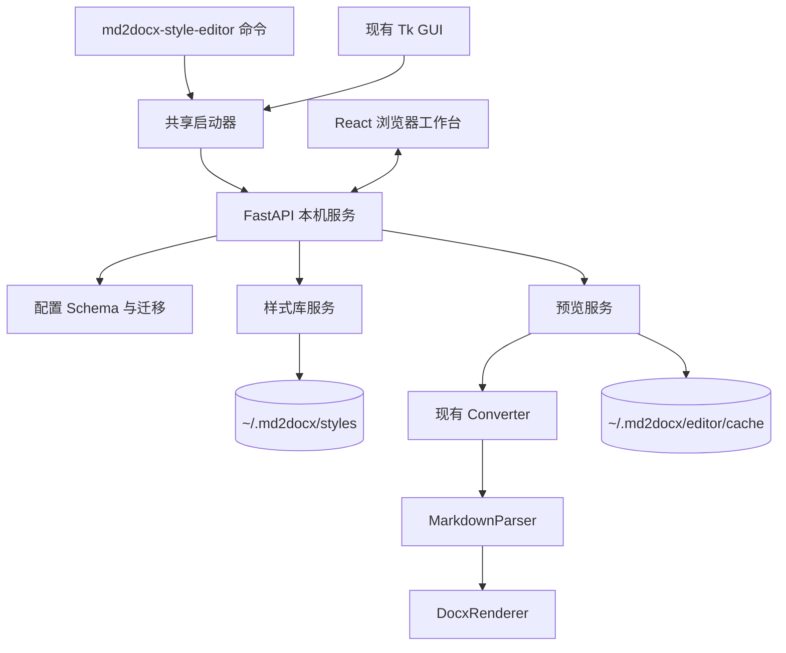

# md2docx 本机 Web 样式编辑器设计

日期：2026-07-13
状态：设计已确认，等待书面规格复核

## 1. 背景

md2docx 已有 YAML 样式配置、Tk 配置编辑窗口和稳定的 Markdown 到 DOCX 转换链路，但当前配置体验存在以下问题：

- 配置编辑与主 GUI 耦合在 `md2docx/gui.py` 中，难以独立启动和扩展。
- 内置配置包含 16 个顶层配置节和 137 个叶子参数，纯表单难以高效浏览，纯 YAML 又缺少类型提示和即时反馈。
- 默认 YAML、`StyleManager.DEFAULT_CONFIG`、文档说明和渲染器局部默认值之间存在重复与漂移。
- 部分参数当前不影响输出，导致用户修改后看不到变化。
- 现有工具不能同时提供快速反馈和 Word 实际输出核验。

本设计新增一个本机 Web 样式编辑器。它使用浏览器作为 UI，复用现有 Python 转换核心，并同时支持独立启动和从现有 Tk GUI 打开。

## 2. 目标

首版必须实现：

1. 通过本机浏览器编辑、校验和管理 md2docx YAML 样式文件。
2. 同时提供按配置节组织的表单视图和 YAML 源码视图。
3. 两种视图共享一份草稿状态，并在有效时双向同步。
4. 内置覆盖全部样式的 Markdown 标本，也允许打开用户 Markdown。
5. 提供自动刷新的内嵌近似预览。
6. 提供手动生成、打开和下载真实 DOCX 的能力。
7. 建立正式配置 schema，并补齐内置配置参数的实际渲染行为。
8. 管理本机样式库，同时支持任意 YAML 的导入、导出和显式路径编辑。
9. 提供独立命令入口，并允许现有 Tk GUI 启动同一个编辑器服务。
10. 保持现有 `Converter`、CLI 和 Python API 的兼容性。

## 3. 非目标

首版不包含：

- 多用户、账号、权限和协作编辑。
- 云端或局域网部署。
- 浏览器内精确渲染 DOCX。
- 插件市场或用户自定义渲染插件。
- 浏览器移动端的完整编辑体验。
- 数据库；样式和缓存均使用本地文件。

## 4. 已选方案

采用 FastAPI + React/TypeScript：

- FastAPI 负责配置模型、校验、样式库、文件访问、快速预览数据和真实 DOCX 生成。
- React 负责复杂表单、YAML 编辑器、草稿历史、自动预览和样式库交互。
- Python 后端是配置字段、类型、约束和默认值解析的唯一事实来源。
- 前端根据后端 schema 动态生成表单，不手工维护第二份参数清单。
- 生产构建将 React 静态资源打包进 Python 包，由 FastAPI 同源提供。

未选择 Jinja/HTMX，因为 137 个参数、双视图同步和复杂草稿状态会使交互逻辑难以维护。未选择 NiceGUI/Streamlit，因为其布局、编辑器和状态控制能力不足以支撑成熟样式工具。

## 5. 系统架构



### 5.1 启动方式

新增控制台入口：

```toml
md2docx-style-editor = "md2docx.style_editor.launcher:main"
```

独立模式运行 `uv run md2docx-style-editor`。启动器绑定 `127.0.0.1` 的随机可用端口，创建一次性启动令牌，然后打开系统默认浏览器。独立模式由命令进程持有服务，响应进程信号后安全退出。

Tk GUI 不实现第二套编辑器。原“配置编辑器”入口改为调用共享启动器，在后台线程运行服务，并在 GUI 退出时停止其拥有的服务实例。

### 5.2 开发与生产模式

- 开发模式：Vite 开发服务器运行 React，代理 `/api` 到 FastAPI。
- 生产模式：FastAPI 提供 `md2docx/style_editor/static/` 中的构建产物。
- Windows Nuitka 构建在 Python 打包前先构建前端，并将静态资源作为数据文件包含。

## 6. 推荐目录结构

```text
md2docx/
├── config/
│   ├── __init__.py
│   ├── models.py          # Pydantic 类型、约束和字段说明
│   ├── schema.py          # UI 分组、标签、选项和 schema 输出
│   ├── loader.py          # YAML 加载、合并、校验和保存
│   └── migration.py       # schema_version 迁移
├── style_editor/
│   ├── __init__.py
│   ├── app.py             # FastAPI app factory
│   ├── launcher.py        # 独立入口与 GUI 共用启动器
│   ├── api/
│   │   ├── config.py      # schema、解析和校验
│   │   ├── library.py     # 样式库 CRUD 与导入导出
│   │   └── preview.py     # 快速预览和 DOCX 预览
│   ├── services/
│   │   ├── style_library.py
│   │   ├── preview.py
│   │   ├── file_dialog.py
│   │   └── session.py
│   ├── resources/
│   │   └── style_specimen.md
│   └── static/            # React 构建产物，不放手写源码
├── templates/
│   └── default.yaml
├── config_utils.py        # 迁移期兼容门面
├── styles.py              # 迁移期兼容 StyleManager API
├── converter.py
├── parser.py
└── renderer.py

web/style-editor/
├── package.json
├── package-lock.json
├── vite.config.ts
├── src/
│   ├── app/               # 路由、全局草稿状态和启动
│   ├── api/               # FastAPI 客户端
│   ├── features/
│   │   ├── config-form/
│   │   ├── yaml-editor/
│   │   ├── preview/
│   │   └── style-library/
│   ├── components/        # 通用字段控件和布局组件
│   └── types/             # 从 OpenAPI/schema 生成的类型
└── tests/

tests/
├── config/
├── style_editor/
└── fixtures/

scripts/
└── build_style_editor.py
```

现有转换模块不会复制进 `style_editor`。`styles.py` 和 `config_utils.py` 在迁移期保留公开接口，内部逐步委托给 `md2docx.config`，避免破坏现有调用方。

## 7. 配置数据模型

### 7.1 三种配置形态

- `RawStyleConfig`：用户 YAML 解析后的原始映射，允许缺失字段和未知字段。
- `DraftConfig`：前端正在编辑的配置，可暂时存在语法或语义错误。
- `ResolvedStyleConfig`：迁移、深度合并和验证后的完整配置，只有它可以驱动预览和 DOCX 渲染。

### 7.2 默认值与 schema

`md2docx/templates/default.yaml` 继续是默认值的唯一来源。Pydantic 模型定义类型、范围、枚举、字段关系和说明，不再复制一套默认值。

解析过程固定为：

```text
原始 YAML
  → 读取 schema_version
  → 按版本迁移
  → 与内置 default.yaml 深度合并
  → Pydantic 验证
  → ResolvedStyleConfig
```

完整 schema 由模型约束、UI 元数据和当前默认 YAML 组合生成。前端通过 API 获取 schema，并从中生成字段控件、默认值、说明和可选项。

### 7.3 版本与兼容

- 新保存配置包含顶层 `schema_version: 1`。
- 没有版本字段的现有配置按版本 0 读取，再迁移为版本 1。
- 现有部分配置在合并后获得缺失默认字段，不再因节内缺字段而行为漂移。
- 未知顶层节和未知字段原样保留，保存时不丢失。
- 未知字段在表单中归入“高级/未识别字段”，并显示警告。
- 扫描器兼容字段 `root_dir`、`output_dir` 是已知可选字段，在“章节扫描”高级区展示，不按未知字段处理。
- 已有 `StyleManager(config_path)`、`Converter(style_config=...)` 和 `config_override` 调用方式继续可用。

### 7.4 字段行为补齐

schema 中出现的可编辑字段必须影响其适用输出路径。首轮至少修复：

- `document.line_spacing`：应用到 Word Normal 样式，并作为正文、列表和表格未单独设置行距时的后备值。
- `code_block.border_color`：写入代码块段落边框。
- `table.header_bold`：允许显式关闭表头加粗。
- `table.border_color`：写入表格单元格边框并覆盖内置样式边框色。
- `math_inline.height`：控制公式 PNG 降级路径的图片高度。
- `math_inline.dpi`、`math_block.dpi`：控制公式 PNG 降级渲染分辨率。
- `mermaid.soft_max_height_ratio`：成为实际的优先缩放阈值，而非未消费状态。
- `list.number_format`：同时影响文本序号和 Word 自动编号定义。

公式的尺寸和 DPI 字段在原生 OMML 路径不适用，schema 说明必须明确其作用于 PNG 降级路径。Mermaid 的 Word 输出首版只将 `png` 作为有效嵌入格式；导入的 `svg` 或 `pdf` 值会得到明确的兼容性错误，而不是在渲染阶段静默退回代码块。

### 7.5 单位和条件校验

- 页面边距和布局尺寸接受 `cm`、`mm`、`in`、`pt`。
- 字号和段落间距接受非负 `pt` 值。
- 颜色接受 `#RGB` 或 `#RRGGBB`。
- 比例字段限制在各自有意义的闭区间内。
- Mermaid 高度阈值必须满足软上限不高于硬上限，硬上限不高于整页上限。
- 条件字段在 UI 中显示适用范围，例如公式 DPI 仅影响 PNG 降级。

## 8. 样式库与文件生命周期

默认样式库目录为：

```text
~/.md2docx/styles/
```

支持新建、复制、重命名、删除、导入、导出和另存为。库内样式使用安全文件名，显示名称取自文件 stem；重命名操作原子地重命名文件，不向业务 YAML 注入编辑器专用元数据。

任意文件支持三种显式打开方式：

1. 独立入口使用 `--config /path/to/style.yaml`。
2. Tk GUI 将已知配置路径传给启动器。
3. Web 页面请求启动器的文件对话框代理；代理在应用主线程打开系统文件选择器，并为用户明确选择的文件签发会话文件句柄。

独立启动器和 Tk GUI 都向 `file_dialog.py` 提供主线程调度能力，FastAPI 工作线程不直接创建或操作 Tk 窗口。API 不接受未经授权的任意路径字符串。浏览器上传只包含文件内容和文件名时，文件会作为样式库副本导入，不猜测或覆盖原路径。

保存使用同目录临时文件、刷新到磁盘后原子替换。覆盖已有文件前保留一个 `.bak` 备份。保存失败不改变当前文件，草稿继续保留。

## 9. Web 工作台

桌面浏览器使用三栏布局：

- 左栏：样式库、搜索和配置分组。
- 中栏：表单/YAML 标签页。
- 右栏：可缩放 A4 快速预览。
- 顶栏：导入、另存、保存、生成 Word、打开 Word/WPS、下载。

主要配置分组为：

1. 文档与元数据
2. 标题与大纲
3. 正文与行内文本
4. 代码块
5. 表格
6. 列表
7. 公式
8. Mermaid
9. 章节扫描
10. 高级/未识别字段

字段控件根据类型选择：布尔值使用开关，枚举使用选择器，颜色使用色块和文本输入组合，数值使用输入框或步进器，比例使用数值输入和滑块组合。每个字段支持恢复默认值，每个分组支持整体恢复默认。

工作台显示未保存状态，并在切换样式、关闭页面或载入其他文件前提示。草稿维护有限长度的撤销/重做历史。

小于 1280px 的窗口将样式库折叠为抽屉，并将编辑区和预览区切换为标签。首版不为手机宽度优化完整编辑流程，但不得出现内容重叠或不可操作控件。

## 10. 表单与 YAML 同步

表单和 YAML 共用一份草稿，不存在独立保存路径。

### 10.1 表单修改

1. 表单按字段路径更新结构化草稿。
2. 前端立即序列化 YAML 视图。
3. 停止输入约 400ms 后提交后端校验。
4. 校验通过后更新最后有效配置和快速预览。
5. 校验失败时显示字段错误，预览保留上一次有效结果。

### 10.2 YAML 修改

1. YAML 编辑器保留原始文本和光标位置。
2. 停止输入约 400ms 后将文本提交后端解析与校验。
3. 语法错误返回行号和列号；语义错误返回字段路径。
4. 只有完整校验通过后才更新表单和最后有效配置。
5. 无效 YAML 不会被表单重新序列化覆盖。

## 11. 预览设计

### 11.1 内置标本

`style_specimen.md` 必须覆盖：

- 1 至 4 级 Markdown 标题和 4 级中文大纲。
- 普通段落、粗体、斜体和行内代码。
- 有序、无序和嵌套列表。
- 代码块和主题分割线。
- 表格、对齐、长短列和斑马纹。
- 行内公式、块级公式和 LaTeX 代码块。
- Mermaid 小图、宽图和高图。
- 本地图片和相对路径图片。

### 11.2 快速内嵌预览

快速预览是近似结果，不宣称与 Word 完全一致：

1. 后端使用安全模式将 Markdown 转换为语义 HTML，禁止执行原始脚本。
2. 前端把 `ResolvedStyleConfig` 映射为页面、字体、段落、标题、表格和列表 CSS。
3. KaTeX 渲染公式，Mermaid.js 渲染 Mermaid。
4. 配置停止变化约 400ms 后自动更新。
5. 每次请求带草稿版本；旧请求晚返回时丢弃，防止预览倒退。
6. 失败时保留上一次成功预览并显示错误区域。

### 11.3 真实 Word 预览

真实预览仅在用户点击后生成：

1. 后端用相同 `ResolvedStyleConfig` 调用现有 `Converter`。
2. DOCX 写入 `~/.md2docx/editor/cache/` 下的会话目录。
3. 文件名包含配置、Markdown 和渲染器版本的内容哈希。
4. 成功后提供“打开 Word/WPS”和“下载”两个动作。
5. 打开动作通过平台适配器调用默认 DOCX 应用。
6. 新文件生成失败时保留旧文件。
7. 服务启动和退出时清理超过保留期的会话缓存。

快速预览和 DOCX 预览均使用用户 Markdown 的真实父目录解析相对图片。浏览器上传而没有原始路径时，相对资源不可用，UI 必须提示用户改用“打开本地 Markdown”。

## 12. API 边界

首版使用以下同源 API：

```text
GET    /api/bootstrap                 schema、能力、样式列表和当前会话
POST   /api/config/parse              解析 YAML 并返回原始结构
POST   /api/config/validate           迁移、合并和验证草稿
GET    /api/styles                    列出样式库
POST   /api/styles                    新建样式
GET    /api/styles/{id}               读取样式
PUT    /api/styles/{id}               原子保存样式
POST   /api/styles/{id}/duplicate     复制样式
DELETE /api/styles/{id}               删除样式
POST   /api/styles/import             导入到样式库
GET    /api/styles/{id}/export        导出 YAML
POST   /api/files/open-config         显式选择本地 YAML
POST   /api/files/open-markdown       显式选择本地 Markdown
POST   /api/preview/html              生成快速预览数据
POST   /api/preview/docx              生成真实 DOCX
POST   /api/preview/docx/{id}/open    调用本机 DOCX 应用
GET    /api/preview/docx/{id}/download 下载 DOCX
```

API 使用结构化错误对象：

```json
{
  "code": "invalid_length",
  "message": "左边距必须是带单位的长度",
  "path": ["document", "margin_left"],
  "line": 8,
  "column": 16,
  "severity": "error"
}
```

警告与错误分开返回。缺少字体、Mermaid CLI 不可用和未知字段是警告；语法错误、非法单位、违反字段关系和不可嵌入格式是错误。

## 13. 本机服务安全

- 只监听 `127.0.0.1`，不监听所有网卡。
- 启动器生成高熵一次性令牌。首次页面请求交换为 `HttpOnly`、`SameSite=Strict` 会话 Cookie，然后重定向到无令牌 URL。
- 修改型请求验证同源、会话和 CSRF 令牌。
- 不启用跨域访问。
- 所有文件访问使用样式 ID 或会话签发的文件句柄，不使用前端提供的任意路径。
- 样式库路径经过规范化和目录边界检查，拒绝路径穿越。
- Markdown HTML 使用安全渲染和清理，不执行用户 HTML、脚本或事件属性。
- 子进程调用 Mermaid 时参数使用列表传递，不拼接 shell 命令。
- 错误响应不暴露会话令牌、环境变量或无关本机路径。

## 14. 错误处理

- YAML 语法错误：保留文本，标记行列，不更新表单和预览。
- 字段验证错误：定位到表单控件，并允许跳转到对应 YAML 行。
- 未知字段：保留并警告，不阻止保存。
- 字体缺失：显示预期字体与系统替代风险，不阻止快速预览。
- Mermaid 不可用：快速预览仍可使用 Mermaid.js；真实 DOCX 显示明确警告并阻止把代码块误当成功结果。
- 快速预览失败：保留上一次成功画面。
- DOCX 生成失败：保留上一次成功文件并返回失败阶段。
- 文件冲突：检测磁盘修改时间；外部文件已变化时要求重新载入或明确覆盖。
- 服务退出：等待正在进行的原子保存完成，取消可取消的预览任务。

## 15. 测试策略

### 15.1 配置契约

- 默认 YAML 可完整解析为 `ResolvedStyleConfig`。
- schema 字段、默认 YAML 字段和前端生成字段保持一致。
- 每个可编辑字段都有类型、说明、分组和渲染行为测试。
- 版本 0 配置可无损迁移到版本 1。
- 部分配置深度合并正确。
- 未知字段经过加载、编辑和保存后不丢失。
- YAML 往返保持值类型和语义。

### 15.2 渲染行为

- 对每个字段族生成最小 DOCX，并检查对应 WordprocessingML 属性。
- 不比较整个 DOCX 二进制文件，避免时间戳和包顺序造成脆弱快照。
- 公式测试分别覆盖 OMML 和 PNG 降级。
- Mermaid 测试覆盖软上限、硬上限、分页和上一段绑定。
- 字体测试断言请求写入的字体名，不依赖测试机实际安装字体。

### 15.3 后端与前端

- API 测试使用临时样式库和缓存目录。
- 覆盖样式 CRUD、显式文件句柄、校验、缓存和失败恢复。
- React 单元测试覆盖字段组件、表单/YAML 同步、错误定位、脏状态和撤销重做。
- 使用生成类型或契约测试确保前端类型与 OpenAPI/schema 同步。

### 15.4 端到端与构建

Playwright 覆盖：

1. 新建样式。
2. 修改表单并看到快速预览更新。
3. 在 YAML 中制造并修复错误。
4. 导入、复制、保存和导出样式。
5. 打开用户 Markdown 并解析相对图片。
6. 生成并下载真实 DOCX。

构建验证覆盖 React 生产构建、Python wheel、独立入口冒烟测试和 Windows Nuitka 打包。Python 命令与测试继续使用 `uv run`。

## 16. 实施阶段

### 阶段 1：配置契约与渲染一致性

- 新增 `md2docx.config`。
- 建立 schema、迁移和完整验证。
- 将现有加载入口委托给新模型。
- 补齐当前无效参数。
- 完成参数级 DOCX/XML 测试。

### 阶段 2：本机服务与样式库

- 新增启动器、FastAPI app、会话保护和文件句柄。
- 实现样式库、导入导出和原子保存。
- 实现 Markdown 标本和预览服务接口。

### 阶段 3：React 工作台

- 建立三栏布局和 schema 驱动表单。
- 接入 YAML 编辑、同步、错误定位和撤销重做。
- 接入快速预览、样式库和本地文件流程。

### 阶段 4：真实 DOCX 与分发

- 接入 DOCX 生成、打开、下载和缓存清理。
- 将 Tk GUI 配置入口替换为共享启动器。
- 接入 React 构建、wheel 数据文件和 Nuitka 工作流。
- 完成 Playwright 和 Windows 构建验证。

## 17. 验收标准

设计完成后的产品必须满足：

1. `uv run md2docx-style-editor` 能在浏览器打开本机编辑器。
2. 现有 GUI 能打开同一个编辑器实现，不存在第二套配置表单。
3. 默认 YAML 的全部受支持字段都能在表单或高级区查看和编辑。
4. 表单和 YAML 在有效配置下双向同步，在无效 YAML 下不丢用户文本。
5. 内置标本覆盖所有主要样式类型，修改后快速预览自动更新。
6. 用户可生成、打开并下载与现有转换器一致的真实 DOCX。
7. 样式库支持新建、复制、保存、删除、导入和导出。
8. 旧配置可迁移，未知字段可保留，部分配置可获得完整默认值。
9. schema 中每个可编辑参数都有对应的渲染行为或明确的条件适用说明。
10. 本机 HTTP 服务不能被非同源网页直接调用，也不能访问未经用户授权的任意路径。
11. wheel 和 Windows Nuitka 构建包含前端资源并通过启动冒烟测试。
