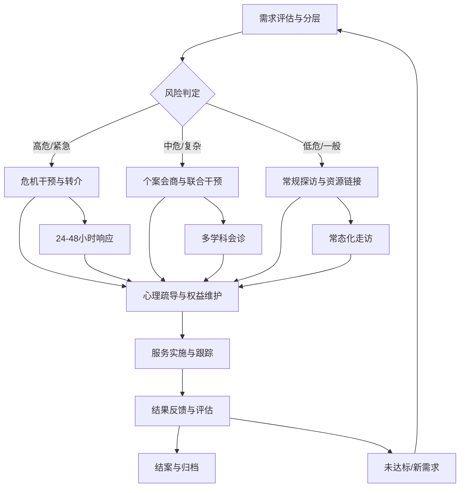

同时，建立案例库，定期提炼典型经验，形成标准化操作手册。对于共性问题，开展专题培训，提升团队整体能力。通过持续改进，不断提升个性化帮扶的质量与效果，满足武穴市困难群众日益增长的多元化需求。

```mermaid
graph TD
    A[需求评估与分层] --> B{风险判定}
    B -->|高危/紧急| C[危机干预与转介]
    B -->|中危/复杂| D[个案会商与联合干预]
    B -->|低危/一般| E[常规探访与资源链接]
    C --> F[心理疏导与权益维护]
    D --> F
    E --> F
    F --> G[服务实施与跟踪]
    G --> H[结果反馈与评估]
    H --> I[结案与归档]
    H --> J[未达标/新需求]
    J --> A
    C --> K[24-48小时响应]
    D --> L[多学科会诊]
    E --> M[常态化走访]
    K --> F
    L --> F
    M --> F
```

四、分类分层帮扶的落地执行策略

