# 武穴市社会救助联合体服务项目技术方案投标大纲

## 1. 项目理解

### 1.1 项目背景

#### 1.1.1 社会救助联合体改革背景与市级总站定位

一、社会救助联合体建设的改革背景

（一）社会救助由单项保障向分层分类、综合协同转变

社会救助工作直接关系困难群众基本生活保障、急难风险化解和基层社会治理效能。随着困难群众需求日益呈现复合化、差异化和动态化特征，传统以单项政策申请、单一资金给付为主的救助方式，已难以充分回应困难家庭在基本生活、照护支持、心理疏导、社会融入、能力提升等方面的综合需求。社会救助工作需要在落实法定救助政策的基础上，进一步加强服务类救助、社会力量参与和跨部门资源协同，形成分层分类、供需匹配、衔接有序的综合救助格局。

建设武穴市社会救助联合体，是推动社会救助从相对分散的政策执行向综合集成服务转变的重要载体。其核心不是改变各职能部门的法定职责，也不是增加新的行政审批层级，而是依托市级总站和12个镇（街道）分站，将困难群众服务入口、需求信息、政策资源、社会资源和专业服务进行有效连接，减少信息分散、重复求助、转介不畅和服务衔接不足等问题。

（二）困难群众需求由相对单一向多元复合转变

困难群众面临的问题通常不是孤立存在的。部分对象既有基本生活困难，也可能伴随疾病照护、残疾康复、就业受限、家庭关系紧张、社会支持不足等问题；部分家庭的困难具有突发性、阶段性和隐蔽性，仅依靠常规申请受理难以及时识别；部分对象虽然符合有关服务条件，但因政策知晓不足、行动不便、表达能力有限等原因，难以准确找到对应服务渠道。

上述变化要求社会救助服务在保障兜底功能的同时，形成更加便捷的服务入口、更加完整的需求记录、更加顺畅的转介协同和更加持续的跟踪反馈。市级总站需要站在全市社会救助服务体系的角度，归集共性问题、识别跨区域和跨领域事项，推动适配资源进入服务过程；镇（街道）分站则需要发挥贴近群众、熟悉辖区情况和便于持续联系的优势，使联合体形成覆盖市、镇（街道）的服务网络。

菲尔德咨询理解，本项目服务对象的核心需求可以概括为：困难能够被及时关注，诉求能够被准确记录，适用政策和服务资源能够得到有效衔接，复杂问题能够获得专业支持，办理及服务进展能够得到反馈，个人信息和人格尊严能够得到保护。上述需求是确定总站功能、总站与分站职责关系以及综合运营边界的重要依据。

（三）基层社会救助工作由部门分散响应向协同联动转变

社会救助涉及的政策、资源和服务分布于不同部门、不同层级及不同社会主体。单个镇（街道）分站受人员配置、专业能力、资源储备和服务半径等因素影响，对复杂个案、跨区域资源匹配和专业服务组织可能存在一定局限。与此同时，全市层面掌握的政策信息、项目资源和社会力量，如果缺少稳定的归集、调度和反馈机制，也难以精准进入基层服务场景。

市级总站的设置，能够在不改变部门权责边界的前提下，为市级部门、镇（街道）分站、专业服务机构和社会力量提供统一的协作支点。总站通过标准衔接、信息归集、资源统筹、业务支持和质量跟踪，将分散服务节点组织为可协同运行的网络；分站通过属地接触、情况核实、服务实施和持续反馈，为总站研判、协调和资源调度提供可靠基础。两者共同形成上下贯通、横向协同、信息可追溯的运行关系。

（四）政府购买服务为联合体专业化运行提供支撑

社会救助联合体的稳定运行不仅需要政策和行政资源，还需要持续的项目管理、专业服务组织、社会资源链接、过程记录和质量控制。通过政府购买服务引入专业承接机构，有利于将项目化管理方法、社会工作专业方法和标准化运营机制嵌入联合体日常运行，补充基层在专业人员、服务组织和资源协调方面的能力。

专业承接机构的作用是按照采购人确定的服务范围和管理要求，承担市级总站综合运营及相应支持工作，不替代民政部门及其他职能部门履行行政管理、资格认定、审核审批、资金发放等法定职责，不以专业服务判断代替行政决定。菲尔德咨询将把依法依规、权责清晰和过程留痕作为理解总站定位的基本前提，确保专业服务嵌入现有社会救助体系，而不造成职责交叉或者管理边界模糊。

项目背景分析表

| 背景维度 | 现实特征 | 对联合体建设的要求 | 对市级总站定位的指向 |
|---|---|---|---|
| 救助理念 | 从基本生活保障向分层分类、综合救助延伸 | 统筹政策救助与服务类救助 | 成为综合服务统筹和专业支持平台 |
| 对象需求 | 困难成因多样，需求具有复合性、动态性 | 提供便捷入口并促进资源适配 | 成为诉求归集、分类研判和服务协调中枢 |
| 服务资源 | 资源分布在不同部门、区域和社会主体 | 建立可查询、可链接、可调度的资源机制 | 成为全市社会救助资源汇集和链接平台 |
| 基层能力 | 镇（街道）情况熟、触达快，但资源和专业力量存在差异 | 加强标准、培训、督导和复杂事项支持 | 成为12个镇（街道）分站的业务支持平台 |
| 运行管理 | 多主体参与，过程衔接和结果反馈要求提高 | 统一记录规则，形成闭环留痕 | 成为运行监测、台账汇总和质量跟踪平台 |
| 政府购买服务 | 需要专业机构承接持续性运营事务 | 明确行政职责与专业服务边界 | 成为采购人监督下的专业化运营载体 |

二、采购目标的理解

（一）建立覆盖全市的社会救助综合服务网络

本项目不是单一活动项目或者短期慰问项目，而是以市级总站综合运营为支点，连接12个镇（街道）分站，推动形成市级统筹、镇街触达、部门协同、社会参与的社会救助服务网络。采购目标的重点在于通过专业运营提升网络的实际运行能力，使总站能够统筹、分站能够承接、事项能够流转、资源能够匹配、结果能够反馈。

（二）提升困难群众获得救助服务的便捷性和连续性

联合体需要降低困难群众识别政策、寻找部门和重复说明情况的成本。市级总站应当通过统一咨询衔接、服务事项归集和协同转介，为困难群众提供清晰、稳定的服务连接；对于需要多方参与或者持续支持的事项，应发挥统筹协调作用，避免服务在不同主体之间中断。该目标强调的是服务可及性和衔接效果，不改变具体救助事项依法依规办理的要求。

（三）提升基层社会救助专业化和规范化水平

通过总站对服务规则、记录要素、资源信息和质量要求进行归集，支持12个镇（街道）分站按照相对统一的标准开展相关工作。对分站能够属地处理的事项，总站提供规则和资源支持；对跨镇（街道）、跨部门或者专业性较强的事项，总站组织会商、链接资源或者协调专业力量。由此减少因区域资源差异和人员能力差异造成的服务落差。

（四）形成可监督、可评价、可持续改进的运营机制

采购目标还包括对服务过程和运营结果进行有效管理。总站应当汇总服务记录、分站反馈、资源使用及阶段性问题，向采购人提供真实、完整、可核验的运营信息，为阶段评审、服务调整和后续决策提供依据。评价重点既包括事项数量，也包括响应及时性、转介有效性、服务完成情况、对象反馈、台账完整性以及问题整改情况。

三、市级总站的功能定位

（一）全市社会救助联合体的综合运营枢纽

市级总站是联合体日常运行的市级承载平台，承担全市层面的综合协调、运行调度和专业支持职能。总站不等同于新增行政审批机构，也不替代镇（街道）直接联系服务对象，而是将采购人的管理要求转化为可执行的运营规则，将分站反映的问题转化为可协调的服务事项，将分散资源转化为可使用的支持条件。

（二）困难群众服务事项的综合衔接窗口

总站应当具备需求发现信息归集、一门受理衔接、事项分类和服务转介等功能。这里的“一门受理”主要体现为便民服务意义上的统一接待、登记、初步判断和衔接，不代表总站直接行使行政受理、审核审批或者资格认定权。涉及法定程序的事项，应按照权责清单和规定渠道移交相应部门办理。

（三）跨层级、跨区域事项的协同调度平台

对于单个分站难以独立完成的复杂事项、跨镇（街道）事项或者需要多类资源共同参与的事项，总站应组织信息核对、协作沟通和进度跟踪。总站重点解决“由谁衔接、如何协同、进展如何、结果如何反馈”等运营问题，不对法定责任主体作替代性决策，不以协调行为改变相关部门和单位的责任边界。

（四）专业服务和社会资源的链接平台

总站对可用于困难群众服务的政策信息、公益项目、专业机构和社会力量进行分类整理，在采购人指导和合规前提下推动供需对接。资源链接应以对象实际需要和服务适配性为依据，并对来源、用途、链接过程和使用结果进行记录，避免将资源数量简单等同于服务成效。

（五）12个镇（街道）分站的支持保障平台

总站面向分站提供规范指引、疑难事项研判、资源查询、专业咨询、人员培训和质量跟踪等支持。总站对共性问题形成统一处理口径，对个性问题保留属地研判空间；分站及时反馈服务对象变化、事项进度和资源缺口，为总站完善全市运行安排提供基础信息。

（六）项目运行信息的汇集和分析平台

总站按照采购人确认的台账范围和数据口径，汇总服务事项、资源链接、个案帮扶、活动组织和分站协同等记录，保证事项来源、处理节点、责任主体、反馈结果能够追溯。信息归集严格遵循必要、授权、安全和保密原则，不超范围采集、传播或者使用服务对象信息。

市级总站功能定位与服务边界说明表

| 功能领域 | 总站主要定位 | 服务边界 | 形成的主要记录 |
|---|---|---|---|
| 需求发现 | 汇集分站、部门及服务过程中的困难线索 | 不替代基层核查和法定认定 | 线索登记、流转及反馈记录 |
| 一门受理 | 提供咨询、登记、分类和渠道指引 | 不直接作出行政审批决定 | 接待登记、分类处置记录 |
| 协同办理 | 协调相关主体，跟踪事项进度 | 不替代责任部门履行法定职责 | 转介单、协同记录、结果反馈 |
| 资源链接 | 建立资源信息并推动供需适配 | 不承诺超出采购范围或未经确认的资源 | 资源清单、链接及使用记录 |
| 个案帮扶 | 为复杂困难提供专业评估和支持衔接 | 不替代医疗诊断、司法裁判等专业职权 | 服务计划、过程及结案记录 |
| 活动组织 | 按需求和审批要求开展服务活动 | 不开展偏离救助目标的形式化活动 | 活动方案、签到、影像及评价 |
| 台账追溯 | 统一记录要素，汇总运行信息 | 不超范围采集和使用个人信息 | 台账、统计分析及整改记录 |

四、市级总站与12个镇（街道）分站的关系

（一）组织关系上实行市级统筹与属地服务相结合

市级总站负责全市联合体运行规则衔接、综合调度和共性支持，12个镇（街道）分站负责辖区服务触达、情况了解、属地协调和持续跟进。总站与分站不是相互替代关系，也不是将所有事项集中至总站办理，而是根据事项复杂程度、资源需求和属地条件进行合理分工。

（二）业务关系上实行分级响应与双向流转

分站发现或者接收的一般事项，原则上由分站结合属地资源予以衔接；需要市级资源、跨区域协同或者专业支持的事项，可上报总站协调。总站接收的事项需要属地核实、入户联系或者持续跟踪的，应转交相应分站承接。事项流转必须明确接收主体、处理要求、反馈时限和结果状态，防止只转不办、转而不跟。

（三）资源关系上实行市级归集与属地适配

总站负责归集全市可链接资源和跨区域服务力量，分站负责掌握辖区资源、对象情况及实际使用条件。总站不以统一调配取代属地判断，分站也不将本地难以解决的事项长期滞留。双方通过资源信息共享和需求反馈，提高资源配置的针对性。

（四）管理关系上实行统一要求与过程反馈

总站根据采购人确认的要求，对记录要素、协同方式、反馈口径和质量检查提供统一支持；分站对源头信息真实性、属地服务过程和反馈内容负责。总站通过汇总分析识别共性问题并提出改进建议，分站根据阶段评审和检查意见落实整改，形成上下贯通的质量管理关系。

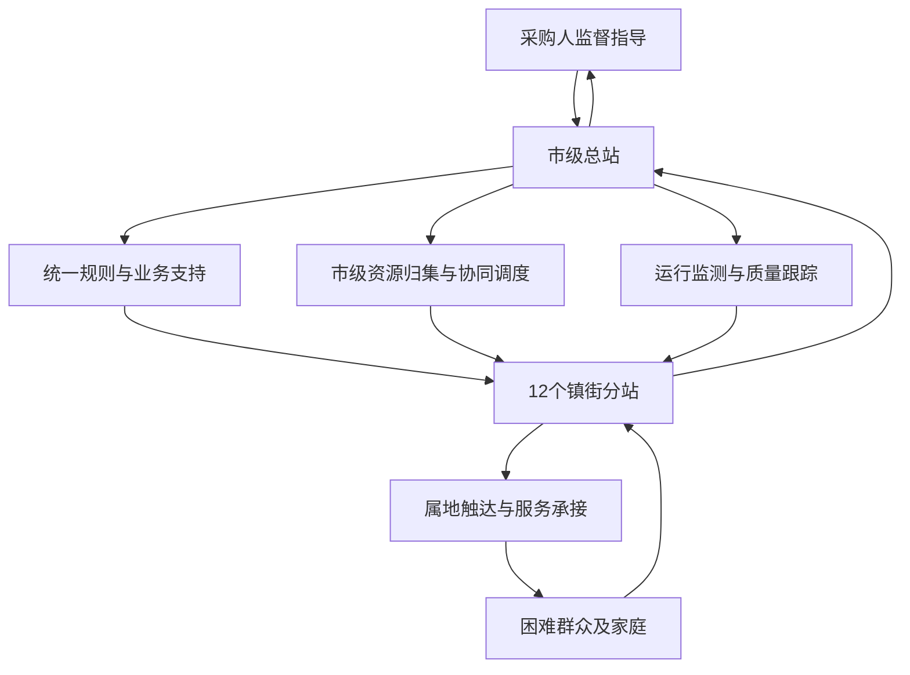

五、理解准确性的确认与检验

（一）形成项目背景分析和定位说明

项目负责人统筹梳理采购文件、采购需求、采购人管理要求和武穴市联合体运行条件，形成项目背景分析表、市级总站定位说明及总站与分站职责关系清单。相关文件重点明确改革背景、采购目标、服务对象需求、市级总站功能、12个镇（街道）分站职责以及专业承接机构服务边界，作为后续运营安排和团队分工的共同依据。

（二）以采购人确认的服务边界校准项目理解

对行政职责与专业服务、总站统筹与分站属地服务、统一要求与因地制宜之间可能存在的边界问题，菲尔德咨询将形成待确认事项清单，提交采购人确认后执行。采购文件已有明确规定的，严格按照采购文件落实；需要结合实际运行进一步明确的，以采购人书面确认或者会议纪要为依据，不擅自扩大服务范围或者调整职责关系。

（三）以阶段评审记录检验定位落实情况

在项目启动和阶段评审过程中，对照采购目标、市级总站定位及总站与分站关系，检查实际运行是否存在职责缺位、重复办理、流转不畅、记录不一致或者资源衔接偏差。检查结果纳入阶段评审记录，逐项明确问题表现、责任主体、整改措施和完成情况。通过采购人确认、阶段评审、问题整改和结果复核，使对项目背景和总站定位的理解持续落实到可审查的运营记录之中。

#### 1.1.2 需求发现与服务链条理解

一、需求发现的对象与问题特征

（一）服务对象需求具有家庭化、复合化和动态化特征

武穴市社会救助联合体服务对象主要为困难群众及其家庭。服务需求通常不以单一事项存在，而是由经济困难、照护缺失、疾病负担、就业不稳定、家庭关系紧张、心理压力、权益受损和社会支持不足等因素叠加形成。部分服务对象能够主动提出政策咨询或救助申请，部分服务对象受年龄、健康状况、信息获取能力、表达能力等因素影响，难以准确说明自身困难；还有部分家庭虽然已享受某项救助政策，但仍可能存在照护、康复、教育、就业、居住安全或社会融入方面的延伸需求。

基于上述特点，需求发现不能停留在“群众提出什么就办理什么”的被动受理层面，而应从困难群众个人延伸至家庭成员、生活环境和社会支持网络，识别显性需求背后的实际困难。对于服务对象提出的诉求，应同步判断其是否存在未表达需求、潜在风险和持续帮扶需要；对于走访排查、部门转介、数据预警发现的对象，应通过核实和评估将风险信息转化为可受理、可办理、可转介的具体服务事项。

（二）需求发现是实现采购目标的基础环节

菲尔德咨询理解，本项目服务链条需要承接社会救助联合体由分散服务向协同服务、由政策供给向需求匹配、由单次办理向持续跟踪转变的实际要求。需求发现的直接目标不是增加事项数量，而是提高困难群众需求识别的及时性、准确性和完整性，使符合政策条件的事项能够进入救助办理渠道，使超出单一救助政策范围的需求能够获得社会服务、专业服务或社会资源支持，使复杂困难家庭能够形成持续、综合的个案帮扶安排。

需求发现还承担连接困难群众与政策资源、公共服务和社会力量的作用。通过统一收集需求、分类评估需求、形成需求清单并明确办理路径，可以减少困难群众在不同窗口、部门和机构之间重复陈述、反复咨询的情况，推动形成“一次发现、综合评估、分类响应、协同办理、结果反馈”的服务过程。

（三）市级总站与12个镇（街道）分站形成上下贯通的服务关系

在具体服务链条中，市级总站与12个镇（街道）分站不是简单的信息报送关系，而是需求发现、专业支持、资源协调和结果反馈相互衔接的业务协作关系。镇（街道）分站贴近困难群众，重点承担日常接待、基层排查、入户探访、情况核实、属地资源联系和办理结果反馈；市级总站重点承接跨区域、跨部门、复杂化需求，开展需求汇总分析、专业方法支持、协同资源匹配和服务过程督导。

对于分站能够依托属地政策和资源直接回应的需求，由分站受理并跟踪结果；对于需要多个部门协同、专业力量介入或超出属地资源承载能力的需求，由分站形成必要的信息记录并转交市级总站协调；对于市级总站接收的咨询、部门转介和社会渠道线索，需要落地核查的，由对应分站开展联系、探访和反馈。总站与分站之间应形成“分站发现上报、总站研判协调、分站落地服务、总站汇总督导”的双向流转，避免需求在线索移交后无承接、在资源转介后无反馈。

二、多渠道需求收集与分层评估

（一）线上与线下渠道共同构成需求入口

线上渠道主要收集服务对象主动咨询、网络平台留言、热线转接、部门推送、基层信息报送及相关服务记录中的需求线索。线上信息收集应记录服务对象基本情况、联系方式、所在镇（街道）、主要诉求、发现渠道、紧急程度和是否已享受相关政策，避免仅保留零散文字或口头转述。

线下渠道主要包括市级总站及分站窗口接待、入户探访、集中摸排、社区走访、服务活动观察、部门联动走访以及亲属、邻里、村（社区）工作人员提供的线索。线下发现不得以服务对象是否能够准确提出申请作为唯一判断标准。对高龄、重病、重残、独居、家庭照护能力不足、遭遇突发变故以及存在心理情绪异常等情形，应主动核实生活状况和现有保障情况。

所有渠道发现的信息均应归集至统一需求清单。对来源不同但涉及同一服务对象或同一家庭的信息，应核对后合并，避免重复建立事项；对信息不完整、对象无法联系或真实性暂不能判断的线索，应标记为“待核实”，不得直接作为已确认需求进入资源转介环节。

（二）需求评估从诉求表述转向困难成因判断

需求管理岗应围绕“当前困难是什么、困难因何形成、已有保障有哪些、仍存缺口是什么、需要何种力量介入、是否存在紧急风险”开展评估。评估可以根据事项复杂程度采取电话核实、资料查验、部门信息比对、入户探访或多方会商等方式。一般咨询类事项以快速识别政策和办理路径为主；单一服务类事项重点确认服务条件、资源供给和承接主体；复杂家庭问题应开展综合评估，必要时建立个案服务。

需求评估及服务分类要点表

| 评估维度 | 重点核实内容 | 可能形成的需求类型 | 建议响应方式 |
|---|---|---|---|
| 基本生活 | 收入来源、刚性支出、食品衣物、临时困难 | 政策咨询、基本生活救助、临时帮扶 | 政策匹配、协助申请、资源补充 |
| 健康与照护 | 疾病、残疾、就医负担、自理能力、照护人员 | 医疗救助、康复支持、照护服务 | 部门转介、服务链接、持续探访 |
| 家庭支持 | 家庭结构、监护责任、亲属关系、照护压力 | 家庭关系协调、儿童或老人关爱 | 家庭评估、关爱服务、专业介入 |
| 心理与社会适应 | 情绪状态、重大变故、社会交往、风险表现 | 心理疏导、危机干预、社会融入 | 初步疏导、专业转介、跟踪观察 |
| 权益与安全 | 身份待遇、劳动纠纷、监护侵害、居住安全 | 权益咨询、法律援助、安全保护 | 政策解释、法律转介、联动处置 |
| 资源与能力 | 就业能力、个人技能、已获支持、社区资源 | 就业帮扶、能力提升、社会支持 | 岗位链接、培训转介、社会资源匹配 |

（三）形成可执行的需求清单

需求清单不是简单登记服务对象提出的原始诉求，而应体现评估后的办理判断。每项需求至少记录对象及家庭基本信息、需求来源、原始诉求、评估结论、需求类别、紧急程度、拟匹配政策或资源、承办主体、协同主体、当前状态、结果反馈和后续安排。涉及同一家庭的多项需求，应设置关联标识，分别明确办理路径，并由需求管理岗统筹先后顺序。

需求清单实行动态管理。新发现事项及时纳入，情况变化后及时更新，已完成事项记录结果，暂不具备解决条件的事项说明原因并保留跟踪计划。对服务对象明确拒绝、信息核实不实、重复受理或不属于服务范围的事项，也应记录处理依据和告知情况，确保每条需求均有明确去向。

三、从需求发现到结果反馈的完整服务链条

菲尔德咨询将需求发现、需求评估、政策与资源匹配、受理办理、个案帮扶、反馈回访和台账归档作为连续过程管理。任何环节均不能以“已转交”“已告知”代替结果确认，尤其是跨部门和跨机构转介事项，应确认接收主体、办理状态及服务对象实际获得的处理结果。

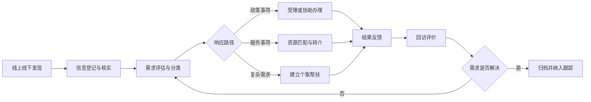

（一）信息登记与核实

窗口岗接收服务对象诉求后，应完整记录原始信息，不自行删减或概括为模糊事项；协同岗通过探访、部门联系或属地核查补充事实；需求管理岗对信息完整性和重复情况进行审核。发现涉及人身安全、基本生活中断、严重心理危机等紧急风险时，应立即标注并启动相应的快速协同处置，不等待常规流转完成后再响应。

（二）政策与资源匹配

经评估确认的需求，应分别匹配社会救助政策、基本公共服务、专业社会工作服务、心理服务、法律服务、医疗康复资源、慈善资源、志愿服务及其他社会支持。匹配时不仅核对资源名称，还应核对适用条件、服务区域、申请材料、承接能力和服务时间，避免将不适用或无法承接的资源推送给困难群众。

对于同时涉及多项政策和服务的家庭，应区分基础性、紧急性和发展性需求。影响基本生活或安全的事项优先处理；能够通过政策渠道解决的事项依法依规协助办理；政策覆盖之外的合理需求，再通过专业服务和社会资源予以补充，防止以临时物资替代应有政策保障，也防止以简单转介替代持续支持。

（三）受理办理与个案帮扶

能够直接受理的事项，由对应窗口或分站按程序办理；需要其他部门办理的事项，应协助服务对象明确申请条件、材料要求、办理渠道和联系主体；需要专业机构提供服务的，应在征得服务对象同意后完成信息转介。对涉及多个困难因素、单次服务难以解决或需要持续跟踪的对象，应纳入个案帮扶，由责任人员形成目标、措施、资源、节点和预期结果相对应的服务安排。

（四）结果反馈与持续跟踪

承办或转介后，应向服务对象反馈办理进度、处理结果及后续安排。反馈不能仅记录“已联系”“已转介”，而应核实服务对象是否成功对接、是否实际获得服务、原有困难是否缓解以及是否产生新的需求。对未解决事项，应说明卡点属于政策条件不符、材料缺失、资源不足、对象意愿变化还是协同不畅，并据此重新评估、调整路径或纳入持续跟踪。

四、个性化与项目化帮扶的五项服务要求

（一）需求评估突出个体差异

对同类困难对象不采用同一帮扶方案。需求评估应综合考虑年龄、身体状况、家庭结构、照护能力、经济来源、居住环境、服务意愿和既有支持，区分服务对象“提出的需求”“经评估确认的需求”和“需要持续观察的潜在需求”。涉及家庭成员相互影响的，应以家庭为单位分析问题，明确主要服务对象、共同受益人员及可能影响服务实施的家庭因素。

（二）探访关爱承担发现、核实和跟踪功能

探访关爱应根据对象风险程度、行动能力和支持网络安排适宜方式。探访过程中除了解生活状况外，还应核实政策落实、照护情况、居住安全、情绪变化和服务满意度。对一般对象开展常态联系，对近期遭遇重大变故、支持网络薄弱或存在风险信号的对象加强跟踪。每次探访均应记录时间、方式、发现问题、现场处理、待办事项和后续责任人，使探访结果能够直接进入需求清单和服务链条。

（三）心理疏导坚持风险识别与专业边界

窗口接待和入户探访过程中，应关注服务对象的情绪表达、行为变化和社会交往情况，采用倾听、情绪安抚、支持性沟通等方式提供初步疏导。发现持续低落、极端表达、明显行为异常或其他高风险信号时，不作未经专业评估的判断，应及时联系具备相应能力的专业机构或人员，并同步关注家庭陪伴和安全支持。心理服务信息按照必要范围记录和流转，避免无关扩散。

（四）权益维护兼顾政策解释和协助链接

对服务对象反映的救助待遇、监护照护、劳动就业、医疗服务、财产安全等权益问题，应核实事实和政策依据，说明可采取的处理渠道。属于救助政策办理问题的，协助准备材料或联系经办部门；属于法律服务范围的，转介法律援助或相关机构；涉及疑似侵害、遗弃或安全风险的，及时联动有关部门处置。权益维护过程应尊重服务对象意愿，不作超越服务职责的结果承诺。

（五）转介服务实行有接收、有反馈的闭环管理

转介前应确认服务对象知情同意、接收机构职责与承接条件；转介时提供完成服务所必需的信息，明确联系人、事项内容和期望结果；转介后核实是否接收、是否建立联系、是否提供服务。对于接收机构无法承接、服务对象未能对接或转介结果不能满足实际需求的，重新进行资源匹配，不以发出转介信息作为服务完成依据。

五、岗位协同与记录追溯

（一）需求管理岗牵引服务链条

需求管理岗负责汇总各渠道线索，审核需求信息完整性，组织分类评估，维护需求清单，确定流转路径，并对待办理、办理中、已转介、待反馈和已完成事项进行状态管理。对多需求家庭、疑难事项和长期未解决事项，需求管理岗应组织复核或协同会商，防止事项长期停留在中间环节。

（二）窗口岗和协同岗落实信息与服务衔接

窗口岗负责咨询接待、原始诉求登记、政策初步解释、申请指引和现场反馈，重点保证需求入口信息准确。协同岗负责入户核实、部门和机构联系、属地资源协调、转介跟踪及回访反馈，重点保证需求从清单进入实际办理。市级总站与分站按照事项属地、专业程度和资源范围分工承接，办理过程中的状态变化及时回传需求管理岗。

需求清单及问题闭环记录样表

| 记录项目 | 填写要求 | 闭环审查要点 |
|---|---|---|
| 对象与来源 | 记录对象、家庭关联信息、发现渠道和发现时间 | 能否定位对象及原始线索 |
| 需求与评估 | 区分原始诉求、核实情况和评估结论 | 需求判断是否有事实依据 |
| 办理路径 | 记录政策匹配、资源名称、承办及协同主体 | 是否明确具体接收去向 |
| 过程节点 | 记录受理、转介、联系、探访和补充材料情况 | 是否存在超期停滞或无人承接 |
| 结果反馈 | 记录处理结果、对象确认和未解决原因 | 是否以实际结果而非转出代替完成 |
| 后续安排 | 记录回访计划、持续服务或终止依据 | 是否形成下一步责任和时间节点 |

六、服务链条质量控制

（一）确保信息可追溯

每项需求应保留来源、评估、分派、办理、转介、反馈和归档记录，重要状态变化注明时间、经办人员和依据。口头协调形成的结果应补充书面记录，相关材料与需求编号保持关联。涉及个人敏感信息的，按照服务必要原则采集、使用和共享，落实知情告知、权限管理和资料保管要求。

（二）确保转介有去向

转介事项必须明确接收部门或机构、具体联系人、转介内容和跟踪责任。无法确认接收主体的，不标记为转介完成；接收主体退回或不具备承接条件的，及时返回需求评估环节。对多次转介仍未解决的事项，由需求管理岗提请协同研判，查明资源缺口或流程堵点。

（三）确保反馈有结果

反馈内容应能够回答“是否受理、是否办结、是否获得服务、困难是否缓解、是否需要继续跟踪”。已办结但实际困难未缓解的，不简单退出服务清单；因政策条件限制无法办理的，应完成清晰解释，并评估是否存在其他可替代资源；服务对象暂不接受帮扶的，应记录其意愿、告知内容和必要的后续关注安排。

（四）通过台账分析反向改进服务

需求台账除用于单项追溯外，还应按镇（街道）、对象类别、需求类型、办理状态、资源去向和未解决原因进行汇总，识别高频需求、重复问题、资源短缺和协同堵点。分析结果用于调整探访重点、优化需求评估口径、补充资源清单和完善总站与12个镇（街道）分站的衔接方式，使个体需求处理逐步转化为可持续改进的项目化服务机制。

### 1.2 采购目标

#### 1.2.1 综合运营目标与质效提升

一、综合运营目标体系构建

（一）总体运营愿景与核心指标设定

菲尔德咨询基于对武穴市社会救助联合体项目背景的深入研判，确立“全链条闭环、全要素协同、全周期管控”的总体运营愿景。本项目旨在通过引入专业化社会力量，打破传统救助“碎片化、被动式”局限，构建以市级总站为枢纽、12个镇（街道）分站为节点的“1+12”一体化服务网络。综合运营目标不再局限于单一的物资发放或政策宣讲，而是聚焦于构建“需求精准识别、服务高效响应、资源深度整合、效果可量化评估”的现代化社会救助服务体系。

在核心指标设定上，菲尔德咨询确立三大维度的量化目标，作为后续执行与考核的基准线。第一维度为覆盖广度，确保镇（街道）分站服务网点全覆盖，重点人群走访率达到100%，确保“不漏一户、不落一人”；第二维度为响应速度，建立“快筛-快转-快办”机制，一般性咨询即时响应，复杂个案3个工作日内完成初步介入，重大急难个案12小时内启动应急帮扶；第三维度为满意程度，服务对象满意度测评目标值设定为95%以上，投诉办结率100%，形成“服务-反馈-改进”的良性循环。

（二）质效提升的具体路径与机制设计

质效提升是本项目的核心难点，菲尔德咨询提出从“流程再造、标准统一、数字赋能、人才支撑”四个方面入手。

在流程再造方面，改变以往各部门“各管一段”的割裂状态，建立“一门受理、协同办理”的作业流。通过梳理低保、特困供养、临时救助、医疗救助等12类主要救助政策，绘制标准化服务地图，明确每一类需求对应的审批路径、时限要求和责任主体。实施“首问负责制”与“限时办结制”，确保群众办事“最多跑一次”或“一次不用跑”。

在标准统一方面，制定《武穴市社会救助助联体服务操作规范手册》，统一全市12个镇（街道）的服务流程、文书模板、评估工具及伦理守则。特别是针对个案管理，引入专业社会工作评估量表，对困难群众的生理、心理、社会支持系统进行标准化评估，避免因地域差异导致的服务质量参差不齐。

在数字赋能方面，依托现有政务数据平台，建立社会救助大数据库。通过数据比对，实现从“人找政策”到“政策找人”的转变。利用信息化手段建立电子台账，实现服务过程留痕、数据实时上传、异常自动预警。

在人才支撑方面，建立“1+3+N”服务团队模式，即每个镇（街道）配备1名项目负责人、3名全职社工、N名志愿者及政府购买服务人员。通过岗前培训、在岗督导、案例研讨等方式，持续提升一线人员的政策理解力与个案处理能力。

二、组织实施安排与任务分解

（一）项目团队架构与职责分工

为确保综合运营目标落地，菲尔德咨询构建金字塔式项目组织架构。顶层为项目指导委员会，由项目负责人、项目总监及核心专家组成，负责战略决策、重大疑难个案会诊及资源协调；中层为各片区运营组，按地理区域将12个镇（街道）划分为3-4个片区，每组设片区经理1名，负责片区内资源统筹与质量监控；底层为镇（街道）服务站点，设站长1名，负责日常接待、走访、服务落实及台账整理。

各层级职责边界清晰。项目负责人负责制定年度计划、分解月度任务、组织复盘会议及对接政府主管部门；片区经理负责片区内服务质量巡检、人员督导及突发事件应急处置；站点站长负责具体服务执行、服务对象跟踪及服务记录归档。这种架构既保证了管理的垂直穿透力，又兼顾了基层执行的灵活性与响应速度。

（二）阶段性任务实施策略

项目实施分为筹备启动期、全面展开期、深化提升期、总结验收期四个阶段，各阶段侧重任务不同。

筹备启动期（第1个月），重点完成团队组建、人员培训、系统部署及基线调查。菲尔德咨询将组织全员进行政策法规、社会工作伦理、个案工作技巧等专项培训，考核合格后方可上岗。同步开展全市困难群体摸排，建立动态管理台账，完成基线数据采集。

全面展开期（第2-10个月），重点推进“需求发现”与“协同办理”机制运行。开展常态化入户走访，每月走访覆盖率不低于规定比例。启动“个案帮扶”专项行动，针对重病、重残、高龄等高风险群体，制定“一户一策”帮扶计划。同时，联动慈善资源、志愿服务力量，开展各类互助活动。

深化提升期（第10-11个月），重点聚焦“质效提升”与“制度固化”。开展服务质量专项督导，针对前两个阶段发现的问题进行整改。举办社会救助政策宣传周、邻里互助节等活动，提升社会参与度。提炼优秀服务案例，形成可复制的经验模式。

总结验收期（第11-12个月），重点完成项目绩效自评、第三方评估配合、档案归档及经验总结。形成全套服务档案、数据分析报告及项目建议书，为政府后续决策提供依据。

三、质量控制及反馈机制

（一）全过程质量控制体系

菲尔德咨询建立“事前预防、事中监控、事后评估”的全过程质量控制体系。

事前预防环节，严格执行人员准入机制，所有上岗人员须具备相应资质，并通过背景审查。服务方案实施前，须经过项目负责人审批，确保方案符合政策要求且具备可行性。

事中监控环节，实行“日报告、周汇总、月分析”制度。一线人员每日通过移动终端上传服务记录；站点每周汇总服务数据，分析异常情况；片区经理每月开展现场检查，抽查服务记录真实性、服务过程规范性。引入神秘访客机制，定期聘请第三方对服务情况进行暗访评估。

事后评估环节，建立服务绩效评估指标体系。从过程指标（如走访次数、活动场次）、结果指标（如政策覆盖率、问题解决率）、满意度指标（服务对象评价、主管部门评价）三个维度，对每个镇（街道）分站进行月度、季度、年度绩效评估。评估结果与人员绩效考核、团队评优挂钩，形成正向激励。

（二）多维反馈与纠偏机制

建立多元化反馈渠道，确保问题及时发现、快速处置。

一是服务对象反馈。在服务现场设置意见箱，公布监督电话，开展季度满意度问卷调查。对服务对象反映的问题，建立“接诉即办”机制，24小时内回应，3个工作日内解决或反馈处理进度。

二是内部督导反馈。督导团队每月提交督导报告，指出服务过程中的共性问题、个性问题及风险点，提出改进建议。项目负责人组织专题研讨会，针对性制定整改措施。

三是主管部门反馈。定期向民政、残联、妇联等部门汇报工作进展，听取意见建议。针对部门指出的政策执行偏差、重点人群遗漏等问题，立即启动专项整改行动。

四是动态调整反馈。根据反馈信息，动态调整服务策略。如某区域突发公共卫生事件，立即启动应急响应，调整资源分配，增加心理疏导、物资配送等服务内容，确保服务方案始终贴合实际需求。

四、关键机制闭环与流程可视化

（一）需求发现与响应闭环

为直观展示质效提升机制的运行逻辑，菲尔德咨询构建如下闭环流程：

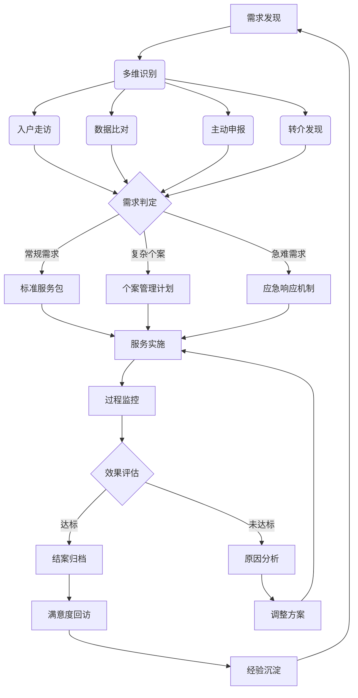

（二）关键机制说明

需求发现环节，强调“主动发现”与“被动申请”相结合。通过入户走访、数据比对、主动申报、转介发现四种途径，确保困难群体无遗漏。需求判定环节，由片区经理或项目负责人对需求性质进行分类，确保资源精准匹配。服务实施环节，执行标准化服务包或个案管理计划，确保服务质量。过程监控环节，通过数据上传、现场督导等方式，实时掌握服务进展。效果评估环节，由督导团队对服务效果进行评估，未达标者必须分析原因并调整方案，直至达标。结案归档环节，形成完整服务档案，同时开展满意度回访。经验沉淀环节，将成功案例、失败教训转化为组织知识，反馈至下一轮需求发现，形成持续改进的闭环。

五、目标分解与验收控制

（一）目标分解表编制

为确保综合运营目标可执行、可考核，菲尔德咨询制定科学的目标分解表。将年度总目标分解为季度目标、月度任务，并落实到具体责任人。

| 任务层级 | 责任主体 | 核心指标内容 | 考核频次 | 数据来源 |
| :--- | :--- | :--- | :--- | :--- |
| 年度总目标 | 项目负责人 | 重点人群走访率≥100%；满意度≥95%；投诉办结率100% | 年度 | 综合报表 |
| 季度目标 | 片区经理 | 季度案例汇编完成；督导覆盖率100%；整改完成率≥90% | 季度 | 督导报告 |
| 月度任务 | 站点站长 | 月度走访量达标；活动场次达标；台账更新及时率100% | 月度 | 移动终端数据 |
| 周任务 | 一线社工 | 周走访计划执行率≥95%；服务记录完整率100% | 周度 | 日志抽查 |

（二）验收控制标准

项目验收不仅看数量，更看质量。菲尔德咨询确立“三相符”验收控制标准。

第一，服务过程可查询。所有服务记录、走访轨迹、活动照片、资金使用情况均录入信息化平台，形成完整电子档案，支持随时调阅、追溯。纸质档案归档规范，符合档案管理要求。

第二，成果与服务相符。提交的报告、数据、案例等成果，必须与实际服务过程、服务对象反馈一致，无虚假记录、无数据造假。第三方评估结果与自评结果偏差控制在合理范围内。

第三，群众问题妥善处理。针对服务对象反映的问题，必须有记录、有回应、有结果、有反馈。抽查回访中，服务对象对问题处理结果表示满意。

（三）复盘机制与持续改进

建立月度、季度、年度三级复盘机制。月度复盘由站点站长组织，聚焦任务完成情况与执行偏差；季度复盘由片区经理组织，聚焦服务质量与资源利用效率；年度复盘由项目负责人组织，聚焦目标达成度与整体效能。复盘会议须形成书面纪要，明确改进措施、责任人与完成时限，并纳入下一周期工作计划。通过持续复盘，及时发现运营中的短板，优化服务流程，提升整体质效。

六、风险预判与应对策略

（一）数据安全风险

社会救助服务涉及大量个人隐私数据，菲尔德咨询建立严格的数据安全管理制度。所有数据存储于政府指定的安全服务器，实行分级授权访问。一线人员签署保密协议，严禁泄露服务对象信息。定期进行数据安全审计，确保数据完整性与安全性。

（二）舆情风险

服务过程中可能引发舆情，如个案处理不当引发争议、政策解读偏差引发误解等。菲尔德咨询建立舆情监测与应对机制，指定专人负责舆情监测，发现苗头立即上报。制定舆情回应预案，统一对外口径，及时澄清事实，化解矛盾。

（三）人员流失风险

基层社工流动性大，影响服务连续性。菲尔德咨询建立人才梯队培养机制，建立AB角备份制度，确保关键岗位人员流失后，工作无缝衔接。同时，通过有竞争力的薪酬体系、职业晋升通道、人文关怀，增强团队凝聚力，降低流失率。

（四）资源整合风险

社会救助需多方联动，若部门协调不畅、社会资源调动不足，将影响服务效果。菲尔德咨询建立联席会议制度，定期沟通部门需求，协调解决跨界难题。建立社会资源库，与慈善组织、企业、志愿者团队建立长期合作关系，确保资源稳定供给。

七、总结与承诺

菲尔德咨询深刻理解武穴市社会救助联合体项目“提质增效、精准兜底”的核心诉求。通过构建科学的综合运营目标体系、严密的组织实施架构、闭环的质量控制机制，菲尔德咨询承诺将以专业、严谨、务实的态度，确保项目各项指标如期达成，实现困难群众救助服务从“有”到“优”的跃升，打造全市社会救助服务标杆，为武穴市社会治理现代化贡献专业力量。

#### 1.2.2 需求导向与专业协同原则

一、确立需求导向的核心逻辑与响应机制

在武穴市社会救助联合体服务项目中，需求导向并非抽象的管理理念，而是贯穿从市级总站统筹到12个镇（街道）落地执行全过程的操作准则。菲尔德咨询深刻认识到，社会救助的核心价值在于精准回应困难群众的实际痛点，而非简单完成指标任务。因此，本项目将“以需求定服务、以效果验需求”作为首要原则，构建起从需求识别、评估、匹配到反馈优化的闭环管理体系。这一原则要求项目组摒弃传统的“供给视角”，转向“需求视角”，确保每一项服务举措均源于对服务对象现状的真实研判，每一项资源投入均指向具体问题的有效解决。

1. 构建多维度的需求识别体系

需求识别是需求导向原则落地的起点。菲尔德咨询将建立覆盖全生命周期的需求识别机制，依托入户走访、社区网格数据、部门信息共享及志愿者反馈等多渠道信息源，对困难群体需求进行全景式扫描。具体而言，需求识别不仅涵盖基本生活保障需求，更深入至精神慰藉、能力提升、社会融入及紧急救助等深层需求。

（1）实施分层分类的需求甄别
针对低保对象、特困人员、低保边缘家庭及支出型困难家庭等不同群体，设计差异化的需求评估量表。对于常规救助对象，重点关注其基本生活维持状况及动态变化风险；对于特殊群体如残疾人、未成年人及老年人，则额外纳入无障碍环境、监护支持及健康护理等专业需求。菲尔德咨询将利用大数据比对技术，将民政、卫健、人社等部门数据与实地调研结果交叉验证，确保需求信息的真实性与完整性，避免漏评或误评。

（2）开展动态化的需求追踪
需求并非静态不变，菲尔德咨询将建立需求动态监测档案。在项目实施初期，通过全面摸底形成基础需求图谱；在实施过程中，结合季度评估与专项回访，实时捕捉因季节变化、突发变故或政策调整引发的新需求。例如，针对冬季取暖安全需求与夏季高温防护需求，提前制定季节性服务包；针对因病因灾致贫的家庭，启动紧急需求响应通道。这种动态追踪机制确保了服务供给能够紧跟对象状况变化，防止因需求滞后导致的救助失效。

2. 建立精准化的需求匹配模型

识别需求后，关键在于将需求精准匹配至相应的服务资源。菲尔德咨询将构建“需求—资源—服务”的匹配矩阵，确保每一份需求都有对应的解决方案，每一份资源都指向明确的需求目标。

（1）制定标准化的服务响应指引
基于需求类型，制定标准化的服务响应指引。例如，对于生活照料需求，匹配专业护理员或志愿者上门协助；对于心理疏导需求，链接专业社工或心理咨询师；对于就业增收需求，对接技能培训与岗位推荐资源。该指引将明确各类需求的响应时限、服务标准及验收指标，使服务过程可量化、可追溯。

（2）实施个性化的服务方案定制
在标准指引基础上，针对复杂个案实施“一人一策”的个性化定制。通过个案管理会议，由项目负责人牵头，联合医务、教育、法律等多领域专家，为复杂需求制定综合干预方案。这种定制化服务不仅解决了单一问题，更通过系统性干预防止问题复发，体现了社会救助的专业深度。

二、深化专业协同的运作模式与机制

社会救助联动涉及多个行政部门、社区组织、社会力量及公益慈善资源，单一主体难以独立承担。菲尔德咨询坚持专业协同原则，旨在打破部门壁垒与资源孤岛，形成优势互补、高效运转的协同网络。这一原则强调在明确职责边界的前提下，通过机制创新实现资源的最优配置。

1. 构建多方参与的协同治理架构

（1）确立三级联动组织架构
菲尔德咨询将协助采购人建立“市级统筹—镇街落实—社区执行”的三级协同架构。市级总站负责政策制定、资源调配与监督考核；12个镇（街道）分负责区域协调、任务分解与过程督导；社区及村组负责信息采集、日常探访与基础服务。各级主体职责清晰，权限分明，既保证政令畅通，又激发基层活力。

（2）组建专业化协同团队
项目组将整合民政、卫健、残联、妇联、团委等部门工作人员，以及专业社工、心理咨询师、法律顾问、医疗专家等社会力量，组建跨领域协同团队。团队成员定期开展联合培训，统一服务标准与伦理规范，提升跨专业协作能力。例如，在处理精神障碍患者救助案例时，由民政干部、社区医生、专业社工及家属组成个案小组，共同制定监护与生活支持计划。

2. 建立高效的协同作业机制

（1）实行常态化会商制度
菲尔德咨询将建立月度联席会议与专项会商机制。月度会议通报各区域服务进展，协调解决跨部门、跨区域问题；针对重大突发个案或复杂需求，启动专项会商，由项目负责人召集相关方现场研判，快速形成解决方案。会商结果形成纪要，明确责任人、完成时限及跟踪机制，确保协同决议落地见效。

（2）搭建信息共享互通平台
依托数字化手段，建立社会救助数据共享平台。在严格保护个人隐私前提下，打通民政、医保、残联等部门数据壁垒，实现救助对象信息实时共享。项目组通过平台监测对象动态，及时发现潜在风险，触发协同响应。例如，当医保数据显示某低保家庭大额医疗支出异常时，系统自动预警，触发民政、卫健及慈善资源的联合介入，实现从“被动申请”向“主动发现”转变。

三、整合社会资源与强化全程跟踪

社会救助联动的生命力在于广泛动员社会资源，并通过全程跟踪确保资源使用效率。菲尔德咨询将充分发挥承接机构在资源整合与项目管理方面的优势，构建开放、共享、可持续的资源联动体系。

1. 拓展社会资源链接渠道

（1）发现与链接多元资源
菲尔德咨询将系统梳理武穴市及周边地区的社会组织、志愿者团队、爱心企业及公益慈善资源，建立动态资源库。通过与慈善总会、红十字会、企业工会、行业协会等建立战略合作关系，定向链接医疗、教育、就业、物资等专项资源。例如，与爱心企业签订结对帮扶协议，为困难家庭提供就业岗位或实习机会；与医疗机构合作，为困难群体提供义诊、慢病管理等服务。

（2）规范资源使用标准
为确保资源使用符合项目目标与伦理规范，菲尔德咨询将制定《社会资源使用指引》。明确各类资源的适用对象、使用条件、审批流程及监管要求。例如，物资捐赠需经项目组审核需求匹配度后分发，避免资源错配或浪费；志愿服务需经过岗前培训与背景审查，确保服务专业性与安全性。

2. 实施全过程跟踪评估

（1）建立资源使用台账
菲尔德咨询将为每一份社会资源建立使用台账，记录资源来源、提供时间、服务对象、使用效果及反馈信息。通过台账分析，评估资源使用效率与满意度，为后续资源链接提供依据。例如，定期统计爱心企业岗位转化率、医疗资源利用率等指标，优化资源配置策略。

（2）开展效果反馈与优化
服务对象对资源使用的反馈是评估协同效果的关键。菲尔德咨询将建立定期回访与满意度调查机制，收集服务对象对服务内容及资源提供的意见。针对反馈问题，及时调整服务方案或资源链接策略，形成“评估—反馈—优化”的改进闭环。例如，若发现某类物资需求率低，则调整采购计划，转向更受需求的服务形式。

四、需求导向与专业协同的融合实践

需求导向与专业协同并非孤立存在，而是相互支撑、有机统一的整体。菲尔德咨询将通过具体的操作流程与工具包，将两项原则融合于日常服务之中，确保其可操作、可证明、可审查。

1. 制定标准化操作工具包

（1）开发需求评估与服务匹配工具
菲尔德咨询将开发一套标准化评估工具，包括《困难群众需求评估表》《服务资源匹配矩阵》《协同案例处理流程图》等。这些工具将嵌入项目管理系统，辅助工作人员规范操作，减少主观偏差，提升服务一致性。例如，《需求评估表》采用结构化问题设计，通过打分方式量化需求紧迫程度，为资源匹配提供客观依据。

（2）编制协同作业指导手册
编制《社会救助协同作业指导手册》，涵盖多部门协作流程、资源链接规范、个案管理步骤等内容。手册将结合典型案例分析，为工作人员提供实操指引，提升协同效率。例如，针对未成年人关爱服务，手册明确民政、教育、妇联及社工的职责分工与协作节点，确保服务无缝衔接。

2. 建立动态调整与边界控制机制

（1）实施服务方案动态调整
在坚持需求导向与专业协同原则基础上，菲尔德咨询将根据实施效果与外部环境变化，对服务方案进行动态调整。调整需遵循既定程序，由项目负责人组织评估，形成调整依据报告，报采购人备案。例如，若发现某镇（街道）因人口流动导致需求结构变化，则调整该区域服务重点与资源配置。

（2）严守项目边界控制
在动态调整过程中，菲尔德咨询将严守项目性质、人员数量、合同金额及主要服务范围边界。任何调整不得突破合同约定，不得改变项目的公益性与专业性。调整依据需清晰记录，确保变更过程透明、合规。例如，增加某项服务频次需通过评估证明必要性，并控制在合同总额内，通过优化其他环节开支实现平衡。

五、关键流程可视化与责任落实

为确保需求导向与专业协同原则落地，菲尔德咨询通过流程图与责任清单，明确各环节操作规范与责任主体，提升执行效率与合规性。

1. 需求响应与协同处理流程

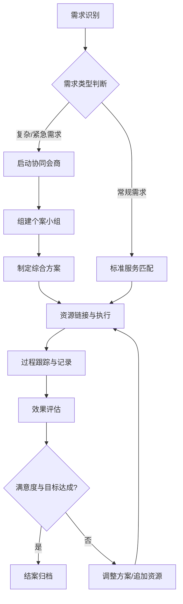

2. 核心角色职责与协同事项清单

为强化执行性，菲尔德咨询梳理核心角色职责及关键协同事项，形成清单化管理，确保责任到人、事项落地。

表1 核心角色职责与协同事项清单

| 角色/主体 | 核心职责 | 协同事项示例 | 责任边界与要求 |
| :--- | :--- | :--- | :--- |
| 菲尔德咨询项目组 | 总体统筹、质量监控、资源链接、培训督导 | 组织月度会议、审核个案方案、链接社会资源 | 不直接替代政府部门行政职能，重点提供专业服务与管理支持 |
| 市级总站 | 政策指导、资金监管、绩效考核 | 审批重大调整、发布政策指引、通报考核结果 | 确保政策统一性与资金合规性，授权项目组开展专业服务 |
| 镇（街道）分 | 区域协调、任务分解、过程督导 | 组织社区探访、协调本地资源、解决属地问题 | 确保任务分解合理、督导到位，配合项目组开展专业服务 |
| 社区/村组 | 信息摸排、日常探访、基础服务 | 提供基础数据、协助入户、反馈群众需求 | 确保信息真实、探访及时，遵守保密与伦理规范 |
| 社会力量 | 专业服务、资源提供、志愿支持 | 提供医疗、心理、就业等专业服务，捐赠物资 | 签订合作协议，遵守项目规范，接受项目组监督 |

表2 社会资源链接与跟踪管理要点

| 资源类型 | 发现与链接方式 | 使用规范 | 跟踪评估指标 |
| :--- | :--- | :--- | :--- |
| 政府部门 | 建立联席会议、数据共享平台 | 依据政策规定，合规使用 | 数据共享及时率、政策响应时效 |
| 社会组织 | 签订战略合作协议、参与招投标 | 按协议约定提供服务，接受考核 | 服务完成率、满意度、专业性 |
| 志愿者 | 招募培训、建立志愿库 | 岗前培训、保险覆盖、定期督导 | 服务时长、参与度、稳定性 |
| 爱心企业 | 结对帮扶、公益采购 | 资源匹配需求，避免错配 | 资源转化率、受益人数、持续性 |
| 公益慈善 | 项目合作、资金捐赠 | 专款专用，公开透明 | 资金使用合规性、受益范围、影响力 |

六、实施保障与合规性审查

为确保上述原则与机制有效运行，菲尔德咨询将建立完善的保障体系与合规审查机制，防范风险，提升项目可持续性。

1. 强化项目管理与质量控制

（1）建立质量监控体系
菲尔德咨询将建立三级质量监控体系：项目组日常巡查、镇（街道）分月度抽查、市级总站季度评估。通过抽查服务记录、回访服务对象、核查资金用途等方式，监控服务质量。针对发现的问题，下发整改通知书，限期整改并复核。

（2）实施风险预警与应对
针对项目实施中可能出现的风险，如资源短缺、人员流失、舆情危机等，制定应急预案。建立风险预警指标体系，如资源使用异常波动、投诉率上升等，触发预警机制。项目组迅速启动应急响应，协调资源，化解风险，确保项目平稳运行。

2. 确保合规性与可追溯性

（1）规范档案管理与记录
菲尔德咨询将建立标准化档案管理制度，确保所有服务过程、资源使用、协同会议均有据可查。档案包括需求评估表、服务记录、协同纪要、资源台账、评估报告等，分类归档，电子与纸质同步保存，保存期限符合合同要求。

（2）接受监督与审计
项目接受采购人、财政部门及社会监督。菲尔德咨询将定期公开项目进展、资金使用及服务成效，接受审计与社会监督。针对审计发现的问题，积极配合整改，完善内控机制，提升项目透明度与公信力。

通过上述需求导向与专业协同原则的系统构建与实施，菲尔德咨询将确保武穴市社会救助联合体服务项目精准回应困难群众需求，高效整合社会资源，形成多方协同、专业规范、可持续运行的服务格局，切实提升社会救助质效，助力共同富裕与社会和谐。

### 1.3 服务对象需求

#### 1.3.1 困难群众多渠道需求识别

一、渠道体系构建与动态采集机制

（一）构建“五位一体”立体化需求感知网络
菲尔德咨询基于武穴市社会救助现状，设计并实施由“窗口主动受理、线上数字筛查、入户深度探访、部门信息转介、社会力量兜底发现”组成的多渠道需求识别体系。该体系旨在突破传统单一申请制的局限，通过被动受理与主动发现相结合、线上数据比对与线下核实相印证的方式，实现救助对象的早发现、早干预、早帮扶。

1. 窗口咨询与主动受理渠道
依托武穴市及12个镇（街道）的民政服务窗口、村（社区）党群服务中心，设立“社会救助咨询专员”岗位。该渠道不仅承担常规的救助申请受理职能，更强化“需求挖掘”属性。
（1）设立“需求初诊”环节：在受理低保、特困、临时救助等申请时，社工同步开展非经济状况需求评估，关注申请人及家庭成员在医疗康复、心理支持、就业帮扶、权益维护等方面的隐性需求。
（2）建立“未申请人群”关注机制：针对因信息不对称、畏难情绪或认知障碍未主动申请的人员，通过窗口宣传、政策解答等互动，引导其进入救助视野，避免“漏保”“漏救”。
（3）形成“窗口-后台”联动：窗口收集的非结构化需求信息，即时录入系统并生成工单，推送至后台需求评估岗进行专业化分类与研判。

2. 线上数字筛查与预警渠道
利用武穴市政务数据共享平台及社会救助信息系统，建立多维度数据比对模型，实现“数据找人”。
（1）重点监测指标设定：整合低保、特困、临时救助、医疗支出、残疾人证、学籍、房产、车辆、工商登记等数据，设定贫困风险预警阈值。
（2）动态比对规则：每月执行一次全量数据比对，每周执行一次重点人群（如高额医疗支出、突发意外事故、长期失业等）动态监测。
（3）异常线索推送：对系统预警的疑似困难家庭，生成“待核实清单”，推送至镇（街道）社工站，启动线下核实程序。

3. 入户探访与网格巡查渠道
依托12个镇（街道）社工站及村（社区）网格员，建立“定期探访+即时响应”机制。
（1）定期探访计划：对在册低保、特困、分散供养特困人员、残疾人等重点对象，每月至少开展一次面对面探访，重点了解健康状况、照护需求、家庭关系及生活满意度。
（2）网格巡查发现：网格员在日常巡查中，对辖区内新出现的精神障碍患者、孤寡老人、困境儿童、遭遇突发变故家庭等，即时报告并启动需求识别流程。
（3）探访标准化：统一使用《困难群众需求识别探访表》，记录家庭结构、收入来源、主要困难、迫切需求及资源链接情况，确保信息采集的规范性和可比性。

4. 部门间转介与信息共享渠道建立跨部门协作机制，打通民政、卫健、教育、人社、住建、残联等部门信息壁垒。
（1）建立“绿色通道”：对医院出院的高额医疗费用患者、学校排查的困境儿童、残联登记的重度残疾人等，由相关部门通过“社会救助联合体”平台直接转介至菲尔德咨询项目组。
（2）即时响应机制：对部门转介线索，项目组须在24小时内启动初步需求评估，3个工作日内完成实地核实与需求建档。
（3）信息反馈闭环：将核实结果及帮扶建议反馈至转出部门，形成“发现-转介-核实-帮扶-反馈”的闭环管理。

5. 社会力量与群众发现渠道
动员慈善组织、社会服务机构、志愿者队伍及热心群众，建立“随手拍”“吹哨人”制度。
（1）建立“社会救助帮帮团”：在12个镇（街道）招募退休干部、党员、志愿者等，组建帮帮团，发挥其熟悉社区、贴近群众的优势，及时发现隐性贫困人口。
（2）建立“吹哨人”奖励机制：对提供有效线索、帮助困难群众获得救助的吹哨人，给予适当物质或精神奖励，激发社会力量参与热情。
（3）建立舆情监测机制：关注本地论坛、社交媒体等舆情信息，对涉及困难群众生活的负面舆情，及时介入调查核实。

（二）需求识别的关键要素与标准化操作
为确保多渠道收集信息的准确性与有效性，菲尔德咨询制定统一的需求识别标准，明确识别对象、识别内容及识别流程。

1. 识别对象全覆盖
（1）在册救助对象：包括低保家庭、特困供养人员、低保边缘家庭、刚性支出困难家庭等。
（2）潜在救助对象：包括突发意外事故致困家庭、重大疾病患者家庭、重度残疾人家属、困境儿童家庭、精神障碍患者家庭等。
（3）特殊群体：包括留守老人、留守儿童、留守妇女、孤寡老人、空巢老人等。

2. 识别内容多维度
（1）基本生活需求：食品、衣物、住房、取暖、饮水等基本生存保障需求。
（2）医疗健康需求：疾病诊疗、康复护理、长期照护、健康管理等需求。
（3）教育就业需求：子女入学、技能培训、就业安置、创业扶持等需求。
（4）心理社会需求：心理疏导、情感支持、社会融入、权益维护等需求。
（5）特殊关爱需求：针对困境儿童、重度残疾人、失独家庭等群体的个性化关爱需求。

3. 识别流程标准化
（1）信息收集：通过窗口、线上、入户、转介、社会力量等渠道收集线索。
（2）初步筛选：信息收集岗对线索进行去重、分类、初步研判，剔除无效线索。
（3）实地核实：由专业社工或网格员组成核实小组，入户走访，核实家庭情况。
（4）需求评估：由需求评估岗运用专业工具，对家庭需求进行全面、深入评估。
（5）建档入库：将评估结果录入系统，形成“一户一档”，明确需求类型、紧迫程度、帮扶建议等。

多渠道需求识别机制表

| 渠道名称 | 主要形式 | 识别重点 | 响应时效 | 责任主体 |
| :--- | :--- | :--- | :--- | :--- |
| 窗口咨询 | 现场受理、政策咨询 | 显性申请、隐性需求挖掘 | 即时 | 窗口专员 |
| 线上筛查 | 数据比对、系统预警 | 潜在贫困人口、突发致困家庭 | 24小时 | 数据分析师 |
| 入户探访 | 定期走访、即时响应 | 在册对象状态、新出现困难 | 3天 | 社工、网格员 |
| 部门转介 | 平台推送、绿色通道 | 医疗、教育、残联等重点人群 | 24小时 | 部门联络员 |
| 社会力量 | 随手拍、吹哨人 | 隐性困难、邻里互助需求 | 48小时 | 帮帮团、志愿者 |

二、信息登记与初筛管理

（一）建立最小必要原则的信息登记制度
菲尔德咨询严格遵守《个人信息保护法》及社会救助相关规定，建立“最小必要、合法合规、安全可控”的信息登记制度。

1. 信息收集范围
（1）基本信息：姓名、性别、年龄、身份证号、户籍地、居住地、联系方式等。
（2）家庭信息：家庭成员关系、职业、收入来源、主要资产情况等。
（3）困难信息：疾病诊断、残疾等级、突发事故、主要支出、迫切需求等。
（4）救助记录：既往救助情况、正在享受的帮扶措施、未解决的需求等。

2. 信息登记规范
（1）统一格式：使用标准的《困难群众需求识别登记表》，确保字段完整、逻辑清晰。
（2）来源标注：明确信息的来源渠道（如窗口、线上、入户等），便于溯源核查。
（3）敏感信息保护：对身份证号、病历、家庭隐私等敏感信息，采取脱敏处理、加密存储等措施，严禁泄露。
（4）动态更新：建立信息动态更新机制，对家庭状况变化、需求变化等，及时更新记录，确保信息时效性。

（二）实施专业化初筛与分类
信息收集岗对多渠道收集的信息进行初步筛选与分类，确保后续评估资源的精准投放。

1. 去重与合并
（1）同一家庭多渠道线索合并：对同一家庭来自不同渠道的线索，进行合并处理，避免重复核实。
（2）历史线索比对：与新线索比对历史档案，识别需求变化或新增需求。

2. 真实性研判
（1）逻辑校验：对收入、支出、资产等数据进行逻辑校验，识别异常数据。
（2）交叉验证：对关键信息（如疾病诊断、残疾等级等），通过部门数据、医院证明、残疾人证等进行交叉验证。
（3）实地预访：对存疑线索，由网格员进行快速预访，核实基本事实。

3. 需求分类
（1）紧急需求：涉及生命安全、基本生存保障的需求，如突发重病、危房居住等，标记为“红色预警”，启动应急响应。
（2）重要需求：涉及健康、教育、就业等影响生活质量的需求，标记为“黄色预警”，优先处理。
（3）一般需求：涉及心理支持、社会融入等长期性、持续性需求，标记为“蓝色预警”，纳入常规帮扶计划。

4. 初筛结果输出
（1）生成《待评估线索清单》：明确待评估对象、线索来源、初步需求判断等。
（2）生成《无效线索反馈》：对无效线索，反馈至来源渠道，优化信息收集质量。
（3）生成《紧急需求上报》：对紧急需求，立即上报市级总站及相关部门，启动紧急救助程序。

三、需求清单形成与质量控制

（一）构建结构化需求清单
菲尔德咨询将初筛后的信息转化为结构化的需求清单，为后续个性化帮扶提供依据。

1. 需求清单要素
（1）对象画像：家庭结构、经济状况、健康状况、社会支持网络等。
（2）需求列表：按紧急程度、需求类型，列出具体需求项目。
（3）需求描述：对每项需求进行详细描述，明确需求背景、现状、期望目标等。
（4）资源匹配：初步建议匹配的资源，如医疗资源、教育资源、就业资源、心理资源等。
（5）帮扶建议：提出初步的帮扶策略，如转介服务、直接服务、资源链接等。

2. 需求清单生成流程
（1）信息整合：将多渠道信息整合至单个对象档案。
（2）需求提炼：由需求评估岗提炼核心需求，剔除干扰信息。
（3）清单生成：系统自动生成结构化需求清单。
（4）专家复核：由资深社工或专家对清单进行复核，确保准确性。

（二）实施全流程质量控制
为确保需求识别的准确性与合规性，菲尔德咨询建立全流程质量控制机制。

1. 数据质量监控
（1）完整性检查：检查必填字段是否完整，避免信息缺失。
（2）准确性校验：通过数据比对、实地核实等方式，校验数据准确性。
（3）时效性监控：监控信息更新时间，确保反映最新状况。

2. 安全合规监控
（1）权限管理：实施分级授权，不同岗位只能访问其权限范围内的信息。
（2）操作审计：记录所有信息访问、修改、导出操作，确保可追溯。
（3）隐私保护：对敏感信息进行脱敏处理，严禁在非安全环境下存储、传输。

3. 质量考核机制
（1）定期抽检：每季度对需求识别记录进行抽检，评估识别准确率、完整性。
（2）问题整改：对抽检发现的问题，要求责任人限期整改，并纳入绩效考核。
（3）持续优化：根据抽检结果，优化识别标准、流程、工具，提升识别质量。

四、协同机制与闭环管理

（一）建立部门协同与信息共享机制
菲尔德咨询推动建立民政、卫健、教育、人社、住建、残联等部门信息互通、业务协同机制。

1. 信息互通
（1）建立数据共享平台：打通部门间数据壁垒，实现实时数据交换。
（2）建立定期通报机制：每月通报各部门转介线索的处理情况及需求识别结果。

2. 业务协同
（1）建立联席会议制度：每季度召开联席会议，协调解决跨部门帮扶难题。
（2）建立联合走访机制：对复杂个案，组织多部门联合走访，提供一体化服务。

（二）建立需求识别闭环管理
为确保需求识别成效，菲尔德咨询建立“识别-评估-帮扶-反馈-优化”闭环管理机制。

1. 帮扶执行
（1）精准匹配：根据需求清单，精准匹配帮扶资源与服务。
（2）过程跟踪：对帮扶过程进行全程跟踪，记录服务内容与效果。

2. 效果评估
（1）定期评估：对帮扶效果进行定期评估，识别需求满足情况。
（2）动态调整：根据评估结果，动态调整帮扶策略，确保需求得到持续满足。

3. 反馈优化
（1）结果反馈：将帮扶结果反馈至部门、社会力量，形成正向激励。
（2）流程优化：根据反馈结果，优化需求识别流程，提升识别效率与质量。

困难群众多渠道需求识别流程图

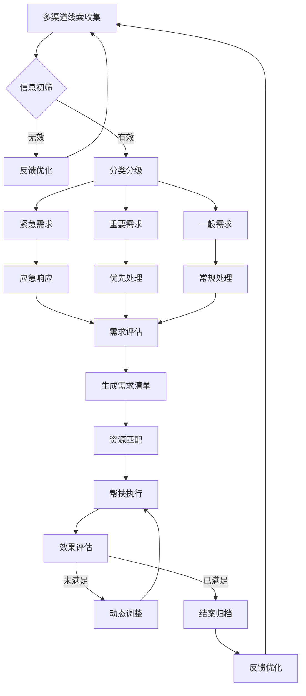

（三）建立监督与问责机制
为确保需求识别工作的公正性与有效性，菲尔德咨询建立监督与问责机制。

1. 内部监督
（1）设立监督岗位：由质量管理部门对需求识别全流程进行监督。
（2）定期审计：对需求识别记录、帮扶过程进行定期审计，确保合规。

2. 外部监督
（1）接受审计监督：配合审计部门对需求识别及资金使用情况进行审计。
（2）接受社会监督：公开需求识别流程及结果，接受社会力量监督。

3. 问责机制
（1）明确责任：明确各环节责任人，落实主体责任。
（2）严肃问责：对弄虚作假、失职渎职等行为，严肃追究责任。

五、技术支撑与数据安全保障

（一）搭建智能化需求识别平台
菲尔德咨询依托武穴市政务云，搭建智能化需求识别平台，提升识别效率与精度。

1. 平台功能
（1）数据接入：实现与各部门数据接口对接，自动获取数据。
（2）智能比对：利用人工智能技术，自动比对数据，生成预警清单。
（3）工单管理：实现线索从发现、处理到反馈的全流程工单管理。
（4）可视化展示：通过仪表盘展示需求识别态势，辅助决策。

2. 平台优势
（1）高效便捷：实现线索流转自动化，提升工作效率。
（2精准智能：利用算法模型，提升识别精度。
（3）安全可控：采取多重安全措施，确保数据安全。

（二）强化数据安全保障
菲尔德咨询建立数据安全保障体系，确保困难群众个人信息安全。

1. 技术保障
（1）网络安全：采用防火墙、入侵检测等技术，防范网络攻击。
（2）数据安全：采用加密存储、脱敏处理等技术，防范数据泄露。
（3）访问控制：采用身份认证、权限控制等技术，防范非法访问。

2. 管理保障
（1）制度建设：建立数据安全管理规范，明确数据使用范围、权限等。
（2）人员管理：签订保密协议，加强人员培训，提升安全意识。
（3）应急处理：建立数据安全应急预案，快速响应安全事件。

六、预期成效与持续改进

（一）预期成效
通过实施多渠道需求识别机制，菲尔德咨询预期实现以下成效：

1. 覆盖率提升
（1）在册对象覆盖率100%：实现对所有在册救助对象的定期探访与需求识别。
（2）潜在对象发现率提升30%：通过多渠道发现，提升潜在救助对象的发现率。

2. 精准度提升
（1）需求识别准确率95%以上：通过专业化评估，提升需求识别的准确率。
（2）资源匹配匹配率90%以上：通过精准匹配，提升资源利用效率。

3. 满意度提升
（1）困难群众满意度95%以上：通过精准帮扶，提升困难群众满意度。
（2）部门协作效率提升20%：通过信息互通，提升部门协作效率。

（二）持续改进机制
菲尔德咨询建立持续改进机制，不断优化需求识别工作。

1. 定期复盘
（1）月度复盘：每月对需求识别工作进行复盘，分析问题，提出改进措施。
（2）季度复盘：每季度对需求识别成效进行评估，优化流程。

2. 创新探索
（1）技术迭代：引入新技术，如大数据、人工智能，提升识别能力。
（2）模式创新：探索新的需求识别模式，如社区嵌入式服务，提升服务可及性。

3. 经验推广
（1）案例总结：总结成功案例，形成可复制经验。
（2）模式推广：在武穴市乃至更大范围推广需求识别模式，提升整体社会救助水平。

通过以上措施，菲尔德咨询将构建起全方位、多层次、立体化的困难群众需求识别体系，确保救助资源精准滴灌，切实提升困难群众的生活质量与幸福感，助力武穴市社会救助体系高质量发展。

#### 1.3.2 分类分层个性化帮扶需求

一、分类分层帮扶需求响应逻辑与总体框架

1. 需求识别的结构性特征与分层依据

（一）需求评估的维度构建

针对武穴市社会救助联合体服务项目中困难群众面临的多元化、动态化困境，菲尔德咨询将摒弃单一化、标签化的传统救助视角，建立基于“生理—心理—社会—环境”四维模型的需求评估体系。该体系不仅关注对象当前的物质匮乏状态，更深度挖掘其背后的精神压力、社会隔离、权益受损及资源链接断裂等深层痛点。需求评估不以静态档案为依据，而是以动态交互为手段，通过入户探访、面对面沟通、多方信息比对，精准捕捉服务对象在个性化帮扶中的真实诉求。

评估过程严格遵循客观性与主观性相结合的原则。客观层面，依托民政、医保、残联、教育等多部门数据比对，核实家庭收入、财产状况、健康档案及特殊身份标识；主观层面，运用投射技术、生活事件量表及访谈提纲，评估服务对象的自我效能感、社会支持网络强度及应对危机的能力。这种双轨并行的评估方式，旨在解决“看得见困难、看不见需求”的痛点，确保后续介入方案具备高度的适切性。

（二）分层分类的判定标准

基于评估结果，菲尔德咨询将服务对象划分为三个层级，实施差异化干预策略：

第一层级为“紧急危机干预层”。此类对象面临生存安全威胁或心理崩溃风险，如突发重大疾病导致家庭经济瞬间断裂、遭受家庭暴力或虐待、出现自杀倾向或严重精神障碍急性发作等。该层级需求具有时效性强、风险等级高的特征，要求必须在24至48小时内启动应急机制，重点在于“止损”与“保命”。

第二层级为“稳定巩固支持层”。此类对象基本生活得到保障，但面临长期慢性贫困、残疾康复、子女教育衔接或就业技能缺失等结构性问题。需求具有周期长、复杂度高的特征，重点在于“赋能”与“增能”，通过持续的服务介入提升其内生动力和社会适应能力。

第三层级为“预防发展提升层”。此类对象处于贫困边缘或存在潜在风险因素，如单亲家庭、留守老人、困境儿童等。需求具有隐蔽性和潜伏性，重点在于“预防”与“链接”，通过早期介入防止其滑入深度贫困，促进其融入社区和社会。

表1-3-2-1 分类分层帮扶对象判定指标体系

| 层级 | 核心特征 | 典型情形示例 | 需求优先级 | 响应时效要求 |
| :--- | :--- | :--- | :--- | :--- |
| 紧急危机干预层 | 生存安全受威胁、心理状态极不稳定 | 突发重病、家暴受害者、自杀倾向、重度精神障碍急性期 | 最高 | 24-48小时启动 |
| 稳定巩固支持层 | 生活基本保障但存在结构性短板 | 慢性病康复、残疾人就业、困境儿童就学、长期无业 | 高 | 3-5个工作日制定计划 |
| 预防发展提升层 | 存在潜在风险或处于贫困边缘 | 单亲家庭、留守老人、低保边缘户、新市民适应困难 | 中 | 15个工作日内介入 |

2. 个性化帮扶的五大核心模块设计

（一）需求评估的标准化与个性化结合

菲尔德咨询将“需求评估”作为所有帮扶服务的起点和基石。评估工作不是一次性的行政动作，而是贯穿服务全过程的动态监测机制。针对个性化需求，评估工具需具备灵活性。对于认知能力正常的成年对象，采用结构化访谈；对于儿童、老人或智力障碍者，采用观察法、游戏疗法及家属访谈。

评估内容涵盖五个维度：一是基本生存需求，包括衣食住行、医疗康复；二是情感需求，包括陪伴、倾听、尊重、归属感；三是社会需求，包括社会交往、社区参与、角色重建；四是发展需求，包括技能培训、学业提升、职业康复；五是权益需求，包括政策知晓、法律援助、反歧视支持。通过这五个维度的扫描，形成《个案需求评估报告》，明确主要需求、次要需求及潜在需求，为后续服务提供精准坐标。

（二）探访关爱的场景化与常态化

探访关爱不仅是送温暖，更是建立信任关系、发现潜在问题的过程。菲尔德咨询设计“三级探访机制”：一级为常态化走访，每月至少一次入户，重点关注生活状态变化及政策享受情况；二级为专项探访，针对特定节日或特殊事件（如生病住院、子女升学），提供即时关怀；三级为危机探访，在接到预警信息后，24小时内上门核实情况。

探访过程中，社工需遵循“非评判性”原则，避免给服务对象带来二次伤害。探访记录需包含现场照片、沟通要点、问题发现及初步建议，并录入个案管理系统。对于行动不便或居住分散的对象，结合电话探访、视频探访等线上手段，确保关爱无死角。探访的核心目标是让服务对象感受到被关注、被接纳，从而降低心理防御，为深入服务打开大门。

（三）心理疏导的专业化与隐蔽化

心理疏导服务需具备高度的专业性和保密性。针对因贫困、疾病、失独、丧亲等引发的心理创伤，菲尔德咨询引入临床心理学和社会工作双重视角。对于轻度心理困扰，由持证社工提供倾听、陪伴及认知行为干预；对于中度及以上心理问题，严格履行转介程序，对接精神卫生中心或心理咨询机构。

心理疏导工作强调“去病耻化”。在服务过程中，避免使用“病人”“障碍者”等标签化语言，转而使用“服务对象”“伙伴”等尊重性称谓。同时，注重家庭系统的支持，通过夫妻沟通训练、亲子关系修复等家庭治疗手段，强化家庭内部的心理支持功能。对于儿童青少年，采用艺术治疗、沙盘游戏等非言语方式，降低其抵触情绪，提升干预效果。

（四）权益维护的法治化与主动化

权益维护不仅是事后救济，更包含事前预防和事中支持。菲尔德咨询建立“政策宣讲—权益排查—法律援助—监督反馈”闭环机制。针对困难群众，重点排查医保报销、残疾人两项补贴、临时救助、低保金发放等政策落实情况。对于存在政策知晓率低、申请流程复杂等问题的对象，提供“代办”或“陪办”服务，降低其办事成本。

对于遭受侵权、遭受不公待遇或存在法律纠纷的对象，联动法律援助中心、律师事务所，提供免费法律咨询及代理服务。重点聚焦农民工欠薪、工伤赔偿、婚姻家事纠纷、医疗损害等高频领域。同时，建立权益维护档案，记录案件进展及结果，确保“件件有回音、事事有着落”，提升服务对象的法治获得感。

（五）转介服务的系统化与无缝化

转介是连接社会救助与专业服务的桥梁，也是弥补政府兜底保障不足的关键。菲尔德咨询构建“内部转介+外部转介”双轨网络。内部转介指项目团队内部不同岗位（如个案岗、小组岗、社区岗）之间的协作；外部转介指对接医疗、教育、司法、就业、养老等专业机构。

为确保转介的连续性，菲尔德咨询实施“首问负责制”和“转介跟踪制”。首接社工为转介责任人，负责发起转介、传递信息、跟进反馈。转介需签订《转介同意书》，明确转介原因、预期目标及双方责任。转介后，社工需定期回访，核实转介机构的服务落地情况，确保服务对象不因转介而“脱管”。对于跨层级、跨区域的复杂案例，由项目主管协调多方资源，召开个案研讨会，形成联合干预方案。

二、分类分层帮扶的实施路径与机制保障

1. 个案服务全流程管理

（一）个案服务岗的职责与运作

个案服务岗是实施个性化帮扶的核心力量。菲尔德咨询要求个案社工具备社会工作师资格及心理学、法学等相关背景。个案服务岗的主要职责包括：主动发现潜在服务对象、开展需求评估、制定个案计划、执行介入策略、过程评估及结案管理。

在运作上，个案服务岗实行“网格化包保”制度。每个社工负责特定网格内的服务对象，建立“一人一档”动态台账。档案内容涵盖基础信息、需求评估、服务记录、效果评估等。通过数字化平台，实现档案的实时更新与共享。对于复杂个案，实行“双社工”制，由高级社工督导指导，初级社工执行，确保服务质量。

（二）会商研判机制的建立

会商研判是解决疑难复杂个案的关键机制。菲尔德咨询建立“周例会+专题会”制度。周例会上，社工汇报本周进展及遇到的困难，团队共同分析；专题会针对特定类型的复杂个案（如多重残疾、家庭暴力、精神障碍等），邀请心理咨询师、律师、医生等专家参与，进行多学科会诊。

会商研判遵循“问题导向”原则。针对个案中的主要矛盾，制定具体的干预策略。例如，对于因患病致贫且伴有严重抑郁的对象，会商结论可能包括：协调医疗救助、安排心理疏导、链接公益资源、动员邻里互助等。会商结论形成书面纪要，作为后续执行的依据。同时，建立会商档案，记录决策过程，确保服务行为的可追溯性。

（三）服务计划的制定与动态调整

个案服务计划是指导服务实施的路线图。计划需包含背景信息、问题陈述、服务目标（短期、长期）、干预策略、时间表、负责人及评估指标。目标设定遵循SMART原则，即具体、可衡量、可达成、相关性、时限性。

服务计划并非一成不变，而是根据服务过程中的反馈进行动态调整。每两周进行一次过程评估，检查目标达成情况。若出现新情况或原计划失效，及时召开个案研讨会，修改计划。调整过程需告知服务对象，并获得其同意。这种灵活性确保了服务方案的适切性，避免了“一刀切”带来的无效服务。

表1-3-2-2 个性化帮扶五大模块操作规范对照表

| 帮扶模块 | 核心动作 | 关键工具/载体 | 交付物 | 验收要点 |
| :--- | :--- | :--- | :--- | :--- |
| 需求评估 | 多维扫描、动态监测 | 评估量表、访谈提纲 | 需求评估报告 | 需求识别全面、评估表完整 |
| 探访关爱 | 三级探访、情感支持 | 探访记录表、影像资料 | 探访记录、照片 | 频次达标、记录真实、情感连接有效 |
| 心理疏导 | 倾听陪伴、专业转介 | 心理咨询单、转介单 | 心理服务记录 | 去病耻化、转介及时、隐私保护到位 |
| 权益维护 | 政策排查、法律援助 | 权益排查表、法律服务记录 | 维权台账、法律文书 | 政策落实、案件跟进、结果反馈 |
| 转介服务 | 资源链接、持续跟踪 | 转介同意书、跟踪记录 | 转介报告、反馈记录 | 转介准确、跟踪不断档、结果闭环 |

2. 风险等级管控与闭环管理

（一）风险等级的动态划分

基于需求评估结果，对服务对象进行风险等级划分，分为红、橙、黄三级。红色为高危，存在自杀、他杀、严重伤害风险；橙色为中危，存在精神崩溃、家庭破裂、重大权益受损风险；黄色为低危，存在一般性生活困难或心理困扰。

风险等级并非固定不变，需根据服务进展动态调整。例如，红色对象在经过危机干预后，风险降低为橙色；若出现新的危机事件，则重新升为红色。风险等级直接决定响应速度和服务强度。红色对象实行24小时响应，橙色对象48小时响应，黄色对象72小时响应。

（二）转介去向的明确与反馈

转介去向需具体到机构名称、联系人、联系方式及服务内容。菲尔德咨询建立《资源链接图谱》，涵盖医疗、教育、司法、就业、养老等各类资源。转介时，需明确“转介给谁、为什么转、期望什么”。

转介后，社工需在3个工作日内获取转介机构的反馈，确认是否接纳、服务启动情况。若转介失败，需立即启动备用方案，寻找其他资源。同时，将转介结果反馈给服务对象，告知其后续安排。对于跨部门转介，需建立联席会议机制，定期通报转介情况，解决推诿扯皮问题。

（三）结果反馈与效果评估

服务的最终目的是解决问题、提升福祉。菲尔德咨询建立结果反馈机制，通过定量与定性相结合的方式评估服务效果。定量指标包括：医疗救助金额、就业上岗人数、法律案件胜诉率等；定性指标包括：服务对象满意度、心理状态改善程度、社会融入度等。

服务结案时，需撰写《结案报告》，总结经验与教训。对于未达标案例，需分析原因，提出改进措施。同时，建立服务对象回访机制，结案后3个月内进行回访，确保服务效果的稳定性。对于复发或新发问题，及时重启服务流程。

三、分类分层帮扶的保障体系与质量控制

1. 人员配置与督导体系

（一）专业化团队组建

菲尔德咨询组建由资深社工、心理咨询师、律师、医生等组成的专业化团队。团队成员需具备相应资质证书，并接受岗前培训。针对武穴市地域特点，优先录用熟悉当地方言、了解乡规民约的人员，降低沟通成本。

人员配置遵循“老带新”原则。每个小组配备一名督导，负责质量把控与团队支持。督导每周至少参加一次小组会议，每月进行一次个别督导。督导内容涵盖个案指导、情绪支持、伦理咨询等。通过督导，提升团队的专业能力与抗压能力。

（二）伦理规范与隐私保护

个性化帮扶涉及大量敏感信息，隐私保护是底线。菲尔德咨询制定《隐私保护公约》，明确信息收集、存储、使用、销毁的规范。所有资料加密存储，访问权限分级管理。未经服务对象同意，不得向第三方披露信息。

服务过程中，遵循“最小伤害”原则。对于涉及家庭暴力、性侵等敏感话题，采取匿名化处理，保护受害者隐私。对于未成年人，需取得监护人同意，并关注其最佳利益。对于精神障碍患者，尊重其自主权，避免强制干预。

2. 质量控制与考核机制

（一）过程监控与节点审查

菲尔德咨询建立全过程监控机制，对需求评估、介入实施、转介服务等关键节点进行审查。审查内容包括：评估表是否完整、计划是否可行、记录是否真实、转介是否及时。审查结果纳入绩效考核，作为奖惩依据。

对于重大个案，实行“双签字”制度。社工提交服务记录，督导审核签字后方可归档。对于存在争议的个案，提交伦理委员会审议。通过严格的质控流程，确保服务行为的规范性与合规性。

（二）满意度测评与持续改进

每季度开展一次服务对象满意度测评，测评内容涵盖服务态度、专业能力、问题解决率等。测评结果向社会公开，接受监督。对于满意度低于80%的个案，启动整改程序，分析原因，优化服务流程。

同时，建立案例库，定期提炼典型经验，形成标准化操作手册。对于共性问题，开展专题培训，提升团队整体能力。通过持续改进，不断提升个性化帮扶的质量与效果，满足武穴市困难群众日益增长的多元化需求。

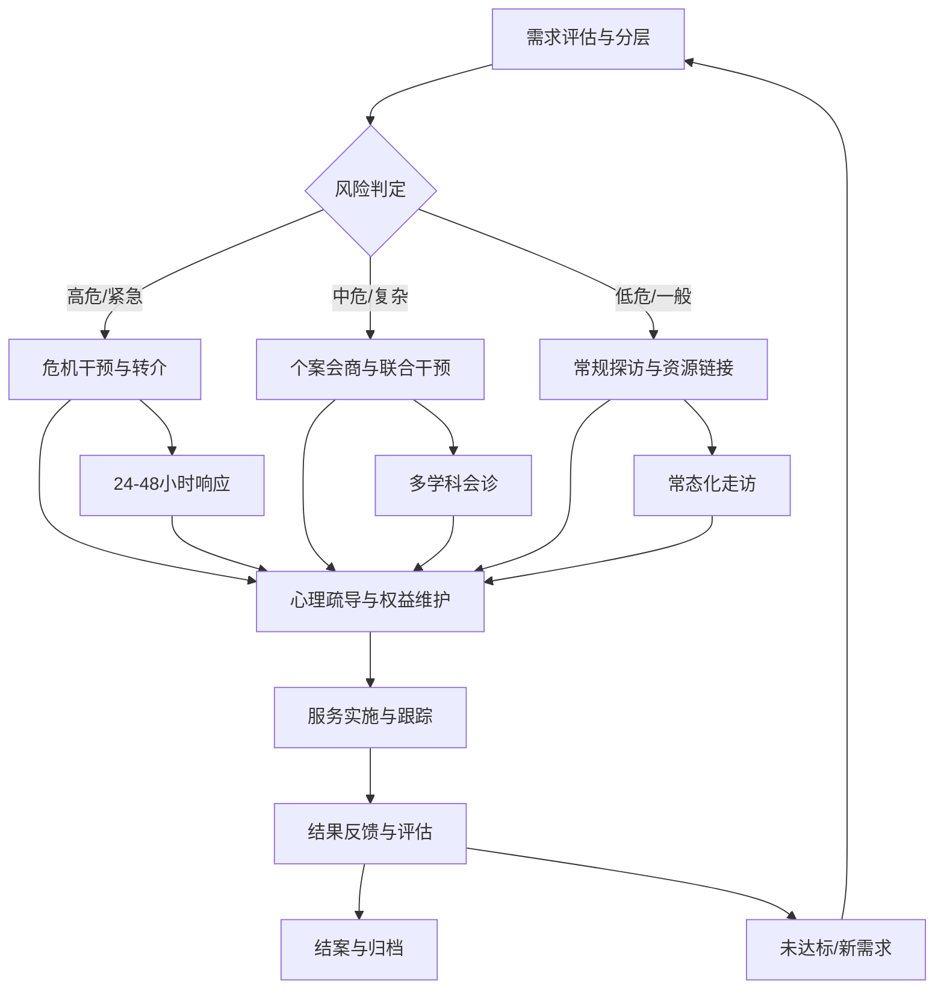

四、分类分层帮扶的落地执行策略

1. 需求评估的标准化模板与操作指南

为确保需求评估的规范性，菲尔德咨询开发《武穴市社会救助个性化需求评估表》。评估表包含基本信息、家庭结构、经济状况、健康状况、社会支持、心理状态、权益诉求等模块。每个模块设置量化指标与定性描述，便于社工操作。

同时，配套《需求评估操作指南》，详细讲解评估技巧、注意事项及常见问题处理。例如，如何识别隐性贫困、如何评估心理状态、如何获取服务对象信任等。指南结合武穴市实际案例，进行情景模拟训练，提升社工的实战能力。

2. 探访关爱的场景化剧本设计

针对不同场景，菲尔德咨询设计探访剧本。例如：对于贫困老人，剧本侧重生活关怀与陪伴；对于困境儿童，剧本侧重学业辅导与情感支持；对于残疾人，剧本侧重无障碍改造与就业咨询。剧本提供对话参考、互动环节及注意事项，帮助社工快速进入角色。

同时，开发探访工具包，包含慰问品清单、政策宣传册、心理测评量表等。工具包标准化配置，确保探访内容的丰富性与专业性。通过场景化设计，提升探访的针对性与有效性，避免流于形式。

3. 心理疏导的分级干预方案

心理疏导实行分级干预。一级干预为自助与互助，通过建立互助小组、开展心理讲座，提升服务对象的自我调适能力；二级干预为专业咨询，由持证心理咨询师提供一对一咨询；三级干预为医疗转介，对于严重精神障碍，转介至精神卫生中心。

菲尔德咨询建立心理危机干预热线，24小时受理求助。热线由资深心理咨询师值守，提供即时心理支持。对于高危对象，启动危机干预预案，联合公安、社区进行安全监护。通过分级干预，实现资源的优化配置，提升心理服务效率。

4. 权益维护的法律援助路径

权益维护建立“咨询—调解—诉讼”三级路径。一级为法律咨询，解答政策疑问，提供法律建议；二级为调解，协助解决纠纷，达成协议；三级为诉讼，代理案件，维护权益。

菲尔德咨询与律所建立合作关系，指派专职律师参与项目。律师定期开展法律讲座，解答疑难问题。对于重大案件，成立专项小组，全程跟进。通过法律援助路径，提升权益维护的执行力与成功率。

5. 转介服务的资源链接网络

转介服务建立“政府+社会+市场”资源网络。政府资源包括民政、医保、残联等部门；社会资源包括慈善组织、志愿者团队、企业等；市场资源包括培训机构、医疗机构等。

菲尔德咨询绘制《武穴市社会资源地图》，标注各类资源分布、联系方式、服务内容。社工通过地图快速定位资源，实现精准链接。同时，建立资源评价机制，对转介机构的服务质量进行评价，优胜劣汰，确保资源的有效性。

五、分类分层帮扶的评估与反馈机制

1. 过程评估的实施

过程评估关注服务实施的规范性。菲尔德咨询建立《过程检查表》，涵盖需求评估、计划制定、介入执行、记录归档等环节。检查表由督导定期抽查，发现问题及时纠正。

重点检查评估表是否完整、探访记录是否真实、转介是否及时、隐私是否保护等。检查结果纳入绩效考核，与薪酬挂钩。通过过程评估，确保服务过程的合规性与专业性。

2. 结果评估的指标体系

结果评估关注服务效果的达成度。指标体系包括：需求满足率、问题解决率、满意度、风险降低率等。需求满足率指主要需求得到满足的比例；问题解决率指个案问题得到解决的比例；满意度指服务对象对服务的评价；风险降低率指风险等级下降的比例。

结果评估采用基线调查与期末调查对比分析。基线调查在介入前进行，期末调查在结案后进行。通过对比，计算服务效果的增量。同时，进行典型案例剖析，总结经验与教训，为后续服务提供参考。

3. 反馈机制的闭环管理

建立“评估—反馈—改进”闭环机制。评估结果定期反馈给项目组、主管部门及社会公众。对于发现的问题，制定整改计划，明确责任人与完成时限。整改完成后，进行复查，确保问题得到解决。

同时，建立服务对象反馈渠道，如意见箱、电话、微信等。及时收集服务对象的意见与建议，优化服务流程。对于合理建议，予以采纳并公示。通过闭环管理，持续提升服务质量，满足服务对象的个性化需求。

4. 档案管理与数据安全

所有服务记录、评估报告、转介单据等形成档案，实行电子化与纸质化管理。电子档案加密存储，定期备份；纸质档案专柜存放，防火防潮。

档案查阅实行权限管理。社工查阅本人负责的档案；督导查阅全组档案；项目组查阅汇总数据。未经批准，不得查阅他人档案。对于敏感信息，脱敏处理后用于研究或展示。通过严格的档案管理，确保数据安全与服务连续性。

六、分类分层帮扶的创新实践

1. “五社联动”机制的深化

菲尔德咨询深化“五社联动”机制，即社区、社会组织、社会工作者、社区志愿者、社会慈善资源的联动。通过联动，整合多方资源，形成帮扶合力。

在个性化帮扶中，发挥社区的基础作用，提供场地与人力支持；发挥社会组织的平台作用，链接慈善资源；发挥社会工作者专业作用，提供直接服务；发挥志愿者补充作用，扩大服务覆盖面；发挥慈善资源支撑作用，解决资金难题。通过联动，提升帮扶效能。

2. “智慧救助”平台的应用

依托武穴市“智慧救助”平台，实现数据的互联互通。菲尔德咨询接入平台，实时获取服务对象数据，自动匹配政策，预判需求。通过大数据分析，识别潜在风险对象，提前介入。

平台提供移动终端，社工可随时随地录入服务记录，查看任务提醒。平台自动生成报表，辅助决策。通过数字化手段，提升服务效率与精准度。

3. “文化赋能”的探索

在个性化帮扶中，融入文化元素。针对农村群众，结合乡风文明建设，开展移风易俗、家风家训等活动；针对城市市民，开展社区文化、邻里互助等活动。通过文化赋能，提升服务对象的精神文化生活，促进社会和谐。

同时，挖掘本地文化资源，如非遗传承、红色文化等，为服务对象提供精神寄托与价值认同。通过文化赋能，增强帮扶的人文关怀与可持续性。

七、分类分层帮扶的保障措施

1. 组织保障

成立项目领导小组，由项目负责人、各组组长、督导组成。领导小组定期召开例会，协调解决重大问题。各小组分工明确，责任到人。通过组织保障，确保项目有序推进。

2. 制度保障

制定《项目管理办法》《财务管理制度》《档案管理制度》《保密制度》等。制度明确操作流程、职责权限、奖惩措施。通过制度保障，确保项目规范运行。

3. 资金保障

编制详细预算，严格执行财务制度。资金专款专用，定期审计。通过资金保障，确保项目有充足资源支撑。

4. 技术保障

配备必要的办公设备、交通工具、软件系统。建立技术团队，提供技术支持。通过技术保障，确保项目高效运行。

八、分类分层帮扶的预期成效

1. 服务对象层面

通过个性化帮扶，服务对象的物质生活得到改善，心理状态得到缓解，权益得到维护，社会融入度提升。具体表现为：贫困发生率下降、家庭关系和谐、心理健康水平提高、法律纠纷减少、就业能力增强等。

2. 社会层面

通过帮扶，提升社会救助的精准度与效能，促进社会公平正义，维护社会稳定。具体表现为：救助政策落地率提高、社会矛盾化解率提高、公众满意度提高等。

3. 项目层面

通过项目实施，形成可复制、可推广的经验模式。具体表现为：标准化流程建立、案例库积累、团队能力提升、品牌效应形成等。

九、结语

菲尔德咨询深刻理解武穴市社会救助联合体服务项目的个性化帮扶需求，将以专业的态度、严谨的作风、创新的机制，为困难群众提供全方位、多层次、个性化的服务。通过分类分层帮扶，实现从“输血”到“造血”的转变，从“救急”到“扶志”的跨越，助力武穴市构建具有特色的社会救助体系，为困难群众点亮希望之光。

### 1.4 市级总站与12个镇（街道）分站关系

#### 1.4.1 总站统筹与分站协同机制

一、 总站统筹定位与战略指引

（一） 总体定位与核心职能

1. 战略枢纽功能界定

菲尔德咨询在构建武穴市社会救助联合体服务体系中，明确市级总站为整个服务网络的战略中枢与资源调配中心。总站并非简单的行政指令传达端，而是集政策研判、标准制定、资源链接、质量监控及数据治理于一体的专业化枢纽。其核心职能在于打破传统行政层级间的壁垒，通过专业化运作实现市级政策资源向镇（街道）末梢的高效渗透，确保12个镇（街道）分站的服务供给与市级战略保持高度一致，同时具备针对本地化需求的差异化响应能力。

2. 统筹维度的具体内涵

总站的统筹作用体现在三个维度。第一是标准维度的统筹，建立统一的服务流程、评估工具及伦理守则，确保全市服务品质均质化；第二是资源维度的统筹，整合政府购买服务资金、社会组织专业能力、企业爱心物资及志愿者人力，形成可调度、可追踪的资源池；第三是信息维度的统筹，通过数字化平台实现服务数据的实时汇聚、清洗与分析，为决策提供依据。这种三维统筹机制，旨在解决长期以来基层救助工作中存在的标准不一、资源分散、信息孤岛等痛点，构建起“顶天立地”的服务网络。

（二） 对12个镇（街道）分站的管理逻辑

1. 从行政隶属到专业协同的转变

传统救助体系多依赖行政命令驱动，存在响应滞后、灵活性不足的问题。菲尔德咨询提出的总站与分站关系，是基于专业分工与利益共同体的协同逻辑。总站对12个镇（街道）分站实施“去行政化”的专业管理，即不再单纯依靠文件下发与考核追责，而是通过赋能、督导、评估与激励相结合的手段，激发分站的内生动力。这种管理逻辑尊重各镇（街道）的地域差异与文化特征，允许在统一标准框架下开展个性化服务创新，从而提升服务的精准度与接受度。

2. 分级分类的差异化统筹策略

鉴于武穴市下辖12个镇（街道）经济发展水平、人口结构及救助需求存在显著差异，总站采取“基础标准统一+特色项目定制”的差异化统筹策略。对于经济基础较好、社会组织发育成熟的镇（街道），总站侧重提供高端资源链接与创新项目孵化支持；对于资源相对匮乏、留守群体众多的镇（街道），总站侧重提供基础服务包标准化输出与志愿者下沉支持。这种差异化统筹避免了“一刀切”带来的资源错配，确保有限的公共财政资源与社会资源能够精准滴灌至最需要的区域。

二、 总站—分站协同运行机制

（一） 联络体系与任务派发流程

1. 建立双向联络清单制度

为确保沟通渠道畅通，菲尔德咨询将建立《总站—分站双向联络清单》。该清单涵盖双方关键岗位联系人、通讯方式、职责分工及响应时限。总站侧指定项目负责人为总协调人，下设政策研究组、资源链接组、督导评估组等专项小组，分别对接分站不同业务条线；分站侧指定一名站长及一名联络员，负责日常对接与任务执行。联络清单每季度更新一次，确保人员变动不影响工作连续性。同时，建立微信工作群与即时通讯群组，作为非紧急事务的日常沟通渠道，确保信息传递的即时性与透明度。

2. 结构化任务派发机制

任务派发摒弃传统的口头通知或单一文件下发模式，采用结构化任务包形式。每个任务包包含任务背景、目标群体、执行标准、时间节点、所需资源及预期成果等要素。总站根据月度工作计划或突发救助需求，通过数字化平台向分站推送任务包。分站联络员需在24小时内确认接收，并反馈初步执行方案。对于复杂任务，总站组织线上或线下会商会议，明确执行细节。这种结构化派发方式，降低了沟通成本，减少了因信息不对称导致的执行偏差，确保指令传达的准确性与完整性。

（二） 资源链接与社会力量整合

1. 社会组织与志愿者资源的标准化链接

总站负责发现、链接、使用及跟踪社会组织、志愿者、爱心企业和公益慈善资源。在发现环节，总站建立区域资源库，对武穴市及周边区域的公益组织、企业CSR项目、专业社工机构等进行常态化扫描与登记，形成动态更新的资源图谱。在链接环节，总站根据分站的需求清单，进行资源匹配。例如，针对某镇留守儿童心理健康需求，总站链接具备心理咨询资质的社会组织提供专业服务；针对另一镇独居老人生活照料需求，总站链接爱心企业提供物资捐赠。

2. 资源使用与跟踪反馈闭环

资源链接并非一次性行为，全过程纳入跟踪管理。总站建立《资源使用与效果评估台账》，记录资源投入的时间、内容、覆盖对象及初步效果。分站在执行过程中，需定期回传资源使用情况及服务对象反馈。总站每月进行一次资源使用效能分析，识别资源闲置或浪费环节，优化链接策略。同时，总站定期组织爱心企业代表与分站负责人进行对接会，促进政企社三方直接对话，增强社会力量的参与意愿与持续投入动力。

三、 协同机制的关键支撑要素

（一） 信息回流与数据治理

1. 标准化数据回传体系

信息回流是总站实施统筹管理的基础。菲尔德咨询设计标准化的数据回传模板，涵盖个案服务记录、小组活动记录、社区动员记录等。分站按月、季向总站回传原始数据，总站进行清洗、整合与分析。为确保数据质量，总站制定《数据填报规范手册》，明确字段定义、填报逻辑及常见错误示例。同时，开发轻量级移动端应用，支持分站一线社工在服务现场即时录入关键信息，减少事后补录的工作量与误差，提高数据时效性。

2. 数据驱动的决策支持

总站利用回流数据，生成月度、季度服务分析报告，识别服务盲点、高频需求及风险事件。例如，通过数据分析发现某镇（街道）特定年龄段群体的抑郁筛查率异常，总站可迅速启动专项干预行动，调配专业心理咨询师下沉支持。数据不仅用于管理监控，更用于服务优化。总站将分析结果反馈至分站，指导其调整服务策略，实现“用数据说话、用数据决策、用数据驱动”的闭环管理。

（二） 会商机制与问题解决

1. 定期会商与专项会商结合

建立“月度例会+专项会商”的会商机制。月度例会上，总站汇总全市服务情况，各分站汇报工作进展、遇到的问题及资源需求，总站进行点评与指导。专项会商针对重大突发事件、复杂个案或多部门协调难题启动，由总站牵头，邀请相关政府部门、社会组织代表、专家顾问共同参与，快速形成解决方案。会商记录形成会议纪要，明确责任人与截止时间，确保问题得到实质性解决。

2. 问题闭环台账管理

建立《总站—分站问题闭环台账》，对会商中提出的问题进行登记、跟踪、督办与销号。台账包含问题描述、提出时间、责任人、解决措施、完成时限及验收结果。总站定期公示台账进展，对超期未解决问题进行预警与问责。这种闭环管理确保了协同机制的有效运转，避免问题积压或推诿扯皮，提升整个服务网络的响应速度与执行力。

四、 质量控制与绩效评估

（一） 服务质量监控体系

1. 多维监控指标构建

总站对分站服务质量实施多维监控。过程指标包括任务响应率、数据回传及时率、会商参与度等，反映分站的执行力度；结果指标包括服务对象满意度、问题解决率、资源转化率等，反映服务成效；行为指标包括伦理合规性、资金使用规范性、档案完整度等，反映服务专业性。这些指标构成综合评估体系，避免单一指标导向带来的片面性。

2. 抽查与督导机制

总站组建督导小组，采取随机抽查与重点督导相结合的方式。随机抽查覆盖12个镇（街道）分站的所有服务项目，检查服务记录的真实性与规范性；重点督导针对投诉集中、绩效下滑或新晋分站进行深度介入。督导结果形成报告，反馈至分站，并提出整改建议。对于严重违规问题，总站启动约谈或暂停资助程序，维护服务体系的严肃性与公信力。

（二） 绩效评估与激励

1. 量化绩效评估模型

引入量化绩效评估模型，结合过程指标与结果指标，对各分站进行年度综合评分。评估结果不仅作为资金拨付的依据，更作为优化资源配置、调整服务策略的参考。对于绩效优秀的分站，总站给予表彰、优先推荐参与市级示范项目、增加资源倾斜等激励；对于绩效落后的分站，提供针对性培训与辅导，限期整改。

2. 经验推广与知识共享

总站挖掘分站在服务过程中的创新做法与典型案例，通过案例库、经验交流会、简报等形式进行推广。例如，某镇（街道）在留守儿童陪伴服务中形成的“家庭—学校—社区”联动模式，经总站提炼总结后，推广至其他有类似需求的镇（街道）。这种知识共享机制，促进了全市服务水平的整体提升，避免了重复探索，降低了创新成本。

五、 协同机制的流程可视化

为确保上述机制清晰可见、易于执行，菲尔德咨询设计了总站统筹与分站协同的核心流程图。该流程涵盖了从任务发起到结果反馈的全生命周期，明确了各节点的责任主体与操作规范。

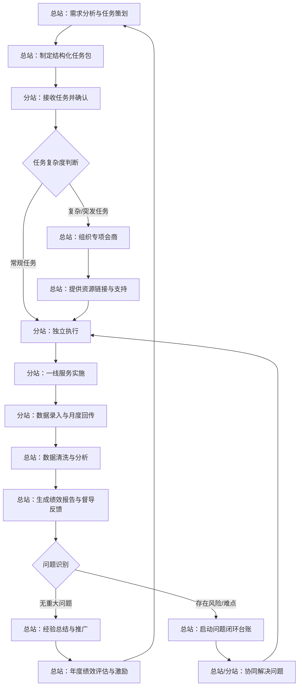

六、 关键管理工具与文档体系

（一） 核心文档清单

为支撑协同机制落地，菲尔德咨询构建了一套标准化的文档体系。该体系包括《总站—分站联络清单》、《任务包模板》、《资源库名录》、《数据填报规范》、《会商纪要模板》、《问题闭环台账》及《绩效评估细则》。这些文档不仅明确了操作规范，更成为培训分站人员、评估服务质量、追溯责任的重要依据。所有文档均实行版本控制，确保各方使用同一标准，减少沟通歧义。

（二） 数字化工具赋能

依托数字化平台，实现文档的在线协作与动态更新。分站可在线查阅任务包、下载模板、回传数据；总站可在线监控执行进度、发布通知、开展线上会商。平台提供权限管理、操作日志等功能，确保数据安全与可追溯。数字化工具的应用，大幅提升了协同效率，降低了纸质文档流转的成本与风险，为总站实施精细化统筹提供了技术支撑。

七、 风险应对与应急协同

（一） 常规性风险防控

在协同机制运行中，可能面临分站响应迟缓、数据质量不高、资源链接不畅等风险。菲尔德咨询预设风险应对预案。针对响应迟缓，建立超时预警机制，由总站自动发送提醒；针对数据质量不高，设立数据审核岗，对异常数据及时退回修正；针对资源链接不畅，建立备选资源库，确保关键资源有替代方案。这些防控措施嵌入日常流程，降低风险发生概率。

（二） 突发事件应急联动

面对重大自然灾害、公共卫生事件等突发事件，总站启动应急响应机制。总站迅速整合社会资源，形成应急服务包，通过绿色通道快速下发至分站。分站依托既有的联络体系与志愿者网络，快速展开一线服务。总站提供实时指令协调与物资调度，确保应急响应的速度与效率。事后，总站组织复盘，优化应急协同流程，提升整体韧性。

八、 持续优化与迭代

（一） 机制运行的回顾与反思

总站每年对协同机制的运行情况进行全面回顾。收集分站反馈，分析机制运行中的堵点与痛点。例如，发现某类任务包模板过于繁琐，影响分站工作效率，总站随即简化模板，聚焦核心要素。这种持续回顾与反思，确保机制与时俱进，适应外部环境变化与内部需求演进。

（二） 创新模式的引入与试验

鼓励分站提出创新建议，总站设立创新试验田，支持分站试点新的服务模式或协同方式。试点成功后，经总站评估验证，再在全市推广。这种“自下而上”的创新机制，激发了分站的活力，促进了服务体系的自我进化。菲尔德咨询通过总站与分站的深度协同，构建起一个充满活力、高效运转、可持续优化的社会救助服务网络，为武穴市社会救助事业的高质量发展提供坚实保障。

九、 总结与承诺

菲尔德咨询深刻理解武穴市社会救助联合体项目对总站统筹与分站协同机制的高标准要求。通过建立标准化的联络体系、结构化的任务派发、资源化的社会链接、数据化的信息回流、闭环化的问题管理，以及数字化的技术赋能，菲尔德咨询有能力打造一个高效、透明、协同的市级总站与12个镇（街道）分站关系网络。这不仅是对招标文件要求的逐条响应，更是对提升武穴市社会救助服务整体效能的实质性承诺。菲尔德咨询将以专业、严谨、务实的态度，确保机制运行的每一个环节可证明、可审查、可落地，为武穴市构建共建共治共享的社会治理格局贡献专业力量。

#### 1.4.2 12个镇（街道）分站活动协调指导与信息回流

一、 分站活动协调指导的具体实施策略

针对武穴市12个镇（街道）社会救助分站开展的阵地活动，菲尔德咨询将建立标准化、流程化的协调指导机制，确保活动开展的规范性、有效性与安全性。该机制不仅涵盖活动前期的策划审核与资源对接，还包括活动中的现场支持与技术赋能，以及活动后的成效评估与信息沉淀，形成全链条闭环管理。

（一） 建立活动备案与审核机制

为避免分站活动各自为战、标准不一，菲尔德咨询将制定《分站活动备案与审核指引》，明确各类常规活动与专项活动的申报周期、材料清单及审核标准。

1.  分级分类管理

根据活动性质与参与人群，将分站活动划分为“常规关爱类”、“技能提升类”、“政策宣传类”和“应急关爱类”四个层级。对于常规关爱类活动，如节假日慰问、日常探访等，实行简案备案制，分站只需提交简要计划表，总站予以形式审查后批准；对于技能提升类与政策宣传类活动，实行详案审核制，需提交完整的活动策划书，包括目标人群画像、内容大纲、预算明细等，由总站进行实质审查；对于应急关爱类活动，启动“绿色通道”，允许分站先行动后补报，但需在24小时内提交情况说明与现场记录。

2.  资源匹配前置

在审核环节，总站并非仅做行政审批，而是承担资源匹配枢纽功能。审核人员需结合武穴市社会救助政策库与服务商资源库，为分站活动推荐合适的专业人员、志愿者团队或物资支持。例如，针对困难儿童的心理关爱活动，总站可自动匹配具备心理疏导资质的社工机构；针对低保家庭的就业帮扶活动，可联动人社部门提供技能培训名额。这一环节旨在解决分站“有心无力”或“资源错配”的问题，提升活动的专业度。

3.  风险合规审查

重点审查活动是否存在安全隐患、是否符合社会救助伦理、是否存在形式主义或过度消费问题。对于涉及资金发放、物资采购的活动，需核查预算的合理性；对于涉及个人隐私的活动，需审查信息保护措施。总站审核意见需以书面或系统反馈形式下发至分站，分站需按意见修改完善后方可实施。

（二） 强化活动过程中的现场支持

在关键节点或复杂活动中，总站提供必要的现场支持与技术赋能，确保活动质量与效果。

1.  专家下沉指导

针对重大主题宣教活动、复杂个案帮扶活动或首次开展的新型活动，总站安排资深社工、心理咨询师或医疗专家下沉分站现场，提供专业指导。指导内容包括活动流程把控、互动环节设计、突发状况应对等。现场指导需形成《现场指导记录》，记录指导要点与分站采纳情况，作为后续培训素材。

2.  技术平台赋能

利用“武穴市社会救助信息平台”为分站活动提供技术支持。例如，在政策宣传活动中，总站在平台首页推送相关政策图解、短视频，分站通过二维码引导居民扫码学习，实现线上线下联动；在数据采集活动中，分站通过移动终端实时录入服务对象信息，总站后台实时监测数据完整性与逻辑性，发现异常立即预警。

3.  应急联动响应

对于活动中出现的突发急难事项，如服务对象情绪失控、意外受伤等，总站启动应急联动机制。一方面指导分站现场处置，另一方面协调医疗、公安等外部资源快速介入。事后，总站需对应急事件进行复盘，形成《应急事件处置案例库》，提升全站应急处置能力。

（三） 活动协调指导内容清单

为明确总站与分站在活动协调指导中的具体职责，菲尔德咨询梳理出如下内容清单，作为项目实施的操作依据。

表 1 分站活动协调指导内容清单

| 指导环节 | 总站职责 | 分站职责 | 交付物/记录 |
| :--- | :--- | :--- | :--- |
| 策划阶段 | 提供政策依据、审核活动方案、匹配资源 | 制定初步方案、提交备案、落实场地与人员 | 活动方案、审核意见表 |
| 准备阶段 | 提供宣传素材、培训骨干、调试技术设备 | 布置现场、邀约对象、准备物资 | 现场布置照片、培训签到表 |
| 实施阶段 | 现场抽查、专家下沉、应急联动、实时监测 | 执行活动、记录过程、处理突发情况 | 现场指导记录、活动影像 |
| 总结阶段 | 审核成效、评估质量、提炼案例、归档资料 | 撰写总结、整理资料、回传数据 | 活动总结、数据报表 |

二、 活动信息回流机制与数据治理

信息回流是分站向总站反馈活动成效、服务对象需求变化及潜在风险信息的渠道，是总站动态监测、政策优化与资源调配的重要依据。菲尔德咨询将构建“自动采集、人工校验、智能分析、分级应用”的信息回流体系，确保数据真实、完整、及时。

（一） 明确信息回流的范围与标准

为避免信息回流流于形式，需明确“回流什么、怎么回流、何时回流”的标准。

1.  必报信息项

所有分站开展的活动，均需在活动结束后3个工作日内，通过信息平台回传以下必报信息：
第一，活动基础信息，包括活动名称、时间、地点、参与人数、投入资金、执行主体等；
第二，过程记录信息，包括活动现场照片（至少3张，需带有时间水印）、服务对象签到表、活动影像资料；
第三，成效评估信息，包括服务对象满意度、活动达成率、典型案例等；
第四，问题反馈信息，包括活动遇到的困难、服务对象提出的新需求、发现的潜在风险等。

2.  选报信息项

对于具有创新性、示范性的活动，或涉及复杂个案、重大风险的活动，分站需选报详细信息，包括个案分析报告、风险预警报告、创新做法总结等。这些信息将作为总站评选优秀案例、优化政策的重要素材。

3.  数据质量校验标准

总站后台系统设定数据校验规则，对回传信息进行自动校验。例如，参与人数与签到表人数需一致，照片时间需与活动时间匹配，必填项不得为空等。对于校验不通过的信息，系统自动退回分站，并提示原因。分站需修正后重新提交。对于人工抽查发现的数据造假、逻辑错误等问题，总站将记入分站考核档案，并进行通报。

（二） 构建多渠道回流渠道

为提高信息回流的便捷性，菲尔德咨询将构建“线上平台+线下报送+即时通讯”的多渠道回流体系。

1.  线上平台为主

以“武穴市社会救助信息平台”为主要回流渠道，分站通过电脑端或移动端登录平台，填报活动信息、上传资料。平台提供标准化表单，分站只需勾选、填空，降低操作难度。平台后台自动统计各分站回流及时率、完整率，生成可视化图表，供总站管理者查看。

2.  线下报送为辅

对于不具备网络条件的偏远分站，或涉及敏感信息的个案，允许分站通过纸质报表、密封信封等方式报送。总站指定专人接收、录入，并在2个工作日内完成系统入库。线下报送需登记《信息接收台账》，确保可追溯。

3.  即时通讯补充

建立“武穴市社会救助工作群”（微信/钉钉），分站负责人为群成员。对于紧急信息、突发风险，分站可通过群内文字、语音、图片等方式即时上报。总站值班人员负责24小时监控群组信息，发现紧急事项立即响应。

（三） 信息回流流程与闭环管理

信息回流并非终点，而是总站进行分析、决策、反馈的起点。菲尔德咨询将建立“回流—分析—反馈—应用”的闭环管理机制。

1.  数据分析与应用

总站在每月、每季度、每年定期生成《分站活动分析报告》，分析内容包括：各分站活动开展数量、类型分布、参与人群结构、成效评估结果、常见问题等。分析报告将提交至市民政局领导，为政策调整、预算分配、人员培训提供决策支持。

表 2 信息回流分析与应用维度表

| 分析维度 | 分析内容 | 应用方向 |
| :--- | :--- | :--- |
| 数量维度 | 各分站活动频次、参与人次 | 评估工作积极性、识别薄弱分站 |
| 质量维度 | 满意度、达成率、数据完整率 | 识别低质活动、优化培训重点 |
| 需求维度 | 服务对象新需求、高频问题 | 调整救助政策、优化服务项目 |
| 风险维度 | 突发急难事项、潜在风险点 | 完善应急预案、加强风险预警 |

2.  反馈与激励

总站在分析后，需将结果反馈至分站。对于表现优异的分站，给予通报表扬、资金倾斜、优先推荐评优等激励；对于表现不佳的分站，进行约谈、指导、限期整改。反馈需通过平台消息、工作群通知、实地走访等方式进行，确保分站知晓并改进。

3.  典型案例提炼

从回传信息中提炼典型案例，包括成功帮扶案例、创新做法案例、风险预警案例等。典型案例将汇编成册，通过平台、工作群、培训会议等渠道向全站推广，促进经验共享，提升整体服务水平。

三、 信息回流的质量保障与考核

为确保信息回流机制有效运行，菲尔德咨询将建立严格的质量保障与考核机制，将信息回流质量纳入分站绩效考核。

（一） 质量保障措施

1.  数据校验自动化

利用平台后台系统，对回传信息进行自动校验，减少人工审核压力，提高校验效率。校验规则包括格式校验、逻辑校验、完整性校验等。对于校验不通过的信息，系统自动退回并提示，分站需及时修正。

2.  人工抽查常态化

总站每月按比例（如10%）对分站回传信息进行人工抽查，重点核查数据真实性、照片真实性、成效评估客观性。抽查结果记入分站信用记录，作为年度考核依据。

3.  培训与指导

定期组织分站信息员培训，讲解平台操作、数据填报规范、典型案例写作等，提升分站信息员能力。对于新上任的信息员，总站安排一对一指导，确保其掌握操作技能。

（二） 考核指标体系

将信息回流质量细化为可量化、可考核的指标，纳入分站年度绩效考核。

1.  及时率

指分站在规定时限内完成信息回传的比例。考核目标为100%。对于逾期未回传的分站，每逾期1天扣减考核分。

2.  完整率

指分站回传信息中必填项完整、附件齐全的比例。考核目标为95%以上。对于信息缺失、附件不全的分站，每发现1次扣减考核分。

3.  准确率

指分站回传信息中数据真实、逻辑正确、无造假的比例。考核目标为100%。对于发现数据造假、逻辑错误的分站，实行“一票否决”，取消年度评优资格。

4.  应用率

指总站从分站回流信息中提炼案例、优化政策的数量。该项为加分项，鼓励分站提供高质量、有深度的信息。

（三） 考核结果应用

考核结果与分站经费拨付、评优评先、人员绩效挂钩。对于连续两个季度考核不合格的分站，总站将派员驻点指导，帮助其整改；对于年度考核优秀的分站，给予资金奖励、通报表扬。通过正向激励与负向约束相结合，确保信息回流机制长效运行。

四、 协调指导与信息回流的流程协同

活动协调指导与信息回流并非孤立环节，而是相互支撑、相互促进的关系。协调指导为信息回流提供素材与标准，信息回流为协调指导提供依据与反馈。菲尔德咨询将两者整合为统一的闭环流程，确保机制高效运转。

（一） 流程设计逻辑

整个流程以“活动周期”为轴线，以“信息平台”为载体，以“总站—分站”为交互主体。活动前，总站通过平台下发任务、审核方案、匹配资源；活动中，分站通过平台实时上报进度、应急事项；活动后，分站通过平台回传成效、需求、风险信息；总站通过分析、反馈、提炼，优化下一轮活动。

（二） 关键控制点

1.  方案审核节点

控制点为总站审核意见的反馈时效。总站需在收到分站方案后3个工作日内反馈意见，避免延误分站活动准备。

2.  信息回传节点

控制点为分站回传信息的及时性与完整性。分站需在活动结束后3个工作日内完成回传，总站后台需自动统计逾期情况，并预警。

3.  分析反馈节点

控制点为总站分析报告的产出时效与应用效果。总站需在每月10日前产出上月分析报告，并通过多种渠道反馈至分站，确保分站知晓并改进。

（三） 流程可视化

为清晰呈现协调指导与信息回流的协同关系，菲尔德咨询绘制如下流程图。

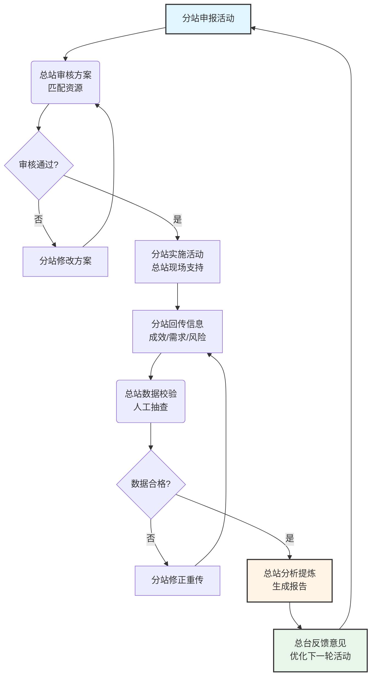

该流程图展示了从分站申报到总站反馈的完整闭环。通过自动化校验、人工抽查、分析反馈等环节，确保活动质量与信息质量的双重提升。同时，流程中的控制点（如审核时效、回传时效）需通过平台监控、考核机制加以保障，避免流程空转。

五、 风险防控与应急处理

在协调指导与信息回流过程中，可能面临数据泄露、信息造假、系统故障等风险。菲尔德咨询需建立相应的风险防控与应急处理机制。

（一） 数据安全风险防控

1.  权限分级管理

平台实行严格的权限分级管理，分站人员仅能查看本站数据，总站人员可查看全市数据，但需记录操作日志。对于敏感信息（如服务对象身份证号、银行账户等），实行脱敏展示，仅授权人员可查看原文。

2.  数据备份与恢复

平台数据每日自动备份，异地存储。对于重要数据，实行手动备份，确保数据安全。若发生数据丢失，可在24小时内恢复。

3.  保密协议签署

所有参与项目的人员，均需签署保密协议，承诺不泄露服务对象隐私。对于违反保密规定的人员，追究法律责任。

（二） 信息造假风险防控

1.  多源数据比对

平台后台将分站回传数据与民政基础数据库、公安人口数据库等进行比对，识别异常数据。例如，分站上报的参与人数远超辖区常住人口，或参与对象已死亡等，系统自动预警。

2.  实地核查抽查

总站定期或不定期对分站回传信息进行实地核查，核实活动真实性、数据真实性。对于发现造假的分站，严肃处理。

3.  举报机制建立

建立举报机制，鼓励社会力量举报信息造假行为。对于查实的举报，给予奖励；对于诬告陷害的，追究责任。

（三） 系统故障应急处理

1.  故障预判与预防

平台实行7×24小时监控，及时发现并排除故障。对于重大故障，启动应急预案。

2.  备用方案启用

若平台发生故障，分站可通过线下报送方式回传信息，总站安排专人接收、录入。待平台恢复后，补录数据。

3.  故障通报机制

发生故障时，总站需在1小时内向分站通报故障情况、预计恢复时间，并指导分站采取备用方案。

六、 交付物与验收标准

为确保协调指导与信息回流机制落地，菲尔德咨询将明确各环节的交付物与验收标准。

（一） 主要交付物

1.  《分站活动备案与审核指引》

明确活动分级分类标准、审核流程、资源匹配规则等，作为分站开展活动的操作手册。

2.  《分站活动信息回流规范》

明确信息回流范围、标准、渠道、时效、质量要求等，作为分站回传信息的依据。

3.  《分站活动分析报告》（月报/季报/年报）

包含数量、质量、需求、风险等维度分析，为总站决策提供支持。

4.  《分站典型案例分析集》

提炼成功帮扶案例、创新做法案例、风险预警案例等，促进经验共享。

5.  《分站绩效考核评分表》

包含及时率、完整率、准确率、应用率等指标，作为分站年度考核依据。

（二） 验收标准

1.  覆盖率

12个镇（街道）分站全部纳入协调指导与信息回流机制，覆盖率为100%。

2.  及时率

分站信息回传及时率不低于95%，总站审核反馈及时率不低于98%。

3.  完整率

分站信息回传完整率不低于90%，总站分析报告完整率100%。

4.  准确率

分站信息回传准确率不低于98%，总站数据分析准确率100%。

5.  应用率

总站从分站回流信息中提炼案例、优化政策的数量不少于10项/年，且分站知晓率不低于90%。

通过上述交付物与验收标准，确保协调指导与信息回流机制可量化、可考核、可落地。菲尔德咨询将持续监控各项指标，及时调整策略，确保机制长效运行，最终实现武穴市社会救助服务体系的规范化、专业化、高效化。

## 2. 运营方案与制度建设

### 2.1 整体运营思路

#### 2.1.1 七模块一体化运营架构

一、七模块一体化运营架构设计

菲尔德咨询紧扣武穴市社会救助联合体建设需求，依托市级总站搭建“七模块一体化”运营架构。该架构将平台监测、一门受理、部门协同、个性化帮扶、台账追溯、阵地活动及运营方案制度七大功能模块有机融合，打破传统救助领域的信息壁垒与业务割裂，构建“统一指挥、数据共享、精准匹配、闭环运转”的救助服务一体化支撑体系。

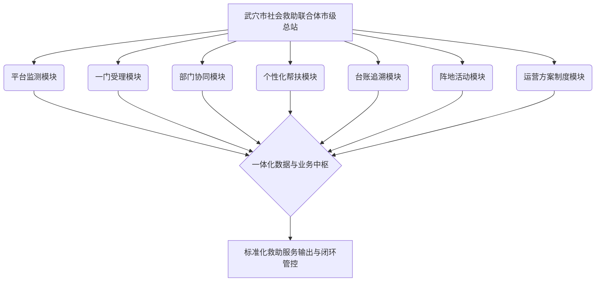

（一）七模块协同联动机制

七模块一体化运营架构并非各模块的简单堆砌，而是通过标准化数据接口与规范化业务流程实现深度的协同联动。

1.平台监测与一门受理联动
平台监测模块通过对接低收入人口动态监测数据库，实时预警潜在救助对象，并将预警信息主动推送至一门受理模块；一门受理模块在前端窗口或线上终端接收群众申请与预警信息后，完成身份核验与初审分类，实现救助主动发现与快速受理。

2.部门协同与个性化帮扶联动
一门受理模块将审核通过的救助需求转交部门协同模块，由部门协同模块根据需求属性牵头民政、人社、医保、残联及教育等部门进行政策资源匹配；针对单一政策无法覆盖的复杂困难对象，快速转入个性化帮扶模块，引入社会组织、志愿服务及企业慈善资源，制定“一户一策”个性化帮扶方案。

3.台账追溯、阵地活动与制度保障协同
台账追溯模块贯穿服务全流程，对一门受理、部门协同、个性化帮扶及阵地活动的数据进行全程留痕与实时跟踪，确保服务可追溯、可核查；阵地活动模块依托市级总站及基层服务阵地，定期开展线下政策宣传、心理疏导和资源对接活动；运营方案制度模块为上述六个模块的规范化运转提供制度约束、质量标准及评估考核依据，保障体系持续稳定高效运行。

（二）七模块核心功能与责任边界

为确保七模块架构精细化落地，菲尔德咨询对各模块的功能定位、责任主体、输入输出及记录表单进行了标准化界定。

服务模块功能矩阵与管理责任表

| 模块名称 | 责任岗位 | 模块核心功能与实施要求 | 输入要素 | 成果输出 | 质量控制记录表单 |
| :--- | :--- | :--- | :--- | :--- | :--- |
| 平台监测模块 | 数据监测专员 | 开展低收入人口数据比对、预警信息筛查及困难趋势分析 | 部门共享数据、基层上报预警信息 | 预警人员名单、监测分析报告 | 《救助预警信息处置跟踪表》 |
| 一门受理模块 | 窗口受理专员 | 负责救助申请前端接待、政策咨询、材料初审及分类分流 | 群众申请材料、监测预警名单 | 受理回执、分类分流派单 | 《社会救助申请受理登记表》 |
| 部门协同模块 | 部门联络专员 | 统筹协调各职能部门救助资源，推进跨部门联合办理 | 派单信息、各部门救助政策清单 | 跨部门联办结果、资源匹配清单 | 《跨部门救助协同办理单》 |
| 个性化帮扶模块 | 项目实施专员 | 针对复杂困难需求，整合社会资源，实施“一户一策”精准帮扶 | 深度评估报告、社会资源库 | 个性化帮扶方案、帮扶服务记录 | 《个性化救助帮扶实施记录表》 |
| 台账追溯模块 | 档案管理专员 | 建立“一户一档”电子与纸质台账，全程跟踪救助服务链路 | 各环节服务数据、审核审批留痕材料 | 完整救助台账、档案查阅索引 | 《救助档案归档与追溯核查表》 |
| 阵地活动模块 | 阵地运营专员 | 负责武穴市级总站及基层阵地的日常运营、活动组织与资源展示 | 活动需求申请、阵地资源计划 | 阵地活动方案、活动总结报告 | 《救助阵地活动开展与满意度签到表》 |
| 运营方案制度模块 | 项目负责人 | 制定并动态修订运营管理制度、服务规范、应急预案及质控体系 | 国家及地方政策文件、项目合同要求 | 运营管理制度汇编、服务规范手册 | 《运营制度执行与质控巡查表》 |

二、项目负责人岗位接口与岗位责任体系

菲尔德咨询实行“项目负责人总负责制”，通过建立清晰的岗位接口与责任明细，确保七模块一体化架构在武穴市社会救助联合体服务项目中无缝衔接、高效运转。

（一）项目负责人核心管控接口

项目负责人作为整个联合体运营服务的最高责任人，直接对接武穴市民政局及相关监督部门，统筹全盘资源的调配与质量监督。

1.业务指挥接口
项目负责人直接统筹数据监测专员、窗口受理专员、部门联络专员、项目实施专员、档案管理专员及阵地运营专员，定期召开运营例会，听取各模块工作汇报，解决跨模块协同中的堵点与难点问题。

2.外部协调接口
项目负责人负责对接武穴市社会救助联席会议各成员单位，建立常态化沟通机制，确保部门协同模块政策资源畅通接入；同时对接当地社会组织、慈善机构与志愿者团队，拓宽个性化帮扶模块的外部资源供给渠道。

3.质量与合规管控接口
项目负责人直接管控运营方案制度模块，对照招标要求与评分标准，对各模块输出的成果清单与服务规范进行全流程审查，严控废标风险与服务履约风险。

（二）各模块岗位职责与分工

1.数据监测专员
负责平台监测模块的日常运行。每日开展低收入人口数据比对，识别大病高额医疗费用、重度残疾、失业等异常预警信号；每周生成预警处置清单并推送至一门受理模块；每月编制武穴市社会救助动态监测分析报告。

2.窗口受理专员
负责一门受理模块的日常接待。严格执行“首问负责制”和“一次性告知制”，规范采集救助对象基础信息与服务需求；完成申请材料的形式审查与初审分类，在规定时限内通过系统完成派单转办。

3.部门联络专员
负责部门协同模块的横向对接。建立与武穴市各救助职能部门的联络机制，定期更新各部门政策资源库；跟踪跨部门救助事项的办理进度，确保部门联动救助按时办结率达到百分之百。

4.项目实施专员
负责个性化帮扶模块的服务落地。深入困难群众家庭开展需求深度评估，联合专业社工与志愿团队制定“一户一策”帮扶方案；组织实施生活照料、心理疏导、能力提升等物质与服务相结合的复合型救助。

5.档案管理专员
负责台账追溯模块的标准化建设。严格按照“一户一档”要求，立卷归档救助全过程资料；建立电子台账数据库，实现对救助申请、审核、协同、实施及结案的全链路追溯管理。

6.阵地运营专员
负责阵地活动模块的现场管理。保障武穴市级总站及基层救助阵地的正常开放与硬件维护；按月制定阵地活动计划，组织开展救助政策宣讲、资源对接会、心理健康讲座等主题活动。

三、标准化运营成果与管理制度清单

菲尔德咨询为本项目量身定制了一套完整、规范、可落地的运营制度体系与成果清单，确保武穴市社会救助联合体服务项目运行有章可循、有据可查。

（一）标准化运营成果清单

项目运营期间，菲尔德咨询将按时集中交付以下标准化成果，确保项目履约质量完全符合招标文件要求：

1.运营架构成果
《武穴市社会救助联合体“七模块一体化”运营架构图及功能说明》、《岗位职责与接口规范手册》。

2.制度规范成果
《武穴市社会救助联合体运营管理制度汇编》、《社会救助标准化服务流程指南》、《社会救助质量控制与监督评估办法》。

3.业务执行成果
《困难群众需求评估标准》、《“一户一策”个性化帮扶方案模板》、《跨部门协同救助办理标准指导手册》。

4.台账档案成果
《社会救助全流程标准化台账目录》、《低收入人口动态监测与预警台账》、《联合体服务对象电子档案库》。

（二）运营管理制度清单

1.总站运营管理制度
包括《市级总站日常管理规范》、《工作人员行为规范与服务礼仪制度》、《首问负责与限时办结制度》、《值班与应急处置制度》。

2.模块协同与业务办理制度
包括《低收入人口动态监测与主动发现制度》、《一门受理与分类分流工作制度》、《跨部门救助资源协同共享机制》、《社会力量参与救助帮扶激励制度》。

3.档案与信息安全制度
包括《社会救助档案管理与保密制度》、《救助对象个人隐私信息保护规范》、《数据资产安全与追溯管理制度》。

4.质量控制与反馈评价制度
包括《救助服务质量巡查与定期抽查制度》、《服务对象满意度测评与回访制度》、《救助服务投诉处置与整改反馈机制》。

四、全流程质量控制与闭环管理机制

为确保“七模块一体化”架构精准落地且符合质量标准，菲尔德咨询以“责任到人、输入输出明确、过程留痕可查”为核心，构建全流程质量控制机制。

（一）质量控制三要素锁定

1.责任人明确化
七个模块均指定唯一的责任岗位与直接责任人，形成由“项目负责人—模块责任人—基层执行员”构成的三级质量责任网络。项目负责人对整体服务质量负总责，模块责任人对本模块数据真实性、流程规范性及交付时限负责。

2.输入输出标准化
明确每个业务节点所需的标准化输入材料（如申请表、证明材料、监测数据）与规定的输出成果（如评估报告、帮扶方案、结案表）。严禁无输入启动业务，严禁无合格输出进入下一节点。

3.记录表单痕迹化
全面推行标准化表单管理，在预警、受理、协同、帮扶、归档、活动及质控巡查等全过程必须填写对应的质量控制记录表单。所有表单须经经办人与模块责任人双签字，确保全过程可追溯、可审查。

（二）质量巡查与监督反馈闭环

1.常态化质量巡查
项目负责人每周带队对七个模块的业务运行情况进行全面巡查，重点抽查一门受理派单准确率、部门协同办理时限、个性化帮扶方案匹配度及台账归档完整性。

2.满意度回访与反馈
服务实施后，由台账追溯模块联合第三方督导人员，采用电话回访、入户走访等方式，对救助对象进行百分之百满意度测评。测评结果直接纳入模块责任人的绩效考核评价体系。

3.问题整改与制度迭代
对巡查和回访中发现的服务瑕疵或流程堵点，由项目负责人下发《质量整改通知书》，责成相关模块责任人在3个工作日内完成整改；同时由运营方案制度模块针对共性问题修订完善相关管理制度，实现“发现问题—分析原因—整改落实—制度优化”的持续改进闭环。

#### 2.1.2 需求清单驱动的闭环服务流程

一、需求清单驱动的闭环服务流程设计

菲尔德咨询针对武穴市社会救助联合体服务项目的实际需求，构建“需求清单驱动”的全流程闭环服务机制。该机制以困难群众的实际救助需求为核心驱动力，依托标准化的服务节点与权责明晰的岗位协同，确保每一项救助需求均具备明确的动态状态、第一责任人、办理时限与量化评估结果，实现救助服务全程可追踪、质量可监控、责任可追溯。

二、八阶段全流程闭环协同机制

本项目的闭环服务流程划分为信息收集、需求清单生成、政策资源匹配、受理登记、协同办理、限时跟踪、结果反馈及归档追溯八个连续阶段。各阶段紧密衔接，形成完整的管理闭环。

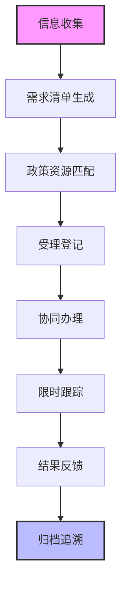

（一）多渠道信息收集
菲尔德咨询依托武穴市社会救助联合体的实体窗口、信息化平台以及乡镇（街道）分站，建立三位一体的需求信息采集网络。窗口岗与巡查岗定期开展主动排查与日常接访，精准捕获困难群众在基本生活、医疗、教育、住房、就业及心理疏导等方面的多元需求，确保信息采集无遗漏、无死角。

（二）标准化需求清单生成
对采集到的原始需求信息进行分类整理与规范化表达，统一转化为标准化“困难群众需求清单”。需求清单明确记录服务对象的风险等级、具体诉求类别、期望达成目标及紧急程度，为后续的资源精准对接提供数据基础。

（三）动态化政策资源匹配
建立武穴市社会救助政策与社会资源动态数据库。根据需求清单中的具体诉求，系统及专家团队自动开展政策条文与社会资源的精准比对，输出最佳救助组合方案，明确可调动的政府救助资源、社会组织服务资源及志愿者服务力量。

（四）规范化受理登记
窗口岗对符合条件的服务申请进行正式受理登记，建立“一户一档”的救助台账。生成唯一的救助业务流水号，明确记载受理时间、拟办理事项、承办部门及初步预计完成时限，并向服务对象出具受理回执。

（五）高效化协同办理
协同岗根据政策资源匹配方案，将救助事项分发至对应的行政部门、专业社会组织或联合体内部服务团队。涉及多部门交叉复核的复杂事项，由协同岗发起多方联席会商机制，实行统一派单、并行推进。

（六）节点化限时跟踪
个案岗承担全程跟踪与督办职责。针对常规事项、急难事项及复杂事项设定严格的办理时限阈值。依托信息化平台设定预警节点，在时限临近前进行自动催办与人工介入督导，确保各环节高效运转。

（七）满意度结果反馈
服务事项办理完成后，由个案岗通过电话回访、入户走访或终端评价等方式，向服务对象及其家属反馈办理结果，并征集服务满意度评价。对于未完全解决或评价不满意的事项，自动触发二次响应与重新研判程序。

（八）标准化归档追溯
档案岗按照档案管理规范，将业务申请表、需求清单、匹配记录、办理凭证、督办日志及反馈意见等全套纸质与电子材料统一编号归档。档案归档后形成终身可追溯的救助业务全景档案。

三、岗位分工与权责对应

菲尔德咨询为保障闭环流程的高效稳定运行，设立四大关键服务岗位，明确各岗位的职责边界与操作规范，实现“岗责对应、人岗匹配”。

（一）窗口岗职责
负责联合体实体窗口的日常接访、政策咨询解答、困难群众原始需求信息采集及初步审核；负责服务事项的正式受理登记与回执发放；负责引导服务对象完成基础材料提交。

（二）协同岗职责
负责需求清单与政策资源的精准比对与派单分流；负责跨部门、跨组织协调事项的联络与推进；负责联合体内部各服务模块之间的资源调配与业务衔接。

（三）个案岗职责
负责困难群众个案的全程跟踪、时限预警与督办提醒；负责困难群众服务满意度调查与办理结果反馈；负责针对复杂疑难个案开展跟踪评估与重新研判。

（四）档案岗职责
负责救助服务过程档案的整理、立卷、编号、归档及信息化录入；负责档案资料的安全保管、借阅管理及定期核查；负责保障救助对象个人隐私信息的安全防护。

四、过程控制交付物与验收标准

为确保闭环流程落到实处，菲尔德咨询针对流程关键节点设立明确的表单交付物与严格的量化验收标准，实现救助服务质量的全程可控。

关键节点表单交付物与验收标准

| 流程环节 | 核心交付物名称 | 交付物主要内容 | 验收评价标准 |
| :--- | :--- | :--- | :--- |
| 信息收集与清单生成 | 困难群众需求清单 | 服务对象基本信息、诉求分类、风险等级、紧急程度 | 需求描述准确，分类标准统一，无信息遗漏，生成合格率百分之百 |
| 受理登记与协同流转 | 救助事项登记表 | 业务编号、受理时间、承办岗位、匹配资源、拟定完成时限 | 登记要素完整，权责指派明确，派单流转时间不超过一个工作日 |
| 限时跟踪与协同办理 | 业务办理过程记录表 | 办理进度、协同部门沟通日志、时限预警记录、阶段性成果 | 各节点记录完整，无超期未响应现象，预警处置率百分之百 |
| 结果反馈与归档追溯 | 服务闭环验收清单 | 办理最终结果、满意度评价意见、档案编号、归档签收 | 群众满意度达到九十五以上，一户一档归档率百分之百，实现全流程追溯 |

五、武穴市实际结合与落地保障

菲尔德咨询在设计本闭环流程时，充分结合武穴市城乡社区分布特点、困难群众结构特征及现有救助资源状况，确保方案具有极强的本地化适应性与操作落地性。

（一）适配武穴市城乡二元救助需求
针对武穴市城区与农村地区在救助需求类型上的差异，本流程在信息收集环节设立“分类采集机制”。城区重点采集就业帮扶、住房保障及城市边缘群体微心愿；农村地区则依托乡镇分站与村级救助协管员，重点采集高龄独居、重病重残等群体的常态化照料与临时救助需求，确保需求清单贴合武穴实际。

（二）对接武穴市现有救助资源体系
本流程的政策资源匹配环节深度整合武穴市民政、残联、人社、医保、教育等部门的现有救助政策，同时吸纳武穴市本地社会组织、慈善资金及志愿服务力量。通过建立统一的资源库，打破部门信息壁垒，实现政策与资源的无缝对接。

（三）设立响应时限保障机制
为保障救助及时性，本流程针对武穴市救助服务设定明确的时间约束：急难型救助需求必须在两小时内完成信息采集与受理登记，二十四小时内完成初步协同办理；常态化救助需求在二个工作日内完成资源匹配与派单，常规事项办理总时限不得超过五个工作日，确保响应高效。

（四）全流程数字化与可视化管理
依托武穴市社会救助联合体信息化平台，将需求清单、办理记录、督办预警和反馈评价全量转化为数字化指标。管理人员可随时调取任意个案的闭环办理视图，实现服务过程全程透明、风险实时可控、绩效精准考核。

#### 2.1.3 政策变化和群众需求下的动态调整机制

一、政策与需求双轮驱动的动态调整运行逻辑

菲尔德咨询针对武穴市社会救助联合体服务项目的实际运行环境，建立“政策变化与群众需求”双轮驱动的服务动态调整机制。该机制以国家、省、市最新社会救助政策法规为导向，以武穴市困难群众实时、多元的服务需求为根本出发点，确保联合体服务内容、资源配置及实施路径始终与上级部署同频共振，与基层实际精准对接。

机制整体遵循“敏锐感知、科学评估、规范会商、严密实施、闭环复盘”的五步循环路径。由项目负责人统筹全盘，依托信息化平台与一线探访网格，实时收集政策变更指令与群众诉求反馈，形成科学高效的动态响应闭环。

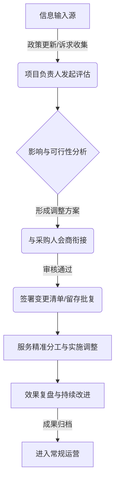

二、多维触发条件与响应调整策略

菲尔德咨询将动态调整的触发源分为“政策法规及重点任务变更”与“基层群众需求结构变化”两大类，针对不同场景制定标准化响应策略，确保调整工作有章可循、高效落地。

（一）政策变化及阶段性重点任务响应策略

当国家、湖北省或武穴市出台社会救助新政策，或民政部门部署阶段性专项行动（如困难群众兜底保障专项排查、冬季送温暖专项行动、特定群体关爱服务等）时，菲尔德咨询将在24小时内启动政策响应程序。

1. 服务重点调整：迅速将政策新要求转化为服务指标。如遇救助标准提高或救助范围扩大，立即配合开展政策宣传解读、精准摸排与符合条件对象的辅助申报服务。
2. 人员分工调整：组建专项服务小组，由项目负责人统筹调配骨干社工，充实到重点任务一线；必要时邀请行业专家进行政策专项培训，确保一线服务人员精准掌握最新政策口径。
3. 服务方式调整：由常态化的“按计划巡访”转换为“专项行动+集中攻坚”，结合线上信息化数据比对与线下入户走访，实现目标对象快速识别与服务覆盖。
4. 成果形式调整：输出专项摸排台账、政策落实分析报告、集中服务活动档案及政策执行评估建议，为采购人决策提供数据支撑。

（二）群众需求变化响应策略

依托社会救助联合体日常服务网络、群众诉求热线及满意度回访数据，当某一区域或某一特定类别的困难群众产生集中性、突发性或结构性需求变化（如大病致贫后的紧急心理疏导与资源对接需求、个别村社区高龄独居老人餐食照料需求增多等）时，启动需求响应程序。

1. 服务重点调整：动态更新“需求清单”与“服务资源池”，提升紧急救助、医疗协助、心理疏导、个案转介等深层次服务的配置比重。
2. 人员分工调整：发挥菲尔德咨询专业督导机制作用，由个案社工与心理咨询师组成联动小组，采取“一对一”或“多对一”帮扶模式，强化专业力量倾斜。
3. 服务方式调整：引入“点单式”与“派单式”组合服务模式，针对个性化需求开展上门定制服务；针对共性需求组织社区支持小组或主题微项目。
4. 成果形式调整：形成困难群众需求变化分析报告、个性化个案服务计划、资源对接成果明细及服务满意度评价追踪表。

政策与需求变化下的调整应对表

| 触发类型 | 核心触发场景 | 服务重点调整 | 人员分工安排 | 服务方式转换 | 最终成果形式 |
| :--- | :--- | :--- | :--- | :--- | :--- |
| 政策变化 | 兜底保障政策调整、标准提标、专项行动部署 | 扩充摸排范围、政策精准宣讲、辅助申报服务 | 项目负责人挂帅，成立专项攻坚组，全员政策培训 | 集中排查、线上线下比对、联动村社区走访 | 专项摸排台账、政策落实分析报告、专项活动档案 |
| 阶段重点任务 | 迎检督查、重大节假日关爱、特定群体专项排查 | 聚焦特定群体关爱、急难救助响应、资料整理合规 | 区域负责人分片包干，专业社工深入重点村社 | 走访慰问、隐患排查、现场办结与快速转介 | 专项任务总结报告、走访记录表、急难帮扶案卷 |
| 群众需求变化 | 突发变故致贫、心理危机、个别区域特定服务需求集聚 | 强化应急救助、心理疏导、资源链接、个案深度帮扶 | 个案社工+心理咨询师+志愿者联动，专业督导介入 | 点单式上门服务、主题支持小组、个案深度服务 | 困难群众需求报告、个案服务全套案卷、满意度回访表 |

三、动态调整的操作流程与审批机制

为保证动态调整过程的严肃性、规范性与可追溯性，菲尔德咨询建立由项目负责人主导、与采购人深度衔接、全过程留痕的四步操作流程。

（一）项目负责人发起评估

项目负责人为动态调整的第一责任人。在接收到政策变更通知或发现群众需求出现重大变化趋势后3个工作日内，项目负责人须组织项目核心团队开展评估。评估内容包括：变化背景分析、对现行服务计划的影响、资源调配可行性、预期服务成效及风险点分析，并编制《服务动态调整申请书》。

（二）与采购人沟通衔接与会商

项目负责人持《服务动态调整申请书》主动与武穴市民政局及相关采购主管人员进行沟通，汇报调整的必要性与可行性。根据采购人意见，由采购人、菲尔德咨询及相关领域专家共同召开动态调整会商会议。会议重点审议调整方案是否符合武穴市社会救助工作大局、是否切实保障困难群众利益。

（三）留存批准记录与合规签署

会商达成一致后，由项目团队整理并形成《服务动态调整会商纪要》与《服务内容变更清单》。变更清单须明确调整前后的服务项目、实施时间、责任人员及预期成果。上述文件经菲尔德咨询法定代表人（或授权代表）签字并加盖公章后，呈报采购人签字盖章备案。所有书面文件、会议记录、电子留痕资料统一归入项目合规档案室存档。

（四）实施推进与效果复盘

调整申请获得批准后，项目团队按照变更后的清单迅速开展服务交付。服务实施完成后15个工作日内，项目负责人组织团队开展效果复盘，对照调整目标评估服务完成度、群众满意度及资金使用效益，撰写《服务调整效果复盘报告》，并向采购人进行专项汇报，确保调整成效真实可靠。

动态调整审批与执行流程明细表

| 流程阶段 | 主责岗位/主体 | 关键执行动作 | 核心产出物 | 留存合规档案 |
| :--- | :--- | :--- | :--- | :--- |
| 1. 评估发起 | 菲尔德咨询项目负责人 | 收集政策/需求数据，开展可行性与风险评估，编制申请 | 《服务动态调整申请书》 | 原始需求/政策文件、评估记录 |
| 2. 衔接会商 | 采购人、项目负责人、专家 | 召开衔接会商会议，论证方案合理性与合规性，修改完善 | 《服务动态调整会商纪要》 | 会议签到表、现场照片、会商记录 |
| 3. 审批留存 | 双法定代表人/授权代表 | 审定变更内容，签署批复文件，完成双方盖章备案 | 《服务内容变更清单》 | 签字盖章版变更清单、批复文件 |
| 4. 实施复盘 | 菲尔德咨询项目实施团队 | 落实调整方案，开展服务交付，评估服务效果与满意度 | 《服务调整效果复盘报告》 | 服务过程记录、满意度问卷、复盘报告 |

四、动态调整的风险控制与底线原则

菲尔德咨询在实施政策与需求动态调整的过程中，始终坚持合规履约原则，严格设定“四不改变”风险控制底线，确保项目运行在法律法规和合同约定的框架之内。

（一）严禁改变项目整体性质

动态调整仅限于在社会救助联合体服务范围内优化服务供给结构、提升服务质量与效率，绝不通过调整将社会救助服务异化为商业性活动或其他无关公共服务，始终保持项目的公益性、救助性与社会福利属性。

（二）严格保持服务人员数量与质量

调整过程中，菲尔德咨询承诺驻场服务人员及专业社工总量不少于投标文件和合同约定的配备标准。因任务调整产生的人员岗位调配，仅在现有团队专业能力匹配范围内优化组合，或通过菲尔德咨询总部派驻专家进行增量支持，绝不因调整削减人员配置或降低用工标准。

（三）严格遵守合同金额与预算红线

所有动态调整均在采购合同确定的总金额范围内进行内部优化与资源再分配。严禁以政策调整或群众需求增加为由向采购人额外索要服务费用，严禁擅自变更资金使用用途或超预算支出，确保财政资金使用安全性与合规性。

（四）坚决维护主要服务范围与核心履约目标

动态调整不得削减、替代或偏离招标文件及合同规定的主要服务范围。对于合同约定的社会救助对象摸排、急难帮扶、联合体资源整合、服务监督评估等核心服务内容，必须保质保量完成；动态调整仅作为提升核心服务精准度的补充机制，确保项目整体履约目标的全面实现。

### 2.2 组织实施安排

#### 2.2.1 4名专职人员分工与动态补位

一、专职人员配置与岗责划分矩阵

菲尔德咨询针对武穴市社会救助联合体服务项目（以下简称“本项目”）的实际需求，在武穴市级社会救助联合体总站足额派驻4名具备社会工作专业 background 或相关从业经验的综合服务专职工作人员。为确保总站日常运营高效有序，消除职责交叉与监管空白，菲尔德咨询构建了“定岗定责、一岗双责、动态联动”的岗责体系，具体人员分工与岗位职责见下表。

专职人员岗位职责与资质配置矩阵表

| 岗位名称 | 配备人数 | 核心岗位职责 | 资格条件与能力要求 | 对应产出/交付物 |
| :--- | :--- | :--- | :--- | :--- |
| 窗口受理与救助咨询岗（主岗A） | 1人 | 负责联合体总站线下服务窗口的接待、政策咨询解答、救助申请初审登记、政策引导与转介；负责窗口日常服务台账记录及群众满意度首问负责制落实。 | 持有助理社会工作师及以上职业资格证书，熟悉国家及湖北省、武穴市社会救助政策法规，具备3年以上群众工作或政务窗口服务经验，具备较强的沟通协调与情绪疏导能力。 | 《窗口接待与咨询台账》《救助申请初审转介单》《群众服务满意度评价表》 |
| 平台监测与数据管理岗（主岗B） | 1人 | 负责社会救助信息化平台的数据录入、动态监测、预警信息核实与推送；负责救助对象基础数据库的日常维护、定期比对及信息安全管理；配合开展数据分析并按月形成监测分析报告。 | 计算机、统计学或社会学相关专业大专及以上学历，熟练掌握办公软件及数据库管理系统，具备数据敏感度与信息安全保密意识，具有1年以上数据处理或平台运营经验。 | 《平台动态监测月报》《预警信息核实处置台账》《数据安全与保密巡查记录》 |
| 资源协同与社会力量对接岗（主岗C） | 1人 | 负责对接武穴市各委办局、社会组织、慈善机构、志愿服务队及企业等社会资源；建立社会救助资源库；组织实施资源匹配、帮扶项目对接及救助物资的管理发放。 | 具备社会学、公共管理或市场营销等相关专业背景，具备较强的资源整合、项目洽谈及组织协调能力，熟悉武穴市本地社会组织与慈善资源分布情况。 | 《社会救助资源供给清单》《项目帮扶对接协议》《救助物资接收与发放明细台账》 |
| 个案服务与活动组织岗（主岗D） | 1人 | 负责急难型或复杂型救助对象的个案识别、深度需求评估、个案服务计划制定与跟踪帮扶；负责联合体总站主题宣传、志愿服务活动及救助服务项目的具体组织实施；负责各类服务档案的收集、整理与立卷归档。 | 持有社会工作师（中级）职业资格证书，具备2年以上个案社会工作与社工活动策划实施经验，精通个案服务流程、评估工具及档案管理规范。 | 《急难个案评估与服务卷宗》《主题宣传与服务活动方案》《社会救助联合体总站档案目录》 |

为保障上述岗责落到实处，菲尔德咨询项目负责人按周编制《岗位矩阵和周任务表》，明确每名专职人员在当周的核心工作指标、重点跟进事项、协同配合任务以及履职质量标准。周任务表按周一例会下发、每日考勤盘点、周五收尾复盘的闭环机制运行，确保各项日常运营工作责任到人、按时保质完成。

二、动态补位机制与多层级保障体系

在武穴市级社会救助联合体总站的实际运营中，窗口服务、紧急个案处置、集中数据核查或重大活动开展等场景极易出现阶段性人手紧张、岗位空缺或服务峰值。菲尔德咨询建立“人员数量不减少、关键岗位不断档、工作交接可追溯”的动态补位机制，确保任何情况下总站服务不断线、标准不降低。

（一）A/B角双人互备与协同补位规则

菲尔德咨询根据4名专职人员的专业背景与岗位相关性，设定“互为AB角、交叉交叉培训、AB角协同”的补位模式。

1. 窗口受理岗（主岗A）与个案服务岗（主岗D）互为AB角。当主岗A因外出走访、公干或休假离开窗口时，由主岗D自动切入窗口受理模式，接管首问负责与咨询登记工作；当主岗D开展大型社区活动或紧急个案入户时，由主岗A协助做好活动后勤支持与档案前期收集。

2. 平台监测岗（主岗B）与资源协同岗（主岗C）互为AB角。当主岗B集中进行月度数据比对或系统维护时，由主岗C协助开展预警信息的电话核实与线下分流；当主岗C外联对接慈善资源或组织物资接收时，由主岗B在后台同步做好资源入库登记与信息上报。

（二）岗位动态补位触发与响应流程

动态补位机制分为“计划性补位”与“突发性补位”两种场景。计划性补位（如休假、培训、例行入户等）须提前24小时提交申请并完成交接；突发性补位（如临时会议、紧急救助个案、突发身体不适等）须在15分钟内完成岗位接替。具体补位响应与运行机制如下图所示：

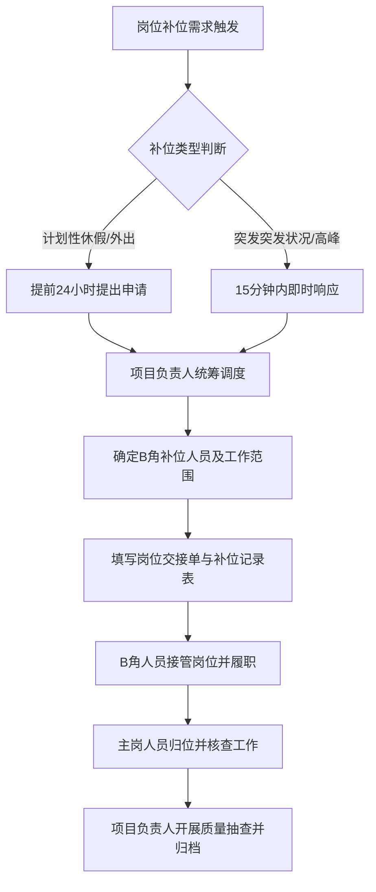

（三）项目负责人后备支援与后方专家库支撑

除4名常驻专职人员外，菲尔德咨询项目负责人承担总站的统筹管理职责，并作为全岗位的“终极C角”。当总站面临重大突发救助事件、多名人员同时因不可抗力无法到岗或政务迎检接待等极限场景时，项目负责人直接顶岗履职。同时，菲尔德咨询总部建立“社会救助专家与督导支援库”，常态化储备2名具备同等资质的后备人员，随时应对超过3天的长时间人员缺岗补位，确保派驻总站的人员数量始终保持在4人及以上。

三、交接追溯与质量控制机制

为防止动态补位过程中出现信息脱节、责任推诿或服务质量下滑，菲尔德咨询引入全过程追溯与质量控制机制，使每一次分工调整与岗位补位均有据可查、有凭可据、闭环管理。

（一）“四单合一”过程标准化管理

菲尔德咨询要求专职团队在日常运营与补位过程中，严格执行“4人排班表、岗位分工表、岗位交接单、补位记录表”的标准化套表管理：

1. 4人排班表：按月编制并在总站内部公示，明确每日主班、副班、外勤及备勤人员，作为考勤与现场履职的基准。

2. 岗位分工表：细化至每日各时段的具体工作事项，明确主岗位责任人与配合人员。

3. 岗位交接单：交接双方在岗位切换前必须当面签署《岗位交接单》，详细盘点未完结事项、待办急难个案、重点监测预警信息、固定资产及重要文书档案，明确交接时间点与责任边界。

4. 补位记录表：实时记录补位原因、补位起止时间、补位期间办理业务件数、异常情况处置及主岗归位后的复核确认意见。

（二）关键岗位不断档保障标准

菲尔德咨询明确规定总站服务大厅窗口与信息化监测平台为“绝对不断档岗位”。窗口服务时间段内，必须保证至少有1名具备资质的人员在岗坐班，严禁出现空岗、脱岗或由非专业人员代班现象；信息化平台在工作时间内必须保持实时在线与预警响应，确保上级派发或系统预警的救助信息在规定时限内完成接收、核实与转办。

（三）工作交接可追溯与定期复核

所有《岗位交接单》与《补位记录表》须在当日下班前汇总至项目负责人处审核签字，并按月装订成册备查。项目负责人每周对补位期间办理的业务进行不少于20%的随机抽查，重点复核政策解答准确性、数据录入完整度及救助转介时效性；针对抽查中发现的偏差，立即启动校正机制并在周例会上通报整改，确保服务质量平稳可控。

四、针对本项目实际的落地实施措施

菲尔德咨询充分考量武穴市社会救助工作的地理分布、救助对象结构特点及“一站式”联合救助机制的运行要求，将专职人员分工与动态补位机制深度融入武穴本地实际场景中。

（一）适应武穴市社会救助联合体总站的功能布局

武穴市社会救助联合体总站承载着“政策咨询、需求表达、资源整合、帮扶匹配、动态监测”等多重功能。菲尔德咨询派驻的4名专职人员在分工上与总站的实体功能分区保持高度映射：窗口受理岗固定坐镇综合服务大厅窗口；平台监测岗专职负责对接武穴市社会救助大数据平台及终端设备；资源协同岗与个案服务岗则采取“大厅接待与外围对接结合”的弹性工作制。当窗口出现阶段性群众办事高峰时，资源协同岗人员根据排班指令快速转换为“分流引导员”，协助开展资料预审与秩序维护，有效缩短群众等候时间。

（二）契合武穴市城乡救助对象的服务特点

武穴市辖区内包含街道与镇村，困难群众既有城镇低保、特困人员，也有偏远农村的留守老人、困境儿童及因病因灾致贫群体，需求呈现多元化与复杂化特征。针对这一实际，菲尔德咨询在实施动态补位时，特别强化“线上下线双向联动”。平台监测岗在发现偏远镇村的系统预警信息后，若当地基层救助力量反馈核实存在困难，个案服务岗（主岗D）与资源协同岗（主岗C）即时启动联合走访补位机制，组建2人入户调查小组前往现场开展深度需求评估，平台监测工作则由其B角接管，确保武穴市偏远地区的救助需求能够得到快速响应与精准帮扶。

（三）建立与武穴市民政及相关部门的协同对接机制

4名专职人员在分工中均明确了与武穴市民政局相关股室及联合体成员单位（如残联、慈善总会、医保、教育、住建等）的定期对接责任。窗口受理岗负责收集汇总跨部门救助申请材料；资源协同岗负责按周与慈善机构及社会组织梳理帮扶项目清单；平台监测岗负责与上级数据中心对接数据比对结果。在面对多部门联合会商或集中开展困难群众拉网式排查等阶段性重点工作时，菲尔德咨询启动“集中攻坚补位模式”，经项目负责人调度，暂时压减非紧急内部事务，集中3名专职人员力量协助民政部门开展集中数据梳理与项目匹配，保障武穴市委市政府及民政部门的重点救助工作按时高质量完成。

#### 2.2.2 合同签订至正式进场实施步骤

一、整体推进逻辑与阶段划分

菲尔德咨询为确保武穴市社会救助联合体服务项目（以下简称“本项目”）高效、有序、规范落地，结合武穴市社会救助工作实际及采购人业务指导要求，制定从合同签订至正式进场的标准化实施步骤。整体进场流程划分为“合同签订与筹备启动、方案拟定与人员报备、岗前培训与考核准入、业务衔接与现场准备、正式进场与评估验收”五个紧密衔接的阶段，确保每个步骤均有明确的时间节点、责任主体、交付物及核验标准。

实施全过程由菲尔德咨询指定的项目负责人统筹调度，并制定详细的《进场实施时间表》，在合同签订后2个工作日内向采购人提交并确认。各阶段实施步骤及关键控制要素如下表所示：

实施步骤与关键控制要素表
| 实施阶段 | 核心任务 | 责任主体 | 成果交付物 | 验收控制与核验标准 |
| :--- | :--- | :--- | :--- | :--- |
| 第一阶段：合同签订与筹备启动 | 签订服务合同；组建项目组；制定进场时间表 | 项目负责人 | 服务合同、《进场实施时间表》 | 进场时间表获采购人书面确认 |
| 第二阶段：方案拟定与人员报备 | 编制细化实施方案；提交4名专职人员全套档案 | 项目负责人、拟派人员 | 《项目细化实施方案》、人员资质档案册 | 人员资质100%符合招标及响应承诺 |
| 第三阶段：岗前培训与考核准入 | 开展社会救助政策、业务流程及职业道德培训；实施准入考核 | 培训讲师、项目负责人 | 培训教材、培训签到表、考核成绩单 | 考核合格率100%，不合格者一票否决 |
| 第四阶段：业务衔接与现场准备 | 与采购人进行业务指导对接；布置办公环境；配置设备 | 项目负责人、专职人员 | 《业务交接记录表》、办公设备清单 | 办公条件具备，业务资料无缝接收 |
| 第五阶段：正式进场与评估验收 | 人员全员到岗；启动联合体服务运营；联合核验 | 项目团队、采购人代表 | 《正式进场验收报告》 | 采购人签字盖章确认正式进场 |

二、进场实施步骤的具体展开

（一）第一阶段：合同签订与筹备启动
1. 合同签署与项目组激活
在收到中标通知书后，菲尔德咨询将按照招投标文件约定，在规定时间内与采购人正式签订服务合同。合同签订当日，菲尔德咨询即时激活项目专项服务组，授权项目负责人全面统筹后续筹备及进场工作。
2. 进场实施时间表编制与确认
项目负责人根据合同约定的服务起始期限，倒排工期，编制《进场实施时间表》。时间表将细化至每日的工作节点、责任人及配合事项，并在合同签订后2个工作日内主动与采购人沟通对接，完成时间表的确认与备案。

（二）第二阶段：方案拟定与人员报备
1. 细化实施方案编制
项目负责人结合武穴市社会救助政策规范及本项目采购需求，在合同签订后3个工作日内完成《项目细化实施方案》的编制。方案内容涵盖救助资源整合、对象摸排、服务转介、档案管理及制度建设等核心模块，确保方案切合武穴市实际情况，具备强操作性与落地性。
2. 4名专职人员档案提交与审核
菲尔德咨询严格按照投标响应承诺，将拟派驻本项目的4名专职人员（包括项目负责人及专职社会工作者/业务骨干）的全套资质材料整理成册，报送采购人审查备案。报送材料包括但不限于：
（1）身份证、学历证书、学位证书复印件；
（2）社会工作者职业水平证书（社工师/助理社工师）或相关专业技术职称证书；
（3）无犯罪记录证明、近半年体检合格报告；
（4）劳动合同及社保缴纳证明。
所有人员材料须经采购人复核通过后方可进入下一阶段。

（三）第三阶段：岗前培训与考核准入
1. 岗前专项培训组织实施
为了保证派驻人员迅速适应武穴市社会救助联合体的工作节奏与业务要求，菲尔德咨询在进场前组织为期不少于3天的封闭式岗前专项培训。培训内容分为四大板块：
一是政策法规板块，深入学习国家、湖北省及武穴市关于最低生活保障、特困人员供养、临时救助、专项救助等社会救助政策文件；
二是业务流程板块，熟练掌握社会救助申请受理、主动发现、入户调查、民主评议、审核确认及联合体资源转介等标准化操作规程；
三是系统操作与档案规范板块，掌握社会救助信息系统操作及“一户一档”台账整理规范；
四是职业操守与群众工作方法板块，强化服务意识、保密意识、风险防范及困难群众沟通技巧。
2. 考核准入与结果归档
培训结束后，由菲尔德咨询组织集中闭卷笔试与模拟实操考核。考核内容紧扣武穴市救助业务实际，设定合格分数为80分。
（1）考核合格者，由菲尔德咨询颁发岗前培训合格证书，准予上岗；
（2）考核不合格者，实行一票否决制，取消其派驻资格，由菲尔德咨询在24小时内启动备用人员替换机制，补位人员经重新培训并考核合格后方可上岗；
（3）培训签到表、现场培训影像、考核试卷及成绩单均由菲尔德咨询归档留存，并向采购人呈报备查。

（四）第四阶段：业务衔接与现场准备
1. 采购人业务指导对接
在正式进场前3个工作日，项目负责人带领团队主动对接采购人相关业务股室，建立常态化工作衔接机制。明确采购人的指导原则、日常考勤要求、业务交办渠道及信息报送路径，确保团队在采购人的统一业务指导下规范运行。
2. 历史数据与业务资料交接
在采购人的监督下，对既往社会救助相关业务资料、困难群众台账、合作社会组织名录及遗留事项进行系统整理与交接，填写《业务交接记录表》，由交接双方及采购人代表共同签字确认，确保业务连续性与数据安全性。
3. 办公环境与硬件设施布置
菲尔德咨询积极配合采购人完成项目办公场所的规划与布置。完成办公电脑、打印机、高拍仪、电话、网络设施及办公耗材的安装调试；设立清晰的标识牌、办事指南及社会救助联合体公示栏；配置健全的防火、防盗、档案保密设施，确保办公硬件条件完全具备正式运营要求。

（五）阶段五：正式进场与评估验收
1. 人员全员到位与进场启动
在完成上述所有准备工作后，4名专职人员于合同约定的正式进场日准时全员到岗，全面接管武穴市社会救助联合体日常运营服务工作。
2. 正式进场联合核验与验收
进场首日，由菲尔德咨询向采购人提交《正式进场验收申请报告》，并附带全套进场支撑材料。采购人对人员到岗情况、硬件配置情况、培训考核结果、业务交接完成度及实施方案可行性进行现场综合核验。核验通过后，采购人在《正式进场验收报告》上签字盖章，标志着本项目正式进入日常服务运营期。

三、实施步骤衔接与闭环控制逻辑

合同签订至正式进场实施步骤流程图
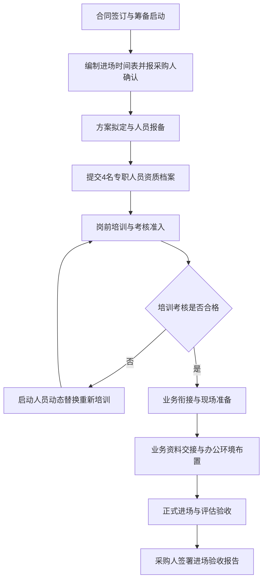

四、进场验收控制标准与支撑材料清单

菲尔德咨询将“逐条响应、逐项对应、可证明、可审查、可落地”的原则贯穿于进场全流程，进场全过程形成的支撑材料必须完整归档，并作为项目正式进场验收的必备条件。

（一）验收控制标准
1. 时间节点控制：各阶段工作必须严格按照采购人确认的《进场实施时间表》推进，延误节点须提早24小时书面说明原因并经采购人同意，确保正式进场时间绝不滞后。
2. 人员资质与到岗控制：派驻的4名专职人员必须与投标文件承诺人员一致；资质材料真实完整；进场当日到岗率达100%。
3. 培训考核控制：岗前培训覆盖率达100%，考核合格率达100%，未通过考核人员绝不上岗。
4. 业务衔接控制：历史台账交接无遗漏，业务指导路径明确，办公设备调试完毕且运行正常。

（二）进场支撑材料清单
在正式进场验收环节，菲尔德咨询将向采购人提交以下完整装订的“进场档案台账”：
1. 合同及规划类：《服务合同复印件》、《进场实施时间表》（采购人确认版）、《项目细化实施方案》；
2. 人员及资质类：《4名专职人员汇总名册》、人员身份证件、学历证书、社工职业资格证书、劳动合同及社保证明复印件；
3. 培训及考核类：《岗前培训方案与课程表》、《培训签到表》、培训现场影像资料、《岗前考核试卷与成绩汇总表》；
4. 交接与硬件类：《业务交接记录表》（三方签字版）、《办公设备与物资清单》；
5. 验收归档类：《正式进场验收报告》（采购人盖章生效版）。

通过上述严密的实施步骤、明确的责任分工、严格的考核准入及完善的台账管理，菲尔德咨询确保武穴市社会救助联合体服务项目实现平稳过渡、无缝衔接与高效进场，为后续提供高质量的社会救助服务奠定坚实基础。

#### 2.2.3 日常坐班值守与跨岗位协作

一、日常坐班值守规范与窗口管理

（一）市级总站坐班制与值守要求
菲尔德咨询为保障武穴市社会救助联合体（以下简称“武穴救助联体”）服务项目的稳健高效运营，在武穴市级社会救助总站全面实行标准化坐班值守制度。服务人员严格执行现场签到与定岗值守，确保救助窗口服务全时段不间断、不脱岗。
1. 坐班时间与作息管理
菲尔德咨询驻场团队严格遵守采购人统一规定的作息时间，实行每周5天、每天8小时的常态化坐班值守机制。在法性节假日或特殊极端天气等应急时期，按照采购人指令安排应急轮休与值班，确保救助服务绿色通道24小时畅通。
2. 窗口行为规范与服务礼仪
菲尔德咨询驻场人员在坐班期间须统一着装，佩戴印有身份信息与岗位职责的工作牌，保持仪表整洁端庄。面对来访的困难群众、服务对象及办事人员，统一使用规范、文明、耐心的服务用语，做到“来有迎声、问有答声、走有送声”。全面贯彻平等对待原则，严禁出现态度冷漠、敷衍塞责或歧视性言行，切实维护社会救助服务的严肃性与温情度。
3. 坐班值守工作台账建设
菲尔德咨询在坐班过程中建立全流程可追溯的标准化台账体系，每日按时记录并归档，确保制度落实到位、审查有据可查。

坐班值守标准化台账要素表
| 台账名称 | 记录频次 | 责任主体 | 核心记录内容 | 归档与复核机制 |
| --- | --- | --- | --- | --- |
| 每日考勤打卡表 | 每日两次（上下班） | 全体驻场人员 | 到岗时间、离岗时间、打卡定位、缺勤原因记录 | 联合项目负责人每周复核，按月报采购人备案 |
| 坐班值班日志 | 每日下班前 | 当班值守人员 | 接待人次、咨询事项、求助类型、转办去向、遗留问题 | 值班负责人每日签字确认，作为交接班依据 |
| 坐班交接班单 | 每日交接班时 | 移交人与接班人 | 未结救助事项、紧急跟踪件、采购人临时交办件、物品设备状态 | 双方当场签字确认，移交未尽事宜责任 |
| 服务质量巡检记录 | 每周不少于两次 | 质检员/项目负责人 | 窗口仪表、用语规范、在岗履职、台账完整度、群众满意度 | 形成周巡检报告，对发现问题限期24整改 |

（二）值守排班与请销假管理机制
菲尔德咨询建立严格的值守排班、交接班及请销假管理流程，由值班负责人统一调度，杜绝出现无人值守、擅离职守或无故缺岗现象。
1. 值守排班编制与公示
值班负责人于每月最后3个工作日前编制完成下月份《坐班值守排班计划表》，明确每日主班人员、辅班人员及应急替岗人员，报采购人审核备案后在总站公示栏及内部工作群发布，确保岗位责任清晰明确。
2. 规范交接班流程
交接班工作须提前15分钟进行。移交人须向接班人全面交接当日接办的救助申请件、紧急求助线索、上级交办事项以及服务台设备物资运行状况，填写《坐班交接班单》并共同签字。未完成交接手续前，移交人不得擅自离岗。
3. 请销假与临时调岗审批
驻场人员因病、因事或因公外出无法在岗值守时，须提前书面提交申请。请假半天以内由菲尔德咨询项目负责人审批并安排合规替岗；请假超过半天须经菲尔德咨询项目负责人审核后，报采购人主管领导批准。批准后由值班负责人启动动态调配机制，确保窗口坐班人员数量与服务质量不降低。

二、跨岗位协同运作与动态补位机制

（一）岗位职责拆分与跨岗位协同逻辑
菲尔德咨询针对武穴市社会救助联合体服务需求，将驻场团队划分为窗口接待、需求评估、资源对接、档案管理等核心职能板块。在明确个人主岗责任的基础上，打通跨岗位协作壁垒，形成“分工明确、业务互通、紧密配合、高效运转”的协同模式。

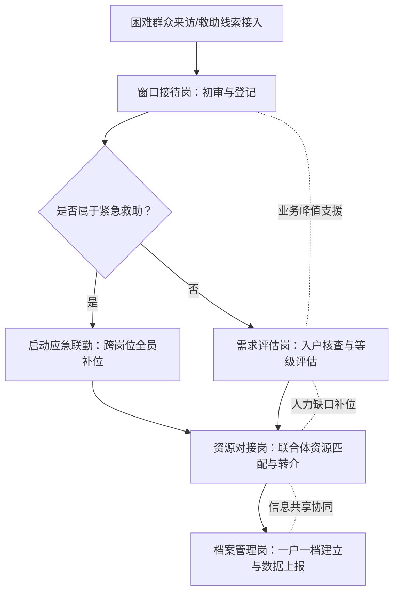

1. 窗口接待岗与需求评估岗的联动
窗口接待岗完成救助申请初审与信息登记后，实时将预审合格的表单通过系统或线下交接移交需求评估岗；需求评估岗在进行入户核查或集中评估时，窗口接待岗负责协助收集补充证明材料，确保信息流转无缝对接。
2. 资源对接岗与档案管理岗的协作
资源对接岗根据评估结果，协调社会救助联合体成员单位及社会资源进行帮扶匹配；档案管理岗同步跟进服务过程数据的采集与归档，做到帮扶措施实施一项、归档记录完善一项。

（二）跨岗位动态补位与应急响应
菲尔德咨询建立“一专多能、一岗多备”的跨岗位补位机制，确保在业务高峰期、人员请假或突发紧急救助事件时，项目团队能够迅速调整人力结构，维持总站高效运行。
1. 岗位交叉培训机制
菲尔德咨询定期对全体驻场人员开展全业务流程交叉培训，确保每名工作人员不仅精通本岗位业务，同时熟练掌握至少一个关联岗位的操作流程与政策标准。
2. 业务峰值与缺岗补位触发
当窗口出现群众集中办事、排队人数超过5人，或主班人员因公外出、病事假离岗时，值班负责人立即启动补位程序，调配辅班人员或需求评估岗人员充实窗口接待力量，保证办事群众等待时间不超过15分钟。
3. 突发紧急救助全员协同
面对重特大变故、急难型困难群众求助等突发情况，菲尔德咨询驻场团队迅速启动应急协同响应，窗口接待、需求评估与资源对接岗位全员联动，并行办理身份核验、现场评估、救助物资先行发放与救助资源快速转介，最大程度缩短救助响应时间。

三、坐班值守与协同实施的质量控制与反馈机制

（一）全流程质量控制指标体系
菲尔德咨询将作息落实、规范服务、缺岗补位及协同效率纳入项目质量控制考核体系，量化考核指标，确保服务过程可监控、服务结果可考评。

坐班与协同质量控制考核指标
| 质量控制维度 | 考核指标标准 | 监测方式 | 扣分与整改机制 |
| --- | --- | --- | --- |
| 作息与值守落实 | 准时到岗率100%，无擅自离岗、空岗、迟到早退现象 | 电子打卡、监控抽查、采购人随机巡查 | 发现1人次空岗扣减绩效分，并于当日补齐岗位 |
| 文明规范服务 | 佩牌上岗率100%，服务用语规范率100%，零有效投诉 | 现场巡检、服务对象满意度回访 | 发生态度恶劣或违规服务，限期24小时内整改并替换责任人 |
| 缺岗动态补位 | 补位响应时间≤10分钟，窗口等待时长控制在15分钟内 | 现场视频监控、值班日志调阅 | 补位不及时导致群众积压，取消当月优秀岗位评比并通报批评 |
| 跨岗位协同效率 | 救助事项转办时限≤1个工作日，档案归档及时率100% | 业务台账核查、流程节点追踪 | 协同梗阻导致超时办理，扣减相关责任人月度考核得分 |

（二）质量反馈、巡检与持续改进机制
菲尔德咨询通过建立“日巡查、周反馈、月汇总”的质量控制闭环机制，及时发现并整改坐班值守与跨岗位协作中的薄弱环节，切实提升采购人与服务对象的满意度。
1. 内部日常巡检与监督
菲尔德咨询项目质检员每周对市级总站坐班情况进行不少于两次的突击巡检，重点检查人员在岗履职、服务态度、台账记录及跨岗位协作衔接情况，填写《服务质量巡检记录》。
2. 采购人业务指导与意见反馈衔接
菲尔德咨询建立采招互动反馈通道，每周向采购人报送坐班值守与业务运行周报，主动听取采购人的业务指导意见；对采购人提出的改进要求，菲尔德咨询在24小时内制定整改方案并落实反馈。
3. 满意度测评与服务改进
在服务窗口设立意见簿、满意度评价器或二维码评价通道，定期对前来办理业务的困难群众进行满意度调查。将群众评价结果与团队绩效考核直接挂钩，针对评价中反映的突出问题，及时优化调整岗位协作流程与坐班安排，实现服务质量的持续提升。

#### 2.2.4 与采购人业务指导工作衔接

一、业务指导衔接机制与授权边界

（一）双向对接机制与固定联系人设置
菲尔德咨询为确保武穴市社会救助联合体服务项目的顺利推进，建立“专人对接、分级响应、全程留痕”的业务指导衔接机制。菲尔德咨询指定项目负责人作为与采购人（武穴市民政局及相关业务科室）的固定联系人，全面负责承接采购人的政策传达、业务指导、工作部署与日常监督。

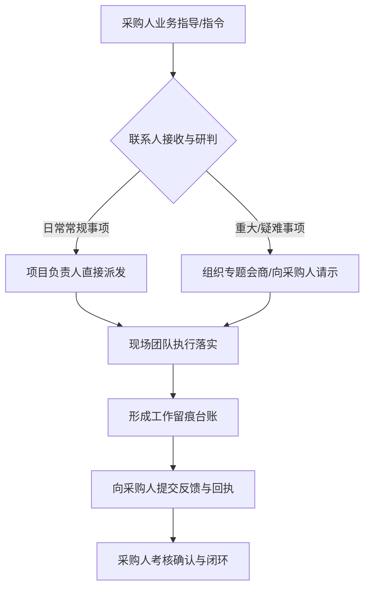

（二）业务指导衔接权责边界
菲尔德咨询明确划分业务指导与自主管理的权责界限，确保在采购人的政策指导和监督下开展专业化服务，既不逾越行政授权边界，也不推诿服务实施主体责任。

业务指导与协作权责划分表
| 维度 | 采购人（指导与监督主体） | 菲尔德咨询（执行与落实主体） | 衔接载体与凭证 |
| --- | --- | --- | --- |
| 政策与业务指导 | 出台救助政策、制定服务标准、明确阶段性重点工作 | 组织全员政策学习、转化服务流程、落实业务细则 | 政策传达记录、业务培训台账 |
| 事项分派与执行 | 下达救助服务任务、交办临时性核查或帮扶事项 | 快速响应、按时完成现场走访、评估及帮扶落实 | 任务分派单、服务完成报告 |
| 日常监督与考核 | 开展定期与不定期抽查、评估服务质量、提出整改意见 | 配合监督检查、提供原始台账、按时提交整改回执 | 检查记录表、整改反馈回执 |
| 疑难事项会商 | 研判复杂救助对象、协调跨部门资源、出具指导意见 | 提供详实调研数据、拟定专业建议方案、执行会商决议 | 专题会商纪要、疑难事项报告 |

二、日常请示、会商与执行反馈流程

（一）日常请示与报告制度
菲尔德咨询建立分级请示与定期报告制度，确保采购人随时掌握社会救助联合体的运营动态。
1. 定期报告：菲尔德咨询每月5日前向采购人提交《上月运营分析报告及本月计划》，每季度末提交《季度服务总结与质量评估报告》，年度终了提交《年度社会救助联合体运营总结报告》。
2. 专题请示：针对政策边缘对象认定、跨区域救助协调、突发性致贫致困家庭帮扶等特殊事项，菲尔德咨询于24小时内编制《专题请示报告》，呈报采购人定性与指示。

（二）业务会商与工作协调机制
1. 例会会商机制：菲尔德咨询建立周例会、月会商制度。每周五下午与采购人业务专员对接本周进展与下周计划；每月下旬与采购人分管领导及业务科室召开月度业务会商会，总结救助服务成效，研析疑难案例。
2. 紧急会商机制：遇重大舆情、极端困难个案或突发灾情救助，菲尔德咨询在2小时内启动紧急响应，固定联系人直报采购人，并在4小时内配合采购人完成现场会商与方案制定。

（三）任务接收、分派与执行闭环
菲尔德咨询制定严格的任务闭环管理流程，保障采购人下达的各项指令“件件有落实、事事有回音”。
1. 任务接收：固定联系人统一接收采购人通过书面公文、业务联系单或信息化系统下达的工作指令，进行登记编号。
2. 任务分派：项目负责人于2小时内完成任务拆解，填写《任务分派单》，明确责任人、完成时限及质量标准。
3. 执行过程反馈：对于周期性任务，实施“半程反馈”机制；对于时效性任务，每日汇报推进进度。
4. 成果交付与确认：任务完成后，菲尔德咨询汇总相关凭证形成《任务办结报告》，呈报采购人签字确认，完成闭环。

三、监督检查、服务评价与整改衔接

（一）配合采购人监督检查的举措
菲尔德咨询全方位配合采购人的日常巡查、专项检查及第三方评估工作。
1. 档案与数据开放：菲尔德咨询建立标准化档案管理体系，救助对象“一人一档”、服务过程“全程留痕”，随时接受采购人查阅。
2. 现场抽查配合：采购人进行入户抽查或电话回访时，菲尔德咨询无条件提供人员指引、路线规划及基础数据支撑，绝不隐瞒、干预真实情况。

（二）服务评价结果的对接与应用
菲尔德咨询将采购人的服务评价作为提升服务质量的核心依据。
1. 评价指标承接：主动对接采购人制定的社会救助联合体服务考核指标，将其量化分解至各岗位绩效考核中。
2. 满意度调查对接：定期向采购人汇报受助群众满意度调查结果，对采购人在抽查中发现的群众不满事项，第一时间列入重点跟踪清单。

（三）问题整改与回执管理
针对采购人在监督检查、日常巡查或服务评价中提出的整改要求，菲尔德咨询严格执行“三定”整改机制（定人、定时、定措施）。
1. 接收整改通知：收到采购人《整改通知书》后，项目负责人于24小时内组织核实并认领问题。
2. 制定整改方案：48小时内向采购人提交《整改方案》，明确具体整改措施、完成时限及责任人。
3. 执行整改与提交回执：一般问题在3个工作日内完成整改，复杂问题在5个工作日内完成整改。整改完成后，填写《整改反馈回执》并附佐证材料呈报采购人复核销号。

四、关键衔接表单与标准化台账

（一）业务衔接标准化表单体系
为确保与采购人业务指导工作衔接的标准化、规范化，菲尔德咨询推行“四单一纪要”标准化表单体系。

业务衔接标准化表单规范
| 表单名称 | 使用场景 | 核心填报内容 | 归档与管理要求 |
| --- | --- | --- | --- |
| 业务联系单 | 采购人下达临时性、专项性工作安排或菲尔德咨询请示事项 | 事项名称、指导意见、完成时限、联系人及签字 | 双向签字确认，一式两份，按月装订 |
| 任务分派单 | 项目负责人向内部团队拆解并分派采购人交办的任务 | 任务源头、责任人员、具体交付物、完成节点、验收标准 | 内部系统留痕，项目负责人每日追踪 |
| 专题会商纪要 | 与采购人召开业务例会、疑难个案研讨会 | 会议时间、参会人员、研讨议题、采购人指导意见、决议事项 | 会后24小时内整理完毕，呈采购人签发 |
| 整改反馈回执 | 配合采购人监督检查后，反馈问题整改落实情况 | 存在问题、整改措施、实施结果、预防复发机制、佐证材料 | 附现场照片或核查记录，呈采购人签字销号 |

（二）档案管理与信息化衔接
1. 纸质档案同步：所有业务联系单、会议纪要、整改回执等文件，均由菲尔德咨询专职档案员按月分类装订，建立“采购人业务指导专项档案”。
2. 电子台账实时更新：建立电子化业务指导衔接台账，实时更新事项办理进度、采购人批示意见及完成状态，确保采购人随时可调阅、可核查。

### 2.3 质量控制及反馈机制

#### 2.3.1 服务标准与过程质检

一、 服务标准制定与各业务场景作业规范

菲尔德咨询针对武穴市社会救助联合体服务项目（以下简称“武穴救助联体项目”）的实际需求，结合武穴市城乡社会救助工作特点，建立涵盖窗口接待、综合平台运营、多方协同响应、个案深度服务、救助宣传活动以及服务台账管理等六大核心业务场景的标准化作业规范。通过统一岗位职责、明确表单标准与控制关键节点，确保救助服务全程有据可依、标准化运行。

（一） 窗口服务标准化规范

窗口服务作为武穴救助联体项目的对外服务前沿，直接关系到困难群众的获得感与满意度。菲尔德咨询制定严格的窗口服务标准，规范服务流程与行为。

1. 岗位职责与行为规范
窗口服务人员需具备社会工作专业背景或救助政策熟悉度，执行首问负责制与一次性告知制。服务过程中需保持仪表整洁、用语规范，针对老年人、残疾人等特殊困难群体提供全流程引导与协助填写服务。

2. 业务办理流程与表单要素
窗口服务包含咨询接待、救助申请指引、材料初审、信息登记与转办分流等环节。办理过程统一使用《武穴市社会救助联合体窗口接待登记表》，表单必须完整记录服务对象基本信息、户籍所在地、困难类型（如低保、特困、临时救助、医疗救助等）、诉求事项、首次接待时间、经办人意见及后续分流去向。

3. 节点控制与时限要求
窗口接待信息必须在接诉后2小时内录入武穴救助联体信息平台；对于材料齐备的救助指引事项，当场完成初审与转办；对材料不全者，当场出具《一次性补正材料告知单》，明确补正内容与联系方式。

（二） 平台运营与协同响应服务规范

结合武穴市社会救助“一网统管”与多部门联动要求，菲尔德咨询建立平台运营与协同响应作业标准。

1. 平台数据运营规范
平台座席与数据员负责归集各渠道救助需求，开展数据比对、分类派单与动态跟踪。操作过程需遵守数据安全与隐私保护规定，确保困难群众敏感信息不外泄。

2. 多方协同响应机制
针对跨部门、跨领域的复杂救助需求，菲尔德咨询建立“联合体协同响应标准”。平台接单后，根据救助需求属性（医疗、教育、住房、就业、心理疏导等），在4小时内向相关成员单位或社会组织发起协同派单。

3. 表单要素与流转标准
协同响应全过程采用《武穴市社会救助联合体多方协同响应单》，规范记载需求来源、协同单位、牵头责任人、联合会商意见、服务实施路径与完成时限。各环节经办人须在平台上完成电子签名与节点确认。

（三） 个案服务与活动开展规范

针对特困人员、重病重残人员、困境儿童等复杂个案，以及政策宣讲、资源对接等救助活动，制定标准化操作指引。

1. 个案深度服务规范
个案服务遵循“预估-计划-实施-评估-结案”标准流程。入户调查需双人同行，全面评估服务对象的经济状况、健康状况、居住环境与心理需求。个案服务过程须形成完整案卷，包含《个案入户评估表》《个案服务计划书》《服务过程记录表》及《结案评估报告》。

2. 救助宣传与主题活动规范
宣传活动需提前编制《活动实施方案》，明确活动主题、服务对象范围、资源预算及安全应急预案。活动现场需规范设置咨询台、宣传展板与资料发放区，活动结束后3个工作日内完成《活动总结报告》及满意度问卷汇总。

（四） 业务台账管理规范

台账是救助服务全过程留痕与质量可追溯的基础依据，菲尔德咨询实行“一户一档、一事一档”的全生命周期台账管理。

1. 台账分类与编码规则
台账分为基础管理台账、服务实施台账、协同资源台账与质量监管台账四大类。统一采用“项目代码-业务类型-年份-序号”的标准化编码规则，实现纸质档案与电子档案同步映射。

2. 台账填写与归档要求
台账记录必须真实、完整、清晰，禁止涂改、伪造或事后补记。服务记录需具备服务对象签名、经办人员签名及现场照片（需附时间地点水印）等核心凭证。每周完成当周台账整理，每月进行归档封存。

针对上述六大业务场景，菲尔德咨询将岗位职责、表单要素与质量目标整理如下表所示：

业务场景标准化规范与控制要素表

| 业务场景 | 岗位职责要求 | 核心表单要素 | 核心质量目标 |
| :--- | :--- | :--- | :--- |
| 窗口服务 | 执行首问负责制、一次性告知，开展接待、指引与初审 | 《窗口接待登记表》《一次性补正告知单》 | 挂号登记率100%，告知准确率100%，群众现场满意度>95% |
| 平台运营 | 负责需求归集、数据比对、分类派单与动态跟踪 | 《平台接处单记录》《数据比对核查表》 | 派单及时率100%，数据录入准确率99.5%以上 |
| 多方协同 | 组织跨部门会商，协调社会资源，跟踪协同进度 | 《多方协同响应单》《资源对接确认表》 | 协同响应发起率100%，协同事项按期结案率>90% |
| 个案服务 | 开展入户评估、制定个案计划、实施深度帮扶与结案 | 《个案评估表》《个案计划书》《服务记录表》 | 入户核查真实率100%，案卷材料齐全率100% |
| 活动开展 | 编制方案、布置现场、宣传政策、收集反馈与总结 | 《活动实施方案》《活动签到表》《活动总结》 | 目标人群覆盖率>90%，活动满意度>90% |
| 台账管理 | 负责服务过程留痕、档案整理、编码封存与信息化归档 | 《台账归档目录》《档案借阅与复核记录》 | 档案一户一档建档率100%，凭证要素齐全率100% |


二、 三级过程质检体系与交叉复核机制

为确保武穴救助联体项目的高质量运行，菲尔德咨询构建“日检、周检、阶段抽查”三级过程质检体系，并引入区域与业务组间的交叉复核机制，全面覆盖服务全流程。

（一） 三级质检组织架构与职责分工

菲尔德咨询设立武穴救助联体项目质量控制小组，由项目经理任组长，专职质检员、各业务板块负责人及档案管理员组成，明确各级质检主体与职责边界。

1. 日常检查（日检）
由各业务板块负责人及现场督导执行。每日下班前对当日窗口接待、平台接单、协同派单及活动现场进行全量核查，重点检查表单填写的完整性、当日结续情况以及服务态度。

2. 周期检查（周检）
由项目专职质检员执行。每周五对本周归档的个案案卷、协同响应单、服务台账进行抽查，周抽查比例不低于本周业务总量的30%。重点核查服务流程合规性、时限达标率及服务记录的真实性。

3. 阶段抽查（阶段检）
由质量控制小组组长（项目经理）联合外部专家组织开展，每季度执行一次。对项目所有服务类型进行全面质量评估，抽查比例不低于季度业务总量的15%，并开展服务对象电话回访与现场走访验证。

（二） 交叉复核机制实施路径

为消除内部检查的盲区与人情干扰，菲尔德咨询建立“跨区域、跨业务组”的交叉复核机制。

1. 复核分组与对调安排
将项目团队划分为“街镇服务复核组”与“平台协同复核组”。每月随机抽取对方组内上一月度的服务案卷与台账，进行互查互评。

2. 交叉复核实施标准
复核人员依据统一的《质检评分细则》，采取“凭证核对法”“逻辑校验法”和“电话抽样核验法”，对服务记录中的服务时间、服务内容、服务对象签名及佐证照片进行深度比对，防止虚构服务或记录不实。

（三） 质检工作流程与闭环运转

过程质检遵循“计划-检查-记录-反馈-复核”的标准流程。下图展示了菲尔德咨询在武穴救助联体项目中的过程质检与交叉复核机制流转路径：

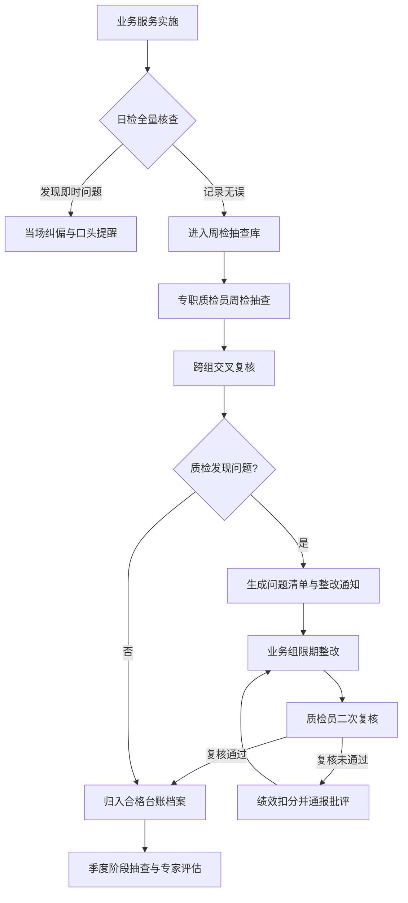


三、 质检工具表单设计与痕迹化管理

菲尔德咨询通过标准化工具表单将质量控制落实到具体载体，建立《服务质量检查表》《质量问题清单》和《质量整改记录表》，实现质检全过程留痕与可追溯。

（一） 《服务质量检查表》设计与应用

《服务质量检查表》是开展日检、周检和交叉复核的标准化工具。表格设定定量评分与定性评价相结合的结构，具体设计如下表所示：

武穴市社会救助联合体服务质量检查表（样表）

| 检查维度 | 检查内容与评分标准 | 分值 | 扣分标准 | 实得分 | 检查凭证/备注 |
| :--- | :--- | :--- | :--- | :--- | :--- |
| 规范响应 (25分) | 1. 窗口与平台接待符合首问负责制及一次性告知要求。<br>2. 协同响应单在规定时限（4小时）内完成转办。 | 25 | 缺少告知扣5分；超时转办每件扣5分。 |  | 查看《窗口接待登记表》与平台流转日志 |
| 材料完整 (25分) | 1. 救助台账一户一档，基本信息、评估表、记录表齐全。<br>2. 服务凭证具备服务对象签名及带水印现场照片。 | 25 | 缺少核心材料每件扣10分；签名或照片缺失扣5分。 |  | 查阅纸质案卷与系统电子凭证 |
| 流程合规 (25分) | 1. 个案服务严格按照预估、计划、实施、结案流程推进。<br>2. 复杂协同事项具备多方联合会商记录。 | 25 | 跨越关键节点每件扣10分；未会商自行处理扣5分。 |  | 核对《个案计划书》与《协同响应单》 |
| 真实有效 (25分) | 1. 服务记录真实，无虚构服务、重复计次或逻辑矛盾。<br>2. 抽样电话回访服务对象，核实服务发生事实。 | 25 | 发现一例虚假记录本项得0分；回访不符扣10分。 |  | 现场电话回访记录及入户核验凭证 |
| 综合评价 | 检查人员签字：&nbsp;&nbsp;&nbsp;&nbsp;&nbsp;&nbsp;&nbsp;&nbsp;&nbsp;&nbsp;&nbsp;&nbsp;&nbsp;&nbsp;&nbsp;&nbsp;&nbsp;&nbsp;&nbsp;&nbsp;被检查组负责人签字：&nbsp;&nbsp;&nbsp;&nbsp;&nbsp;&nbsp;&nbsp;&nbsp;&nbsp;&nbsp;&nbsp;&nbsp;&nbsp;&nbsp;&nbsp;&nbsp;&nbsp;&nbsp;&nbsp;&nbsp;日期：202  年  月  日 |  |  |  |  |


（二） 《质量问题清单》与《质量整改记录表》应用规范

1. 问题清单的生成与分类
质检人员在检查或交叉复核中发现问题后，必须在24小时内填制《质量问题清单》。问题分为三级：三级问题（一般文书瑕疵）、二级问题（流程节点延迟或材料缺失）、一级问题（服务记录不实、严重逾期或服务对象重大投诉）。

2. 整改记录与限期闭环
收到问题清单的业务组必须在指定时限内（三级问题24小时内，二级问题48小时内，一级问题24小时内启动并持续处置）完成整改，填制《质量整改记录表》，详细说明整改措施、整改结果，并附纠偏后的证明材料。

3. 二次复核与销号机制
质检人员对整改结果进行二次复核，确认整改到位后予以销号；对整改不力或超时未整改的，直接与当月绩效考核挂钩，严防同类问题再次发生。


四、 质检目标管理与多维质量保障

菲尔德咨询围绕“资料真实完整、流程节点齐全、服务对象反馈可核验”的三大核心质量目标，制定量化指标与针对性保障措施，确保武穴救助联体项目高效合规运行。

（一） 资料真实完整性保障措施

1. 全要素凭证链条管理
所有线下服务必须留存“纸质表单+服务对象手写签名+带时间经纬度水印照片”的全套凭证；线上服务必须留存完整日志与电子留痕，确保每笔服务均有源可溯。

2. 定期防伪与逻辑核查
质检团队每月运用大数据分析工具，对台账数据进行重名、重号、服务频次异常及服务时间逻辑冲突（如同一服务人员同一时间在不同地点提供服务）等自动筛查，从源头杜绝虚构服务与虚假台账。

（二） 流程节点齐全性保障措施

1. 节点硬性控制机制
将服务标准内化至平台业务流转系统中，设置节点强管控逻辑。前一环节表单未上传、审批未通过的，系统自动锁定下一环节操作权限，避免人为跳过评估、会商或结案环节。

2. 阶段节点预警与催办
系统设定临期自动预警功能，对即将到期的高龄特困帮扶、个案结案、协同响应事项提前进行催办提醒，确保服务流转按质按时完成。

（三） 服务对象反馈可核验保障措施

1. 100%全覆盖满意度收集
每项服务完成时，通过线上推送评估或线下填写《服务满意度评价表》，收集服务对象对服务态度、专业能力及帮扶效果的评价。

2. 随机抽样穿透式回访
质检小组每月按照不低于20%的比例，通过电话回访与入户实地核验相结合的方式，对已结案的救助对象进行抽样核查。重点核实“服务是否真实发生、服务人员是否到位、诉求是否得到实质化回应”，确保反馈结果真实可信、评审可查可验。

通过上述服务标准规范、三级过程质检、标准化表单应用及核心质量目标保障，菲尔德咨询构建起覆盖武穴救助联体项目全过程的质检闭环体系，全面提升救助服务的规范化、专业化与精准化水平。

#### 2.3.2 监督检查服务评价与整改闭环

一、 监督检查服务评价与整改闭环工作机制

菲尔德咨询为保障武穴市社会救助联合体服务项目的高质效运转，构建“全周期培训提质、多维度监督评价、全流程销号整改”的监督检查与整改闭环管理体系。本机制由菲尔德咨询项目负责人与质量负责人共同牵头，将岗前培训、过程检查、服务评价与风险预警深度融合，确保各项救助服务响应具备可追溯性、可考核性和可落地性。

二、 岗前培训与业务提质实施安排

菲尔德咨询将培训作为质量控制的前置关口，建立分类、分层的常态化培训机制。培训体系紧扣武穴市社会救助政策规范、救助对象心理特征以及联合体资源调度流程，保障服务人员具备扎实的业务功底与合规意识。

（一） 培训组织与责任分工

培训工作由菲尔德咨询项目负责人总体策划，联合质量负责人共同实施。项目负责人统筹培训资源、审批培训大纲；质量负责人具体落实课程设计、考勤管理、考核评估及培训档案归档工作。

（二） 分级培训计划与内容设计

1. 岗前入职培训
针对新进服务团队人员，在正式派驻前集中开展不少于16学时的岗前培训。培训内容涵盖《社会救助暂行办法》及湖北省、武穴市最新救助政策法规、菲尔德咨询服务行为规范、服务礼仪、职业道德、保密守则及紧急突发事件应急处置预案。考核合格后方可持证上岗。

2. 常态化业务提升培训
每月组织不少于4学时的业务进修培训。重点梳理社会救助对象识别、困难家庭需求评估方法、个案社会工作技巧、社会资源整合路径及救助服务信息系统操作规范。紧密结合武穴市各镇（街道）实际救助案例展开研讨，针对政策更新、服务痛点及时补充培训内容。

三、 多维监督检查与服务评价体系

菲尔德咨询建立“内部三级质检”与“外部多方评价”相结合的监督检查体系，确保对服务实施过程进行全方位、无死角的动态监管。

（一） 监督检查实施路径

1. 日常自查
服务小组每日对救助台账、探访记录、服务工单进行自检，确保当日服务数据真实、完整、准确。

2. 阶段抽查
质量负责人每周采取“不打招呼、随机抽样”的方式，对武穴市辖区内开展的社会救助服务进行现场督导或电话回访，每周抽查比例不低于当周服务总量 的 15% 。

3. 专项检查
项目负责人每月会同质量负责人，针对重点救助对象（如特困供养人员、重度残疾人、孤儿及困境儿童等）的救助服务落实情况进行专项检查，评估服务方案的匹配度与落地效果。

（二） 服务评价多方交互机制

评价体系涵盖服务对象评价、采购人评价以及第三方评价三个维度：

1. 服务对象满意度评价
每次现场服务结束后，由服务对象或其监护人填写《社会救助服务评价表》，或由质检人员通过电话回访进行满意度测评。评价指标包括服务态度、到场及时性、问题解决率及专业水平。

2. 采购人日常履约评价
配合武穴市民政局及相关主管部门，定期汇报项目进展，接受采购人对联合体运作效率、资源调配能力、服务质量及合规性履约情况的考核评估。

3. 服务评价与检查响应对照表

| 评估维度 | 检查/评价主体 | 频次与覆盖率 | 核心指标与内容 | 成果交付物 |
| :--- | :--- | :--- | :--- | :--- |
| 岗前与业务培训 | 菲尔德咨询质量负责人 | 入职必训；每月不少于4学时 | 政策法规、操作规范、服务礼仪、应急处置、个案技巧 | 培训签到表、考核试卷、培训档案 |
| 过程监督检查 | 质量负责人、项目负责人 | 周抽查≥15%；月度专项检查全覆盖 | 履约时效、服务台账真实性、规范化操作、安全隐患 | 监督检查记录表、每周质检通报 |
| 服务对象评价 | 救助对象及其家属 | 每次服务后评价；月度电话回访 | 服务态度、专业能力、到场及时性、问题解决满意度 | 服务评价表、满意度汇总分析报告 |
| 采购人监督评价 | 武穴市民政局及主管部门 | 月度汇报、季度履约考核 | 联合体协同效率、资金合规性、服务达标率、社会效应 | 履约阶段性汇报文件、考核扣分整改意见 |

四、 问题登记与四步整改销号闭环

菲尔德咨询针对监督检查、服务评价及采购人反馈中发现的所有问题，实施“登记-分派-整改-复核销号”的标准化闭环管理流程。

（一） 整改闭环工作流程图

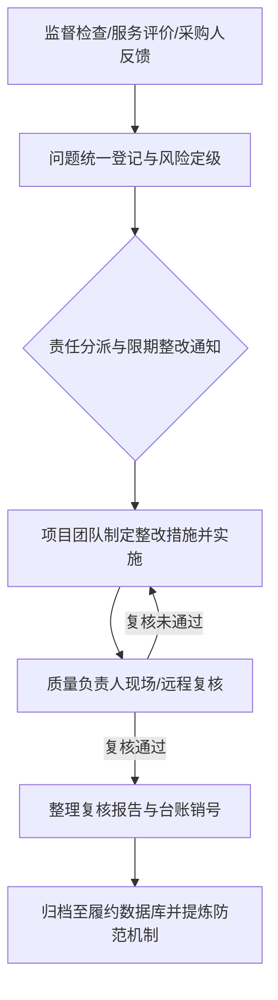

（二） 闭环管理具体步骤

1. 登记归类
建立统一的《监督检查与服务评价问题登记台账》。质量负责人对收集到的所有问题进行统一编号、详细记录问题来源、发生地点、涉及人员及具体表现形式。

2. 责任分派
项目负责人接到问题报告后，在 2 个小时内完成责任认定，明确具体整改责任人及协助人员，下发《服务问题整改通知单》，明确整改期限与标准。

3. 限期整改
整改责任人须严格按照整改通知单要求，分析问题根源，制定切实的整改措施，并在规定时限内完成整改动作。

4. 复核销号
整改完成后，整改责任人提交整改结果报告及相关支撑材料（如现场照片、补救台账、服务对象签字认可书等）。质量负责人采取现场核验或电话复核方式进行验证，确认达标后在台账中予以“销号”；未达标则退回重新整改，并追究责任人绩效责任。

五、 分级风险控制与预警响应策略

菲尔德咨询将检查与评价中发现的问题划分为一般问题、重复问题和重大问题三个等级，采取差异化的风险控制应对措施，确保项目整体风险可控。

（一） 一般问题：动态纠偏与即时改进

1. 认定标准
指偶发性的服务文书填写不规范、服务礼仪欠佳、非核心服务时效轻微延迟等对救助对象未造成实质性影响或损害的问题。

2. 控制措施
责任人须在 24 小时内完成整改。质量负责人进行口头提醒并在当周质检例会上予以通报，引导全员即时改进。

（二） 重复问题：根因分析与机制重塑

1. 认定标准
指同一服务团队或同一责任人连续两次以上出现同类一般问题，或同一类服务流程在不同辖区反复出现瑕疵。

2. 控制措施
由质量负责人组织项目团队召开专题分析会，运用因果分析法深挖管理漏洞或流程缺陷；在 48 小时内完成整改，并修订完善相关服务标准规范，开展专项再培训，杜绝此类问题再次发生。

（三） 重大问题：即时响应与风险管控

1. 认定标准
指涉及救助对象切身利益受损、重大安全隐患、违规操作、服务引发群体性诉求或采购人明确通报批评的严重事项。

2. 控制措施
（1） 菲尔德咨询项目负责人须在 15 分钟内启动应急响应，赶赴现场控制局势，阻止风险扩大。
（2） 在 1 小时内向采购人进行口头及书面首次汇报，说明事件原委及初步处置措施。
（3） 24 小时内提交全景调查报告及专项整改方案，并在采购人指导下完成全面整改。
（4） 对相关直接责任人给予通告批评、扣减绩效乃至辞退处理，项目负责人向公司提交专项检讨报告。

（四） 整改闭环与风险控制台账管理规范

| 问题等级 | 响应与时限要求 | 处理机制与责任人 | 复核销号与交付成果 |
| :--- | :--- | :--- | :--- |
| 一般问题 | 2 小时内分派；24 小时内完成整改 | 即时纠偏，口头提醒；整改责任人具体落实 | 质量负责人抽查复核；更新《整改台账》 |
| 重复问题 | 2 小时内分派；48 小时内完成整改 | 根因分析，流程再造，专项培训；质量负责人主导 | 现场复核，提交《原因分析与流程优化报告》 |
| 重大问题 | 15分钟响应，1小时内上报；24小时内解决 | 启动应急预案，现场处置，严肃问责；项目负责人牵头 | 采购人认可销号；提交《重大事件调查与整改复核报告》 |

六、 监督评价与整改成果的资料归档

菲尔德咨询将监督检查服务评价与整改闭环过程中形成的所有文件资料视同核心履约资产，实行标准化归档管理。

（一） 资料归档范围

包括但不限于：岗前及业务培训签到表、培训教材、考核试卷；每周质检记录、月度专项检查报告；服务对象评价表、满意度统计分析报告；《监督检查与服务评价问题登记台账》、《服务问题整改通知单》、整改复核报告及向采购人提交的阶段性质量控制汇报材料。

（二） 档案管理要求

档案由质量负责人专人统一管理，建立电子化与纸质化双重档案库。所有整改销号记录须经项目负责人与质量负责人双签字确认。归档资料定期整理成册，作为项目阶段性履约汇报及采购人考核的重要依据，确保武穴市社会救助联合体服务项目全过程质量记录可追溯、可核验。

#### 2.3.3 群众投诉服务纠纷处理

一、群众投诉与服务纠纷处置机制

（一）投诉与纠纷受理管道建构
菲尔德咨询针对武穴市社会救助联合体服务项目的特殊性，建立多渠道、全天候、无障碍的群众投诉与服务纠纷受理体系。服务对象、救助对象家属以及社会公众可通过电话、信访、网络或当面反映等方式提出诉求。菲尔德咨询设立专职投诉服务岗位，明确受理范围与处置职责，确保救助服务过程中的各类矛盾与纠纷能够在第一时间被发现、被记录、被响应。

1. 受理渠道建设
菲尔德咨询在武穴市社会救助联合体服务站点设立群众诉求服务窗口，并公布专线服务电话。建立健全线上与线下相结合的诉求收集网络，涵盖以下四种主要受理途径：
（1）电话热线：设立7×24小时服务热线，由专职投诉专员接听并记录。
（2）现场接待：在联合体服务中心及各镇（街道）救助服务站设立现场接待室，安排专人负责当面诉求登记。
（3）意见箱与信访：在各服务站点显著位置设置群众意见箱，定期开箱收集书面意见；接办采购人、民政部门转办的信访件。
（4）网络与微信端：对接武穴市民政部门或社会救助联合体在线服务平台，开设线上服务评价与纠纷投诉入口。

2. 专职人员配置与责任落实
菲尔德咨询配备具有心理学、社会工作及法律基础背景的专职投诉专员，负责日常诉求的接入、登记与初步分流。
（1）投诉专员职责：负责如实记录投诉人信息、诉求事项、发生时间、涉及人员及相关证据材料；完成初步核实并按规定时限呈报项目负责人。
（2）项目负责人职责：负责审定纠纷调查方案，指挥调配处置资源，主持重大纠纷研判会议，审定处置意见及整改措施，向采购人进行专项汇报。
（3）服务团队配合职责：涉事救助社工、入户核查人员及后勤保障团队有义务配合调查，提供真实、完整的服务记录与现场资料，不得隐瞒或弄虚作假。

（二）群众投诉与纠纷标准处理流程
菲尔德咨询制定严格的群众投诉与服务纠纷处理标准作业程序（SOP），涵盖受理登记、调查核实、沟通调解、反馈确认、整改落实及归档备查等六个标准环节，形成闭环管理模式，切实做到事实清楚、责任明确、处置得当、矛盾不升级。

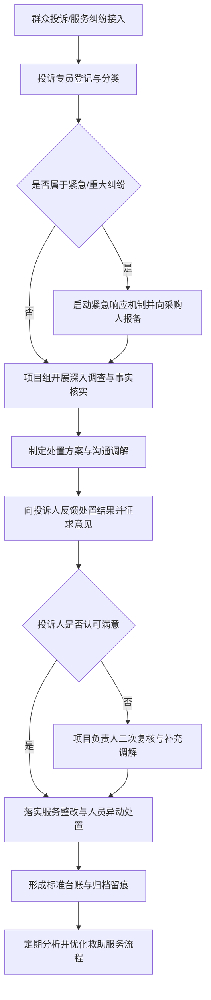

1. 受理登记环节
接到群众投诉或服务纠纷反映后，投诉专员必须在15分钟内完成《群众投诉与服务纠纷登记表》的填写。记录内容须真实、客观、准确，不得随意筛选或遗漏信息。登记要点包括：投诉人基本信息（姓名、联系方式、与救助对象关系）、被投诉人员或服务事项、诉求发生时间与地点、具体诉求内容及相关凭证。

2. 调查核实环节
（1）一般性服务纠纷：项目组在受理后2个工作小时内启动调查，通过调取入户走访记录、服务对象档案、现场音频或视频资料，以及询问同组工作人员和周边群众，完成事实认定。
（2）复杂或重大纠纷：项目负责人亲自带队，在4个工作小时内赴现场进行实地调查，调取原始核查数据与评估报告，必要时邀请社区（村）干部或第三方人员共同参与现场核查。

3. 沟通调解环节
坚持“救助情怀、依法依规、换位思考、心理疏导”的原则。在厘清事实的基础上，由项目负责人或专职调解人员与投诉人展开面对面沟通。
（1）若属于服务态度差、沟通不当等菲尔德咨询人员责任，主动向服务对象赔礼道歉，当场予以纠正。
（2）若属于政策理解偏差引起的纠纷，由专业社工进行社会救助政策的细致解读与心理抚慰，消除误解。
（3）若属于救助对象诉求超出政策允许范围，在耐心解释的同时，积极链接社会慈善资源给予关爱补助。

4. 反馈确认环节
处置方案确定后，投诉专员在规定时限内向投诉人进行正式答复。
（1）答复方式：优先采用当面答复或书面答复，不具备条件的采用电话答复，并全程录音留痕。
（2）确认回访：答复完成后的3个工作日内，由项目质量控制人员进行二次满意度回访，确认投诉人对处置结果的意见。若投诉人仍有异议，启动二次复核程序。

5. 整改落实与人员异动处置
对调查属实的服务质量缺陷或违规行为，菲尔德咨询下发《服务质量整改通知书》，责令相关责任组或责任人限期整改。
（1）人员培训与警告：对因服务态度不佳、沟通方式不当引发纠纷的人员，给予通报批评并强制进行为期3天的服务规范与职业道德再培训。
（2）岗位调整与清退：对因违规操作、服务粗暴、弄虚作假导致严重群众投诉或造成恶劣社会影响的人员，菲尔德咨询将立即停止其项目履约工作，办理人员异动或解除劳动合同，并在24小时内向采购人报备补充人员方案。

6. 归档备查环节
每一起投诉或纠纷处置完毕后，投诉专员需在2个工作日内完成案卷整理，形成“一案一档”。档案资料包括：投诉登记表、现场调查笔录、音视频佐证材料、处置方案批复、整改回执、满意度回访记录等，确保全程留痕可追溯。

二、服务纠纷分类等级与响应时效机制

（一）纠纷等级划定标准
为实现精准高效处置，菲尔德咨询根据服务纠纷的性质、影响范围、严重程度及涉及人员，将群众投诉与服务纠纷划分为三个等级：

1. 三级纠纷（一般纠纷）
指在社会救助入户调查、服务对象满意度回访或日常咨询过程中，因服务态度不够热情、沟通解释不够细致、预约时间变更未及时通知等引发的服务对象轻微不满或误解，未造成不良社会影响的情形。

2. 二级纠纷（较大纠纷）
指因救助对象资格初审认定程序争议、服务标准落实不到位、救助物资发放延误、入户核查行为不规范引发的反复投诉，或投诉人向民政部门、采购人进行书面信访反映的情形。

3. 一级纠纷（重大/紧急纠纷）
指因服务人员严重违反社会救助工作纪律、利益冲突、现场言行激化矛盾引发群众集聚、网络舆情传播，或服务对象采取过激行为、涉及人身安全与重大经济纠纷的情形。

（二）分级响应与处理时效
菲尔德咨询制定严格的时效控制指标，确保各类纠纷在规定时间内高效化解，杜绝拖延扯皮。

群众投诉与服务纠纷分级响应及处置标准表

| 纠纷等级 | 响应时效（接入至启动调查） | 现场到达时效（如需现场） | 处置方案形成时效 | 最终答复与闭环时效 | 责任主体 | 采购人报备机制 |
| :--- | :--- | :--- | :--- | :--- | :--- | :--- |
| 三级纠纷（一般） | 30分钟内 | 2小时内（武穴市区）<br>3小时内（偏远镇街） | 12小时内 | 24小时内 | 投诉专员<br>片区服务组长 | 每周汇总向采购人报送工作台账 |
| 二级纠纷（较大） | 15分钟内 | 1小时内（武穴市区）<br>1.5小时内（偏远镇街） | 24小时内 | 48小时内 | 项目负责人<br>质量控制组长 | 2小时内向采购人进行口头及书面报备 |
| 一级纠纷（重大） | 立即响应（5分钟内） | 30分钟内赶赴现场 | 6小时内 | 24小时内完成阶段性处置与平息 | 公司主管领导<br>项目负责人 | 15分钟内向采购人及主管部门口头汇报，2小时内报送书面材料 |

三、纠纷处理台账与归档闭环管理

（一）闭环管理台账体系
菲尔德咨询建立“登记-调查-处置-反馈-整改-归档”的全链条台账管理制度，确保每一件群众投诉和纠纷处理过程可查、结果可核、责任可究。

1. 投诉登记与处置闭环台账
项目部设立统一的电子与纸质《群众投诉与服务纠纷处置闭环台账》，对所有接办事项进行动态追踪。台账包含但不限于以下核心字段：
（1）基础信息：投诉编号、接报时间、受理渠道、投诉人姓名、联系电话、救助对象身份信息及所属镇（街道）。
（2）事由与分类：投诉具体事由、涉及服务环节（如入户核查、帮扶服务、态度问题等）、划定纠纷等级。
（3）调查与处置：调查责任人、事实认定结果、处置方案摘要、调解沟通记录、反馈答复时间与方式。
（4）闭环与整改：投诉人满意度评价、整改措施落实情况、核查销号人及归档编号。

2. 阶段性反馈与采购人对接
（1）周报制度：每周一向采购人提交上周《群众投诉与纠纷处置周报》，汇总分析诉求热点与高发环节。
（2）月度分析：每月召开质量分析会议，对当月发生的纠纷进行根因分析，形成月度质控报告呈报采购人。
（3）重大事件即时通报：凡涉及一级纠纷或可能引发舆情关注的事项，菲尔德咨询在规定时间内向采购人报送《紧急事件处置进展专报》，服从采购人的统一指挥与调度。

（二）归档材料规范
纠纷处置完成后，菲尔德咨询按照档案管理标准完成材料归档，归档档案保存期限不少于5年，确保武穴市社会救助联合体服务项目的全过程履约安全与痕迹管理。

群众投诉与服务纠纷“一案一档”归档清单

| 档案模块 | 包含具体材料内容 | 格式要求与留痕载体 | 归档责任人 |
| :--- | :--- | :--- | :--- |
| 受理与登记模块 | 《群众投诉与服务纠纷登记表》<br>电话录音文件、网络诉求截图、书面信访件原件 | 纸质盖章件<br>MP3音频/PNG图片电子档 | 投诉专员 |
| 调查与核实模块 | 《服务纠纷现场调查笔录》<br>服务现场音频/视频资料、入户核查原始记录、第三方证言 | 纸质签字件（含被调查人、调查人签字）<br>高清音视频电子文件 | 项目调查组员 |
| 处置与沟通模块 | 《服务纠纷处置方案审批表》<br>《调解协议书》或沟通记录表、向采购人报备的报告 | 纸质盖章件<br>微信沟通记录截图 | 项目负责人 |
| 反馈与整改模块 | 《满意度回访记录表》<br>《服务质量整改通知书》及整改成果复核报告<br>人员异动处理决定 | 纸质签字件<br>整改前后对比照片 | 质量控制专员 |

四、武穴市本土化场景下的纠纷预防与演练

（一）结合武穴实际的纠纷预防措施
社会救助服务直接面对困难群众，服务对象的心理敏感度高、情绪易波动。菲尔德咨询立足武穴市各镇（街道）城乡结构特点与救助工作实际，采取针对性的预防措施，从源头上减少服务纠纷的发生。

1. 服务前告知与政策透明化
在开展武穴市社会救助联合体入户核查、需求评估及帮扶服务前，菲尔德咨询工作人员统一佩戴工作牌，主动出示采购人授权的文件与身份证明。向服务对象发放《社会救助服务告知书》与《服务廉洁监督卡》，明确告知服务内容、工作流程、免费政策及监督举报电话，消除服务对象的疑虑。

2. 强化社工沟通技巧与情绪管理
针对武穴市偏远农村地区高龄、重病、重残等特殊救助对象，菲尔德咨询定期开展武穴方言沟通、群众工作方法及退行性情绪疏导专项培训。要求服务人员在入户过程中保持尊重、耐心与倾听，严禁使用生硬、冷漠或质问式语言，规范入户走访中的言行举止。

3. 利益冲突回避制度
参与武穴市社会救助资格核查与服务评估的菲尔德咨询工作人员，凡与服务对象存在亲属关系、利害关系或特定利益冲突的，必须主动提出回避申请。项目部建立回避审核机制，确保救助服务与评估过程的绝对客观、公正，防止因不公引发群众质疑与纠纷。

（二）纠纷处置应急演练机制
为确保服务团队在面对突发矛盾与激化纠纷时能够熟练应对，菲尔德咨询建立常态化的应急演练与实战模拟机制。

1. 演练频次与覆盖范围
菲尔德咨询承诺在项目启动后15日内完成首次群众纠纷应急演练，此后每半年至少组织一次全员参与的纠纷处置实战演练。演练覆盖武穴市项目部全体管理人员、专职社工、入户核查人员及投诉专员。

2. 模拟场景设计
演练场景贴近武穴市社会救助真实工作环境，重点设计以下三类高风险情境：
（1）场景一：救助对象因未能通过低保资格判定，在服务站点情绪激动、言辞过激的情形。
（2）场景二：入户核查人员因态度生硬与服务对象家属发生言语冲突，引发周边群众围观的情形。
（3）场景三：服务对象因对救助帮扶服务不满意，通过网络社交平台发布偏颇言论的情形。

3. 演练评估与预案优化
每次演练结束后，由菲尔德咨询质量控制组组织评估会，对演练过程中的响应速度、沟通技巧、现场控制能力、报备流程及台账记录进行全面点评。针对演练中暴露出的薄弱环节，在3个工作日内完成处置预案的修编与优化，确保在实际工作中做到有条不紊、处置得当、矛盾不上交、服务不脱节。

#### 2.3.4 履约资料与阶段反馈机制

一、履约资料全流程归档与管理规范

菲尔德咨询针对武穴市社会救助联合体服务项目建立覆盖全生命周期的履约资料管理体系。履约资料作为项目服务轨迹的真实记录与阶段验收的核心支撑，由专职档案岗统一负责分类、整理、立卷与归档，确保所有服务过程可追溯、可核验、可查阅。

（一）履约资料分类与归档标准

履约资料涵盖项目准备、实施、总结及常态化运营的全过程。菲尔德咨询将其划分为四大类编制标准目录，归档要求明确到具体责任人与完成时限，确保档案管理无死角。

1. 行政与人员管理类资料
行政与人员类资料主要记录项目团队的合规性、劳动权益保障及保密纪律执行情况。档案岗须在项目启动及人员变更后3个工作日内完成归档。归档内容包括：
（1）项目人员名册、身份证复印件、学历证书及相关职业资格证书；
（2）全员劳动合同、社会保险缴纳凭证、按时足额发放工资的流水记录；
（3）全员签署的保密协议、信息安全承诺书及专项保密培训考勤表；
（4）人员岗前培训记录、考核成绩单及岗位变更审批表。

2. 服务开展与业务运行类资料
服务业务类资料是反映救助服务执行情况的核心档案。服务人员在每次服务完成后24小时内完成基础记录填写，档案岗按周完成归档核查。归档内容包括：
（1）困难群众走訪排查记录表、入户调查问卷、个案评估报告；
（2）社会救助联合体服务台账、转介单、联合帮扶记录；
（3）探访关爱服务记录单、服务对象或其监护人签字确认表、服务现场影像资料；
（4）各类专项救助活动方案、签到表、活动总结及效果评价表。

3. 协同配合与管理过程类资料
协同管理类资料用于记录菲尔德咨询与采购人、各镇街社会救助办公室及相关部门的联动过程。由项目负责人及档案岗在事项完成后2个工作日内完成整理归档。归档内容包括：
（1）工作例会纪要、联席会议记录、现场调度会议签到表；
（2）采购人发布的指导文件、工作指令单及菲尔德咨询的接收确认回执；
（3）跨部门协同救助函件、资源对接清单、联合处置记录；
（4）常态化监督检查记录、整改通知书及菲尔德咨询出具的整改完成报告。

4. 成果交付与质量考评类资料
成果考评类资料作为阶段性验收与资金支付的重要依据。档案岗在每月、每季度末5个工作日内汇总完成。归档内容包括：
（1）月度履约报告、季度服务总结、年度终期运营评估报告；
（2）服务质量抽查记录、第三方满意度调查问卷及分析报告；
（3）群众咨询、投诉处理台账及回访满意度确认单；
（4）阶段性成果清单、数据分析报告及政策建议专报。

（二）履约资料整理、立卷与安全保管机制

为保障履约资料的完整性与安全性，菲尔德咨询实行“纸质档案与电子档案同步采集、双向备份”的保管机制。

1. 纸质档案立卷规范
纸质档案采用“一户一档”（针对救助对象）和“一事一档”（针对专项活动或协同事项）的装订标准。档案盒正面与侧面统一贴签，标注档案编号、项目名称、资料类别、形成日期及保管期限。所有纸质档案须存放在武穴市项目部独立的档案室中，配备防潮、防火、防盗、防虫设施，由专职档案岗统筹管理。

2. 电子档案信息化存储
菲尔德咨询建立项目专用电子档案库，服务人员通过移动终端即时上传入户服务定位、现场照片及服务确认单。电子档案库设置严格的访问权限，按项目角色分配查看、修改与下载权限。档案岗每周对电子数据进行本地和异地双重备份，确保数据绝对安全。

履约资料分类与管理要求

| 资料大类 | 包含主要文件内容 | 责任岗位 | 归档时限要求 | 验收查验标准 |
| :--- | :--- | :--- | :--- | :--- |
| 行政与人员管理类 | 团队名册、资格证书、劳动合同、社保凭证、保密协议、工资发放流水 | 行政专员<br/>档案岗 | 项目启动3日内；<br/>人员变更2日内 | 资格真实、合同全覆盖、社保及工资流水无欠薪漏洞 |
| 服务开展与业务类 | 走访记录、入户问卷、个案评估、服务台账、服务对象签字确认单 | 救助服务专员<br/>档案岗 | 服务完成后24小时内填写；<br/>每周归档 | 一户一档完整、服务签名真实、服务影像记录齐全 |
| 协同配合与管理类 | 例会纪要、工作指令回执、部门联席记录、整改通知及闭环报告 | 项目负责人<br/>档案岗 | 事项完成后2日内 | 指令响应及时、会议纪要齐全、整改闭环文书完备 |
| 成果交付与考评类 | 月/季履约报告、成果清单、满意度调查表、数据分析报告、验收回执 | 档案岗<br/>项目负责人 | 每月/季末5个工作日内 | 报告与实际相符、数据真实准确、采购人签字确认 |


二、阶段反馈机制建立与运营规范

菲尔德咨询建立“定期报送与动态响应相结合”的阶段反馈机制，通过科学的反馈流程与规范的报告输出，保障采购人能够实时掌控项目运营动态、监管服务质量、查阅履约资料。

（一）阶段反馈的内容范围

阶段反馈机制全面覆盖项目运行的关键要素，确保采购人全面掌握菲尔德咨询的履约全貌：

1. 人员配置与人员流动反馈
定期向采购人报送项目人员持证上岗情况、岗位在岗率、考勤记录及培训情况。若出现人员离职或调整，须提前7个工作日向采购人提交书面申请及拟替换人员资质材料，经采购人同意后方可变更，确保项目团队稳定性。

2. 服务开展与指标完成进度反馈
按月度对照武穴市社会救助联合体服务项目的年度 KPI 指标，量化汇报走访排查户数、关爱服务人次、帮扶个案数量、联合救助事项等进度数据，客观反映服务覆盖面与完成质量。

3. 协同配合与部门联动反馈
汇报与各镇街民政办、村（居）委会、社会组织及成员单位的协同对接情况，梳理跨部门救助转介成功率、资源整合数额及协同配合中存在的问题。

4. 成果资料与阶段产出反馈
定期向采购人移交阶段性成果目录，提交月度服务分析报告、专项调研报告及困难群众需求评估专报等智力成果。

5. 连续服务与应急保障反馈
汇报重大节日、恶劣天气、突发公共事件期间的救助服务保障方案与执行情况，确保社会救助服务不间断、无盲区。

6. 劳动权益与保密安全执行反馈
定期提供项目人员社保缴纳证明、工资发放凭证，汇报信息安全管理、救助对象隐私保护及数据防泄密措施的落实情况，承诺无劳动纠纷与泄密风险。

（二）阶段反馈的组织流程与职责分工

阶段反馈机制的运行遵循“ frontline 收集 - 档案岗汇总 - 负责人审核 - 采购人报送 - 落实反馈回执”的闭环流程。

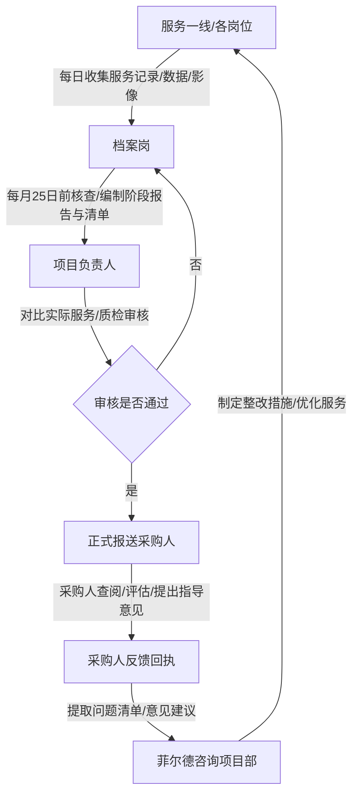

1. 前线数据采集与初审
各服务小组在日常工作中实时记录服务信息，于每月20日前将当月服务台账、入户凭证、协同记录等原始资料移交档案岗。

2. 档案岗分类汇总与报告编制
档案岗负责核对原始资料的真实性与完整性，于每月25日前完成数据统计，编制完成《月度履约阶段报告》、《阶段成果清单》以及《问题与整改清单》。

3. 项目负责人严格审核
项目负责人对档案岗编制的阶段反馈材料进行全面审查，重点核对数据准确性、报告与实际服务相符性、主要问题剖析的深刻性。审核无误后，由项目负责人签字并加盖菲尔德咨询公章。

4. 报送采购人与沟通汇报
项目负责人于每月最后一工工作日前，将书面阶段反馈材料递交采购人，并就当月重点工作、疑难个案及需协同事项进行口头或专题汇报。

5. 接收反馈回执与整改优化
采购人对报送的阶段报告及履约资料进行审核查阅，出具《阶段反馈意见回执》。项目负责人根据回执中的指导意见，第一时间组织团队落实优化，并在下个反馈周期内汇报改进结果。

阶段反馈机制四大核心输出文件规范

| 输出文件名称 | 主要构成内容与数据指标 | 编制标准与要求 | 提交频次与节点 |
| :--- | :--- | :--- | :--- |
| 《月度/季度履约阶段报告》 | 项目整体运行概述、服务指标完成进度、人员在岗及变动情况、协同配合进展、连续服务保障情况、下月工作计划 | 结构严谨、数据真实、对比清晰，客观反映项目履约全貌 | 每月最后一工作日递交月报；每季度末递交季报 |
| 《阶段服务成果清单》 | 困难群众服务台账明细、探访关爱影像索引、个案救助成功案例集、资源对接明细表、政策建议专报 | 清单化呈现、附带核查索引，做到每项成果可查查、可追溯 | 随月度/季度履约报告同步提交 |
| 《存在问题与整改清单》 | 内部质检发现问题、群众反馈问题、采购人指示事项、原因分析、整改措施、责任人及完成时限 | 敢于暴露问题，剖析原因透彻，整改措施具体且具备可操作性 | 每月随阶段报告提交，重大问题随时报送 |
| 《采购人阶段反馈回执》 | 采购人审查意见、服务质量评价评分、后续工作指令、需配合协同事项指示、采购人代表签字盖章 | 格式规范，作为项目阶段验收与服务优化调整的直接依据 | 报送阶段报告后3个工作日内收回归档 |


三、履约资料与阶段反馈的验收控制与保障措施

为确保履约资料与阶段反馈机制有效运转，菲尔德咨询以“报告与实际服务相符、重要事项有记录、采购人可查阅”为三大核心验收控制标准，制定严密的保障措施。

（一）“报告与实际服务相符”控制措施

菲尔德咨询坚决杜绝虚假汇报与纸上履约，建立“双向核验”机制：
1. 现场抽查核对：项目质检员每月按不低于30%的比例，对照阶段报告中的服务名单进行电话回访和入户现场抽查，核实服务时间、服务内容及服务人员态度是否与报告一致。
2. 数据逻辑校验：档案岗在汇总阶段数据时，对入户定位轨迹、现场照片 EXIF 信息、服务对象签名进行交叉比对，校验数据的真实性与合理性。凡发现数据造假或报告与实际不符，对责任人一票否决并按公司制度严肃处理。

（二）“重要事项有记录”控制措施

针对社会救助服务中的关键节点与特殊事件，菲尔德咨询实行“全程痕迹管理”：
1. 关键业务全程留痕：对救助对象的首次评估、急难型救助的紧急处置、跨部门联合会商、争议纠纷调解等重要事项，必须形成完整的文字记录、会议纪要及现场影像资料，严禁口头承诺或无据可查。
2. 人员与权益留痕：对员工劳动合同签订、社保缴纳、工资发放流水以及保密培训等事项建立专项台账，按月向采购人报送明细，确保项目在合规与劳动权益保障上零风险。

（三）“采购人可查阅”控制措施

菲尔德咨询充分保障采购人的监督权与知情权，提供便捷、高效的查阅通道：
1. 线下档案随时查阅：在武穴市项目部建立标准化档案室，采购人可随时入场调阅任何卷宗，档案岗须在15分钟内完成检索并提供指定档案。
2. 线上数据即时调阅：菲尔德咨询为采购人开设项目管理平台专属监管账号。采购人可随时登录系统，实时查阅阶段报告、服务台账、人员在岗状态及问题整改进度，实现履约过程的透明化、数字化监管。

（四）服务连续性与信息安全保障

1. 服务的连续性保障
在阶段反馈与资料交接过程中，菲尔德咨询实行“无缝衔接”机制。无论处于人员轮换、季度交接还是年度考核节点，日常救助服务、热线响应及紧急救助机制均保持常态化运转，决不因资料整理或总结汇报而影响对困难群众的服务供给。

2. 敏感信息安全与保密控制
社会救助数据涉及大量困难群众的个人隐私与敏感信息。菲尔德咨询在资料归档与阶段反馈全流程中严格执行《中华人民共和国个人信息保护法》与项目保密协议：
（1）所有呈报采购人的阶段报告与成果清单中，涉及救助对象身份证号、银行账号、具体家庭住址等敏感信息均进行脱敏处理；
（2）纸质档案室实行双人双锁管理，电子档案库采用高强度加密传输与存储；
（3）严禁任何人员私自复印、拍照、带离或向第三方透露救助对象信息，确保项目履约全过程信息安全零事故。

## 3. 平台运行与动态监测

### 3.1 平台运行管理

#### 3.1.1 湖北省社会救助动态监测信息平台账号与权限

一、 平台账号申请与全生命周期管理

菲尔德咨询针对武穴市社会救助联合体服务项目实际需求，严格遵守湖北省社会救助动态监测信息平台的安全管理规范。项目组在政务外网及专用终端环境下，实行全流程、标准化、可追溯的账号全生命周期管理，确保账号申请、启用、停用、变更与定期核验全过程闭环运行。

（一） 派驻人员账号配置与全生命周期管理流程

菲尔德咨询为本实施项目配备4名固定派驻专业人员。由项目平台管理员统一向武穴市民政局采购人及平台上级主管单位提交书面申请与身份审核材料，按照“一人一号、专人专用、实名绑定、动态管控”原则进行账号全生命周期管理。

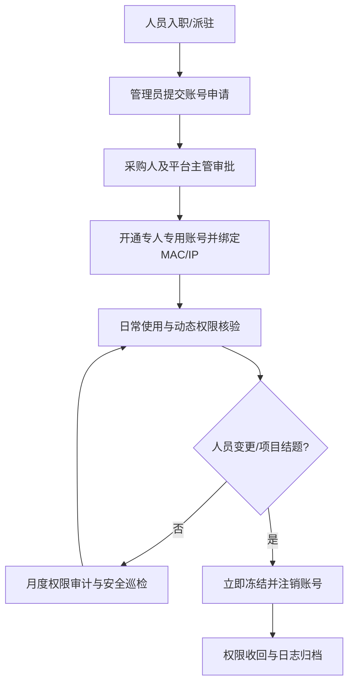

1. 账号申请与身份鉴权
项目启动阶段，由菲尔德咨询项目经理指定专职平台管理员，归口收集4名派驻人员的身份证复印件、保密协议、岗位履历及授权委托书，填写《湖北省社会救助动态监测信息平台账号开通申请表》。申请材料经菲尔德咨询盖章确认后，报送武穴市民政局审批，由平台高级管理员进行后台账号创建与身份实名认证绑定。

2. 账号启用与初始配置
账号激活时，强制派驻人员完成首次登录密码修改。初始密码复杂度须同时包含大写字母、小写字母、数字及特殊字符，长度不低于12位。账号登录全面启用政务外网固定IP地址绑定、终端设备双因子身份认证机制，严禁在未经备案的移动终端或外网环境尝试登录。

3. 账号变更与权限调整
当派驻人员因项目阶段调整、岗位职责分工变更需要调整平台功能模块权限时，须由本人提出书面申请，经菲尔德咨询项目负责人审核、武穴市民政局同意后，由平台管理员在后台实施权限变更，并同步更新《湖北省社会救助动态监测信息平台账号与权限清单》。

4. 账号停用、注销与离岗交接
派驻人员发生离岗、休假替换或项目结题时，菲尔德咨询建立“先关号、后交接”的硬性管控机制。平台管理员须在接到人员变更通知的2小时内，向平台主管单位提交账号冻结申请，在后台停用对应账号。完成业务数据清查、纸质与电子文档移交、签署离岗保密承诺书后，方可办理账号正式注销手续，注销记录永久留存归档。

（二） 专人专用与禁止共享硬性管控措施

为防止账号转借、共享或越权操作带来的信息泄露风险，菲尔德咨询制定严格的物理与逻辑双重控制手段。

1. 物理终端与身份绑定
派驻在武穴市民政局或指定办公场所的4名工作人员，其使用的政务外网办公电脑实施硬件信息绑定。平台账号仅限在绑定的特定物理终端上登录，系统自动校验MAC地址、IP地址及数字证书。非登记绑定的终端设备无法打开登录界面。

2. 逻辑并发与会话控制
平台设置单账号单点登录限制，同一账号严禁在多台设备同时登录。当检测到新终端登录请求时，系统将强行踢出前一次登录会话并向管理员发送预警短信。设置无操作自动超时退出机制，派驻人员离开电脑超过10分钟未进行系统操作，系统自动锁定并强制重新进行身份验证。

3. 违规行为惩处与责任追究
菲尔德咨询将“禁止账号共享与借用”纳入项目组绩效考核红线。严禁将账号密码粘贴于键盘、显示器等显眼位置，严禁口头、书面或网络传输账号凭证。一经发现账号转借他人使用，菲尔德咨询将立即停止涉事人员的项目服务资格，依法追究相应责任，并向采购人提交书面检查与整改报告。

二、 平台权限划分与动态监测响应矩阵

菲尔德咨询紧扣武穴市社会救助联合体服务项目的实际需求，围绕平台运行管理、信息收集、动态监测、政策及资源匹配、信息质量保障5项核心要求，对4名派驻人员进行精细化岗位分工与授权管理，确保各项业务职责与平台系统权限高度匹配，避免出现越权操作或权限真空。

（一） 4名派驻人员岗位职责与权限配置

根据武穴市社会救助实际工作流程，菲尔德咨询将4名派驻人员划分为项目负责人兼平台管理员、救助信息收集与核验专员、动态监测与预警分析专员、政策及资源匹配服务专员，实现各司其职、协同联动。

平台账号权限配置与岗位职责映射表

| 序号 | 派驻人员岗位 | 平台账号角色 | 湖北省社会救助动态监测信息平台模块权限 | 核心岗位职责 | 权限控制级别 |
| :--- | :--- | :--- | :--- | :--- | :--- |
| 1 | 项目负责人兼平台管理员 | 系统管理员（项目级） | 账号管理、权限申请、日志审计、综合报表查看、系统安全监控 | 负责项目整体统筹、平台账号全生命周期管理、权限核验、安全日志定期审查及与采购人对接 | 管理权限（不直接操作具体救助对象敏感业务） |
| 2 | 信息收集与核验专员 | 基础信息采集员 | 社会救助对象信息录入、数据补全、纸质档案电子化、核验信息比对 | 负责武穴市低保、特困、临时救助等对象基础信息的收集、定期核对、数据录入与质量初审 | 录入与修改权限（仅限分配区域与任务范围） |
| 3 | 动态监测与预警分析专员 | 监测预警分析员 | 预警信息接收、风险数据筛查、预警指标配置查看、监测台账导出 | 负责平台监测预警数据的每日巡检、高风险对象筛查、预警信息派发跟踪及动态监测报告撰写 | 查询与导出权限（敏感字段脱敏显示） |
| 4 | 政策及资源匹配服务专员 | 资源匹配操作员 | 社会救助政策库查询、救助资源匹配、联合体服务需求对接、服务转介跟踪 | 负责梳理各类社会救助政策与社会资源，利用平台算法进行精准匹配，推进联合体线下服务落地 | 查询与匹配操作权限（无基础数据修改权） |

（二） 平台5项核心要求与业务应答策略

菲尔德咨询将评分要求中的5项核心内容深度融入平台账号使用与日常业务流转中，确保技术方案完全贴合武穴市项目实际情况。

1. 平台运行管理应答策略
项目负责人作为平台管理员，每日对平台连通性、登录状态及数据同步情况进行巡检。建立物理环境与网络环境双重保障机制，确保派驻人员在政务外网环境下的高效流畅操作。制定平台故障应急处置预案，出现网络中断或系统卡顿等情况时，15分钟内完成故障响应，同步启动线下备用登记流程，待系统恢复后及时补录，保障武穴市社会救助服务不中断。

2. 信息收集应答策略
信息收集与核验专员严格按照湖北省社会救助数据标准，开展武穴市困难群众基础信息采集与定期更新。重点对低保对象、特困人员、低保边缘家庭、支出型困难家庭以及防止返贫监测对象的信息进行规范化收集。采取“线上比对+线下走访”相结合的方式，确保入库信息的真实性、完整性与时效性。

3. 动态监测应答策略
动态监测与预警分析专员依托平台监测预警模块，对医疗费用高额支出、住房突发灾害、就业状态变更、子女就学负担加重等关键预警指标进行每日动态筛查。建立“预警接收-现场核实-分类处置-结果反馈”的闭环监测机制，实现对潜在困难群众的早发现、早预警、早救助。

4. 政策及资源匹配应答策略
政策及资源匹配服务专员梳理汇总国家、湖北省、黄冈市及武穴市现行各类社会救助政策，以及社会组织、慈善力量、志愿者团队等社会资源，形成标准化的政策与资源标签库。利用平台智能匹配引擎，将困难群众的具体需求与政策条款、慈善项目进行精准对照，输出个性化救助方案，推动“物质+服务”联合体救助模式落地。

5. 信息质量保障应答策略
菲尔德咨询建立三级数据质量校验机制。一是前端输入校验，利用平台校验规则限制错填、漏填；二是专员人工复核，对关键身份信息、收入状况、救助金额进行100%二次核对；三是管理员抽查审计，每月按不低于20%的比例对平台录入数据进行随机抽查，防范错报、漏报及虚假信息，确保数据真实准确。

三、 最小权限控制与安全合规保障

菲尔德咨询将数据安全与隐私保护贯穿于湖北省社会救助动态监测信息平台使用的全过程，坚持“最小授权、业务必需、全程留痕、异常即报”的原则，确保社会救助敏感信息零泄露、零违规。

（一） 最小权限原则的落地实施

1. 按岗定权与按区授权
菲尔德咨询严格禁止授予派驻人员超出其岗位职责所需的任何系统权限。平台管理员仅具备账号管理与审计权限，无权修改具体救助对象的业务数据；信息采集专员仅具备授权网格或指定乡镇（街道）的数据录入与修改权限，跨区域数据默认屏蔽；资源匹配专员仅具备政策资源匹配与查看权限，无法导出救助对象的敏感身份信息。

2. 数据敏感字段脱敏展示
在平台界面展示及数据导出环节，实施敏感数据脱敏处理。对困难群众的身份证号、银行卡号、手机号码等隐私字段进行遮蔽显示（如身份证号显示前6位及后4位，中间以星号替代）。若因业务核查确需查看完整敏感信息，须在系统内提交专项申请，经项目负责人审批后方可临时解锁，且解锁操作全过程记录在案。

3. 集中导出与严格审批
严禁派驻人员私自批量导出平台数据。如因撰写武穴市社会救助动态监测分析报告、向采购人汇报工作等确需导出数据的，须填写《数据导出安全审批表》，注明导出目的、数据范围、使用期限及接收人，经菲尔德咨询项目负责人及武穴市民政局主管领导签字批准后，由平台管理员在专用的安全脱敏终端上统一操作导出。

（二） 登录日志、权限核验与台账管理

为保证平台操作可追溯、可审查，菲尔德咨询建立健全健全的日志管理与台账记录体系，留痕备查。

1. 登录与操作日志全量留痕
平台自动记录所有派驻人员的登录日志与操作日志。日志内容包括但不限于：账号姓名、登录时间、登录IP地址、终端设备MAC地址、访问的模块路径、具体操作类型（查询、新增、修改、删除、导出）、操作对象标识及退出时间。系统日志自动保存于专用安全存储区，保存期限不少于36个月，严禁任何人员进行篡改或删除。

2. 月度权限核验与审计机制
菲尔德咨询项目负责人每月组织开展一次平台账号与权限专项核验工作。核验内容包括：派驻人员在岗状态与账号匹配度、实际使用权限与授权文件一致性、是否存在长期未登录的死账号、是否存在越权访问尝试等。核验完成后形成《湖北省社会救助动态监测信息平台账号与权限核验报告》，呈报武穴市民政局备案。

账号与权限管理台账表

| 台账名称 | 记录频次 | 核心记录字段 | 责任人 | 归档要求 |
| :--- | :--- | :--- | :--- | :--- |
| 湖北省社会救助动态监测信息平台账号与权限清单 | 动态更新（发生变更时即时更新） | 派驻人员姓名、身份证号、项目岗位、平台账号、权限模块、IP/MAC绑定信息、开通时间 | 平台管理员 | 电子档与纸质档同步保存，项目全周期归档 |
| 平台登录与操作日志明细台账 | 系统实时自动生成，管理员每周汇总 | 账号、登录时间、退出时间、IP地址、操作模块、操作内容、导出记录 | 平台管理员 | 自动备份于安全介质，保存期限不少于36个月 |
| 账号与权限定期核验记录表 | 每月一次 | 核验日期、核验人、在岗人员名单、账号状态、权限一致性检查结果、发现问题及整改措施 | 项目负责人 | 每月核验完成后3个工作日内送采购人备案 |
| 异常事件与安全告警处置台账 | 发生时即时记录 | 告警时间、涉事账号、异常类型（如异地登录、密码试错、越权访问）、处置过程、报告记录 | 项目负责人 | 发生后2小时内记录并向采购人书面报告 |

（三） 异常事件立即报告与应急处置机制

菲尔德咨询制定针对湖北省社会救助动态监测信息平台账号安全的应急响应预案，确立“早期预警、快速响应、阻断风险、规范上报”的处置流程。

1. 安全异常行为识别
派驻人员及平台管理员重点监控以下安全异常行为：连续5次输入错误密码导致账号锁定；非工作时间（深夜或节假日）无预警登录；异常大批量数据查询或尝试导出；在未备案的IP地址尝试登录；账号权限被未经授权非法篡改等。

2. 响应与阻断措施
一旦监控系统发出安全告警或管理员发现上述异常行为，平台管理员须在15分钟内采取紧急阻断措施，在系统后台直接冻结涉事账号，断开当前活动会话，并暂停涉事物理终端的网络连接，防止潜在风险扩大。

3. 报告与协同调查
在阻断风险的同时，菲尔德咨询项目负责人须在2小时内向武穴市民政局采购人及平台高级管理部门提交书面《平台安全异常事件报告》，详细说明异常发生的时间、涉及账号、现象描述及已采取的应急措施。协助采购人及技术支持单位开展日志溯源与原因排查，排查完毕并消除安全隐患后，经采购人书面授权方可恢复账号使用。

四、 武穴市本地化实施与平台保障落地

菲尔德咨询充分结合武穴市社会救助联合体建设的具体情况，将平台账号与权限管理落实在本地化服务全流程中，保障平台高效、规范、安全运行。

（一） 湖北省社会救助动态监测信息平台在武穴市的具体应用

1. 武穴市救助联合体数据互通
派驻人员依托湖北省社会救助动态监测信息平台，打通武穴市民政、医保、人社、残联、教育、住房等部门的数据壁垒。通过授权账号，依法合规调取各类救助数据，协助武穴市民政局构建全覆盖的社会救助对象动态监测数据库。

2. 镇街与村社区网络化联动
派驻人员充分利用平台账号的权限下沉功能，指导武穴市各镇、街道社会救助经办人员以及村（社区）网格员开展线上数据上报与预警核查。菲尔德咨询派驻人员负责对镇街上报的数据进行平台二次核验与归集，确保基层一线救助需求能快速映射至省平台进行动态监测。

（二） 派驻人员合规操作培训与保密承诺

1. 岗前安全与合规专项培训
所有派驻人员在获得湖北省社会救助动态监测信息平台账号前，必须参加由菲尔德咨询与武穴市民政局联合组织的信息安全与平台操作专项培训。培训内容涵盖《中华人民共和国数据安全法》《个人信息保护法》、湖北省社会救助平台操作规范以及项目账号权限管理制度。培训结束后进行闭卷考核，考核成绩达到90分以上者方可申请开通平台账号。

2. 签署全员保密协议与合规承诺书
菲尔德咨询与4名派驻人员逐一签署《社会救助数据安全与保密协议》及《平台账号合规使用承诺书》。明确派驻人员对在平台操作过程中接触到的武穴市困难群众个人信息、家庭财产状况、健康状况等敏感数据负有终身保密义务，严禁以任何形式向第三方透露、出售或用于项目服务以外的任何目的。

（三） 制度落实与防范扣分保障措施

针对招标文件中关于“平台运行管理、信息收集、动态监测、政策及资源匹配、信息质量保障”5项要求及相应的评分标准，菲尔德咨询制定严格的内部质量控制与扣分防范机制。

1. 覆盖度与针对性双重核查
项目质检员每周对平台运行管理的5项内容进行对照检查，确保每一项要求在实际工作中都有具体的操作台账、责任人和交付物支撑。严禁出现遗漏任何一项要求的情况，确保满分响应。

2. 紧密结合武穴实际防范扣分
菲尔德咨询梳理武穴市社会救助现状与地理分布特点，将平台操作规范落到实处。拒绝脱离实际的空洞套话，所有应答措施均建立在武穴市政务外网环境、4名具体派驻人员分工、真实的预警监测闭环之上。通过“每周微自查、每月大抽查”的机制，坚决杜绝因“未结合项目实际”而产生扣分风险，保障本项目技术方案的高标准交付与高质量实施。

#### 3.1.2 政务环境下平台操作与运行记录

一、政务环境下平台操作规范与执行机制

菲尔德咨询针对武穴市社会救助联合体服务项目的政务运行环境，严格依托“湖北省社会救助动态监测信息平台”开展各项业务操作。本章聚焦政务受控环境下的标准化操作规程，建立“规范录入、动态匹配、多级审查、安全可溯”的平台应用闭环。

（一）政务环境准入与安全操作规程
1. 政务外网终端与网络安全接入
菲尔德咨询配置专用于武穴市社会救助联合体服务的政务外网硬件终端，严禁私自连接外网或非授权设备。终端设备统一安装政务网指定的安全防护软件与CA证书，执行“一机一密、专人专机”的终端准入机制。
2. 身份认证与权限合规使用
平台操作人员严格在授权范围内行使职责，禁止越权访问、越权操作或借用他人账号。在平台操作过程中，凡涉及救助对象敏感隐私信息（如身份证号、银行账号、健康状况及家庭财产等），一律执行脱敏展示与严格的调取审批程序，严防信息外泄。

（二）平台五项核心业务标准化操作流程
菲尔德咨询将采购需求及评分标准中的“平台运行管理、信息收集、动态监测、政策及资源匹配、信息质量保障”五项核心要求，全面融入政务环境下的日常平台操作中。

1. 平台运行管理操作
平台操作岗每日按时登录“湖北省社会救助动态监测信息平台”，核查系统运行状态、数据同步接口及政务网连接质量。建立平台故障预警机制，一旦发现系统卡顿、报错或接口中断，立即记录异常现象并在15分钟内向武穴市民政局主管部门及平台技术支撑单位报告，确保平台稳定运行。
2. 信息收集与规范化录入操作
基于入户走访、联合体成员单位数据共享及政务网联动获取的困难群众基础信息，平台操作岗按照标准数据字典进行录入。录入内容涵盖家庭人口、收入状况、致贫原因、救助需求等关键维度，确保信息完整无遗漏。
3. 困难对象动态监测操作
建立“红、黄、绿”三级困难对象动态监测机制。平台操作岗利用平台算法对困难群众的医疗支出骤增、重度残疾、失业、突发变故等风险指标进行实时触发式监测。系统自动识别高风险家庭并生成预警工单，由平台操作员第一时间派发至线下服务团队进行核实。
4. 政策与社会资源精准匹配操作
根据动态监测结果与困难群众实际需求，平台操作员运用平台的资源匹配引擎，精准对接政府救助政策（如低保、特困、临时救助）以及社会联合体服务资源（如物资帮扶、心理疏导、家政照料等）。构建“政策保基本、联合体增效能”的综合匹配方案。
5. 信息质量保障操作
菲尔德咨询设立专职信息质量复核岗，对平台录入及匹配的数据实施“日清、周审查、月审计”。通过逻辑校验、重复性比对、抽样电话核实与线下复核相结合的方式，确保平台数据真实、准确、实时、有效。

```mermaid
flowchart TD
    A[需求信息收集] --> B[平台标准录入]
    B --> C[数据质量校验与审核]
    C --> D[平台动态监测与预警]
    D --> E{风险判定与资源匹配}
    E -->|政策保障| F[对接政府救助政策]
    E -->|服务需求| G[联动联合体社会资源]
    F --> H[服务实施与记录]
    G --> H
    H --> I[运行日志归档与质量审计]
```

二、平台运行记录与全过程追踪管理

为确保政务环境下平台操作的严肃性与可追溯性，菲尔德咨询建立覆盖全业务周期的运行记录与日志管理体系。

（一）运行记录的核心要素与台账标准
菲尔德咨询制定统一的平台运行记录规范，要求每一次平台交互必须完整包含“操作时间、具体事项、责任人、处理结果、复核状态”五大核心要素，杜绝无痕操作或模糊记录。

平台操作与运行记录标准台账表
| 记录维度 | 标准记录内容与规范要求 | 责任角色 | 留痕凭证与输出物 |
| :--- | :--- | :--- | :--- |
| 平台运行管理 | 每日系统连通性测试、接口状态、网络安全检查、故障上报与排除 | 平台操作岗 | 《平台日常运行监控表》、故障上报单 |
| 信息收集录入 | 困难群众基础信息、需求清单、家庭经济状况变动数据的初审与录入 | 平台操作岗 | 《困难群众信息录入明细表》、原始采集表 |
| 动态监测预警 | 监测预警工单接收、风险等级判定、线下核实任务派发与追踪 | 平台操作岗 | 《困难对象动态监测预警台账》、派工单 |
| 政策资源匹配 | 需求与政策匹配度分析、联合体服务资源派单、救助项目组合落地 | 平台操作岗 | 《政策与资源匹配响应表》、联合体服务单 |
| 信息质量保障 | 数据逻辑校验、重复信息筛查、错误数据退回重填、质量抽查记录 | 质量复核岗 | 《数据质量抽查及整改记录表》、审计报告 |

（二）日志维护与质量抽查双轨机制
1. 日维护机制
平台操作岗必须于每日下班前完成当天的《平台运行日志》填写，归集当日的平台登录情况、数据处理量、预警派单量、资源匹配数及异常事项。日志需由操作人员电子签名确认，确保日清日结。
2. 质量岗巡查与抽查机制
质量复核岗每周对《平台运行日志》及平台实际数据进行不少于30%的随机抽查。重点审查数据录入的准确性、预警响应的时效性以及资源匹配的合理性。对发现的问题当场下发整改通知书，督促责任人限期修正。

三、数据质量控制与异常处置闭环

菲尔德咨询在政务环境下实施严格的数据质量控制策略，围绕“操作可追溯、数据不重复、平台异常及时上报”三大核心质量目标，构建全流程防错与异常处理机制。

（一）数据质量控制三大核心举措
1. 操作全过程可追溯
平台内所有新增、修改、删除及导出操作，均由系统自动记录底层审计日志，包括操作人在政务网下的IP地址、设备MAC地址、操作时间戳及修改前后对比数据。任何未经授权的数据变更均可追溯至具体责任人。
2. 数据去重与逻辑防错
建立数据入库前置校验规则。在信息录入环节，系统自动对身份证号、户籍地址、低保账号等唯一性标识进行全库查重，防止重复录入与“一人多户”现象。同时设置逻辑校验阈值（如家庭收入与救助金额匹配度），自动拦截异常数据。
3. 平台故障与异常及时上报
制定《政务平台运行异常响应预案》。出现网络中断、接口失败、数据传输卡死等硬件或软件异常时，平台操作岗须在15分钟内完成故障现象截图与日志提取，并同步向武穴市民政局主管科室及系统运维单位上报，做到异常不隐瞒、响应不过夜。

（二）运行记录管理与档案归档
所有平台运行日志、操作记录、质检报告及异常处置单，均按照政务档案管理要求进行按月汇总与电子化归档。菲尔德咨询定期向武穴市民政局呈报《平台运行与监测分析月报》，为全市社会救助决策提供精准的数据支撑与执行留痕证明。

### 3.2 信息收集

#### 3.2.1 线上渠道困难群众信息收集

一、线上渠道信息收集机制与业务流程

菲尔德咨询紧扣武穴市社会救助联合体服务项目实际需求，针对平台运行管理、信息收集、动态监测、政策及资源匹配、信息质量保障等核心评审要求，构建线上渠道困难群众信息收集标准体系。本章节聚焦于通过多端线上渠道完成困难群众基础信息与救助需求的合规采集、身份核验、告知授权及初筛建档，确保源头数据“合法、准确、完整、实时”。

（一）线上收集渠道整合与对接
菲尔德咨询依托武穴市社会救助联合体信息化平台，全面整合PC端救助门户、移动端小程序、微信公众号、24小时救助热线（电话）以及网络咨询留言板等线上入口，打造“一网通办、一号响应”的线上信息采集矩阵。
1. 移动端与Web端接入：困难群众及其家属或代理人可通过手机小程序或网页端，自主填写身份信息、家庭状况、困难诉求并上传证明材料。系统自动定位申请人所在镇（街道）及村（社区），实现属地化精准派发。
2. 24小时热线与网络咨询服务：设立专职话务与网络咨询坐席，话务员及在线客服接听或接收群众求助后，实时将对话内容、联系方式、诉求要点录入系统工单，转化为标准化线上收集记录。

（二）线上信息收集标准流程
菲尔德咨询制定了严格的线上信息采集五步标准流程，通过系统自动化校验与人工复核相结合的方式，确保信息收集过程严谨规范。

```mermaid
flowchart TD
    A[困难群众/代理人线上提交或热线接入] --> B[系统采集基础信息与救助诉求]
    B --> C[弹出线上知情同意书与隐私授权]
    C --> D[信息收集岗核验来源与身份认证]
    D --> E{核验是否通过}
    E -- 否 --> F[一次性告知补正信息或退回]
    E -- 是 --> G[登记需求并生成初筛清单]
    G --> H[敏感字段加密归档与动态流转]
```

1. 渠道接入与信息输入：申请人或话务员在系统前端输入困难群众身份信息、家庭人口、收入状况、财产状况、健康状况、历史救助记录及联系方式等必要字段。
2. 告知授权与知情同意：系统在信息提交前自动弹出《武穴市社会救助信息采集知情同意与授权书》，明确告知信息收集目的、使用范围及安全保障措施，经申请人电子签名或语音通话授权确认后方可进入下一环节。
3. 信息收集岗初审与核验：菲尔德咨询配备的专职信息收集岗人员在1个工作日内对提交的信息进行来源合法性与格式完整性审查，对比公安身份证数据库及民政历史救助数据库，验证人员身份真实性。
4. 需求登记与分类处理：信息收集岗根据核验结果，将救助需求划分为生活救助、医疗救助、教育救助、住房救助、就业救助及临时救助等类别，并打上紧急程度标签（常态、紧迫、特急）。
5. 初筛清单生成与转办：系统自动汇总形成《线上困难群众信息初筛清单》，实时推送至武穴市社会救助联合体服务平台调度中心，为后续线下核查与资源匹配提供精准数据支撑。

二、线上信息采集范围与字段规范

为落实“信息最小必要”原则，菲尔德咨询对线上收集的困难群众信息实施标准化、结构化管理，明确七大类核心数据采集指标，避免过度收集与信息冗余。

线上困难群众信息采集字段规范表

| 信息类别 | 核心采集字段 | 采集目的与业务逻辑 | 数据验证方式 |
| --- | --- | --- | --- |
| 身份信息 | 姓名、身份证号、性别、民族、户籍地、常住地 | 确定救助对象唯一身份及武穴市属地管理权限 | 身份证OCR识别与政务数据实时比对 |
| 家庭信息 | 户主姓名、家庭人口数、婚姻状况、抚养/赡养关系 | 评估家庭结构及共同生活家庭成员情况 | 系统逻辑校验与户籍信息关联 |
| 收入信息 | 家庭月人均收入、主要收入来源、工薪/经营/转移性收入 | 判定困难程度是否符合救助门槛 | 申请人承诺与后置大数据比对 |
| 财产信息 | 住房情况、车辆信息、金融资产（存款/理财）、大型农机具 | 辅助评估家庭财产状况是否超标 | 线下核实前置数据预判 |
| 健康信息 | 残疾等级、重大疾病诊断、患病人数、自负医疗费用 | 评估因病因残致贫风险，精准匹配医疗/残疾救助 | 医疗诊断证明及残疾人证影印件核验 |
| 救助记录 | 历史获救助类型、获助金额、发放时间、服务记录 | 掌握救助历史，避免重复救助或遗漏救助 | 武穴市社会救助联合体数据库自动调取 |
| 联系方式 | 手机号码、紧急联系人姓名、紧急联系人电话、居住地址 | 确保救助服务精准送达与紧急联络 | 短信验证码实时核验与通话测试 |

三、信息质量保障与合规安全控制机制

菲尔德咨询将信息质量保障与数据安全贯穿于线上收集的全过程，落实“信息最小必要、来源可核、敏感字段受控”三项核心控制标准，确保完全符合招标文件的质量保障要求。

（一）数据质量全流程闭环保障
1. 源头数据校验机制：系统设置字段格式强校验逻辑，例如身份证号码校验位自动核对、手机号码格式验证、必填项缺失阻断提交等，从源头杜绝垃圾数据与错误数据录入。
2. 逻辑一致性审查：信息收集岗在登记需求时，重点审查申报数据的逻辑合理性，如“家庭总收入与人均收入不匹配”、“无劳动能力但收入来源填写工薪收入”等异常数据，将直接退回并要求补充说明。
3. 数据重复性排查：系统以身份证号为主键进行全库检索，对重复提交的线上申请自动提示并进行工单合并，确保困难群众档案的唯一性。

（二）敏感字段加密与权限受控管理
1. 敏感数据脱敏展示：对身份证号、银行卡号、手机号码等高度敏感字段实施前台脱敏处理（如身份证号显示为421124****1234，手机号显示为138****5678）。各岗位人员仅在经授权的高级视图下可查看解密信息。
2. 细粒度数据访问控制：实施基于角色的访问控制（RBAC）策略。信息收集岗仅具备其权限范围内的录入、核验与初筛权限；未经审批，严禁批量导出、下载或转存困难群众敏感数据。
3. 全生命周期数据审计：平台自动记录线上信息采集、调阅、修改、导出等所有操作行为，形成不可篡改的审计日志，保留时间不少于3年，确保数据流转全程留痕、追溯有据。

四、针对武穴市本地实际的优化措施

菲尔德咨询结合武穴市城乡分布特点及困难群众行为习惯，对线上信息收集模式进行针对性优化，避免出现“脱离项目实际”的情形。

（一）“数字鸿沟”辅助采集响应
针对武穴市偏远农村地区高龄、重残、无智能手机的困难群众，菲尔德咨询设计“线上代办与语音辅助”机制。村（社区）网格员可使用专用移动终端代为线上填报，或由群众直接拨打救助热线，由话务员通过标准化问答帮助完成线上信息录入与授权登记，实现“群众口述、坐席录入、系统留痕”。

（二）与武穴市本地政务数据预对接预留
菲尔德咨询提供的线上收集模块预留标准化数据接口，能够无缝对接武穴市政务服务网、民政一体化平台及大数据中心，实现困难群众基础信息的自动预填与比对核验，有效减轻群众填报负担，大幅提升线上收集的准确率与办理效率。

（三）极简交互与多语种/方言服务
优化移动端小程序界面，采用大字体、高对比度、语音朗读及图文引导设计；热线坐席配备熟悉武穴本地方言的话务人员，消除沟通障碍，确保武穴市各类困难群体均能顺畅使用线上渠道表达救助诉求。

#### 3.2.2 线下渠道走访和转介信息收集

一、线下渠道走访与转介信息收集机制构建

（一）线下多源信息收集渠道网络部署
菲尔德咨询紧密结合武穴市社会救助工作实际，针对线下困难群众基数大、分散广、信息获取滞后等特点，全面建立“窗口受理、探访慰问、部门转介、分站回传、社会发现”五位一体的线下信息收集网络，确保困难群众求助有门、信息采集无死角。

1. 办事窗口常态化受理渠道
菲尔德咨询依托武穴市级社会救助服务中心及各镇（街道）便民服务中心救助窗口，部署专职服务岗位。窗口人员负责接待来访群众，对现场提出的救助申请、政策咨询、急难求助信息进行标准化采集。采集内容涵盖申请人基本身份信息、家庭人口结构、健康状况、收入与财产变动情况、核心困难诉求等。

2. 定期走访与主动探访慰问渠道
菲尔德咨询建立入户走访与定期探访工作机制，组织专业社古与一线救助人员，针对武穴市辖区内的低保对象、特困人员、重病重残人员、孤儿及事实无人抚养儿童、留守老人与儿童等特殊困难群体开展主动走访。在重大节日、恶劣天气或突发事件期间，启动专项慰问走访，现场核实困难群众实际生活状况，主动挖掘潜在救助需求，变“人找政策”为“政策找人”。

3. 部门间协同转介接收渠道
菲尔德咨询主动对接武穴市民政、人力资源和社会保障、医疗保障、住房和城乡建设、教育、残联、工会、妇联及红十字会等相关部门与团体，建立常态化信息转介机制。针对其他部门在履职过程中发现的超出本部门救助职责、或需联合施救的困难群众信息，通过标准化转介单据与线下协同机制进行接收与汇总，实现跨部门救助信息的缝衔接。

4. 镇街与村社区分站回传渠道
菲尔德咨询依托武穴市辖区内各镇（街道）救助服务分站及村（社区）救助服务点，发挥村（居）民委员会成员、网格员、基层妇联干部的“前哨”作用。基层人员在日常网格巡查、群众工作过程中，一旦发现因病、因灾、因意外导致生活陷入困境的家庭或个人，立即填写《分站困难信息回传表》，报送至救助联合体平台。

5. 社会力量与公众发现渠道
菲尔德咨询广泛发动志愿服务组织、社会工作服务机构、公益慈善组织、物业服务企业、热心市民等社会力量，建立“随手拍、随时报”的社会发现引导机制。对于社会力量提供的困难群众线索，菲尔德咨询安排专人第一时间跟进核实，确保社会面突发性、临时性困难能够被及时感知与响应。

（二）线下信息收集与转交标准化流程
为保障线下收集信息的真实性、时效性与严谨性，菲尔德咨询制定了标准化操作规范，明确现场记录、信息核实、表单流转与签收交接的完整闭环，具体流程如图所示：

```mermaid
graph TD
    A[线下渠道发现/来访] --> B{渠道类型识别}
    B -->|窗口来访| C[窗口岗现场接洽与信息采集]
    B -->|主动走访| D[个案岗入户核查与走访记录]
    B -->|部门协同| E[部门转介单接收与登记]
    B -->|分站/社会力量| F[分站回传表接收与验真]
    C --> G[信息初步核对与要素校验]
    D --> G
    E --> G
    F --> G
    G --> H{信息要素是否完整}
    H -->|否| I[现场补充/限时补正]
    I --> G
    H -->|是| J[填写标准化线下转交清单]
    J --> K[平台岗交接签收与台账登记]
    K --> L{是否属于紧急/高风险事项}
    L -->|是| M[启动高风险预警与绿色通道]
    L -->|否| N[导入平台数据库与分类转办]
```

1. 现场记录与凭证留存
菲尔德咨询要求工作人员在接待或走访过程中，必须实时使用标准化纸质表单或移动终端进行记录。现场记录须全面反映困难群众的客观状况，不得主观臆断或遗漏关键要素。入户走访须经服务对象或其家属签字确认，并保留必要的现场影像与证明材料，确保信息收集全程留痕、可追溯。

2. 现场核对与要素校验
采集人员在完成初始记录后，须对收集到的信息进行现场核对，重点校验身份信息一致性、困难描述客观性、联系方式有效性及诉求合理性。对证明材料不全的，一次性告知需补交的材料清单；对口述信息有疑问的，通过邻里访问、村居证明等方式进行侧面交叉核实。

3. 规范转交与手签流转
完成现场采集与核对后，窗口岗或个案岗人员须在24小时内填写标准化转交单据，将纸质及电子档案移交至平台管理岗。交接双方必须当面进行材料清点与要素复核，在《线下信息流转签收表》上共同签字确认，明确交接时间、材料清单及经办人姓名，严禁无签收交接或随意丢弃搁置。

4. 风险事项分级与紧急升级
在信息收集与转交过程中，菲尔德咨询实施风险动态评估机制。凡涉及重特大疾病、突发严重意外伤害、无基本生活保障、存在自伤或伤人倾向等极高风险事项，采集人员须立即启动紧急响应机制，打破常规转交时限，在1小时内口头及书面直报平台负责人与相关主管部门，开辟绿色通道优先处置。


二、线下信息收集标准化表单与执行规范

（一）四类核心控制表单设计
菲尔德咨询结合武穴市本地社会救助管理要求，设计了覆盖走访、转介、回传及登记全过程的四类标准化表单，确保信息采集格式统一、要素健全、便于数据化归档。

线下信息收集标准化表单结构表
| 表单名称 | 适用场景 | 核心采集字段 | 责任岗位 | 归档与控制要求 |
| :--- | :--- | :--- | :--- | :--- |
| 《困难群众走访记录表》 | 窗口接访、定期入户走访、重大节日与突发天气探访 | 户籍地址、居住地址、家庭人口、健康状况、收入来源、住房条件、核心困难主诉、现场观察记录、服务对象签字 | 个案岗、走访人员 | 每次走访后24小时内完成填写，需经服务对象或监护人手写签名确认，留存现场照片。 |
| 《部门救助转介单》 | 民政、医保、人社、残联、工会等部门间信息横向转介 | 转介单位、联系人、被转介人基本信息、原部门已救助情况、建议协同事项、转介原因、附件材料清单 | 窗口岗、联络员 | 需加盖转介单位公章或经办部门印章，签收后1个工作日内完成初审与反馈。 |
| 《基层分站信息回传表》 | 镇（街道）分站、村（社区）服务点、网格员上报信息 | 填报单位、网格编号、困难家庭姓名、突发困难类型、拟申请救助类别、基层初审意见、回传时间 | 分站联络员、网格员 | 每日定时汇总回传，对突发急难信息随报随收，平台岗需在2小时内响应。 |
| 《线下困难群众需求登记台账》 | 平台岗汇总、分流、转办与全流程跟踪 | 登记编号、信息来源渠道、采集时间、困难等级评估、转办去向、办结时限、签收人、状态跟踪 | 平台岗 | 实行动态滚号管理，每日更新，每周汇总分析，确保件件有落实、事事有回音。 |

（二）信息质量保障与真实性核查
为确保线下收集信息的准确性与真实性，菲尔德咨询制定严格的信息质量控制标准，杜绝虚假信息、过期信息与错误信息进入系统。

1. 质检与抽查机制
菲尔德咨询设立独立的质量督导岗，每日对线下收集的表单进行100%全要素形式审查，对关键字段缺失、逻辑前后矛盾的表单予以退回并限期重报。每周按照不低于20%的比例，对新收集的线下困难群众信息进行电话抽查与复核；每月按照不低于10%的比例进行现场入户抽查，确保信息真实可靠。

2. 信息动态更新与纠错
菲尔德咨询建立困难群众信息动态复核机制。对于已入库的线下信息，根据困难类型实施分类动态管理：对特困人员、重病重残等深度困难家庭，每季度至少开展一次线下走访复核；对普通低保及低收入家庭，每半年开展一次信息比对与走访；对临时救助对象，在救助期满前进行二次状况评估。对于在走访中发现的人口变动、收入增减、健康状况变化等信息，在2个工作日内完成系统更新，保持数据的时效性。

3. 数据安全与隐私保护
菲尔德咨询在实施线下走访与信息收集全过程中，严格执行《中华人民共和国个人信息保护法》及国家关于社会救助保密工作的相关规定。所有线下纸质表单须专柜存放、专人管理；电子数据传输与存储进行加密处理。工作人员签署保密协议，严禁未经授权泄露困难群众的隐私信息、家庭住址及敏感健康数据，保障困难群众合法权益。


三、武穴市本地化线下走访与转介落地实施方案

（一）武穴市区域网格与线下力量整合
菲尔德咨询结合武穴市“一市多镇、城郊结合、乡村分散”的地理与人口分布特点，精细化划分线下信息收集责任区，实现线下走访与转介服务的全覆盖。

1. 城区与镇村两级响应网络
在武穴城区（武穴街道、栖木塘街道等），菲尔德咨询重点对接社区居委会与物业管理网格，建立“社区网格员+专业社工”联动作业模式，针对高龄独居、失能半失能及城镇失业困难群体开展网格化巡查与窗口接访。在梅川镇、余川镇、花桥镇、大局镇等农村区域，菲尔德咨询依托镇救助分站与村学会，建立“驻村干部+村医+组长”的走访联动小组，克服农村交通不便、信息闭塞的劣势，确保偏远山区困难群众的求助信息能够快速回传。

2. 针对武穴本地特色产业与人群的专项走访
菲尔德咨询密切关注武穴市本地沿江产业、矿山转型及农业季节性用工等特点，针对因产业结构调整导致的临时失业人员、因工伤致残人员以及留守儿童、留守老人等群体，开展专项政策宣讲与需求摸排走访。在农忙季节及冬季拉网式排查期间，深入田间地头与农户家中，面对面收集最真实的生产生活困难。

（二）转介衔接与多方协同工作机制
菲尔德咨询在武穴市构建“横向到边、纵向到底”的协同转介机制，打破部门信息壁垒，保障转介信息高效处置。

1. 横向部门联席与定期通报
菲尔德咨询协助武穴市民政局建立社会救助联合体横向部门联席机制。每月与医保、残联、人社、住建等部门进行线下转介信息对账，通报转介事项的办理进度与结案情况。对涉及多部门职责交叉、单项政策无法完全解决的复杂个案，由菲尔德咨询提请召开个案会商会议，明确主责部门与协同部门，形成“一次收集、联合会商、分类施救”的闭环。

2. 纵向分站指导与督导培训
菲尔德咨询安排专业督导人员，分片区对武穴市各镇（街道）救助分站及基层网格员进行线下信息收集与转交业务培训。培训内容涵盖救助政策解读、沟通访谈技巧、表单规范填写、突发风险识别及系统操作等，全面提升基层一线人员的信息敏锐度与规范化操作能力，保障全域线下信息收集质量的一致性与高标准。

（三）服务质量控制与验收指标对照
为保证线下渠道走访与转介信息收集工作的高质量落地，菲尔德咨询制定严格的质量控制考核指标，严格对照项目验收标准执行。

1. 记录及时性与完整性控制
所有线下走访与来访接访，必须在服务发生后24小时内完成标准化表单填写与系统录入；表单关键要素完整率必须达到100%，因信息不全导致的退单率控制在1%以内。

2. 事实清楚与证据链控制
走访记录与转介单据必须客观反映困难事实，做到“家庭情况清、困难原因清、诉求主旨清、现场核实清”。所有走访记录必须具备服务对象或见证人签名，做到事实清楚、证据充分。

3. 转交签收与时限控制
线下信息流转必须100%执行手签流转制度，严禁无签收移交。普通转介信息在2个工作日内完成分类转办；紧急与高风险事项在1小时内完成直报与响应，确保风险零处置滞后。

4. 绩效考核与持续改进
菲尔德咨询将线下信息收集的准确率、及时率、群众满意度及部门转介办结率纳入项目月度绩效考核体系。定期整理线下信息收集过程中的常见问题与典型案例，持续优化走访路线、表单设计及流转节点，确保武穴市社会救助联合体运行的高效、合规与可持续。

#### 3.2.3 需求清单建档与更新

一、需求清单建档与更新机制

菲尔德咨询针对武穴市社会救助联合体服务项目的实际需求，建立标准化、动态化、可追溯的需求清单建档与更新机制。本机制旨在将线上渠道收集的困难群众信息与线下走访、转介获取的信息进行全面汇总、统一分类与规范建档，明确责任岗位与办理时限，确保救助需求全量入库、动态更新、闭环管理，为后续政策及资源精准匹配提供高质量的数据支撑。

需求清单建档与更新流程见下图：

```mermaid
graph TD
    A[信息源头输入] --> B(信息归集与校验)
    B --> C{是否重复/异常}
    C -- 是 --> D[核实合并/修正]
    C -- 否 --> E[需求清单建档]
    D --> E
    E --> F[确定需求分类与紧急程度]
    F --> G[派发责任岗位并设置办理时限]
    G --> H[每日动态更新与办理进度跟踪]
    H --> I[质量监督岗定期复核]
    I --> J[形成更新日志与归档]
```

（一）需求清单标准化建档规范

1. 建档要素与数据结构
菲尔德咨询为武穴市社会救助联合体服务项目设计专用的“困难群众救助需求标准化电子档案清单”。清单涵盖基础身份信息、需求分类信息、管控跟踪信息三大板块，具体字段与要求如下：

需求清单标准建档要素表

| 维度分类 | 字段名称 | 说明与要求 | 规范标准 |
| --- | --- | --- | --- |
| 基础身份信息 | 服务对象姓名/身份证号 | 困难群众唯一身份标识 | 严格脱敏处理，符合数据安全规范 |
| 基础身份信息 | 联系方式与户籍/居住地址 | 包含手机号、固定电话及武穴市具体镇街村社区 | 精确到门牌号，确保线下可追踪 |
| 基础身份信息 | 困难类型与现有保障身份 | 如低保、特困、低保边缘、支出型困难等 | 以民政部门认定数据为准 |
| 需求分类信息 | 需求大类与细分项目 | 包含生活救助、医疗救助、教育救助、住房救助、就业帮扶、心理疏导、物资帮扶等 | 采用统一标准编码分类 |
| 需求分类信息 | 需求描述与诉求来源 | 详细记录困难群众的具体困难情况及信息收集渠道 | 区分线上提交或线下走访转介 |
| 管控跟踪信息 | 紧急程度划分 | 划分为特急（红色）、紧急（黄色）、常规（蓝色）三个等级 | 依据风险评估标准自动/人工判定 |
| 管控跟踪信息 | 责任岗位与责任人 | 指定武穴市社会救助联合体服务项目组的具体承办人员 | 落实到具体岗位与姓名 |
| 管控跟踪信息 | 办理状态与下一步措施 | 记录待匹配、办理中、已完成、已转介、无法办理（附原因）等状态 | 实时更新，措施具体可执行 |

2. 建档流程与归集校验
（1）全量归集：菲尔德咨询设定的需求管理岗每日定时对线上渠道（救助平台、小程序、热线电话）及线下渠道（走访记录、社区转介、部门移交）收集的信息进行集中提取与汇总。
（2）查重与去重：系统自动对比服务对象身份证号及姓名，对同一对象在不同渠道提交的重复需求进行合并，形成统一的救助需求主档案；对新增需求进行增量建档。
（3）原始记录一致性校验：建档过程中，需求管理岗必须核对建档数据与原始采集记录（如线下走访表、线上申请单、转介函等），确保信息真实、完整、准确，杜绝漏填、错填现象。

（二）需求清单动态更新与日常管理

1. 每日动态更新机制
（1）更新责任：菲尔德咨询项目组设立专职“需求管理岗”，负责需求清单的日常动态维护与状态更新。
（2）更新时限与频率：需求管理岗每日至少开展2次集中更新（每日上午11:30前与下午17:00前），实时接收各服务环节、各责任岗位的反馈信息，跟进办理进度。
（3）状态变更规则：当需求处于“资源匹配中”、“线下服务实施中”、“救助资金/物资发放完成”、“转介相关部门”或“服务结案”等节点时，需求管理岗需在2小时内完成清单状态更新，并录入具体的下一步处置措施。

2. 紧急程度分级与限时办理机制
菲尔德咨询建立基于紧急程度的分级响应与更新跟踪机制：
（1）特急需求（红色）：涉及基本生活极度匮乏、突发重特大疾病、意外伤害或生命安全受威胁的困难群众，建档后1小时内派发责任岗位，需求管理岗每4小时更新一次办理状态，确保24小时内形成初步救助或转介方案。
（2）紧急需求（黄色）：涉及近期医疗费用缺口大、子女即将开学学费无着落、临时失业导致生活困难等，建档后4小时内派发责任岗位，需求管理岗每日更新一次办理状态，确保3日内完成资源对接与处置。
（3）常规需求（蓝色）：涉及日常心理疏导、长期康复护理、一般性就业培训需求等，建档后24小时内派发责任岗位，需求管理岗每周更新两次办理状态，按既定服务计划推进。

二、质量保障与全程可追溯体系

为确保需求清单建档与更新工作质量，满足招标文件中“平台运行管理、信息收集、动态监测、政策及资源匹配、信息质量保障”等5项核心要求，菲尔德咨询制定严格的质量管控措施，实现数据精细、过程透明、追溯有据。

（一）质量复核与监控机制

1. 质量岗定期复核
菲尔德咨询项目组设立独立于需求管理岗的“质量监督岗”，建立“日常抽查+每周复核+每月全盘”的质量管理体系：
（1）日常抽查：质量监督岗每日随机抽取不低于15%的新建档及更新记录，核对清单内容与原始收集凭证的一致性。
（2）每周复核：每周五下班前，质量监督岗对本周所有“办理完成”及“无法办理”的需求清单进行100%全额复核，重点审查结案依据是否充分、群众满意度反馈是否真实。
（3）每月全盘：每月月底，联合武穴市社会救助联合体相关负责人，对全量需求清单开展综合质量评估，形成质量分析报告。

2. 逾期预警与提醒机制
系统及管理层面建立多级逾期提醒功能，杜绝需求积压与办理拖延：
（1）黄色预警：当需求办理进度达到规定时限的70%仍未完成状态更新时，系统自动向责任岗位及责任人发送黄色预警提醒。
（2）红色预警：当需求办理进度达到规定时限的90%时，系统向责任岗位及项目经理同时发送红色预警提醒，项目经理立即介入督办。
（3）逾期督办：对已超过办理时限的需求，系统自动生成《救助需求办理逾期督办单》，由质量监督岗下发至责任岗位，要求在12小时内说明原因并提交限期整改方案。

（二）更新日志与全流程追溯

1. 电子化更新日志
菲尔德咨询采用标准化日志管理规范，系统自动记录需求清单的每一次新建、修改、状态变更及审核操作。日志内容必须包含：操作时间（精确到秒）、操作人账号与姓名、操作岗位、修改前数值/状态、修改后数值/状态、修改原因及支撑文档附件。任何个人无权改动或删除历史日志记录。

2. 清单与原始记录一致性追溯
菲尔德咨询建立“一户一档”纸质与电子双重档案追溯链条。每一条需求清单记录必须挂接对应的原始支撑材料，如线上申请截图、线下走访表扫描件、入户核查照片、转介对接单、资源发放签收表等。通过数据比对工具与人工复核相结合的方式，确保“清单记录—原始凭证—实际服务”三者高度一致。

3. 信息安全与保密管控
在需求清单建档、更新及复核的全流程中，菲尔德咨询严格遵守国家数据安全及个人信息保护相关法律法规：
（1）权限隔离：按照“最小授权”原则，需求管理岗、责任承办岗、质量监督岗设置不同的数据读取与编辑权限。
（2）敏感数据脱敏：在非核心审查界面，困难群众的身份证号、银行卡号等敏感信息自动进行脱敏展示。
（3）保密协议：所有参与需求清单管理的人员均须签署数据保密协议，严禁私自导出、复制或外泄困难群众个人信息。

三、结合武穴市实际的落地保障措施

菲尔德咨询充分结合武穴市地理分布、人口结构及社会救助工作现状，确保需求清单建档与更新机制在武穴市社会救助联合体服务项目中精准落地、高效运行。

（一）镇街村社区网格化对接保障
针对武穴市辖区内各镇、街道及村（社区）的实际情况，菲尔德咨询建立“网格对接、集中建档”的工作模式。需求管理岗专人对接武穴市各镇街社会救助工作站及村（社区）网格员，建立每日信息互通机制。对线下网格员收集并转交的困难群众救助需求，做到当日接收、当日完成标准化建档，确保基层救助需求不遗漏、无死角。

（二）多部门救助资源协同更新
结合武穴市民政、人社、医保、残联、工会、妇联及社会慈善组织的救助资源分布情况，菲尔德咨询在需求清单中专门设置“联合体资源协同办理”模块。对于单一部门无法解决的复合型困难需求，需求管理岗在清单更新中明确标注涉及的各协同部门职责分工与办理节点，通过联合体例会与信息共享机制，定期同步各部门办理进度，确保多部门联动救助过程在需求清单中得到清晰、准确的动态体现。

（三）定期数据分析与监测预警反馈
菲尔德咨询需求管理岗与数据分析团队配合，每月基于需求清单建档与更新数据，生成《武穴市困难群众救助需求动态监测分析报告》。通过对需求类别分布、高发区域、响应时限、结案率及未满足需求进行多维度统计分析，及时向武穴市社会救助主管单位反馈救助趋势与薄弱环节，为武穴市优化救助政策、精准配置救助资源提供坚实的数据决策依据。

需求清单建档与更新质量控制标准表

| 质量控制维度 | 衡量指标 | 质量目标 | 控制与考核方法 |
| --- | --- | --- | --- |
| 信息完整性 | 关键字段缺失率 | 0% | 系统设置必填项校验，缺项无法提交建档 |
| 采集准确性 | 清单与原始记录一致率 | 100% | 质量监督岗每日抽查，不一致项取消当月绩效评优 |
| 响应及时性 | 新建档派发时限达标率 | ≥99% | 按照特急（1h）、紧急（4h）、常规（24h）自动考核 |
| 状态更新率 | 办理进度动态更新及时率 | ≥98% | 每日两次定点更新检查，逾期系统自动扣分预警 |
| 过程可追溯 | 更新日志完整性与可追溯率 | 100% | 系统自动生成不可篡改日志，定期进行安全审计 |
| 追溯规范性 | 需求档案原始凭证挂接率 | 100% | 结案前必须上传全套支撑材料，无凭证不得结案 |

### 3.3 动态监测

#### 3.3.1 困难群众动态变化监测

一、困难群众动态变化监测总体响应与工作机制

菲尔德咨询紧扣武穴市社会救助联合体服务项目采购需求与评审标准，立足武穴市本地社会救助工作实际，建立“多源采集、动态核验、归口处置、质量闭环”的困难群众动态变化监测机制。针对已登记困难群众的家庭人口、经济状况、健康健康程度、救助享受状态、联系方式及已实施服务结果等核心维度，实施全流程、全天候的跟踪监测，确保社会救助资源精准匹配与动态调整。

```mermaid
graph TD
    A[监测信息多源采集] --> B[平台归口汇总与分类]
    B --> C[动态核验与比对]
    C --> D[生成变化记录与跟踪任务单]
    D --> E[派发责任人履约处置]
    E --> F[质量控制与归档闭环]

    A1[基层窗口日常受理] --> A
    A2[网格员入户走访] --> A
    A3[部门数据回传比对] --> A

    C -->|未发生变化| G[进入常态化归档监测]
    C -->|发生显著变化| D
```

（一）困难群众动态监测核心指标体系

菲尔德咨询为武穴市社会救助联合体搭建全覆盖的动态监测数据模板，对困难群众信息实施标准化管理。具体监测指标、数据来源及更新频次如下表所示：

困难群众动态变化监测指标与采集矩阵

| 监测维度 | 细化监测指标项 | 信息采集来源 | 监测与更新频次 | 责任归口岗位 |
| --- | --- | --- | --- | --- |
| 家庭人口与户籍变化 | 户籍迁入迁出、家庭成员增减、婚嫁、死亡、新生儿出生 | 基层政务窗口、网格员走访、公安及民政数据共享 | 实时触发与每月定期比对 | 平台信息核验岗 |
| 经济与收入状况 | 工资性收入、经营性性收入、财产性收入、转移性收入、重大刚性支出 | 乡村振兴、人力资源社会保障、医保数据比对、入户核查 | 每季度全面比对与动态调整 | 动态监测分析岗 |
| 健康与失能状况 | 患重大疾病、新增残疾、失能半失能等级变更、长期照护需求 | 医疗保障局结算数据、残联数据、入户走访评估 | 每月数据对接与随访核实 | 需求评估与服务调度岗 |
| 救助享受状态 | 城乡低保、特困供养、低保边缘、支出型困难、临时救助等政策享受状态 | 武穴市民政局救助系统数据回传 | 每月定期全量比对 | 政策与资源匹配岗 |
| 联系方式与居住地 | 联系电话变更、常住地址变动、紧急联系人信息变更 | 线下走访、电话随访、社区网格巡查 | 随时更新且不少于每季度一次 | 线下走访服务岗 |
| 服务履约与效果 | 已派发服务单完成度、服务对象满意度、二次评估需求 | 平台服务工单反馈、服务对象电话回访 | 服务完成后48小时内 | 质量控制与督导岗 |

二、多源信息采集与平台归口核验流程

菲尔德咨询依托“平台+网格+部门协同”的三位一体模式，确保困难群众动态信息来源明确、采集及时、核验精准。

（一）多源信息采集渠道建设

1. 基层窗口受理与主动申报
在武穴市各镇（街道）社会救助服务窗口设立信息采集节点。对前往窗口办理救助申请、政策咨询或变更登记的困难群众，由窗口工作人员第一时间将最新变更信息录入平台，形成初始动态数据。

2. 线下走访与网格化巡查
菲尔德咨询组建专业的线下走访服务团队，联合本地社区网格员，对特困人员、重病重残等重点困难群体实施定期入户走访。利用移动终端实时采集救助对象的生活现状、健康变化及新增需求，确保线下真实情况快速上报平台。

3. 部门数据交换与共享回传
建立与武穴市民政、医保、人力资源社会保障、残联、乡村振兴等部门的数据定期交换机制。通过平台自动对接或数据导入，定期比对大病医疗费用支出、残疾证办理、就业失业登记、死亡人口注销等关键数据，实现动态变化的自动预警与源头捕捉。

（二）平台归口汇总与信息质量核验

1. 数据清洗与去重校验
平台接收到多源采集的信息后，由平台信息核验岗统一进行数据清洗、去重与格式标准化处理。系统自动对比历史数据库，识别出数据冲突、信息缺失或异常波动项。

2. 线下核实与二次复核
对系统比对发现的异常数据（如突发大额医疗费支出、家庭人口异常减少等），平台核验岗立即发起线下核实指令。安排走访人员在2个工作日内进行入户核实或电话复核，确保采集到的信息真实、准确、完整，杜绝虚假信息和错漏信息入库。

三、动态监测表、变化记录与跟踪任务单管理

菲尔德咨询通过规范化的表单体系与工单流转机制，确保每一条动态变化信息均可追溯、可核查、可落地。

（一）困难群众动态监测表构建

平台为武穴市每一户困难群众建立全生命周期的“动态监测表”。表单整合基础信息、动态变更记录、救助服务历史等内容。

1. 基础信息模块：涵盖家庭成员基本情况、房屋状况、收入来源、健康状况及现有救助保障类型。
2. 动态变更模块：自动记录每次信息变更的时间、变更项、变更前内容、变更后内容及信息来源渠道。
3. 关联服务模块：实时挂接该家庭已享受的社会救助联合体服务项目、履约进度及服务质量评价。

（二）变化记录管理规范

1. 变更日志自动生成
任何经核实的动态信息修改，系统均自动生成不可篡改的变更日志，记录操作人、审核人、变更时间及变更依据文件或走访记录编号。

2. 变化等级分类管理
将困难群众的动态变化分为一般变更（如联系方式变更、居住地址同镇微调）、重要变更（如家庭成员增减、残疾等级变更）及重大变故（如主要劳动力死亡、突发重大疾病导致刚性支出骤增）。根据不同变化等级，触发不同的处置响应机制。

（三）跟踪任务单流转与闭环处置

1. 任务单自动派发
当监测到困难群众家庭发生重要变更或重大变故时，平台自动生成《困难群众动态跟踪任务单》。任务单明确记录变更事项、核查要求、拟匹配资源建议、责任人及完成时限。

2. 责任到人与限时办理
一般变更任务单派发至平台信息维护岗，于1个工作日内完成系统更新；重大变故任务单直接派发至线下走访服务岗与资源匹配岗，要求责任人在24小时内完成首次入户响应，在3个工作日内拿出针对性的帮扶或救助调整方案。

3. 跟踪任务单审核结项
服务人员完成跟踪任务后，需将处置结果、服务对象签字认可的反馈单及现场佐证材料上传平台。由平台质量控制岗进行全面审核，审核通过后方可结项关闭任务单；审核不合格的，打回重办并纳入绩效扣分考核。

四、困难群众动态监测质量控制与保障体系

为满足项目评审关于信息质量保障、合规性及紧密结合项目实际的高标准要求，菲尔德咨询建立严密的质量控制机制，确保监测工作无盲区、无差错、全闭环。

（一）监测信息质量管控标准

1. 及时性标准
动态信息自采集或部门数据回传之日起，平台核验必须在24小时内完成；跟踪任务单的派发与首响应时间不得超过24小时，确保困难群众的变化得到第一时间关注与响应。

2. 准确性标准
建立信息多源交叉比对机制，线下走访核验率达到100%。信息录入错误率控制在0.1%以内，重大救助信息变更必须具备纸质或电子佐证材料支撑。

3. 完整性标准
对已登记困难群众的监测覆盖率达到100%，监测指标项填写完整度达到100%。严禁出现关键字段空白或无法追溯信息来源的情况。

（二）质量控制与监督机制

1. 三级质量审核机制
建立“采集人员自查—平台核验岗复查—质量督导岗抽查”的三级质控体系。每日对新增和变更的监测数据进行全量校验，每周对已结项的跟踪任务单进行按比例抽查。

2. 责任追究与整改闭环
将动态监测信息的准确率、跟踪任务单的按时结项率与服务人员的绩效考核直接挂钩。对于出现信息漏报、迟报、虚报或任务单拖延处置的责任人，立即启动问责程序，并限期完成整改。

五、平台运行管理、信息收集、监测、政策匹配与质量保障全流程整合

菲尔德咨询将困难群众动态变化监测深度融合于武穴市社会救助联合体服务项目的整体运行框架中，全面覆盖平台运行管理、信息收集、动态监测、政策及资源匹配、信息质量保障5项核心要求，形成高效闭环。

（一）平台运行管理标准化
菲尔德咨询设立专门的平台运维与管理团队，制定严格的系统操作规程、数据安全管理制度与权限控制体系。保障平台7×24小时稳定运行，确保动态监测数据的高并发处理与安全存储，为武穴市民政局及社会救助联合体提供坚实的数字化底座。

（二）多维信息采集全覆盖
构建线上数据对接与线下网络巡查相结合的信息收集网络。除承接政府部门回传数据外，充分利用联合体内部成员单位、社会组织、志愿者及基层网格员的力量，形成全方位、多维度的信息收集渠道，确保武穴市困难群众底数清、情况明。

（三）精准动态监测常态化
依托本项目建立的困难群众动态变化监测机制，将静态的救助对象档案转化为动态的实时监测数据。通过对人口、收入、健康、救助等维度的持续跟踪，实现从“人找救助”向“救助找人”的根本转变。

（四）政策及资源匹配精准化
平台根据动态监测捕捉到的困难群众最新变化，自动比对武穴市现行各类社会救助政策及社会帮扶资源库。系统根据困难类型与程度，智能推荐“政策救助包”与“社会服务包”，并自动生成资源匹配清单，推送至对应的服务实施团队，实现救助资源的按需供给与精准推送。

（五）信息质量保障全程化
把质量控制贯穿于信息收集、动态监测、资源匹配与服务交付的全过程。通过源头核验、逻辑校验、过程督导、回访复核等一系列严密措施，确保平台数据真实可靠、救助服务可追溯可审查，切实保障武穴市社会救助联合体服务项目的高质量运行。

#### 3.3.2 预警核查与跟踪反馈

三、平台运行与动态监测

（三）动态监测

3.3.2 预警核查与跟踪反馈

菲尔德咨询紧密结合武穴市社会救助联合体服务项目实际需求，针对平台运行管理、信息收集、动态监测、政策及资源匹配以及信息质量保障等五项核心要求，构建“多源预警—准确核查—协同处置—跟踪反馈—全程质控”的全流程闭环管理机制。本章节聚焦于预警核查与跟踪反馈机制的落地实施，确保对平台提示、群众反映及分站回传的异常与急难线索实施精准识别、快速响应与闭环终结。

一、预警线索收集与分级分类机制

菲尔德咨询建立多渠道预警线索汇聚机制，打通线下服务网络与线上监测平台的数据交互通道，确保急难线索零遗漏、响应无迟延。

（一）多源预警线索汇聚
1. 平台自动预警线索：依托武穴市社会救助联合体信息平台，自动比对大病医疗自付费用高企、残疾等级变更、失业登记、多重困境叠加等数据，按设定规则自动触发系统预警线索。
2. 群众与社会反映线索：通过求助热线、群众来访、网格员走访、社会组织回报等多渠道收集困难群众急难需求及异常动态。
3. 基层分站回传线索：由各镇（街道）社会救助服务分站、村（社区）救助服务点在日常巡查、入户走访中上报的突发性、紧迫性基本生活困难线索。

（二）预警线索分级分类标准
菲尔德咨询根据预警事项的紧迫程度、危险等级及影响范围，将预警线索划分为三级管理，实行差异化处置流程。

```mermaid
graph TD
    A[多源预警线索输入] --> B{线索风险评估}
    B -->|红色一级: 极高风险/突发紧迫| C[红色预警: 即时响应与紧急救助]
    B -->|黄色二级: 中高风险/生活困难| D[黄色预警: 3个工作日内核查]
    B -->|蓝色三级: 低风险/常规变动| E[蓝色预警: 5个工作日内核查]
    C --> F[联合处置与资源匹配]
    D --> F
    E --> F
    F --> G[结果核销与跟踪反馈]
    G --> H[归档与信息质量复核]
```

（三）预警线索分类分级管理清单

预警线索分类分级管理表

| 预警等级 | 认定标准与线索特征 | 响应时限要求 | 负责岗位与处置路径 |
| --- | --- | --- | --- |
| 红色预警（一级） | 遭遇突发火灾、重特大疾病导致生活无着、疑似遗弃虐待、严重精神障碍患者失控等紧急人身安全或生存危机线索 | 随接随办，1小时内响应，2小时内到达现场 | 平台岗即时上报，项目负责人直接指挥，协同个案岗与现场救助小组实施紧急救助与风险隔离 |
| 黄色预警（二级） | 家庭成员突发大病、家庭主要劳动力失业、因灾因意外导致家庭收入骤减、自负医疗费用超预警线等线索 | 24小时内响应，3个工作日内完成现场核查 | 平台岗派发至对应镇（街道）分站，协同岗与个案岗开展入户调查与需求评估，对接专项救助 |
| 蓝色预警（三级） | 救助对象人口变动、居住地变更、常规政策到期需重新评估、低保边缘户收入微幅波动等线索 | 48小时内响应，5个工作日内完成核查 | 平台岗派单至村（社区）服务点，由窗口岗和巡查人员进行日常信息核实与系统数据更新 |

二、现场核查与准确定性流程

预警线索生成后，菲尔德咨询实行“平台派单—现场核查—研判定性—台账建档”的标准核查作业流程，确保核查结论客观、可证、可追溯。

（一）标准核查流程设计
1. 平台派单与任务接收：平台岗在收到预警线索后，根据预警等级及属地原则，1小时内完成在线派单，明确核查时限、核查重点及配合人员。
2. 现场入户与实地勘验：核查人员（至少2人同行）携带移动终端与核查表单开展现场核查，采取“看生活状况、查医疗单据、问收入来源、访邻里群众”的方式，全面收集一手事实材料。
3. 协同研判与困难定性：核查组结合入户情况、政策标准及资源状况进行综合研判，精准认定困难类型、困境等级及救助需求，出具标准化《预警核查结论报告》。
4. 电子台账与归档留痕：核查人员将核查过程照片、访谈记录、证明材料等原件扫描件实时上传至武穴市社会救助联合体信息平台，形成不可篡改的电子核查台账。

（二）核查记录表单标准化规范
为保障信息质量与核查深度，菲尔德咨询制定严格的核查记录表单规范，确保每份核查记录具备完整证据链。

预警核查与处置标准台账规范表

| 台账名称 | 核心填报要素 | 支撑材料要求 | 质量审核要点 |
| --- | --- | --- | --- |
| 预警核查记录单 | 预警来源、响应时间、现场状况描述、家庭经济状况核验、核查人及被核查人签字 | 现场核查照片（含定位与时间戳）、入户访谈音频/记录、身份证明复印件 | 现场照片与定位信息一致性、双人核查签字完整性、困难状况描述客观性 |
| 联合处置联络单 | 困难事项概况、需协调部门/机构、拟匹配政策资源、处置建议、承办单位意见 | 部门协同会商会议纪要、政策匹配依据文件、第三方服务机构接单确认书 | 部门职责匹配准确性、资源派单合理性、办理时限承诺明确性 |
| 跟踪反馈终结单 | 救助措施落实情况、资金/物资到位凭证、群众满意度评价、定期复查计划 | 发放凭证、服务签到表、受益人或家属签字确认书、满意度测评表 | 服务完成度与需求匹配度、受益人评价真实性、跟踪复查周期合理性 |

三、协同处置与政策资源动态匹配

核查完成后，菲尔德咨询基于武穴市社会救助政策库与服务资源池，开展精准匹配与多方协同处置。

（一）跨岗位与跨部门协同机制
1. 岗位联动响应：项目负责人统筹全局，平台岗负责信息调度与过程督办，窗口岗负责政策咨询与材料初审，协同岗负责跨部门资源对接，个案岗负责深度帮扶与心理疏导。
2. 联合体协同处置：对涉及多部门职责的复杂个案，依托武穴市社会救助联合体工作机制，由菲尔德咨询项目负责人发起“联合会商”，协调民政、医保、人社、残联、教育、住房等部门及社会组织，实施“一户一策”联合救助。

（二）精准政策与资源匹配逻辑
1. 政策资源自动比对：利用平台算力，将核查确认的困难指标（如自负医疗费金额、残疾类别、家庭人均收入）与最新社会救助政策标准进行智能比对，优先推荐兜底性保障政策。
2. 社会资源补充匹配：在政府救助政策覆盖之外，自动检索联合体内部社会组织资源、慈善捐赠项目、志愿者服务团队，实现政府救助与慈善帮扶有效衔接。

四、跟踪反馈与闭环管理机制

菲尔德咨询对所有处置事项实施全生命周期跟踪反馈，确保“事事有回应、件件有落实”。

（一）处置进展动态跟踪
1. 节点式督办：平台岗对已派单的处置事项进行全程动态监控。红色预警每4小时督办一次，黄色预警每日督办一次，蓝色预警每周督办一次。对逾期未处置的自动触发系统黄色/红色预警提示。
2. 阶段性回访：在救助措施实施后15日内，由个案岗或分站服务人员进行首次回访，核实救助资金到位情况、服务提供质量及困难缓解程度。

（二）满意度测评与结案标准
1. 群众满意度测评：救助事项终结前，必须由困难群众或其监护人填写《社会救助服务满意度评价表》，测评指标涵盖响应时限、服务态度、帮扶效果等。满意度低于80分的，自动转入复核流程。
2. 严格结案核销：满足“救助政策已落实到位、帮扶服务已完成交付、困难状态已得到有效缓解、群众满意度达标、档案材料齐全”五项标准方可予以结案核销。

五、信息质量保障与风险控制体系

菲尔德咨询严格落实“信息质量保障”要求，构建多重防线，防止失真、漏报、迟报及作假风险。

（一）数据质量三级审核机制
1. 一级审核（核查人员自查）：核查人员对提交的核查记录、照片及数据真实性负责，确保一手数据完整无误。
2. 二级审核（分站负责人复查）：镇（街道）分站负责人对核查结论、困难定性及拟处置方案进行合规性复核。
3. 三级审核（项目质控岗终审）：菲尔德咨询项目质控专家对平台所有预警核查与处置档案进行抽查复核，每月抽查比例不低于当期办结量的20%。

（二）关键风险点防范措施
1. 防范迟报漏报风险：实行“首接负责制”与“限时办结制”，对因人为原因导致红色预警未按时响应或处置迟延的，严肃追究相关人员责任。
2. 防范数据失真风险：系统引入数据校验算法，对异常偏离常理的数据（如收入与支出严重不符、证明材料重复使用等）自动警示并退回重核。
3. 防范隐私泄露风险：对困难群众个人敏感信息（如患病类型、家庭住址、联系方式等）进行脱敏处理，严格执行数据调阅权限管理制度，保障数据传输与存储安全。

菲尔德咨询通过上述“预警核查与跟踪反馈”机制的有效运转，确保武穴市社会救助联合体服务项目在平台运行管理、信息收集、动态监测、政策及资源匹配和信息质量保障五个维度全面达标，为武穴市困难群众提供精准、高效、温暖的社会救助服务。

### 3.4 政策及资源匹配

#### 3.4.1 政策匹配与办理指引

一、 政策分类匹配机制与精准筛查规则

（一） 武穴市社会救助政策法规库构建与动态更新

菲尔德咨询为武穴市社会救助联合体搭建全覆盖、多层级的政策法规知识库。知识库全面接入国家、湖北省、黄冈市及武穴市本地颁布的各项社会救助政策文件，涵盖最低生活保障、特困人员救助供养、临时救助、医疗救助、教育救助、住房救助、就业救助、受灾人员救助等八大类基础救助政策，并同步纳入妇女儿童保护、残疾人帮扶、高龄津贴等专项福利与社会力量帮扶政策。

菲尔德咨询设立专职政策研究岗位，建立每周政策扫描与月度复核更新机制，及时将武穴市民政局及相关职能部门发布的最新政策文件、补贴标准调整、认定条件变化转化为标准化结构化数据，确保政策匹配依据具备实时性与合法性。

（二） 困难群众救助需求多维画像与政策匹配逻辑

政策匹配基于救助对象的家庭经济状况核查数据、健康状况、劳动能力、致贫原因及实际困难诉求建立多维画像。系统通过规则引擎实现救助需求与政策条款的智能比对，分类匹配逻辑如下：

1. 基础生活类政策匹配：针对家庭人均收入低于武穴市低保标准的家庭，自动触发低保政策匹配流程；对无劳动能力、无生活来源、无法定抚养赡养扶养义务人或其法定履职能力的人员，优先匹配特困人员救助供养政策。
2. 专项救助类政策匹配：针对因病致贫、因病返贫家庭，结合医保报销后的个人自付费用，精准匹配重特大疾病医疗救助；针对因子女就学导致支出骤增的家庭，匹配教育救助及社会力量助学项目；针对住房安全隐患家庭，匹配农村危房改造或城镇住房保障政策。
3. 急难型临时救助匹配：对遭受火灾、交通事故、重大意外伤害或突发重特大疾病导致基本生活陷入危机、且其他救助政策尚无法覆盖的家庭，开启急难型临时救助快速匹配通道，实行“先行救助、补办手续”。

| 救助类别 | 核心适用条件与标准 | 匹配依据文件 | 需提供关键证明材料 |
| --- | --- | --- | --- |
| 城镇/农村最低生活保障 | 家庭人均收入低于武穴市现行低保标准，财产状况符合规定 | 《武穴市最低生活保障审核确认实施细则》 | 身份证明、户籍簿、收入证明、财产状况授权书 |
| 特困人员救助供养 | 无劳动能力、无生活来源、无法定抚养赡养扶养义务人或义务人无履行能力 | 《湖北省特困人员救助供养工作实施办法》 | 劳动能力鉴定结论、无抚养人声明、收入财产证明 |
| 临时救助（急难型/支出型） | 因突发事件、意外伤害、重大疾病或刚性支出过大导致基本生活出现严重困难 | 《武穴市临时救助办法》 | 突发事件证明、医疗费用发票、诊断证明、刚性支出凭证 |
| 医疗救助与重特大疾病帮扶 | 经基本医保、大病保险报销后，个人负担合规医疗费用仍超出规定门槛 | 《黄冈市医疗保障帮扶实施细则》 | 医保结算单、出院小结、重特大疾病诊断书 |

二、 标准化办理指引生成与多渠道告知

（一） 个性化办理指引单一键生成

菲尔德咨询通过系统自动生成标准化、可视化、易理解的《武穴市社会救助政策办理指引单》。指引单不使用晦涩的行政语言，统一转换为群众易懂的“白话文”与清单式表述。指引单包含以下核心模块：

1. 可申请救助项目名称与政策依据；
2. 预估可享受的救助标准与相关待遇；
3. 申报所需准备的材料清单（区分“必须件”与“补正件”）；
4. 线下办理的具体服务窗口名称、地址、办公时间及联系电话；
5. 线上申报渠道二维码及操作步骤说明；
6. 办理流程图解与预计办理时限。

```mermaid
flowchart TD
    A[困难群众/网格员提交救助诉求] --> B[菲尔德咨询系统智能比对匹配]
    B --> C{政策协同岗审核有效性}
    C -- 审核通过 --> D[生成标准化办理指引单]
    C -- 需补充信息 --> E[通知网格员入户补充采集]
    E --> B
    D --> F[窗口岗/网格员向群众精准解读]
    F --> G[指导群众准备材料与提交申报]
    G --> H[推送至对应行政审批部门]
    H --> I[生成办理指引与匹配台账备案]
```

（二） 分级分类告知与多渠道精准送达

针对不同困难群众的接纳能力与生活习惯，菲尔德咨询建立线上线下协同的指引送达机制：

1. 窗口直办告知：对直接前往武穴市社会救助联合体服务大厅或镇（街道）便民服务中心办理的群众，由菲尔德咨询窗口岗位工作人员打印纸质版《办理指引单》，进行面对面解读与辅导。
2. 上门入户送达：对高龄、重病、重残等行动不便的困难群众，由菲尔德咨询协同村（社区）网格员进行上门送达，现场核对材料并协助完成拍照上传。
3. 移动端推送：对具备智能手机使用能力的群众或其家属，通过微信公众号、短信或武穴市政务服务移动端推送电子版办理指引与办事指南。

三、 岗位职责分工与政策有效性审核

（一） 政策协同岗与窗口岗的协同机制

菲尔德咨询建立严密的岗位协同工作机制，明确政策协同岗与窗口岗在政策匹配及办理指引全流程中的职责边界，确保响应流程高效、合规。

1. 政策协同岗职责：
（1） 负责武穴市社会救助政策库的实时维护与规则配置，确保匹配引擎所依据的政策条款均为现行有效版本；
（2） 对系统智能匹配生成的政策匹配结果进行人工二次复核，重点核查政策适用边界、重叠政策互斥规则（如特困供养与低保不得同时享受、困难残疾人生活补贴与特困供养不重复享受等）；
（3） 审核《办理指引单》中的材料清单与办理路径是否准确，对特殊疑难案例组织政策研判。

2. 窗口岗（及网格协同岗）职责：
（1） 负责接待来访群众或承接网格转办诉求，详尽记录群众实际困难；
（2） 向群众耐心解释《办理指引单》内容，辅导群众填写各项申请表格与授权委托书；
（3） 协助群众预审申请材料，确保材料齐全、真实、合规，避免群众“多次跑、反复跑”。

（二） 政策适用合规审查与质量控制

菲尔德咨询建立“三级复核”质量保障体系，严格控制政策匹配的准确率：

1. 系统规则初筛：利用系统自动校验申请人年龄、户籍、收入、财产及已享受救助情况，排除不符合基本条件的政策选项。
2. 政策协同岗复核：专职人员对匹配结果逐一核对政策效力期限、地方实施细则变动情况，确保政策依据有据可查。
3. 合规边界控制：严格恪守服务边界，菲尔德咨询提供的政策匹配结果与办理指引仅作为服务对象的申报参考与辅助指引，绝不替代行政机关行使社会救助的审批权、确认权和资金发放权。

| 岗位名称 | 核心职责 | 业务边界与合规控制 | 交付物/工作痕迹 |
| --- | --- | --- | --- |
| 政策协同岗 | 政策库维护、匹配规则复核、疑难政策研判、政策有效性审核 | 不得随意变更法定救助标准，不得越权承诺行政审批结果 | 《政策有效性审核记录表》、《疑难救助政策研判意见》 |
| 窗口服务岗 | 群众接待、指引单发放、政策白话解读、申报材料预审辅助 | 严格执行一次性告知，禁止收取任何中介费用，不得代签署承诺文件 | 《办理指引送达回执》、《现场咨询服务台账》 |
| 协同网格岗 | 入户送达指引、协助高龄重残人员代办材料采集、动态诉求反馈 | 仅开展材料代收代递与信息采集，不干预群众自主申请意愿 | 《上门指引服务记录》、《代理采集确认单》 |

四、 政策资源清单编制与全过程档案管理

（一） 动态政策资源清单编制

菲尔德咨询定期汇总武穴市各职能部门（民政、人社、医保、住建、残联、工会、妇联、团委等）的救助帮扶政策，编制《武穴市社会救助与社会福利政策资源清单》。清单详细列明政策名称、发布文号、适用对象、救助标准、申请材料、办理时限、责任部门及联系方式，并根据政策废止、修订情况进行动态更新，作为联合体运行的基础工具书。

（二） 匹配记录与办理指引档案管理

菲尔德咨询对每一次政策匹配与指引服务建立全流程电子档案，档案内容包括：

1. 困难群众基础信息与救助诉求记录；
2. 系统智能匹配及人工复核的原始记录；
3. 发放给群众的《武穴市社会救助政策办理指引单》副本；
4. 群众签收回执或电子送达确认凭证；
5. 后续申报介入情况的跟踪标记。

所有档案实时同步至武穴市社会救助联合体服务平台数据库，确保全程留痕、可追溯、可核查，为后续资源匹配结果跟踪评估提供完整的数据支撑。

#### 3.4.2 服务资源匹配与转介协同

一、服务资源分类匹配与精准映射

菲尔德咨询依托武穴市社会救助联合体服务平台，针对困难群众多元化、个性化救助需求，建立多维服务资源分类匹配机制。平台整合物资援助、生活关爱、心理疏导、权益保障、志愿服务及社会组织培育等六大类服务资源，通过标签化管理与精准算法映射，实现救助需求与服务资源的无缝对接。

（一）多维服务资源库分类构建

菲尔德咨询对武穴市域内及跨区域可调度的救助服务资源进行全量梳理与标准化入库，建立动态更新的服务资源主数据目录。

1.物资援助类资源
涵盖救灾物资、临时生活救助物资、特定群体专项物资（如残疾人辅助器具、困难学子学习用品）等。资源库详细记录物资规格、库存数量、存放地点、调拨条件及物流配送时效。

2.生活关爱类资源
包含居家养老服务、残疾人照料、儿童托举服务、送餐服务、家政保洁等日常照顾性资源。记录服务机构资质、服务人员技能认证、服务区域覆盖范围及服务承载能力。

3.心理疏导与精神慰籍资源
整合专业心理咨询师、社工师、精神卫生医疗机构等专业力量，提供心理测评、个案辅导、危机干预、情绪疏导及心理健康讲座服务。平台重点标注服务人员专业资质证书编号、擅长领域及服务方式（线上/线下）。

4.权益保障与法律援助资源
对接司法行政部门、律师事务所、法律援助中心及维权志愿者团队，提供法律咨询、代写法律文书、诉讼代理、劳动维权及妇女儿童权益保护等服务。

5.志愿服务与社会组织资源
联动武穴本地志愿服务队伍、公益慈善组织、民办非企业单位及基金会，提供结对帮扶、课业辅导、微心愿达成、社区融入等柔性服务资源。

（二）需求与资源智能匹配规则

平台基于社会救助综合评估结果，提取困难群众的生理、心理、社会功能及家庭环境等多维度特征，运用规则引擎进行多对多精准映射。

```mermaid
graph TD
    A[困难对象服务需求] --> B(需求分类与评估标签化)
    B --> C{平台智能匹配引擎}
    C -->|物资需求| D[物资援助资源库]
    C -->|心理/精神| E[心理疏导资源库]
    C -->|法律/维权| F[权益保障资源库]
    C -->|日常照料| G[生活关爱资源库]
    C -->|社会融入| H[志愿及社会组织库]
    D --> I[生成精准匹配资源清单]
    E --> I
    F --> I
    G --> I
    H --> I
    I --> J[提交资源联络岗审查]
```

1.匹配算法逻辑
优先按照“按需匹配、就近服务、专业对口、效益最大”原则进行算力分配。系统根据服务对象的居住地地理坐标（GIS），自动检索方圆5公里范围内的可用服务资源；对于专业性较强的心理与法律援助，则优先匹配服务资质等级高的专业机构。

2.资源状态实时校验
匹配引擎在推荐服务资源时，实时校验资源提供方的在线状态、当前服务负荷及剩余接单能力。针对已达负荷上限的服务供给方，系统自动触发二级备用资源匹配机制，确保服务响应不断档。

二、转介协同全流程标准化履约机制

服务资源匹配完成后，菲尔德咨询通过“申请-派单-确认-执行-反馈”全链条闭环机制，实施跨部门、跨机构的服务转介协同，确保每一项救助需求都有人管、有人做、有回应。

（一）资源联络岗确认与审核

菲尔德咨询在武穴市社会救助联合体运营中心设立专职“资源联络岗”，作为服务转介协同的中枢调度核心。

1.资源能力二次复核
资源联络岗接获系统生成的匹配方案后，须在2个工作小时内向拟转介的服务承接机构进行能力确认，核实其当前是否有足够的专业人员、物资储备或服务档期履约。

2.服务对象意愿征询
资源联络岗或基层救助督导员通过面谈、电话或随访方式，向困难群众或其监护人详细说明拟转介的服务内容、服务机构及服务方式，充分尊重救助对象知情权与选择权。在取得服务对象明确同意并签署知情同意书后，方可启动后续转介流程。

3.接收方资格审查
对非政府公共服务部门的第三方社会组织、志愿服务团队或企业服务商，资源联络岗须严格审查其法人资质、信用记录及服务履约历史，严禁向有不良信用记录或服务质量投诉未解决的机构转介服务。

（二）转介业务标准化文书流转

跨机构协同必须依靠标准化的业务文书保障信息传输的准确性与合法性。

服务资源匹配与转介协同核心文书规范

| 文书名称 | 核心包含要素 | 生成与流转主体 | 审核与签收要求 |
| :--- | :--- | :--- | :--- |
| 可用服务资源清单 | 资源名称、服务类别、供给主体、服务能力指标、服务区域、联系方式、资源有效期限 | 系统自动汇总，资源联络岗人工复核确认 | 资源联络岗每日更新，运营负责人每周复核 |
| 社会救助服务转介单 | 转介编号、服务对象基本特征（脱敏）、救助需求诊断、拟转介服务项目、服务期限、服务目标 | 资源联络岗发起，经联合体主管领导线上签发 | 接收单位在24小时内系统电子签收确认 |
| 服务接收确认书 | 接收单位名称、接单负责人、拟派服务人员、预计首次服务时间、服务实施方案要点 | 服务接收单位填写并上传至联合体平台 | 服务接收单位盖章或法人电子签名 |
| 服务安排与执行计划 | 服务时间表、服务地点、服务内容细目、物料及人员配置、应急预案、服务对象签字栏 | 服务承接机构编制，抄送资源联络岗备案 | 服务对象或其家塑及基层救助员签字确认 |

（三）跨部门与跨机构协同衔接

1.政府部门间事项转介
针对涉及行政审批或政策性救助的事项，通过平台直接对接武穴市民政局、人社局、残联、医保局等部门的业务系统或派驻人员，实现数据内部流转、事项限时办结。

2.社会组织与市场主体转介
针对非行政类的照顾性、专业性服务，通过平台下发服务转介任务包。接收单位须在规定时限内完成派单并回传《服务接收确认书》。平台设立超时预警机制，对于超过24小时未签收转介单的机构，系统自动收回任务并触发人工干预流程，由资源联络岗重新调度服务资源。

三、服务协同质量控制与安全保障

菲尔德咨询将质量控制与数据安全贯穿于资源匹配与转介协同的全过程，建立严格的质量把控标准体系，切实践行“资源真实可用、转介对象明确、接收有确认、敏感信息按需提供”的核心承诺。

（一）四重质量控制要点

1.资源真实可用性控制
建立服务资源动态巡查与抽查机制。资源联络岗每月对入库的服务资源进行不少于20%的抽样核查，重点核查机构履约能力、物资有效期限、人员资质有效性。对连续两次抽查不合格或服务虚标的资源供给方，立即采取下架处理并通报批评。

2.转介对象明确性控制
转介单必须附带清晰的救助需求诊断报告及服务目标清单。严禁泛化转介或无目标转介。每一份转介单必须做到“一人一案一单”，精准指明服务实施的具体内容、频次与预期成效。

3.接收确认闭环控制
建立严格的“双确认”机制。一确认服务承接机构的线上系统签收与书面回执；二确认服务实施人员与服务对象的首次见面履约。未完成“双确认”的转介流程不得进入下一阶段结算或归档环节。

4.服务全过程痕迹化管理
要求服务承接机构在服务实施过程中，通过联合体移动端APP实时打卡定位、上传服务现场照片（隐去敏感部位）、采集服务对象或家属电子签名。所有服务痕迹数据实时加密上传至平台，确保服务过程可追溯、可审查。

（二）敏感信息保护与按需提供机制

困难群众的个人隐私、致困原因、健康状况等属于高度敏感信息。菲尔德咨询在转介协同中实施严格的信息脱敏与分级授权制度。

1.脱敏处理原则
平台在生成《服务转介单》并推送给服务承接机构时，自动对敏感字段进行脱敏处理。例如，服务对象姓名显示为“张*华”，身份证号掩码隐藏中间8位，具体住址仅精确到社区/村组。

2.最小权限与按需提供
服务承接机构及具体服务人员仅能获取开展该项服务所必需的最小范围信息。如物资配送人员仅能获取配送地址和联系电话，无法查看服务对象的医疗诊断报告或家庭资产状况；心理咨询师仅获取心理评估相关数据，隐去家庭经济资产等无关隐私。

3.保密协议与法律责任
所有参与转介协同的第三方机构、社会组织及志愿服务团队，在入驻联合体平台前必须签署《困难群众个人信息保护与保密承诺书》。平台对所有敏感数据的查询、导出、打印行为进行全日志审计，一旦发现违规调取或泄露个人隐私行为，立即终止合作，追究法律责任，并移交公安机关处理。

四、武穴本地化转介协同落地保障

为确保服务资源匹配与转介协同机制在武穴市高效落地，菲尔德咨询结合武穴市城乡社区分布特点与救助工作实际，采取一系列本地化保障举措。

（一）构建“镇（街道）-村（社区）”二级转介响应网格

在武穴市各镇（街道）设立社会救助联合体服务分中心，配备专职社会工作者作为基层转介协同员；在村（社区）设立救助服务联络点，由村（居）委会民政专干兼任网格联络员。

1.基层首问与快速转介
基层网格联络员在日常巡查或接诉过程中发现困难群众服务需求，可直接通过联合体移动终端发起转介申请，镇（街道）分中心在1个工作日内完成初审并提交至市级平台资源联络岗。

2.农村地区协同特殊保障
针对武穴市偏远农村地区服务资源相对匮乏、交通不便的实际情况，菲尔德咨询建立“流动服务车+镇村结对帮扶”的转介补充机制。对偏远村落的困难对象需求，优先调度镇级公共服务资源或具备交通工具的志愿服务队进行跨村联合转介服务。

（二）联合体成员单位多方联席会商机制

菲尔德咨询协助武穴市民政局建立社会救助联合体成员单位月度联席会商制度。

1.疑难个案会商转介
针对涉及多重困难、需要跨多个部门协同救助的复杂个案（如重病致贫叠加残疾儿童康复需求），由资源联络岗提请召开联席会商会，采取“一事一议、集中会商、联合转介、分头落实”的方式，现场明确主导接收单位与配合单位，破除部门壁垒与资源碎片化难题。

2.资源供给动态调整
在月度联席会议上，资源联络岗向联合体各成员单位通报上月服务资源匹配率、转介成功率及服务满意度评价。针对匹配度低、需求量大的服务类型（如高龄独居老人临时照料），及时向相关部门或社会组织发布资源征集与孵化需求，动态优化武穴市社会救助服务资源供给结构。

#### 3.4.3 资源匹配结果跟踪评估

一、 资源匹配结果跟踪与全流程闭环评估机制

菲尔德咨询针对武穴市社会救助联合体服务项目的实际需求，建立全流程、穿透式的资源匹配结果跟踪与评估机制。本机制聚焦政策办理和社会资源转介落地后的真实成效，保障困难群众获得精准、高效、可持续的救助服务，确保救助资源“匹配精准、过程可控、结果可核、评价客观”。

（一） 跟踪评估工作目标与控制基准

跟踪评估机制以服务结果真实可核算、未完成事项有有效补救措施、资源使用效果可客观量化评价为三大核心验收控制基准。菲尔德咨询通过规范化评估，推动困难群众需求清单与资源供给动态平衡。

具体控制基准与指标要求如下表所示：

| 评估维度 | 核心考核控制点 | 业务量化/执行标准 | 证明与归档文书 |
| --- | --- | --- | --- |
| 结果可核 | 救助政策/资源到户到位率 | 政策申报结果核查率100%，实物/资金发放核对率100% | 《资源匹配结果回访核查表》、资金/实物凭证复印件 |
| 未完成补救 | 未闭环事项响应与转办率 | 异常事项24小时内介入，二次匹配或替代方案3个工作日内启动 | 《未闭环事项处置跟踪表》、《二次匹配处置单》 |
| 效果评价 | 服务对象与资源方双向满意度 | 困难群众综合满意度≥95%，资源提供单位协同满意度≥90% | 《双向服务评价表》、《项目阶段性复盘报告》 |
| 动态更新 | 困难群众需求清单履历更新 | 评估结束后48小时内完成系统档案与需求清单动态调增/销号 | 平台电子档案记录、动态需求变更清册 |

（二） 跟踪评估全流程作业机制

跟踪评估流程涵盖“接收—实施—结果—未完成原因分析—清单动态更新”五个连续环节。菲尔德咨询通过标准化的业务流线，确保每一笔救助资源匹配均有始有终、形成完整环路。

```mermaid
graph TD
    A[救助资源匹配派单] --> B[服务接收与实施监控]
    B --> C{救助服务/资源落地结果}
    C -- 成功落地 --> D[结果核验与双向评价]
    C -- 未完成/异常 --> E[问题诊断与原因归纳]
    D --> F[困难群众需求清单销号/调整]
    E --> G[项目负责人介入与补救措施]
    G --> H[重新匹配/转介协同]
    H --> B
    F --> I[归档并生成复盘报告]
```

1. 服务接收与实施过程监控
菲尔德咨询建立对接确认机制。当政策申报材料提交至职能部门或服务资源转介至社会组织、爱心企业后，跟踪评估人员在2个工作日内确认接单状态与办理时限。针对实施周期较长的项目（如房屋修缮、长期照料、心理疏导等），实施按周阶段性进度追踪，防止服务悬空。

2. 服务落地结果多方核验
服务或资源交付完成后，项目组启动结果核验程序。核验内容包括：资金是否按额足额到账、实物质量与数量是否符合标准、专业服务（如医疗救助、康复训练、学业辅导）的服务课时与质量是否达标。所有核验结果均留存客观凭证。

3. 异常与未完成原因深度诊断
对未能按计划完成匹配落地的事项，项目组进行归因分析。分析维度分为四类：一是政策门槛限制或材料缺失导致的申报未通过；二是社会资源提供方因产能、资金或人员变动导致的履约中断；三是服务对象个人情况变化（如迁出、拒绝接受、伤病变化）导致的匹配失效；四是转介对接过程中的信息传递偏差。

4. 困难群众需求清单动态更新
根据跟踪评估结论，系统及人工台账同步实施动态更新。对已完成救助且困难缓解的，实施需求销号；对救助未彻底、产生新困难或未完成匹配的，更新需求清单中的风险等级与救助诉求，自动进入下一轮资源匹配池。

二、 双主体回访与未闭环事项分级处置

菲尔德咨询实行“个案岗双向回访+项目负责人统筹处置”的权责划分模式，保障跟踪评估既有专业温度，又有管理硬度。

（一） 个案岗双向回访机制

个案岗专员作为跟踪评估的直接执行人，负责对救助服务对象（困难群众及家庭）和资源提供方（政府部门、社会组织、志愿队伍、爱心企业）开展“双向、全覆盖”回访。

1. 服务对象回访规范
个案岗专员在救助资源交付后3个工作日内完成首次回访。针对高龄、重残、重病等特殊困难群体，优先采取入户面访形式；针对一般救助群体，可采取电话回访或视频连线形式。
回访重点评估：救助资源实际到位情况；服务态度与专业程度；困难改善程度与实际获得感；是否存在附加不合理条件或违规收费情况。

2. 资源提供方回访规范
个案岗专员每月对合作的资源提供方进行集中回访或座谈。
回访重点评估：菲尔德咨询前期需求梳理与派单信息是否精准；困难群众配合度与真实需求匹配度；转介对接流程的顺畅度；资源提供方在服务过程中遇到的政策、资金或协调阻碍。通过听取资源方反馈，反哺优化前置匹配策略。

（二） 未闭环事项项目负责人终局处置机制

针对回访中发现的“未完成匹配”、“服务质量不达标”、“服务对象重大投诉”及“复杂疑难退单”等未闭环事项，严禁个案岗自行搁置，必须全面移交项目负责人进行专项处置。

1. 异常事项分级响应
（1）一类异常（一般性迟延或材料补充）：由项目负责人督促个案岗在24小时内协助补充材料或与资源方沟通加快办理进度。
（2）二类异常（资源提供方履约中断或匹配失败）：项目负责人接单后48小时内重新评估困难群众需求，调动备用资源库进行二次匹配或协调替代性救助方案。
（3）三类异常（跨部门政策梗阻或纠纷投诉）：项目负责人亲自带队，在3个工作日内向武穴市社会救助联合体管理办公室呈报专题请示，推动跨部门协调会议，消除政策壁垒或化解矛盾。

2. 补救措施与追责机制
项目负责人针对未闭环事项建立“销号督办台账”。对因菲尔德咨询工作失误（如信息录入错误、评估偏差）导致的未闭环，限期更正并启动内部绩效扣减；对因外部不可抗力导致的未闭环，积极争取临时救助资金或慈善基金进行兜底性保障，确保困难群众诉求件件有回音、事事有落脚。

三、 过程档案管理与复盘报告输出

跟踪评估的过程与结果必须形成完整、规范、可追溯的文件体系，为项目合规审查、服务质量提升及政府决策提供坚实的数据支撑。

（一） 四类核心跟踪评估文书建设

菲尔德咨询规范文书格式与归档标准，确保每一户救助档案均包含完整的评估链路。

1. 跟踪记录表
详细记录每一次回访的时间、方式、沟通对象、现场状况描述、服务交付照片及凭证号，由个案专员与服务对象（或监护人）签字确认。

2. 结果反馈单
由资源提供方签字盖章确认，反馈服务提供的时间、服务具体内容、资源折算价值及履约完成情况，作为项目结算与资源方绩效评价的依据。

3. 问题清单与处置台账
动态汇总所有未一次性闭环的异常事项，明确标注“问题类型、责任人、原因分析、补救方案、限期完成时间、项目负责人意见、复核销号状态”。

4. 阶段性复盘报告
按月度、季度及年度定期撰写。复盘报告包含资源匹配总量统计、成功率分析、未闭环原因分类占比、双向满意度得分、典型个案分析及下一阶段匹配优化建议。

（二） 评估成果在联合体运行中的应用

跟踪评估产生的文书与数据不仅用于本项目自查，同时定期提交给武穴市社会救助主管部门。

1. 推动服务资源动态优胜劣汰
项目组根据跟踪评估结果，建立资源提供方信用与绩效档案。对满意度高、履约能力强、响应迅速的社会组织和企业，优先推荐纳入下一年度联合体核心服务商名录；对服务质量差、投诉多、未能履约的单位，核减合作份额或终止转介合作。

2. 辅助政策优化与制度微调
项目组通过对《问题清单与处置台账》和《阶段性复盘报告》进行大数据分析，梳理出武穴市当前社会救助政策中的共性堵点（如特定群体申请救助的证明材料偏多、部分自费医疗费用报销政策衔接空隙等），形成专报呈送政府部门，为武穴市完善社会救助体系提供来自一线的客观依据。

四、 本章评分标准逐项对照与合规响应自查

菲尔德咨询严格对照本项目招标文件关于“平台运行与动态监测”及本章节的评分考核要求进行全面自查，确保应答内容完全覆盖评分点，逻辑严密，无扣分风险。

评分标准对照与应答策略如下表所示：

| 评分考核内容 | 计分标准与权重 | 菲尔德咨询应答策略与正文覆盖说明 | 扣分风险规避措施 |
| --- | --- | --- | --- |
| 平台运行管理 | 满分2分；缺少扣2分；不结合实际扣1分 | 正文中明确了跟踪评估在救助平台中的节点定位，确定了电子档案与需求清单的动态调增销号机制，保障平台闭环运行。 | 避免脱离平台谈线下服务，强调线上平台与线下评估的数据同步。 |
| 信息收集 | 满分2分；缺少扣2分；不结合实际扣1分 | 正文中系统说明了通过个案岗双向回访收集困难群众满意度、资源方协同反馈、交付凭证等客观信息。 | 规定了具体的回访频次、时限与文书要求，确保信息收集真实可查。 |
| 动态监测 | 满分2分；缺少扣2分；不结合实际扣1分 | 正文中制定了针对救助服务实施过程的阶段性追踪、服务结果核验及未闭环事项的动态督办台账机制。 | 引入Mermaid流程图呈现动态监测流转路径，体现监测的连贯性与动态性。 |
| 政策及资源匹配 | 满分2分；缺少扣2分；不结合实际扣1分 | 正文中聚焦“匹配结果的二次修正与补救”，针对政策门槛未过或资源履约中断的情况，建立二次匹配与临时救助机制。 | 本章严格限定在“匹配结果跟踪评估”，不重复前两节的匹配指引与协同，突出结果导向。 |
| 信息质量保障 | 满分2分；缺少扣2分；不结合实际扣1分 | 正文中明确规范了四类核心文书（跟踪记录、结果反馈、问题清单、复盘报告），实行双向签字盖章与项目负责人终局审查。 | 设定“结果可核、未完成有补救、效果可评价”三项硬性验收指标，确保信息数据可审计。 |

菲尔德咨询承诺，在项目中标后，将严格按照上述方案部署跟踪评估工作，确保武穴市社会救助联合体每一项资源匹配落地有声、精准见效。

### 3.5 信息质量保障

#### 3.5.1 信息录入完整性与一致性复核

菲尔德咨询针对武穴市社会救助联合体服务项目平台运行中信息质量保障的客观要求，建立涵盖服务对象信息、需求内容、政策资源、办理状态及结果反馈的全流程信息录入完整性与一致性复核机制。通过明确多级责任分工、标准化复核动作、自动化与人工结合校验，确保数据归集准确、一致、留痕，为项目动态监测与精细化服务提供可靠的数据支撑。

一、 信息录入完整性与一致性控制目标及要素

菲尔德咨询结合武穴市社会救助实际情况，将平台数据质量控制目标定位为“字段无遗漏、数据无矛盾、变更全留痕”。针对救助服务全流程的关键信息，制定明确的完整性与一致性核查标准。

（一） 完整性控制标准
完整性控制旨在防止关键救助信息的漏报、缺报。平台针对不同业务节点设置必填项门禁与格式校验规则。
1. 服务对象基础信息：全面覆盖身份信息、户籍地址、实际居住地、家庭人口、健康状况、劳动能力、收入与财产状况等，确保识别社会救助对象资格所需的关键数据无遗漏。
2. 救助需求内容：详细记载服务对象申请或排查发现的救助诉求类型（如生活救助、医疗救助、教育救助、住房救助、就业帮扶及心理疏导等）、需求紧急程度、期望服务形式及具体诉求描述。
3. 政策资源匹配信息：完整记录系统或人工匹配到的中央、湖北省及武穴市当地社会救助政策条款、匹配度评分、拟对接的服务资源清单及责任供给主体。
4. 办理状态与时限信息：精准录入申请受理、资格审核、联合评审、派单转办、服务实施、验收归档等全流程节点的时间戳、经办人、办理意见及当前流转状态。
5. 结果反馈与评价数据：记录服务实施交付物、服务对象或其家属的满意度评价、回访记录、结案评估报告及资金或物资发放凭证等。

（二） 一致性控制标准
一致性控制旨在消除跨部门、跨系统、跨业务节点的数据冲突，确保救助对象在不同服务环中身份统一、需求匹配、状态同步。
1. 跨系统数据一致：菲尔德咨询平台数据与武穴市民政局民政大数据库、人社、医保、残联等部门共享数据保持高度一致，对身份证号、户籍地址等主键字段实施实时或定时比对校验。
2. 业务流转一致：服务对象的同一救助需求在派单、接单、实施、结案环节的服务内容与实施主体保持一致，避免出现“派单为生活帮扶，实施为简单走访”等需求与服务脱节现象。
3. 历史记录一致：服务对象历次救助记录、变更信息、家庭状况动态调整履历保持逻辑自洽，新录入数据与历史档案无合理性冲突。

```mermaid
graph TD
    A[服务对象/评估人员] -->|信息采集与申报| B(平台操作岗: 初始录入)
    B -->|规则校验与字段核对| C{前端规则校验}
    C -->|校验不通过| B
    C -->|校验通过| D(质量核查岗: 详尽复核)
    D -->|交叉比对与逻辑核验| E{一致性复核}
    E -->|存在瑕疵/疑点| F[发回修改并作纠错标记]
    F --> B
    E -->|复核无误| G(项目负责人: 抽查审核)
    G -->|抽查合格| H[正式入库与数据应用]
    G -->|抽查不合格| F
```

二、 “录入-复核-抽查”三级联动管理机制

菲尔德咨询设立专职服务团队，推行“平台操作岗录入、质量核查岗复核、项目负责人抽查”的三级管理架构，明确岗位职责与履职流程，形成责任闭环。

（一） 三级岗位职责划分
1. 平台操作岗职责：负责接收线下排查、线上申请及部门转办的各类数据，按照标准规范完成信息录入；在录入前完成原始材料的完整性查验，确保源头数据真实无误；对系统提示的逻辑错误进行现场修正。
2. 质量核查岗职责：负责对平台操作岗每日录入的数据进行逐笔复核；执行“字段核对表”核查规程，对数据逻辑关系、证明材料附件进行穿透式审查；定期导出一致性校验报告，撰写复核日志。
3. 项目负责人职责：负责对入库数据实施定期与不定期抽查，重点抽查特困人员、重病重残等特殊困难群体档案；对质量核查岗提出的疑点数据进行裁决；定期主持质量分析会议，推动录入规范的优化迭代。

（二） 业务全流程管控机制
菲尔德咨询将数据质量控制贯穿于信息生命周期的各个阶段，具体执行措施如下：
1. 录入前预审核对：平台操作岗在将线下采集的纸质《武穴市社会救助综合评估表》或电子申报材料录入平台前，对照清单清点身份证明、收入证明、困难状况证明及知情同意书等关键材料，材料缺失或字迹模糊的一律退回补充，严把入口关。
2. 录入中自动校验：平台内置自动化校验引擎，对身份证号的校验码与出生日期、户籍地代码进行规则校验；对家庭总收入与人均收入实施公式自动计算联动；对必填项实行硬性拦截，未填满关键字段禁止提交下一步。
3. 录入后穿透复核：质量核查岗在数据提交后24小时内完成穿透式审查，不仅核对表单文本，更对照上传的影像资料核验关键数据（如核对录入的低保证号与低保证照片是否一致），确保账实相符。
4. 归档前比例抽查：项目负责人每周按不低于15%的比例对已完成两级复核的数据进行随机抽查，对拟结案的救助项目实施100%全覆盖终审，抽查合格后方可归档并生成效能分析报告。

三、 质量控制工具与过程留痕台账

菲尔德咨询通过工具化、表格化的手段保障质量控制动作落到实处，确保复核过程全留痕、可追溯、可审查。

（一） 关键字段核对标准
菲尔德咨询梳理武穴市社会救助联合体服务项目全流程数据，制定标准化核查清单，明确各项数据的核查要求与责任分工。

信息质量核对与复核标准表

| 业务环节 | 关键核查字段 | 完整性标准 | 一致性校验规则 | 责任岗位 |
| :--- | :--- | :--- | :--- | :--- |
| 服务对象基础信息 | 姓名、身份证号、户籍地址、居住地址、联系电话、救助类别 | 字段填充率100%，佐证影像件齐全 | 身份证号与出生日期、性别逻辑一致；户籍地址与行政区划代码匹配 | 平台操作岗录入<br>质量核查岗复核 |
| 救助需求内容 | 需求大类、细分诉求、诉求描述、紧急程度、申请时间 | 需求描述清晰，不得少于50字，紧急度定级明确 | 需求大类与具体诉求描述相符；紧急程度与家庭困难状况评估得分匹配 | 平台操作岗录入<br>质量核查岗复核 |
| 政策资源匹配 | 匹配政策名称、条款依据、拟匹配服务资源、资源供给方 | 匹配依据完整，具体政策条款明确至细项 | 匹配政策与服务对象救助类别相符合；服务资源覆盖需求内容 | 质量核查岗复核<br>项目负责人抽查 |
| 办理状态与时限 | 受理时间、派单时间、接单时间、服务完成时间、当前状态 | 节点时间戳完整，经办人签名与工号全覆盖 | 各环节时间节点前后逻辑合理，无逆向时间戳；办理时限符合武穴市救助时限规定 | 平台操作岗录入<br>质量核查岗复核 |
| 结果反馈与评价 | 交付物凭证、回访记录、服务对象评价、满意度得分、结案意见 | 交付凭证（照片/签字表）完整，回访记录真实 | 服务交付物与申请需求高度对应；评价结果与满意度分值逻辑统一 | 质量核查岗复核<br>项目负责人抽查 |

（二） 过程留痕与纠错台账管理
为保证审查过程可追溯，菲尔德咨询建立完善的痕迹管理体系与纠错机制。
1. 系统自动日志记录：平台记录所有用户的数据新增、修改、查看、删除及复核操作，日志自动留存修改人的账号、IP地址、修改前后具体数值及操作时间，禁止任何人员无痕篡改数据。
2. 复核记录单电子化：质量核查岗与项目负责人在复核过程中，须在系统内填写《信息复核记录单》，签署明确的复核意见（通过/退回修改/疑点核查）。
3. 纠错台账闭环管理：建立《信息质量纠错台账》，对复核中发现的字段缺失、信息矛盾、附件错误等问题逐笔登记。台账详细记载“错误发现时间、责任录入员、问题描述、错误类型、整改要求、整改完成时间、复核销号人”等要素。
4. 纠错绩效联动机制：菲尔德咨询将《信息质量纠错台账》的数据统计结果纳入项目人员月度考核，对连续出现同类录入错误的人员暂停操作权限并重新进行标准规范培训，从制度上保障信息质量保障机制的长效运行。

#### 3.5.2 敏感信息最小必要处理与安全控制

一、 敏感信息最小必要处理原则与适用范围

菲尔德咨询在实施武穴市社会救助联合体服务项目过程中，严格遵循《中华人民共和国个人信息保护法》《中华人民共和国数据安全法》及民政领域数据安全管理规范，针对社会救助对象的敏感个人信息实行“最小必要、授权接入、全程受控、分类保护”的处理原则。本项目涉及的所有困难群众个人数据，仅在履行社会救助联合体服务职责所必需的最小范围内进行采集、处理与应用，严禁超范围收集或违规使用。

（一） 敏感信息范围认定与分类标准
菲尔德咨询将武穴市社会救助联合体服务全流程中涉及的救助对象信息划分为核心敏感信息与一般业务信息。核心敏感信息采取最高级别安全控制措施，具体范围与最小必要界定标准如下：
1. 身份与社会关系信息：包括困难群众及其家庭成员的姓名、身份证号码、户籍地址、实际居住地、家庭人口结构及亲属关系链。处理仅限于身份核验、救助资格比对及精准派单环节。
2. 经济与财产状况信息：包括家庭总收入、人均可支配收入、银行存款、房产信息、车辆信息、农机具及股权投资等。处理仅限于困难程度评估与救助标准匹配环节，不作跨业务透传。
3. 健康与劳动能力信息：包括残疾等级、重大疾病诊断证明、病历记录、劳动能力鉴定结论及长期照护需求等。处理仅限于专项救助（如医疗救助、残疾人帮扶）决策与服务方案定制。
4. 历史救助与服务记录：包括历年享受的最低生活保障、特困供养、临时救助、第三方社会组织帮扶明细及服务回访评价。处理仅限于救助叠加校验与动态监测分析。
5. 联系与位置信息：包括联系电话、紧急联系人、网格化地理位置坐标等。处理仅限于线下入户走访、物资配送与紧急救援调度。

（二） 最小必要处理机制
菲尔德咨询在武穴市项目运营中，通过技术手段与制度规范双重保障“最小必要”原则的落地：
1. 字段级按需调取：在平台界面设计与数据调取接口中，实行字段级权限剥离。除核验岗位外，其他服务岗位仅能调取脱敏后的汇总数据或判定结论，无法直接调取原始明细。
2. 场景化动态授权：依据业务场景（如入户核查、帮扶资源对接、绩效评价）实时触发数据授权，服务行为终止后，数据访问权限自动收回，不保留本地缓存。
3. 时效性强制控制：敏感信息的调取与使用设定严格的时间窗口，仅在具体服务工单生效期间开放访问，工单归档后自动关停查询通道。

二、 敏感信息全流程安全控制体系

菲尔德咨询建立覆盖“授权、访问、传输、存储、销毁”全生命周期的安全控制机制，由运营项目部全体人员严格执行，确保武穴市社会救助数据资产零泄漏、零违规利用。

敏感信息全生命周期安全控制流程机制如下：

```mermaid
graph TD
    A[敏感信息接入/采集] --> B{最小必要性校验}
    B -- 校验通过 --> C[场景化动态授权与角色绑定]
    B -- 校验不通过 --> D[拒绝接入/退回修正]
    C --> E[传输加密与国密算法封装]
    E --> F[数据库分类分级存储/加密落盘]
    F --> G[业务调取与脱敏展示]
    G --> H[全程日志审计与异常行为预警]
    H --> I{服务工单是否终结}
    I -- 否 --> G
    I -- 是 --> J[访问权限自动收回/脱敏归档]
    J --> K[到期物理/逻辑彻底销毁]
```

（一） 授权与访问控制机制
1. 角色权限最小化分配：基于基于角色的访问控制（RBAC）模型，将平台操作人员精准划分为系统管理员、数据核查员、救助派单员、一线服务人员及审计复核员。各角色严格限定在履职所需的最小数据视图内，禁止越权查询。
2. 双因子身份鉴权：所有运营人员登录平台必须通过“账号密码+手机动态验证码”或“人脸识别/电子签章”双因子认证，防止账号冒用或借用。
3. 数据脱敏与遮蔽显示：对平台展示的敏感信息实施动态脱敏。身份证号仅显示前6位与后4位，手机号隐藏中间4位数字，家庭住址仅展示至乡镇（街道）及村（社区）级别，具体门牌号在非派单状态下自动遮蔽。

（二） 传输与存储安全控制
1. 传输链路加密：敏感信息在前端采集终端、移动服务 App、中间件与后台数据库之间的传输，统一采用国密算法（SM2/SM4）及 HTTPS/SSL 加密通道，防止数据在传输过程中被监听、截取或篡改。
2. 存储加密与数据隔离：敏感数据在数据库中实行密文存储，密钥集中管理并定期更换。业务数据与敏感个人信息实行物理或逻辑隔离存储，建立独立的高安全级别存储区域。
3. 移动端防泄漏控制：一线走访人员使用的定制版移动终端，禁止开启截屏、录屏功能，禁止本地保存救助对象敏感图片或文件；移动端应用内置防篡改与水印注入功能，任何界面调取均实时叠加包含“调取人+时间戳+项目名称”的显性与隐性水印。

（三） 销毁与归档控制
1. 数据归档封存：项目服务周期届满或特定救助工单关停后，相关敏感信息自动转入归档库，进入只读封存状态，关停日常查询接口。
2. 物理与逻辑安全销毁：对已到保管期限或政府采购人要求销毁的数据，菲尔德咨询将配合采购人实施逻辑抹除与磁盘覆写。纸质涉敏资料统一使用符合国家保密标准的碎纸设备进行销毁，或交由具备资质的专业销毁机构处理，并出具销毁证明文件。

三、 关键管控要点与支撑材料规范

为确保敏感信息安全控制可追溯、可审查、可落地，菲尔德咨询在武穴市项目运营期间，严格执行“留痕管理”，形成完整、规范的台账与凭证体系。

敏感信息安全控制关键环节与支撑材料对照如下表所示：

| 控制环节 | 管控核心要点 | 执行频次/时限 | 产出与备查支撑材料 |
| :--- | :--- | :--- | :--- |
| 人员准入与保密 | 全员签署保密协议，开展全员数据安全与保密专题培训 | 入职/进组前100%签署，培训每月1次 | 岗前保密承诺书、培训签到表、保密考试成绩单 |
| 权限分配与访问 | 实施最小权限审批，对敏感数据调取实行“申请-审批-调取”闭环 | 权限变更即时审批，调取实时记录 | 权限申请审批表、系统访问与调取日志台账 |
| 现场走访与移交 | 线下纸质表单与电子介质移交实行双人交接、双向签字确认 | 移交发生时当场完成 | 敏感资料移交单、介质借阅与销毁登记册 |
| 安全合规检查 | 针对数据传输、存储、终端使用及保密制度落实开展全方位抽查 | 运维团队每周自查，项目部每月全面检查 | 安全检查表、安全隐患整改通知书及复查报告 |

（一） 岗前保密承诺与教育
菲尔德咨询拟派往武穴市社会救助联合体服务项目的全体工作人员，在正式进驻前必须签订全套《数据安全与保密承诺书》。保密承诺书明确法律责任、违规处罚条款及保密期限，确保“一人一签，无一遗漏”。项目部每月组织开展敏感信息保护专项培训，强化员工合规意识。

（二） 全程日志留痕与审计
平台自动建立不可篡改的日志审计数据库，详细记录每一笔敏感数据的读取、修改、导出、传输与销毁行为，日志内容包含操作人账号、IP地址、澳门时间、操作类型、受影响的数据主体及调取事由。系统日志至少保存36个月，随时接受民政部门及网信、公安部门的监督检查。

（三） 线下资料移交与检查
针对入户调查过程中产生的纸质表单、诊断证明复印件等涉敏资料，建立“双人核对、专柜存放、专人保管、凭单移交”制度。每次资料移交必须填写《敏感资料移交单》，记录移交数量、密级、移交人及接收人签字。项目部对照《安全检查表》每周开展合规自查，发现安全隐患即时整改。

四、 安全控制红线与禁令执行

菲尔德咨询在武穴市社会救助联合体服务项目中，面向全员发布并强制执行“四项严禁”安全控制红线，任何违反红线的行为将直接触发“一票否决”处理机制。

（一） 严禁非法复制、下载、截屏与外传涉敏数据
1. 系统层面封堵：平台彻底禁用敏感数据批量导出功能；非特殊审批场景下，单次查询上限严格限制在最小合理范围内。移动端应用禁止系统级截屏、录屏及第三方分享接口。
2. 行为审计预警：系统自动监测异常数据调取行为（如短时间内频繁查询、非工作时间大批量调取等），一经发现立即中断会话，封禁相关账号，并自动向项目安全责任人发送预警信息。

（二） 严禁使用个人邮箱、网盘及未经授权软件处理涉敏信息
1. 工具合规隔离：严禁工作人员通过个人微信、QQ、个人电子邮箱、公共网盘或未经公司安全认证的第三方办公软件传输、存储、处理救助对象敏感信息。
2. 专网与专机办公：项目组配备统一配置的专用办公电脑与移动终端，安装企业级终端安全管理软件，实行软件白名单制度，禁止安装未授权的即时通讯或文件传输工具。

（三） 严禁利用职务便利私自留存、泄露或商业化利用救助数据
1. 利益冲突回避：参与项目的工作人员不得将救助数据用于社会救助联合体服务之外的任何商业策划、市场拓展或第三方咨询业务。
2. 职业道德红线：严禁私下向任何无关单位和个人提供困难群众信息，严禁利用数据进行寻租或非法获利。

（四） 严格执行保密义务延伸制度
1. 离岗追责机制：工作人员因岗位调整、辞职或被辞退离岗时，必须在离岗前交回所有涉敏介质与账号权限，并签署《离岗保密确认书》。
2. 终身保密要求：保密义务不因项目服务期满、合同终止或工作人员离职而终止。若原项目组人员在离岗或合同终结后发生泄密行为，菲尔德咨询将追究其法律责任，并依法承担相应的连带追责责任。

五、 项目针对性安全防护落地举措

结合武穴市社会救助工作分布范围广、涉及部门多、救助对象情况复杂的实际特点，菲尔德咨询制定针对性的安全防护强化措施，确保在保障服务效率的同时筑牢安全防线。

（一） 多源异构数据融合中的脱敏清洗
武穴市社会救助联合体需对接民政、残联、医保、人社等多部门数据。菲尔德咨询在数据融合层部署高性能数据清洗与脱敏引擎，多部门数据在归集入库的第一时间完成身份信息Hash化掩码处理，仅保留统一关联码用于多维数据比对，从源头降低集中式数据泄露风险。

（二） 网格化入户走访的离线安全机制
针对武穴市偏远农村地区网络信号不稳定、需离线采集数据的场景，菲尔德咨询定制开发“离线沙箱”采集模块。走访人员在离线状态下采集的敏感信息，统一加密存储于 App 保护沙箱内，无法通过设备文件管理器直接读取。设备接入网络后，数据通过加密通道自动同步至平台并立即清空本地沙箱，保障移动走访全过程数据安全。

#### 3.5.3 平台数据异常报告与纠错

三、平台运行与动态监测

（五）信息质量保障

3.5.3 平台数据异常报告与纠错

1. 数据异常分类识别与触发响应机制
菲尔德咨询针对武穴市社会救助联合体服务平台（以下简称“平台”）在日常运行、信息收集、动态监测及政策资源匹配过程中可能出现的各类数据风险，建立了覆盖“识别、分类、止损、报告、纠错、复盘”的全流程响应机制。通过对平台数据异常进行标准化定级，确保在发生账号异常、数据泄露、误发误传、重复记录及平台故障等情况时，能够迅速阻断风险，精准完成纠错与数据恢复。

（1）数据异常场景分类与定级标准
根据数据异常对武穴市社会救助业务影响的严重程度、涉及的困难群众隐私敏感度以及系统故障范围，将数据异常划分为特级（红）、一级（橙）、二级（黄）、三级（蓝）四个风险等级，并明确触发条件与响应时限。

平台数据异常分类定级与处置时限表

| 风险等级 | 异常场景分类 | 典型特征与触发条件 | 响应与止损时限 | 纠错与恢复时限 |
| :--- | :--- | :--- | :--- | :--- |
| 特级异常（红色） | 严重数据泄露 / 系统性故障 | 涉及武穴市困难群众身份证、银行卡等隐私批量泄露；平台核心数据库崩溃或遭遇恶意攻击导致服务中断；误发误传全市级救助资金匹配数据。 | 5分钟内响应，10分钟内完成风险止损 | 2小时内完成数据纠错与系统恢复 |
| 一级异常（橙色） | 局部账号异常 / 关键数据错误 | 运维或操作账号被异常异地登录或盗用；救助政策与资源匹配规则设置错误，影响特定街道（镇）救助对象精准度；重复生成大量错误救助台账。 | 15分钟内响应，20分钟内完成风险止损 | 4小时内完成数据纠错与系统恢复 |
| 二级异常（黄色） | 一般误发误传 / 字段逻辑冲突 | 误将未审核通过的救助服务需求推送至联合体成员单位；个别服务记录字段缺失、逻辑矛盾或格式错误；单条救助档案重复录入。 | 30分钟内响应，45分钟内完成风险止损 | 8小时内完成数据纠错与系统恢复 |
| 三级异常（蓝色） | 边缘数据瑕疵 / 轻微操作失误 | 救助服务人员现场打卡坐标微小偏差；不影响业务办理的描述性文字错别字；一般性统计报表显示异常。 | 1小时内响应，2小时内完成风险止损 | 24小时内完成数据纠错与系统恢复 |

（2）应急止损与证据保全机制
一旦监控系统预警或接到用户反馈，菲尔德咨询平台运维团队须在规定响应时限内立即执行“一停止、二保全”应急止损程序：
第一，立即停止风险操作。针对账号异常，一键冻结相关账号的操作权限并强制下线；针对数据泄露或误发误传，迅速熔断外部数据接口，切断信息分发通道，锁定受影响的数据库表单；针对平台故障，将流量切至备用节点或暂停受影响的功能模块。
第二，完整保全现场证据。运维人员在处置前必须对当前系统状态进行快照镜像，全量提取审计日志、网络流量日志、数据库操作历史记录（Redo/Undo Log）及终端操作痕迹。所有证据文件加密存储于独立的证据保全库中，严禁任何人员篡改或删除，确保事故责任追踪及数据恢复的原始依据完整。

（3）数据异常应急处置流程
菲尔德咨询构建了清晰的角色分工与标准化处置闭环，由平台管理员先行紧急处置，项目负责人统筹全局并组织复盘，确保异常事件高质高效解决。

```mermaid
flowchart TD
    A[异常发生/预警监测] --> B{管理员先行处置}
    B -->|停止风险操作| C[冻结账号/切断接口/暂停模块]
    B -->|物理证据保全| D[日志提取/系统快照/数据锁死]
    C --> E[报告采购人与项目负责人]
    D --> E
    E --> F[联合技术团队执行数据纠错]
    F --> G[数据恢复与一致性校验]
    G --> H[项目负责人组织事故复盘]
    H --> I[提交报告与归档]
```

2. 平台数据纠错与精准恢复技术方案
数据纠错是保障武穴市社会救助数据质量的核心环节。菲尔德咨询针对不同类型的异常数据，制定了严格的纠错操作规程，引入“双人复核、日志留痕、原路回滚”机制，确保纠错过程可追溯、可验证，绝不二次污染业务数据。

（1）账号异常与权限越界纠错规程
当监测到平台运维账号或联合体成员单位操作账号出现密码暴力破解、异地异常登录、越界访问困难群众敏感数据等情况时，系统安全防护模块自动触发拦截。
第一，账号冻结与身份重构。平台管理员在10分钟内强制终止当前会话，将涉事账号置于“受限锁定”状态。重新核验操作人身份信息，重置双因子认证（2FA）口令，并对账号绑定的MAC地址与IP地址段进行二次绑定。
第二，操作影响排查与数据修正。安全审计员调取该账号自异常时间节点起的所有操作日志，梳理其读取、变更、删改的每一条数据记录。对被非法修改的数据，通过交易日志回滚至异常发生前的正确状态；对越界获取的数据，全面排查泄露路径并记录影响范围，向采购人出具专项排查清册。

（2）误发误传与重复记录纠错规程
针对社会救助政策匹配信息误发、救助需求误推送以及救助档案重复录入等数据质量问题，采用“撤回-清理-比对-重发”的标准路径进行纠错。
第一，误发误传信息的物理撤回与澄清。对于误推送至联合体服务机构的救助需求或政策匹配数据，系统管理员启用“穿透式撤回指令”，直接从接收端系统数据库及终端页面中物理抹除该条异常信息。如信息已呈现在外部公示或被接收方调阅，系统将自动向接收方发送“数据作废与更正通知”，同时在平台管理端生成撤回日志。
第二，重复记录的“主键归并”清理。平台引入基于武穴市困难群众身份证号、救助项目代码及时间戳的“多维唯一性校验算法”。当检测到重复录入的救助台账或重复匹配的资源时，系统自动标记为“待归并记录”。纠错人员会同业务审核员对重复记录进行内容比对，保留最先录入且通过终审的完整数据作为“主记录”，将后续重复记录打上“历史冗余”标签并作物理隔离，确保社会救助资金与资源匹配的唯一性。

（3）平台故障导致的数据损坏或丢失恢复规程
针对硬件故障、数据库死锁或网络中断导致的数据不一致、损坏或丢失，菲尔德咨询依托“冷热双备”与“增量日志实时同步”架构，保障数据完整恢复。
第一，数据恢复优先级判定。优先恢复武穴市低保对象、特困人员、临时救助人员的资金发放与救助匹配主数据，其次恢复服务过程记录、现场打卡等过程数据，最后恢复统计分析与历史报表数据。
第二，基于PITR（指定时间点恢复）的数据精准修复。利用数据库的全量备份与WAL（预写式日志），将数据精准还原至故障发生前的最微小时间颗粒度（毫秒级）。恢复完成后，系统自动运行数据一致性校验脚本，核对救助对象总数、救助金额汇总值及联合体服务工单挂接率。校验无误后，由项目负责人与采购人指定人员共同签字确认，方可重新上线服务。

3. 异常报告机制与采购人协同联动
菲尔德咨询严格落实“即时报告、分级响应、全程透明”的报告原则，确保采购人实时掌控平台运行风险与数据修正动态。

（1）分级报告时限与形式
按照数据异常风险等级，执行差异化的报告时限与报告路线：
特级与一级异常：平台管理员须在风险发生后15分钟内，通过电话及即时通讯工具直接向采购人项目负责人口头初报，汇报异常现象、初步原因、影响范围及已采取的止损措施；在事故控制后2小时内，提交书面的《数据异常紧急处置报告》。
二级与三级异常：平台管理员在4小时内整理异常情况，形成《平台数据质量日常纠错日报》，通过平台政企协同通道电子化上报采购人。

（2）“四要素”标准化异常报告编制
提交给采购人的每一份数据异常报告，均须包含“事实原因、影响评估、纠错过程、后续预防”四大核心要素，杜绝隐瞒不报或表述不清。

平台数据异常报告标准结构表

| 报告章节 | 核心编制要求 | 须附支撑材料与证明 |
| :--- | :--- | :--- |
| 一、事实与原因诊断 | 详细记录异常发生的时间、模块、涉及的数据条数、受影响的救助对象类型，深度剖析导致异常的技术原因或操作失误。 | 系统预警截图、操作日志审计截图、数据库报错日志。 |
| 二、影响范围评估 | 精确评估异常数据是否涉及困难群众隐私泄露、是否影响救助资金发放准确性、是否导致联合体服务延误。 | 受影响数据清单、隐私数据敏感度分级清册、服务机构影响范围明细。 |
| 三; 纠错与补救措施 | 逐项阐述止损手段、数据回滚操作、撤回通知发放情况及最终数据一致性校验结果。 | 数据库回滚记录、数据比对报告、撤回通知回执、恢复后系统截图。 |
| 四、责任追究与整改 | 明确事故直接责任人与管理责任，提出平台规则优化、代码重构、权限缩减或人员培训的具体整改计划。 | 责任处理决定书、系统优化实施计划表、人员二次培训考勤与考核卷。 |

4. 复盘机制、责任追踪与质量持续改进
数据异常处置完成后，菲尔德咨询不以“数据恢复”为终点，而是建立以项目负责人为核心的闭环复盘机制，从源头上杜绝同类数据质量问题的再次发生。

（1）项目负责人主持的“三不放过”复盘会
所有一级及以上数据异常，或在一个月内累计发生2次以上的二级异常，必须在事故处置完毕后的24小时内，由菲尔德咨询项目负责人亲自组织召集复盘会议。复盘会严格落实“原因未查清不放过、责任未落实不放过、整改措施未落地不放过”原则：
第一，全过程还原。还原从异常产生到被发现、止损、纠错、报告的全时间轴，评估各节点响应是否符合规定时限。
第二，深挖根本原因。运用“5Whys”分析法，分析是平台代码漏洞、接口兼容性问题，还是救助服务人员违规操作或审查不严。
第三，形成《复盘纪要与改进任务清单》。明确各项改进措施的完成时限与责任人，抄送采购人备案。

（2）全流程责任追踪与问责体系
菲尔德咨询将平台数据质量考核直接挂钩项目团队绩效与联合体成员单位管理。
第一，技术与运维团队问责。对因代码未经严格测试上线导致数据逻辑混乱的，对开发人员及测试负责人进行内部绩效扣减；对因运维人员失职导致密码泄露或未能及时响应止损的，予以通报批评并调离武穴市项目组。
第二，信息录入与服务人员问责。针对联合体服务人员因主观故意或严重过失导致的误发误传、虚假打卡、篡改救助数据等行为，除在平台中取消其信息录入权限外，定期将违规清册汇总上报采购人，按照合同约定扣减相应的服务绩效考核得分；情节严重的，依法依规移交有关部门处理。

（3）数据质量保障长效机制迭代
菲尔德咨询将复盘成果转化为平台的常态化防护能力，实现数据质量保障从“事后纠错”向“事前预防、事中阻断”转变为：
第一，规则库动态升级。根据纠错过程中发现的逻辑盲区，持续升级平台的数据校验规则库。例如，将武穴市各街道（镇）的行政区划代码、救助资金上限标准、服务工单时间合理性校验等硬性逻辑植入平台前端，从源头上拒绝不合格数据的提交。
第二，自动监测预警强化。优化平台“数据异常巡检机器人”，对频繁修改数据、夜间批量导出数据、打卡位置突变等高风险行为实施24小时智能化自动拦截与即时告警。
第三，全员数据安全与规范操作培训。每月对武穴市项目组全体运维人员及联合体服务机构的信息录入人员开展数据合规培训，重点强化敏感信息保护、异常应急处置流程与操作规范，从根本上保障武穴市社会救助联合体服务平台数据真实、准确、完整与安全。

## 4. 一门受理与闭环办理

### 4.1 窗口服务

#### 4.1.1 窗口值守与统一受理

一、窗口值守与统一受理服务体系

菲尔德咨询在武穴市社会救助联合体总站建立规范化、标准化、数字化的窗口值守与统一受理机制，确保困难群众的救助诉求得到“一门受理、统一登记、高效流转”。通过定岗定责、标准操作流程和严密的防断岗控制措施，保障窗口服务高效有序运行。

（一）窗口岗位设置与值守运行机制

菲尔德咨询针对武穴市社会救助联合体总站的日常服务需求，科学配置窗口岗位，明确人员职责与考勤纪律，构建“坐班不断岗、服务不脱节”的窗口运行机制。

1. 窗口岗位配置与人员职责

窗口值守团队由菲尔德咨询选派具备社会工作专业背景、熟悉社会救助政策、掌握武穴市各救助部门职能的专职人员组成。窗口岗位设窗口主管岗位、受理接待岗位和综合支持岗位，各岗位职责分工明确，保障现场接待、初审登记与业务分派无缝衔接。

| 岗位名称 | 配备人数 | 核心岗位职责 | 选派要求与资质标准 |
| --- | --- | --- | --- |
| 窗口主管岗 | 1人 | 负责窗口日常运维管理、突发事件处置、服务质量督查、业务流转协调及与武穴市民政局及相关救助部门的沟通对接。 | 具备3年以上社会救助或政务窗口管理经验，熟悉社会救助政策体系，具备突发事件应急处置能力。 |
| 受理接待岗 | 2人 | 负责来访群众的礼貌接待、政策咨询解答、救助申请材料初步核验、业务系统登记及纸质台账记录。 | 具备社会工作或相关专业背景，具备良好的语言表达与沟通能力，熟练掌握救助业务操作流程。 |
| 综合支持岗 | 1人 | 负责AAB及特殊群体辅助办理、窗口日志整理、档案归档、值守台账移交以及AB角替岗保障。 | 具备档案管理与信息化系统操作能力，细心耐心，具备较强的群众服务意识。 |

2. 排班管理与“坐班不断岗”保障机制

为全面落实窗口服务“不空岗、不离岗、断岗必追责”的管理要求，菲尔德咨询制定严格的排班与AB角互备制度：

（1）月度排班与动态公示：菲尔德咨询项目组每月25日前制定下月《窗口值守排班表》，经武穴市民政局审定后在总站窗口明示。值守时间严格执行武穴市行政事业单位统一作息时间，并在午休阶段安排轮值岗位，保证窗口在工作时间内服务不间断。

（2）AB角互备与紧急替岗：窗口服务实行AB角工作制，受理接待岗位A角因公外出、培训或请假时，由B角无缝接替其岗位职责。如遇突发状况导致双人均无法在岗，综合支持岗或窗口主管必须立即顶岗，确保现场受理窗口时刻有人值守。

（3）考勤签到与实时离岗报备：窗口人员实行指纹/人脸识别打卡与《窗口值守日志》纸质签到双重考勤。工作期间因特殊情况临时离岗超过10分钟的，必须在窗口放置“临时离岗告示牌”，注明预计返回时间及紧急联系电话，并向窗口主管报备。

二、统一受理流程与标准化操作规范

菲尔德咨询在武穴市社会救助联合体总站建立“一门受理、分类引导、精准初审、规范登记”的标准处理流程，确保群众救助申请不遗漏、不延误。

（一）统一受理闭环工作流程

困难群众或其代理人到达总站窗口后，窗口人员按照“主动迎请—分类分流—核验登记—分发流转—告知反馈”的全流程规范开展工作。具体服务流程如下图所示：

```mermaid
graph TD
    A[困难群众/代理人到访窗口] --> B{服务需求分类}
    B -->|政策咨询/宣介| C[现场解答/发放宣传册]
    B -->|救助申请提交| D[受理接待岗初步核验]
    B -->|帮办代办/特殊紧急| E[转入帮办或应急处置机制]

    D --> F{材料是否齐全符合规定}
    F -->|材料齐全| G[录入社会救助联合体系统]
    F -->|材料不全| H[出具一次性补正告知单]

    G --> I[生成受理登记表与交接单]
    I --> J[分派至对应救助部门/联体单位]
    J --> K[归档并记录窗口值守日志]
    H --> K
    C --> K
```

（二）接待、初核与登记细则

1. 文明耐心接待标准

菲尔德咨询要求窗口人员始终保持“热心、耐心、细心、爱心”的服务态度，严禁使用生硬、冷漠或不文明语言。对于情绪激动或表达困难的群众，应主动安抚情绪，提供茶水与休息座位，倾听其诉求，确保困难群众在获得救助的同时感受到尊严与温暖。

2. 救助材料初步核验规范

窗口接待人员在接收群众救助申请材料时，应严格对照武穴市最低生活保障、特困人员供养、临时救助、医疗救助、教育救助、住房救助等各类专项救助的政策标准进行初审：

（1）身份信息核验：查验申请人及家庭成员的身份证、户口簿等有效身份证件，确认申请人具备武穴市户籍或符合武穴市常住人口救助条件。

（2）申请表单检查：核对《社会救助申请表》填写是否完整，授权核查家庭经济状况签字是否齐全。

（3）支撑证明核验：核对收入证明、疾病诊断证明、残疾证、因灾受损证明等相关材料是否真实有效、页码完整。

对材料齐全、符合条件的，现场予以受理；对材料不齐全或不符合规范的，窗口人员当场一次性告知需要补正的全部内容，并出具规范的《一次性补正告知单》，绝不让群众“跑回头路”。

3. 规范化登记与系统录入

凡进入窗口的救助诉求，无论是否当场办结，均必须全面纳入“武穴市社会救助联合体信息化管理系统”进行数字化登记，同步填写纸质《窗口受理登记台账》。登记信息包含：申请人基本信息、联系方式、家庭状况、申请救助类别、接收材料清单、受理时间、经办人等关键要素，做到逢到必记、一户一档。

三、值守台账管理与信息交接机制

为保障一门受理业务的可追溯性与数据完整性，菲尔德咨询建立严格的日志记录、台账管理及日清月结交接机制。

（一）“三联式”台账与日志管理

菲尔德咨询在窗口值守过程中建立并维护以下三类核心台账：

1. 《窗口值守日志》：每日由窗口主管和值守人员共同填写，记录当日人员到岗情况、值守秩序、接访人次、突发事件处理及系统运行状况，作为服务质量考核的基础依据。

2. 《一门统一受理登记册》：详细记录每日受理的每一笔救助申请及咨询事项，实行“一事一编号”，确保记录内容与系统数据一致。

3. 《业务交接与转办记录单》：用于记录窗口受理后向武穴市民政局各业务科室、镇（街道）社会救助办或联合体成员单位转办材料的交接过程，必须由交接双方签字确认，防止材料丢失或转办延误。

（二）每日总结与日清月结制度

每天窗口对外开放结束后，窗口主管组织全体值守人员进行15分钟的“日清总结”：

1. 盘点当日受理的各项业务，核对纸质材料与系统录入数据是否匹配，确保“账实相符”。

2. 审查未办结事项和补正告知事项的后续追踪状态，安排次日跟踪对接人。

3. 清点窗口设备、档案柜及纸质单据，完成安全检查后填写《日终交接记录》，实现每日业务闭环。

四、质量控制与服务改进措施

菲尔德咨询结合武穴市实际情况，建立多维度的质量控制体系，确保窗口值守与统一受理服务达到高标准、严要求。

（一）质量控制关键指标体系

菲尔德咨询针对本章节涉及的窗口值守与统一受理业务，设定明确的质量控制考核指标，严格自我约束：

1. 窗口值守到岗率：保障工作时间内窗口人员到岗率达到100%，无无故脱岗、空岗现象。

2. 救助申请受理遗漏率：实现群众到场提交的有效救助申请100%登记与转办，受理遗漏率为0%。

3. 一次性告知合格率：出具的《一次性补正告知单》准确率达到98%以上，因窗口告知不全导致的群众二次跑腿率低于2%。

4. 群众满意率：通过窗口评价器或回访调查，窗口文明服务满意率保持在98%以上。

（二）服务监督与持续改进机制

1. 现场电子评价与意见箱：在总站每个受理窗口配置服务质量电子评价器，引导办事群众在业务办理完成后进行现场评价。同时在显著位置设立“救助服务意见箱”并公布监督举报电话。

2. 定期抽查与台账复核：项目经理每周对窗口的《值守日志》、《受理登记册》和系统录入数据进行不少于两次的随机抽查，发现填写不规范、录入不及时等问题立即整改。

3. 业务培训与服务优化：针对窗口值守中发现的政策理解偏差、服务态度问题或系统操作不熟练等情况，菲尔德咨询每半月组织一次窗口人员业务技能强化培训，持续提升窗口整体服务效能与合规化水平。

#### 4.1.2 受理登记与资料收集

一、受理解析与标准化登记机制

（一）多维登记要素采集标准
菲尔德咨询在武穴市社会救助联合体服务项目中，建立标准化、规范化的受理登记流程。窗口人员对前来办理救助申请和咨询事项的困难群众，统一使用《武穴市社会救助一门受理登记表》进行全要素信息采集，确保“一户一档、一事一记”。

1. 基础信息要素
完整采集服务对象姓名、身份证号、户籍地址、实际居住地、联系电话、婚姻状况、家庭人口数及特殊困难类型（如重病、残疾、失业、高龄等）。

2. 事项与诉求要素
明确区分救助事项类别，包括最低生活保障、特困人员供养、临时救助、医疗救助、教育救助、住房救助、就业救助及社会力量帮扶等。准确记录服务对象的具体诉求描述、拟申请救助项目及申请事由。

3. 流转与责任要素
记录受理时间（精确到分钟）、窗口受理人员姓名、工号、接收材料清单及数量、拟移交的后台协同岗位或派单方向，确保后续环节责任可倒查、进度可追踪。

（二）登记分类与数字化录入
菲尔德咨询依托社会救助信息化系统，实行“线上登记+线下纸质备查”双轨登记模式。

1. 分类登记管理
按照“常规救助、紧急救助、综合帮扶、转介服务”四类对登记事项进行实时归类。对属于本级本部门职权范围内的事项，直接进入受理程序；对属于跨部门、跨区域或需要社会力量介入的复合型诉求，启动联合体协同登记机制。

2. 最小化数据采集与隐私保护
在登记过程中，严格落实个人信息保护要求，仅采集与救助资格审核、经济状况核对相关的必要信息。建立数据脱敏机制，纸质登记表单妥善存放于档案柜，电子数据设置权限隔离，严禁非授权人员调阅服务对象隐私信息。

受理登记与资料流转标准化矩阵

| 登记/资料环节 | 核心采集与核验内容 | 工作标准与输出物 | 责任岗位与控制要点 |
| --- | --- | --- | --- |
| 申请登记 | 个人基础信息、诉求类别、困难状况、联系方式、受理时间 | 输出《一门受理登记表》，做到全要素无遗漏 | 窗口受理岗：现场100%核对身份信息，完成系统实时录入 |
| 资料收集 | 身份证明、户籍证明、收入状况证明、健康/残疾证明、其他佐证 | 输出《材料收件清单》，做到逐项清点核对 | 窗口受理岗：对材料真实性、完整性进行初步审核 |
| 一次性告知 | 补正材料名称、格式要求、开具单位、补正时限（3个工作日内） | 输出《一次性补正告知书》，由申请人签字确认 | 窗口受理岗：严禁多次补正，做到“清清楚楚一次告知” |
| 分类流转 | 整理流转卷宗、编写移交清册、与后台协同岗或核查岗对接 | 输出《卷宗移交签收单》，做到双方签字确认 | 协同岗/派单岗：2小时内完成流转，确保痕迹可追溯 |

二、救助资料标准化收集与初审

（一）“一件事”材料清单化收集
菲尔德咨询按照武穴市社会救助政策要求，对各类救助事项的申请材料进行精简与标准化整合，编制统一的《社会救助申请材料收集指南》，实行清单化收集。

1. 基础证明材料
包括申请人及共同生活家庭成员的身份证、户籍簿、居住证等身份证明文件。

2. 经济状况核对授权材料
收集由申请人及共同生活家庭成员亲笔签名并按手印的《社会救助家庭经济状况核对授权书》，作为开展后续大数据核查的法定依据。

3. 专项困难证明材料
根据申请诉求，针对性收集医疗诊断证明、大额医疗费用发票、残疾人证、终止劳动合同证明、在校学生证明、突发灾害/意外事故证明等关键佐证材料。

（二）材料初审与合规性验证
窗口人员在接收材料时，必须执行“三核对”初审机制，确保前端资料真实、有效、完整。

1. 人证一致性核对
利用身份证读卡设备和人脸识别终端，核对现场申请人与身份证件信息是否一致；代为申请的，须额外核查委托代理人身份证件及授权委托书。

2. 格式与时效性核对
检查各类证明材料是否在有效期内，盖章单位是否具备法定资质，诊断证明、发票等是否原件清晰、无涂改痕迹。

3. 关联性与合理性核对
对照登记的诉求内容，核查收集的材料是否能够形成完整证据链。对于材料存在瑕疵但主体事实明确的，提供标准化表格模板辅导申请人填写。

```mermaid
graph TD
    A[困难群众提出救助申请] --> B{窗口初审与人证核对}
    B -- 材料齐备且合规 --> C[填写一门受理登记表]
    B -- 材料不全或有瑕疵 --> D[出具一次性补正告知书]
    D --> E[申请人补齐材料后再提交]
    E --> B
    C --> F[生成材料收件清单并双方签字]
    F --> G[形成标准化受理卷宗]
    G --> H[编制卷宗移交清册]
    H --> I[移交后台协同岗/核查岗签收]
    I --> J[归档与信息共享后台]
```

三、一次性告知与补正标准

（一）一次性告知书面化与标准化
菲尔德咨询严格落实“一次性告知制度”，杜绝困难群众“来回跑、重复跑”。

1. 告知书面化
当申请人提交的材料不齐全或不符合法定形式时，窗口人员不得口头拒绝，必须当场出具规范的《社会救助申请一次性补正告知书》。

2. 内容具体化
告知书必须明确列出需要补正的具体材料名称、盖章单位要求、开具标准、参考模板，并注明补正时限（原则上不超过3个工作日）。

3. 签字确认机制
告知书一式两份，由窗口人员签名并加盖“武穴市社会救助联合体受理专用章”，经申请人或代理人签字确认后，一份交由申请人留存，一份归入备查档案。

（二）补正跟踪与全程指导
1. 补正辅导
对文化程度偏低、理解政策困难的申请人，窗口人员提供“面对面”政策讲解与填写示范，指导其明确获取补正材料的具体途径。

2. 补正超时预警
信息化系统对已发出《一次性补正告知书》的事项建立倒计时跟踪机制。对临近补正时限仍未提交的，由帮办代办岗主动电话提醒或上门协助，避免因材料延误影响困难群众切身利益。

四、资料分类整理与移交签收

（一）卷宗标准化整理与分类
收集完成的资料必须由窗口受理岗在当日进行标准化整理，做到“一户一案、编号管理”。

1. 卷宗立卷规范
按照“登记表 - 授权书 - 身份证明 - 户籍证明 - 收入财产证明 - 专项困难证明 - 一次性告知及补正记录”的统一顺序进行装订整理。

2. 分类标记
根据事项紧急程度和核查难度，在卷宗首页加盖“常规件”、“紧急件”、“复合件”标识，确保后续环节优先处理特殊紧急事项。

（二）闭环移交与责任签收
为确保资料在窗口岗与协同岗、核查岗之间安全、高效流转，建立严格的物理与电子双重移交签收机制。

1. 移交清册编制
窗口人员每日下班前，通过系统自动生成《社会救助事项卷宗移交清册》，详细列明卷宗编号、申请人姓名、事项类别、材料件数、移交时间及拟接收岗位。

2. 线下双人签收
物理卷宗移交时，由窗口受理岗人员与后台协同岗（或驻场核查岗）人员进行当面清点核对，双方在《卷宗移交签收单》上签字确认。

3. 线上节点对齐
线下签收完成后，协同岗人员在系统中点击“确认接收”，系统自动更新节点状态，完成受理登记与资料收集阶段的闭环管理。

五、质量控制与合规审计

（一）关键控制节点与质量指标
菲尔德咨询建立严格的质量控制体系，对受理登记与资料收集过程进行全覆盖监督。

1. 登记要素完整率
窗口登记事项的基础要素完整率必须达到100%，严禁出现漏项、错项或信息虚假。

2. 材料一次性告知率
对材料不全事项，书面一次性告知率必须达到100%，杜绝二次及以上无故补正现象。

3. 资料移交及时率与准确率
每日受理的卷宗必须在规定时间内（常规件2小时内，紧急件即时）完成移交，移交准确率保持100%。

（二）全流程留痕与合规审计
1. 电子痕迹管理
系统全程记录窗口人员的操作日志、登记时间、材料上传记录及移交节点，确保每一步骤均可实时倒查。

2. 定期抽查与通报
项目质量监督小组每周对受理登记表单、材料清单及移交记录进行随机抽查，发现问题及时通报整改，持续优化前端受理服务质量，为后续闭环办理奠定坚实基础。

### 4.2 咨询宣传

#### 4.2.1 救助政策咨询与业务引导

一、 救助政策咨询与业务引导服务体系

菲尔德咨询依托武穴市社会救助联合体服务平台，建立规范化、标准化、精准化的救助政策咨询与业务引导机制。服务过程严格遵循“依法依规、准确一致、精准引导、不越权承诺”的原则，确保社会救助政策全面准确传达到位，有效解决困难群众“听不懂、不知晓、不会办”的难题。

（一） 服务适用对象与政策咨询范围

菲尔德咨询针对武穴市辖区内特困人员、最低生活保障对象、低保边缘家庭、支出型困难家庭以及临时遇困群众等不同群体，梳理形成标准化政策咨询与业务引导服务清单，保障政策解答的针对性与覆盖面。

表：救助政策咨询与业务引导服务清单

| 救助类别 | 服务对象定位 | 政策咨询要点 | 业务引导与材料准备指引 |
| --- | --- | --- | --- |
| 最低生活保障 | 共同生活的家庭成员人均收入低于武穴市低保标准且财产状况符合规定的家庭 | 认定条件、家庭收入核算规则、财产豁免政策、动态管理要求 | 引导填写申请表，指引提供身份证明、收入证明、财产状况授权书等材料 |
| 特困人员救助供养 | 无劳动能力、无生活来源、无赡养抚养扶养义务人或其义务人无履行义务能力的老年人、残疾人及未成年人 | 供养标准、照料护理等级判定、分散与集中供养政策差异 | 指引准备自理能力评估初步材料、无抚养能力证明，对接供养意愿登记 |
| 临时救助 | 因火灾、交通事故等意外事件，或家庭成员突然罹患重特大疾病导致基本生活出现严重困难的家庭或个人 | 急难型与支出型救助条件、救助标准上限、直接救助与小额先行救助程序 | 引导提供突发事件证明、医疗费用发票、急难状况说明，协助办理快速申请 |
| 低保边缘及支出型困难家庭认定 | 收入或医疗、教育等刚性支出超出低保标准但符合特定帮扶条件的困难家庭 | 刚性支出扣减规则、专项救助叠加政策、认定有效期及复核要求 | 协助整理家庭刚性支出凭证（如医疗结算单、学费缴费单），指引申请评估 |
| 专项救助综合衔接 | 存在医疗、教育、住房、就业等特定领域困难的救助对象 | 医疗救助二次报销、教育资助标准、住房保障申请条件、就业帮扶政策 | 提供跨部门救助指引单，明确相关职能部门办理窗口与材料清单 |

（二） 救助政策咨询标准与口径管理

菲尔德咨询实行“统一口径、授权答复、请示报备”的政策咨询管理机制，确保窗口人员输出的信息权威、统一、合规。

1. 政策口径库的建立与动态更新

菲尔德咨询联合采购人建立“武穴市社会救助政策标准口径库”，涵盖国家、湖北省、黄冈市及武穴市现行有效的各项救助法律法规、政策文件及实施细则。口径库按政策类别、适用条件、补贴标准、申请流程、所需材料等要素进行模块化梳理，由菲尔德咨询专业团队进行定期维护。当上级政策调整或本地实施细则更新时，菲尔德咨询在24小时内完成口径库更新并组织窗口全员培训，考核合格后方可对外答复。

2. 疑难事项请示与报备机制

对于政策边界模糊、涉及跨部门政策交叉、或属于特殊罕见情形的咨询事项，窗口工作人员不得凭主观臆测随意解答，严禁作出行政决定或越权承诺。菲尔德咨询建立“三级请示报备机制”：

（1） 一级研判：窗口人员接到疑难咨询后，立即记录核心诉求，并在10分钟内向菲尔德咨询项目现场主管报告；

（2） 二级复核：现场主管调阅政策口径库进行研判，如属常见边缘问题，在30分钟内给出指导意见；

（3） 三级请示：如属重大、复杂或无明确政策依据的事项，菲尔德咨询在2小时内形成《政策咨询请示单》，呈报采购人（武穴市民政局及相关业务股室）进行认定，并根据采购人书面反馈的权威口径进行答复和记录存档。

二、 业务引导与全流程办理指引

菲尔德咨询在窗口服务中推行“一站式引导、告知承诺制辅导、清晰路线指引”，确保困难群众明确申请路径、高效准备材料。

（一） 业务引导工作流程

业务引导涵盖群众首问接待、诉求初筛、政策匹配、材料指导、路径指引到信息登记的完整闭环。

```mermaid
flowchart TD
    A[群众入场/咨询] --> B[首问接待与诉求初筛]
    B --> C{是否属于救助事项}
    C -- 否 --> D[提供跨部门办理指引单/引导至对应窗口]
    C -- 是 --> E[匹配政策口径库进行精准解答]
    E --> F{材料是否齐全}
    F -- 不齐全 --> G[出具《一次性告知书》及材料清单]
    F -- 齐全 --> H[引导至一门受理窗口/帮办代办通道]
    G --> I[建立咨询档案与跟踪记录]
    H --> I
    I --> J[定期回访与服务评价]
```

（二） 分级引导与材料一次性告知

1. 诉求初筛与分级引导

窗口工作人员在接收群众咨询时，首先进行身份核对与困难类型初筛。对于属于社会救助范畴的诉求，按急难程度划分为“常态救助申请”与“紧急救助申请”。常态救助按标准流程引导材料准备；紧急救助立即启动急难事项响应机制，引导至快速通道办理。对于不属于社会救助范畴的其他民政或政务事项，窗口人员提供《政务服务指引单》，明确告知办理地点、联系电话及乘坐交通线路，避免群众“多头跑、来回跑”。

2. 承诺制与一次性告知管理

菲尔德咨询推行“一次性告知制”。在政策咨询与引导过程中，窗口人员对照采购人审核通过的《救助申请材料标准清单》，对申请人需提交的身份证明、户籍证明、收入状况说明、健康状况证明等材料进行逐一核对。对缺少材料的，现场打印《一次性告知单》，勾选需补正的具体材料及标准要求，并由窗口人员签名确认。对于符合告知承诺制适用条件的辅助证明材料，窗口人员详细讲解承诺法律责任，指导申请人现场签署承诺书，提高审批效率。

三、 咨询记录、疑难问题清单与服务跟踪

菲尔德咨询建立全流程数字化咨询管理台账，实现政策咨询“件件有记录、疑难有追踪、服务可追溯”。

（一） 咨询台账与数字化档案建立

菲尔德咨询在服务窗口全面应用“社会救助咨询登记系统”，对每一笔线上线下咨询进行实时录入。记录内容包括：咨询人基本信息、联系方式、家庭所在地（乡镇/街道、村/社区）、咨询救助事项、答复政策口径、指引办理路径、窗口经办人及服务时间等。台账数据按日汇总、按周分析、按月归档，作为后续服务优化和采购人决策的评估依据。

（二） 疑难问题清单动态管理机制

为妥善解决复杂历史遗留问题和新业态下出现的困难群体救助诉求，菲尔德咨询建立“救助疑难问题清单库”。

表：疑难问题清单管理与处置表模板

| 编号 | 问题分类 | 典型问题描述 | 涉及政策/部门 | 采购人判定意见/标准口径 | 处置状态 | 归档编号 |
| --- | --- | --- | --- | --- | --- | --- |
| YN-2024-001 | 收入核算类 | 灵活用工人员（如外卖员、网约车司机）收入证明开具困难 | 人社、民政、税务 | 参照本地同行业平均收入及银行流水综合认定 | 已结案 | GD-2024-012 |
| YN-2024-002 | 财产认定类 | 因历史原因房屋未办理产权证但实际居住的财产评估 | 自然资源、住建、民政 | 由村（居）委会出具实际居住及房屋产权说明 | 已结案 | GD-2024-018 |
| YN-2024-003 | 赡养关系类 | 赡养人失联或无抚养能力证明开具困难 | 司法、公安、民政 | 结合公安失踪报案记录及法院判决书进行判定 | 处置中 | GD-2024-025 |

菲尔德咨询每周对疑难问题进行汇总，提炼普遍性、典型性问题，形成《疑难问题研判专报》呈报采购人。采购人明确处置口径后，菲尔德咨询立即将其转化为标准答复话术，补充入政策口径库，实现“解决一个问题、完善一套口径、指导面上工作”。

四、 边界控制、合规审查与质量监督

菲尔德咨询严守第三方社会化服务的履职边界，确保咨询宣传与业务引导服务合法、合规、有效。

（一） 边界控制与行为禁令

菲尔德咨询在项目实施过程中，严格执行“四不得”行为禁令，确保不越权、不违规：

1. 严禁作出行政许可决定：窗口人员仅提供政策解答、咨询说明和流程引导，无权作出同意救助、拒绝救助或变更救助待遇的行政审批决定；

2. 严禁作出越权承诺：窗口人员在解答政策和引导材料准备时，严禁使用“保证能办成”、“肯定能拿低保”等断言性语言，不得就审批结果、救助金额或到账时间向群众作私下承诺；

3. 严禁私收或代办违规事项：窗口人员不得收取群众任何费用或礼品，不得替申请人伪造、涂改申报材料；

4. 严禁擅自解释或改变政策口径：所有对外答复必须严格限定在采购人审核批准的政策口径范围内，擅自扩充解释或随意放宽条件。

（二） 服务质量监督与考核响应

菲尔德咨询建立内部三级质量督导体系，确保咨询答复准确率达到100%，符合招标及评分标准要求。

1. 每日抽查与音视频复核：菲尔德咨询质检员每日对窗口咨询录音、监控视频及登记台账进行抽查，抽查比例不低于当日咨询量的20%，重点核查答复口径是否准确、服务态度是否温和、引导路径是否清晰；

2. 满意度即时评价：窗口设立电子评价器，咨询结束后由群众自愿进行满意度评价。对出现“不满意”评价的，项目主管在2小时内进行回访核实，确属服务质量问题的，立即整改并向群众致歉；

3. 扣分项防范与考核响应措施：针对招标文件及评分标准中关于“一门受理与闭环办理”包括窗口服务、咨询宣传、帮办代办、结果反馈、特殊紧急事项处理等5项要求，以及“缺少项扣分、不结合项目实际扣分”的评审规则，菲尔德咨询制定专项防范保障措施：

（1） 完整性保障：菲尔德咨询严格对照五大核心功能建立标准操作规程（SOP），在本章节所涵盖的咨询宣传与业务引导环节中，严格落实制度、人员、台账三到位，确保无任何服务项缺失；

（2） 武穴本地化适应性保障：菲尔德咨询的所有政策口径、引导流程及宣传材料均深度结合武穴市城乡经济发展水平、常住人口结构及民政救助实际情况。针对武穴市农村留守老人居多、偏远自然村交通不便等特点，推出“方言咨询服务”、“图解政策明白纸”以及“村级救助协管员业务联动指引”，确保服务精准落地，杜绝套用外地模板导致脱离实际而被扣分的情况发生。

#### 4.2.2 政策宣传与服务对象沟通

一、 政策宣传与服务对象沟通的工作机制

菲尔德咨询针对武穴市社会救助联合体服务项目的实际需求，建立“全渠道宣传、平等人文沟通、多方联动推进、动态反馈优化”的政策宣传与服务对象沟通工作机制。本机制旨在解决社会救助政策宣传盲区多、群众理解困难、沟通渠道单一及信息不对称等痛点，确保政策精准传达、服务对象意愿得到充分尊重。

```mermaid
flowchart TD
    A[宣传需求与沟通目标确定] --> B[宣传联络岗: 方案策划与材料编制]
    B --> C[项目负责人: 政策合规性与保密审核]
    C --> D{宣传与沟通渠道执行}
    D --> E[窗口阵地宣传与一对一解读]
    D --> F[社区线下活动与多方协同]
    E --> G[意见收集与沟通记录]
    F --> G
    G --> H[意见汇总与服务优化反馈]
    H --> I[归档与动态调整]
```

二、 多维政策宣传体系构建

菲尔德咨询依托武穴市社会救助联合体服务阵地，通过多元化宣传载体与下沉式活动策划，实现救助政策的广覆盖与精准触达。

（一） 宣传载体与渠道建设

1. 线上线下阵地融合
在武穴市社会救助联合体服务大厅设置政策宣传专区，配备电子触摸屏、多媒体播放设备及纸质资料架，定期更新特困人员救助供养、最低生活保障、临时救助、专项救助等政策解读信息。

2. 易懂化宣传材料开发
菲尔德咨询梳理武穴市现行各类社会救助政策，编制“明白纸”、“图解手册”、“问答折页”等宣传资料。将专业的法律法规条款转化为“算账式”、“列表式”易懂语言，明确申请条件、救助标准、办理流程与所需材料清单，方便困难群众阅读与理解。

（二） 社区宣传与协同联动

1. 定期下沉宣传活动
宣传联络岗联合各镇（街道）社会救助服务分站，按月深入村（社区）、广场及困难群众集中区域开展救助政策现场咨询与宣传活动。通过现场答疑、发放资料、政策宣讲等形式，提升社会救助政策的公众知晓度。

2. 部门与社会力量协同
联合经办窗口、社区网格员、志愿者及社会组织，构建多方协同的宣传网络。重点针对高龄、重病、残疾等行动不便的特殊困难群体，开展送政策上门服务，确保救助政策精准送达目标对象。

宣传与沟通实施要素表

| 宣传/沟通模块 | 核心工作内容 | 责任岗位 | 产出交付物 | 质量控制要点 |
| :--- | :--- | :--- | :--- | :--- |
| 宣传方案策划 | 制定月度/季度宣传计划，设计宣传折页与图解手册样稿 | 宣传联络岗 | 宣传计划表、材料样稿 | 政策依据准确，语言通俗易懂 |
| 审核与保密审查 | 复核宣传材料的合法合规性，开展敏感信息与隐私保密审查 | 项目负责人 | 审核意见单 | 严禁泄漏困难群众个人隐私 |
| 线下宣传实施 | 开展大厅宣讲、社区巡回宣传、现场答疑与资料发放 | 窗口岗、宣传联络岗 | 现场活动记录、影像资料 | 活动覆盖面广，现场解答规范 |
| 服务对象沟通 | 一对一政策倾听、意愿收集、诉求记录与心理疏导 | 窗口岗 | 沟通记录表、意见汇总表 | 态度平等人文，记录真实完整 |

三、 服务对象沟通与意见收集策略

菲尔德咨询在服务对象沟通环节坚持“平等尊重、耐心倾听、分类引导”的原则，建立健全通畅的意见收集与反馈机制。

（一） 平等人文沟通规范

1. 沟通态度与语言表达
服务人员在与困难群众沟通时，必须统一使用文明礼貌用语，保持平等、尊重的态度。严禁使用生硬、冷漠或居高临下的语言。针对老弱病残等特殊对象，使用本地方言或缓慢语速进行一对一讲解，确保信息传递无障碍。

2. 诉求倾听与情绪疏导
建立耐心倾听机制，给服务对象充分表达诉求的时间。对于因家庭变故或生活困难产生焦虑、消极情绪的服务对象，服务人员应提供基础的心理疏导与情感抚慰，协助其理清诉求并引导其合理表达。

（二） 意见收集与问题闭环

1. 多渠道意见收集机制
通过服务大厅意见箱、满意度评价器、回访电话及社区走访等多种渠道，广泛收集困难群众对政策宣讲、服务态度及办件效率的意见和建议。

2. 意见汇总与分析改进
服务团队定期对收集到的意见和建议进行分类整理与归纳分析。属政策理解偏差的，及时安排人员再次上门解疑释惑；属服务流程优化建议的，提交项目组进行服务环节调优，实现“倾听-反馈-改进”的闭环管理。

四、 岗位职责分工与协作机制

为保证政策宣传与服务对象沟通工作的规范高效运行，菲尔德咨询明确各岗位的职责边界与协作流程，确保权责清晰、落实到人。

（一） 岗位职责划分

1. 宣传联络岗
负责制定季度与月度政策宣传计划；负责宣传册、折页、图解等样稿的撰写与设计；负责策划并组织社区宣传活动；负责整理汇总服务对象反馈的意见与建议。

2. 窗口岗
负责在服务大厅向来访群众发放宣传资料并进行现场口头解读；负责在日常接待与帮办代办过程中开展一对一沟通；负责如实记录群众的诉求与反馈意见。

3. 项目负责人
负责对所有对外发布的宣传材料、活动方案进行政策合规性与保密性审核；负责对跨部门宣传协同进行资源调配；负责监督宣传与沟通工作质量，审批服务改进方案。

（二） 质量控制与保密管理

1. 宣传内容真实性与合规性控制
所有宣传材料必须严格对照武穴市最新出台的社会救助政策文件进行编制，经项目负责人审查签字后方可印刷与发布，严禁出现夸大政策、误导群众或政策解读偏差的情况。

2. 敏感信息与隐私保护
在宣传活动、案例展示及意见收集过程中，严禁公开或泄露救助对象的身份证号、家庭住址、健康状况、银行账号等个人隐私信息。在展示典型救助案例时，必须进行脱敏处理。

3. 沟通过程可核查性
建立健全“一户一档”沟通记录制度与宣传活动台账管理制度。每次宣传活动均需留存活动方案、签到表、现场照片及资料发放统计；每次重点沟通均需填写沟通记录表，确保服务全过程可追溯、可核查。

五、 项目实际结合与服务落地保障

菲尔德咨询深耕社会救助服务领域，在本项目中紧密结合武穴市城乡社区分布特点与困难群众实际需求，落实针对性保障措施。

（一） 针对武穴市地域特点的差异化宣传

1. 城区与农村差异化覆盖
针对武穴市城区居民，重点利用服务大厅、社区微信公众号及小区宣传栏进行数字化与精细化宣传；针对农村地区特别是偏远村庄，依托镇（街道）分站及村级救助协管员，采取“大喇叭播报+送政策下乡+入户走访”的形式，打通政策宣传“最后一公里”。

2. 重点救助对象精准触达
建立困难群体分类宣传台账，针对低保边缘家庭、重度残疾人、孤儿及事实无人抚养儿童等不同群体，精准推送对应的专项救助政策宣传折页，实现“政策找人、精准宣传”。

（二） 持续改进与考核机制

1. 宣传效果评估
项目组每季度开展一次政策宣传效果评估，通过抽样问卷调查评估困难群众对救助政策的知晓率与理解度，评估结果直接作为优化宣传方案的依据。

2. 服务沟通监督
将服务对象沟通态度、满意率、意见处理及时率纳入窗口人员与宣传联络人员的日常绩效考核，确保服务对象沟通工作落到实处，切实提升武穴市困难群众的获得感与满意度。

### 4.3 帮办代办

#### 4.3.1 救助申请帮办代办

一、 救助申请帮办代办全流程标准化服务机制

（一） 服务对象识别与需求分类匹配
菲尔德咨询在武穴市社会救助联合体服务项目中，针对困难群众在救助申请过程中因文化程度有限、身体残障、高龄体弱或数字鸿沟等原因导致的申请困难，建立精准识别与差异化帮办代办机制。窗口服务人员及现场巡查人员主动识别前来办事或咨询的困难群众，依据其身体状况、智能技术使用能力及诉求复杂程度，提供精准的分级帮办代办服务。

```mermaid
graph TD
    A[困难群众入场/咨询] --> B{帮办代办需求识别}
    B -->|高龄/重残/文化低| C[全程深度帮办代办]
    B -->|具备基本能力/缺少材料| D[辅助性引导帮办]
    C --> E[身份核验与授权委托签署]
    D --> E
    E --> F[材料搜集与标准整理]
    F --> G[表单代填与数据线上采集]
    G --> H[服务对象核对与关键信息确认]
    H --> I[业务系统正式提交]
    I --> J[生成回执与进度台账登记]
    J --> K[全流程闭环追踪与进度提醒]
```

对于特困人员、重度残疾人、无智能手机的高龄老人等特殊群体，实施全程深度帮办代办；对于具备一定办理能力但对政策不熟悉、材料准备不齐的群众，实施辅助性引导帮办。通过精准分类，确保救助服务“应帮尽帮、应代尽代”，打通社会救助服务落地“最后一公里”。

（二） 帮办代办五大核心服务内容落地方案
菲尔德咨询严格按照项目规范，在授权范围内为困难群众提供标准化、全流程的五大辅助性帮办代办服务，确保各环节衔接紧密、合规高效。

1. 材料梳理与整理归集
帮办人员依据武穴市社会救助事项清单（含低保、特困、临时救助等），对照标准核对申请人提供的户籍、收入、财产、疾病诊断等原始证明材料。对缺失或不合规材料，一次性告知补正要求，并协助通过电子证照库调取或对接相关部门协助开具，完成材料的标准化整理与分类归档。

2. 申请表单代填与数据录入
针对困难群众填写表单困难的问题，帮办人员依据申请人口述及提供的原始证件，代为填写《社会救助申请及授权书》等纸质及电子表单。填报过程中，帮办人员严格保持客观中立，如实记录申请人真实信息，严禁主观捏造或诱导性填写。

3. 线上平台操作与系统提交
依托湖北省政务服务网、湖北救助通及地方一体化社会救助信息化平台，帮办人员协助服务对象进行人脸识别、身份认证，代为上传扫描件及电子材料，完成线上申报操作，确保申请数据精准实时推送至审核审批系统。

4. 事项规范提交与接件预审
在完成材料整理与线上录入后，帮办人员将申请材料提交至行政审核接件窗口，配合窗口人员完成形式审查，现场获取系统生成的接件凭证或受理回执，并妥善移交给申请人。

5. 办理进度主动提醒与告知
建立救助申请全流程节点追踪机制，帮办人员通过短信通知、电话告知或上门送达等方式，在申请受理、入户调查、民主评议、公示及审批完成等关键节点，主动向服务对象反馈最新办理进度，保障群众知情权。

救助申请帮办代办服务要素与交付标准

| 服务阶段 | 帮办代办核心内容 | 交付成果与凭证 | 标准完成时限 | 责任岗位 |
| :--- | :--- | :--- | :--- | :--- |
| 材料整理 | 对照清单核对户籍、收入、残疾、病历等材料，调取电子证照 | 《材料预审及补正一次性告知单》 | 现场30分钟内 | 帮办代办岗 |
| 表单填写 | 代填《社会救助申请及授权书》，如实录入个人及家庭信息 | 标准化纸质/电子申请表 | 现场20分钟内 | 帮办代办岗 |
| 线上操作 | 辅助完成“湖北救助通”人脸识别、证照上传与线上申报 | 系统提交成功截屏及流水号 | 现场15分钟内 | 帮办代办岗 |
| 事项提交 | 提交至行政预审窗口，获取受理凭证并向申请人移交 | 《社会救助申请受理回执》 | 现场10分钟内 | 窗口受理岗 |
| 进度提醒 | 追踪调查、评议、审批节点，通过电话/短信告知服务对象 | 《帮办代办服务进度跟踪台账》 | 各节点变更24小时内 | 闭环追踪岗 |

二、 关键资料确认与风险控制红线

（一） 服务对象知情确认机制
为保障申请人的合法权益与主体地位，菲尔德咨询在帮办代办全过程中落实“知情、自愿、确认”原则。在启动帮办代办前，帮办人员必须向申请人或其法定代理人充分解释帮办代办的服务性质、范围及流程，并签订《救助申请帮办代办授权委托书》。

在表单代填完成及线上提交前，帮办人员必须将代填内容向服务对象进行逐项口头复核或展示。经服务对象确认无误后，由服务对象本人签字、按手印或进行电子签名确认；对于无书写能力的申请人，采取录音录像或第三方见证方式记录确认过程，确保所有提交信息的真实性与合法性。

（二） 帮办代办“三不”风险控制红线
菲尔德咨询明确划分辅助性帮办代办与行政审批权力的边界，严格遵守以下三条风险控制红线：

1. 坚决不代替行政审核确认
帮办代办人员仅提供辅助性、服务性工作，严禁越权对救助申请进行实质性审核、家庭经济状况评估或审批认定。所有的审核认定权力严格归属于民政部门及乡镇（街道）行政审批机关。

2. 坚决不作行政承诺
帮办人员在接待与服务过程中，严禁对申请人作出任何关于“保证通过”、“肯定能拿低保”等行政承诺或结论性答复。对救助政策及审批结果的解释，统一以行政机关的正式文件和官方答复为准。

3. 坚决保障服务对象知情确认
严禁在未经服务对象授权、未进行关键信息复核确认的情况下擅自代提交申请或变更申请信息。严禁代签、伪造申请人签名，严禁隐瞒办理进度或截留相关凭证。

三、 过程留痕与档案台账管理

（一） 全流程痕迹化管理体系
菲尔德咨询为帮办代办服务建立严格的全过程留痕制度，确保每一笔帮办代办业务均可追溯、可核查、可倒查。

1. 服务登记留痕
设立《救助申请帮办代办服务登记簿》，详细记录服务对象姓名、身份证号、救助类型、服务时间、帮办人员姓名及服务事项等基础信息。

2. 材料交接留痕
在接收服务对象原始证件及向行政窗口移交材料时，必须填写《帮办代办材料交接单》，由交接双方共同签字确认，防止材料遗失或损坏。

3. 提交凭证留痕
系统提交完成后，帮办人员必须打印或留存线上系统生成的带时间戳的提交凭证，并与申请回执一并归档。

4. 进度记录留痕
建立电子化进度跟踪日志，详细记录每次进度查询时间、节点状态、向群众反馈的具体方式（电话录音编号、短信发送记录等）。

（二） 标准化档案管理与信息安全
帮办代办服务完成后，帮办人员需将授权委托书、材料交接单、代填表单确认件、系统凭证等整理成册，归入武穴市社会救助联合体服务档案库。同时，菲尔德咨询严格执行《个人信息保护法》及社会救助保密规定，帮办代办人员全员签署保密协议，严禁泄露困难群众的家庭财产、健康状况及敏感个人信息，归档档案实行专人专柜存储与电子权限管控，确保信息安全无虞。

四、 武穴市本土化应用与服务闭环衔接

（一） 紧密结合武穴市实际的落地举措
菲尔德咨询深耕武穴市社会救助实际需求，针对武穴市城乡社区分布特点及困难群众分布状况，优化帮办代办资源配置：

1. 窗口与网格联动帮办
将帮办代办服务从联合体服务大厅窗口延伸至社区网格，帮办人员与社区网格员建立双向联动机制，对行动不便的重病、重残困难群众，提供“网格员上门取件—帮办人员窗口代办—审批结果上门送达”的闭环帮办服务。

2. 适配“湖北救助通”本地化操作
针对武穴市全面推广使用“湖北救助通”微信小程序及刷脸申请的实际，帮办人员配备专用移动帮办终端，现场指导并协助困难群众完成人脸识别与掌上申报，有效解决偏远乡村群众“不会办、无设备”的难题。

（二） 一门受理与闭环办理考核要求深度响应
菲尔德咨询将救助申请帮办代办完全融入武穴市社会救助联合体“一门受理、闭环办理”整体运营体系，全面对接窗口服务、咨询宣传、帮办代办、结果反馈及特殊紧急事项处理5项核心考核要求，确保服务全覆盖、无遗漏。

一门受理与闭环办理5项核心要求响应及帮办代办衔接矩阵

| 评审考核内容 | 菲尔德咨询响应策略与服务落地方案 | 与4.3.1救助申请帮办代办的衔接机制 | 闭环管理与质量保障措施 |
| :--- | :--- | :--- | :--- |
| 窗口服务 | 设立标准化社会救助综合服务窗口，实行首问负责制、一次性告知制及限时办结制，提供标准化接件与引导服务 | 窗口岗对入场群众进行分类识别，对符合帮办代办条件的现场无缝引流至帮办代办区 | 建立窗口服务规范与礼仪标准，配备评价器，接受群众现场满意度测评 |
| 咨询宣传 | 建立线上线下相结合的社会救助政策咨询与宣贯体系，编制通俗易懂的政策指南、办事流程图及帮办代办告知书 | 帮办人员在帮办代办过程中向群众精准宣讲对应救助政策，确保群众明明白白申请 | 设立政策咨询台，定期更新政策宣讲手册，记录咨询台账，定期回访咨询人员 |
| 帮办代办 | 提供材料整理、表单代填、线上申报、事项提交及进度提醒等全流程辅助性帮办代办服务，落实知情确认与“三不”红线 | 本章节（4.3.1）重点落实救助申请的帮办代办，为困难群众提供标准化、规范化辅助服务 | 签订授权委托书，落实复核签字，建立帮办代办全流程台账，确保痕迹可查 |
| 结果反馈 | 建立多渠道救助审批结果反馈机制，通过书面通知、系统推送、电话告知等方式将审批结论送达申请人 | 帮办人员持续跟踪审批进度，审批完成后配合窗口及网格员将结果凭证第一时间反馈给申请人 | 建立结果反馈跟踪表，要求反馈率达到100%，对未通过申请提供政策解释及后续帮扶建议 |
| 特殊紧急事项处理 | 建立急难社会救助绿色通道，对突发重大疾病、意外事故等特殊紧急事项实行优先受理、先救助后补手续 | 对特殊紧急事项实施“极速帮办代办”，即时收集核心材料，协助开启先行救助程序，后续补齐材料 | 设立急难救助备用金对接机制，帮办人员全程全速跟进，确保紧急救助资金或物资快速到位 |

菲尔德咨询通过上述标准化、规范化及本土化的救助申请帮办代办服务机制，不仅全面满足招标文件及评分标准的各项要求，更为武穴市困难群众提供高效、便捷、有温度的社会救助服务，切实保障社会救助政策精准落地。

#### 4.3.2 跨部门协同办理与限时跟踪

一、跨部门协同办理机制与流程设计

菲尔德咨询针对武穴市社会救助业务中涉及教育、人社、住建、卫健、医保、残联、应急等多部门交织的复杂救助事项，建立跨部门协同办理机制。通过规范协同发起、节点记录、时限跟踪及逾期升级闭环管理，解决多部门救助职责交叉、信息孤岛及办理滞后等问题。

（一）多部门协同事项分类与责任界定

菲尔德咨询对武穴市社会救助联合体涉及的跨部门协办事项进行标准化分类，制定明确的部门职责对应清单，确保各类救助需求精准流转至责任主体。

跨部门协同事项分类与部门职责对应表

| 救助事项类型 | 协同责任部门 | 协同办理核心内容 | 法定/约定办结时限 | 菲尔德咨询协办职责 |
| :--- | :--- | :--- | :--- | :--- |
| 教育救助 | 市教育局 | 学杂费减免、助学金申请、资助政策核验 | 5个工作日 | 收集学籍信息、填写协办单、追踪助学金发放进度 |
| 就业救助 | 市人社局 | 零就业家庭认定、公益性岗位开发、技能培训登记 | 7个工作日 | 汇总就业意愿、推送岗位需求、记录职业培训反馈 |
| 住房救助 | 市住建局 | 公租房保障资格审核、农村危房改造补助申请 | 10个工作日 | 核验住房现状、提交房产核查申请、跟进配租公示 |
| 医疗救助与重病帮扶 | 市卫健局、市医保局 | 诊疗方案会商、大病保险二次报销、医疗救助金一站式结算 | 3个工作日 | 汇总医疗费用单据、对接医保报销窗口、跟踪救助金到账 |
| 残障专项救助 | 市残联 | 残疾等级鉴定评估、康复适配服务、残疾人两项补贴核发 | 7个工作日 | 协助预约体检、传递鉴定表格、反馈补贴发放结果 |
| 临时紧急救助 | 市应急管理局 | 突发灾害应急救助、生活物资紧急调配、临时安置 | 24小时内 | 第一时间现场核查、通报灾情信息、跟进物资到位 |

（二）协同办理标准工作流

菲尔德咨询设立专职“协同岗”，作为跨部门协同办理的统一对外联络与内部调度枢纽。跨部门协同办理遵循严格的标准流程，确保全程可追溯。

```mermaid
graph TD
    A[救助需求识别与发起] --> B[协同岗审核并生成标准协办单]
    B --> C[通过联合体平台/机要派发至责任部门]
    C --> D[建立协同办理流转记录档案]
    D --> E{责任部门在限时内办理}
    E -- 正常办结 --> F[协同岗核验办理结果并归档]
    E -- 预警提醒 --> G[节点定时器触发预警提示]
    G --> H[协同岗进行电话/现场催办]
    H --> E
    E -- 超过限时 --> I[启动项目负责人逾期升级程序]
    I --> J[提交武穴市救助联合体联席会议督办]
    J --> F
    F --> K[向申请人闭环反馈救助结果]
```

1. 协同发起与标准化建档
协同岗在接收到窗口或帮办人员提交的跨部门救助申请后，于2小时内完成材料初审。对符合协同办理条件的，统一填写《武穴市社会救助跨部门协办单》，详细记录申请人基本信息、所涉多部门救助诉求、派发时间及拟办结时限。

2. 派发与流转节点记录
协同岗通过武穴市社会救助联合体信息平台或线下机要送达方式，将《跨部门协办单》送达至对应责任部门联络员。每次流转均实时更新《协同办理流转记录表》，记录送达时间、接收人签收信息及部门初步反馈意见，做到一事一档案、一步一留痕。

二、限时跟踪与过程质量控制

菲尔德咨询制定严格的时间节点控制标准，通过信息化手段与人工介入相结合的方式，实现跨部门协同办理的全流程限时跟踪。

（一）分级限时跟踪与预警机制

菲尔德咨询将协同办理时限划分为正常推进、临期预警、逾期督办三个阶段，设置明确的时间节点触发条件。

1. 节点时间控制标准
对常规协同事项，按照法定办结时限的50%、80%、100%设置跟踪节点。在办理时间达到50%时，协同岗进行首次例行查询；达到80%时，系统自动触发临期预警；达到100%仍未反馈结果的，立即进入逾期处置流程。

2. 限时跟踪表动态管理
协同岗每日更新《跨部门协同限时跟踪表》，对所有处于协同状态的事项进行红黄绿三色动态标注。绿色代表正常推进，黄色代表临期需催办，红色代表逾期需升级处置。

跨部门协同限时跟踪表（样表）

| 协办单编号 | 申请人 | 协同涉及部门 | 事项名称 | 派发日期 | 法定办结限期 | 当前节点状态 | 预警级别 | 责任人/协同岗 |
| :--- | :--- | :--- | :--- | :--- | :--- | :--- | :--- | :--- |
| WX-20231001 | 张某某 | 市住建局、市残联 | 公租房申请与无障碍改造 | 2023-10-10 | 2023-10-20 | 部门核查中 | 绿色（正常） | 协同岗 A |
| WX-20231002 | 李某某 | 市医保局、市卫健局 | 大病医疗救助二次报销 | 2023-10-12 | 2023-10-15 | 材料复核中 | 黄色（预警） | 协同岗 B |
| WX-20231003 | 王某某 | 市人社局 | 零就业家庭岗位推送 | 2023-10-05 | 2023-10-12 | 超时未反馈 | 红色（逾期） | 项目负责人 |

（二）逾期升级处置程序

为彻底解决部门间推诿、延误问题，菲尔德咨询建立项目负责人直接干预的逾期升级处置机制。

1. 项目负责人介入督办
当协同事项触发红色逾期预警时，限时跟踪机制自动向项目负责人发送督办指令。项目负责人须在2小时内亲自对接相关责任部门的分管领导，了解办理卡点，协调解决政策理解偏差或材料补充问题。

2. 联席会议会商与纪要督办
对涉及3个及以上部门、政策交叉复杂或存在重大争议的特殊复杂事项，项目负责人有权提请武穴市社会救助联合体召开跨部门会商会议。会议由项目负责人主持，各责任部门代表参加，共同商定解决方案。

3. 会商纪要执行与追踪
会商会议结束后，协同岗须在24小时内整理形成《跨部门救助会商纪要》，明确各部门具体分工、办理时限及责任人。项目负责人凭《会商纪要》进行二次限时跟踪，对仍未按纪要执行的，直接上报武穴市民政局及上级督查部门。

三、协办台账管理与质量控制闭环

菲尔德咨询建立完善的协办台账管理制度，将过程控制落实到具体标准化文书中，确保跨部门协同办理“责任清晰、节点有时间、逾期有提醒、结果可反馈”。

（一）四大核心协办文书规范

菲尔德咨询在协同办理全流程中，统一使用标准化文书，规范信息采集与传递。

1. 跨部门协办单
记录救助对象基本信息、救助诉求类型、协办部门名称、送交时间、拟办结时限及协办具体要求，由协同岗统一编号管理。

2. 流转记录表
详细记录协办单在菲尔德咨询协同岗、民政局相关股室及各协同部门之间的交接时间、交接人签名、机要单号或系统传输日志。

3. 限时跟踪表
作为每日动态监控工具，全面记录各协办事项的计划节点、实际推进节点、催办记录及预警状态。

4. 会商纪要
对复杂疑难事项会商过程进行全面记录，明确会议定性意见、各部门协同办理的具体路径及承诺办结时间，由各参会部门代表签字确认。

（二）质量控制与成果闭环

1. 责任清晰化控制
协同岗负责全程日常联络、节点提醒及台账整理；项目负责人负责逾期协调、会商提请及重大卡点突破。各岗位职责明确，不出现责任真空。

2. 节点时间化控制
所有协同事项均在派发之初设定精准的时间节点，包括部门接收节点、补正材料节点、初步审核节点及最终答复节点，杜绝模糊的时间表述。

3. 逾期提醒化控制
依托系统自动预警与人工催办相结合机制，确保临期事项100%催办、逾期事项100%启动升级程序。

4. 结果反馈化控制
跨部门协同办理结果出具后，协同岗须在1个工作日内将办理结果汇总整理，交由帮办代办人员或窗口人员统一向救助申请人进行书面或电话反馈，形成完整的业务办理闭环。

### 4.4 结果反馈

#### 4.4.1 办理进度查询与结果反馈

一、 办理进度查询与结果反馈机制概述

菲尔德咨询针对武穴市社会救助联合体服务项目的实际需求，建立标准化、数字化、规范化的办理进度查询与结果反馈机制。本机制作为“一门受理与闭环办理”体系的关键交付节点，紧扣救助服务全流程管理要求，明确窗口岗、个案岗及项目负责人的工作职责，保障救助申请人、受助对象及相关部门能够实时、准确、便捷地获取事项办理动态与最终结果。

菲尔德咨询严格遵守授权边界，所有进度答复与结果反馈均建立在客观登记记录与系统数据基础之上，严禁超越服务承诺与行政授权做出结论性表述。通过设立多渠道查询入口、标准化反馈单据、严格的审核闭环以及针对重大疑难事项的即时报备程序，确保武穴市社会救助服务过程透明、结果可追溯、服务可考评。

二、 多维度办理进度查询体系建设

（一） 进度查询服务渠道与办理权限

菲尔德咨询在武穴市社会救助联合体服务大厅配备专职窗口岗与个案岗人员，整合线上与线下资源，为服务对象提供全方位的进度查询服务。

1. 线下窗口查询：服务对象或其代理人可凭有效身份证件、受理回执单至武穴市社会救助联合体服务大厅窗口进行现场查询。窗口岗人员通过社会救助联合体信息管理系统，实时调取个案办理节点、承办部门、流转状态及预估办结时限，并提供口头解答与书面进度打印服务。
2. 电话与线上查询：开通社会救助服务热线，由个案岗专人接听。在完成身份核验后，工作人员通过系统查询并答复办理进度。同时，对接武穴市政务服务或民政微服务平台，提供二维码扫描查询及短信自动推送服务。
3. 查询权限与信息安全：菲尔德咨询制定严格的信息安全与隐私保护制度。查询人员仅能调取与自身相关的办理进度信息；涉及敏感救助信息或第三方隐私的，必须经项目负责人审核并报采购人同意后方可按规定提供。

（二） 办理节点标准化状态定义与查询记录管理

为确保进度查询信息的统一性与准确性，菲尔德咨询将社会救助办理全流程划分为六个标准节点，每个节点均设定明确的状态标识、说明文案及记录要求。

办理进度标准节点与记录规范表

| 序号 | 流程节点 | 状态标识 | 查询答复标准文案格式 | 支撑记录与归档文案 |
| --- | --- | --- | --- | --- |
| 1 | 事项受理 | 已受理/待审核 | 您的救助申请已于[年月日]正式受理，当前正在进行材料初审与资格比对。 | 救助申请登记表、材料交接单 |
| 2 | 部门协同 | 协同办理中 | 您的申请事项已转交至[相关职能部门/社会组织]，目前正在进行[家庭经济状况核查/专项评估]。 | 跨部门协同转办单、核查任务派发单 |
| 3 | 材料补正 | 补充材料中 | 您的申请需补充[具体材料名称]，请于[年月日]前提交至窗口或由帮办人员上门收取。 | 补正告知书、材料补充接收凭证 |
| 4 | 审批决策 | 审批中 | 您的救助申请材料已汇总完毕，已提交至[审批机关名称]进行最终行政审批。 | 联合会商会议纪要、审批报送单 |
| 5 | 结果确定 | 已办结（获批/不予批准） | 您的救助事项已于[年月日]完成审批，办理结果为[获批/转介/不予批准]，结果反馈单已生成。 | 结果反馈单、行政审批决定书复印件 |
| 6 | 资源转介 | 转介服务中 | 您的基本救助已办结，已为您转介至[服务机构名称]提供[具体帮扶/代办服务]。 | 救助资源转介单、服务对接日志 |

所有查询过程均在信息系统中留痕，生成“办理进度查询记录”，记录内容包括查询时间、查询人身份、查询方式、答复人员、答复内容及服务对象满意度反馈，作为日常服务质控与采购人核查的依据。

三、 规范化结果反馈工作流程与实施细则

菲尔德咨询构建“全告知、凭单据、可追溯”的结果反馈流程，区分不同办理结果实施分类反馈，确保反馈内容真实、程序合法、手续完备。

（一） 结果反馈分类处置标准

1. 准予救助与审批通过：服务事项审批通过后，个案岗工作人员在1个工作日内生成《社会救助结果反馈单》，明确告知救助项目、救助金额或服务内容、生效时间、发放/服务方式及后期复核要求。通过电话通知、邮寄送达或上门帮办等方式送交服务对象，并由服务对象或其监护人签字确认。
2. 不予许可与未获通过：对未通过审批或不符合救助条件的申请，菲尔德咨询坚决执行“书面告知+原因阐释+政策心理疏导”机制。反馈单中必须详细列明不予通过的具体法定依据或事实原因，告知申请人异议申诉的途径与期限。同时，由专业社会工作者进行面对面沟通或上门辅导，缓解服务对象焦虑情绪。
3. 动态转介与联动服务：对不符合政策性救助条件但确实存在困难的家庭，或政策性救助后仍有缺口的对象，个案岗应在反馈审批结果的同时，附带输出《救助资源转介建议书》，明确后续转介至社会组织、慈善力量或帮办代办服务的具体路径，实现无缝衔接。

（二） 办理进度查询与结果反馈工作闭环流程

```mermaid
graph TD
    A[服务对象提出进度查询/办理结案] --> B{查询/反馈类型识别}
    B -->|常规进度查询| C[窗口岗/个案岗调取系统数据]
    B -->|重大疑难/敏感事项| D[项目负责人审核]
    D --> E[报送采购人研判与指导]
    E --> C
    C --> F[标准文案答复并记录沟通日志]
    F --> G{事项是否已办结？}
    G -->|未办结| H[更新进度记录并继续跟踪]
    G -->|已办结| I[生成标准化结果反馈单]
    I --> J{反馈结果类型}
    J -->|通过/获批| K[送达反馈单并说明后续权益]
    J -->|未通过/异议| L[书面告知原因+社工心理疏导]
    J -->|需转介帮扶| M[开具转介单+对接社会资源]
    K --> N[服务对象签字确认并归档]
    L --> N
    M --> N
    N --> O[形成完整反馈卷宗报采购人备案]
```

四、 重大疑难事项报备与服务边界控制

（一） 重大疑难事项认定与先行报备机制

菲尔德咨询在办理进度查询与结果反馈过程中，建立敏锐的事项识别与风险预警机制。凡涉及以下情形的重大疑难事项，窗口岗或个案岗不得直接做出倾向性解释或结论性答复，必须在2小时内启动报备程序：

1. 政策边界模糊或涉及多部门救助职责交叉、政策理解存在重大分歧的事项；
2. 申请人家庭状况特殊、极易引发群体性事件、信访舆情或社会矛盾激化的事项；
3. 涉及特殊紧急救助、人身安全保护、大病重病紧急救治等需打破常态流程的事项；
4. 申请人对初步审查意见或行政审批结果存在强烈异议并可能采取过激行为的事项。

报备流程：个案岗填写《重大疑难事项报备单》，由菲尔德咨询项目负责人复核后，第一时间向武穴市民政局及相关采购人代表进行专题报告。在采购人组织会商研判、出具明确指导意见前，窗口岗与个案岗仅向服务对象反馈“事项正处于联合会商与重点审定阶段”，并做好政策解释与情绪安抚，严禁擅自表态。

（二） 服务授权边界与行政结果承诺控制

菲尔德咨询明确认识到投标主体作为第三方服务机构的职责定位，严格划清“咨询服务、流程帮办、信息传递”与“行政审批、决定裁决”的边界。

1. 严禁超越授权承诺：所有工作人员在答复查询与反馈结果时，必须使用标准化规范用语。严禁向服务对象做出“保证通过”、“一定能拿到救助金”、“某日之前必定批复”等超越授权的口头或书面承诺。
2. 结果真实性与法律责任：反馈给服务对象的所有结果数据、审批意见，必须以武穴市相关行政审批部门出具的正式文件或信息系统终审数据为唯一依据。菲尔德咨询建立双人核对机制，确保反馈内容真实无误。
3. 痕迹管理与日志留存：个案岗在每次反馈后，均需填写《沟通日志》，详细记录反馈时间、地点、方式、参与人员、服务对象表态、凭证交接情况等。日志与结果反馈单存根一律扫描入库，形成完整的法律与服务台账，接受采购人的监督与考评。

五、 针对评分项的五大核心要求全覆盖应答策略

菲尔德咨询将招标文件与评分标准中要求的“一门受理与闭环办理”五项核心内容（窗口服务、咨询宣传、帮办代办、结果反馈、特殊紧急事项处理）深度融合于本章节及整体服务方案中，确保应答全面、精准、合规。

（一） 窗口服务在结果反馈中的落脚点

菲尔德咨询在武穴市社会救助联合体大厅设立“结果反馈与查询专窗口”，配备具备心理咨询与社会工作资质的技术人员。窗口规范服务礼仪，实行“首问负责制”与“一次性告知制”。在反馈结果时，做到态度温和、表述准确、解答耐心，为服务对象提供尊严感与获得感兼备的窗口服务体验。

（二） 咨询宣传在结果反馈中的延伸

将结果反馈过程转化为政策咨询与二次宣传的节点。在向服务对象交付《结果反馈单》时，同步附发《武穴市社会救助政策指南》及分类救助宣传折页。对获批对象开展救助资金使用规范宣传；对未获批对象开展其他惠民政策普及，实现“一次反馈、全域宣传”。

（三） 帮办代办在结果反馈中的闭环

结果反馈绝非服务的终点。对于老年人、残疾人、行动不便等特殊困难群体，菲尔德咨询个案岗实行“上门反馈+后续代办”服务。将审批结果送达上门，对需凭结果进一步办理医疗报销、住房保障、学费减免等事项的，现场签署帮办代办委托书，由专人继续开展后续事项的代办服务，确保救助效能最大化。

（四） 结果反馈本项精细化落实

本章节全面阐述了结果反馈的查询渠道、节点定义、反馈单据、差异化处置及档案管理。通过建立“查询记录、结果反馈单、沟通日志”三单合一的台账体系，做到反馈 timely率100%、内容真实率100%、服务对象签收覆盖率100%，完全契合项目实际与评审要求。

（五） 特殊紧急事项处理在结果反馈中的响应

针对特殊紧急救助事项，菲尔德咨询开辟“绿色反馈通道”。凡属于先行救助、紧急难民救助等特殊事项，在审批意见形成后1小时内，个案岗须通过电话及现场对接方式快速通知申请人及救助执行部门，同步完成现场结果确认与救助物资/资金对接记录，后续在24小时内补齐标准化《结果反馈单》与备案手续，确保紧急救助不延误、反馈节点不脱节。

#### 4.4.2 服务回访与问题复盘

一、 菲尔德咨询服务回访与问题复盘总体工作机制

（一） 回访与复盘机制构建原则
菲尔德咨询围绕武穴市社会救助联合体服务项目的总体要求，建立标准化、全覆盖、闭环化的服务回访与问题复盘机制。本机制以提升困难群众满意度与获得感为核心目标，通过对已办结和社会救助服务事项开展全量或抽样回访，准确核实困难群众对办理结果的知悉状态、实际救助政策的落实效果以及是否需要延伸补充帮扶。针对回访中发现的未完全解决事项、不满点或特殊复杂个案，定期启动多方参与的问题复盘流程，深挖服务瓶颈与工作短板，制定切实可行的改进清单并跟踪落实。

（二） 工作闭环与质量控制目标
菲尔德咨询严格执行“回访有对象、有时间、有结论、问题必闭环”的质量管控标准。通过明确岗位职责分工，确保回访与复盘工作不流于形式，全面支撑一门受理与闭环办理体系的高效运行。
1. 回访有对象：建立困难群众救助台账动态更新机制，实现已反馈结果事项回访对象覆盖率达到百分之百，重点对象做到精准跟踪。
2. 回访有时间：明确一般事项与紧急事项的回访时限要求，一般事项在结果反馈后三个工作日内完成回访，特殊紧急事项在办结后二十四小时内完成回访。
3. 回访有结论：每次回访均须如实记录群众评价、诉求解决程度及补充帮扶需求，形成客观明确的回访结论。
4. 问题必闭环：对回访中发现的问题建立“登记-复盘-派单-整改-二次回访”的全流程闭环管理机制，确保件件有落实、事事有回音。

二、 多角色协同分工与服务回访组织实施

（一） 关键角色职责划分与协作机制
菲尔德咨询安排专业服务团队落地实施回访与复盘工作，明确个案岗、质量岗、项目负责人的职责边界与协同逻辑，确保各项工作权责清晰、高效联动。

```mermaid
graph TD
    A[已反馈结果事项台账] --> B[个案岗: 执行服务回访]
    B --> C{回访结果核实}
    C -- 满意且问题解决 --> D[质量岗: 归档与满意度统计]
    C -- 未解决/不满意/需补充帮扶 --> E[质量岗: 问题汇总与因果分析]
    E --> F[项目负责人: 组织复盘与跨部门协调]
    F --> G[制定整改与补充帮扶清单]
    G --> H[个案岗: 实施二次回访与闭环确认]
    H --> D
```

1. 个案岗：具体负责回访工作的直接实施。负责对照已办结事项清单，通过电话回访、入户走访、线上互动等方式，核实群众是否知悉办理结果、救助资金或物资是否到位、服务诉求是否真正解决，并如实填写回访记录表。
2. 质量岗：负责回访数据的收集、整理、统计与质量分析。定期分析回访满意度数据，分类梳理群众反映的集中问题与潜在风险，撰写质量分析报告，为问题复盘提供数据支撑与因果分析依据。
3. 项目负责人：负责统筹协调与决策落实。主持定期的问题复盘会议，协调武穴市社会救助联合体各成员单位及社会组织资源，审定改进措施与补充帮扶方案，督促相关责任人按时完成整改。

（二） 服务回访标准作业流程
菲尔德咨询制定严格的服务回访标准作业程序（SOP），涵盖回访准备、实施核实、分类处置、记录归档四大环节。

| 步骤阶段 | 核心工作内容 | 质量管控标准与交付物 | 责任岗位 |
| :--- | :--- | :--- | :--- |
| 回访准备 | 调取已反馈事项台账，核对救助对象基本信息、办理事项类型、办理结果通知记录及办理时限。 | 拟定回访名单，准备专项回访记录表，明确回访重点核实内容。 | 个案岗 |
| 实施核实 | 采取电话或上门方式联系群众，核实结果知悉情况、资金物资到账情况、政策解释清晰度及满意度。 | 严格使用标准化询问语术，不诱导评价；完整记录群众原始意见与诉求。 | 个案岗 |
| 分类处置 | 对完全解决且满意的事项进行闭环归档；对存在疑虑、资金未到位或需延伸帮扶的事项建立专项处置台账。 | 一次回访成功率不低于百分之九十五；未解决事项二十四小时内完成内部移交。 | 个案岗、质量岗 |
| 记录归档 | 梳理回访数据，更新电子台账，撰写回访分析月报，归档纸质及电子回访凭证。 | 形成《服务回访记录表》、《满意度统计分析月报》，数据真实可追溯。 | 质量岗 |

（三） 差异化回访方式与实施策略
针对武穴市不同地区、不同困难类型的救助对象，菲尔德咨询采取差异化的回访策略，确保回访覆盖的深度与温度。
1. 电话与信息化回访：适用于具备正常通讯能力、办理标准事项（如高龄津贴申报、临时救助结果通知）的救助对象。采用人工电话回访为主、短信推送评价为辅的方式，快速收集反馈信息。
2. 入户走访回访：针对重病、重残、高龄独居、无通讯工具等特殊困难群体，以及办理特殊紧急救助、复杂综合救助事项的群众，由个案岗专业社工开展面对面入户回访。深入实地查看居住状况、生活物资到位情况，当面解答政策疑虑。
3. 补充帮扶需求识别：在回访过程中，个案岗不仅核实原申请事项的办结情况，更注重主动识别困难家庭是否存在心理疏导、护理照料、子女学业资助等延伸需求，及时记录并导入联动帮扶机制。

三、 问题复盘分析与持续改进机制

（一） 未解决事项与不满意件的复盘机制
菲尔德咨询建立定期与不定期相结合的问题复盘制度，对回访中暴露出的未解决事项、群众不满意事项、办理超时事项以及复杂疑难个案进行深度剖析。
1. 复盘会议组织：每周由质量岗汇总问题清单，每月由项目负责人组织召开“社会救助服务质量复盘例会”。邀请项目服务团队全体成员、相关领域专家及联合体成员单位代表参加。
2. 问题根因分析方法：运用“五步追问法”（5Whys）和鱼骨图分析工具，从政策执行、岗位对接、沟通方式、系统操作、部门协作等维度深入挖掘根源问题，区分“人员操作失误”、“流程衔接缝隙”、“政策适用模糊”或“超出现有救助政策范围”等不同原因。
3. 跨部门协同复盘：对于涉及民政、人社、医保、残联等多部门政策交叉或协同办理的卡点问题，由项目负责人提请武穴市社会救助联合体协调机制，开展跨部门联合复盘，理顺协作接口与审批路径。

（二） 改进清单制定与跟踪落实
针对复盘得出的根因分析结论，菲尔德咨询实行“改进清单销号管理”，确保复盘成果转化为实际服务效能的提升。

| 问题分类 | 复盘根因分析示例 | 对应改进措施与行动方案 | 责任人与完成时限 | 验证与闭环标准 |
| :--- | :--- | :--- | :--- | :--- |
| 结果不知悉 | 结果反馈仅采用短信通知，部分老年群众未查收或不会阅读。 | 优化反馈机制，对六十岁以上老年人增加电话二次确认或由村居社工代为送达告知书。 | 个案岗组长<br>3个工作日内完成流程优化 | 后续老年人回访结果知悉率达到百分之百。 |
| 办理周期长 | 跨部门资料转办依靠人工定期送交，缺乏节点实时追踪。 | 建立电子化转办预警机制，明确各环节转办时限，设置超期自动提醒。 | 质量岗、系统运维<br>7个工作日内完成调整 | 跨部门事项平均办理时长缩短百分之二十以上。 |
| 延伸诉求未响应 | 单一救助资金发放后，群众急需的康复护理等非物质诉求无对接渠道。 | 启动联合体资源库，将个案转接至合作社会组织提供志愿护理服务。 | 项目负责人、个案岗<br>5个工作日内完成对接 | 困难群众获得必要的延伸帮扶，回访满意度提升。 |
| 政策解释不透 | 窗口人员对最新救助政策边界理解不深，答复口径不一致。 | 开展专项政策业务培训，统一印制政策解答标准手册（FAQ）并更新知识库。 | 质量岗、培训专员<br>5个工作日内完成培训 | 政策解答准确率达到百分之百，无因答复错误导致的投诉。 |

（三） 质检与满意度评估结果应用
菲尔德咨询将回访结果、复盘报告及整改完成情况直接纳入项目内部绩效考核与服务质量监控体系。
1. 建立服务质量档案：质量岗为每位窗口服务人员及个案社工建立质量档案，将回访满意率、问题整改率作为个人绩效考评的核心指标。
2. 推动制度与流程迭代：项目负责人定期对复盘成果进行提炼总结，针对频发性问题，及时修改完善武穴市社会救助联合体服务标准化手册、窗口服务规范及闭环办理流程图，推动社会救助服务向规范化、精细化方向持续演进。

四、 回访与复盘工作在社会救助一体化服务中的应用

（一） 与窗口服务及咨询宣传的联动
菲尔德咨询将回访复盘中发现的政策理解偏差、咨询高频热点问题，实时反馈至“窗口服务”与“咨询宣传”环节。更新一门受理窗口的引导语术和宣传折页，从源头上减少因信息不对称引发的服务不满。

（二） 与帮办代办及特殊紧急事项处理的衔接
针对“帮办代办”事项，回访重点核验代办过程的规范性与材料移交的完整性；针对“特殊紧急事项”，复盘重点评估响应时间、绿色通道畅通度及应急救助资金发放到位时效。通过回访与复盘的强力监督，确保特殊紧急事项真正实现快速响应与高效闭环。

五、 服务质量保障与台账管理

（一） 回访与复盘台账规范化管理
菲尔德咨询建立严格的文档管理制度，对回访记录、满意度调查表、问题复盘会议纪要、改进清单及销号凭证进行归档保存。所有台账做到一户一档、一事一记，确保全过程可追溯、可核查。

（二） 数据安全与隐私保护
在回访实施全过程中，菲尔德咨询严格遵守国家数据安全与个人信息保护相关法律法规。对困难群众的个人隐私、致贫原因、健康状况等敏感信息采取加密存储与权限控制措施，严禁任何形式的信息泄露，切实维护困难群众的合法权益。

### 4.5 特殊紧急事项处理

#### 4.5.1 突发急难救助事项报告与移交

一、突发急难救助事项识别与即时报告机制

（一）急难救助事项范围划定与现场首问处置
菲尔德咨询在承接武穴市社会救助联合体服务项目期间，严格按照“一门受理、协同办结”原则，针对流浪乞讨、重病急救、突发灾害致贫、家庭变故等导致基本生活陷入临时困境的群众，建立急难救助事项快速识别与首问责任机制。服务窗口及巡查人员在接待或发现突发急难救助对象时，首问责任人必须在15分钟内完成基本事实核实与风险等级评估。
评估重点涵盖救助对象的生命健康状况、安全风险隐患、精神状态及随身物品安全。对于处于濒危、重伤、严重精神疾病发作或遭受暴力侵害等紧急状态的对象，首问责任人应同步采取基础救助与安全防护措施，并立即开启绿色通道，确保救助对象生命安全得到优先保障。

（二）分级报告路径与快速响应时效
菲尔德咨询建立“15分钟现场处置—30分钟内部响应—1小时采购人报告”的三级递进式报告机制。现场工作人员完成初判后，立即通过内部信息化管理系统与电话同步向项目值班负责人汇报；值班负责人核实情况后，按照突发事件等级向项目负责人汇报；项目负责人即时向武穴市民政局及相关行政主管部门提交《突发急难救助事项即时报告单》。

二级分级报告响应机制
```mermaid
flowchart TD
    A[窗口/巡查发现急难事项] --> B{15分钟现场评估}
    B -->|危及生命/重大风险| C[优先采取安全救护措施]
    B -->|一般急难事项| D[登记基本事实与诉求]
    C --> E[30分钟内报告值班负责人与项目负责人]
    D --> E
    E --> F[1小时内向武穴市民政局提交书面报告单]
    F --> G[启动行政移交与部门协同联动]
```

（三）信息核实与报告文书规范
为确保报告内容的客观性与准确性，菲尔德咨询实行“现场留痕、双人核实、统一文书”的工作规范。突发急难救助事项报告文书必须全面记录时间、地点、救助对象身份信息（无身份信息的记录体貌特征）、现场状况、初步诉求及已采取的紧急措施。

急难救助事项报告要素及响应标准
| 报告要素分类 | 核心采集指标 | 质量控制标准 | 响应与递交时效 |
| --- | --- | --- | --- |
| 现场基本事实 | 时间、具体地点、现场环境、事件起因 | 图片/视频留痕，表述客观无主观猜测 | 现场采集不超过15分钟 |
| 对象健康与安全 | 生命体征、伤病情况、精神状态、安全隐患 | 结合现场观察，必要时引入医疗评估 | 随报告单实时上报 |
| 身份与社会关系 | 姓名、身份证号、户籍地、联系人及随身物品 | 无法核实者详细记录体貌特征与随身遗留物 | 现场登记并拍照归档 |
| 处置与移交建议 | 已采取的紧急救助措施、拟移交行政部门 | 严格限定在辅助服务职责范围内 | 1小时内递交采购人 |

二、急难救助事项行政移交与全程留痕闭环

（一）行政移交程序与签收确认
菲尔德咨询明确服务职责边界，严格遵循“辅助服务不越权、行政履职归部门”的原则。对于超出服务机构处置权限的突发急难救助事项，由项目负责人直接对接武穴市民政局及相关职能部门，办理正式移交手续。
移交过程中，菲尔德咨询工作人员须填写统一编号的《突发急难救助事项移交单》，详细列明救助对象基本信息、事由、现场记录资料、随身财物清单以及项目组已实施的先期处置措施。移交单必须由采购人代表或受委托的接收单位现场签字并加盖公章，完成法律责任与服务职责的正式交接。

（二）部门协作配合与辅助服务支持
在行政移交完成后，菲尔德咨询根据武穴市民政局的统一调度，继续提供必要的辅助性支撑服务。包括协助安排临时食宿、提供心理疏导、引导医疗救治、协助核实户籍与社会关系等。
在辅助服务过程中，菲尔德咨询工作人员严格遵守保密规定与操作规程，不得替代行政机关作出救助认定、资金发放或行政审批决策，确保全过程依法依规、边界清晰。

三、移交跟踪、反馈与档案归档管理

（一）后续处置进展跟踪与定期反馈
菲尔德咨询建立“一事一追踪、动态反馈”的闭环管理机制。移交事项办理期间，项目组指定专人负责与接收部门保持联系，定期跟踪救助事项的处理进度与结果。
对于特别紧急事项，每日向武穴市民政局汇报处置进展；对于一般急难事项，在移交后3个工作日内完成首次进度跟踪，并在事项结案后2个工作日内形成《急难救助事项处置结果反馈表》，向采购人进行终结性汇报。

（二）全程档案归档与合规审查
突发急难救助事项处理完毕后，项目组在24小时内完成全套档案的整理与归档。归档材料包括：《突发急难救助事项即时报告单》《现场音视频与照片资料》《突发急难救助事项移交单（签收版）》《部门联络处置记录》以及《急难救助事项处置结果反馈表》。
项目质量与合规审查小组每周对归档的紧急事项进行全覆盖抽查，重点审查报告时效是否达标、移交手续是否健全、辅助服务是否越权以及档案记录是否完整，确保每一件急难救助事项经得起行政监督与专项审计。

急难救助全流程节点控制与台账管理表
| 节点名称 | 责任角色 | 交付物/记录文书 | 合规审查要点 | 归档要求 |
| --- | --- | --- | --- | --- |
| 现场识别与先期处置 | 首问责任人/巡查员 | 现场记录表、音视频影像 | 15分钟内完成评估，救助措施合法妥当 | 电子影像与纸质记录同步保存 |
| 紧急报告与启动 | 值班负责人/项目负责人 | 突发急难救助事项即时报告单 | 1小时内报至采购人，内容真实完整 | 一事一编号，入库保存 |
| 行政移交与签收 | 项目负责人/移交专员 | 突发急难救助事项移交单 | 必须具备接收单位签字及盖章，权责清晰 | 纸质原件永久保存 |
| 跟踪反馈与归档闭环 | 档案员/质量合规员 | 处置结果反馈表、全套归档案卷 | 跟踪记录连续，归档材料无缺失 | 结案后24小时内入库归档 |

四、服务项目实际结合与特殊场景应对预案

（一）结合武穴市本地实际的救助资源联动
菲尔德咨询深入结合武穴市地理位置、人口结构及社会救助体系现状，将突发急难救助报告与移交机制深度融入武穴市“一门受理、协同办结”服务网络。项目组建立覆盖武穴市各镇（街道）、村（社区）的救助信息网络，并与当地医疗机构、救助管理站、公安机关及公益慈善组织建立常态化紧急联络通道，提升急难事项处置响应效率。

（二）特殊紧急场景分类应对措施
针对三类典型突发急难场景，菲尔德咨询制定针对性的应答与移交预案：
一是针对身份不明且处于重病危伤状态的对象，首问责任人第一时间拨打120急救电话送医救治，同步向公安机关报案核查身份，并在1小时内向武穴市民政局提交紧急书面报告，由民政部门协调医疗救助绿色通道及后续移交。
二是针对受灾或因变故临时绝困的异地人员，项目组在提供临时饮水、食品及取暖等基础物质帮助后，按规定协助对接武穴市救助管理站，完成转运与救助移交。
三是针对存在精神障碍或极度偏激情绪的对象，工作人员保持安全距离并进行情绪疏导，同步通知公安与卫健部门到场处置，严格防止次生安全事故发生，处置过程全程录音录像并归档备查。

#### 4.5.2 超权限事项边界控制与应急协作

一、超权限事项边界控制与应急协作概述

菲尔德咨询在武穴市社会救助联合体服务项目（以下简称“本项目”）的运营服务中，始终坚持“依法依规、授权有界、协同处置、全程留痕”的原则。针对社会救助审核确认、行政许可、行政处罚、行政强制等行政决定权，菲尔德咨询明确自身辅助性、服务性、事务性的岗位定位，严格遵守行政授权法定边界，绝不代替行政机关作出任何形式的行政决定。

针对服务过程中遇到的超出委托授权范围、涉及跨部门政策交叉、超出现场处置权限或涉及重大安全隐患的特殊紧急事项，菲尔德咨询建立健全超权限事项识别、请示报告、应急协作与全程留痕机制，确保各类超权限事项在法治化、规范化的轨道上得到妥善处置，实现“无越权处置、无擅自表态、重大事项全程可追责”的质量控制目标。

```mermaid
flowchart TD
    A[服务人员识别超权限事项] --> B{权责边界研判}
    B -- 属于辅助事务 --> C[标准流程办理与反馈]
    B -- 属于超权限事项 --> D[启动超权限控制机制]
    D --> E[保持现场秩序并妥善安抚]
    E --> F[填写超权限事项请示记录表]
    F --> G[向武穴市民政局/采购人请示]
    G --> H[接收采购人处置指令]
    H --> I[配合开展跨部门应急协作]
    I --> J[形成移交记录与归档备查]
```

二、超权限事项权责边界划分与控制清单

为确保全体项目人员精准识别、严格遵守权责边界，菲尔德咨询结合武穴市社会救助及政务服务实际，制定超权限事项权责边界划分清单。将服务事项明确划分为“服务机构辅助办理事项”与“行政机关法定职权事项”，严禁任何工作人员越权履职。

| 事项类别 | 菲尔德咨询服务边界（辅助/事务性） | 武穴市民政局及相关部门法定职权（禁区） | 边界控制与处置策略 |
| --- | --- | --- | --- |
| 社会救助审核确认 | 救助申请材料受理、初审校验、信息化录入、入户调查辅助、公示整理、档案归集。 | 救助资格的最终审核确认、救助金额核定、救助资格注销与变更决定。 | 服务人员仅出具材料收件凭证与调查报告，严禁对申请人作出“能否享受救助”的口头或书面承诺。 |
| 行政许可与审批 | 咨询解答、表格指导、材料完整性检查、辅助帮办代办、审批结果代送。 | 行政许可事项的法定义务审查、准予或不予许可决定书的出具、现场法定勘验。 | 服务人员仅提供流程引导与辅助服务，审批结果以行政机关出具的官方文书为准。 |
| 行政处罚与强制 | 发现社会救助领域违法违规线索、骗保套保行为的核查辅助与线索上报。 | 行政处罚立案、调查取证、处罚决定出具、行政强制措施执行、罚款缴纳监督。 | 服务人员发现涉嫌违法线索后，仅记录事实并第一时间上报采购人，严禁自行展开调查或施加强制手段。 |
| 政策解释与表态 | 依据武穴市现行公开的社会救助政策文本进行标准解答与宣贯。 | 新出台政策的权威解读、个案特批口径、政策例外处理、超越文本的口头承诺。 | 遇到政策边缘或争议问题，服务人员统一使用标准答问手册，无法答复的记录后请示采购人，严禁私自表态。 |

三、超权限事项识别、请示与应急协作流程

（一）全员越权风险识别与预警
菲尔德咨询要求驻场全体人员具备高度的权责敏感性。在窗口服务、咨询宣贯、帮办代办、结果反馈及特殊紧急事项处理过程中，一旦发现以下情形，须立即判定为超权限事项并启动预警机制：
1. 申请人要求现场作出社会救助审核确认结果决定或超越政策规定的特批承诺；
2. 涉及行政许可、行政处罚、行政强制等属于法定行政机关专属职权的事项；
3. 涉及多部门交叉职责、需要跨部门协调解决的疑难救助事项；
4. 现场发生可能引发社会风险、群体性事件或人身安全隐患的特殊紧急状况。

（二）规范请示与指令接收机制
1. 立即停止超权限处置：服务人员识别出超权限事项后，须立即停止个人处置，并向办事群众做好解释说明，语气文明克制，明确告知该事项须按照规定程序向采购人请示。
2. 填写请示记录：协同岗人员或项目负责人须在10分钟内填写《超权限事项请示记录表》，准确记录申请人基本信息、诉求事项、超权限类型、现场状况及初步建议。
3. 快速请示采购人：项目负责人第一时间将请示记录提交武穴市民政局指定联络人或采购人现场代表，说明事项紧迫性，配合采购人作出决策。
4. 贯彻执行处置指令：服务人员严格按照采购人出具的书面指令或明确口头指示开展后续辅助工作，坚决做到“无指令不动、有指令精准执行”。

（三）跨部门应急协作与联合处置
针对超权限的特殊紧急事项，菲尔德咨询依托武穴市社会救助联合体协同机制，全力配合采购人及相关职能部门开展应急协作：
1. 内部联动支援：现场启动应急协同小组，由项目负责人统筹，协同岗人员负责联络协调，窗口人员负责维系现场秩序与安抚群众情绪，确保窗口正常运转不受干扰。
2. 外部部门协作：在采购人的统筹指挥下，积极对接公安、城管、卫健、残联、应急管理及乡镇（街道）等部门，实时传递现场信息，配合做好材料移交、场地提供、后勤保障等辅助工作。
3. 特殊紧急事项现场控制：若遇到突发疾病、极度情绪失控等紧急状况，服务人员在请示采购人的同时，须按规定优先拨打120、110等救援电话，保护现场人员人身安全，并保留完整监控影像与处置记录。

四、支撑材料与过程留痕管理

菲尔德咨询建立健全超权限事项“全过程留痕、全责任可追”的档案管理体系。针对每一个超权限事项及应急协作过程，均须形成完整规范的四类核心支撑材料：

| 支撑材料名称 | 材料核心内容与格式规范 | 归档与管理要求 |
| --- | --- | --- |
| 权限清单与岗位手册 | 包含《武穴市社会救助联合体服务岗位权责清单》、《超权限事项禁令八条》、《标准化应答手册》。 | 驻场人员人手一册，定期更新，作为日常履职与内部稽核的基准依据。 |
| 请示记录表 | 包含《超权限事项请示记录表》，载明事由、请示时间、接收人、采购人批示意见、指令传达人。 | 一事一表，现场处置完毕后24小时内入库归档，电子版同步上传系统。 |
| 移交记录表 | 包含《超权限/紧急事项移交签收单》，载明移交材料明细、移交部门、接收人签字、移交时间。 | 必须取得采购人或接收部门的签字盖章确认，作为责任边界划分的书面凭证。 |
| 培训与签到表 | 包含超权限控制专题培训计划、培训教材、签到表、考核成绩单及培训现场照片。 | 培训签到表须参训人员本人手签，每月归档一次，确保全员培训覆盖率100%。 |

五、质量控制与合规保障措施

菲尔德咨询以“无越权承诺、无擅自对外表态、重大事项可追责”为核心质量控制指标，建立多重合规保障机制，确保本章节涉及的各项要求落到实处。

（一）无越权承诺保障机制
菲尔德咨询严禁任何员工在服务过程中对服务对象作出超越职责范围的承诺。在窗口及帮办代办区域显著位置张贴《服务边界与办事告知书》，明确告知服务机构的辅助定位与行政机关的审批职权。通过录音录像监控系统对窗口服务过程进行实时抽查，发现擅自承诺行为严肃处理并立即纠偏。

（二）无擅自对外表态管控机制
针对社会关注度高、敏感度高或存在争议的超权限事项，菲尔德咨询严格执行对外表态“单点归口”制度。所有服务人员严禁擅自接受媒体采访、严禁在社交媒体发布相关信息、严禁私自向办事群众或社会公众发表个人倾向性意见。所有对外信息发布与政策解释均由采购人统一负责，菲尔德咨询提供基础事实材料辅助。

（三）重大事项追责与内部稽核机制
菲尔德咨询成立项目合规稽核小组，每周对超权限事项的识别、请示、处置、移交记录进行全量稽核。凡发现隐瞒不报、擅自处置、越权表态、记录缺失等行为，一律纳入员工绩效考核负面清单，并按公司管理规定追究相关人员责任；造成不良社会影响或损失的，依法追究法律责任，确保所有重大事项全过程可追溯、可审查、可责任倒查。

## 5. 部门协同与社会资源联动

### 5.1 部门协同机制

#### 5.1.1 七部门协同联络机制

一、 七部门协同联络机制总体设计

（一） 建设目标与基本原则
菲尔德咨询紧扣武穴市社会救助联合体服务项目实际，立足“精准救助、协同高效、资源整合、闭环管理”原则，建立健全与教育、人社、住建、卫健、医保、残联、应急等七大核心职能部门的常态化协同联络机制。通过构建“组织定岗、流程定式、清单定责、反馈定时”的矩阵式联络体系，打破部门间信息壁垒，实现困难群众救助需求的快速识别、精准分流、多方联办与动态跟踪，确保社会救助由“单一救助”向“综合救助”转轨升级。

（二） 协同联络组织架构与职责分工
菲尔德咨询设立专职“部门协同岗”，由项目管理团队统一指挥，实行“双轨制”联络对接（项目负责人层面的高层会商与协同岗层面的日常联络）。各部门对应明确专人作为联络员，共同组成“7+1”社会救助协同联络工作组。

1. 项目负责人职责
负责对接七部门分管领导及科室负责人，主持按季度召开的救助协同联络会商会议，协调解决跨部门、跨领域、疑难复杂救助事项；统筹调度项目内部资源，审核跨部门联动的重大救助方案。

2. 部门协同岗职责
负责日常七部门的常态化沟通对接；维护并动态更新《七部门协同联络通讯名录》；接收、整理、核验各部门转办或推送的救助对象信息；按照事项类型完成分类分流与流转登记；跟踪各部门业务办理进度，汇总归档联络记录与反馈结果。

3. 七部门联络员对接职责
作为本部门救助事项的指定联络窗口，负责接收菲尔德咨询提交的救助联动申请；向菲尔德咨询定期推送本部门掌握的困难群众预警信息；协助核实救助对象在教育资助、就业帮扶、住房保障、医疗救助、医保报销、残疾人帮扶、灾害救助等方面的政策享受情况；参与协同会商并按时反馈处理结果。

二、 七部门联络清单与事项分类

（一） 部门联络清单与业务对接矩阵
菲尔德咨询根据武穴市困难群众实际需求，将七大部门的救助职能进行系统梳理，明确各部门的具体对接科室、联络事项类型、信息交接路径及反馈时限要求，形成标准化联络清单。

七部门协同联络与事项对接矩阵

| 对接部门 | 对接科室/岗位 | 协同事项类型 | 信息交接路径 | 承诺反馈时限 |
| :--- | :--- | :--- | :--- | :--- |
| 武穴市教育局 | 基础教育科/资助中心 | 贫困学生助学金申请、义务教育阶段困难学生生活补助、临时困难学生帮扶 | 协同系统电子移交/书面联络单 | 3个工作日 |
| 武穴市人社局 | 就业促进科/零工市场 | 困难人员就业意愿登记、职业技能培训报名、公益性岗位开发与安置、失业保险申领 | 线上数据推送/现场派单 | 2个工作日 |
| 武穴市住建局 | 住房保障科 | 城镇低收入住房困难家庭租赁补贴申请、保障性租赁住房申请、农村危房改造评估 | 纸质卷宗移送/系统核验 | 5个工作日 |
| 武穴市卫健局 | 医政医管科/公众健康办 | 大病患者医疗救助绿色通道、心理危机干预、家庭医生签约服务、先诊疗后付费资质核验 | 专线电话/紧急转介单 | 24小时内（紧急）/2个工作日（常规） |
| 武穴市医保局 | 医疗救助科/待遇保障科 | 困难群众参保资助核验、重特大疾病医疗保险及二次救助结算、医疗自付费用高额预警 | 医保数据共享接口/对接函 | 2个工作日 |
| 武穴市残联 | 康复文体科/教就科 | 残疾评定绿色通道、残疾人康复器具适配、困难残疾人生活补贴与重度残疾人护理补贴申领 | 纸质表格送达/数据比对表 | 3个工作日 |
| 武穴市应急管理局 | 灾害救援科 | 应急期吃穿住等基本生活救助、因灾倒塌损毁住房恢复重建补贴、过渡期生活救助 | 紧急联络专线/协同文书 | 12小时内（灾害期）/24小时内 |

（二） 分类对接机制细节

1. 教育救助对接机制
菲尔德咨询重点对接武穴市教育局资助中心，针对低保家庭、特困人员、孤儿及事实无人抚养儿童中的在校学生，建立“一户一策”教育资助档案。对于排查中发现因学致贫或面临辍学风险的家庭，通过电子移交单向教育局推送信息，协助办理学费减免、助学金申请及生活费补助。

2. 就业救助对接机制
菲尔德咨询与武穴市人社局建立“救助+就业”双向联动机制。对具备劳动能力但处于失业状态的救助对象，采集其年龄、文化程度、技能特长及就业意愿，形成《困难人员就业需求清单》，定期推送至人社局就业促进科。依托零工市场和技能培训机构，优先为其匹配公益性岗位或推荐参加免费职业技能培训，实现“授人以渔”。

3. 住房保障对接机制
菲尔德咨询针对无房或住房面积达不到保障标准的低保、低保边缘家庭，协同武穴市住建局开展住房状况评估。协助填写保障性住房申请表，准备收入、财产及住房证明材料，通过书面联络单统一报送住建局住房保障科，跟踪租赁补贴发放或保障房配租进度。

4. 医疗与医保联动机制
菲尔德咨询建立“卫健+医保”双轨保障响应机制。对突发重病导致基本生活陷入困境的群众，第一时间通报卫健局开启医疗救助绿色通道，协调医疗机构实施先诊疗后付费；同时向医保局提取患者自付医疗费用数据，对符合重特大疾病救助条件的对象，协助办理二次救助结算和倾斜救助，防范因病致贫返贫。

5. 残疾人专项帮扶机制
菲尔德咨询紧密对接武穴市残联，针对疑似残疾但未办证的困难群众，协助预约评残专家并提供上门评残协助服务；对已办证困难残疾人，根据需求向残联申报辅助器具适配、无障碍设施改造及两项补贴（困难残疾人生活补贴、重度残疾人护理补贴）发放。

6. 应急救助快速响应机制
菲尔德咨询与武穴市应急管理局建立灾害救助快速对接通道。在发生自然灾害或突发公共事件时，启动紧急联络程序，12小时内向应急管理局通报受灾困难群众的基本生活缺口，协同发放救助物资和应急救助金；灾后协助评估住房受损情况，对接恢复重建补助资金。

三、 协同信息交接与反馈路径

（一） 信息闭环流转流程
菲尔德咨询建立全流程标准化信息流转与反馈机制，确保每个部门协同事项“有来源、有去向、有办理、有反馈、可追踪”。

```mermaid
graph TD
    A[需求发现与信息采集] --> B{协同岗审核与分类}
    B -->|教育/就业/住房/残联/应急| C[标准协同事项]
    B -->|突发重病/灾害| D[加急协同事项]
    C --> E[制作《部门协同流转单》]
    D --> F[启动紧急绿色通道+专线通报]
    E --> G[推送至对应部门联络员]
    F --> G
    G --> H[部门核办与结果返回]
    H --> I[协同岗核验与台账登记]
    I --> J[救助对象满意度回访]
    J --> K[归档入库与季度汇总]
```

（二） 标准化信息交接规范

1. 信息的采集与审核
菲尔德咨询社工在入户走访、窗口接待或线上排查中收集到跨部门救助需求后，2小时内录入项目协同管理系统。部门协同岗在半个工作日内对信息的真实性、完整性及救助政策符合度进行初审。

2. 流转单的制作与推送
初审通过后，协同岗生成统一编号的《武穴市社会救助联合体部门协同流转单》，明确救助对象基本信息、面临困境、具体诉求、拟申请协同部门及建议救助措施。通过安全加密渠道或专人送达方式，推送至相关部门联络员。

3. 办结反馈与回访闭环
部门联络员按承诺时限办理完毕后，填写《流转单》反馈意见并加盖业务科室印章（或电子签章）交还协同岗。协同岗在收到反馈后1个工作日内，通过电话或入户方式向救助对象告知办理结果，并对其满意度进行回访，实现全过程闭环管理。

四、 联络机制制度保障与日常维护

（一） 协同联络通讯名录动态维护制度
菲尔德咨询部门协同岗负责建立并每周更新《七部门协同联络通讯名录》。名录包含教育、人社、住建、卫健、医保、残联、应急等部门的分管领导、科室负责人、指定联络员的姓名、职务、办公电话、移动电话及电子邮箱。如遇人员岗位变动，协同岗须在2个工作日内完成名录信息更新与审核，确保联络渠道时刻畅通。

（二） 定期联络与常态化会商机制

1. 旬沟通机制
部门协同岗每10天通过电话、微信工作群或现场拜访方式，与七部门联络员进行一次常态化沟通，通报近期转办事项进展，核对数据交接情况。

2. 月度对账机制
每月月底，菲尔德咨询与七部门开展救助数据比对与事项对账，梳理当月流转事项的办结率、在办率及延期情况，共同查找流程堵点。

3. 季度联席会商机制
菲尔德咨询协助武穴市民政局，每季度组织召开一次“七部门社会救助协同联席会议”。会议由项目负责人汇报季度协同救助工作成果，通报各部门事项办理效率；对跨部门的重大疑难救助个案进行集中会商，制定综合性救助解决方案，形成《季度协同会商纪要》并下发执行。

（三） 制度文件与过程文书管理
菲尔德咨询严格按照规范化管理要求，出台并执行以下制度文件与台账文书：

1. 制度文件体系
制定《武穴市社会救助联合体七部门协同联络管理办法》、《困难群众救助需求跨部门转办与反馈规定》、《救助协同信息安全与隐私保护制度》，确保协同工作有章可循。

2. 过程档案与台账
统一建立“一表一单两簿”台账体系：
第一，《七部门协同联络通讯名录表》；
第二，《武穴市社会救助联合体部门协同流转单》；
第三，《部门协同事项流转登记簿》；
第四，《部门协同联络与会商记录簿》。
所有纸质档案按月装订成册，电子档案同步上传至救助联合体数据库存查。

五、 质量控制与防范扣分专项措施

菲尔德咨询针对本项目评分标准中“部门协同机制”的考核要求，采取针对性的质量控制手段，严防“内容缺少”和“未结合项目实际”等扣分风险，确保获取满分。

（一） 针对“缺少内容扣分”的严控措施
为确保完全覆盖评分考核中“部门协同机制”的各项要求，菲尔德咨询实施清单化对账管理：

1. 七部门全覆盖监控
建立部门对接履职履约清单，每日核查教育、人社、住建、卫健、医保、残联、应急七部门的联络通畅度，确保七大部门协同机制无一遗漏。

2. 关键要素全流程闭环
在所有协同文书中，硬性规定必须具备“部门名称、联络人员、事项类型、信息交接路径、反馈时限”五大核心要素，缺失任意一项不予归档并扣减责任人绩效，保证联络机制内容的完整性。

（二） 针对“未结合项目实际扣分”的落地方案
菲尔德咨询拒绝套用通用模板，所有协同机制均基于武穴市本土救助政策体系、部门权责划分及困难群众实际需求定制：

1. 紧扣武穴本地政策与标准
协同事项类型严格对照武穴市最新出台的社会救助、医疗保障、住房保障及残疾人补贴实施细则。例如，在医保协同中，精准对接武穴市重特大疾病医疗保险及二次救助政策的具体报销门槛与比例；在住建协同中，完全符合武穴市城镇低收入住房困难家庭租赁补贴申请条件。

2. 结合武穴市地理与基层救助网络
考虑到武穴市镇街及农村地区的救助半径，信息交接路径采用“线上数据跑腿+线下社工包片”相结合的方式。对城区镇街采用协同系统实时移交，对边远农村地区结合村（社区）救助协理员现场送送达，确保机制在武穴市全域高效率落地。

3. 真实可查的痕迹管理
菲尔德咨询承诺在项目实施过程中，所有部门联络、事项流转、会商会议均留存真实可核验的原始凭证（包括盖章流转单、会议签到表、现场照片、会商纪要、满意度回访记录等），评审及监管部门可随时调阅核查，确保协同机制真实运转、落地见效。

#### 5.1.2 协同事项流转与会商

一、协同事项流转全流程闭环机制

菲尔德咨询针对武穴市社会救助联合体服务的实际需求，建立标准化、流转顺畅、全程留痕的协同事项流转机制。对跨部门政策咨询、救助办理、急难事项和个案需求，统一实行“登记、分派、会商、办理、反馈、归档”六步标准化闭环管理。

（一）事项登记与信息采集
1. 登记主体与岗位分工
由菲尔德咨询配置的窗口岗与个案岗共同负责协同事项的初始信息采集与登记工作。窗口岗负责接报群众到访、电话咨询、部门移交以及线上平台推送的各类救助诉求；个案岗负责在入户走访、深度评估及日常个案服务过程中发现的跨部门复合型救助需求。
2. 登记标准化要求
对所有拟纳入部门协同流转的事项，必须填写《武穴市社会救助联合体协同事项登记单》，详细记录求助对象基本信息、户籍所在地、居住地、困难类型（如重病、残疾、失业、突发意外等）、涉及救助政策领域、拟申请协同部门及初步诉求描述。信息采集过程严格落实个人隐私保护制度。

（二）事项审核与分类分派
1. 审核与初筛
菲尔德咨询协同岗专员每日对登记的协同事项进行集中审核，核对信息的完整性与真实性。根据救助事项的复杂程度、紧急程度以及涉及部门数量，将事项划分为“常规协办类”与“复杂会商类”。
2. 派发与流转
（1）常规协办类：对仅涉及单一方局委办（如民政与残联、民政与医保）且政策边界清晰的救助申请，由协同岗专员在1个工作日内生成《协同救助办理协办单》，通过联合体协同联络通道派发至相关部门联络员。
（2）复杂会商类：对涉及多部门交叉、政策边缘、重大急难或存在救助争议的个案，由协同岗专员发起会商申请，呈报采购人审核后进入会商程序。

（三）事项办理与跟踪催办
1. 办理时限管控
常规协同事项实行限时办结制，自协办单发出之日起，配合部门一般应在5个工作日内反馈办理意见或结果；紧急救助事项应在24小时内启动快速响应机制。
2. 过程跟踪与督催
菲尔德咨询协同岗专员建立《协同事项流转台账》，对处于流转过程中的事项实施动态跟踪。在承诺办理时限到期前1个工作日，对尚未反馈的部门进行友好提醒与催办；对超时未办结的事项，及时汇总原因并向采购人报告。

（四）结果反馈与核销结案
1. 办理结果核验
协同部门将办理意见或救助结果反馈后，菲尔德咨询个案岗或窗口岗专员在2个工作日内通过电话回访、入户核查等方式向求助对象进行核实，确认救助政策、资金或服务是否落实到位。
2. 结果反馈与对账
协同岗专员将最终办理结果填写至《协同救助办理协办单》，并在每月初向采购人及相关协同部门通报上月协同事项办理完成率与核销情况。

（五）卷宗归档与动态管理
所有协同事项在办理完成后，由菲尔德咨询档案管理专员将登记单、协办单、会商纪要、办理凭证、回访记录等材料整理成卷，实行“一户一档”规范化装订，并同步录入社会救助联合体信息系统，实现档案的数字化留痕与动态追溯。

```mermaid
graph TD
    A[救助需求采集] --> B{岗位初判}
    B -->|窗口岗/个案岗| C[填写《协同事项登记单》]
    C --> D[协同岗审核分类]
    D -->|常规单部门事项| E[签署《协同救助办理协办单》]
    D -->|多部门复杂事项| F[发起联合会商程序]
    E --> G[协同部门办理]
    F --> H[形成《联合会商会议纪要》]
    H --> G
    G --> I[菲尔德咨询核查与回访]
    I --> J[采购人审核确认]
    J --> K[卷宗归档与动态入库]
```

二、多部门联合会商机制

针对武穴市困难群众面临的重特大疾病、突发性变故、多重因困叠加等复杂救助难题，菲尔德咨询建立常态化与动态化相结合的多部门联合会商机制，打破部门壁垒，实现精准救助。

（一）会商发起条件与分级标准
1. 常态化会商
每月固定召开一次联合会商例会，由菲尔德咨询协同岗整理汇编当月跨部门救助疑难问题，提请采购人召集相关部门集中讨论，评估救助效果，优化流转流程。
2. 动态紧急会商
当出现以下情形之一时，菲尔德咨询应在24小时内提请采购人启动紧急会商程序：
（1）困难群众遭遇重大突发灾害、意外事故或重特大疾病，现有单一救助政策无法覆盖，面临基本生活严重陷入困境的；
（2）涉及民政、人力资源社会保障、住房城乡建设、医保、残联等多部门政策交叉叠加，存在政策衔接空白或救助争议的；
（3）长期信访、重复求助或社会关注度极高、存在严重风险隐患的特殊困难个案；
（4）采购人指令需要启动集中会商的其他重大急难事项。

（二）会商组织与实施流程
1. 会前准备与材料提报
菲尔德咨询个案岗专员负责深入困难群众家庭，开展精准的家情调查与需求评估，撰写《疑难个案深度评估报告》。协同岗专员提炼会商焦点问题，拟定初步救助建议方案，提前2个工作日送达采购人及参会协同部门。
2. 会中研讨与方案制定
会商会议由采购人代表主持，各协同部门联络员共同参加，菲尔德咨询协同岗及个案专员列席并作个案汇报。参会各方围绕困难对象的实际需求、政策合规性、资金资源筹措等进行充分协商，明确各部门的救助责任、救助标准及完成时限，形成综合救助组合方案。
3. 会后纪要与任务分解
菲尔德咨询协同岗在会后24小时内根据会议讨论结果整理形成《武穴市社会救助联合体联合会商会议纪要》，明确记述会商结论、责任部门、具体举措和完成节点，经采购人审核盖章后分发至各参会单位执行。

（三）会商决策落地与跟踪督办
1. 任务清单化推进
根据会商纪要，菲尔德咨询将综合救助方案分解为具体的工作任务清单，指派专人对接相关部门落实资金发放、政策享受或服务提供。
2. 跟踪督办与异常预警
对会商决议的落实情况进行全程督办。若相关部门在落实过程中遇到新情况或新障碍，菲尔德咨询协同岗应及时向采购人报告，必要时申请复议或启动二次会商，确保会商决议落到实处，防止出现“会而不议、议而不决、决而不行”的现象。

三、服务边界控制与行政权力合规保障

菲尔德咨询在参与武穴市社会救助联合体服务过程中，始终坚持“行政决定由采购人依法作出、承接机构只做辅助服务”的边界红线，确保协同事项流转与会商工作依法合规开展。

（一）权责边界清晰化
1. 采购人主体责任
武穴市民政局及相关行政部门是社会救助审批、行政决定作出、救助资金发放、救助标准核定等行政权力的唯一法定主体。任何涉及救助资格认定、救助金额裁定、行政给付决定等事项，必须由采购人或相关行政机关依法行使。
2. 菲尔德咨询辅助定位
菲尔德咨询作为承接服务的专业社会组织，定位为“救助需求的发现者、救助信息的梳理者、协同流程的跑腿者、会商方案的建议者和服务落实的辅助者”。菲尔德咨询在流转与会商全过程中，严禁越权代行行政审批职能，严禁直接作出行政救助决定。

（二）业务流程防越权控制
1. 方案建议与行政审批分离
在联合会商过程中，菲尔德咨询提供的《疑难个案深度评估报告》和救助建议方案仅作为部门决策的参考依据。最终的救助决定、资金筹措分配方案由采购人会同参会部门在会商纪要上签字确认盖章后生效。
2. 文书签署与盖章规范
所有向协同部门发出的《协同救助办理协办单》、形成的《联合会商会议纪要》以及向救助对象出具的官方告知书，均须经采购人审查批准并加盖采购人或联合体官方公章，菲尔德咨询仅保留内部工作台账和过程记录文书的签署权。

（三）数据安全与隐私保护红线
菲尔德咨询在办理协同事项登记、信息流转及会商材料准备过程中，严格遵守《中华人民共和国个人信息保护法》及社会救助保密规定。所有涉及困难群众的个人身份信息、健康状况、财产状况等敏感数据，仅限用于救助评估与部门协同，严禁向第三方泄露或用于商业用途。

四、流转与会商文书档案体系

为确保协同事项流转与会商工作有据可查、标准化运行，菲尔德咨询建立全套规范化文书与台账管理体系。

协同事项流转与会商核心文书规范表

| 文书名称 | 产生环节 | 责任岗位/主体 | 主要内容与标准 | 归档要求 |
| :--- | :--- | :--- | :--- | :--- |
| 《协同事项登记单》 | 事项登记与采集 | 菲尔德咨询窗口岗/个案岗 | 记录求助对象基本信息、困难类型、涉及政策及初步诉求，要求信息完整准确。 | 随个案卷宗归档，保存期不少于5年 |
| 《协同救助办理协办单》 | 审核与分派 | 菲尔德咨询协同岗发文，采购人审核盖章 | 明确协办事项、涉及部门、政策依据、拟请协办内容及反馈时限（常规5日，紧急24小时）。 | 一式三份，采购人、协同部门、菲尔德咨询各执一份 |
| 《疑难个案深度评估报告》 | 会商准备 | 菲尔德咨询个案岗 | 详细分析个案家庭致困原因、政策覆盖盲区、实际服务需求及拟定联合救助建议方案。 | 作为会商附件，入卷永久保存 |
| 《联合会商会议纪要》 | 会商实施 | 菲尔德咨询协同岗起草，采购人及参会部门盖章 | 记录会商时间、地点、参会人员、个案情况、各部门明确的救助举措、资金来源及落实时限。 | 联合体核心档案，永久保存 |
| 《协同事项回访核销表》 | 结果反馈与核销 | 菲尔德咨询个案岗/窗口岗 | 记录对救助对象的回访情况、群众满意度评价、救助资金/服务到位确认凭证。 | 随个案卷宗归档 |

五、针对武穴市本土化实际的落地保障措施

菲尔德咨询结合武穴市“一市三区”及镇街村社地理分布特征与社会救助工作实际，制定针对性落地的流转与会商保障措施。

（一）结合武穴实际的“镇街—市级”二级会商对接
1. 镇街初审与上报机制
针对武穴市各镇（街道）社会救助能力差异，菲尔德咨询设立专职区域督导岗，协助镇街社会救助工作站对辖区内报送的疑难个案进行初筛。对镇街层面无法协调解决的跨部门事项，由菲尔德咨询统一汇总后呈报市级社会救助联合体进行会商。
2. 线上线下融合流转
利用武穴市现有政务数据平台与社会救助信息化系统，建立协同事项线上电子流转通道。对常规协办事项实行“线上派单、限时接单、网上反馈”；对复杂会商事项实行“线上预审、线下会商、全程留痕”，提高流转效率，减少群众跑腿。

（二）协同事项流转与会商考核评估
1. 过程时限节点考核
菲尔德咨询将协同事项的流转时效纳入内部岗位绩效考核指标体系。协同岗专员对协办单的派发及时率、催办完成率、回访核销率负责；个案岗对评估报告的准确性与真实性负责。
2. 救助效果与满意度导向
建立以“事项办结率”和“困难群众满意度”为核心的效果评估机制。每月向采购人提交《协同事项流转与会商运行分析报告》，梳理跨部门协同中的堵点与政策衔接空白，为武穴市优化社会救助政策提供数据支撑与决策参考。

通过建立上述严密的流转程序、规范的会商机制、严格的边界控制以及符合武穴实际的保障措施，菲尔德咨询将全面保障武穴市社会救助联合体协同事项高效、合规、精准运转，确保困难群众的急难愁盼问题得到及时有效解决。

### 5.2 社会组织、志愿者、爱心企业和公益慈善资源的发现、链接、使用及跟踪

#### 5.2.1 社会组织和志愿者资源发现链接

一、武穴市社会组织与志愿者资源发现机制

（一）困难群众多维服务需求识别与精准映射

菲尔德咨询紧密围绕武穴市困难群众在社会救助中的实际探访、心理疏导、权益保障及生活支持需求，建立“需求发现—资源匹配—分类对接”的工作机制。由项目个案岗深入武穴市各镇（街道）、村（社区），通过入户走访、主动排查、基层上报等方式，全面收集低保对象、特困人员、孤儿、留守妇女儿童、重残人员等困难群体的多维诉求。在获取困难群众服务意愿的前提下，将需求精细化拆解为关爱探访、心理抚慰、法律援助、日常照料等具体服务项，为后续精准发现和定向链接社会组织与志愿者资源提供明确依据。

（二）多元化社会资源排查与常态化挖掘渠道

菲尔德咨询依托武穴市本地社会治理网络与社会组织孵化基地，拓宽社会组织和志愿者资源的发现路径。重点排查在民政部门登记注册的社会工作服务机构、慈善组织、志愿服务协会、老龄协会、残疾人帮扶组织，以及高校志愿服务队、社区志愿服务队等社会力量。建立定期走访、主动拜访与公开招募相结合的发现机制，持续挖掘具备专业服务能力、良好社会声誉和高度社会责任感的社会组织与志愿者队伍，形成覆盖武穴全市范围的救助服务资源蓄水池。

二、社会组织与志愿者资质核验与准入评估

（一）资源资质与服务能力多维核验标准

为确保引入的社会组织与志愿者资源符合武穴市社会救助联合体服务规范，菲尔德咨询建立严格的资源资质与服务能力核验机制。由项目资源联络岗专人负责，采用材料审核、实地考察、电话访谈、往期服务绩效复核等方式，对拟链接的社会组织及志愿者进行全方位核验。

社会组织与志愿者能力核验矩阵表如下：

| 核验维度 | 核验重点内容 | 审核标准与证明材料要求 | 核验责任岗位 |
| --- | --- | --- | --- |
| 资质合规性 | 登记注册法人资质、年检记录、民政部门备案信息 | 提供营业执照/登记证书副本、统一社会信用代码、最新年检合格证明 | 资源联络岗 |
| 服务能力 | 专业人员配备、持证社工比例、往期救助类项目实施经验 | 提供专业证书、历史项目合同、服务评估报告或获奖证明 | 资源联络岗 |
| 空间与范围 | 实际服务覆盖区域、常态化响应服务半径、武穴本地化服务能力 | 提交服务网络覆盖图、网点分布清单及应急响应承诺书 | 资源联络岗 |
| 志愿者资质 | 身份证明、无犯罪记录证明、专业技能证书、志愿服务时长记录 | 提供身份证件、全国志愿服务信息系统登记档案、健康证明 | 资源联络岗、个案岗 |
| 意愿与保障 | 服务意愿度、服务时间保障、个人信息保护与保密承诺 | 签署志愿服务承诺书、保密协议及服务时间确认表 | 个案岗 |

（二）社会资源分类分级动态数据库建设

经过严格核验后，菲尔德咨询将符合条件的社会组织和志愿者统一纳入“武穴市社会救助联合体资源动态数据库”。数据库按照“机构类资源”与“志愿团队/个人资源”进行分类管理，详细记录名称、服务类型、专业特长、服务区域、联系人及联系方式、服务承载能力等基础信息。数据库实行动态更新机制，每季度开展一次资源有效性复核，对服务能力变更、人员调整或退出意愿进行实时更新，确保资源信息的真实性、时效性与准确性。

三、社会组织与志愿者资源标准化链接流程

（一）全流程资源链接闭环运作机制

菲尔德咨询构建“意愿确认—资源匹配—能力核验—发起链接—协议签署—服务接收”的标准链接闭环。全过程由资源联络岗与个案岗协同推进，确保困难群众需求与社会资源实现高效精准对接。

资源发现与链接标准流程图如下：

```mermaid
flowchart TD
    A[困难群众服务需求产生] --> B[个案岗确认困难群众服务意愿]
    B --> C[资源联络岗检索资源数据库]
    C --> D[资源资质与服务能力核验]
    D -- 核验不通过 --> E[补充排查或重新甄选资源]
    E --> C
    D -- 核验通过 --> F[资源联络岗向社会组织/志愿者发起链接]
    F --> G[三方建立链接与服务协议签署]
    G --> H[个案岗与服务对象完成接收确认]
    H --> I[生成资源登记与链接工作台账]
```

（二）角色分工与协同对接机制

在资源链接过程中，菲尔德咨询明确划分资源联络岗与个案岗的职能边界与协作路径：

1. 资源联络岗：负责社会组织与志愿者资源的日常挖掘、资质审查、信息登记、联络沟通及统一对接发函；在明确服务需求后，向具备相应能力的社会组织或志愿者发出救助联合体服务邀请函，组织洽谈服务细节，拟定服务协作协议。
2. 个案岗：负责深入困难群众家庭，精准评估服务需求，征求并确认服务对象及其监护人的接受服务意愿；在资源链接达成后，陪同社会组织或志愿者入户进行服务对接，协助办理服务接收确认手续，确保困难群众知情、同意且满意。

四、资源链接全过程质量控制与风险防范

（一）资源信息真实性与服务边界管控

菲尔德咨询实施严格的质量控制措施，确保资源发现与链接全过程合规安全：

1. 信息真实性管控：建立资源信息溯源机制，所有入库的社会组织及志愿者信息必须附有原始核验材料扫描件，严禁虚假挂靠或信息失真。
2. 服务边界清晰化：在服务协作协议及志愿者服务任务书明确规定服务内容、服务频次、服务禁区与安全责任边界，禁止超范围提供未经评估的服务，严禁向服务对象索取回报或推销商品。

（二）困难群众个人信息保护与隐私安全保障

在开展社会组织与志愿者资源发现、链接及服务对接的全过程中，菲尔德咨询严格执行《中华人民共和国个人信息保护法》及社会救助保密规定：

1. 按需提供原则：向社会组织或志愿者脱敏提供服务对象信息，仅限提供完成具体服务所必需的基础位置与需求类型，严禁泄露困难群众的身份证号、银行账户、详细病史等敏感隐私信息。
2. 签署保密承诺：所有参与服务的社会组织及志愿者，在正式发起链接前必须签署《困难群众个人信息保密承诺书》，明确信息泄露的法律责任。
3. 过程信息留痕：建立信息调阅与提供记录台账，每次信息对接均需由个案岗与资源联络岗双人签字确认，实现信息流转全过程可追溯、可审计。

五、资源登记与链接过程台账管理

（一）标准化过程台账建档

菲尔德咨询为武穴市社会救助联合体建立完整规范的资源发现与链接工作台账，台账资料包括：

1. 《社会资源信息登记表》：记录社会组织及志愿者的基本信息、核验情况及入库备案状态。
2. 《能力核验与评估报告》：记录对社会组织和志愿者的资质审核、实地核验及能力评价意见。
3. 《资源链接与服务对接记录表》：记录服务需求匹配过程、链接发起时间、联络岗位与个案岗位协同签字记录。
4. 《困难群众服务接收确认单》：由服务对象或其监护人签字确认的服务意愿及服务接收凭证。

（二）武穴本地化应用与项目实际结合

菲尔德咨询结合武穴市各镇（街道）的地理分布与困难群众分布特点，采取“市级联合体统一管理、镇街救助工作站就近对接、村社区网格员现场确认”的联动模式。充分发挥武穴本地乡风民情优势，将本地熟人社会中的社区志愿者、老党员、妇联执委等群众力量融入资源发现与链接体系，确保社会组织和志愿者资源能够“找得到、链接快、用得好、管得住”，真正切合武穴市社会救助联合体建设的实际需求，提供扎实规范、可审查、可落地的技术支撑。

#### 5.2.2 爱心企业与公益慈善资源筹集

一、 需求对接与资源筹集运作机制

（一） 筹集工作岗位职责与审核权限
菲尔德咨询为确保武穴市社会救助联合体服务项目（以下简称“本项目”）中的爱心企业与公益慈善资源筹集工作规范、高效开展，建立“资源联络岗主导沟通、项目负责人严格审核、合规风控全程监督”的权责划分机制。全员严格执行“资源来源可核、使用合规、不得擅自对外承诺”的风险控制红线。

1. 资源联络岗职责
资源联络岗由具备3年以上社会组织运营或慈善资源对接经验的专职人员担任，主要负责面向武穴市及周边区域的爱心企业、商会、慈善信托及基金会等主体，开展物资、关爱帮扶及项目化服务需求的精准联络。资源联络岗负责梳理救助需求、拟定合作意向、开展初步洽谈并归集拟筹集资源信息，严禁在未获授权情况下代表项目组或采购单位做出任何实质性政策承诺或商业回报许诺。

2. 项目负责人审核权限
项目负责人对所有资源筹集合作事项履行最终审核职责。审核内容包括爱心企业资质合法性、捐赠意向与救助需求的匹配度、合作协议条款的合规性以及潜在舆情风险。未通过项目负责人书面审核的资源筹集事项，一律不得进入交付与实施阶段。

3. 风控与合规红线
建立资源筹集风险控制清单，明确任何筹集行为不得与商业营利挂钩，不得接受来源不明或附带不合理条件的捐赠。所有筹集到的爱心资金、物资及服务均须建立可追溯的台账，确保来源可查、去向可核、账实相符。

（二） 爱心企业与慈善资源筹集全流程闭环
菲尔德咨询制定了标准化、可操作的爱心企业与公益慈善资源筹集运作流程，涵盖“需求梳理与发布、资源精准对接、意向确认与签约、交付登记与实施、合规台账归档”五个关键阶段，实现全过程留痕管理。

```mermaid
graph TD
    A[困难群众需求梳理与风险评估] --> B[发布项目化/物资/帮扶需求清单]
    B --> C[资源联络岗对接爱心企业与慈善组织]
    C --> D[拟定合作方案与供给意向确认]
    D --> E{项目负责人合规性审核}
    E -- 审核不通过 --> C
    E -- 审核通过 --> F[签署捐赠/合作协议及合规承诺]
    F --> G[资源交付登记与验收入库]
    G --> H[协调实施救助与服务交付]
    H --> I[筹集档案归档与成效反馈]
```

二、 资源筹集分类实施策略与项目化匹配

（一） 困难群众救助需求分类与筹集匹配
菲尔德咨询结合武穴市社会救助对象的实际情况，将筹集需求划分为“紧急物资类、关爱帮扶类、项目化服务类”三类，实行分类对接、精准匹配，确保筹集的社会资源最大化发挥救助效益。

1. 紧急物资类资源筹集
针对特困人员、低保对象及临时遇困群众的衣食住行等基本生活保障需求，定向联络本地大型超市、食品加工企业、服装生产企业及医药企业。筹集物资重点涵盖米面粮油、防寒被服、医疗康复辅助器具及生活必需品。对易腐败或有时效要求的物资，建立“即到即发”或“企业代储、按需提取”的快速响应机制。

2. 关爱帮扶类资源筹集
针对困难家庭中的失能老人、重病患者、残疾人及留守儿童等特殊群体，重点联络本地爱心企业、建材家居企业及社会关爱基金。筹集资源包括适老化改造物资、儿童学习用品、定期探访关爱资金及医疗救助补充资金。通过“一户一策”精准微循环帮扶，提升困难群众生活品质。

3. 项目化服务类资源筹集
针对困难群众在心理疏导、社会融入、就业帮扶及儿童课业辅导等深层次、多样化需求，积极对接公益基金会、社会慈善信托及具备专业服务能力的爱心企业。将分散的救助需求打包为“武穴困难儿童心灵关爱”、“重病救助补充保障”、“残疾人就业技能培训”等具体项目，吸引社会资本进行项目化认领与长期资助。

爱心企业与公益慈善资源筹集分类匹配表

| 资源类别 | 救助需求类型 | 主要对接目标主体 | 筹集内容与形式 | 风险防控与合规要点 |
| :--- | :--- | :--- | :--- | :--- |
| 物资类 | 基础生活保障、临时救助、防灾减灾 | 本地龙头企业、商超、医药企业、生产型企业 | 米面粮油、被服药品、康复辅具等实物捐赠 | 实物质量检验合格、生产日期查验、严禁过期失效产品入库 |
| 关爱帮扶类 | 适老化改造、微心愿达成、医疗补充救助 | 建筑装饰企业、金融保险机构、爱心企业家基金 | 改造建材、帮扶资金、特定人身保险产品 | 资金专户管理、微心愿实名核实、帮扶资金直接支付至指定账户 |
| 项目化服务类 | 心理疏导、就业帮扶、课业辅导、能力提升 | 公益基金会、慈善信托、社会责任感强的大中型企业 | 专项救助基金、定制化服务项目认领、技能培训资源 | 评估项目可行性、签订正式服务协议、严禁利用服务开展商业营销 |

（二） 合作意向沟通与供给确认机制
在资源联络沟通阶段，资源联络岗须严格遵循标准化操作规范，明确告知爱心企业及慈善组织本项目的公益属性及受助对象需求，禁止夸大救助效果或隐瞒关键信息。

1. 需求说明与沟通规范
资源联络岗采用“一对一走访”、“公益资源对接会”及“联合体平台需求发布”等方式，向潜在捐赠主体出具标准化的《武穴市社会救助需求明细表》。明细表清晰注明受助群体的实际困难、拟筹集资源的规格数量、使用时限及预期救助成效，保证信息公开透明。

2. 供给确认与合作协议签订
爱心企业或慈善组织表达捐赠或合作意向后，资源联络岗须引导其填写《社会资源捐赠/合作意向确认书》，明确捐赠意向、物资规格、资金数额或服务内容。经项目负责人审查合规后，由菲尔德咨询项目部协助采购单位与捐赠方正式签订《公益捐赠协议》或《项目化合作框架协议》，依法明确双方的权利义务、资源用途及产权归属。

三、 资源交付登记与实施协调管理

（一） 规范化交付登记与验收入库
为确保筹集资源的安全性与可追溯性，菲尔德咨询在武穴市建立统一的社会救助资源交付登记与验收入库制度。

1. 资金类资源接收登记
所有筹集的慈善资金必须直接汇入指定的法定慈善组织或政府政企协作专户，严禁使用个人账户或非指定机构账户接收资金。项目部建立资金筹集明细账，记录捐赠单位、金额、指定用途及到账时间。

2. 物资类资源验收入库
对捐赠的实物物资，设置专人负责验收。查看产品合格证、质量检验报告、食品安全许可等凭证，严格检查包装完整度及保质期。验收无误后，填写《物资验收入库单》，由送货方、验收人及项目库管员三方签字确认，做到账物相符。

3. 服务类资源确认归档
对捐赠的项目化服务或专业资源，制作《服务类资源供给确认表》，详细记录服务提供方、服务团队资质、服务时长、服务内容及预期达成的指标，作为后续协调实施和考核评估的依据。

（二） 救助服务实施协调与现场监管
资源到位后，菲尔德咨询项目部协同武穴市相关部门及社区力量，精准组织救助实施，确保资源快速、安全落到实处。

1. 服务实施协调机制
项目负责人根据筹集资源的类型与救助需求清单，编制《救助资源分拨与实施方案》。明确资源发放或服务开展的时间表、路线图、责任人及受助人名单，避免资源重复发放或遗漏。

2. 现场实施监管与过程控制
在物资发放或服务实施现场，项目部安排专人进行全程监管与协助。对于物资发放，严格核对受助人身份信息，落实现场签收手续；对于服务类项目，进行现场跟进与满意度抽查，确保服务质量不打折扣。

四、 资源筹集全过程档案管理与风控体系

（一） 资源筹集四联单档案体系
菲尔德咨询建立全流程“四联单”档案管理体系，确保爱心企业与公益慈善资源筹集的每一步均有据可查、有据可依。档案归档范围涵盖以下四类核心资料：

1. 筹集清单：包括《困难群众需求汇总表》、《爱心资源筹集计划表》及定向推介资料。
2. 捐赠或供给确认：包括《捐赠/合作意向确认书》、《公益捐赠协议》、企业营业执照复印件及法定代表人授权书。
3. 交付记录：包括《资金到账凭证》、《物资验收入库单》、《物资领用签收单》及《服务交付确认单》。
4. 项目资料：包括现场发放照片、影像记录、受助人反馈表、项目实施总结及媒体宣传报道资料。

资源筹集归档资料清单

| 档案分类 | 核心文件名称 | 责任岗位 | 归档时限要求 | 保存与查阅规范 |
| :--- | :--- | :--- | :--- | :--- |
| 筹集清单 | 救助需求汇总表、资源筹集计划表 | 资源联络岗 | 需求发布后2个工作日内 | 电子化存档，定期与救助系统比对 |
| 捐赠确认 | 捐赠意向确认书、捐赠协议、资质证明 | 资源联络岗 | 协议签订后1个工作日内 | 纸质原件专柜保存，扫描件上传系统 |
| 交付记录 | 到账凭证、验收入库单、领用签收单 | 库管员/风控岗 | 交付完成后当日内 | 财务与档案双重核对，作为结算凭证 |
| 项目资料 | 现场照片、受助人反馈表、总结报告 | 实施协调岗 | 项目结项后3个工作日内 | 按一户一档/一项目一档整理归据 |

（二） 风险控制与合规防线
菲尔德咨询在本项目爱心企业与公益慈善资源筹集过程中，严格落实以下三重风控保障措施：

1. 来源可核审查
对所有拟合作的爱心企业及慈善组织进行背景调查与信用筛查，严禁接纳存在严重违法失信记录、生产经营异常或涉及高风险舆情企业的捐赠。确保每一笔资金和每一件物资来源合法合规。

2. 使用合规监督
严格遵循“专款专用、专物专用”原则，捐赠资源必须百分之百用于指定的救助项目和困难群众，严禁任何形式的截留、挤占、挪用或私分。项目风控岗每月对筹集资源的使用情况进行内部审计。

3. 禁止擅自承诺
明确规定所有项目人员在与爱心企业及慈善资源方沟通时，严禁承诺任何与政务审批、商业利益、税收优惠等挂钩的附加条件。所有对外表述必须经项目负责人及法务人员事先审查，坚决杜绝越权承诺和不正当竞争风险。

通过上述系统化、规范化、可落地的策略与机制，菲尔德咨询将全面保障武穴市社会救助联合体服务项目中的爱心企业与公益慈善资源筹集工作合规有序高效推进，切实汇聚社会合力，织密织牢困难群众基本生活救助安全网。

#### 5.2.3 资源使用登记与成效跟踪

一、资源全流程使用登记机制

菲尔德咨询针对武穴市社会救助联合体服务项目（以下简称“本项目”）中整合的社会组织、志愿者、爱心企业及公益慈善资源，建立标准化、留痕化的资源使用登记体系。通过规范化登记，保障每一笔慈善资金、每一批救助物资、每一项志愿服务均能精准匹配困难群众需求，做到去向明确、账实相符、过程可追溯。

（一）资源使用登记要素与流程

资源使用登记涵盖使用对象、资源内容、使用时间、数量规模、服务次数、交接凭证及使用结果七大核心要素。菲尔德咨询实施“一领一记、一用一签、一事一核”的登记流程，确保资源在流转与使用环节不脱节、不遗漏。

```mermaid
graph TD
    A[救助需求评估与资源匹配] --> B[资源领用申请与审核]
    B --> C[现场交接与对象签收]
    C --> D[资源使用现场登记]
    D --> E[台账汇总与台账归档]
    E --> F[质量与合规性审查]
```

1. 救助需求评估与资源匹配：结合困难家庭摸排数据，由救助服务团队确定拟调配的社会资源类型与数量。
2. 资源领用申请与审核：资源使用部门填写《社会资源领用申请表》，经项目负责人审批后凭单领用。
3. 现场交接与对象签收：向困难群众发放物资或提供服务时，必须由受助对象或其家属当场签字确认；无法签字的，由村（社区）民委员会工作人员现场见证并签字。
4. 资源使用现场登记：服务人员或物资发放人员当场记录使用时间、地点、服务内容或物资规格型号，并留存现场影像资料。
5. 台账汇总与归档：登记信息于24小时内录入武穴市社会救助联合体资源管理系统，形成电子与纸质双轨台账。
6. 质量与合规性审查：质检人员对领用单、签收单、现场记录进行三单合一核对，确保账实相符。

（二）四类社会资源差异化登记规范

针对不同类型的社会资源特点，菲尔德咨询制定差异化的登记实施细则，确保登记内容的针对性与有效性。

1. 社会组织服务资源登记：重点登记社会组织名称、服务项目名称、服务人员名单、服务对象名单、服务起止时间、服务具体内容及服务成效评价。每次服务完成后，须由受助家庭填写《社会组织服务确认单》。
2. 志愿服务资源登记：依托志愿服务信息平台，登记志愿者姓名、服务时长、服务频次、服务地点及具体服务事项。实行“双向签到签退”制度，即志愿者与服务对象（或项目督导）共同确认服务工时。
3. 爱心企业捐赠物资登记：建立物资出入库明细台账，详细登记捐赠企业名称、物资名称、规格型号、出厂批号、入库数量、发放数量、剩余库存、领用人、受助人及发放日期。严禁无单领用和跨范围发放。
4. 公益慈善资金登记：对定向或非定向慈善捐赠资金实行专项核算，详细登记资金来源、捐赠意愿、划拨时间、支出凭证、受益对象清单及资金拨付流水，保障资金使用公开透明。

资源使用登记规范一览表

| 资源类别 | 核心登记要素 | 登记责任人 | 凭证与载体 | 留存时限 |
| --- | --- | --- | --- | --- |
| 社会组织服务 | 项目名称、服务频次、服务内容、服务对象反馈 | 组织对接岗 | 服务确认单、活动记录表、现场照片 | 长期档案 |
| 志愿者服务 | 志愿工时、服务地点、服务事项、签到签退记录 | 志愿管理岗 | 志愿服务平台数据、工时确认表 | 3年 |
| 爱心企业物资 | 物资品名、规格数量、领用部门、受助人签收 | 资产管理岗 | 入出库单、受助人签收表、发放照片 | 5年 |
| 公益慈善资金 | 资金来源、支出科目、受益人账号、划拨流水 | 财务核算岗 | 银行转账凭证、财务账册、受助清单 | 15年 |

二、多岗位协同成效跟踪与评估

为确保社会资源效益最大化，菲尔德咨询构建“个案岗回访、档案岗归档、质量岗抽查”的多位一体跟踪机制，形成“使用—跟踪—评估—反馈—改进”的闭环管理架构。

（一）个案岗全覆盖回访机制

个案岗位人员是资源成效跟踪的第一责任人，负责在资源交付或服务完成后对受助对象进行全覆盖回访，评估资源使用的实际效果与受助对象满意度。

1. 回访时限要求：物资类救助在发放完成后3个工作日内完成首次回访；服务类救助在单次服务结束后24小时内进行即时满意度评价，并在服务周期结束后5个工作日内开展深度回访；资金类救助在资金到账后2个工作日内核实到账情况。
2. 回访方式组合：采取“电话回访+入户走訪+线上问卷”相结合的方式。对高龄、重残、失能等特殊困难群体，强制执行100%线下入户回访，面对面倾听受助人意见。
3. 回访评估维度：重点评估资源到位及时性、资源与需求的匹配度、服务人员态度专业度、受助对象生活状况改善程度以及是否有新的衍生救助需求。
4. 异常情况处置：在回访中发现物资质量瑕疵、服务不到位或资金未按时到账等问题，个案岗人员须在2小时内生成《成效跟踪异常反馈单》，呈报项目负责人并抄送相关责任岗位。

（二）档案岗标准化归档与动态管理

档案岗位人员负责资源使用全过程资料的收集、整理、立卷与归档工作，确保“一户一档”、“一事一档”，为项目验收与监督检查提供完整确凿的证据链。

1. 归档范围明确：归档内容包括但不限于需求评估表、资源匹配方案、领用申请单、受助人签收表、服务过程记录、现场影像资料、个案回访记录、受益人反馈表及异常处理记录。
2. 归档时限与标准：实行“日清、周整理、月立卷”制度。个案服务或资源发放结束后5个工作日内，相关立卷材料必须移交档案岗。档案岗对照归档目录进行规范性审核，审核合格后入库保存。
3. 电子与纸质双轨归档：纸质档案统一采用无酸档案盒封装，按照武穴市行政区划及救助类型进行科学编号；电子档案同步上传至加密服务器，设置严格的查阅权限，确保数据安全与隐私保护。

（三）质量岗独立抽查与合规审计

质量岗位人员独立于业务执行部门，开展定期与不定期质量抽查，对资源登记的真实性、成效跟踪的客观性及制度执行的合规性实施全程监督。

1. 抽查比例与频次：每周对资源使用登记台账进行不低于20%的随机抽查；每月对已结案的资源使用个案开展不低于30%的比例抽检；对重大慈善资金与大宗救助物资实行100%全额审计抽查。
2. 抽查重点内容：
   （1）真实性核查：核对受助人信息是否真实存在，签收字迹是否与身份信息一致，是否存在虚报冒领或套取资源行为。
   （2）精准度核查：对照困难家庭评估等级，核查资源分配是否符合武穴市社会救助政策标准，是否存在资源浪费或错配现象。
   （3）程序合规性核查：检查领用、审批、发放、回访各环节手续是否完备，时间节点是否符合规范要求。
3. 质量考核与追责：质量岗每月出具《质量抽查与合规审计报告》。对抽查中发现的登记不实、跟踪滞后或违反流程问题，直接扣减相关责任人的岗位绩效，并责令限期整改。

三、成果产出与管理台账建设

菲尔德咨询通过规范化运作，在项目执行过程中持续产出标准化成果文件，建立健全社会资源管理台账，为武穴市社会救助联合体的高效运转提供数据支撑与决策依据。

（一）四类核心成果文件编制

在资源使用与跟踪过程中，菲尔德咨询定期汇总分析运营数据，严格按照规范输出四类核心成果文件：

1. 资源使用台账：建立包含社会组织、志愿者、爱心企业、公益慈善资金在内的综合动态台账，实时反映资源的进、出、存及结余情况。
2. 服务记录表单：按次记录社会组织与志愿者入户服务情况，包含服务时间、服务人员、服务对象、服务内容及现场确认信息。
3. 回访记录台账：详细记载个案岗对受助对象的每一次回访过程，包含回访时间、回访方式、评估得分、困难群众诉求及意见建议。
4. 阶段性成效报告：每月编制《社会资源联动成效月报》，每季度编制《资源绩效评估季报》，项目年度结束前输出《武穴市社会救助联合体社会资源联动与成效分析总报告》，全面梳理资源引入量、帮扶覆盖面、资金使用效益及社会影响。

（二）台账信息化与动态更新

依托信息化平台，菲尔德咨询实现台账数据的实时录入与动态更新。通过数据可视化看板，直观展示各类资源的调配轨迹与受益对象分布，避免人工台账可能出现的遗漏、涂改与滞后问题，确保管理数据的精准性与时效性。

四、验收控制标准与补救预案

为确保本项目高质高量通过验收，菲尔德咨询制定严格的“三大验收控制标准”，并针对可能出现的偏离或失误建立完善的救济与补救机制。

（一）三大验收控制标准

1. 资源去向清楚控制标准：所有社会资源必须具备完整的流转链条凭证（来源凭证—入库/登记凭证—领用审批凭证—发放/服务凭证—受助人签收凭证）。凭证链条完整率达到100%，做到笔笔可查、账实相符，无去向不明资源。
2. 服务对象反馈真实控制标准：建立独立的第三方满意度抽查与真实性核验机制。受助对象对资源发放与服务的真实性确认率达到100%，整体满意度评价达到95%以上。严禁任何形式的弄虚作假、代签代领或虚报服务频次。
3. 未完成事项补救控制标准：建立未完成事项动态清零台账。凡因受助人临时外出、资源供需错配、服务中断等原因导致未按计划完成的救助事项，必须在24小时内启动补救程序，补救响应率与按时处置完成率必须达到100%。

（二）未完成事项与异常问题补救预案

针对资源使用登记与成效跟踪过程中可能出现的异常情况，菲尔德咨询制定如下具体补救措施：

1. 物资发放遗漏或损坏的补救：若因物流配送或人员失误导致物资遗漏、损坏或质量不合格，资产管理岗须在12小时内安排备用物资补发上门，并回收损坏物资，向受助对象致歉并做好登记说明。
2. 服务未按时履约的补救：若社会组织或志愿者因突发状况未能按约提供服务，志愿管理岗或组织对接岗须在2小时内协调同类资质的备用服务团队或专职社会工作者接替履约，确保困难群众的基本服务需求不受影响。
3. 受助对象反馈不满意或存在异议的补救：对于回访中受助对象表达不满意或提出异议的事项，个案岗须在4小时内进行二次入户核实，详细记录诉求；项目负责人须在24小时内组织协调会议，制定针对性的整改进展方案，并在3个工作日内将整改结果再次送达受助对象确认，直至受助人签署满意意见。
4. 登记信息错漏的补救：在质量岗抽查中发现台账信息登记错漏的，责任人须在12小时内重新核对原始凭证与现场数据，完成信息修正，并向质量岗提交《台账修正说明书》，由质量岗二次复核后方可归档。

五、项目实际结合与武穴本地化落地措施

菲尔德咨询紧密结合武穴市社会救助工作实际，将资源使用登记与成效跟踪机制深度融入武穴市“市、镇（街道）、村（社区）”三级社会救助服务网络，确保各项措施落到实处、取得实效。

（一）对接武穴市社会救助信息化平台

菲尔德咨询建立的资源使用登记台账与成效跟踪系统，主动对接武穴市民政部门现有社会救助信息系统。通过数据接口共享，实现困难群众身份信息、救助需求信息与社会资源匹配数据的实时互通，避免重复救助与救助盲区，提升武穴市社会救助资源的整体调度效率。

（二）设立武穴市镇街联动服务站跟踪节点

立足武穴市下辖各镇（街道）的地理分布与救助服务半径，菲尔德咨询在各镇街社会救助服务站设立资源登记与跟踪工作节点，由驻点专职社工兼任基层资源登记员与回访员。

1. 本地化入户回访：针对武穴市偏远农村地区的高龄、重病困难群众，由驻点社工联合村（居）民委员会民政专干开展组团式入户回访，克服交通不便与方言沟通障碍，确保跟踪评价数据的真实性。
2. 镇街资源协同调配：当某一镇街出现紧急救助需求或社会资源短缺时，通过三级网络快速上报，由菲尔德咨询驻武穴市项目总部统一进行跨镇街资源调配，并同步完成跨区域资源使用登记与跟踪接续。

（三）引入武穴本地社会监督机制

为提升资源使用的透明度与公信力，菲尔德咨询在武穴市聘请本地人大代表、政协委员、社区党员代表及媒体记者担任“社会救助资源监督员”。定期邀请监督员参与质量岗的随机抽查与入户回访过程，查阅资源使用台账与成效报告，确保每一份社会资源都在阳光下运行，切实在武穴市树立起规范、高效、透明的社会救助联合体服务标杆。

## 6. 个性化与项目化帮扶

### 6.1 需求评估

#### 6.1.1 需求评估与分层服务计划

一、 困难群众家庭多维需求评估体系

（一） 多维需求评估指标构成
菲尔德咨询针对武穴市困难群众的具体实际，建立涵盖家庭基本状况、经济收入、健康状况、历史救助经历、心理健康状况及合法权益诉求等六个维度的“多维一体”评估体系。评估工作由菲尔德咨询配备的专业个案服务岗主导，联合政务服务窗口、社会救助平台及相关部门协同岗共同实施，确保评估数据的客观性、真实性与全面性。

```mermaid
graph TD
    A[社会救助对象] --> B(个案服务岗发起评估)
    B --> C{协同岗会商采集}
    C -->|窗口/平台/部门数据| D[六维指标综合比对]
    D --> E[需求评估表]
    D --> F[风险分层表]
    E & F --> G[分层服务计划]
    G --> H[服务追踪与质量控制]
```

（二） 评估指标明细与采集标准
六维评估指标的设计紧密结合武穴市本地社会救助标准与救助对象的实际生存状态，明确各维度的评估要素、采集方式及核验标准。

评估指标维度与数据采集标准表

| 评估维度 | 具体评估要素 | 采集方式与工具 | 核验及证明材料 |
| --- | --- | --- | --- |
| 家庭状况 | 居住环境、家庭人口结构、劳动力状况、监护缺失情况、家庭支持网络 | 入户走访、社区访谈、家庭结构图分析 | 户籍簿、居住证明、社区/村委会佐证材料 |
| 经济收入 | 家庭人均可支配收入、隐性收入、固定支出（医疗、教育等）、负债情况 | 收入自报、财产比对授权、刚性支出凭证核验 | 银行流水、诊断证明、医疗费用票据、学费收据 |
| 健康状况 | 身体健康状况、失能半失能程度、慢性病患病情况、残疾等级及自理能力 | 医疗诊断报告核对、巴氏（Barthel）指数评估表 | 二级以上医院诊断书、残疾人证、自理能力评估表 |
| 救助经历 | 已享受救助政策类型、救助资金发放记录、临时救助历史、社会力量帮扶记录 | 救助信息系统比对、纸质档案查验 | 武穴市社会救助平台记录、救助资金发放凭证 |
| 心理状况 | 情绪状态、应激反应、心理危机风险、社会交往意愿、心理求助历史 | 心理健康筛查量表（PHQ-9/GAD-7）、深度访谈 | 评估量表得分记录、个案访谈笔录 |
| 权益需求 | 法律援助需求、政策知情权、合法权益受损情况、求助无门或申诉事项 | 法律风险排查清单、权益诉求登记表 | 诉求申请书、相关司法/行政文书材料 |

二、 困难群众风险分层与分类机制

（一） 风险分层判定标准
菲尔德咨询依据多维评估结果，将困难群众的需求程度与风险等级划分为红（高风险/紧急）、黄（中风险/次紧急）、绿（低风险/常态）三个层级，实施精准分类管理。

1. 红色层级（高风险/紧急帮扶对象）
家庭出现重大变故、突发重特大疾病导致刚性支出远超承受能力；存在严重的心理危机或自伤伤人倾向；监护缺失或遭受家庭暴力、权益受到严重侵害；极度贫困且缺乏基本生活来源。
2. 黄色层级（中风险/重点帮扶对象）
家庭成员患有慢性病或轻中度残疾，部分丧失劳动力；家庭经济状况处于低保边缘或刚性支出困难家庭；存在一定程度的情绪困扰或社会适应不良；存在潜在的法律权益纠纷需要协助。
3. 绿色层级（低风险/常态关注对象）
基本生活得到现有社会救助政策有效保障；家庭成员状况相对稳定，具备一定内生动力；仅需提供政策宣讲、常态化关爱探访及社区融入等基础服务。

（二） 分层服务响应机制
针对不同风险层级，菲尔德咨询制定差异化的服务响应时限与服务频次，确保救助资源的合理分配与高效利用。

困难群众风险分层与服务响应机制表

| 风险层级 | 判定特征 | 响应时限要求 | 服务频次与介入深度 | 主责岗位与协同机制 |
| --- | --- | --- | --- | --- |
| 红色层级（高风险） | 突发危机、极度贫困、严重心理危机、监护缺失、权益严重受损 | 2小时内响应，24小时内完成首次现场介入 | 每周至少2次入户探访，启动紧急救助与个案管理程序 | 个案服务岗主导，联合协同岗、司法、卫健及镇街救助站紧急处置 |
| 黄色层级（中风险） | 刚性支出困难、慢性病/残疾、情绪困扰、存在潜在权益风险 | 24小时内响应，3天内完成入户核查 | 每两周至少1次入户或跟进，制定阶段性帮扶计划 | 个案服务岗负责，社区网格员及社会组织协同参与 |
| 绿色层级（低风险） | 政策已覆盖、状况稳定、具备基本自理及发展能力 | 3个工作日内完成信息备案与分类建档 | 每月至少1次电话或入户关怀，提供社区化支持 | 协同岗与社区志愿服务力量联动开展常态关怀 |

三、 个性化与项目化分层服务计划制定

（一） 分层服务计划编制流程
菲尔德咨询在完成需求评估与风险分层后，由个案服务岗主导编制《困难群众个性化与项目化服务计划》。服务计划的制定必须遵循“一户一策、精准匹配”原则，严禁脱离武穴市项目实际套用通用模板。

1. 需求汇总与缺口分析
个案服务岗综合六维评估数据，明确服务对象的优先救助需求，对照武穴市现有社会救助政策体系，梳理政策未覆盖或覆盖不足的个性化需求缺口。
2. 目标设定与措施匹配
针对识别的需求缺口，设定清晰、可量化的短期、中期及长期服务目标。将“需求评估、探访关爱、心理疏导、权益维护、转介服务”五大核心服务内容精准匹配至具体个案计划中。
3. 计划会商与服务对象确认
服务计划初稿完成后，个案服务岗须与服务对象及其监护人进行充分沟通，详细讲解服务内容与预期目标，征得服务对象知情同意并在计划书上签字确认，确保服务意愿得到充分尊重。

（二） 五项核心服务内容的个性化与项目化嵌入
菲尔德咨询将采购需求中的五项核心要求无缝融入分层服务计划中，确保每户服务计划均体现个性化定制与项目化运作。

1. 需求评估的持续化嵌入
服务计划中明确定期复评机制。红色对象每月中旬进行动态评估更新，黄色对象每季度复评一次，绿色对象每半年复评一次。根据评估结果动态调整风险等级与服务计划。
2. 探访关爱的常态化与个性化设计
根据服务对象的生活习惯与特殊需求，制定定制化探访路线与探访内容。对高龄独居、重度残疾等行动不便人员，提供上门安全隐患排查、生活物资代购及精神陪伴等项目化探访服务。
3. 心理疏导的专业化分类介入
针对因病、因灾、因意外导致心理创伤的服务对象，分层引入心理咨询师或经过专业训练的社工，开展个案心理辅导、情绪疏导及心理危机干预，建立心理健康跟踪档案。
4. 权益维护的精准化法律援助
对存在劳动争议、赡养纠纷、房产继承等法律诉求的困难群众，服务计划中明确列出法律咨询、文书代写、法律援助转介等具体帮扶步骤，切实保障其合法权益。
5. 转介服务的无缝化资源对接
对超出本社会救助联合体服务范围的具体需求（如复杂医疗救治、特殊教育、专业职业技能培训等），服务计划中明确转介的目标机构、对接责任人及跟进时限，确保救助链条不断裂。

四、 评估与计划制定的质量控制机制

（一） 评估事实有来源
菲尔德咨询建立严格的数据溯源机制。所有需求评估结果必须附带原始支撑材料，包括但不限于入户走访笔录、现场照片、医疗诊断证明、收入核查授权书及相关部门出具的证明文件。评估表单须由评估员、审核员及协同岗人员共同签字，确保评估事实经得起复核与审计。

（二） 服务对象意愿有记录
在评估与服务计划制定全过程，建立“意愿表达与确认”专项记录档案。个案服务岗在访谈过程中须详细记录服务对象的真实诉求、对帮扶方式的偏好及拒绝事项。服务计划的终稿须有服务对象或其法定监护人的签字盖章；对无书写能力的对象，须采取现场录音录像并由无利害关系第三方（如村/居委会代表）见证旁证。

（三） 计划目标可跟踪
菲尔德咨询建立“目标-任务-时限-责任人”四位一体的跟踪督导机制。每一项服务计划均设立明确的时间节点与可考量的交付成果。个案服务岗设立服务台账，每周更新服务进度。项目质量督导员每周对红色计划执行情况进行100%抽查，对黄色计划进行不少于30%的抽查，确保服务计划按进度高质量推进，杜绝计划与执行“两张皮”现象。

#### 6.1.2 个案会商研判与服务目标

一、复杂个案会商研判机制

菲尔德咨询针对武穴市社会救助联合体服务项目中涉及多方利益纠纷、多部门职能交叉、心理与物质双重匮乏的复杂、疑难社会救助对象，建立标准化个案会商研判机制，确保救助帮扶精准施策、因案制宜。

（一）会商研判启动条件与组织架构

1. 启动条件
救助对象存在多重困境交叉、单一口径帮扶手段无法解决；涉及司法救助、精神障碍社区康复、违建拆除、失独安置等跨部门职能；救助对象情绪极度不稳定，存在社会偏激行为或自伤自残隐患；以及采购人指定需要进行联合研判的特殊个案。

2. 组织架构与职责分工
由菲尔德咨询项目负责人担任会商主持，个案岗位社工负责前期调查汇报及材料整理，采购人代表按管理权限进行现场指导与政策把关。根据案情需要，邀请武穴市民政、人力资源和社会保障、卫生健康、残联、妇联及辖区街道（乡镇）等相关部门专业人员共同参会。

（二）会商研判标准化流程

```mermaid
graph TD
    A[个案岗采集信息与初评估] --> B[达到启动条件提交会商申请]
    B --> C[项目负责人审定并发布会议通知]
    C --> D[召开会商研判会:个案岗汇报/部门研判]
    D --> E[采购人按权限指导与政策合规性审查]
    E --> F[确定处置方案并形成会商纪要]
    F --> G[生成个案目标卡与任务分派单]
    G --> H[各岗位/协同资源履职与过程监控]
```

1. 信息采集与议案准备
个案岗位社工在会商前完成入户调查、家系图绘制、生态系统图分析及需求初评，梳理形成《疑难个案研判案情简报》，明确需会商解决的核心难点。

2. 会商研判实施
会议由项目负责人主持，个案岗社工汇报案情与初期帮扶困境。参会各方围绕政策适用性、行政资源可获得性、社会组织补充帮扶路径展开可行性论证，厘清各方职能边界，共同制定综合救助帮扶策略。

3. 纪要生成与任务派发
会后24小时内，菲尔德咨询整理形成《个案会商研判纪要》，归纳会商结论，同步提取核心内容生成《个案目标卡》与《任务分派单》，明确实施路径。

二、服务目标设置与任务分派体系

菲尔德咨询通过“目标卡+分派单”双轨管理工具，将复杂的会商研判结论转化为可量化、可核验、可执行的具体行动计划。

（一）个案目标卡编制规范

个案目标卡采取“总目标—阶段目标—具体指标”三级结构制定。总目标聚焦救助对象基本生活保障、功能恢复与社会融入；阶段目标分为近期救急、中期帮扶、远期自立三个阶段；具体指标必须具备明确的完成时限与成果检验标准。

会商研判成果转化与任务分派对照表

| 研判维度 | 核心困境类型 | 转换目标（个案目标卡） | 责任岗位与协同资源 | 交付物与核验标准 |
| :--- | :--- | :--- | :--- | :--- |
| 需求评估与基本生活 | 救助政策未覆盖或政策重叠申请困难 | 15个工作日内完成临时救助申请与政策补位 | 政策对接岗；协同武穴市民政局社会救助股 | 《社会救助申请表》、临时救助金到账凭证 |
| 探访关爱与安全保障 | 高龄独居、重度残疾且无有效监护 | 建立每周2次入户、每日1次电话巡防机制 | 社区巡防岗；协同网格员、志愿服务队 | 《探访关爱记录表》、电子巡防定位轨迹 |
| 心理疏导与精神情绪 | 遭遇重大变故引发严重焦虑、创伤后应激 | 30天内心理焦虑量表评分降低30%以上 | 心理咨询岗；协同专业心理卫生医疗机构 | 《心理测评报告》、咨询服务记录及个案记录 |
| 权益维护与法律援助 | 存在家庭纠纷、赡养追索或劳动劳务纠纷 | 60天内完成法律援助立案或达成调解协议 | 维权服务岗；协同武穴市法律援助中心、司法所 | 《法律援助意见书》或法庭调解文书 |
| 转介服务与资源对接 | 存在职业康复、残疾康复或特殊教育需求 | 20个工作日内完成转介安置并建立跟踪档案 | 资源对接岗；协同残联、人社部门及康复机构 | 《转介服务接收单》、跟踪回访记录表 |

（二）任务分派单执行机制

1. 任务分解与责任到人
根据会商纪要，《任务分派单》明确单项任务的责任岗位、第一责任人、协同配合人员及完成时限，避免出现职责交叉或监管盲区。

2. 协同资源调用与对接
菲尔德咨询发挥社会救助联合体平台优势，依据分派单直接对接社会慈善资源、志愿服务队伍及医疗康复机构。涉及行政职能的事项，由采购人指导协调相应政府部门办理。

3. 履职过程追踪
项目质量控制岗依据《任务分派单》设立的时间节点，定期对承办岗位进行履职督导，核实服务记录与阶段性目标达成情况。

三、多维服务内容落地方案

菲尔德咨询严格对照招投标评分要求，将“需求评估、探访关爱、心理疏导、权益维护、转介服务”5项核心帮扶要求全面融入个案会商研判与目标实施全过程，确保各项服务紧密结合武穴市本土实际，无缺项、不偏离。

（一）精准需求评估机制

1. 多维度评估工具应用
采用标准化的《社会救助对象综合需求评估量表》，从经济状况、身体健康、心理状态、社会支持网络、居住环境等5个一级指标、18个二级指标展开深度评估，精准识别困境等级。

2. 动态调整与定期复评
对已建立档案的救助对象实施动态评估管理。普通对象每半年复评一次，复杂及特困对象结合会商研判每季度复评一次；当救助对象家庭发生重大变故时，24小时内启动紧急补充评估，及时更新《个案目标卡》。

（二）分级分类探访关爱服务

1. 探访频次与分类管理
根据需求评估结果将救助对象划分为红（高风险）、黄（中风险）、绿（低风险）三级。红级对象每周至少开展1次面对面探访和2次间接探訪；黄级对象每两周至少开展1次面对面探访；绿级对象每月开展1次探访。

2. 探访内容标准化
探访过程严格执行“看生活状况、查安全隐患、问实际需求、记服务台账”四步法，重点排查用电用气安全、食品卫生、身体健康波动及情绪异常，发现安全隐患即时上报处置。

（三）专业心理疏导与精神支持

1. 心理健康筛查与档案建立
由具备国家心理咨询师或社工师资格的专业人员，对救助对象进行心理健康状况初筛，建立心理健康档案。针对遭遇重大灾难、丧亲、重病等突发变故的救助对象，在48小时内接入心理危机干预。

2. 结构化心理辅导与支持小组
运用认知行为疗法、焦点解决短程心理咨询等专业技术，开展个体心理疏导；同时依托社区党群服务中心组织“同侪支持小组”、“情绪管理工作坊”，增强救助对象的心理弹性与社会适应能力。

（四）全流程权益维护与法律帮扶

1. 权益受损风险排查
在入户评估与会商研判中，重点排查特困人员、留守儿童、困境妇女及重度残疾人是否存在赡养费追索困难、财产被侵占、家庭暴力、劳动报酬拖欠等权益受损隐患。

2. 维权响应与法律援助衔接
建立“社工+志愿者+律师”权益维护联动机制。对符合法律援助条件的救助对象，菲尔德咨询维权服务岗全程协助收集证据材料、办理法律援助申请，配合司法部门开展调解或诉讼，切实维护救助对象合法权益。

（五）闭环式转介服务与资源链接

1. 转介标准与资源库建设
菲尔德咨询梳理武穴市辖区内医疗、教育、就业、残康、慈善等各类救助资源，建立《社会救助联合体资源供给清单》。当救助对象需求超出本机构服务范畴时，即时启动转介程序。

2. 转介对接与全程追踪
规范填写《转介服务申请单》与《资源对接确认单》，与接收单位做好工作交接。转介后15日内进行首次回访，30日内进行二次回访，评估转介服务质量，确保救助服务形成闭环，防止出现“转而不办”或服务脱节。

四、复盘节点与全过程风险控制机制

为确保会商研判决策有效落地，杜绝服务形式化，菲尔德咨询设立全过程复盘节点与严密的风险控制体系。

（一）多节点复盘审查机制

复杂个案服务流程复盘控制节点表

| 复盘节点 | 触发时间/周期 | 复盘主体 | 复盘核心内容 | 成果产出与处置 |
| :--- | :--- | :--- | :--- | :--- |
| 短期节点复盘 | 会商研判后第7天 | 项目负责人、个案岗社工 | 查验《任务分派单》初始响应情况、政策对接进度及紧急救助资金落实状态 | 输出《短期进度核查表》；对延误事项发预警通知 |
| 中期评估复盘 | 服务实施第30天 | 项目组、采购人代表、受邀专家 | 对照《个案目标卡》评估阶段性目标达成率，分析服务阻力与资源缺口 | 优化调整《个案目标卡》；修正后续服务方案 |
| 结案终期复盘 | 目标全部达成或服务期满 | 项目评估小组、采购人 | 综合评估救助对象困境改善程度、满意度及社会功能恢复状况 | 形成《个案结案评估报告》；归档备查 |

（二）全过程风险控制体系

1. 重大事项及时报告制度
在服务过程中，若发现救助对象存在突发性精神疾病发作、极端行为倾向、重大群体性矛盾隐患或安全事故，菲尔德咨询必须在30分钟内向采购人进行口头报备，2小时内提交《重大事项书面报告》，并在采购人统一指挥下配合处置，绝不隐瞒或迟报。

2. 行政决定不越权原则
菲尔德咨询明确界定社会组织服务边界。会商研判及服务实施过程中，菲尔德咨询仅提供专业评估、方案建议、社工帮扶及资源链接；涉及救助资格认定、救助金发放数量审批、行政处罚及行政强制等法定职权，严格遵循法律法规，完全由采购人及相关政府部门按管理权限与法定程序作出，菲尔德咨询绝不越权代行行政职能。

3. 目标与责任可核验机制
所有个案服务全过程留痕。从需求评估表、会商纪要、个案目标卡、任务分派单，到入户探访记录、心理辅导日志、转介回访单及服务对象签字确认表，统一装订成“一户一档”电子与纸质档案。项目督导岗定期核验档案的真实性与规范性，确保每项服务目标均有据可查、每项责任落到实处，全面保障项目质量与合规要求。

### 6.2 探访关爱

#### 6.2.1 探访慰问安排与记录

一、探访慰问对象精准识别与分类调度

（一）帮扶对象分级动态名录构建
菲尔德咨询建立武穴市困难群众探访关爱动态名录库，严格落实精准识别机制。探访对象覆盖特困人员、低保对象、低保边缘家庭、支出型困难家庭以及各类临时遇困人员，重点聚焦独居孤寡老人、重病重残人员、困境儿童及失能半失能人员等特殊困难群体。由个案岗牵头联合社区（村）民政专干，结合武穴市各镇（街道）困难群众基础台账，开展入户走访与需求筛查，明确帮扶对象的健康状况、居住环境、心理状态及安全隐患。根据风险等级将探访对象划分为红、黄、绿三级：红标对象（特困、重度失能、高风险家庭）实施每周不少于1次的高频探访；黄标对象（中度失能、半自理、存在一定安全隐患家庭）实施每两周1次的常态探访；绿标对象（状况相对稳定家庭）实施每月1次保底探访。名录库实行按月动态更新与退出机制，确保探访关爱不漏一户、不落一人。

（二）探访慰问计划编制与资源匹配
探访慰问实施前，个案岗须编制《探访慰问月度排期及人员调度表》，明确每次探访的具体时间、详细地址、探访人员组别及安全防范事项。探访力量由个案岗专业社工、专业志愿者及社会组织从业人员共同组成。涉及志愿服务或社会组织协同参与的，由资源岗提前3个工作日完成联络对接，确认人员到岗情况并开展岗前培训。针对高龄、失能、重病等特殊困难群众，采取“1名专业社工+1名志愿者”的协同探访模式，提高服务效率与安全保障；针对具备专业服务需求的对象，调度具有心理咨询、医疗护理或法律援助资质的专业力量参与探访。

（三）探访前安全准备与物资筹备
为确保探访过程规范安全，个案岗在出勤前组织召开探访安全提示会，明确入户安全规范与紧急处置预案。探访人员须统佩戴菲尔德咨询工作证件，配备必要的应急防护用品与救治包。物资筹备由资源岗统一负责，严格按照采购标准核验慰问物资质量、保质期及合格证明，建立《慰问物资出入库明细台账》。针对武穴市农村地区偏远散居困难群众，提前规划入户路线，落实交通保障与气候风险预警，保障探访行动平稳有序推进。

```mermaid
flowchart TD
    A[困难群众基础台账] --> B(入户筛查与需求评估)
    B --> C{红黄绿三级分级}
    C -->|红标高风险| D[每周不少于1次探访]
    C -->|黄标中风险| E[每两周1次常态探访]
    C -->|绿标低风险| F[每月1次保底探访]
    D --> G[个案岗编制探访计划]
    E --> G
    F --> G
    G --> H[资源岗协同配力量与物资]
    H --> I[入户实施探访与需求采集]
    I --> J[现场记录与影像合规采集]
    J --> K{识别出需跨部门解决需求?}
    K -->|是| L[触发转介服务机制]
    K -->|否| M[归档入库与动态跟踪]
    L --> M
```

二、标准化探访慰问流程与服务内容落地

（一）入户沟通与五大核心服务融合
探访人员入户过程中，严格遵循“尊重、接纳、保密”的专业原则，以温和礼貌的语言展开交流。探访内容紧密围绕需求评估、探访关爱、心理疏导、权益维护及转介服务5项核心要求展开，确保帮扶举措深人落地：

1. 需求评估：采用标准化量表对困难群众的居住安全、生活起居、身体健康、经济状况及社会支持网络进行现场评估，梳理出紧急需求、基本生活需求与发展型需求。
2. 探访关爱：详细询问困难群众近期饮食起居、用药用电情况，发放慰问物资，检查防汛防冻、用气用电等居家安全隐患，帮助整理改善居住环境。
3. 心理疏导：针对独居、重病或遭遇突发变故的群众，由具有心理背景的探访人员运用倾听、共情、心理支持等技术，缓解其焦虑、孤独与抑郁情绪，引导树立生活信心。
4. 权益维护：向困难群众宣传武穴市最新的社会救助政策、残疾人补贴政策及医疗救助制度，协助核对各项救助资金到账情况，解答救助申请疑虑，保障其合法权益。
5. 转介服务：现场识别困难群众超出探访关爱范围的复杂需求，如大病救助申请、法律援助需求、专业康复需求或居家养老改造需求，现场记录并启动标准化转介程序。

（二）探访现场规范化沟通技巧
探访人员在沟通中必须落实“一问、二看、三查、四记”工作法。“一问”即问生活困难与政策落实情况；“二看”即看精气神与居住环境；“三查”即查用电用气用药安全；“四记”即记诉求、记隐患、记建议、记变更。对于存在听力障、语言表达障碍的困难人群，采用图板互动、家属辅助等沟通方式，确保诉求表达无障碍、记录不遗漏。

（三）探访安全与应急处置响应机制
探访过程中发现困难群众突发急病、居家环境存在严重安全隐患或面临重大生活变故等突发状况，探访人员须第一时间启动应急响应机制。现场人员立即拨打120急救电话或119消防电话，同时在15分钟内向个案岗及项目负责人报告。探访团队留守现场配合救援，协助联系家属及社区专干，建立突发事件跟进台账，确保困难群众生命财产安全得到有效保障。

探访关爱五大核心服务应答与落地规范

| 服务模块 | 探访核查与服务内容 | 现场交付/证明材料 | 配合岗位与职责 |
| :--- | :--- | :--- | :--- |
| 需求评估 | 评估困难群众生活起居、身体健康、居住安全及社会支持状况，完成评估打分 | 《困难群众综合需求评估表》 | 个案岗：负责评估实施与打分评级 |
| 探访关爱 | 询问生活状况，提供物资慰问，排查用电用气水暖等居家安全隐患 | 《探访关爱现场记录表》、排查清单 | 志愿者/社会组织：协助走访与环境整理 |
| 心理疏导 | 针对孤独、焦虑、悲观情绪开展心理倾听、情绪疏导及心理支持服务 | 《心理疏导服务记录单》 | 专业社工/心理咨询师：实施心理干预 |
| 权益维护 | 宣讲社会救助政策，核查救助资金发放情况，解答政策疑问，引导维权 | 《政策宣讲与权益维护登记表》 | 法律岗/个案岗：提供政策解答与维权指引 |
| 转介服务 | 梳理超出本级服务的专业需求，现场填写转介申请，对接相关部门 | 《转介服务单》、协同对接函 | 资源岗/个案岗：负责跨部门资源对接与跟踪 |

三、探访记录归档、隐私保护与质量控制

（一）探访记录文书体系构建
菲尔德咨询实行“一户一档、一次一记”的探访文书管理制度。每次探访结束后，探访人员须在24小时内整理并提交完整的标准化文书。文书体系包含《探访慰问排期计划表》、《探访关爱现场签到表》、《困难群众探访关爱及需求记录表》及《探访关爱影像资料采集表》。所有文书须由探访人员、被探访群众（或其家属/村社区见证人）共同签字确认，确保事实记录真实可靠、过程可溯。

探访关爱标准化文书管理表

| 序号 | 档案名称 | 核心记录内容 | 归档时限要求 |
| :--- | :--- | :--- | :--- |
| 1 | 探访慰问排期计划表 | 探访对象名单、服务组别、拟探访时间、路线与安全事项 | 探访前1个工作日 |
| 2 | 探访关爱现场签到表 | 探访人员姓名、签到时间、被探访人或家属签字确认 | 探访结束后当天 |
| 3 | 探访关爱及需求记录表 | 5大项服务内容落实情况、现场评估结果、新增困难与诉求 | 探访结束后24小时内 |
| 4 | 探访关爱影像采集表 | 现场探访照片、影像合规使用知情同意书、影像归档编码 | 探访结束后24小时内 |
| 5 | 转介服务跟进任务单 | 转介事项、接收单位、跟进责任人、转介办理反馈结果 | 触发转介后2个工作日 |

（二）对象隐私保护与影像合规采集
严格遵守法律法规及隐私保护规定，菲尔德咨询对探访过程中的个人信息与影像采集实施全程闭环合规管理。
1. 知情同意告知：在进行现场摄影、摄像及信息采集前，探访人员须向困难群众或其监护人明确告知影像用途、展示范围及保护措施，并签署《影像采集与使用知情同意书》。对于无民事行为能力或限制民事行为能力人员，须由其法定监护人签字同意。
2. 敏感信息脱敏：归档及汇报展示的影像资料中，严禁暴露被探访对象的身份证号、银行卡号、具体门牌号及涉及个人隐私的敏感画面。对于未成年人及特殊困难群体，公开宣传使用时统一进行面部遮挡或模糊化处理。
3. 电子档案安全：探访记录、影像数据及个人信息统一上传至加密服务器，设置权限分级调阅机制。严禁探访人员私自保存、复制或将探访影像、个人隐私信息散播至社交媒体及无关平台。

（三）质控复核与全流程监督机制
为确保探访关爱真实有效、杜绝“走过场”与形式主义，菲尔德咨询建立三级质控复核机制：
1. 现场复核：个案岗督导每周抽取不少于10%的探访户数进行现场随访或电话回访，核实探访人员到岗情况与服务质量。
2. 档案复核：质控人员每周对探访记录单、签到表及照片进行100%全覆盖检查，重点核对5项核心内容是否漏项、记录是否符合武穴市项目实际。
3. 满意度测评：按季度开展困难群众探访关爱满意度调查，将满意度结果直接挂钩探访人员绩效考核。对发现记录不实、弄虚作假或服务不到位的，严肃追究相关人员责任并限期整改补救，确保探访关爱服务高质量落地。

#### 6.2.2 困难群众关爱服务实施

一、困难群众个性化与项目化帮扶服务体系

菲尔德咨询紧密结合武穴市社会救助工作实际，针对本地困难群众的多元化、复杂化需求，构建涵盖需求评估、探访关爱、心理疏导、权益维护与转介服务五位一体的个性化与项目化帮扶服务体系。服务实施严格遵循“逐条响应、逐项对应、可证明、可审查、可落地”的原则，确保每一项服务内容均落地有据、过程留痕、结果可考。

（一）帮扶服务全流程实施闭环

困难群众关爱服务实施全流程包含需求识别、方案制定、服务执行、效果评估与转介归档五个核心阶段。各环节职责明确，流程紧密衔接，形成完整的工作闭环。

```mermaid
graph TD
    A[困难群众服务需求接入] --> B[需求评估: 评估岗多维测评与分级]
    B --> C[方案制定: 个案岗编制个性化帮扶方案]
    C --> D[方案审核: 项目负责人风控与资源审批]
    D --> E[服务实施: 探访关爱/心理疏导/权益维护]
    E --> F[转介服务: 跨部门资源对接与协同]
    F --> G[效果评估与结案验收: 闭环归档与持续追踪]
```

（二）个性化与项目化服务维度与实施标准

菲尔德咨询将武穴市困难群众的需求精准拆解为五个核心服务维度，明确各项服务的具体实施路径、责任主体与验收交付标准。

| 服务维度 | 具体帮扶内容与实施路径 | 责任主体 | 验收与交付支撑材料 |
| --- | --- | --- | --- |
| 需求评估 | 采用多维度评估量表，开展入户走访、生活状况核查、能力评估及风险等级判定，建立“一人一档”需求动态清单。 | 评估岗 | 《困难群众需求评估表》、《生活状况核查表》、《一人一档动态管理台账》 |
| 探访关爱 | 开展分类分级探访，提供生活照料协助、安全隐患排查、物资协助及情感陪伴，落实定期巡访与应急响应。 | 个案岗 | 《探访关爱服务记录单》、《安全隐患排查清单》、《物资/服务签收交接单》 |
| 心理疏导 | 针对重病、重残、孤寡及突发遭遇不幸的困难对象，提供情绪纾解、心理危机干预、认知重塑与社会适应辅导。 | 心理咨询岗 | 《心理状况测评报告》、《心理疏导个案记录》、《危机干预评估总结》 |
| 权益维护 | 开展社会救助政策宣讲、法律援助对接、救助申诉协助及合法权益保障，协助办理相关救助申请与维权事务。 | 权益保障岗 | 《政策宣讲与咨询记录》、《法律援助转介单》、《权益维护协助办结表》 |
| 转介服务 | 针对超出本项目服务边界的专业需求，联动民政、残联、医保、慈善及社会组织，开展跨部门协同转介与资源对接。 | 资源链接岗 | 《转介服务申请表》、《部门资源协同对接单》、《转介对象跟踪回访表》 |

二、困难群众关爱服务具体实施路径

（一）需求评估机制的精准落地

菲尔德咨询在武穴市项目实施过程中，将需求评估作为个性化帮扶的首要环节。评估工作由评估岗专职人员执行，项目负责人全程监督。

1. 多维评估指标构建
评估内容涵盖经济状况、身体健康状况、居住环境安全、社会支持网络及心理精神状态五个方面。评估团队采用标准化表格与入户访谈相结合的方式，对困难群众的实际困难程度进行量化打分。

2. 困难等级与帮扶需求精准分级
根据评估分值，将困难群众划分为高风险（一级）、中风险（二级）、低风险（三级）三个等级。
一级对象实施每周至少1次入户探访，优先匹配心理疏导与物资帮扶资源；
二级对象实施每两周至少1次探访，重点开展权益维护与政策帮扶；
三级对象实施每月至少1次探访，主要提供日常关爱与转介服务对接。

3. 动态评估与档案更新机制
评估结果实时导入项目管理系统，形成《一人一档动态管理台账》。当困难群众家庭状况发生重大变化（如大病、灾害、家庭成员变动等）时，评估岗须在48小时内完成重新评估，并同步调整帮扶策略。

（二）探访关爱服务的深化执行

探访关爱服务是本章节的核心落实重点。菲尔德咨询围绕生活照料协助、情感支持、物资协助及社会支持四大板块，展开深入具体的帮扶工作。

1. 生活照料与安全保障协助
个案岗工作人员在入户探访过程中，协助行动不便的困难群众整理卫生、检查用电用气用水安全，排查室内防滑与消防隐患。对存在安全隐患的家庭，现场填写《安全隐患排查清单》，能即时整改的协助整改，不能即时整改的呈报项目负责人协调相关部门解决。

2. 情感支持与精神慰藉
针对空巢、独居、留守及重残困难群众，个案岗开展倾听、交流与心理慰藉服务。通过定期陪伴、节日关怀及同辈群体支持活动，缓解其孤独感与焦虑情绪，重建其对生活的信心。

3. 物资协助与资源匹配
结合探访中收集的实际困难，菲尔德咨询建立困难群众“微心愿”与物资需求清单。根据需求对接社会慈善资源或项目专项救助物资。物资交接过程严格落实签字确认制度，确保每一份物资准确发放至受助对象手中，做到过程透明、可追溯。

4. 社会支持网络构建
鼓励并引导社区志愿者、邻里互助力量参与探访关爱，形成“专业社工+社区志愿者+邻里互助”的三级关爱网络。通过搭建社区互助平台，促进困难群众与社区居民的良性互动，提升其社会融入度。

（三）心理疏导与危机干预实施

困难群众由于长期面临经济压力量或身体疾患，极易产生心理健康问题。菲尔德咨询配备专业心理咨询人员，提供分层分类的心理疏导服务。

1. 心理状况筛查与识别
在需求评估阶段，同步应用简易心理健康量表对困难群众进行心理状况初步筛查。重点关注丧偶、大病、重残及家庭发生重大变故的特殊群体。

2. 个案心理疏导方案制定
对筛查出存在中度以上心理困扰的对象，由心理咨询岗制定个性化心理疏导方案，经项目负责人审核后实施。疏导方式包括一对一入户倾听、情绪疏导、压力宣泄、认知行为矫正等。

3. 心理危机干预机制
一旦发现困难群众存在严重心理危机或自伤自残倾向，立即启动紧急响应机制。心理咨询岗须在2小时内到达现场实施心理危机干预，同时通报社区、家属及民政部门，配合专业医疗机构实施联动救治，确保人员生命安全。

（四）权益维护与政策兜底保障

保障困难群众合法权益是实现社会公平救助的重要组成部分。菲尔德咨询建立全方位的权益维护服务机制，确保受助对象应享尽享、应救尽救。

1. 政策宣传与信息普及
定期在武穴市各街道、社区开展社会救助政策宣讲活动。编制简明易懂的政策宣讲手册，重点宣传低保、特困供养、临时救助、医疗救助及残疾人补贴等政策的申请条件与办理流程。

2. 协助申请与办理服务
对符合救助条件但因身体状况、文化水平或信息不对称而未能享受政策的困难群众，权益保障岗协助其准备申请材料，全程代办或陪同办理相关救助手续，确保救助政策精准落实。

3. 法律援助与维权服务
对涉及婚姻家庭纠纷、赡养抚养问题、工伤赔偿、房屋拆迁等合法权益受到侵害的困难群众，权益保障岗及时对接武穴市法律援助中心，为其提供免费法律咨询、法律援助申请及诉讼代理转介服务。

（五）转介服务与资源联动机制

当困难群众的需求超出本项目服务能力或政策救助范围时，菲尔德咨询通过规范的转介服务，打通社会救助“最后一公里”。

1. 资源地图绘制与合作机制搭建
菲尔德咨询全面梳理武穴市辖区内的医疗、教育、就业、慈善、法律及社会组织资源，绘制《武穴市社会救助资源分布地图》，并与相关机构建立长期稳定的转介合作机制。

2. 标准化转介流程实施
转介服务严格按照“申请-评估-匹配-转接-追踪”的标准化流程办理。
申请环节：由个案岗根据受助对象需求填写《转介服务申请表》；
评估与匹配：项目负责人审定后，资源链接岗向目标资源机构递交转介材料并进行沟通对接；
转接实施：妥善完成受助对象相关资料与服务的交接；
跟踪回访：转介完成后7个工作日内，资源链接岗进行首次回访，了解服务对接情况，确保转介服务落地见效。

3. 跨部门协同与联合会商
对情况复杂、涉及多个部门的特殊疑难个案，菲尔德咨询主动发起跨部门联合会商邀请，协调民政、卫健、残联、人社等部门共同制定联合帮扶方案，形成多元救助合力。

三、困难群众关爱服务质量控制与验收保障

为保证关爱服务实施过程的规范性、安全性及有效性，菲尔德咨询建立严格的质量控制与验收管理体系。

（一）三级审核与质量风控制度

服务方案与执行过程推行“个案岗编制-评估/专业岗复核-项目负责人终审”的三级审核机制。

1. 方案审核控制
个案岗编制的个性化关爱服务方案，必须经项目负责人审查签字后方可实施。审查重点包括：服务内容是否契合受助对象实际需求、资源分配是否合理、安全风险防控措施是否到位。

2. 过程监管控制
项目质检员每周随机抽查不少于20%的服务记录与探访台账，重点核查入户真实性、服务时长及服务态度。对于发现的记录不全、服务不到位等问题，责令个案岗在3个工作日内整改完毕。

（二）服务记录与档案标准化管理

菲尔德咨询建立“一户一档、一事一记”的标准档案管理规范，所有服务过程均须留存书面及电子痕迹。

1. 服务过程留痕
每次入户探访与帮扶服务，工作人员均须填写《探访关爱服务记录单》，详细记录服务时间、服务内容、现场情况及受助对象反馈，并由受助对象或其监护人签字确认。

2. 物资与服务交接凭证
涉及物资协助或第三方服务交接的，必须附具《物资/服务签收交接单》，记录物资品名、数量、规格、发放时间及领用人签名，确保所有投入的资源来源清晰、去向可查、过程可追溯。

（三）服务效果评估与满意度反馈

服务实施效果以“需求匹配度、资源可追溯性、受助对象满意度”为核心验收指标。

1. 对象反馈与满意度测评
项目组每月开展一次受助对象满意度回访，采用电话回访与入户抽查相结合的方式，测评受助对象对服务态度、服务质量及帮扶效果的满意度。满意度测评结果直接纳入工作人员绩效考核。

2. 结案评估与持续追踪
当困难群众的困难状况得到有效缓解、达到预期帮扶目标，或服务对象情况发生变化不再符合帮扶条件时，由个案岗提出结案申请，填写《结案评估报告》，经项目负责人终审批准后办理结案。结案后实施为期3个月的跟踪观察期，确保帮扶效果的持续性与稳定性。

四、武穴市项目本地化适配与落地保障

菲尔德咨询充分结合武穴市的地理分布、人口结构及社会救助工作现状，确保关爱服务实施方案贴合本地实际。

（一）基于武穴市城乡差异的差异化服务部署

针对武穴市城区与农村地区困难群众分布及需求的差异，采取针对性的服务实施策略。

1. 城区困难群众帮扶重点
城区受助对象多表现为大病致贫、失业致贫及心理孤独。服务重点聚焦于心理疏导、医疗救助转介、就业资源对接及社区融入活动，提升其自我恢复与再社会化能力。

2. 农村困难群众帮扶重点
农村受助对象多为留守老人、留守儿童及重度残疾人，居住相对分散。服务重点侧重于定期入户探访、生活安全排查、物资帮扶送达及基本权益保障，打通偏远乡村服务配送网路。

（二）网格化管理与资源高效联动

菲尔德咨询积极融入武穴市现有的基层社会治理网格，实现关爱服务与网格化管理的深度融合。

1. 网格员协同机制
工作人员主动与武穴市各村（社区）网格员建立对接机制，依靠网格员“人熟、地熟、情况熟”的优势，第一时间掌握困难群众的动态需求与突发危机，实现关爱服务精准投放。

2. 应急响应与联动处置
针对武穴市极端天气、突发自然灾害或公共卫生事件，项目组制定《困难群众应急关爱预案》，确保在突发事件发生时，能够迅速启动对高风险困难群众的全面排查与紧急物资配送，全力保障困难群众基本生活安全。

### 6.3 心理疏导

#### 6.3.1 心理需求识别与疏导

一、 武穴市社会救助对象心理需求识别评估体系

（一） 心理需求识别多维评估维度与方法

菲尔德咨询在武穴市社会救助联合体服务项目中，针对困难群众因重病、残疾、家庭变故、高龄独居或突发变故产生的心理压力与情绪困扰，建立“三级递进式”心理需求识别与评估体系。评估工作由具备社会工作、心理学背景或经过专项岗前培训的个案服务人员执行，严格遵循非诊断性、尊重隐私与风险可控原则。

1. 心理评估三大核心维度
（1） 情绪状态维度：重点识别救助对象是否存在持续性焦虑、抑郁、悲伤、绝望、易怒或情绪麻木等显性与隐性情绪异常。
（2） 社会功能维度：评估救助对象的日常生活自理能力、人际交往意愿、家庭互动模式以及社会支持系统的利用效率。
（3） 应激事件维度：分析救助对象近期是否经历重特大疾病确诊、亲人离世、家庭暴力、失业或经济来源中断等重大应激源及其心理受创程度。

2. 心理需求识别方法组合
（1） 观察记录法：入户走访过程中，工作人员通过观察救助对象的言谈举止、面部表情、居住环境整洁度及身体姿态，初步捕捉心理异常信号。
（2） 结构化访谈法：采用标准化情绪观察量表与半结构化访谈提纲，在自然交流中引导救助对象倾诉内心真实感受。
（3） 支持网络分析法：梳理救助对象与亲友、邻里、社区（村）干部的互动频率，评估其外部心理支持资源的匮乏程度。

心理需求评估实施标准

| 评估维度 | 识别指标与风险信号 | 评估工具与收集方式 | 识别结果分类与响应要求 |
| --- | --- | --- | --- |
| 情绪状态 | 持续失眠、无故流泪、极度消沉、过度焦虑、言语悲观 | 简易情绪筛查表、入户观察记录、家属访谈 | 轻度：纳入日常倾听与情绪疏导名单<br>中度：制定个性化心理疏导方案<br>重度：启动心理危机识别与转介程序 |
| 社会功能 | 拒绝出门、断绝社交、自我忽视、家庭关系极度紧张 | 社会功能评定量表、日常行为轨迹记录 | 功能受损较轻：开展社交激活与社区融入帮扶<br>功能严重受损：联合社区及家属实施密切关注 |
| 应激响应 | 突发重病、家庭变故后出现急性应激反应、绝望感 | 应激事件影响评估表、救助档案交叉核验 | 高应激状态：24小时内安排专业社工介入心理抚慰 |

（二） 心理需求评估工作流程

```mermaid
graph TD
    A[入户走访/社区排查] --> B[初步观察与信息收集]
    B --> C{是否具备心理风险信号}
    C -- 否 --> D[归档并纳入常规关爱]
    C -- 是 --> E[开展结构化心理评估]
    E --> F[确定心理需求等级]
    F -- 轻度/中度需求 --> G[制定个案心理疏导计划]
    F -- 重度/疑似精神障碍 --> H[移交心理危机识别与转介流程]
    G --> I[实施心理疏导与跟踪复评估]
```

1. 排查与信息采集：工作人员在开展探访关爱与需求评估时，同步完成心理状况初步排查，填报《困难群众心理状况筛查表》。
2. 分级评定与研判：根据评估结果将心理需求划分为“常规心理关怀”、“中度心理疏导”和“重度危机干预”三级，确保帮扶资源精准投放。
3. 动态复评估：建立每季度至少一次的心理状态动态复评估机制，对经历重大生活变故的救助对象随时调整评估等级。

二、 个性化心理倾听与基础疏导实施策略

（一） 建立安全信任的沟通环境与倾听机制

菲尔德咨询要求服务人员在开展心理疏导前，必须建立基于同理心与保密原则的信任关系，为困难群众提供安全、无偏见的倾诉空间。

1. 倾听支持基本规范
（1） 积极倾听：服务人员保持专注的眼神交流与鼓励性回应，不打断、不批评、不轻易下价值判断，引导救助对象充分表达负面情绪。
（2） 共情理解：站在救助对象的立场理解其面临的苦难与无助，通过言语复述与情绪反射，让救助对象感受到被接纳与被尊重。
（3） 隐私保护：除涉及自伤、伤人等生命安全紧急情况外，严格为救助对象的心理隐私保密，签署并执行《服务对象隐私保密协议》。

2. 针对不同救助群体的差异化疏导策略
（1） 重病及残疾救助对象：重点开展接纳承诺与心理抚慰，引导其建立对疾病与残疾的合理认知，减轻病痛带来的无力感与自卑心理。
（2） 困境儿童及青少年：采用游戏治疗理念、绘画表达及心理沙盘等非语言沟通工具，帮助其释放学业压力、家庭缺位带来的焦虑与自卑。
（3） 高龄独居及留守老人：强化陪伴倾听与怀旧疗法，通过引导老人回忆以往成功经验与美好生活片段，重塑其生活价值感与归属感。
（4） 突发变故家庭：实施急性情绪稳定技术（如呼吸放松、身体接地技术），帮助救助对象平稳度过应激反应期。

（二） 基础心理疏导技术与标准化流程

1. 基础疏导四步法
（1） 情绪释放：提供充分的时间与空间，鼓励救助对象通过倾诉、宣泄等方式表达内心的压抑、愤怒或悲伤。
（2） 认知重塑：协助救助对象识别“灾难化思维”、“绝对化要求”等不良认知模式，引导其从积极视角看待当下困境与既有资源。
（3） 资源激活：梳理救助对象自身的内在优势（如坚韧、勤劳）以及外部支持网络（如政策帮扶、亲友互助、社区志愿者），增强其应对困境的信心。
（4） 行动构建：与救助对象共同商定可操作、小步子微目标，如“每日出门散步10分钟”、“主动与邻里打一次招呼”，通过微小改变逐步恢复掌控感。

2. 心理疏导服务过程标准化记录
为保证疏导过程透明、可追溯，菲尔德咨询实行“一访一记录、一案一档案”的管理制度。

心理疏导服务过程管理表

| 记录表单名称 | 核心填报内容 | 签字/确认主体 | 归档与复核要求 |
| --- | --- | --- | --- |
| 心理疏导知情同意书 | 服务范围说明、保密原则与例外条款、双方权利义务 | 救助对象或法定监护人、个案服务人员 | 服务开展前完成签署，永久归入个案档案 |
| 心理需求与疏导记录表 | 倾诉主要问题、情绪表现、运用的疏导技术、救助对象反馈、下一步计划 | 个案服务人员、督导人员 | 每次疏导结束后24小时内完成填报并录入系统 |
| 心理帮扶阶段性评估表 | 情绪改善程度评分、社会功能恢复情况、目标达成度、结案或转介建议 | 资深社工/心理督导、服务团队负责人 | 每月或每阶段服务完成后进行评估复核 |

三、 服务人员资质控制与转介衔接机制

（一） 服务人员能力建设与行为边界约束

1. 资质要求与岗前培训
（1） 团队资质保障：从事心理需求识别与疏导的个案服务人员，必须具备社会工作者职业资格证书、心理咨询师资质或接受过不少于40学时的专业心理疏导岗前培训。
（2） 持续督导机制：配备资深心理专家与高级社会工作师组成督导小组，每周开展个案督导，解决服务人员在疏导过程中遇到的疑难问题与心理耗竭。

2. 严守专业行为边界与零诊断承诺
（1） 禁止诊断性承诺：服务人员严禁向救助对象及其家属给出任何精神疾病或心理障碍的临床诊断结论，严禁开具任何药物建议。
（2） 警惕超范围服务：服务人员必须清晰界定自身能力边界，对于中重度抑郁、强迫症、双相情感障碍等超出基础疏导范围的情形，不得盲目开展心理干预。

（二） 转介准备与采购人报备流程

1. 超出能力范围情形的精准识别
当救助对象出现以下情形时，个案服务人员须立即终止基础疏导，启动专业转介准备：
（1） 存在明确的自伤、自杀意念或冲动行为；
（2） 存在幻觉、妄想、严重思维逻辑混乱等疑似精神病性症状；
（3） 存在伤害他人或破坏社会公共秩序的危险倾向；
（4） 经过3次以上基础心理疏导，情绪与行为症状无任何改善甚至持续恶化。

2. 规范化转介衔接与报备步骤
（1） 编写《心理服务转介单》：服务人员详细记录救助对象的评估情况、疏导过程、异常表现及转介理由。
（2） 知情沟通与同意：向救助对象及其家属耐心地解释转介的必要性与专业优势，取得家属的理解与配合，并签署《转介知情同意书》。
（3） 采购人及主管部门报备：在确定需要转介后2小时内，向武穴市社会救助联合体项目负责人及采购人提交书面报备报告，说明风险状况与拟转介机构。
（4） 协助对接专业机构：积极对接武穴市精神卫生中心、专业心理诊所或市级医院精神科，协助办理预约挂号与资料移交。
（5） 转介后持续跟踪：转介完成后，服务人员不脱离关怀，定期向医疗机构或家属了解救助对象诊疗进展，做好后期康复期间的社会支持网络搭建。

四、 心理疏导质量控制与隐私安全保障

（一） 心理服务全程质量控制措施

1. 三级质量审查机制：建立“个案社工自查—项目督导抽查—专家组季度评估”的质量控制链条，重点审查疏导记录规范性、技术运用恰当性及风险控制及时性。
2. 救助对象满意度回访：在征得救助对象同意前提下，由质量控制人员通过电话回访或入户走访形式，了解服务人员的服务态度、保密执行情况及实际帮扶效果。

（二） 信息安全与隐私保护防护

1. 档案加密与权限管理：所有涉及心理疏导的电子档案均在武穴市社会救助联合体信息化系统中实施独立加密存储，设定严格的分级查看权限，非项目直接授权人员不得调阅。
2. 纸质材料安全保管：纸质版《心理需求与疏导记录表》、《知情同意书》统一存放在防潮、防火、带锁的专用档案柜中，由专人负责借阅管理，借阅过程全过程留痕。
3. 脱敏处理原则：在进行项目汇报、经验交流或督导研讨时，必须对救助对象的姓名、身份证号、具体住址等敏感身份信息进行脱敏处理，坚决杜绝隐私泄露风险。

#### 6.3.2 心理危机识别转介

一、 心理危机识别分级与评估机制

（一） 安全询问与线索识别
菲尔德咨询在武穴市社会救助联合体服务项目中，建立标准化心理危机识别与安全询问机制。项目社工在日常探访、心理疏导或社会救助服务过程中，通过观察服务对象的言语、行为、情绪及生活状态，对可能存在的心理危机线索进行即时捕捉。识别重点包括救助对象是否存在极度绝望言语、自残自杀意念、严重幻觉妄想、极度冲动攻击倾向或重大应激事件后的精神失常状态。

针对发现明显危机线索的服务对象，个案岗社工须遵循“即时评估、安全优先、倾听共情、避免刺激”的原则，采用结构化安全询问技术进行深入评估。安全询问内容涵盖危机事件的诱因、服务对象当下的情绪状态、自伤或伤人意图的明确程度、是否具备具体实施计划及工具、既往精神病史或危机发作史、以及家庭与社会支持系统的有效性。询问过程全程保持温和、专业与中立，确保服务对象情绪稳定，防止二次刺激。

（二） 危机风险三级评估标准
为确保危机识别的客观性与处置的精准性，菲尔德咨询制定心理危机三级风险评估体系，明确不同风险等级的特征表现与响应时效。

风险等级评估与响应标准表

| 风险等级 | 判定特征与临床表现 | 应急响应时效 | 处置主导岗位 |
| --- | --- | --- | --- |
| 高风险（一级危機） | 具备明确的自残、自杀或伤人意图；已有具体实施计划、工具准备或正在实施伤害行为；严重精神病发作或极度冲动攻击。 | 即时响应（15分钟内现场干预，30分钟内完成专业转介对接） | 个案岗即时启动，项目负责人统筹，联合公安、医疗、采购人协同处置 |
| 中风险（二级危机） | 存在持续的消极悲观情绪与自残自杀意念，但无明确计划与工具；重大应激事件后出现严重焦虑、抑郁或行为退缩；家庭支持系统极度匮乏。 | 24小时内完成深度评估，48小时内对接专业资源并建立帮扶小组 | 个案岗主导，项目心理咨询师协同，联系监护人及社区力量 |
| 低风险（三级危机） | 因临时救助事件或生活挫折产生轻度情绪波动；无自残自杀意念及计划；社会支持系统基本健全，能主动求助。 | 72小时内跟进评估，纳入日常心理疏导与跟踪关注范围 | 个案岗负责，社区网格员协同 |

二、 心理危机转介与多方协同处置流程

（一） 危机处置联动机制
当识别出中高风险心理危机时，菲尔德咨询即时启动心理危机转介响应机制。危机处置流程由个案岗社工率先启动，项目负责人负责整体统筹协调，主动对接采购人（武穴市民政局）、武穴市精神卫生中心、辖区派出所、社区（村）委会以及服务对象家属或法定监护人，形成多方联动的专业处置合力。

```mermaid
flowchart TD
    A[危机线索发现与安全询问] --> B{风险等级评估}
    B -- 高风险/一级危机 --> C[即时现场管控与安全防护]
    B -- 中风险/二级危机 --> D[制定个案转介方案]
    B -- 低风险/三级危机 --> E[纳入常规心理疏导]
    C --> F[项目负责人启动紧急联动]
    F --> G[通报采购人/联系监护人/对接医疗及公安]
    D --> H[联系专业心理卫生机构/签署转介协议]
    G --> I[专业机构接管与紧急救治]
    H --> I
    I --> J[签署转介确认书与全流程跟踪回访]
    J --> K[危机事件复盘与档案归档]
```

（二） 分级转介与资源对接路径
针对高风险（一级危机）服务对象，个案岗社工须保持现场陪护，确保服务对象处于安全视线范围内，严禁使其单独处置。项目负责人须在15分钟内通报采购人，同时拨打110及120寻求公安与医疗专业救援。同步联系服务对象家属或法定监护人到场，协助专业医疗人员将服务对象送往武穴市精神卫生中心或指定医疗机构进行紧急医学干预与住院治疗。

针对中风险（二级危机）服务对象，个案岗社工在完成初始评估后，填写《心理危机转介评估表》，经项目负责人审核后，向武穴市社会救助联合体内部及外部合作的专业心理咨询机构或精神卫生医疗机构发起转介申请。转介过程中，项目团队负责为服务对象及其家属提供全程陪同、心理支持与政策救助衔接，确保转介无缝对接。

三、 转介确认、跟踪回访与事件复盘机制

（一） 规范化转介确认
为保障服务对象的合法权益与服务连续性，菲尔德咨询实行严格的转介确认制度。转介实施过程中，个案岗社工须与接收机构（如精神卫生中心、专业心理咨询诊所、救助站等）及服务对象监护人共同签署《心理危机转介确认书》，明确各方的服务责任界限、信息交接内容、后续治疗方案及紧急联络方式。转介确认书作为项目档案的重要组成部分，妥善归档备查。

（二） 阶段性跟踪回访
服务对象转介至专业机构后，菲尔德咨询并不终止服务职责，而是转入阶段性跟踪回访模式。跟踪回访根据危机等级实行差异化频次管理：
1. 治疗期跟踪：高风险服务对象住院或接受紧急治疗期间，个案岗社工每周与主治医师及家属沟通一次，了解诊疗进度与情绪变化；
2. 康复期回访：服务对象出院或完成阶段性心理治疗后一个月内，个案岗社工实施每周不少于1次的入户探访或电话回访；第二至第三个月，每两周实施1次跟踪回访，评估其社会功能恢复状况及复发风险；
3. 长期巩固：对风险等级降至低风险的服务对象，将其重新纳入常规探访关爱与心理疏导服务体系，每月实施1次巩固性回访。

（三） 闭环式事件复盘
每起心理危机事件处置完毕后，菲尔德咨询项目部须在5个工作日内组织开展事件复盘会。复盘会议由项目负责人主持，个案岗社工、心理咨询师及相关督导专家共同参与。

复盘工作聚焦于四大核心维度：
一是评估准确性分析，复盘危机识别的敏锐度与风险等级判定的精准度；
二是处置时效性评估，核查各环节响应时间是否符合规范要求；
三是协同顺畅度检视，总结与采购人、医疗机构、公安部门及监护人的沟通配合成效；
四是风险预防策略优化，提取普遍性与特殊性规律，完善项目心理危机预警与干预预案。复盘结果形成书面《危机事件复盘报告》，作为后续项目服务质量提升的标准化依据。

四、 全流程风险控制与信息隐私保护

（一） 紧急风险即时报告制度
菲尔德咨询在本项目中建立严格的危机风险即时报告机制。一旦发生高风险心理危机或突发紧急安全事件，现场社工须在第一时间内向项目负责人报告，项目负责人须在15分钟内向采购人进行口头及书面汇报。汇报内容必须客观、准确，涵盖服务对象基本信息、当前危险状态、已采取的紧急措施以及需要采购人协调的社会资源。报告全过程确保信息传输安全与渠道畅通，严禁隐瞒、迟报或漏报。

（二） 信息最小化与隐私保护
在心理危机识别、转介与处置的全过程，菲尔德咨询严格遵守《中华人民共和国个人信息保护法》及社会工作伦理规范，落实“信息最小化”与“严格保密”原则。

危机处置信息安全控制措施表

| 控制维度 | 具体执行标准与管理要求 | 责任岗位 |
| --- | --- | --- |
| 采集最小化 | 仅收集与心理危机评估、安全防护、医疗救治及转介衔接直接相关的必要信息，严禁调阅或记录与危机无关的个人隐私。 | 个案岗社工 |
| 传输安全化 | 危机信息及转介资料的传递优先使用加密纸质件或指定安全电子传输渠道，严禁在非工作社交群组或公开平台传输敏感信息。 | 项目负责人 |
| 存储规范化 | 危机处置档案实施双人双锁物理归档，电子档案设置高强度访问权限，非项目授权人员严禁查阅。 | 档案管理岗 |
| 知情同意与例外 | 实施转介前须取得服务对象或其监护人的知情同意；在服务对象存在生命安全威胁等极度紧急情况下，遵循“生命至上”原则实施紧急转介，并同步向采购人备案。 | 项目负责人、个案岗社工 |

（三） 制度保障与责任落实
菲尔德咨询为武穴市社会救助联合体服务项目配备具备丰富危机干预经验的资深社工与心理咨询师团队，并建立24小时紧急响应值班制度。项目部定期组织针对心理危机识别、安全询问、应急转介与法律法规的专项培训与演练，确保全体服务人员具备高度的风险敏感度与专业的标准处置能力，切实保障武穴市社会救助对象的生命安全与心理健康，确保项目运行安全无隐患。

### 6.4 权益维护

#### 6.4.1 救助权益政策告知与协助

一、 政策告知与服务协助定位及机制

菲尔德咨询针对武穴市社会救助联合体服务项目（以下简称“武穴社救联项目”）的实际需求，在“权益维护”模块中将“救助权益政策告知与协助”作为保障困难群众合法权益、提升救助服务精准度与获得感的基础环节。本章节严格遵循国家及湖北省、武穴市关于社会救助的政策法规，聚焦于困难群众政策知的知情权、申领权与保障权，构建标准化的政策告知、材料辅导、申请协助及无越权合规服务体系。

（一） 职责分工与服务边界

菲尔德咨询明确服务定位为“政策告知者、材料辅导者、流程指引者与申领协助者”，绝不替代行政机关实施救助资格的审核、审批或行政确认。服务过程中，由窗口岗与个案岗形成双岗联动机制，严守服务边界，确保政策解读精准、流程指引清晰、协助服务履职尽责。

```mermaid
graph TD
    A[困难群众/服务对象] --> B{服务接洽渠道}
    B -->|主动来访/电话咨询| C[窗口岗: 政策解疑与初审]
    B -->|入户探访/主动发现| D[个案岗: 现场告知与需求评估]
    C --> E[出具政策告知单与标准材料清单]
    D --> E
    E --> F[个案岗/窗口岗: 协助整理与填写申请材料]
    F --> G[形成帮办登记表与材料出入库台账]
    G --> H[转交武穴市相关镇/街道或民政服务窗口]
    H --> I[获取回执并向服务对象反馈提交凭证]
    I --> J[归档至权益维护专项档案库]
```

（二） 岗位协同与工作权责分配

为保障救助权益告知与协助工作的规范化运转，菲尔德咨询对窗口岗和个案岗的权责进行精细化划分，避免职责交叉与服务盲区，具体岗位职责与协作要求如下表所示。

权益政策告知与协助岗位权责分配表

| 岗位名称 | 核心职责 | 业务动作 | 输出交付物 | 质量标准 |
| --- | --- | --- | --- | --- |
| 窗口岗 | 现场接待、政策解答、材料初核、帮办登记 | 1. 提供政策咨询与指引；<br>2. 发放政策告知单；<br>3. 校验基础材料完整性；<br>4. 办理窗口帮办接件登记。 | 《政策告知单》<br>《材料清单核查表》<br>《窗口帮办登记台账》 | 政策解释准确率100%；<br>一次性告知率100%；<br>无越权口头承诺。 |
| 个案岗 | 入户告知、特殊群体帮办、材料收集、代交凭证 | 1. 深入困难家庭解读政策；<br>2. 协助行动不便者准备材料；<br>3. 代理提交至行政窗口；<br>4. 送达提交凭证并记录。 | 《入户权益告知记录》<br>《代理帮办授权委托书》<br>《材料提交回执凭证》 | 告知覆盖率100%；<br>材料无差错率100%；<br>档案记录完整可追溯。 |

二、 武穴市救助权益政策告知标准流程

菲尔德咨询结合武穴市城乡低保、特困人员供养、临时救助、医疗救助、残疾人帮扶等现行救助政策，建立标准化、通俗化、可视化政策告知机制，确保困难群众“听得懂、看得明、能办成”。

（一） 救助权益政策分类告知清单

菲尔德咨询将武穴市现行救助政策梳理为模块化告知内容，针对不同困难类型的服务对象，实施精准化政策推介与告知。

1. 最低生活保障及特困供养政策告知
对收入低于武穴市最低生活保障标准或无劳动能力、无生活来源、无赡养抚养人的困难群众，重点告知户籍要求、收入财产状况认定标准、申请审批时限及发放标准。

2. 临时救助政策告知
对因火灾、交通事故、重大疾病等突发性、紧迫性生活困难导致基本生活难以维持的家庭或个人，重点告知急难型与支出型临时救助的适用条件、直接救助额度、快速审批绿色通道及申请材料要求。

3. 专项救助与分类帮扶政策告知
针对医疗、教育、住房、就业及残疾人两项补贴等专项救助，告知对应的主管部门、认定条件、叠加享受政策及核销报销路径，确保服务对象应享尽享。

（二） 多通道告知实施方式

菲尔德咨询采取“线上+线下”、“窗口+入户”的全方位告知模式，突破政策宣贯的“最后一公里”。

1. 线下窗口与阵地告知
在武穴市社会救助联合体服务中心设置“救助权益咨询窗口”，摆放统一印制的《武穴市社会救助政策清单》与《一页纸办事指南》。运用图文、流程图等形式，将复杂的政策条款转化为简单易懂的图表，方便群众查阅。

2. 入户精准探访告知
个案岗工作人员在开展定期探访关爱与需求评估时，携带“救助政策移动告知包”，对重病、重残、高龄等行动不便的困难群众进行面对面政策宣讲。现场填写《入户权益告知记录》，由服务对象或其家属签字确认，确保告知留痕。

3. 数字与多元渠道补充告知
利用微信公众号、社区服务群等数字化平台，定期推送武穴市最新救助政策解读与典型帮办案例。针对文化程度较低或视力障碍群体，提供语音解读与口述辅导服务，保障特殊群体的政策知情权。

（三） 一次性告知与告知确认机制

菲尔德咨询严格执行“一次性告知制”。窗口岗或个案岗在接洽服务对象后，须根据其困难类型，现场打印或填写《救助权益政策一次性告知单》，明确列示以下内容：
第一、 适用政策名称与救助标准；
第二、 申请该项救助必须具备的法定条件；
第三、 申请所需提交的全部原始材料及复印件份数；
第四、 办理流程、法定办理时限及查询咨询电话；
第五、 声明菲尔德咨询仅提供辅助整理与提交服务，审批结果以武穴市民政局及相关行政部门的正式批复为准。

三、 救助申领材料整理与协助提交服务

为解决困难群众“不会办、跑多次、材料准备齐”的痛点，菲尔德咨询建立全流程帮办协助机制，由个案岗与窗口岗协同为困难群众提供材料整理、填表辅导及代理提交服务。

（一） 帮办协助服务全流程设计

菲尔德咨询将帮办协助服务划分为“接办申请、材料收集与校验、表格填写辅导、代理提交与回执获取、凭证交接与归档”五个标准阶段。

1. 帮办接办与授权委托
服务对象提出帮办需求后，工作人员须对其身份进行核验。对需要个案岗代理提交材料的，必须由服务对象或其法定监护人签署《代理帮办授权委托书》，明确授权代理的事项、期限与权限范围。

2. 材料收集、校验与清点
工作人员按照武穴市行政审批要求，对服务对象提供的身份证、户口簿、收入证明、诊断证明、残疾证等原始材料进行逐一核对。
第一、 校验材料的真实性、合法性与有效期限；
第二、 对缺少的材料出具《补充材料一次性告知清单》，并辅导其获取途径；
第三、 对符合要求的材料进行现场复印、扫描，并填写《材料出入库与移交清单》。

3. 表格填写辅导与信息确认
针对救助申请表、家庭经济状况核查授权书等规范性文书，工作人员提供全程一对一填写辅导。对于无书写能力的服务对象，由工作人员根据其口述代为填写，填写完成后向服务对象逐项朗读复核，并由服务对象按手印或由监护人代签确认。

4. 代理提交与行政对接
个案岗或窗口岗专员将整理完毕、核对无误的申请材料，在规定的时间内统一送达至武穴市相关镇（街道）社会救助服务窗口或民政局政务服务中心。在递交材料时，严格落实行政交接手续，要求接收窗口出具盖章的《行政受理回执》或《材料接收凭证》。

5. 凭证送达与反馈闭环
在获取行政机关出具的接收凭证后，工作人员须在2个工作日内将凭证复印件或电子回执送达服务对象，并告知后续审核时限与查询方式。对审批过程中行政机关要求补正材料的，工作人员须在接到通知后1个工作日内联系服务对象，协助完成材料补正。

（二） 救助帮办协助标准化工具表单

为确保帮办服务全过程可追溯、可核查，菲尔德咨询制定统一的表单工具，具体如下表所示。

救助帮办协助服务关键凭证与表单体系表

| 表单名称 | 使用场景 | 核心记录内容 | 留存归档要求 |
| --- | --- | --- | --- |
| 《救助权益政策一次性告知单》 | 政策咨询或接案阶段 | 适用政策、申请条件、材料清单、办理时限、合规声明 | 一式两份，服务对象与档案室各留存一份 |
| 《代理帮办授权委托书》 | 委托代办阶段 | 委托人信息、受托人信息、委托事项、代理权限、签字手印 | 原件归入个案档案，复印件交行政机关 |
| 《材料收集与移交登记表》 | 材料核验与递交阶段 | 材料名称、原件/复印件数量、接收日期、移交人、接收人签字 | 双方签字盖章，存入帮办专项台账 |
| 《帮办服务提交凭证反馈单》 | 凭证送达阶段 | 行政受理回执编号、送达日期、服务对象确认签字 | 原件交服务对象，复印件归档 |

四、 质量控制、合规约束与风险防控

菲尔德咨询在“救助权益政策告知与协助”环节建立严格的质量控制体系，杜绝越权承诺、信息泄露、材料弄虚作假及服务延误等风险，保障社会救助工作的严肃性与公正性。

（一） 无越权承诺防控机制

菲尔德咨询将“无越权承诺”作为权益维护服务的铁律，制定“三不得”红线制度：
第一、 严禁工作人员对服务对象作出“保证能办下”、“一定能拿到救助金”等任何关于审批结果的口头或书面承诺；
第二、 严禁工作人员私自加盖非授权印章或代签涉及行政审批效力的法律文书；
第三、 严禁向服务对象收取任何形式的服务费、跑腿费、代办费或接受吃请。

在所有告知单、委托书及宣讲材料中，均显著标注“菲尔德咨询仅提供政策咨询与帮办协助服务，救助资格及救助金额由武穴市民政局及相关行政部门依法审核认定”字样，确保合规履职。

（二） 政策解释准确性控制

为确保政策解读100%准确，菲尔德咨询建立政策库动态更新机制与岗前培训考核机制。
一是 建立“武穴市社会救助政策动态数据库”，由项目政策专员负责每周对民政、人社、残联、医保等部门发布的最新政策进行梳理与更新，确保工作人员掌握最新标准；
二是 实行“政策解答首问负责制与复核制”，对复杂、疑难的政策咨询，窗口岗不得随意解答，须提请项目政策组复核后，于24小时内向群众回访解答；
三是 开展月度政策知识考核，工作人员考核合格后方可上岗接待与接办业务。

（三） 信息安全与隐私保护

救助申请材料涉及困难群众的家庭收入、财产状况、患病隐私等敏感信息。菲尔德咨询建立严格的数据安全管理制度：
第一、 纸质材料保管：所有收集的原始材料复印件及表格须存入带锁的专用档案柜，实施双人双锁管理，非经授权不得翻阅；
第二、 电子数据安全：帮办登记台账等电子数据须存储于加密服务器，设置访问权限，严禁通过非工作渠道传输服务对象隐私信息；
第三、 隐私保密协议：所有项目人员入职时必须签署《困难群众个人信息保密协议》，对违反保密规定泄露群众隐私者，依法追究法律责任并予以清退。

五、 交付物与档案管理

菲尔德咨询在实施救助权益政策告知与协助服务过程中，坚持“一事一档、全程留痕”原则，形成完整、规范、可查验的交付物体系。

（一） 本章节核心交付物清单

菲尔德咨询在本章节服务实施完毕后，向武穴市民政局提交以下标准化交付物：
1. 《武穴市社会救助权益政策告知与帮办服务标准操作手册》；
2. 《救助权益政策一次性告知单》汇总表及签收存根；
3. 《困难群众救助帮办服务登记台账》（含电子数据库与纸质台账）；
4. 《材料移交清单与行政受理回执凭证汇总集》；
5. 《权益告知与协助帮办服务季度/年度质量分析报告》。

（二） 档案装订与归档规范

所有服务过程中产生的告知记录、授权委托书、材料清单、送达凭证等，均须按照武穴市档案管理要求进行规范化整理。
一是 按“一户一档”原则，将权益告知与帮办协助材料归入困难群众个案服务主档案；
二是 建立“帮办服务专项索引”，实现通过服务对象姓名、身份证号或回执编号进行快速调阅；
三是 档案保存期限严格按照社会救助档案管理规定执行，确保在项目验收及各级审计、考核中能够完整、准确、清晰地提供佐证支撑。

#### 6.4.2 权益问题转介与跟踪

一、 权益问题识别与责任部门精准对接机制

（一） 权益诉求多维识别与分类归口
菲尔德咨询针对武穴市困难群众在劳动就业、医疗保障、住房保障、教育救助、残疾人权益保障等领域的复杂诉求，建立多维识别与分类归口机制。服务团队在入户探访与评估过程中，通过标准化量表精准捕捉潜在权益保障风险，并按照法理依据与职能划分进行归类归口。

| 权益问题类别 | 常见风险现象与识别指标 | 拟对接责任部门与服务资源 |
| --- | --- | --- |
| 劳动就业权益 | 欠薪追索、工伤认定困难、非法辞退、缺乏就业技能培训 | 武穴市人力资源和社会保障局、劳动保障监察大队、总工会 |
| 医疗保障权益 | 医疗救助报销受阻、异地就医备案失败、特殊罕见病申请困难 | 武穴市医疗保障局、市红十字会、定点医疗机构医保办 |
| 住房保障权益 | 居住房屋破损危房、公租房申请条件不符或排队滞后、搬迁安置补偿纠纷 | 武穴市住房和城乡建设局、市房管局、属地镇（街道）城建办 |
| 教育救助权益 | 困难家庭子女辍学风险、助学金申请材料不全、特殊教育资源匮乏 | 武穴市教育局、共青团武穴市委、市妇联 |
| 残疾人权益 | 残疾证办理与等级鉴定延误、辅具适配缺口、无障碍改造诉求 | 武穴市残疾人联合会、镇（街道）残联、残疾人康复中心 |

（二） 协同岗牵头的服务资源联络与对接
菲尔德咨询设立专职“协同岗”，作为权益转介工作的第一责任人，负责统筹协调武穴市社会救助联合体内部及外部各类行政与社会资源。协同岗接收到个案岗提交的权益诉求后，在2个工作日内完成审查，核实申请材料的有效性与合规性。协同岗建立“一企一档、一户一策”的联络台账，直接对接相关责任部门的指定联络员，确保转介渠道通畅、无缝隙衔接。

二、 标准化转介与跟踪闭环工作流程

（一） 标准化转介动作与文书规范
为确保转介全过程“去向明确、责任部门确认”，菲尔德咨询制定严格的转介标准化动作。转介发生时，协同岗须统一开具《武穴市社会救助联合体权益问题转介单》，明确记录服务对象的的基本信息、核心诉求、初步评估意见及拟申请解决事项，并附带相关证明材料复印件。

```mermaid
flowchart TD
    A[个案岗：入户探访识别权益诉求] --> B[协同岗：材料审核与责任归口]
    B --> C{是否符合转介条件}
    C -- 否 --> D[补充材料或政策解释]
    C -- 是 --> E[生成标准化转介单并对接责任部门]
    E --> F[协同岗：发起联络与签收确认]
    F --> G[协同岗：定期跟进与逾期预警]
    G --> H{责任部门是否办结}
    H -- 逾期未办结 --> I[启动三级逾期升级机制]
    H -- 正常办结 --> J[个案岗：入户回访与结果核验]
    I --> J
    J --> K[归档并纳入闭环评估]
```

（二） 转介单流转与责任确认
转介单须通过加密电子政务系统或人员送达方式交至责任部门，并要求责任部门接收人在回执联上签字或电子确认，确保转介事实不可否认、责任边界清晰。

三、 动态跟踪、逾期升级与结果核验机制

（一） 协同岗全过程动态跟踪
转介单发出后，协同岗进入动态跟踪程序。协同岗按以下周期进行进度追踪：
1. 一般性权益事项：转介后第3个工作日进行首次进度确认，后续每周跟踪一次。
2. 紧急性权益事项（如工伤救治困难、即时失学风险）：转介后24小时内进行首次跟进，每日跟踪处理动态。
协同岗每次联络均需详细记录在《权益问题跟踪与联络台账》中，记录内容包括联络时间、联系人、责任部门办理进度、存在困难及预计完成时限。

（二） 逾期升级处理机制
菲尔德咨询建立“超时预警、分级督办”的逾期升级机制，防止转介事项悬空或拖延：
1. 一级预警（到达法定/约定办理时限前2天）：协同岗向责任部门联络员发出书面提醒函，提示按期办结。
2. 二级升级（超期3个工作日未办结）：由菲尔德咨询项目负责人向武穴市社会救助联合体办公室（市民政局）提交《权益转介逾期督办申请表》，提请联合体联席会议协调督办。
3. 三级升级（超期5个工作日以上或遇到严重推诿）：呈报武穴市社会救助工作领导小组，启动跨部门行政会商机制，确保困难群众合法权益得到实质性保障。

（三） 个案岗回访与结果核验
权益事项办理完毕后，转介流程并未终止，必须经由个案岗完成实地核验方可结案。
1. 回访执行：个案岗在接到办结通知后3个工作日内完成入户回访或电话深度回访。
2. 评价与核验：个案岗对照《权益问题转介单》所列诉求，逐项核实处置结果是否真实落地，并由服务对象及其近亲属签字确认《服务满意度与结果核验单》。
3. 结案归档：核验通过后，协同岗将转介单、联络记录、办理结果文书、回访核验单统一汇总，编入个案档案，实现“一件一案、全程留痕、结果可核验”。

四、 权益转介档案管理与标准化文书示例

（一） 档案台账管理要求
菲尔德咨询在武穴市社会救助联合体运营中，对所有权益转介与跟踪档案实行集中化、信息化管理。档案须保存纸质与电子双备份，确保档案调取快速、审查路径清晰。

（二） 关键文书标准化格式

1. 武穴市社会救助联合体权益问题转介单
编号：WX-QYZJ-202310-001
发单日期：202X年XX月XX日
发单单位：菲尔德咨询服务团队（协同岗）
承办责任部门：武穴市人力资源和社会保障局劳动保障监察大队

服务对象姓名：张某某
性别：男
身份证号：42111919XXXXXX1234
居住地址：武穴市XX镇XX村XX组
救助类型：低保边缘家庭

核心权益诉求简述：
服务对象于202X年3月至8月在某建筑工地务工，被拖欠工资共计18500元。施工方以资金周转困难为由拒绝支付。服务对象缺乏法律维权能力，申请联合体协助追讨欠薪。

随附证明材料：
1. 务工考勤记录复印件；
2. 欠条及微信聊天记录截图；
3. 身份证及低保边缘户证明复印件。

转介负责人（协同岗）：李某某  联系电话：139XXXXXXXX
接收部门签收人：王某某  签收日期：202X年XX月XX日

--------------------------------------------------

2. 权益问题转介跟踪与反馈记录表

| 跟踪时间 | 联络方式 | 责任部门对接人 | 当前办理进度与反馈意见 | 下一步处置计划 | 记录人 |
| --- | --- | --- | --- | --- | --- |
| 202X-10-12 | 电话沟通 | 劳动监察王大队长 | 已立案调查，已向施工单位下达《限期指令书》。 | 密切关注施工单位举证情况。 | 李某某 |
| 202X-10-17 | 实地走访 | 劳动监察王大队长 | 施工单位已将拖欠工资划拨至劳务专户，通知领款。 | 告知个案岗陪同服务对象领款。 | 李某某 |
| 202X-10-19 | 入户核验 | 个案岗张某某 | 服务对象已全额收到工资18500元，签字确认结案。 | 归档并完成服务满意度测评。 | 张某某 |

五、 本章节与同级章节的边界切割说明

为确保投标文件结构严密、逻辑清晰，菲尔德咨询明确本章节（6.4.2 权益问题转介与跟踪）的业务边界：
1. 本章节仅聚焦于“权益诉求识别后的部门转介、联络沟通、过程跟踪、逾期督办及结果核验”，侧重于机制建设、流程流转与跨部门协同。
2. 同级章节“6.4.1 救助权益政策告知与协助”仅负责“政策宣传、政策宣讲、告知书发放、材料代办准备”等前端基础服务，绝不包含转介后的跟踪督办与跨部门资源调配内容。
菲尔德咨询通过严谨的职责划分，确保服务实施过程中岗责明确，在投标文件撰写中展现高度的专业性与合规性。

### 6.5 转介服务

#### 6.5.1 转介评估与去向确认

一、转介适用情形与评估机制

（一）转介服务触发条件与适用范围
菲尔德咨询结合武穴市社会救助联合体服务项目的实际需求，建立标准化转介评估机制。当困难群众的个案需求超出联合体服务总站的直接服务职责、专业处置能力或现有资源配置范围时，即启动转介评估程序。转介服务涵盖需求评估、探访关爱、心理疏导、权益维护及转介服务五项核心帮扶内容的深度延伸，确保救助对象获得精准、专业的持续性帮扶。具体触发情形包括以下四类：

第一，专业医疗与康复需求。救助对象患有重大疾病、罕见病、严重精神障碍或重度残疾，需要专业医疗机构、康复中心或精神卫生专科机构提供临床治疗、专业康复训练及长期医学护理。
第二，深度心理危机与精神干预需求。救助对象存在严重心理创伤、重度抑郁、自杀倾向或严重行为偏差，超出普通心理疏导与精神慰藉的服务边界，需转介至专业心理咨询机构、精神卫生中心或危机干预热线。
第三，复杂法律援助与司法救助需求。救助对象涉及人身侵害、婚姻家庭纠纷、劳动争议、房产拆迁或维权诉讼，需要持有执业资格的律师、法律援助中心或司法所提供诉讼代理、法律援助及司法救助。
第四，专项社会福利与行政救助需求。救助对象符合特困人员供养、孤儿及事实无人抚养儿童保障、残疾人两项补贴、紧急临时救助、专业职业技能培训及就业安置等特定政策条件，需对接民政、残联、人社、妇联、团委等政府职能部门或专项福利机构。

（二）转介评估的三级审核与权责分工
为保障转介决策的科学性、严密性与规范性，菲尔德咨询设立“个案岗初评—资源岗确认—项目负责人审核”的三级转介评估责任体系。三方分工明确、环环相扣，严格把控转介评估质量。

```mermaid
graph TD
    A[个案岗：发起转介评估] --> B[收集困难群众需求与评估数据]
    B --> C[编制《转介评估表》并提出初步去向建议]
    C --> D[资源岗：匹配接收资源与核验能力]
    D --> E[评估接收方资质、服务容量与承接意愿]
    E --> F[确定拟转介接收单位并填写资源确认意见]
    F --> G[项目负责人：最终合规性审核与审批]
    G --> H{审核是否通过}
    H -- 是 --> I[签署审批意见并启动去向确认与交接]
    H -- 否 --> J[退回个案岗补充材料或调整转介方案]
```

1. 个案岗：负责转介评估的发起与初评。个案管理人员通过入户走訪、深度访谈及需求评估工具，全面收集救助对象的生理、心理、家庭、社会支持网络等数据。重点评估转介的必要性与紧迫性，梳理救助对象的核心需求清单，填写《转介评估表》，提出初步的转介去向建议与服务对接需求。
2. 资源岗：负责接收资源匹配与能力核验。资源对接管理人员接到《转介评估表》后，对照武穴市社会救助联合体资源库，评估拟接收机构的合法资质、专业服务能力、服务容量、地理可达性及收费政策（优先选择免费或公益性服务）。与接收单位进行初步沟通，核验其是否具备解决该个案复杂问题的具体条件，出具资源匹配与接收可行性意见。
3. 项目负责人：负责最终合规性审核与决策审批。项目负责人对转介评估全过程进行严格审定，重点审查转介理由是否充分、评估程序是否合规、接收单位资质是否合格、救助对象隐私保护措施是否到位。签署最终审批意见，确保每一例转介均符合招标文件要求与社会救助政策规范。

二、救助对象意愿征询与知情同意

（一）知情同意告知与沟通策略
菲尔德咨询坚持“以人为本、尊重意愿”的原则。在转介评估方案初步形成后，个案管理人员必须向救助对象及其法定监护人（或近亲属）进行充分的知情同意告知，保障救助对象的知情权、选择权与决策权。

第一，信息充分公开。个案管理人员需以通俗易懂、客观中立的语言，向救助对象详细说明转介的具体原因、拟转介接收单位的基本情况（包括机构性质、专业优势、服务内容、服务地点等）、预期达到的帮扶效果，以及转介过程中可能涉及的信息共享范围。
第二，充分尊重自主选择。严格禁止强迫转介或违背救助对象意愿的强行转介。若救助对象或其家属对拟转介单位存有顾虑，个案管理人员应耐心解答，或提供备选转介机构供其选择。
第三，特殊群体沟通保障。针对老年人、未成年人、重度残疾人或精神障碍患者等特殊困难群体，个案管理人员应联合其法定监护人、村（社区）民政专干或熟悉其情况的社区志愿者共同进行沟通，确保告知内容准确传达，有效保障特殊群体的权益维护。

（二）《转介服务知情同意书》签署规范
在取得救助对象或其法定监护人明确同意后，个案管理人员必须现场组织签署《转介服务知情同意书》，规范归档管理。

1. 文本要素规范。《转介服务知情同意书》必须载明以下核心要素：救助对象基本信息、拟转介原因、拟接收单位名称及联系方式、授权共享的信息清单、服务费用说明（明示免费或政府补贴项目）、救助对象及监护人权利义务、签署日期。
2. 签署权限与方式。原则上由救助对象本人签字并按手印；若救助对象无民事行为能力或限制民事行为能力，由其法定监护人签字并按手印，同时附监护关系证明材料复印件；若救助对象因身体残疾等特殊原因无法书写，须由两名无利害关系的见证人（如社区干部、网格员）在场见证并签字确认。
3. 异议处理与动态调整。若救助对象在告知阶段明确拒绝转介，个案管理人员应在《转介评估表》中如实记录拒绝原因，暂停转介程序，并重新评估联合体内部资源，调整帮扶策略，采取替代性个性化帮扶措施，确保帮扶服务不中断。

三、接收方能力核验与去向确认

（一）接收方资质与服务能力评估
为确保转介服务落地有声，避免“转而不接”或“转而无效”，菲尔德咨询对拟接收机构建立严格的资质审核与服务能力评估标准。

第一，法定资质审查。核验接收单位的法人登记证书、执业许可证、行政许可文件及专业人员执业资格证书（如医师执业证、心理咨询师资质、律师执业证、社会工作者职业资格证等），确保接收方具备依法合规开展相关专业服务的资质。
第二，专业服务能力评估。实地考察或调阅接收单位的服务设施、专业设备、师资力量、历史服务绩效及服务口碑，评估其针对特定困难（如重度残疾康复、严重心理创伤、复杂法律诉讼等）的具体处置能力。
第三，服务响应与承接意愿核实。与接收单位负责人及具体承办部门进行正式对接，确认其当前是否有足够的空余服务容量、服务排期能否满足急迫性救助需求，以及是否同意接纳该救助对象并提供持续性帮扶。

（二）去向确认与《转介接收确认单》回执机制
去向确认是转介评估阶段的关键节点。菲尔德咨询通过建立标准化回执机制，确保转介去向真实、准确、可靠。

1. 跨机构正式对接。个案岗与资源岗在完成接收方能力核验后，向拟接收单位出具正式的《转介对接函》，明确拟转介对象的救助需求、拟申请的服务项目及预期帮扶目标。
2. 接收确认签署。接收单位收到对接函后，对救助对象的需求进行二次评估。确认具备承接能力并同意接收的，须在《转介接收确认单》上加盖单位公章或部门印章，并由具体接收负责人签字，明确接续服务责任人及联系方式。
3. 去向终审归档。《转介接收确认单》原件返回后，由菲尔德咨询项目负责人进行终审确认，将其作为转介评估与去向确认阶段完成的法定凭证，归入个案转介专项档案。

四、资料交接规范与敏感信息安全

（一）数据最小化与敏感信息脱敏原则
在转介资料交接过程中，菲尔德咨询严格遵守《中华人民共和国个人信息保护法》及相关数据安全管理规定，实行“按需提供、最小授权、严格脱敏”的信息安全控制策略。

第一，最小化提供原则。仅向接收单位提供开展接续帮扶服务所必需的基本信息与需求数据，严禁过度提供与转介服务无关的家庭背景、隐秘病史、财务状况等个人隐私信息。
第二，敏感信息脱敏处理。对涉及救助对象身份证号、银行账号、具体住址、传染性疾病史、精神病史、受暴经历等高度敏感信息，在非必要情况下进行脱敏掩码处理。确需向专业医疗或法律机构提供全量信息的，必须在《转介服务知情同意书》中单项列明并获得专项授权。
第三，信息安全告知与责任约定。在交接资料时，向接收单位书面告知数据安全与保密义务，签署《信息保密协议》，明确接收单位不得将转介对象的个人信息用于接续服务以外的任何商业或非法用途。

（二）《转介资料交接单》标准化签署
转介资料交接必须全程留痕，采用双人交接与书面凭证确认机制，确保信息传输过程的安全、完整与可追溯。

1. 资料交接范围清单。交接资料包括但不限于：《转介对接函》、《转介评估表》（摘要版）、《转介服务知情同意书》（复印件）、相关医学诊断证明或需求评估报告（经脱敏）。
2. 交接流程与现场确认。交接过程由菲尔德咨询个案管理人员与接收单位指定的接收负责人现场交接或通过加密安全渠道传输。双方必须逐项清点资料明细，核对无误后，共同签署《转介资料交接单》。
3. 档案闭环管理。《转介资料交接单》一式两份，转出方与接收方各执一份。交接完成后，个案管理人员应在24小时内将交接单扫描件上传至联合体信息管理系统，原件存档备查。

转介评估与去向确认阶段关键表单与管控要素见表6-5。

表6-5：转介评估与去向确认阶段关键表单与管控要素表

| 表单名称 | 责任岗位 | 关键内容与核心要素 | 质量控制与合规要求 |
| :--- | :--- | :--- | :--- |
| 《转介评估表》 | 个案岗（发起）<br>资源岗（确认）<br>项目负责人（审核） | 救助对象基本信息、五项帮扶需求评估（需求评估/探访关爱/心理疏导/权益维护/转介服务）、转介原因、拟转介去向建议、三级审核意见。 | 评估理由充分，五项帮扶需求定位精准；三级签字齐全，严禁跨级越权审批。 |
| 《转介服务知情同意书》 | 个案岗 | 转介原因、拟接收单位信息、服务内容与费用说明、信息授权范围、救助对象/监护人签字及日期。 | 充分告知并取得明确同意；特殊群体须有监护人或见证人签字；严禁强迫转介。 |
| 《转介接收确认单》 | 资源岗 | 拟转介对象信息、接收单位专业资质确认、同意接收意见、接续服务责任人及联系方式、接收单位公章。 | 接收单位资质真实合法；必须加盖单位公章与负责人签字；确定明确的接收责任人。 |
| 《转介资料交接单》 | 个案岗 | 交接资料明细清单、敏感信息脱敏说明、信息保密条款、交接双方签字及交接时间。 | 遵循最小化提供原则；敏感信息严格脱敏；双方现场签字确认，建立全流程追溯台账。 |

五、转介评估与去向确认质量控制

（一）质量控制核心指标体系
为确保转介评估与去向确认工作的高质高效运行，菲尔德咨询制定严格的质量控制指标，防止转介过程中的随意性与盲目性。

第一，转介评估准确率100%。所有转介个案必须经过严格的需求评估与三级审核，确保转介原因真实、转介必要性充分，严禁将联合体自身职责范围内的服务推卸转介。
第二，知情同意签署率100%。所有转介个案均须具备救助对象或其法定监护人亲笔签署的《转介服务知情同意书》，确保程序合规、尊重对象意愿。
第三，接收方资质合规率100%。所有转介接收单位必须经过资源岗资质核验与能力评估，确保接收方具备合法的执业资质与实际承接能力。
第四，信息安全零违规。转介全过程严格落实敏感信息脱敏与保密协议签署，确保救助对象个人隐私与敏感数据零泄露。

（二）质量审查与风险防控机制
菲尔德咨询建立转介评估与去向确认阶段的动态审查与风险防控机制，确保每一步操作均经得起审查与检验。

1. 质检员定期抽查。项目质检小组每周对已完成评估和去向确认的转介卷宗进行100%覆盖审查，重点核查《转介评估表》、《知情同意书》、《接收确认单》及《资料交接单》的完整性、规范性与逻辑一致性。
2. 异常个案复核机制。对于救助对象多次拒绝转介、接收单位暂缓接收或涉及重大社会风险的特殊个案，启动项目专家组复核程序。由项目负责人组织社会工作师、心理咨询师及法律顾问共同研判，重新拟定转介方案或接续帮扶策略。
3. 规范台账与档案管理。建立“一户一档、一事一记”的转介评估专项台账，详细记录转介评估时间、三级审核节点、去向确认结果及资料交接明细。所有台账与表单实时同步至武穴市社会救助联合体信息系统，实现转介评估与去向确认全过程的可追溯、可核查、可评估。

#### 6.5.2 转介过程跟踪与闭环反馈

一、 转介过程全流程动态跟踪机制

菲尔德咨询为武穴市社会救助联合体服务项目构建标准化、数字化的转介过程跟踪体系。在完成转介评估与去向确认后，项目团队紧密围绕服务对象的实际救助需求，对已转介至民政局相关股室、妇联、残联、卫健局、慈善会或社会组织等接收单位的个案进行全流程动态追踪，确保服务实施不脱节、结果可追溯。

（一） 转介接收与服务实施跟踪

1. 接收状态确认与节点对接
转介方案发出后，菲尔德咨询个案岗人员在2个工作日内向接收单位进行首次确认，核实《转介联系单》及服务对象档案材料的接收情况。明确接收单位的具体承办股室、项目负责人及联系方式，建立“一对一”跟踪对接关系。对于急难型临时救助或重大变故个案，在转介当日完成电话及现场对接，确保救助资源即时衔接。

2. 服务实施进度动态监测
个案岗人员根据接收单位提供的救助服务计划，建立动态跟踪日志。针对不同类型的转介服务，设定差异化的跟踪频次与监测指标：
对于生活救助、医疗救助等政策性保障转介，每周核实审批进度、资金发放或政策落实节点；
对于心理疏导、权益维护、残疾康复等服务型转介，每两周向接收单位服务人员了解服务开展频次、服务对象配合度及阶段性效果；
对于项目化帮扶转介，每月比对帮扶计划节点与实际交付成果，确保服务按质按量推进。

（二） 转介结果评估与未完成原因诊断

1. 服务结果分类与评价
转介服务实施完毕或达到阶段性节点时，个案岗人员配合接收单位对服务结果进行综合评估，将转介结果划分为“完全解决”、“部分解决”、“未解决/服务中断”三种类型。评估过程注重综合考量服务对象的需求满足度、政策落实到位率以及实际生活状况改善程度。

2. 未完成原因精准诊断与补救
对未能按计划完成转介服务或救助效果未达预期的个案，菲尔德咨询建立“一事一因”诊断机制，重点梳理并采取补救措施：
政策门槛限制：因服务对象条件发生变化或不符合特定救助政策细则导致转介受阻的，个案岗重新梳理武穴市社会救助政策资源池，寻找替代性救助政策或申请社会慈善救助补充；
服务资源匮乏：因本地专业服务资源不足导致转介中断的，由项目组协调联合体内部专家资源或通过项目化帮扶模式引入外部社会组织提供跨界支持；
服务对象意愿改变：因服务对象或其家属产生抵触情绪、拒绝配合的，心理疏导岗与个案岗联合入户开展思想疏导与政策宣讲，消除顾虑后重新启动服务；
部门权责交叉：因涉及多部门职能交叉导致办理推诿的，由菲尔德咨询质量岗梳理问题清单，形成《转介梗阻协调专报》，上报武穴市社会救助联合体办公室，启动跨部门联合会商机制予以推进。

转介过程跟踪与异常处置矩阵表

| 跟踪阶段 | 跟踪要点 | 责任岗位 | 产出台账/表单 | 异常处置与升级机制 |
| :--- | :--- | :--- | :--- | :--- |
| 接收确认阶段 | 接收单位签收、承办人对接、救助排期确认 | 个案岗 | 《转介跟踪表》 | 超过3个工作日未接收，启动电话提醒并向联合体办公室报备 |
| 服务实施阶段 | 服务频次、政策审批进度、帮扶举措落地情况 | 个案岗 | 《服务实施监测日志》 | 服务进度滞后15天以上，个案岗入户核查并与接收单位会商 |
| 结果诊断阶段 | 需求满足度评估、未闭环原因诊断、补救方案制定 | 个案岗、质量岗 | 《转介结果诊断报告》 | 遇跨部门协调难题，形成专报提交联合体办公室启动会商 |
| 补救实施阶段 | 替代方案执行、二次转介、联合救助资源导入 | 专案小组 | 《补救措施执行表》 | 补救方案实施30天仍无进展，纳入重点疑难个案挂牌督办 |

二、 闭环反馈与服务对象需求清单动态更新

转介服务的终点是服务对象需求的实质性满足。菲尔德咨询建立“服务对象反馈—档案归档—质量复核—需求清单更新”的全闭环管理机制，确保每一次转介均有明确结论与闭环台账。

（一） 多维度闭环反馈机制

1. 服务对象回访与满意度测评
转介服务终结后5个工作日内，个案岗人员采取“电话回访+入户走访”相结合的方式对服务对象或其法定监护人进行回访。回访内容涵盖转介服务及时性、接收单位服务态度、救助资源落实情况、帮扶效果满意度等。针对行动不便、重病重残等特殊群体，必须安排双人入户回访，现场查看救助物资落地或服务改善情况，填写《转介服务回访记录表》，由服务对象或其家属签字确认。

2. 需求清单动态更新与销号管理
根据回访结果与接收单位反馈的服务报告，个案岗人员对服务对象的《个性化帮扶需求清单》进行实时更新。
对于需求已完全满足且生活状况稳定的个案，按程序办理“转介销号”，将相关材料移交归档；
对于旧需求已解决但衍生出新需求的个案（如救助资金到位后产生康复护理或心理疏导新需求），个案岗对其新增需求进行二次评估，及时补充至需求清单，并衔接后续帮扶流程；
对于部分解决或未解决的遗留事项，不得直接销号，必须标注“挂账跟踪”状态，进入下一轮动态帮扶循环。

```mermaid
graph TD
    A[转介服务实施完成] --> B[个案岗5日内回访]
    B --> C{回访与结果核实}
    C -->|完全解决/满意| D[填写回访记录与满意度评价]
    C -->|未解决/产生新需求| E[诊断原因/评估新需求]
    D --> F[档案岗建立闭环台账并归档]
    E --> G[更新个性化帮扶需求清单]
    G --> H[制定补救方案或二次转介]
    H --> B
    F --> I[质量岗每月抽查复核]
    I -->|复核通过| J[正式结案销号]
    I -->|复核不通过| K[退回重新整改跟踪]
    K --> B
```

（二） 档案规范化管理与质量复核

1. 转介档案“一户一档”归档
档案岗人员对转介过程中产生的各类文书进行标准化整理与数字化归档，确保转介全过程留痕可查。归档材料包括但不限于：《转介评估表》、《转介联系单》接收回执、各阶段《转介跟踪表》、《转介服务回访记录表》、《服务对象满意度测评表》以及接收单位出具的服务结案报告。所有纸质档案统一存入武穴市社会救助联合体档案室，电子档案同步上传至社会救助信息化管理平台。

2. 质量岗全覆盖稽核与督导
质量岗人员每月对当月办结的转介个案进行100%全覆盖稽核，重点审查：转介程序是否合规、跟踪记录是否连续完整、回访真实性是否存在瑕疵、未闭环事项的升级处理是否到位。对于发现的虚假回访、跟踪断档、销号不合规等问题，下发《质控整改通知书》，责令个案岗在3个工作日内完成整改与补充调查，未整改达标前严禁结案。

三、 三岗协同职责分工与高质量交付承诺

为保障转介过程跟踪与闭环反馈机制高效运转，菲尔德咨询明确个案岗、档案岗、质量岗的具体职责分工，形成“前端跟踪回访、中端档案集约、后端质量把关”的协同工作格局，确保项目高标准交付。

（一） 三岗协同职责划分

1. 个案岗职责
负责转介后的日常跟踪、接收单位对接、服务实施监测、未完成原因初步诊断、服务对象回访、满意度调查以及《个性化帮扶需求清单》的动态更新与销号申请。

2. 档案岗职责
负责转介过程文书的收集、核对、整理、编号、立卷与归档工作；负责转介信息化数据的录入与维护；建立《转介闭环台账》，定期向项目负责人提交转介数据统计分析报告。

3. 质量岗职责
负责转介跟踪与闭环全流程的质量监控；实施月度全覆盖质检与随机抽样复核；评估未闭环事项的升级处理合理性；督促问题整改落实，保障转介服务的合规性与服务对象的实际受益度。

（二） 转介闭环验收标准与质量保障

菲尔德咨询严格执行“四有一升级”的转介闭环验收标准，将转介服务质量落到实处：
每次转介有状态：信息化平台及纸质台账中明确标记“已接收”、“服务中”、“已完成”、“未闭环挂账”等实时状态，杜绝“一转了之”或状态不明；
每次转介有联系人：明确记录接收单位的具体承办部门、联系人姓名及电话，确保协同渠道顺畅；
每次转介有结论：结案个案必须具备接收单位的服务反馈报告及服务对象的签字回访意见，形成明确的评估结论；
未闭环事项有升级：对超过预定节点未完成、服务对象满意度低或存在部门协调障碍的未闭环事项，必须具备向联合体办公室报备或启动跨部门会商的升级处理记录；
归档台账有复核：所有结案档案必须具备质量岗的复核签字与质检评级，确保卷宗规范完整。

转介闭环台账与三岗协作标准表

| 管理维度 | 个案岗执行标准 | 档案岗归档标准 | 质量岗复核标准 |
| :--- | :--- | :--- | :--- |
| 跟踪记录规范 | 每次跟踪在24小时内录入系统，记录时间、对接人及具体进展 | 卷宗内《转介跟踪表》时间节点连续，无缺项漏项 | 抽查跟踪记录真实性，核对接收单位对接记录一致性 |
| 回访与反馈规范 | 服务终止后5日内完成回访，双人入户率不低于特殊群体的80% | 《回访记录表》具备服务对象或家属签字/按手印 | 电话抽查20%以上回访对象，满意度真实性核验率100% |
| 需求清单更新 | 结案或二次转介时，2个工作日内完成需求清单动态更新 | 需求清单更新历史版本完整归档，变更痕迹清晰 | 审核需求更新依据是否充分，销号程序是否合规 |
| 台账与结案管理 | 对未闭环事项标注原因并制定二次帮扶或升级申请 | 建立《转介闭环台账》，实现一户一号、检索便捷 | 100%审查结案合规性，无质量岗签字一律不得归档销号 |

## 7. 服务项目与台账追溯

### 7.1 服务台账

#### 7.1.1 服务对象台账

一、 困难群众服务对象台账构建体系

（一） 服务对象台账结构设计
菲尔德咨询针对武穴市社会救助联合体服务项目的实际需求，建立标准化、精细化、动态化的困难群众服务对象台账。台账设计严格遵循“一人一档、字段完整、动态更新、隐私合规”原则，涵盖服务对象的全维度基础数据与动态救助信息，为精准救助、服务追踪和绩效评价提供可靠的数据底座。

服务对象台账包含六大核心数据模块，确保精准画像与责任可追溯：
1. 身份识别模块：记录服务对象姓名、身份证号、性别、出生年月、户籍地址、常住地址、救助类型（如特困人员、低保对象、低保边缘家庭、支出型困难家庭、临时救助对象等）及身份识别编号。
2. 家庭与需求摘要模块：涵盖家庭人口数、劳动能力状况、健康状况（含残疾等级、重大疾病类型）、家庭年收入、主要致困原因以及经专业评估后确定的服务需求清单（如生活照料、康复护理、心理疏导、社会融入、资源链接等）。
3. 联系方式与社会支持网络模块：记录本人联系电话、紧急联系人姓名及其与服务对象的关系、联系电话、居住社区（村）网格员信息及挂钩包保干部信息。
4. 服务状态与动态标签模块：标注当前服务状态（如待评估、服务中、暂停服务、结案归档）、服务优先级（高、中、低风险等级）及服务项目跟进状态。
5. 隐私授权与告知模块：归档服务对象或其法定监护人签署的《个人信息采集与隐私保护知情同意书》电子扫描件、授权范围、知情告知日期及授权期限。
6. 责任岗位与包保人员模块：明确该服务对象的主责档案岗人员、日常平台岗维护人员、质量复核岗人员及一线服务实施人员，实现责任到人。

服务对象台账核心数据字段与管理要求如下表所示：

服务对象标准化台账字段与管理要求表

| 模块名称 | 核心字段内容 | 采集与填报标准 | 责任岗位 | 存储与安全要求 |
| --- | --- | --- | --- | --- |
| 身份识别模块 | 姓名、身份证号、性别、救助身份类别、身份编号、常住地址 | 依托政务数据接口比对，现场核对有效身份证件，确保100%准确 | 档案岗 | 敏感字段脱敏存储，身份证号加密 |
| 家庭与需求模块 | 家庭人口、致困原因、健康状况、评估需求等级、服务需求清单 | 入户走访评估表转化，入库前须经二次核验，需求分类标准化 | 平台岗 | 结构化数据存储，定期导出备份 |
| 联系与支持模块 | 本人电话、紧急联系人、网格员姓名及电话、包保干部信息 | 每次服务入户时核对，电话失效或变更须在24小时内更新 | 平台岗 | 访问权限控制，严禁非授权调取 |
| 服务状态模块 | 服务状态、风险等级、服务频次、服务项目跟进编号 | 随服务工单实时变更，服务结案或中止须提供书面依据 | 平台岗 | 历史状态保留轨迹，禁止直接覆盖 |
| 隐私授权模块 | 授权书编号、知情同意状态、授权范围、签署日期、有效期限 | 首次入户建档必须完成纸质签署并上传系统，无授权不得服务 | 档案岗 | 扫描件入库保存，随档案永久留存 |
| 责任岗位模块 | 建档人、维护人、复核人、挂钩服务团队负责人 | 建立账号绑定的责任矩阵，人员变更时交接记录留痕 | 质量岗 | 系统操作日志关联，权责清晰可查 |

（二） 业务流程与角色协作机制
菲尔德咨询建立“档案岗建档、平台岗更新、质量岗复核”的三岗协同机制，明确各环节标准动作与交接时限，形成闭环管理流程。

```mermaid
flowchart TD
    A[服务对象信息采集/申请] --> B[档案岗：身份核验与初始建档]
    B --> C[平台岗：录入系统并标注需求标签]
    C --> D[质量岗：合规性与真实性复核]
    D -- 复核不通过 --> C
    D -- 复核通过 --> E[形成标准服务对象台账]
    E --> F[平台岗：日常服务动态与信息更新]
    F --> G[质量岗：定期抽查与质量评分]
    G --> H[归档与历史轨迹留存]
```

1. 档案岗建档流程：
档案岗在接获困难群众服务需求或主管部门派发名单后，于2个工作日内完成现场走访、身份证件核对及隐私授权书签署。搜集齐全原始资料后，建立“一人一档”纸质及电子档案，编制唯一身份识别编号，完成初始建档工作。
2. 平台岗更新流程：
平台岗接收建档资料后，于1个工作日内将服务对象基础信息、家庭状况、需求清单及责任岗位映射关系录入武穴市社会救助联合体信息平台。在后续服务过程中，平台岗须根据一线服务人员反馈、走访记录或主管部门通知，在服务发生后24小时内完成台账信息的动态更新，确保数据实时反映服务对象最新状态。
3. 质量岗复核流程：
质量岗对新建台账实行100%全量复核，重点审查身份信息真实性、需求评估合理性、隐私授权完整性及字段填报规范性；对已建立的存量台账，质量岗每月按不低于20%的比例进行随机抽查与电话/走访核验。复核不合格的台账退回平台岗限期整改，整改完成后重新送审，直至复核通过。

（三） 数据成果输出与应用
菲尔德咨询依托信息化平台，定期生成并输出三类核心数据成果，支撑项目精细化管理与政府部门监管：
1. 服务对象主台账：汇总全市困难群众服务对象的全量动态数据，支持按救助类别、行政区域、风险等级、需求类型等多维度进行筛选、统计与导出，为救助资源的精准匹配提供数据依据。
2. 动态更新日志：系统自动记录每次台账修改的字段名称、修改前数值、修改后数值、修改原因、操作人姓名及操作时间，形成不可篡改的变更日志，确保信息演变轨迹全程留痕。
3. 访问与调阅记录：对所有涉及服务对象台账的查询、导出、打印、授权调阅等操作进行全量日志留底，明确记录访问人账号、访问时间、访问IP地址、调阅目的及调阅内容范围，确保数据安全合规。

二、 武穴市项目实际结合与台账追溯落实

（一） 武穴市本地化救助需求精准映射
菲尔德咨询紧密结合武穴市“一市二处十二镇”的行政区划特点及当地困难群众的分布状况，将服务对象台账与武穴市各镇（街道）社会救助服务站、村（社区）社会救助服务点实现无缝对接。台账系统深度融合武穴市特色救助政策与服务资源，精准映射本地困难群众的特殊需求。

1. 区域与救助类型本地化标注：台账中精准嵌入武穴市各镇（街道）、村（社区）二级网格代码，针对武穴市特困人员、低保户、低保边缘户以及因病因灾致困的临时救助对象进行细化分类标签管理。
2. 本地化服务资源对接：在台账的需求与服务匹配模块中，接入武穴市本地医疗救助、教育帮扶、住房保障、就业援助以及社会组织志愿服务资源，实现困难群众需求与武穴市联合体成员单位服务供给的精准对位。
3. 动态监测与预警机制：针对武穴市农村留守老人、重度残疾人、孤儿及事实无人抚养儿童等特殊群体，在台账中设立“重点关注”动态标签，设置定期走访与服务预警规则，防止出现服务遗漏或救助断档。

（二） 四项核心追溯要求的落地执行

1. 服务台账追溯机制
菲尔德咨询建立服务台账与服务对象台账的双向锚定机制。每项服务的开展均以服务对象台账中的需求条目为起点，生成唯一的服务工单编号。工单中详细记载服务时间、服务内容、服务人员、服务时长、服务对象或家属签字确认单以及现场服务照片。通过服务对象身份证号或工单编号，可瞬间调取该对象自建档以来的全部历史服务记录，实现“以人查事、以事查人”的全流程双向追溯。

2. 项目档案与信息更新报送机制
针对武穴市社会救助联合体建设要求，菲尔德咨询建立标准化档案管理与信息报送制度：
（1） 档案管理标准化：严格按照国家档案管理规范，对纸质档案进行装订、编号、入柜、锁闭管理；电子档案实行每日自动备份、异地灾备及加密存储。
（2） 动态信息更新报送：建立“月度定期报送+重大变更即时报送”机制。每月5日前，向武穴市民政局及社会救助联合体主管部门报送上月服务对象台账增减变动情况、服务开展统计数据及质量复核报告；针对服务对象身份变更、死亡、迁移或重大变故等情况，在核实后24小时内完成系统台账更新，并在48小时内向主管部门提交书面变更报送单。

3. 资料质量复核机制
菲尔德咨询构建“三级复核+交叉验证”的资料质量控制体系，确保台账资料零差错、真实可信：
（1） 一级复核（平台岗自查）：平台岗在数据录入完成后，对照原始走访表单进行100%字段比对，确认无误后提交系统。
（2） 二级复核（质量岗专查）：质量岗对新增及变更台账进行全面审核，重点查验逻辑合理性（如年龄与救助类型是否匹配、收入与致困原因是否自洽）及材料完整性。
（3） 三级复核（专家抽查与入户核验）：项目专家组每月抽取不低于5%的台账，深入武穴市各镇（街道）进行实地入户核验与电话抽查，核实台账记录与实际情况的一致性。

4. 服务过程追溯机制
服务过程追溯依托“移动服务端+地理位置定位+时间戳+影像记录”四大技术手段实现全要素留痕：
（1） 过程节点留痕：服务人员到达服务对象家中后，通过移动终端进行现场签到，系统自动记录地理位置经纬度及精确时间；服务完成后进行现场签退，上传服务过程照片及服务对象（或监护人）电子签名。
（2） 轨迹复盘与异常预警：系统自动比对服务人员行动轨迹与服务预约计划，对服务时长不足、服务地点偏差、服务照片重复或缺失等异常情况自动触发预警，并直报质量岗进行人工核查。
（3） 评价与回访追溯：服务完成后48小时内，平台客服人员通过电话回访或结合网格员入户，对服务满意度及服务真实性进行独立评估，评估结果直接计入该服务对象的服务过程追溯档案，形成“服务-记录-评价-改进”的闭环追溯链条。

三、 台账质量控制与合规管理

（一） 质量控制指标与管理标准
菲尔德咨询实施严格的台账质量控制标准，将质量指标细化落实到岗、责任到人，确保台账数据的高质量与高可用性。

台账质量控制指标与考核标准表

| 质量控制维度 | 衡量指标 | 指标目标值 | 检查方法与频次 | 违反处置措施 |
| --- | --- | --- | --- | --- |
| 字段完整性 | 台账必填字段齐全率 | 100% | 系统自动校验，实时监控 | 缺项即时退回，扣减平台岗绩效评分 |
| 数据真实性 | 台账信息与实际情况一致率 | ≥99% | 质量岗每月实地与电话抽查 | 发现虚假记录，严肃问责并限期整改 |
| 更新及时性 | 服务及变更信息录入时限 | ≤24小时 | 系统时间戳与服务完成时间比对 | 超时未录入扣减责任人当月考核分 |
| 隐私合规性 | 隐私授权书签署与脱敏率 | 100% | 档案岗与质量岗双重审查 | 未签署擅自录入者暂停系统权限 |
| 轨迹完整性 | 服务过程四要素留痕率 | 100% | 系统自动核查签到、照片、签名 | 要素缺失工单不予结算服务费用 |

（二） 敏感信息保护与隐私合规策略
困难群众个人信息高度敏感，菲尔德咨询严格贯彻《中华人民共和国个人信息保护法》及国家数据安全相关法律法规，采取多重安全防护措施，确保服务对象隐私绝对安全：
1. 最小化采集原则：仅采集开展救助服务所必需的基础信息与健康需求信息，严禁采集与救助服务无关的个人及家庭隐私数据。
2. 访问权限分级管控：在系统内建立基于角色的权限控制模型。一线服务人员仅能查看其挂钩服务对象的必要服务信息，且敏感字段（如身份证号中段、银行账号、具体联系电话）自动脱敏显示；档案岗与平台岗根据授权范围调阅；系统管理员无法直接查看解密后的敏感业务数据。
3. 数据加密与传输安全：服务对象台账数据库采用国密算法对敏感字段进行存储加密；数据传输过程全程使用加密传输协议，防止数据在传输过程中被截获或篡改。
4. 物理与数据销毁规范：纸质档案存储于专用的防潮、防火、防盗档案室，设置双人双锁管理；对超过保存期限或按规定需结案销毁的档案，严格执行登记、审批与集中销毁程序，销毁过程全程录像备查。

（三） 台账合规审查与应急整改机制
为确保台账管理完全符合招标要求及法案规范，菲尔德咨询建立常态化的合规审查与突发异常应急整改机制：
1. 周例会与月度质量分析：项目部每周召开台账质量例会，通报质量抽查结果与退回整改情况；每月编制《台账质量与追溯体系运行分析报告》，梳理通用性问题并优化工作流程。
2. 异常数据预警整改闭环：当系统预警或质量复核发现台账数据异常（如同一身份证号重复建档、服务记录时间重叠、联系方式失联等），质量岗须在2小时内下发《台账异常整改通知单》。责任岗位须在12小时内完成核查，24小时内完成数据修正与情况说明，质量岗在12小时内完成复测销号，确保台账问题不过夜、追溯链路不中断。

#### 7.1.2 服务事项与资源台账

一、服务事项台账建立与分类管理

菲尔德咨询针对武穴市社会救助联合体服务项目的实际运行需求，全面建立“全流程、多维度、可追踪”的服务事项台账体系。服务事项台账覆盖受理、咨询、帮办代办、协同、个案、探访、心理疏导、权益保障、转介、活动开展及资源使用等全套业务类型，确保每一项救助服务均有据可查、有痕可循。

（一）十一类服务事项的标准化记录矩阵
菲尔德咨询要求各服务岗位按照统一规范，实时录入服务动态。各项服务台账的记录要素包含服务时间、服务地点、服务人员（含服务对象及项目工作人员）、服务内容、服务结果及支撑证据等六项核心数据。

表格：菲尔德咨询服务事项台账分类与核心记录要素表
| 服务事项分类 | 核心记录内容 | 核心支撑证据 | 责任岗位 |
| --- | --- | --- | --- |
| 受理台账 | 救助申请接收时间、申请人基本信息、申请救助类型及初步审查意见 | 救助申请表、身份证明复印件、受理回执 | 窗口受理岗 |
| 咨询台账 | 政策咨询时间、咨询人信息、咨询事项、解答政策依据及满意度反馈 | 咨询记录单、电话录音编号、现场答复确认单 | 咨询服务岗 |
| 帮办代办台账 | 帮办事项名称、代办流程节点、材料收集进度、办事结果及送达时间 | 授权委托书、办结凭证、送达签收单 | 帮办代办岗 |
| 协同台账 | 跨部门/跨机构协同事项、联席会议记录、协同单位职责及办理时限 | 协同办理单、会议纪要、部门反馈函 | 协同联络岗 |
| 个案台账 | 建档时间、个案评估报告、服务计划、每次访谈记录及结案评估 | 个案服务协议、访谈记录表、结案报告 | 专职社工岗 |
| 探访台账 | 探访对象地址、探访频次、生活状况评估、安全隐患排查及需求诉求 | 探访记录表、现场服务照片（含定位时间戳） | 探访服务岗 |
| 心理疏导台账 | 服务对象心理状况评估、疏导方案、心理辅导记录及情绪改善情况 | 心理测评量表、咨询记录表、阶段性评估表 | 心理咨询岗 |
| 权益保障台账 | 权益受损诉求、法律援助申请、维权协助过程及最终维权结果 | 法律援助申请表、调解协议书、维权结果确认单 | 权益保障岗 |
| 转介台账 | 转介原因、目标接收机构、转介材料移交记录、服务追踪及回访结果 | 跨机构转介单、接收确认函、跟踪回访表 | 转介协调岗 |
| 活动开展台账 | 活动主题、服务人数、活动方案、活动过程记录及服务满意度评价 | 活动方案、签到表、活动照片及总结报告 | 活动策划岗 |
| 资源使用台账 | 资源申请原因、资源类型、发放/调配数量、接收人确认及效益评价 | 资源领用单、签收回执、公示记录 | 资源管理岗 |

（二）服务事项数据实时登记与审核流程
服务事项台账的建立遵循“现场采集、实时登记、逐级审核、定期汇总”的原则，确保数据真实准确、不可篡改。

```mermaid
graph TD
    A[服务岗位人员] -->|现场服务完成1小时内| B(实时录入服务事项明细)
    B --> C{档案岗日检查}
    C -->|数据缺失/不符| D[打回原岗位补充修改]
    D --> B
    C -->|数据完整规范| E[档案岗每日汇总归档]
    E --> F[项目负责人每周质量复核]
    F -->|核查无误| G[形成标准服务台账库]
    G -->|按月| H[报送武穴市采购方与监管部门]
```

1. 现场采集与实时登记
菲尔德咨询要求一线服务人员在服务完成后的1小时内，通过服务管理系统或纸质标准化表单完成初始信息登记。登记内容必须真实反映服务现场情况，严禁补记、虚记或篡改服务时间与内容。

2. 每日核查与系统归档
档案管理岗每日下班前对各岗位提交的登记数据进行完整性和一致性校验。重点核对服务人员签字、服务对象确认凭证以及现场照片等证据链条是否完整。对于要素不全的记录，一律退回原登记人限时补正。

3. 每周复核与数据汇总
项目负责人每周组织对服务台账进行抽查复核，抽取比例不低于本周服务总量件数的15%。复核内容包括服务内容是否符合武穴市当地社会救助政策实际、服务结果是否真实有效、跨岗位数据衔接是否存在矛盾等。

二、救助资源清单与动态管理

菲尔德咨询针对武穴市社会救助联合体项目涉及的各类社会资源、物质资源、服务资源和政策资源，建立“全口径统计、全过程追踪、全公开透明”的资源台账管理体系，确保每一份救助资源的来源清晰、流向明确、账实相符。

（一）救助资源分类与编码管理
菲尔德咨询将项目运行过程中涉及的所有资源划分为四大类，并实行统一的编码登记管理，实现资源全生命周期追踪。

1. 物质类救助资源
包括政府划拨的救助物资、社会捐赠的生产生活物资、急难救助包等。台账需精确记录物资名称、规格型号、数量、入库时间、捐赠方/来源、存放地点、保质期、发放对象、发放时间及签收凭证。

2. 服务类救助资源
包括志愿者服务时长、专业机构提供的医疗救援、法律援助、技能培训、家政服务等。台账需详细记录服务提供方、服务项目、服务时长、服务对象、服务质量评价及服务对价结算情况。

3. 资金类协助资源
包括社会慈善基金、临时救助微基金、定向帮扶资金等（具体资金使用明细配合资金台账管理）。本章节重点记录资金对接的救助项目、匹配对象、资金申请与拨付节点。

4. 政策与岗位资源
包括就业帮扶岗位、低保取暖补贴政策指标、残疾人康复救助名额等。台账需记录政策资源清单、申请条件、推荐匹配记录、审核通过结果及落地跟踪反馈。

（二）资源出入库与流向追踪机制
菲尔德咨询建立严格的救助资源“申领-审核-发放-核销”闭环管理制度，从源头上杜绝资源截留、挪用或冒领风险。

表格：菲尔德咨询救助资源出入库与流向控制表
| 资源管控环节 | 控制要点 | 标准操作规范 | 留痕凭证/档案 |
| --- | --- | --- | --- |
| 资源入库登记 | 验收入库与溯源 | 实行“双人验收制”，核对物资数量、质量、保质期及捐赠协议，12小时内录入系统 | 资源入库单、验收记录、捐赠/采购协议 |
| 资源申领审批 | 按需匹配与审核 | 依据个案服务计划或急难救助申请，由专职社工提出申请，项目负责人审批 | 资源申领审批表、服务对象需求评估表 |
| 资源发放执行 | 身份核对与签收 | 发放时必须严格核对服务对象身份信息，由服务对象本人或法定监护人签字按手印 | 资源发放签收单、现场发放照片 |
| 资源结余盘点 | 账实核对与巡查 | 每月最后一日进行盘点，做到账账相符、账物相符；发现损耗或超期及时处理 | 月度资源盘点表、损耗/处置说明书 |

三、跨岗位数据一致性与交接管理

武穴市社会救助联合体服务项目涉及窗口受理、专职社工、心理咨询、帮办代办及档案管理等多个岗位。菲尔德咨询通过建立严密的跨岗位交接机制与数据交叉核对标准，确保服务流转顺畅、数据准确无误。

（一）跨岗位服务流转交接规范
当服务对象的需求超出单岗位职责范围，或需要进入下一服务阶段时，必须执行标准化交接程序，填写《服务事项跨岗位流转交接单》。

1. 受理与社工个案交接
窗口受理岗在完成基础信息采集与救助需求初步评估后，对于符合个案服务标准的对象，在24小时内向专职社工岗进行移交。移交内容包括服务对象申请材料、初始访谈记录及紧急程度评估。社工岗接收人须在2小时内完成核对并签署接收确认。

2. 帮办代办与协同办理交接
帮办代办岗在代办过程中如需跨部门协同，须向协同联络岗提交协同申请单，列明需要协调的政府部门、办理事项及办理时限。协同联络岗办理完成后，将办理结果、盖章文件及部门反馈意见书面交接给帮办代办岗，双方在交接清单上签字盖章。

3. 服务转介与外部机构交接
对于超越联合体服务能力范围的特困对象，需要转介至医疗机构、残联、法律援助中心等外部机构的，转介协调岗须填写《外部转介流转单》，详细记录转介原因、拟对接机构、移交材料明细及接收人反馈。转介完成后，档案岗须在3个工作日内进行首次跟踪回访并记录入档。

（二）跨岗位数据一致性控制机制
为防止出现“同一服务对象在不同岗位记录冲突”、“资源发放数量与服务记录不一致”等问题，菲尔德咨询采取三级数据一致性审查机制：

1. 逻辑一致性校验
服务管理系统自动对各岗位输入的数据进行逻辑关联校验。例如：探访记录的时间不得早于受理登记时间；心理疏导台账中的服务对象必须在个案台账中存在对应档案；资源发放台账中的资源数量必须小于等于资源库房核减数量。

2. 关键节点双人交叉比对
对于涉及资金、物资分配及办结归档的关键节点，由档案岗与项目质量监督员进行双人交叉比对。比对内容包括：服务对象身份信息一致性、服务过程记录连贯性、服务结果证明文件真实性。

3. 异常数据快速响应与修正
一旦发现跨岗位数据不一致或记录冲突，系统自动触发预警。档案岗须在4小时内发出《数据异常核查通知书》，涉及岗位人员须在24小时内共同完成调查、核对与修正，并向项目负责人提交书面修正报告。

四、台账追溯与质量验收控制

菲尔德咨询将台账追溯能力与质量管理作为项目履约的关键指标，构建“事前标准统一、事中全程留痕、事后可查可追溯”的质量控制体系，确保服务台账全面符合武穴市项目实际与采购方监管要求。

（一）全流程服务追溯机制
菲尔德咨询为每一个救助对象和每一项服务事项建立唯一的“救助服务追溯码”。通过追溯码，监管部门及项目管理层可实现纵向到底、横向到边的全景追溯。

1. 纵向时间线追溯
输入救助对象身份证号或追溯码，可完整调取该对象自首次接触、申请受理、需求评估、方案制定、资源匹配、服务实施、探访回访至结案归档的全部时间节点与记录文件。

2. 横向责任人追溯
每一个服务环节均明确绑定责任岗位与责任人。通过追溯系统，可清晰查询任意一项服务记录的登记人、审核人、复核人及资源发放人，实现服务责任精确到人。

3. 证据链条追溯
台账追溯不仅限于文字记录，更延伸至原始证据链条。包括服务对象的书面申请、身份证明复印件、签收手印、带有地理位置和时间戳的服务现场照片、通话录音编码及部门反馈公文等，确保每项服务均有铁证支撑。

（二）质量验收控制与符合性保障
菲尔德咨询严格对照招标要求与项目实际，设立三道质量控制关卡，确保服务事项与资源台账达到100%合格率。

1. 服务内容与实际相符性控制
项目质量复核小组每月随机抽取不少于20%的服务台账，采取电话回访、入户抽查、现场核验等方式，核对服务台账记录的服务时间、服务内容、服务态度及发放资源是否与服务对象的实际感受和实际接收情况完全一致。凡发现记录虚假或与实际严重不符的，一律按严重质量事故处理并追究当事人责任。

2. 资源去向清晰度控制
所有物资与服务资源台账必须做到“来源可查、去向可追、存量可核”。资源管理岗每周向项目负责人提交《资源流向与结余分析表》，核对资源入库数、发放数、损耗数与库存数。对去向不明或签收手续不全的资源，暂停后续资源划拨，直至查清原因并补齐手续。

3. 跨岗位数据一致率控制
项目档案岗建立跨岗位数据一致性监测日志，将“跨岗位数据一致率”纳入项目内部 KPI 考核体系。要求月度跨岗位数据一致率达到99%以上，对于因数据不一致导致的台账错误，严格执行“日清日结、限期整改”，确保迎检台账零失误。

（三）台账归档与信息安全管理
1. 规范归档管理
所有服务事项台账与资源台账均实行“双轨制”归档。电子台账每日自动进行本地及云端异地备份；纸质台账按照“一户一档”或“一事一册”的标准，由档案岗按月进行整理、装订、编号、立卷，妥善存放在标准档案室。

2. 信息安全与隐私保护
菲尔德咨询严格遵守国家数据安全与个人信息保护相关法律法规，对社会救助对象的个人隐私、家庭经济状况、健康状况及心理评估结果等敏感信息进行脱敏处理与权限管控。非授权人员不得查阅、复制或外泄台账信息，确保救助数据安全合规运行。

#### 7.1.3 资金使用记录台账

一、资金使用记录台账建账原则与管理机制

（一）授权登记与客观记账原则
菲尔德咨询在武穴市社会救助联合体服务项目实施过程中，严格遵循“无授权不处理、有据可查、实事求是、全程留痕”的管理原则。资金使用记录台账仅针对采购人书面授权、项目实际发生且符合社会救助政策规范的资金使用或资源价值信息进行登记。
1. 授权明确原则
所有列入台账的资金或资源事项，必须具备采购人出具的有效授权文件、派工单或会议纪要。未经采购人书面授权的资金与资源变动，菲尔德咨询一律不予受理、不予登记、不予入账。
2. 事实客观原则
台账登记必须以实际发生的业务为唯一依据，如实记录服务对象、用途、金额或资源估算价值、经办人、审批流程、交付结果及原始凭证编号，严禁虚构金额、虚设名目或伪造服务凭证。
3. 边界划分原则
本台账专注于记录救助服务过程中产生的直接帮扶资金、微心愿物资价值、专项救助资源等流转过程，严禁与服务对象个人基础信息（由7.1.1服务对象台账管理）或服务事项调度安排（由7.1.2服务事项与资源台账管理）混淆，确保数据权属清晰、责任明确。

（二）岗位职责分工与三级审核机制
为保障资金与资源使用台账的真实性、合规性与可追溯性，菲尔德咨询建立“档案岗登记—项目负责人审核—采购人监督”的三级管理架构，明确各环节职责边界与审核标准。

资金使用台账管理岗位职责与审核机制表
| 岗位角色 | 核心职责 | 业务动作 | 产出物与管控标准 |
| --- | --- | --- | --- |
| 档案专员 | 负责台账日常登记、凭证收集与归档 | 1. 接收原始凭证与交付回执；2. 校验凭证完整性与金额一致性；3. 逐笔录入资金使用台账；4. 编制凭证清单。 | 1. 资金使用记录台账；2. 凭证清单；3. 要求单笔录入时限不超过24小时，原始凭证附码率100%。 |
| 项目负责人 | 负责台账真实性复核与合规性审查 | 1. 审核台账记录与授权文件的一致性；2. 复核交付成果与资金支出匹配度；3. 组织按月开展资金复核；4. 签署台账复核意见。 | 1. 月度资金复核记录表；2. 异常账目核查报告；3. 要求审核覆盖率100%，合规隐患当月闭环率100%。 |
| 采购人（监督方） | 负责政策把关、授权确认与定期抽查 | 1. 下达资金与资源使用授权指令；2. 对阶段性台账进行调阅与抽查；3. 听取资金复核汇报；4. 签署最终验收确认意见。 | 1. 采购人授权确认单；2. 监督抽查意见书；3. 作为项目阶段性结算与绩效评价的权威依据。 |

二、资金使用记录台账核心结构与要素设计

（一）台账表头与数据项规范
菲尔德咨询建立标准化资金使用记录台账模板，确保各项数据要素完整、逻辑严密，全面满足监管部门与审计机构的追溯要求。台账核心字段包含以下八大要素：
1. 记录编号：采用“年份-项目简称-资金类型-序号”的统一编码规则（如2024-WXJK-ZJ-001），确保单笔记录唯一性。
2. 授权依据：记载采购人下发的授权文号、批复日期及对应服务项目编号。
3. 服务对象信息：仅提取服务对象姓名与加密身份证号（关联7.1.1台账索引），不重复登记详细家庭状况。
4. 资金/资源属性：明确标注资金用途（如临时救助、物资采购、微心愿兑现）、金额或资源评估价值（精确到分）。
5. 经办与审批信息：记录菲尔德咨询经办人员、联合体协同单位经办人及项目负责人审批签字信息。
6. 交付与签收信息：记录服务对象或受助代表的签收时间、地点、手印或电子签名及现场影像编号。
7. 原始凭证索引：记载关联的发票、收据、银行转账凭证、物资领用单及交付回执的文件编号与归档位置。
8. 状态标识：标注“已授权-已经办-已交付-已核销-已归档”的管理状态闭环。

（二）凭证清单与归档标准
菲尔德咨询实施“一笔一档、一账一单”的凭证管理制度，所有资金使用记录必须附带完整的支撑材料链条。
1. 凭证清单编制
档案专员在完成台账录入后，同步编制《资金与资源使用凭证清单》，将原始发票、采购合同、转账流水、签收单据、现场照片等按流水号进行集中编目。
2. 支撑材料标准
直接发放到户的救助资金，必须附带银行代发流水或受助人亲笔签收单；发放物资或兑现微心愿的，必须附带采购发票、出入库单据及包含GPS定位和时间戳的交付现场照片；涉及第三方专业服务的，必须附带服务合同、验收报告及服务对象满意度评价表。

三、资金与资源使用全流程追溯机制

（一）业务流转与资金追溯闭环
菲尔德咨询构建了从采购人授权启动到最终归档备查的全流程管控机制，确保资金使用每一步骤均可追溯、可核验。

```mermaid
graph TD
    A[采购人书面授权] --> B[菲尔德咨询接收并核验授权]
    B --> C[业务经办与服务交付]
    C --> D[收集原始凭证与签收单]
    D --> E[档案专员登账与编制凭证清单]
    E --> F[项目负责人逐笔审核与复核]
    F --> G[形成复核记录并报采购人]
    G --> H[采购人监督抽查与归档]
```

（二）关键节点流转控制
1. 授权接收与核验环节
菲尔德咨询项目组收到采购人资金或资源使用指令后，由项目负责人进行合规性首审，确认救助对象资格、帮扶标准和额度上限符合武穴市社会救助政策规定。核验无误后，将授权文号录入系统开工库，生成拟办资金流水号。
2. 业务经办与交付环节
经办人员严格按照授权范围执行资金发放或资源交付。在交付过程中，严格落实双人现场执行制度，完整采集服务对象签收信息及影像资料，确保交付过程真实有效。
3. 凭证收集与登账环节
服务交付完成后2个工作日内，经办人员必须将全部原始凭证移交档案专员。档案专员在1个工作日内完成凭证真实性校验，并按照标准化字段录入《资金使用记录台账》，同步生成《凭证清单》。
4. 审核复核与归档环节
项目负责人每周对本周新增台账进行100%全覆盖复核，核对账目金额与凭证金额是否完全一致、交付回执与授权范围是否完全吻合。复核通过后签署《月度资金复核记录表》，并定期向采购人报送，最终形成完整档案入库封存。

四、资料质量复核与风险控制策略

（一）资料质量三级复核机制
为确保台账数据的准确性与合规性，菲尔德咨询制定严格的资料质量复核制度，实施动态监控与定期清查相结合的质量管理体系。

资料质量复核标准与实施频率表
| 复核层级 | 复核频率 | 抽样比例 | 重点复核内容 | 处置机制 |
| --- | --- | --- | --- | --- |
| 档案岗自查 | 每日 | 100% | 凭证完整性、字段填写规范性、字迹清晰度、编号连续性 | 发现缺漏当场补正，未补正不得提交下一环节 |
| 项目部复核 | 每周 | 100% | 账实相符度、授权合规性、计算准确性、签收真实性 | 发现疑点纠偏整改，暂停相关账目核销并启动调查 |
| 专家组抽查 | 每月 | 不低于30% | 政策符合性、逻辑合理性、凭证链条闭环度、服务对象满意度 | 出具复核报告，整改结果与项目人员绩效直接挂钩 |

（二）主要风险识别与针对性防控措施
菲尔德咨询结合多年政企项目服务经验，针对资金使用记录台账管理中可能出现的风险隐患，制定专项防控策略。
1. 虚构金额与伪造凭证风险防控
防范机制：严格落实“零虚构”红线管理。建立发票真伪自动验旧系统，对所有报销发票进行税务系统联网查验；对于个人签收单，建立随机抽查回访机制，通过电话核实或入户走访确认服务对象是否足额收到资金或物资。
控制措施：一经发现凭证造假或金额虚构，对责任人实行“一票否决”并移交司法机关处理；对相关账目予以剔除，并向采购人书面报告。
2. 凭证缺失与链条断裂风险防控
防范机制：实施“凭证前置核销制”。凡未提供完整原始凭证、签收单或交付照片的资金使用事项，一律不得在台账中标记为“已核销”，档案专员有权拒绝入账。
控制措施：建立凭证催交与限期补正机制，因不可抗力导致凭证缺失的，必须由经办人、现场见证人、服务对象所在地村（社区）盖章出具书面情况说明，并经采购人特批后方可补充入账。
3. 未经授权越权处理资金风险防控
防范机制：系统设置授权校验硬约束。未录入有效采购人授权文件的资金事项，管理系统自动锁定登账功能，无法生成台账编号与报销单据。
控制措施：菲尔德咨询承诺，未经采购人书面授权所产生的任何资金支出或资源消耗，均由菲尔德咨询自行承担，不得列入项目服务台账，不得向采购人申请项目结算。

五、服务过程追溯与台账应用

（一）全过程双向追溯路径设计
菲尔德咨询构建“顺向可查、逆向可追”的双向追溯机制，确保项目服务过程中的资金与资源流动均可接受全方位的审计与监督。
1. 顺向追溯路径
从“采购人授权指令”发端，顺向追溯至“经办派单—物资采购/资金调拨—服务交付签收—凭证收集登账—复核归档”。通过这一路径，可清晰调阅每一笔授权资金的具体落地方向与最终交付成果。
2. 逆向追溯路径
从“资金使用记录台账记录”或“审计抽查账目”发端，逆向追溯至“凭证清单编号—原始发票与签收单—交付现场影像—经办与审批签字—采购人原始授权文件”。通过这一路径，可快速验证任意账目数据的真实性与合规性。

（二）台账数据安全与动态更新
1. 动态更新机制
台账数据保持常态化动态更新，业务发生后24小时内完成基础数据录入，48小时内完成凭证索引关联，每周完成数据汇总与版本归档。每月初向采购人提交上期《资金使用记录汇总报告》及《凭证复核清单》。
2. 物理与电子档案安全
物理凭证入库管理，配备防火、防潮、防虫、防盗设施，严格执行档案借阅审批制度；电子台账存储于符合国家三级等保标准的云端数据库，实行严格的权限隔离与数据加密存储，定期进行异地备份，确保数据绝对安全与长期可追溯。

（三）契合项目实际的落地保障
菲尔德咨询将武穴市社会救助的具体工作场景深度融入台账管理全过程。针对武穴市城乡社区分布特点，针对偏远乡村服务对象签收困难的问题，配备移动终端设备，支持现场电子签名、身份证识别与位置定位，实时上传交付数据，确保资金使用记录台账既严谨合规，又贴合基层救助服务实际需求，为武穴市社会救助联合体服务项目的规范运营提供坚实保障。

### 7.2 项目档案、信息更新报送

#### 7.2.1 项目档案归档

一、 项目档案归档体系与分类标准

菲尔德咨询为保障武穴市社会救助联合体服务项目（以下简称“本项目”）服务全过程的可追溯性、合规性与规范性，建立严密的项目档案归档体系。归档工作严格遵循全历程记录、分类清晰、精准调取的原则，确保服务痕迹可查、责任可究、质量可溯。

（一） 档案分类与归档范围
本项目档案涵盖项目筹备、实施、监督、评估及结项全周期产生的各类纸质、电子及影像资料。结合武穴市社会救助联合体运行的实际需求，档案划分为八大核心类别，具体归档范围与对应要素如下：

1. 运营方案与制度类档案
包括本项目整体运营方案、专项服务实施细则、风险应急预案、服务质量控制制度、信息安全与隐私保护制度、各岗位职责说明书以及专家库管理制度等标准文件。

2. 服务记录与过程类档案
包括日常巡查记录、入户走访表、救助需求排查表、探访关爱记录、服务满意度调查问卷、服务对象签到表以及日常服务影像资料。

3. 需求与资源清单类档案
包括武穴市困难群众救助需求动态清单、社会救助资源供给清单、社会组织与志愿服务力量名录、救助项目匹配图谱及资源调配记录。

4. 个案与转介服务类档案
包括困难家庭个案救助档案、深度个案服务记录、个案评估报告、跨部门转介联络单、转介服务跟踪反馈表以及个案结案报告。

5. 活动与专项服务类档案
包括政策宣讲活动方案与记录、赋能培训资料（含签到表、现场照片、培训讲义）、联合救助主题活动策划及总结、媒体报道及宣传材料。

6. 服务台账与数据类档案
包括困难群众救助服务月度/季度台账、资金与物资发放台账、联合体成员单位协作台账、异常情况预警与处置台账。

7. 项目评估与总结类档案
包括项目月度工作简报、季度总结报告、中期评估报告、末期自查自评报告、第三方评估反馈及整改提升方案。

8. 机构与人员资质类档案
包括菲尔德咨询项目组人员资质证书、履历表、体检证明、无犯罪记录证明、联合体专家聘书及签署的保密协议。

（二） 档案分类归档明细表
为明确归档标准与责任，菲尔德咨询制定如下项目档案分类归档明细表：

档案分类明细与管理要求

| 档案大类 | 归档细项内容 | 存储形式 | 密级 | 归档时限 | 责任岗位 |
| :--- | :--- | :--- | :--- | :--- | :--- |
| 运营方案与制度类 | 运营方案、应急预案、质控标准、保密制度 | 纸质+电子 | 普通 | 项目启动后5个工作日内 | 档案岗位 |
| 服务记录与过程类 | 走访记录、排查表、探访关爱表、过程影像 | 纸质+电子 | 秘密 | 服务发生后3个工作日内 | 救助服务岗 |
| 需求与资源清单类 | 需求动态清单、资源供给清单、匹配图谱 | 电子+数据库 | 秘密 | 每周更新，月末归档 | 数据分析岗 |
| 个案与转介服务类 | 个案评估表、转介联络单、跟踪记录、结案报告 | 纸质+电子 | 机密 | 节点完成后2个工作日内 | 个案社工岗 |
| 活动与专项服务类 | 活动方案、签到表、现场影像、宣讲及培训总结 | 纸质+电子 | 普通 | 活动结束后3个工作日内 | 活动策划岗 |
| 服务台账与数据类 | 救助服务台账、物资发放台账、协作台账 | 纸质+电子 | 秘密 | 业务发生当日至次日 | 业务台账岗 |
| 项目评估与总结类 | 月报、季报、中期评估、第三方评估及整改报告 | 纸质+电子 | 秘密 | 报告批准后2个工作日内 | 质量检查岗 |
| 机构与人员资质类 | 人员资质、履历表、保密协议、专家聘书 | 纸质+电子 | 秘密 | 人员进场后3个工作日内 | 综合管理岗 |


二、 档案归档全流程闭环管理机制

菲尔德咨询实行“三岗联控、四步闭环”的项目档案归档管理机制，从档案收集整理、质量复核到批准移交、入库调阅，形成全程可追踪的闭环管理链条。

（一） 三岗联控责任体系
本项目档案归档工作由档案岗位、质量岗位与项目负责人协同完成，明确职责边界，避免管理盲区。

1. 档案岗位
负责日常档案资料的收集、分类、编目、装订与电子化扫描；负责建立档案总目录与归档清单；负责档案库房与电子档案系统的日常维护。

2. 质量质量复核岗（质量岗）
负责对拟归档资料的真实性、完整性、规范性进行严格复核；对照服务台账与业务记录进行交叉比对，确保“账实相符、账图相符”；对不符合归档要求的资料下发整改通知。

3. 项目负责人
负责审批归档移交申请；监督档案安全管理制度的落实；签发档案借阅、调阅及移交文件；对重大档案安全与合规责任承担最终责任。

（二） 归档闭环工作流程
项目档案归档严格执行“整理编目—质量复核—批准移交—入库归档”四步标准化流程。

1. 整理编目
档案岗位将各业务岗位提交的原始资料进行去重、排序、分类，赋予唯一的档案编号，编制《项目档案目录》与《拟归档资料清单》。

2. 质量复核
质量岗对照评分标准与业务规范，对资料进行逐项审查，核验现场签名、时间戳、地理定位照片及盖章文件的有效性。复核通过后，质量岗在归档清单上签署复核意见。

3. 批准移交
档案岗位填写《档案归档移交单》，附带归档清单与复核记录，提交项目负责人。项目负责人审查无误后签字批准移交。

4. 入库归档
档案岗位将纸质档案存入专用防潮防磁档案柜，按编号上架；同时将扫描件及电子档案上传至加密存储系统，生成电子档案索引，完成归档闭环。

（三） 归档流程图示

```mermaid
flowchart TD
    A[服务节点完成/资料产生] --> B[业务岗位整理原始凭证与记录]
    B --> C[档案岗位分类编目与装订]
    C --> D[生成档案目录与拟归档清单]
    D --> E{质量岗复核资料真实性与完整性}
    E -- 复核不合格 --> F[退回业务岗位补充整改]
    F --> B
    E -- 复核合格 --> G[填写档案归档移交单]
    G --> H[项目负责人审查并批准移交]
    H --> I[纸质档案入柜上架与电子档案加密入库]
    I --> J[形成归档闭环并登记台账]
```


三、 关键管理表单与凭证规范

为确保档案管理“文过留痕、过程可溯”，菲尔德咨询在本项目中全面应用标准化表单，建立覆盖归档、借阅、移交的全过程凭证体系。

（一） 档案管理四大核心表单
1. 项目档案目录
用于记载整个项目档案的框架结构与具体文件位置，包括档案编号、一级分类、二级分类、文件名称、形成时间、页数、存储位置及密级等字段。

2. 归档清单
用于业务岗位与档案岗位之间的交接，详细列明移交资料的名称、份数、原件/复印件属性、产生日期、移交人及接收人签名。

3. 档案借阅记录表
用于规范档案的调阅与借用，明确记录借阅人姓名、所属部门、借阅事由、档案编号、借阅日期、预计归还日期、保密承诺及归还核验签字。

4. 档案移交单
用于项目阶段性结项或整体结项时向采购单位（武穴市民政局/社会救助联合体）移交档案，记录移交背景、文件总量、移交清单索引、双方代表签名及盖章。

（二） 核心表单结构示范表

档案借阅与移交管理凭证结构示范

| 表单类型 | 核心包含字段 | 填写/管理要求 | 留存期限 |
| :--- | :--- | :--- | :--- |
| 项目档案目录 | 档案编号、分类代码、文件名称、责任人、日期、页码、存储位置 | 动态更新，新增档案24小时内完成条目录入 | 永久保存 |
| 归档清单 | 移交批次、文件明细、份数、原件标识、交接双方签名、日期 | 每次交接必须现场逐份盘点并双签确认 | 项目结束后5年 |
| 档案借阅记录表 | 借阅人、事由、档案编号、借出时间、归还时间、审批人签名 | 秘密级以上档案借阅须项目负责人特批 | 3年 |
| 档案移交单 | 移交单位、接收单位、移交清册附件、双方代表签名、盖章 | 必须具备法定代表人或授权代表签字并加盖公章 | 永久保存 |


四、 档案质量控制与安全合规红线

菲尔德咨询深知社会救助档案涉及大量困难群众个人隐私与政府敏感数据。项目组将质量控制与安全合规视为不可逾越的红线，采取多重防护措施保障档案安全。

（一） 质量控制三要素
1. 资料真实完整
严禁伪造、篡改服务记录、走访照片、签到表及评估意见。所有纸质单据必须具有服务对象（或家属）及服务人员的真实签字；电子数据须包含时间戳与位置元数据。

2. 重要事项全过程记录
对联合体重大救助决策、高风险个案处置、资金物资发放、跨部门转介等重要事项，实行“一事一档”全程留痕，确保决策链条、服务链条、资金链条高度一致。

3. 严肃档案处置纪律
严禁任何人员擅自销毁、涂改、伪造、隐匿或带离项目档案。未经项目负责人及采购单位书面授权，任何人不得复制、对外传播或转交档案资料。

（二） 信息安全与隐私保护措施
1. 物理安全防护
项目档案室配备防潮、防火、防盗、防虫、防光“五防”设施；档案柜实行双人双锁管理；外来人员进入档案室须严格登记并全程陪同。

2. 电子档案脱敏与加密
电子档案存储于专用加密服务器，实行严格的权限隔离。涉及困难群众身份证号、银行卡号、患病情况等敏感信息，在非核心业务调阅时一律进行脱敏处理。

3. 离场与结项安全
项目服务期满后，菲尔德咨询将按照采购单位要求，将全部纸质档案与电子数据库完整移交武穴市社会救助联合体，并彻底清理本地临时存储设备，出具数据销毁与移交保密承诺书。

（三） 质量复核与追责机制
质量岗每周对归档档案进行抽查，每月进行全覆盖核查。如发现档案缺失、记录不实或归档延误，立即启动追责程序：

1. 记录缺失与不合规整改
对于一般性填写不规范或附件缺失，发出《档案整改通知书》，限期24小时内完成补充和更正。

2. 违规行为严肃处理
对于伪造服务记录、泄露档案信息或私自带离档案的行为，一经查实，对相关责任人予以通报批评、扣减绩效直至解除劳动合同；构成违法的，依法移交司法机关处理。

菲尔德咨询将通过科学的分类、严密的流程、规范的表单及严格的控质措施，构建高标准的项目档案归档体系，为武穴市社会救助联合体的高效运行提供坚实的数据支撑与合规保障。

#### 7.2.2 信息更新与报送

一、 信息更新与报送机制与权责分工

菲尔德咨询针对武穴市社会救助联合体服务项目的实际运行需求，建立标准化、动态化、闭环化的信息更新与报送机制。本机制旨在确保救助服务对象动态数据、服务需求变更、救助资源配置、事项办理状态及项目整体运行信息的真实、准确与高效流转，为采购人决策与监管提供可靠的数据支撑。

（一） 岗位权责划分与协作机制

信息更新与报送工作采取“专岗编制、严审把关、协同联动”的权责分工模式，由菲尔德咨询项目组的平台岗、档案岗与项目负责人共同承担，确保信息从采集、汇总、核查到报送的全流程责任落实到人。

1. 平台岗工作职责
第一，负责社会救助联合体信息化平台数据的实时录入、动态更新与日常维护。
第二，负责跟踪服务对象的办理状态、服务需求变更及救助资源整合对接情况，按日完成数据清洗与初步核验。
第三，负责导出周期性信息报表，绘制数据变化趋势图，并对异常数据进行预警提示。

2. 档案岗工作职责
第一，负责将更新的信息与线下纸质档案、服务签到表、回访记录进行交叉比对，确保线上数据与线下凭证完全一致。
    第二，负责建立信息报送台账，整理报送清单，管理采购人签收回执及电子留痕档案。
第三，负责在信息报送前执行敏感信息脱敏处理或检查个人授权同意书的合规性。

3. 项目负责人工作职责
第一，负责对平台岗和档案岗编制的信息更新日志、信息报表及报送清单进行终审，评估数据的逻辑合理性与项目实际契合度。
第二，负责与采购人及相关职能部门进行常态化对接，落实采购人的临时性或特殊性信息报送衔接安排。
第三，负责对突发紧急救助事项或重大信息变更进行快速响应与现场督导，确保重特大救助信息在规定时限内上报。

信息更新与报送权责矩阵

| 岗位名称 | 核心职责 | 编制/审核产物 | 质量控制标准 |
| :--- | :--- | :--- | :--- |
| 平台岗 | 实时数据录入、系统状态更新、数据清洗与趋势分析 | 更新日志、系统数据报表 | 数据录入时效性百分百，系统错误率低于千分之一 |
| 档案岗 | 线上线下数据比对、脱敏合规审查、报送台账与回执管理 | 报送清单、数据比对表、签收回执 | 账实相符率百分百，脱敏与授权合规率百分百 |
| 项目负责人 | 报送材料终审、采购人对接衔接、突发紧急信息报送督导 | 审定版信息报表、应急报送专报 | 报送及时率百分百，政策与业务匹配度百分百 |

（二） 信息更新与报送闭环流程

菲尔德咨询为本项目设计了严密的“采集-核查-编制-审核-报送-留痕”六步闭环流程，确保信息流转全过程可追溯、可核查。

```mermaid
graph TD
    A[服务节点数据采集] --> B[平台岗与档案岗双重核查]
    B --> C[编制更新日志与信息报表]
    C --> D[执行敏感信息脱敏与授权审查]
    D --> E[项目负责人终审签名]
    E --> F[按衔接渠道报送采购人]
    F --> G[获取签收回执并归档留痕]
```

1. 服务节点数据采集
各服务小队及一线工作人员在完成户访评估、资源对接、服务交付及随访回访后，于二十四小时内通过终端填写原始服务记录，上传服务现场影像及服务对象签字凭证。

2. 平台岗与档案岗双重核查
平台岗对上传的电子数据进行逻辑校验，档案岗同步核对线下原始台账，重点核验服务对象身份信息、服务项目内容、服务时长及救助资金或物资的发放数额。

3. 编制更新日志与信息报表
平台岗根据核对无误的数据，自动生成每日更新日志，并按周、按月汇总编制《武穴市社会救助联合体运行信息报表》。

4. 执行敏感信息脱敏与授权审查
档案岗对报表及清单进行合规性审查，对涉及服务对象身份证号、银行账号、病情隐私等敏感信息执行掩码处理；对确需全信息报送的，核验服务对象或其法定监护人签署的《个人信息授权使用同意书》。

5. 项目负责人终审签名
项目负责人对拟报送的材料进行综合把关，重点审查数据是否符合武穴市当地社会救助政策要求及采购人实际工作部署，审查无误后签署审核意见。

6. 按衔接渠道报送采购人与回执归档
通过采购人指定的公文交换系统、加密电子邮箱或线下送达方式完成报送，第一时间内获取采购人接收确认回执，并将报送文本、发送记录及签收回执统一归入档案系统管理。


二、 信息更新内容分类与动态管理

为保证信息更新的针对性与深度，菲尔德咨询将武穴市社会救助联合体服务项目的信息更新内容划分为六大核心板块，实行分类管理、精准更新。

（一） 服务对象动态信息更新

1. 基础人口学信息更新
动态跟踪救助对象的户籍变更、居住地迁移、婚姻状况变动、家庭人口增减等情况。对因结婚、出生、死亡、户籍迁出等原因导致家庭结构变化的情形，在变化发生后三个工作日内完成系统信息修正。

2. 经济与健康状况更新
建立救助家庭经济状况动态监测机制，重点关注家庭成员就业状态、收入水平变化、重大疾病确诊、残疾等级变更等核心指标。对因大病支出导致因病致贫、或因就业实现家庭经济状况好转的，及时更新其贫困风险等级。

3. 救助资格与状态变更
根据民政部门及相关救助政策的判定结果，实时更新服务对象的救助身份（如低保户、特困人员、低保边缘家庭、支出型困难家庭、临时救助对象等），确保救助政策精准匹配。

（二） 服务需求动态信息更新

1. 个性化需求采集与变更
在初次入户评估基础上，定期进行需求复评。根据服务对象在生活照料、康复护理、心理疏导、社会融入、子女教育、就业帮扶等方面的实际困难变化，实时更新服务需求清单。

2. 需求紧急程度动态分级
根据需求变更情况，将服务对象的需求重新划分为“紧急（需二十四小时内响应）”、“重点（需三日内响应）”和“常规（按计划推进）”三个等级，确保救助资源优先向重度困难和紧急需求倾斜。

（三） 救助资源动态信息更新

1. 联合体成员单位资源库更新
定期梳理武穴市社会救助联合体各成员单位（政府部门、事业单位、社会组织、志愿服务团队、爱心企业等）的服务项目、帮扶资金、物资储备及专业人才资源，形成动态资源图谱。

2. 社会资源供给状态更新
对社会捐赠物资的入库、出库、结余情况进行实时账务更新；对志愿服务项目的可对接工时、服务范围进行动态调整，防止资源闲置或重复供给。

（四） 办理状态与服务过程信息更新

1. 服务事项办理全流程跟踪
对每一个救助服务事项，实施“受理-派单-接单-履约-验收-评价”全链条状态更新。系统实时显示事项所处的办理节点、责任人及预计完成时限。

2. 跨部门联动协同状态更新
对涉及多部门联合救助的复杂事项，实时更新民政、残联、医保、人社、教育等部门的联席会商进度、审批审核节点及资金拨付状态，打破部门间的信息壁垒。

（五） 服务活动动态信息更新

1. 线下服务活动全要素记录
对联合体组织开展的各类集中式救助服务、政策宣传、志愿服务活动、心理辅导讲座及节日慰问活动，在活动结束后十二小时内更新活动时间、地点、服务内容、参与人员名单、受益人数及活动效果评价。

2. 活动影像与台账同步更新
将活动现场照片、服务签到表、物资发放签收单等原始凭证扫描件同步上传至对应活动信息节点，确保活动真实可考。

（六） 项目整体运行信息更新

1. 整体指标与进度更新
每周对项目服务覆盖率、服务满意度、救助事项结案率、资源匹配成功率等核心 KPI 指标进行统计更新，动态反映项目整体推进情况。

2. 风险预警与异常信息更新
对服务投诉、救助失误、个案紧急危机等异常情况，建立即时更新与风险提示机制，确保项目管理层和采购人第一时间掌握风险动态。

数据更新分类与执行细则

| 更新模块 | 具体更新内容 | 核心数据指标 | 更新触发条件/频次 |
| :--- | :--- | :--- | :--- |
| 服务对象信息 | 户籍、人口、收入、健康、救助资格 | 家庭人口数、月人均收入、残疾等级、救助类型 | 情况变更后3个工作日内 |
| 服务需求信息 | 生活照料、医疗康复、心理疏导、就业帮扶 | 需求项数、紧急程度分级、期望交付时限 | 复评完成或需求提出后24小时内 |
| 救助资源信息 | 成员单位服务清单、捐赠资金物资、志愿者 | 资源存量、可调配额度、服务覆盖区域 | 每周例行更新及资源变动后即时更新 |
| 办理状态信息 | 派单、履约、评价、跨部门联动进度 | 当前办理节点、经办人、履约完成率 | 节点状态变更后12小时内 |
| 服务活动信息 | 集中服务、政策宣讲、慰问活动、志愿服务 | 活动频次、参与人数、受益人次、满意度 | 活动结束后12小时内 |
| 项目运行信息 | 服务进度、指标完成率、风险预警事项 | 结案率、覆盖率、满意度得分、预警件数 | 日记录、周汇总、月分析 |


三、 信息报送规范与衔接安排

菲尔德咨询严格遵守武穴市采购人的管理规范与衔接安排，建立多层次、多渠道、标准化的信息报送体系，确保信息报送及时、准确、合规。

（一） 信息报送分类与周期安排

1. 日常运行报表报送
第一，日更新日志：每日下班前，平台岗自动生成《每日服务与更新日志》，呈报项目负责人备查，对当日发生的紧急事项向采购人进行口头或简报报送。
第二，周运行简报：每周一上午十二点前，向采购人报送《武穴市社会救助联合体服务项目周运行简报》，重点反映上周服务数据、新增救助户数、资源对接成果及本周工作计划。
第三，月度综合报告：每月五日前，向采购人报送《月度服务项目与运行数据综合分析报告》，全面梳理月度各项指标完成情况、资金物资使用明细、服务质量分析及典型救助个案。

2. 阶段性与专题信息报送
第一，季度/半年评估报告：每季度及每半年结束后的十个工作日内，编制并报送阶段性总结报告，客观评估项目阶段性成效与偏差，提出优化调整方案。
第二，专项工作集中报送：在开展特定专项救助行动（如“寒冬送温暖”、“夏季送清凉”、“关爱留守儿童专项行动”等）期间，按采购人要求实行每日一报或即时专题报送。

3. 突发事件与紧急信息即时报送
对涉及服务对象突发重特大疾病、意外伤害、极危极端事件、重大服务纠纷或舆情风险等紧急情况，启动“十五分钟电话初报、一小时书面续报”的即时报送机制，呈报采购人及相关职能部门，并配合开展应急处置。

（二） 报送渠道与衔接流程

1. 线上数据对接渠道
建立与采购人信息化系统或指定数据接口的自动/半自动衔接机制。对具备系统对接条件的，通过加密数据接口实现数据的定时同步；对不具备系统对接条件的，通过采购人指定的政务微信、政务钉钉或加密电子邮箱进行安全传输。

2. 线下书面报送渠道
对月度综合报告、季度评估报告、重要专题报告及涉及签章的法律文件，统一印制纸质版本。由菲尔德咨询档案岗专人送至采购人指定科室，严格落实线下签收登记制度。

（三） 报送材料产物规范

为保证报送质量，菲尔德咨询制定严格的报送产物标准化格式，每次报送必须包含以下四大核心产物：

1. 更新日志：详细记录数据修改时间、修改人、原数据内容、更新后数据内容及修改依据。
2. 信息报表：包括数据统计表、对比图表及指标完成度分析表，做到图文并茂、数据翔实。
3. 报送清单：清晰列明本次报送的文件名称、文号、页数、附件明细、报送时间及报送人信息。
4. 签收回执：包含采购人接收部门、接收人签字、接收时间及意见反馈栏，作为服务履约和质量考核的书面凭证。


四、 验收控制与质量保障措施

菲尔德咨询将信息更新与报送的质量管理贯穿于项目实施全过程，严格落实“报送内容与实际服务一致、时点可查、敏感信息脱敏或授权”三大验收控制标准，彻底消除合规风险，确保高分通过采购人的各项评审与考核。

（一） 报送内容与实际服务一致性控制

1. 线上线下双重交叉核验机制
建立“现场服务记录-纸质档案台账-系统电子数据-报送信息报表”四位一体的交叉核验机制。每一笔服务数据在报送前，必须具备服务对象或其监护人签字的《服务履约确认单》、现场地理位置定位及服务现场照片三要素支撑，确保报送内容真实客观，严禁虚报、瞒报或凭空捏造服务数据。

2. 定期抽查与逻辑校验机制
项目质量控制小组每周随机抽取不少于百分之十的已更新报送数据进行电话回访或实地走访，核对服务内容、服务频次及服务满意度。系统设置逻辑校验规则，对违规数据（如同一服务人员同一时间在不同地点产生服务记录、服务时长异常等）自动拦截并提示人工复核。

（二） 时点可查性与全流程留痕控制

1. 全要素时间戳技术应用
在信息化平台中引入系统时间戳与防篡改日志技术，对数据的创建、修改、审核、导出及报送等每一个操作节点，自动记录精确到秒的时间信息及操作员 IP 地址，确保所有信息更新与报送行为在时间维度上可追溯、可审查。

2. 档案时序化索引管理
档案岗对所有的更新日志、信息报送清单及采购人签收回执进行时序化编号管理，建立电子与纸质双重索引目录。采购人或监管部门可随时通过时间节点、服务对象姓名或项目编号，秒级调阅任意时段的历史报送记录及原始凭证。

（三） 敏感信息脱敏与授权合规控制

1. 严格的敏感信息分级脱敏标准
菲尔德咨询严格遵守《中华人民共和国个人信息保护法》及《数据安全法》，将服务对象信息划分为核心敏感信息、重要信息和一般信息。在向公共平台或非特定第三方报送/公示信息时，必须执行脱敏规范：
第一，姓名脱敏：保留姓氏，名字使用星号替代（如：“张*”）。
第二，身份证号脱敏：保留前六位与后四位，中间八位出生日期使用星号替代（如：“421102********1234”）。
第三，联系电话脱敏：保留前三位与后四位，中间四位使用星号替代（如：“139****5678”）。
第四，详细住址与病史隐私：仅保留至乡镇/街道级别，具体门牌号及敏感病史描述在公开报送中予以删除或泛化处理。

2. 完善的授权同意与合规留痕
对因政策审批、联合救助或采购人监管确需报送未脱敏完整个人信息的，菲尔德咨询必须事先取得服务对象或其法定监护人书面签署的《个人信息收集与报送授权同意书》。授权书明确告知信息收集的目的、报送范围、接收方及安全保护措施。所有授权书原件由档案岗统一编号归档，确保每一条敏感信息的报送均具备合法的授权基础。

（四） 采购人评分要求响应与扣分预防策略

为确保完全满足本采购项目的评分标准（防止出现扣分事项），菲尔德咨询制定了针对性的合规保障措施：

1. 评分响应完整性保障（对应“缺少项扣分”规则）
本项目评分标准明确规定“对服务项目与台账追溯包括但不限于①服务台账②项目档案、信息更新报送③资料质量复核④服务过程追溯等4项要求，每缺少1项内容扣2分，扣完为止”。菲尔德咨询在本技术方案及实际执行中，将“信息更新与报送”与“服务台账”、“项目档案”、“资料质量复核”、“服务过程追溯”有机融合。建立全项对照自查清单，确保四项考核内容无一遗漏、无一偏离，保障该项8分满分落袋。

2. 项目实际结合度保障（对应“不结合实际扣分”规则）
本项目评分标准规定“以上各项内容未结合项目实际的每项扣1分，累计最高扣4分”。菲尔德咨询在制定信息更新与报送方案时，紧密结合武穴市城乡社区分布特点、困难群众救助需求结构及武穴市民政局的监管习惯。拒绝套用通用模板，所有更新分类、报送周期、衔接渠道及脱敏规则均基于武穴市社会救助联合体的具体运行场景定制设计，确保方案具有极高的针对性与落地可行性。

3. 质量复核与纠偏机制
项目组每周召开一次信息质量复核例会，由档案岗和质量控制员对本周的信息更新日志、报表及报送回执进行全面盘点。发现不符合“账实相符、时点可查、合规脱敏”要求的，立即下发纠偏通知书，限期二十四小时内整改完毕，彻底消除由于工作疏漏导致的扣分风险。

#### 7.2.3 阶段总结与成果交付

一、 阶段总结工作机制与实施路径

（一） 阶段总结的划分原则与周期设定
菲尔德咨询针对武穴市社会救助联合体服务项目的实际需求，将阶段总结划分为月度微总结、季度中总结、半年度阶段评估及年度全面总结四个层级。阶段总结紧扣社会救助服务的动态特征，以定量数据与定性案例相结合的方式，系统梳理救助服务推进情况。
月度微总结侧重于服务台账数据的核对、个案服务进度的跟踪以及临时救助需求的动态响应；季度中总结聚焦于救助资源整合效率、跨部门转介机制运行效果及服务满意度抽查；半年度阶段评估围绕项目中期绩效指标进行对照检查，分析服务偏差并制定改进措施；年度全面总结则对全年救助服务成效、资金使用效益、制度创新成果及台账档案完整性进行综合性评定，形成完整的服务闭环。

（二） 总结编制的责任分工与多岗协作机制
为确保阶段总结内容的真实性、系统性与可追溯性，菲尔德咨询建立“项目负责人统筹、岗位人员提供证据、档案专员编册归档”的三级协作机制。
项目负责人全面负责阶段总结的编制计划制定、总体结构设计及最终成果审核，确保总结内容紧密结合武穴市社会救助的工作实际。
各业务岗位人员（包括个案社工、探访员、资源对接专员、活动策划员等）负责按时提供其所承担服务的原始证据材料，包括服务日志、签到表、活动照片、转介单据及服务对象反馈意见等，确保每一项总结数据均有据可查。
档案管理专员负责将各岗位提交的证据材料进行分类整理、交叉比对与编册装订，确保阶段总结与底层台账、项目档案高度一致。

（三） 阶段总结的核心内容与分析维度
阶段总结报告不搞空洞套话，严禁脱离武穴市社会救助实际，必须涵盖以下五个核心维度：
1. 救助服务量化指标完成情况：对比项目服务合同与年度实施方案，逐项统计困境人口探访率、个案结案率、资源匹配成功率等硬性指标的达成度。
2. 服务质量与满意度分析：汇总服务对象回访记录、第三方评估反馈及救助联合体成员单位评价，分析服务过程中的优势与不足。
3. 典型个案与特色服务提炼：精选具有代表性的困难家庭综合救助个案，还原“需求识别—资源整合—服务输送—效果评估”的全流程，总结可推广的救助模式。
4. 存在问题与改进对策：客观剖析服务推进过程中的难点问题，如复杂个案转介卡顿、特定区域救助资源匮乏等，提出针对性的优化方案与调整计划。
5. 资金与资源使用明细：对阶段内投入的救助物资、社会捐赠、服务专项资金等进行账实核对，确保资金与物资流向清晰、合规。

```mermaid
flowchart TD
    A[各岗位搜集原始服务证据与台账] --> B[档案专员进行数据交叉比对与合规审查]
    B --> C[业务骨干撰写专项服务总结与案例]
    C --> D[项目负责人整合编制阶段总结报告 Draft]
    D --> E[专家组及采购单位评审意见反馈]
    E --> F[修正完善并形成正式阶段总结交付包]
    F --> G[归入项目档案并报送主管部门]
```

二、 成果交付物体系与目录结构

（一） 成果交付物的分类标准与构成清单
菲尔德咨询依据武穴市社会救助联合体服务项目的采购要求，将项目执行过程中产生的各类文字、图表、音视频及台账资料，系统梳理为九大类标准成果交付物。所有交付物均以实际服务为基础，严格做到“图文相符、数据相符、账实相符”。

成果交付物分类与构成明细表

| 成果分类 | 交付物名称 | 包含的核心内容与表现形式 | 对应服务与台账依据 |
| --- | --- | --- | --- |
| 运营方案类 | 联合体年度运营方案、专项服务实施计划 | 包含服务流程、人员排班、风险防控及应急预案的正式文本 | 项目招标文件、合同条款及前期摸底调研数据 |
| 制度规范类 | 救助联合体管理制度汇编、服务标准手册 | 包含转介机制、隐私保护、资金管理、档案管理等12项制度 | 国家及地方社会救助政策法规、行业标准 |
| 服务记录类 | 日常探访记录表、个案服务过程记录、跟踪随访表 | 包含服务时间、服务内容、服务对象签字、现场照片等原始表单 | 探访员及社工每日打卡数据、纸质手签服务单 |
| 需求与资源清单 | 武穴市困难群众需求清单、社会救助资源供给清单 | 包含需求分类统计、资源库明细表、资源匹配对照图谱 | 基层摸排问卷、联合体成员单位资源报备表 |
| 个案及转介资料 | 复杂个案救助卷宗、跨部门转介会商纪要、转介单 | 包含个案评估报告、联合会商记录、转介接收确认书 | 联合会商会议签到表、转介部门盖章回执 |
| 活动资料集 | 政策宣传活动档案、救助赋能培训资料包 | 包含活动方案、讲义、签到册、现场影像、效果评估表 | 活动专项经费报销单、现场高清晰度照片 |
| 服务台账类 | 困难群众服务总台账、资金物资发放明细台账 | 电子化及纸质台账，包含一户一档索引、动态更新记录 | 银行流水记录、物资领用签字表、系统录入日志 |
| 项目档案类 | 分类归档卷宗、文件收发登记簿、电子档案数据库 | 符合档案管理局标准的卷宗，包含目录、备考表、卷内文件 | 档案移交清册、归档审查合格签字单 |
| 工作总结类 | 月度/季度/半年度/年度工作总结、绩效自评报告 | 包含数据分析图表、典型案例集、问题整改台账、下阶段计划 | 统计报表、评审专家意见书、采购单位反馈单 |

（二） 成果交付包的编目与装订规范
为保证成果交付物的标准化与规范化，菲尔德咨询制定严格的成果编目与装订标准：
1. 统一编号与目录索引：所有交付物必须建立三级目录索引体系。每一份文件、每一册台账均赋予唯一的档案编号（格式为：WH-SJ-年份-类别代码-序号），确保凭编号可快速调取原始档案。
2. 纸质成果装订要求：纸质交付物统一采用A4双面打印，封面包含项目名称、成果名称、编制单位（菲尔德咨询）、编制日期及版本号。卷宗装订使用无酸纸卷盒，内部附带卷内文件目录与备考表，装订线严密牢固，严禁出现掉页、漏页。
3. 电子成果存储标准：电子交付物采用“光盘+加密U盘”双介质存储，文件目录树与纸质目录完全一致。文本文件统一提供PDF格式与可编辑Word格式；表格文件提供Excel格式；影像资料按“日期_活动名称_序号”规范命名，分辨率不低于1080P。

三、 成果交付安排与质量控制机制

（一） 成果交付的时间节点与报送流程
菲尔德咨询针对本项目的服务周期，制定明确的阶段成果交付时间表，确保各项成果按时、保质完成交付。

1. 启动期交付（项目签订后15个工作日内）：
交付《武穴市社会救助联合体服务项目整体运营方案》、《项目管理制度汇编》、《困难群众需求与资源初始清单》。
2. 常态化按月交付（每月5日前）：
报送上月《服务项目月度台账》、《日常服务记录汇总表》、《困难群众信息更新表》及《月度工作总结》。
3. 阶段性节点交付（每季度末次月10日前及半年度末）：
报送《季度工作总结与评估报告》、《阶段性成果交付包》（含个案卷宗、活动资料集及转介服务统计）。
4. 终期验收交付（项目合同期满前30个工作日内）：
报送《项目年度全面工作总结》、《总台账与全套项目档案目录》、《社会救助成果提炼汇编》及《项目绩效自评报告》，全面接受采购单位及第三方机构的验收。

成果报送流程严格执行“三级审签制”：由菲尔德咨询项目档案专员初审资料完整性，项目负责人复核内容真实性与针对性，经公司质量控制部门终审盖章后，正式呈报至武穴市采购单位及主管部门。报送过程必须填写《成果交付与接收确认单》，由采购单位接收人签字盖章并留存备查。

（二） 成果质量核查与真实性保障措施
菲尔德咨询建立全流程的成果质量控制体系，杜绝资料造假、数据不符或逻辑脱节现象，保障交付成果的高质量与可追溯性。

1. 四重交叉核查机制：
一是数据一致性核查，对照服务台账与原始打卡记录，核对服务人次、服务时长及服务频次，确保账实相符；
二是内容真实性核查，质量控制小组按不低于20%的比例对交付物中的服务对象进行电话回访或实地抽查，核实服务是否真实发生；
三是逻辑严密性核查，检查阶段总结中的问题分析是否与后期的整改措施相呼应，确保总结具备指导意义；
四是规范性审查，由专业档案员审查文件格式、签章齐全度、装订质量及电子文件可读性。

2. 质量问题追责与整改闭环：
若在内部审查或采购单位调验过程中发现成果缺失、内容脱离项目实际或数据存在瑕疵，菲尔德咨询立即启动“24小时整改机制”。由项目负责人亲自挂帅，限期3天内完成补充调查、数据修正与卷宗重辑，整改完成后重新提交审核，确保交付给采购单位的每一份成果均符合高标准要求。

四、 成果应用与服务可持续性衔接

（一） 阶段成果在服务优化中的反馈应用
阶段总结与成果交付不仅是项目验收的依据，更是推动武穴市社会救助服务质量持续提升的核心引擎。菲尔德咨询建立“交付—评估—反馈—改进”的闭环应用机制：
1. 数据驱动的服务微调：通过对每季度交付的需求与资源清单数据进行趋势分析，动态调整下阶段的服务资源分配。例如，若季度总结显示某一乡镇高龄独居老人临时救助需求激增，则立即在该区域加派服务力量并对接专项社会资源。
2. 案例导向的机制优化：从交付的个案卷宗中总结跨部门转介的梗阻环节，定期形成《联合体转介机制优化建议报告》，提交采购单位及联合体各成员单位，推动救助政策与服务的无缝衔接。

（二） 项目终期成果的移交与档案长效管理
在项目服务期届满时，菲尔德咨询将秉持高度负责的态度，做好终期成果的全面移交与长效衔接工作：
1. 完整资产与档案移交：向武穴市采购单位完整移交项目执行期间形成的全部纸质档案、电子数据库、服务台账、制度汇编及宣传影像资料，交接过程附带详细的移交清册，确保国有资产与救助数据无流失、无遗漏。
2. 知识沉淀与人员培训：将项目运行中提炼的有效经验、标准化流程及典型案例编撰成《武穴市社会救助联合体运营务实指南》，并对采购单位指定的接续管理人员或本地基层社工进行全面培训，保障菲尔德咨询撤场后，武穴市社会救助联合体服务体系依然保持高效、稳定运行。

### 7.3 资料质量复核

#### 7.3.1 资料完整性与真实性复核

一、 资料完整性与真实性复核机制

菲尔德咨询针对武穴市社会救助联合体服务项目的实际需求，建立标准化、全流程的资料质量复核机制。本章节聚焦于资料的完整性与真实性双重审查，确保项目运行过程中产生的所有服务记录、台账及档案均具备可溯源性、真实性与合规性。

（一） 复核对象与要素覆盖范围

菲尔德咨询对武穴市社会救助联合体服务过程中产生的七类核心资料实施全要素对照核查。复核范围覆盖服务实施的全生命周期，具体审查对象及七大核心要素控制要求如下：

1. 服务记录复核
审查救助服务人员在入户走访、个案辅导、需求评估及资源对接过程中产生的即时服务记录。重点核查服务对象基本信息、服务时间段、服务具体地点、服务实施内容、经办责任人签名、服务实施结果反馈及现场服务影像或电子签章附件。

2. 需求清单复核
审查困难群众救助需求摸排表及动态需求清单。重点核查救助对象识别码、需求申报时间、需求发生地点、需求分类与具体描述、评估责任人意见、需求核定等级及相关证明材料附件。

3. 资源清单复核
审查社会救助联合体内部及外部引入的救助资源台账。重点核查资源供给主体名称、资源入库与提供时间、资源服务覆盖区域、资源类型与服务承载内容、资源对接责任人、资源匹配结果及资源提供方资质或协议附件。

4. 个案转介资料复核
审查跨部门、跨机构及联合体内部分流转介的困难群众个案卷宗。重点核查转介对象身份信息、转介发起时间、转出与接收机构地点信息、转介原因及服务需求内容、双方转介责任人盖章确认、转介接收与处理结果及转介单据与会议纪要附件。

5. 活动资料复核
审查政策宣讲、集中救助、志愿者服务及联合体推进会等集中性活动档案。重点核查活动服务对象或参与人员签到表、活动举办的具体时间、活动开展场所地点、活动流程与详细内容、活动现场负责人与执行人、活动产出与满意度评价结果及活动现场照片、总结报告等附件。

6. 服务台账复核
审查按月、按季及按项目归集的分类汇总台账。重点核查台账统计覆盖的对象范围、台账编制与更新时间、台账所对应的行政区划或项目实施地点、台账包含的具体业务内容、台账编制人与审核人签字、台账指标数据逻辑一致性结果及基础数据来源凭证附件。

7. 项目总结报告复核
审查阶段性服务总结、年度服务评估报告及项目结题资料。重点核查报告总结的服务对象总量、报告起止时间、项目覆盖区域地点、总结的各项服务指标完成内容、项目总负责人及撰写人、绩效考核结果及第三方评估意见或审计报告附件。

```mermaid
graph TD
    A[服务资料产生单位/岗位] --> B[经办人自查并提交资料]
    B --> C{质量控制岗入口审查}
    C -- 字段缺失/凭证不全 --> D[出具缺项清单并退回]
    D --> E[经办岗位限期补充矫正]
    E --> B
    C -- 要素齐备符合要求 --> F[真实性三维交叉核验]
    F -- 存在逻辑矛盾或疑点 --> G[出具核验疑点单并深入调查]
    G --> E
    F -- 真实无误线索吻合 --> H[签署资料复核表并归档]
    H --> I[进入档案库并建立追溯索引]
```

（二） 资料完整性审查标准与控制流程

菲尔德咨询设立专职质量控制岗，制定严格的资料完整性审查流程，确保每一份进入项目档案库的资料均达到“关键字段齐全、责任体系明确、佐证材料完整”的入库标准。

1. 复核清单标准化应用
质量控制岗依照预设的资料完整性复核清单，对经办岗位移交的资料实施“逐份清点、逐项勾对照”。复核内容涵盖对象、时间、地点、内容、责任人、结果和附件七项基础要素，任何一项要素存在缺失均判定为完整性不合格。

2. 缺项退回与补正机制
对审查中发现的缺项资料，质量控制岗严禁直接代为补齐或作通融处理。必须在1个工作日内出具规范的缺项清单，明确标注缺失的章节、字段或附件名称，连同原始资料一并退回经办岗位。经办岗位需在2个工作日内完成资料补正，并重新提交复核。

3. 成果文书规范化留痕
每次完整性审查均须形成完整的控制文书。质量控制岗在完成审查后，填写资料复核表，记录审查时间、审查人、审查结果及处理意见；对退回重办的，同步建立补正记录台账，实现资料流转过程的全程留痕与闭环管理。

二、 资料真实性多维复核与交叉验证

资料真实性是项目服务质量与社会救助资金、资源安全使用的生命线。菲尔德咨询通过“系统数据比对、现场抽样核查、服务对象回访”三位一体的真实性复核策略，杜绝虚假记录、纸面服务与逻辑脱节问题。

（一） 真实性复核三大控制手段

1. 记录与实际服务相符性核验
质量控制岗定期将书面服务记录与实际服务场景进行对照检查。核查服务记录中的服务时间段与服务人员GPS定位数据、现场签到打卡时间是否吻合；核查服务内容描述是否符合武穴市社会救助联合体服务项目的采购需求及标准流程；核查服务频次是否超出合理的人均服务能力极限，防止批量造假。

2. 原始证据可核性审查
对服务过程中产生的所有佐证材料实施深度审查。现场照片必须包含时间水印及GPS地理位置信息，且画面内容须与服务记录中的服务事项、服务对象及服务人员真实对应；电子签章、手写签名必须由服务对象或其监护人亲自签署，严禁经办人员代签；活动发票、物料签收单等财务凭证必须与实际发放物料的数量、规格及签收表完全一致。

3. 逻辑一致性与异常筛查
利用数据分析方法，对台账及服务记录进行跨维度逻辑校验。核查困难群众救助需求评估结果与后续提供的服务内容是否存在逻辑断层；核查同一服务对象在不同业务模块中的数据是否冲突；核查个案转介时间、接收时间与服务实施时间在时间轴上是否合理递进。

（二） 资料完整性与真实性复核要素及审查标准

为了让质量控制岗及服务实施团队明确操作规范，菲尔德咨询编制了标准化复核要素及审查标准表，详见下表：

| 资料类别 | 审查核心要素 | 完整性合格标准 | 真实性核验方法与标准 | 常见问题处理措施 |
| :--- | :--- | :--- | :--- | :--- |
| 服务记录 | 对象、时间、地点、内容、责任人、结果、附件 | 7项要素齐全，服务对象签字及现场照片无遗漏 | 核对GPS打卡数据与照片水印；随机电话回访服务对象核实服务内容 | 照片无定位或签名异常的，作废该笔记录并重新走访核实 |
| 需求清单 | 识别码、申报时间、地点、需求描述、责任人、评估等级、证明材料 | 困难类别认定准确，需求评估表有评估小组全员签名及证明附件 | 参照武穴市困难群众数据库进行身份核验；复核需求等级评定标准一致性 | 需求描述不清或等级评定无依据的，退回重测并补充证明 |
| 资源清单 | 资源方、入库时间、覆盖区域、资源类型、责任人、匹配结果、协议附件 | 资源提供方资质凭证完整，资源对接协议或意向书签署健全 | 电话抽查资源提供方确认资源真实有效性；核对资源交接物料单据 | 虚报资源数量或协议过期的，剔除出库并追究资源对接人责任 |
| 个案转介 | 转介对象、时间、转出/接收地点、转介原因、责任人、接收结果、会议纪要 | 跨机构转介单据双向盖章确认，转介评估会议纪要与方案齐备 | 追踪接收机构的后续服务记录；核实转介原因与困难群众实际状况 | 只有转交动作无接收确认的，列入待查清单并限期补齐回执 |
| 活动资料 | 签到表、活动时间、地点、活动内容、负责人、评价结果、影像总结 | 签到表全员手签，活动方案、现场照片、满意度测评表及总结齐备 | 核对活动签到人数与照片现场人数是否相符；抽查参与者核实活动流程 | 照片重复使用或签到字迹高度相似的，取消该活动绩效核算 |
| 服务台账 | 统计范围、更新时间、实施地点、业务内容、责任人、数据逻辑、原始凭证 | 季度/年度台账无缺项，编制与审核责任人双签字，附数据来源说明 | 开展台账数据与底层服务记录的比对校验，确保汇总数据与原始记录精准一致 | 汇总数据与原始记录不符的，冻结台账并逐笔清查纠偏 |
| 总结报告 | 服务总量、起止时间、覆盖区域、指标完成度、负责人、评估结果、报告附件 | 对照招标文件绩效指标逐项总结，附第三方评估或审计证明文件 | 核验总结中的各项KPI数据是否均有底层支撑台账；复核效益分析真实性 | 数据夸大或缺乏支撑材料的，退回报告撰写组重新核算撰写 |

三、 资料复核在项目质量追溯中的应用

资料完整性与真实性复核不仅是质量控制的闸门，更是武穴市社会救助联合体服务项目实现服务全过程追溯的基础保障。菲尔德咨询通过建立“一户一档、一事一记”的标准化归档机制，确保所有复核合格的资料均能无缝融入项目追溯体系。

（一） 追溯索引与编码管理

所有通过完整性与真实性复核的服务资料，在正式归档前均须由质量控制岗赋予唯一的项目追溯编码。编码涵盖行政区划代码、救助服务类别、服务对象识别码、服务发生时间及档案顺序号。通过统一的编码体系，实现从顶层总结报告、中层汇总台账到底层即时服务记录与原始证据的双向快速检索与精准定位。

（二） 质量复核结果与绩效考核挂钩

菲尔德咨询将资料复核结果直接纳入项目服务团队及经办人员的日常绩效考核管理体系。

1. 完整性考核机制
因经办人员主观疏忽导致资料缺项、乱项或拖延提交的，依据缺项清单记录进行绩效扣分，并限期整改。

2. 真实性一票否决机制
在真实性复核中，一旦发现虚构服务记录、伪造服务对象签名、篡改服务数据或弄虚作假行为，菲尔德咨询将对相关责任人实行绩效一票否决，严肃追究行政与经济责任，并立即清退离岗，确保武穴市社会救助联合体服务项目运行的纯洁性与严肃性。

（三） 应对外部审查与社会监督的准备

规范、真实、完整的服务资料档案是迎接上级主管部门监督检查、第三方机构绩效评价以及社会审计的核心依据。菲尔德咨询通过实施严密的资料完整性与真实性复核，保证项目随时能够提供“账实相符、账账相符、凭证健全、逻辑闭环”的完整档案资料，为武穴市社会救助联合体服务项目的合规高效运行奠定坚实的质量基石。

#### 7.3.2 多岗位复核与整改

一、 多岗位联动复核机制与权责划分

菲尔德咨询针对武穴市社会救助联合体服务项目的资料质量管控需求，构建“经办自检、档案复核、质量抽查、负责人审核”四级联动的多岗位复核体系。通过明晰各岗位的质量复核权责，确保社会救助服务过程中的各项台账、档案与数据资料做到“经手必查、入柜必核、定期抽检、终审把关”。

（一） 四级复核岗位职责明细

1. 经办自检岗位职责
由一线服务人员、救助核查员及项目经办人员担任第一责任人。经办人员在完成入户调查、服务实施、台账登记或信息报送后，须在24小时内对所产生的原始表单、图片影像、服务记录进行100%全量自检。自检重点包括表格填写完整性、签字盖章合规性、佐证材料匹配度及敏感信息脱敏情况，确认无误后方可提交下一环节。

2. 档案复核岗位职责
由专职档案管理员或资料质量控制员担当。档案管理员在接收到经办人员提交的服务资料后，于2个工作日内对照武穴市社会救助联合体服务标准进行全量形式与内容复核。重点校验服务对象基础信息的一致性、审批流程节点的连续性、纸质档案与电子台账的同步性，确保入库资料零瑕疵。

3. 质量抽查岗位职责
由项目质量控制负责人及独立质量抽查员组成。质量抽查岗位独立于项目执行团队，按月对已归档及在办的服务资料开展不低于30%比例的随机抽查；针对特困人员救助、重病重残折算、紧急救助等高风险或高金额服务项目，实施100%全覆盖专项抽查。

4. 项目负责人审核岗位职责
由菲尔德咨询驻场项目经理担当最终质量把关人。项目负责人每月对经由自检、复核、抽查后的综合资料包、月度报表及阶段性成果进行终审。重点把关资料的合法合规性、服务逻辑的合理性以及异常数据的真实性，审核通过后签字确认，并向采购单位进行正式报送。

复核岗位权责及分工对照见下表：

复核岗位权责及分工对照表
| 岗位层级 | 责任主体 | 复核范围与比例 | 核心复核要点 | 权责边界与处置权限 |
| --- | --- | --- | --- | --- |
| 一级：经办自检 | 救助核查员、服务专员 | 100% 全量自检 | 笔录完整、签名齐全、照片清晰、无敏感信息超范围泄露 | 现场更正笔误，补齐遗漏佐证，未完成自检不得提交 |
| 二级：档案复核 | 专职档案管理员 | 100% 全量复核 | 表单逻辑一致、前后数据吻合、电子与纸质台账对齐 | 阻断不合规资料入库，开具《资料退回补正单》 |
| 三级：质量抽查 | 专职质量控制员 | 常规不少于30%，重点项目100% | 逻辑合理性、服务真实性、整改闭环情况、重复问题根源 | 独立发布质量通报，下发《质检整改通知单》 |
| 四级：负责人终审 | 菲尔德咨询项目经理 | 100% 报送前终审 | 政策合规性、整体服务质量、台账追溯完整性、安全风险 | 拥有最终报送签发权与质量绩效考核扣罚建议权 |

（二） 岗位交叉复核协同机制

为避免单岗位履职疲劳和人情干扰，菲尔德咨询在四级复核的基础上引入“跨组交叉复核”机制。每月由项目质量控制负责人抽取业务一组与业务二组的资料进行对调复核。交叉复核人员须签署《复核客观性承诺书》，依照标准化复核清单进行“背靠背”检查，并将复核发现的问题直接录入项目质量管理系统，形成互相监督、动态纠偏的良性循环。


二、 常见资料质量问题分类与标准

菲尔德咨询结合多年政企项目运维与社会救助服务经验，将武穴市社会救助联合体服务资料复核中发现的问题划分为四大核心类别，制定明确的认定标准与处置原则，确保问题识别精准、原因剖析透彻。

（一） 数据与信息不一致问题

1. 表现形式
服务对象身份证号、户籍地址、救助金额在《入户调查表》、《救助审批表》与电子数据库中存在错字、漏字或前后不吻合；服务时间记录在服务工单与现场定位轨迹之间存在时序冲突。

2. 认定标准
凡出现同一服务对象在不同载体上的关键身份信息、财务数据、服务时间点不匹配的，统一认定为“逻辑不一致”质量缺陷。

（二） 签字盖章与手续缺漏问题

1. 表现形式
《救助服务确认单》缺少服务对象或其家属签字、按手印；调查人员双人签字缺漏、仅有一人签字；受托第三方服务机构未加盖公章或骑缝章；审核审批节点缺少经办人意见或日期填写不全。

2. 认定标准
缺少国家及武穴市社会救助相关规范所要求的关键责任人签署或公章的，统一认定为“手续不合规”质量缺陷，此类资料一律不得直接归档。

（三） 记录重复与信息冗余问题

1. 表现形式
同一服务对象在同一时段内的同类服务被重复录入台账；归档卷宗中插入与该救助事项无关的冗余材料；活动现场照片重复使用于不同日期的服务记录中。

2. 认定标准
存在虚增服务频次、重复计费隐患或档案内容冗余混杂的，统一认定为“信息重复与无效冗余”缺陷，必须予以剔除和核减。

（四） 敏感信息超范围泄露问题

1. 表现形式
在公开报送的台账、公示材料或未加密的电子文档中，未对服务对象的完整身份证号、银行卡号、具体患病类型（如精神疾病、传染病等）、未成年人照片等隐私信息实施脱敏处理。

2. 认定标准
违反《中华人民共和国个人信息保护法》及武穴市社会救助信息安全规定，未按要求进行遮挡、打码或加密处理的，统一认定为“敏感信息超范围”严重质量风险，立即触发紧急处置预案。


三、 资料整改与销号闭环管理流程

菲尔德咨询对复核中发现的所有资料问题实施“限期整改、跟踪补正、复查销号、根源分析”的闭环管理。整改过程全程留痕，确保每一个问题都有责任人、有整改时限、有明确结论。

（一） 整改销号闭环运作步骤

1. 问题发现与登记
各级复核岗位在检查中发现问题后，须在2小时内将问题明细录入《资料质量问题整改台账》，明确问题类别、卷宗编号、涉事人员及严重程度。

2. 发起整改通知
质量控制负责人根据问题性质，向责任经办人员下发《资料质量整改通知单》，明确补正要求与完成时限。一般问题限期24小时内完成补正，复杂或涉及现场补录的问题限期48小时内完成整改。

3. 跟踪补正与提交
责任经办人员收到通知后，须立即核实原始记录、重新入户核对或补充相关佐证材料。补正完成后，将修正后的资料连同《整改回复单》一并提交给质量控制负责人。

4. 再次复查与销号
质量控制负责人及专职档案员对补正后的资料进行二次审查。审查合格的，在《资料质量问题整改台账》中标注“已销号”，并将整改案卷归档；审查不合格的，退回并按二次延误扣减相关责任人绩效得分。

资料整改与销号闭环管理流程如下所示：

```mermaid
graph TD
    A[复核岗位发现资料缺陷] --> B(录入整改台账并分类)
    B --> C{评估缺陷等级}
    C -- 一般缺陷/24小时 --> D[下发整改通知单]
    C -- 严重缺陷/48小时 --> D
    D --> E[责任岗位开展现场核查与资料补正]
    E --> F[提交补正材料与整改回复单]
    F --> G{质量负责人二次复查}
    G -- 审查合格 --> H[签署销号意见并归档]
    G -- 审查不合格 --> I[退回重改并启动绩效扣罚]
    I --> E
    H --> J[月度质量原因分析与流程优化]
```

（二） 问题根源分析与质量控制

菲尔德咨询定期召开资料质量分析例会。针对重复出现、多发高发的资料缺陷，运用因果分析法从人员操作、制度规范、系统工具、培训交底四个维度剖析根源。对属于培训不到位的，立即开展专项补课；对属于表单设计不合理的，优化表格结构；对属于人为违规的，追究相关人员责任，从源头杜绝同类质量隐患再次发生。


四、 支撑材料与成果台账

为确保多岗位复核与整改工作有据可查、可供采购单位随时审查，菲尔德咨询建立完善的质控支撑材料体系，形成“一复核一记录、一整改一台账、一销号一报告”的管理成果。

（一） 交叉复核记录表

交叉复核记录表是记录不同岗位、不同小组之间开展背靠背复核过程的原始凭证，重点记录复核时间、复核人、被复核卷宗号、抽查比例及具体复核意见。

（二） 资料质量问题整改台账

整改台账是动态追踪问题处置状态的核心工具，实行动态更新与每周通报制度，确保所有缺陷项无一遗漏、全部闭环。

（三） 销号报告与分析汇总

销号报告是在完成问题整改后生成的正式结论性文件，包含整改前后对比资料、销号审核人意见及后续防范措施。

资料质量控制与整改成果台账样例见下表：

资料质量控制与整改成果台账样例
| 卷宗/台账编号 | 复核发现时间 | 问题描述与分类 | 复核人与岗位 | 整改责任人 | 限期整改时限 | 补正措施与结果 | 销号状态与日期 |
| --- | --- | --- | --- | --- | --- | --- | --- |
| WX-2023-0801 | 2023-10-12 | 救助对象身份证号电子台账与纸质申请表末位不符（数据不一致） | 张伟（档案复核岗） | 李明 | 24小时 | 核对户籍本原始复印件，更正电子台账数据，确认一致 | 已销号（2023-10-12） |
| WX-2023-0845 | 2023-10-15 | 《服务确认单》缺少救助对象家属签字及入户日期（手续缺漏） | 王芳（质量抽查岗） | 赵强 | 48小时 | 重新入户核实，补齐家属签字及补正日期说明 | 已销号（2023-10-16） |
| WX-2023-0912 | 2023-10-18 | 宣传活动台账中存在2张重复现场影像资料（信息重复） | 刘洋（质量抽查岗） | 陈杰 | 24小时 | 剔除重复照片，补充替换有效现场记录照片 | 已销号（2023-10-19） |
| WX-2023-0950 | 2023-10-20 | 报送报表中未对特困人员患病隐私信息打码（敏感信息超范围） | 孙丽（负责人审核岗） | 周敏 | 12小时 | 全面收回未脱敏报表，完成信息打码脱敏后重新报送 | 已销号（2023-10-20） |


五、 结合武穴市实际的落地保障措施

菲尔德咨询充分考量武穴市社会救助联合体服务项目覆盖面广、救助对象情况复杂、城乡分布不均等实际特点，制定针对性的质量控制落地保障措施，确保复核与整改机制切合基层实际、高效运转。

（一） 适配武穴城乡分布的分类复核策略

针对武穴市城区（如武穴街道、刊江街道）与偏远镇村（如余川镇、梅川镇、大金镇）在资料收集难度上的差异，采取“城区快速复核、镇村重点帮扶”的差异化策略。对偏远镇村救助服务资料，由质量抽查组提供下沉指导，协助基层经办人员在现场完成资料核对与脱敏处理，避免因往返补正影响服务时限。

（二） 紧扣社会救助特质的隐私保护与脱敏标准

结合武穴市社会救助对象的心理诉求与隐私保护要求，制定专项《社会救助服务敏感信息脱敏指引》。规定凡涉及低保边缘家庭、孤儿、事实无人抚养儿童、重度精神障碍患者的服务资料，在进入多岗位复核环节前，必须完成“三脱敏”（脱敏身份证号中段、脱敏具体银行账户、脱敏敏感疾病名称）。多岗位复核将“隐私脱敏是否到位”作为一票否决项，切实维护救助对象的合法权益。

（三） 数字化赋能与高效追溯机制

菲尔德咨询在武穴市项目部引入信息化资料管理模块，将四级复核流程嵌入系统工作流。经办人员上传资料后，系统自动触发档案复核与质量抽查提醒；复核人员可在系统中直接标注问题位置并一键下发整改通知；系统自动计算整改倒计时，超期未销号将向项目负责人发送预警。通过“线上留痕、线下核查”的双轨模式，确保武穴市社会救助联合体服务的每一份资料、每一笔台账均可追溯、可审查、可落地。

### 7.4 服务过程追溯

#### 7.4.1 受理办理过程追溯

一、 受理办理过程追溯总体机制

菲尔德咨询为确保“武穴市社会救助联合体服务项目”的规范化运行，针对各类咨询、救助申请、帮办代办、跨部门协同办理及限时办结事项，建立全流程、穿透式的受理办理过程追溯体系。该体系以“一办一档、节点留痕、责任到岗、全程可追”为核心目标，通过制度约束与数字化手段相结合，实现对救助服务全生命周期的精细化管控。

（一） 追溯链条架构设计
菲尔德咨询构建了覆盖服务全过程的纵向追溯链条，明确从服务发起至归档备查的全流程节点标准，确保每一个救助事项均具有完整、连续的电子与纸质履约痕迹。

```mermaid
graph TD
    A[服务发起与受理登记] --> B[责任岗位分配与初审]
    B --> C{是否需要补正材料}
    C -- 是 --> D[发出一次性告知与补正跟踪]
    C -- 否 --> E[协同办理与限时推进]
    D --> E
    E --> F[事项办结与结果核验]
    F --> G[服务反馈与全套档案归档]
    G --> H[过程追溯日志生成与审计备查]
```

（二） 关键环节追溯要素定义
菲尔德咨询为确保服务过程满足“逐条响应、逐项对应、可证明、可审查”的监管要求，对受理办理中的各项要素进行了标准化定义与控制要求设定。

受理办理全过程追溯要素及控制标准

| 追溯节点 | 责任岗位 | 核心追溯凭证/载体 | 追溯信息要素 | 验收与控制标准 |
| :--- | :--- | :--- | :--- | :--- |
| 受理登记 | 窗口受理岗 | 受理登记表、电子登记日志 | 事项类型、申请人信息、接收时间（精确至分钟）、受理人工号 | 做到逢进必登，登记率100%，系统自动生成唯一追溯流水号。 |
| 任务分派 | 救助协调岗 | 派工单、流转节点记录 | 转办时间、接收部门、责任人、承诺办结时限 | 派发时限不超过2个工作小时，责任定位明确至具体岗位与姓名。 |
| 材料补正 | 窗口受理岗 | 补正告知单、送达确认回执 | 缺少材料清单、补正期限、告知时间、申请人签字确认 | 严格执行一次性告知制度，补正通知存入项目档案备查。 |
| 协同办理 | 跨部门协同岗 | 协同办理单、联席会纪要 | 协助单位、协办事项、协办意见、流转节点时间戳 | 协同过程全程留痕，办理节点超时自动触发预警机制。 |
| 限时办结 | 办理承办岗 | 办结审批表、服务结果凭证 | 实际办结时间、办理结果、核准意见、归档编号 | 办结率与按时办结率达到100%，办结凭证须经双人复核。 |
| 档案归档 | 档案管理岗 | 卷宗目录、档案移交清单 | 卷宗编号、入库时间、组卷人、涉密等级、保管期限 | 办结后3个工作日内完成立卷归档，满足质量复核标准。 |

二、 关键办理节点与责任链条细化

菲尔德咨询将受理办理过程划分为六个核心操作节点，明确各岗位的职责边界与操作规范，确保责任落实到人、节点精准对应。

（一） 受理登记与时间戳控制
1. 窗口受理岗在接到救助对象线下咨询、申请或线上转办事项时，须在15分钟内完成基础信息的采集与登记。
2. 登记内容包括但不限于：救助对象基本信息、救助诉求类别、提交材料清单、受理时间（精确到分钟）。
3. 登记完成后，系统自动生成唯一性“救助服务追溯编码”，作为该事项在后续所有流转节点中的唯一身份识别码。

（二） 责任岗位分派与授权边界管控
1. 救助协调岗根据事项性质，在0.5个工作日内将业务派发至对应的专业服务团队或责任人。
2. 派工单须明确记录责任岗位、承办人员姓名、权限范围以及规定办结时限。
3. 严禁越权办理或无授权接单，所有跨岗位流转均需在系统中进行身份认证与电子签章确认。

（三） 补正告知与追踪机制
1. 对于申请材料不齐全或不符合法定形式的事项，窗口受理岗须当场或在1个工作日内出具《一次性补正告知单》。
2. 告知单须详细列明缺失材料名称、补齐要求、补正时限及联系人信息，并由申请人签字确认或通过挂号信/电子短信送达留痕。
3. 建立补正跟踪台账，对处于补正状态的事项进行挂账督办，超时未补正的自动转入中止与复核程序。

（四） 协同办理与跨部门流转
1. 涉及社会救助联合体内部多部门或外部相关单位协同办理的事项，由协同岗统一发起《救助协同办理单》。
2. 协同办理单应清晰记录协同事项、发送时间、接收单位、协办反馈意见及协办完成时间。
3. 协办过程中产生的所有会议纪要、专家论证意见、现场勘验记录等材料，均须作为附件实时上传至追溯系统。

（五） 限时办结与预警响应
1. 菲尔德咨询对所有救助服务事项实施分类限时管理：紧急救助事项24小时内办结；一般救助帮办代办事项3个工作日内办结；复杂协同事项原则上不超过7个工作日办结。
2. 系统设立三级预警机制：距离承诺办结时限前24小时进行黄灯预警，提醒承办人加快办理；前4小时进行红灯预警，自动抄送项目经理督办；超期未办结直接触发黑灯警告，记入岗位绩效考核。

（六） 服务结果反馈与确认
1. 事项办理完成后，承办岗须在0.5个工作日内将办理结果以书面形式或电话反馈至救助对象，并记录反馈时间、反馈方式及救助对象满意度评价。
2. 反馈结果须由救助对象或其家属签字确认（电话反馈须保留录音档案），形成闭环反馈凭证。

三、 过程追溯凭证管理与档案归集

为确保服务过程“可证明、可审查”，菲尔德咨询建立严格的履约过程凭证管理制度，明确凭证的生成、流转、复核与归档标准。

（一） 追溯凭证物料清单
菲尔德咨询在办理武穴市社会救助联合体服务项目过程中，全流程产生并留存以下五类核心凭证：
1. 受理登记凭证：包括《救助事项受理登记表》、《线上转办接收日志》。
2. 协办与流转凭证：包括《救助协同办理单》、《跨部门工作联络单》、《内部派工单》。
3. 过程办理记录：包括《救助对象入户调查表》、《家访记录表》、《现场核验笔录》、《专家评估意见书》。
4. 补正与办结凭证：包括《一次性补正告知单》、《服务办结确认单》、《救助对象反馈意见表》。
5. 节点审计日志：包括系统自动生成的《办理过程电子日志》、《节点操作痕迹流水账》。

（二） 档案归集与质量复核
1. 档案管理岗负责对上述凭证进行按件组卷，每份事项档案必须包含完整的“受理-派工-办理-协同-补正-办结-反馈”全链条材料。
2. 实行“单项目结、单项目复核”制度，档案管理岗会同质检员对归档材料进行100%质量复核，重点核查节点签名是否齐备、时间逻辑是否合理、凭证是否真实有效。
3. 复核无误后，按照《档案管理规范》进行电子化扫描备案与纸质卷宗入库，确保每一笔服务台账均能做到溯源有据、查有实据。

四、 受理办理过程追溯的可核验性与验收标准

菲尔德咨询承诺在项目实施过程中，随时接受采购人及第三方审计机构对受理办理过程的监督与现场核验。

（一） 现场核验响应机制
1. 菲尔德咨询提供实时在线的过程追溯查询终端，采购人可随时通过系统调取任意一项救助事项的节点日志、责任人、流转时间及原始凭证扫描件。
2. 收到现场抽查指令后，项目团队可在15分钟内调出对应的纸质原始卷宗及全套电子履约证据包。

（二） 验收控制指标承诺
菲尔德咨询严格对照本项目招标文件与评分标准，确保受理办理过程追溯达到以下量化指标：
1. 受理登记覆盖率：100%，无一遗漏；
2. 过程节点留痕率：100%，所有流转均有时间戳与签字；
3. 限时办结按时率：98%以上，紧急救助事项按时率100%；
4. 档案归档完整率与质量合格率：100%，无缺失件、无逻辑矛盾件；
5. 过程可追溯性复核通过率：100%，确保完全符合本项目服务项目与台账追溯的考核要求。

#### 7.4.2 服务结果与反馈追溯

一、服务结果与满意度反馈追溯机制设计

（一）服务结果与反馈追溯总体架构
菲尔德咨询针对武穴市社会救助联合体服务项目的实际需求，建立覆盖探访慰问、心理疏导、权益维护、资源链接、转介服务、主题活动及定期回访的全流程服务结果与反馈追溯机制。该机制以“服务结果与服务过程相符、服务对象满意度反馈真实、未解决诉求持续跟踪”为核心质量目标，构建从服务实施、信息登记、质量复核到闭环归档的完整链路。

```mermaid
graph TD
    A[服务实施与记录] --> B[个案岗分类登记]
    B --> C[服务结果与反馈收集]
    C --> D[质量岗逐项复核]
    D --> E{复核是否合格}
    E -- 否 --> F[退回整改与重新核实]
    F --> C
    E -- 是 --> G[形成闭环管理台账]
    G --> H[未解决事项持续跟踪]
    H --> I[定期总结与服务优化]
```

（二）多类服务结果与反馈要素标准化追溯
菲尔德咨询将不同服务类型的交付成果与服务对象的真实反馈划分为标准化的追溯要素，由个案岗位人员实时采集，确保每一项服务均可查证、可核实、可追溯。具体服务类型与其对应的追溯要素、核验载体如下表所示。

服务结果与反馈追溯标准化要素表
| 服务类型 | 追溯核心内容 | 结果与反馈载体 | 责任岗位与流转要求 |
| --- | --- | --- | --- |
| 探访慰问 | 慰问物资发放明细、生活状况评估、探访时间地点、对象签收确认 | 探访记录表、物资签收单、现场探访影像 | 个案岗当日登记，质量岗3个工作日内抽取10%复核 |
| 心理疏导 | 情绪测评结果、疏导方案实施进展、疏导频次、对象心理状态改善反馈 | 心理疏导记录本、阶段性心理评估表 | 心理咨询师次日归档，质量岗按月进行效果评估审查 |
| 权益维护 | 法律援助需求、政策咨询答复、代办事项结果、对象满意度意见 | 权益维护记录表、政策代办结果确认单 | 办结后2个工作日内完成反馈登记，质量岗全量复核 |
| 资源链接 | 匹配社会资源清单、资源到位时间、救助帮扶效果、服务对象确认书 | 资源对接台账、帮扶资源签收凭证 | 资源到位后当日填报，质量岗核查资源凭证真实性 |
| 转介服务 | 转介原因、接收单位对接人、转介后续跟踪结果、对象及家属反馈 | 转介服务单、接洽确认函、转介跟踪回访表 | 转介完成后5个工作日内完成首轮跟踪与记录 |
| 主题活动 | 活动参与人数、活动服务内容、现场互动效果、活动满意度问卷汇总 | 活动签到表、活动总结报告、满意度调查表 | 活动结束后3个工作日内完成数据汇总与归档 |
| 定期回访 | 回访频次、服务评价（满意/基本满意/不满意）、新增诉求、后续措施 | 定期回访表、电话回访录音、入户回访单 | 回访结束后当日录入系统，不满意件直接转督导岗 |

二、服务结果与反馈数据采集及登记规范

（一）个案岗服务结果分类登记流程
菲尔德咨询要求个案岗人员在完成各项具体服务后，必须按照“一服务一登记”的原则，在服务完成后的24小时内完成基础信息的梳理与系统填报。具体登记要求包括：
1. 服务对象基础信息：精准核对服务对象姓名、身份证号、救助类别（如低保、特困、临时救助对象等）、居住地址及联系方式。
2. 服务过程与结果明细：详细记录服务发生的起止时间、服务人员名称、实施的具体服务内容、达成的阶段性成果或最终交付结果。
3. 服务对象意见与评价：现场或通过电话采集服务对象对本次服务的直观感受、具体意见及满意度评分（分为非常满意、满意、基本满意、不满意四个等级），并由服务对象或其指定家属签名确认。
4. 遗留问题与后续措施：针对本次服务未完全解决的服务对象诉求，清晰描述问题现状，并拟定下一步跟踪服务计划或资源再对接方案。

（二）反馈信息真实性核验机制
为确保服务对象反馈信息的真实可靠，防止出现虚假记录或形式化应答，菲尔德咨询建立三级核验机制：
一是现场痕迹留存。在开展探访慰问、主题活动及入户心理疏导时，必须留存包含时间水文信息的现场照片或服务对象签字确认的纸质单据。
二是电话随机抽查。督导岗每周按不低于15%的比例，对已完成的服务记录进行电话回访，核实服务人员是否入户、服务内容是否真实交付以及服务对象的真实满意度。
三是第三方交叉核验。在季度评估节点，联合社区工作者对重点救助对象的服务反馈进行现场走访抽查，核验结果与台账记录的吻合度。

三、质量岗复核与服务追溯闭环管理

（一）质量岗逐项复核标准与流程
质量岗作为服务过程追溯的控制核心，对个案岗提交的服务记录、反馈记录及回访数据进行全面审查。质量复核重点围绕以下四个维度展开：
1. 完整性复核：检查服务记录表、回访表、对象签字凭证等相关资料是否齐全，有无缺项漏项。
2. 真实性复核：核对服务时间、服务人员行程记录与服务对象反馈的吻合度，核验影像资料与签字凭证的真实有效性。
3. 契合性复核：评估所提供的服务内容与服务对象的实际救助需求是否契合，是否存在脱离武穴市社会救助实际情况的盲目服务行为。
4. 闭环性复核：审查未解决事项是否均制定了具体的后续处置措施，转介事项是否有接收单位的明确回音。

（二）不合格服务退回与整改机制
质量岗在复核过程中发现以下情形之一的，一律判定为不合格服务记录，并启动退回整改程序：
1. 服务记录缺失关键要素，如无服务对象签字、无具体服务时间或服务内容描述模糊。
2. 抽查回访发现服务对象对服务内容不知情、服务评价与记录严重不符或存在服务人员未实际到场情况。
3. 服务结果未能满足项目合同约定，或针对服务对象的合理诉求未采取任何后续措施。
对于退回的不合格记录，个案岗必须在2个工作日内完成补充调查、重新核实或补救服务，并二次提交质量岗复核。连续两次复核不合格的，纳入服务人员绩效考核扣分项。

四、闭环台账建立与未解决事项动态跟踪

（一）服务结果与反馈闭环台账管理
菲尔德咨询将通过复核的服务记录、反馈表单及回访结果统一整合，形成“武穴市社会救助联合体服务结果与反馈闭环台账”。台账实行动态更新与电子化归档管理，具体包含以下四大核心模块：
1. 基础服务台账：记录项目实施以来所有探访、疏导、维权、链接及活动的总量、分布及完成情况。
2. 满意度反馈台账：按月汇总服务对象的满意度评价数据，按服务类型、服务区域进行多维度分析。
3. 质量复核台账：详细记录质量岗的复核时间、复核比例、发现问题、整改落实情况及复核终审意见。
4. 动态跟踪台账：针对未解决事项、转介中事项及不满意反馈事项建立专账，实行销号管理。

（二）未解决事项与不满意件跟踪销号机制
针对服务过程中产生的未解决诉求、复杂转介事项及服务对象表达不满意的件，菲尔德咨询采取“专人盯办、限时响应、定期回访、销号结案”的跟踪机制：
1. 建立跟踪清单：个案岗在登记时将未解决事项自动导入“动态跟踪台账”，明确责任人与预计办结时限。
2. 制定二次服务方案：针对不满意件或未解决件，由督导岗会同个案岗重新评估服务对象需求，制定针对性的补充服务方案或调整服务人员。
3. 持续跟踪与反馈：对处于转介或资源链接过程中的事项，个案岗每3个工作日跟踪一次进展，并向服务对象通报最新动态，直到事项办结或取得明确结论。
4. 终审销号归档：只有当服务对象对处理结果表示认可，或受政策限制确实无法解决但已向服务对象充分解释说明并取得理解后，经质量岗审核签字，方可在台账中予以销号结案。

（三）服务结果与反馈台账应用
服务结果与反馈追溯台账不仅作为履约验收的支撑材料，更是优化服务质量的重要数据来源。菲尔德咨询将定期对台账数据进行深入挖掘，分析武穴市社会救助对象的共性需求与个性难题，为后续服务方案的调整提供客观依据，确保项目服务持续贴合武穴市社会救助的实际工作要求。

#### 7.4.3 信息安全与保密档案控制

一、 资产分级与授权访问机制

（一） 数据与档案资产分类分级标准
菲尔德咨询针对武穴市社会救助联合体服务项目中涉及的困难群众个人信息、救助核查台账、服务派单记录及项目审计资料，制定严格的数据与文件分类分级管理标准。项目范围内所有纸质与电子档案均按敏感程度划分为核心秘密级、内部敏感级和一般业务级三级，并实施差异化控制。

```mermaid
flowchart TD
    A[社会救助项目数据与档案] --> B{密级鉴定分类}
    B -->|核心秘密级| C[困难群众身份证/银行卡/病情隐私]
    B -->|内部敏感级| D[核查台账/评估报告/服务过程派单]
    B -->|一般业务级| E[服务流程指南/公开政策宣传资料]
    C --> F[物理物理双人双锁 + 电子端动态水印与MAC绑订]
    D --> G[专人专岗授权 + 动态访问日志留痕]
    E --> H[项目内部共享 + 定期归档清理]
```

1. 核心秘密级资产范围与防护
核心秘密级资产包含社会救助对象的身份证号、银行卡号、疾病诊断证明、残疾等级、家境变故细节及未成年人救助档案。此类资产仅限项目执行组长与指定核查员在受控范围内查阅，禁止进行任何形式的复制、打印或电子化外传。电子版档案存储于加密专网服务器，并绑定访问设备的物理地址。

2. 内部敏感级资产范围与防护
内部敏感级资产包含武穴市各镇街社会救助派单台账、服务满意度回访记录、第三方机构评估初审意见及项目阶段性汇总报表。此类资产授权项目组内部业务人员基于岗位职责调阅，查阅过程由系统自动记录操作日志。

3. 一般业务级资产范围与防护
一般业务级资产包括社会救助政策宣传手册、标准服务流程图谱、公开培训教材及通用服务表格样式。此类资料可在项目组内部自由传阅，用于指导日常服务标准化落地。

（二） 动态授权与专人访问控制体系
菲尔德咨询在武穴市社会救助项目服务现场及后方数据中心均建立严格的最小权限访问控制机制，确保信息资产的调阅、修改与移交全流程可追溯。

1. 岗位权限最小化分配
项目组严格遵循“最小授权”与“职责分离”原则。数据录入员仅具备信息采集与提交权限，不具备历史数据批量导出权限；质量复核员仅具备在线比对与标注权限；项目经理具备审查调阅权限，但无权直接修改原始救助台账。

2. 访问申请与多级审批流程
涉及内部敏感级及以上档案的非日常调阅，必须由调阅人提出书面或系统申请，注明调阅事由、使用期限及调阅范围，经菲尔德咨询项目信息安全责任人与武穴市采购单位主管部门共同审批同意后，由档案管理员在限时受控状态下开通只读权限。

3. 访问日志记录与行为审计
项目管理系统自动实时记录所有账号的登录时间、IP地址、操作类型、查看的文件索引及停留时长。访问日志每日自动备份至不可篡改的日志存储区，存留时间不少于三年，确保服务过程追溯具备完备的电子证据链。

二、 全过程防泄密行为管控

（一） 全员保密承诺与离岗防范机制
菲尔德咨询将保密责任落实到项目组每一位成员，通过法律约束与过程管理防范人为泄密风险。

1. 保密协议与承诺书签署
项目人员进场前，必须接受信息安全与保密专项培训，考核合格后统一签署《武穴市社会救助联合体服务项目保密承诺书》。承诺书明确规定人员对救助对象隐私及项目数据的保密义务，并强调该保密义务不因项目结束、岗位变更或劳动合同解除而终止。

2. 离岗与退场清退程序
项目人员因岗位调整或离职退场时，必须触发离岗安全清退机制。由信息安全责任人监督其交回所有纸质档案、受控介质、工作钥匙及专用设备；撤销其所有业务系统访问账号、邮箱权限及办公办公群组；对离岗人员使用的电脑进行数据安全擦除与审计，并签署《离岗保密履约确认书》。

（二） 终端设备与传输环境硬隔离
针对社会救助服务外勤核查与台账整理的业务特点，菲尔德咨询对移动终端与办公网络采取严格的物理与逻辑防护措施。

防泄密禁令与技术管控措施
| 风险管控维度 | 禁止性行为规定（禁令） | 技术与管理管控措施 | 留存支撑材料 |
| :--- | :--- | :--- | :--- |
| 终端操作管控 | 严禁私自截屏、录屏、拍照、复制及批量下载救助对象敏感信息。 | 办公电脑统一安装终端安全管理客户端，封禁摄像头功能与截屏快捷键；受控文档打开时自动浮现包含操作人姓名和时间的防伪动态水印。 | 终端安全策略配置文件、防截屏审计日志。 |
| 外设与存储介质 | 严禁使用未受控的个人移动硬盘、U盘、存储卡等介质拷贝项目数据。 | 禁用所有办公终端的USB存储接口；确需使用存储介质的，须经信息安全责任人审批并使用经过加密的专用受控U盘。 | 介质领用申请表、USB接口封禁与解封审计记录。 |
| 网络与软件使用 | 严禁使用个人邮箱、个人网盘、社交软件传输项目业务资料；严禁安装未经授权的软件。 | 建立网络访问白名单，屏蔽个人网盘及公共邮箱站点；终端软件安装实施权限管控，仅允许运行项目指定的办公软件。 | 网络上网行为审计日志、软件安装许可清单。 |
| 纸质档案管理 | 严禁私自留存、复印、带离或随意丢弃包含救助对象信息的纸质资料。 | 办公区域配备受控保密垃圾桶与碎纸设备；纸质文件复印需登记复印份数与用途，废弃草稿统一集中定时销毁。 | 纸质文件复印登记表、保密资料销毁清册。 |

三、 档案分类存储与安全移交归档

（一） 物理档案与电子档案标准化存储
菲尔德咨询为武穴市社会救助项目建立规范的纸电同步档案管理体系，确保项目台账与历史资料的安全存放与快速调阅。

1. 物理档案库房与设施规范
项目现场设立独立的保密档案室，配齐防盗、防火、防潮、防尘、防高温、防光、防腐蚀、防震等防护设施。核心纸质档案采用防磁保密柜集中存放，实行双人双锁管理，由两名独立的档案管理人员分别掌管钥匙与密码，开启柜门必须两人同时在场。

2. 电子档案存储与冗余备份
电子台账与图像资料存储于专用的私有云存储服务器中，采用阵列冗余技术防止硬件故障导致数据丢失。系统每日凌晨自动执行增量备份，每周执行一次全量备份，备份数据离线异地保存，确保在突发灾难事件下数据可完整恢复。

（二） 规范化归档与交接清退流程
项目服务周期届满或阶段性任务完成后，菲尔德咨询按照政府采购合同约定及档案管理标准，向武穴市采购单位办理档案移交。

1. 移交前的质量整理与装订
移交前，项目组由资料质量复核人员对所有服务台账、入户核查表、服务满意度问卷进行分类整理、连续编号、页码编写及目录编制。纸质档案采用无酸档案盒统一装订；电子档案按“年度-镇街-救助类型-案卷号”建立清晰的目录树架构，并生成数据校验码。

2. 移交清单确认与双签机制
移交时，菲尔德咨询编制一式三份的《项目档案移交清单》，详尽列明移交档案的名称、卷册数、电子文件容量、介质形式、编制人及移交时间。由菲尔德咨询项目负责人与武穴市采购单位接收人在清单上共同签字并加盖公章，一份由采购单位留存，一份由菲尔德咨询归档，一份作为履约验收的支撑凭证。

3. 数据的安全清退与彻底销毁
移交工作完成并取得采购单位的书面确认后，菲尔德咨询在采购单位监督下，对本地项目终端及暂存服务器中的项目敏感数据进行不可逆的深度清除；对于不再需要保存的过程草稿等纸质介质，使用符合国家保密标准的碎纸机进行销毁，并出具《数据清退与销毁报告》。

四、 安全检查、应急响应与闭环管理

（一） 常态化安全检查与风险隐患排查
菲尔德咨询建立“日查、周巡、月审”的信息安全防护检查机制，确保保密制度落到实处。

1. 日常保密巡查
项目信息安全责任人每日下班前对办公区域及档案室进行巡视，重点检查受控桌面是否锁定、受控介质是否入柜锁存、纸质敏感资料是否遗留在桌面上、保密垃圾桶是否按规定处理。发现隐患当场纠正并记入《每日保密巡查台账》。

2. 专项安全审计
每月由菲尔德咨询总部合规部门派出独立审计人员，对武穴市项目组的网络日志、访问记录、介质使用申请、复印登记册及人员变动清退记录进行全量核查。针对检查出的制度执行偏差，当场下发整改通知书，限期3天内完成整改。

（二） 保密安全事件应急响应与处理
为应对可能发生的信息泄露、设备丢失或网络入侵等突发事件，菲尔德咨询制定完善的信息安全应急预案。

保密安全事件应急响应流程
| 阶段 | 响应时限 | 具体处置动作 | 责任角色 | 产出凭证与记录 |
| :--- | :--- | :--- | :--- | :--- |
| 事件发现与报告 | 15分钟内 | 发现人员立即向项目信息安全责任人报告；责任人初步核查后，15分钟内向采购单位及公司总部安全预警小组通报。 | 现场发现人、信息安全责任人 | 《安全事件初报单》 |
| 应急阻断与隔离 | 30分钟内 | 立即切断受影响终端的网络连接，冻结相关人员的系统访问账号；若涉及纸质档案遗失，封锁现场并调取监控。 | 技术保障员、档案管理员 | 系统账号冻结日志、网络切断记录 |
| 事件调查与评估 | 2小时内 | 联合技术专家调阅系统访问日志、终端操作日志及监控视频，排查数据泄漏范围、受影响救助对象人数及事件原因。 | 安全调查组、合规专员 | 《信息安全事件调查报告》 |
| 补救实施与报备 | 12小时内 | 采取技术补救措施修补漏洞，协助相关部门进行风险化解；按照法律法规向受影响群众做出妥善说明，并向采购单位提交正式书面报告。 | 项目负责人、法务专员 | 《应急补救完成报告》、部门报备回执 |
| 追责与整改闭环 | 3个工作日内 | 召开安全例会，对违规责任人严肃追责；更新安全策略，优化业务流程，防止同类事件再次发生。 | 菲尔德咨询合规委员会 | 《安全隐患整改复盘报告》 |

（三） 支撑材料与台账档案清单
菲尔德咨询在执行武穴市社会救助联合体服务项目过程中，将持续积累并整理形成完整的信息安全与保密档案支撑材料体系，确保每一项安全控制措施均“可证明、可审查、可落地”。

1. 保密合规基础档案
包括全体项目人员签署的《保密承诺书》、项目保密管理制度汇编、信息安全责任人任命文件、外勤设备安全管理规范。

2. 动态过程记录台账
包括《档案调阅申请与审批表》《物理档案进出库登记簿》《受控存储介质领用销毁台账》《保密复印与销毁登记表》《每日保密巡查台账》《安全检查与整改台账》。

3. 电子审计与系统凭证
包括自动化系统生成的《导出与下载操作审计日志》《系统管理员访问日志》《终端动态水印配置截图》《网络访问白名单策略配置日志》。

4. 阶段与终期移交凭证
包括《离岗人员安全清退确认书》《项目档案移交清单》《数据清退与销毁报告》《保密安全应急演练记录》。

通过上述覆盖“资产分级、全员防泄密、标准化存储移交、常态化检查应急”的闭环控制体系，菲尔德咨询能够确保武穴市社会救助联合体服务项目的所有服务台账与困难群众隐私信息得到最高级别的安全保护，全程留痕可追溯，坚决杜绝信息安全与保密违规事件发生。

#### 7.4.4 履约验收证据包与现场核验

一、 履约验收证据包编制规范与结构设计

菲尔德咨询为确保武穴市社会救助联合体服务项目的履约过程全留痕、可追溯、易核验，建立标准化履约验收证据包编制体系。证据包作为项目服务台账与档案管理的标准化载体，由项目负责人统筹组织编制，档案专员落实规范化装订，确保各项履约材料真实、完整、符合采购人验收标准。

（一） 履约证据包编制原则与全要素覆盖
菲尔德咨询按照“逐项对应、全域留痕、规范归档”的原则，围绕人员配置、服务模块、协调配合、成果资料、连续服务、群众问题处理、劳动权益保障以及保密与信息安全九大维度，构建履约验收证据包。

履约验收证据包要素对照表

| 序号 | 履约维度 | 证据包核心支撑材料内容 | 证据采集与归档标准 |
| --- | --- | --- | --- |
| 1 | 人员配置 | 4名驻场服务人员身份证复印件、学历证书、社保证明、岗位到岗考勤记录及履职日志 | 保持人员流动率为零，人员变更须经采购人书面同意，按月归档考勤与履职记录 |
| 2 | 七模块服务 | 涵盖入户调查、精准帮扶、政策宣传、资源链接、绩效评估等七大服务模块的原始工单、服务记录表、现场照片 | 按月汇总七大模块服务量，原始工单需服务对象或村（社区）经办人签字确认 |
| 3 | 协调配合 | 与武穴市民政局、乡镇（街道）及联合体成员单位联席会议纪要、工作对接函、协同服务记录 | 每次协调会后2个工作日内整理形成纪要，经与会单位确认后入卷 |
| 4 | 成果资料 | 月度服务统计表、季度分析报告、年度总结报告、专项评估报告、典型帮扶案例集 | 报告须经项目负责人审查、专家复核并加盖菲尔德咨询公章后提交 |
| 5 | 连续服务 | 节假日值班安排表、突发事件应急响应记录、AB角岗位互备日志、服务无缝衔接承诺书 | 确保365天×24小时服务响应不中断，应急响应记录须在事件处理后24小时内归档 |
| 6 | 群众问题处理 | 群众来信来访登记簿、诉求办理流转单、回访确认表、满意度调查问卷 | 群众诉求做到100%登记、100%办理、100%回访，形成闭环管理台账 |
| 7 | 劳动权益保障 | 驻场人员劳动合同、工资发放凭证、高温及劳动保护用品发放记录、安全生产培训签到表 | 按月归档工资发放流水及社保缴费凭证，保障服务人员合法劳动权益 |
| 8 | 保密纪律 | 保密协议、信息安全承诺书、脱敏处理记录、档案借阅与销毁登记表 | 驻场人员100%签署保密协议，敏感救助数据出入库须实施双人复核登记 |
| 9 | 信息安全 | 数据备份日志、网络安全巡检记录、系统权限审批单、防病毒与安全防护日志 | 每周执行数据异地备份，每月出具信息安全检查报告 |

（二） 证据包汇总与档案化装订标准
菲尔德咨询建立“项目负责人统筹—档案岗立卷装订—质量复核员终审”的三级管理机制，确保证据包的高质量呈现。

1. 项目负责人汇总责任
项目负责人全面负责证据包的归集与审核工作。每月25日前，项目负责人对照项目合同与服务清单，调取各服务模块及驻场人员的原始业务资料，审查资料的完整性、真实性及逻辑一致性，对缺少签字、盖章或时间节点逻辑不符的材料及时退回补正。

2. 档案岗规范化装订
档案专员按照《文书档案案卷格式》（GB/T 9705）及政府采购档案管理标准，对审核通过的证据材料进行分类整理。装订要求如下：
（1）编写总目录与分卷目录，做到页码连续、一卷一目。
（2）统一采用无酸纸案卷盒装订，采用三孔一线耐久性棉线缝制，严禁使用金属钉。
（3）案卷封面明确标注项目名称“武穴市社会救助联合体服务项目”、卷宗类别、起始日期、保管期限及责任人。
（4）同步生成电子化档案归档，纸质档案与电子档案保持100%一致。

3. 资料质量复核机制
在提交采购人验收前，菲尔德咨询质量复核团队对证据包进行二次审查。重点核对救助台账数据与原始入户调查表是否一致、服务过程记录是否具有可追溯的时间戳与地理位置标记、群众反馈意见是否有真实回访记录。复核合格后，由质量复核员在档案备考表上签字确认。


二、 采购人现场核验流程与综合评价机制

为配合武穴市民政局及相关采购单位的高效验收，菲尔德咨询构建多维度的现场核验配合流程与综合评价响应机制，确保验收过程公开、透明、规范。

（一） 现场核验标准化流程设计
现场核验分为“资料查阅、现场实地检查、人员沟通访谈、服务对象反馈”四个阶段，菲尔德咨询设立专职配合小组，保障核验工作顺畅进行。

```mermaid
flowchart TD
    A[现场核验启动] --> B[一、资料查阅]
    B --> B1[核查九大类履约证据包]
    B --> B2[比对台账数据与原始凭证]

    A --> C[二、现场检查]
    C --> C1[抽查驻场人员到岗与工位]
    C --> C2[检查档案室与保密设施设备]

    A --> D[三、沟通访谈]
    D --> D1[采购人访谈项目负责人及驻场团队]
    D --> D2[评估政策熟练度与服务协同能力]

    A --> E[四、服务反馈]
    E --> E1[电话/入户抽查救助对象满意度]
    E --> E2[收集乡镇/村社区经办人评价]

    B1 & B2 & C1 & C2 & D1 & D2 & E1 & E2 --> F[汇总形成综合评价结果]
    F --> G[签署现场核验记录表与验收报告]
```

（二） 现场核验四大维度实施细节
1. 资料查阅环节
菲尔德咨询提供专用的档案查阅室，按时间序列和模块分类呈递履约证据包。配合采购人核对服务台账总数与实际工单数量是否吻合，检查每笔服务事项是否具备“申请-受理-调查-评估-帮扶-结案”的全流程留痕材料。

2. 现场实地检查环节
采购人核验组对菲尔德咨询驻武穴市的办公场所、档案室及救助联合体服务窗口进行现场核查。检查重点包括：4名驻场人员实际到岗情况；网络安全及保密设备（如密码柜、脱敏服务器、监控设施）运行状况；服务台账存储硬件与备份介质的安全保管情况。

3. 沟通访谈环节
采购人通过随机抽样方式对菲尔德咨询驻场人员进行面对面访谈。访谈内容围绕社会救助政策法规掌握程度、社会救助联合体各成员单位协同机制、复杂群众诉求处置流程以及突发事件应急预案。驻场人员需清晰阐述服务细节，展示高度的专业素养与服务水平。

4. 服务反馈与满意度抽查
采购人根据菲尔德咨询提交的救助对象台账，随机抽取不少于10%的救助对象及乡镇（街道）民政经办人员，通过电话回访或实地走访的方式，核实菲尔德咨询服务人员的上门调查态度、帮扶措施落实情况及保密纪律执行情况，综合计算服务满意度得分。


三、 验收核心交付物与成果归档清单

菲尔德咨询在履约验收阶段，将向采购人完整移交“五位一体”的验收成果归档文件体系，确保项目验收具备坚实的书面凭证。

（一） “五位一体”验收成果文件体系
1. 项目履约验收目录
编制详尽的验收目录清单，列明项目自启动至验收期内的所有交付物名称、版本号、提交时间、份数及存放位置，作为采购人清点与审查的总索引。

2. 现场核验记录表
详细记录采购人现场检查的时间、地点、检查人员、抽查的具体案卷号、现场设备运行参数及检查结论，由采购人核验人员与菲尔德咨询项目负责人共同签字确认。

3. 沟通访谈记录汇总
整理现场访谈问答实录，将采购人对驻场团队的政策考核、业务询问及改进建议如实记录，经被访谈人员签字后入卷归档。

4. 服务反馈汇总报告
对服务对象满意度调查问卷、电话回访记录、乡镇民政办反馈意见进行统计分析，形成结构化的服务反馈汇总报告，直观呈现服务成效与社会满意度。

5. 整改回执与复核确认单
对于现场核验中发现的问题，菲尔德咨询出具盖章的《整改回执》，附带整改后的对比材料与证明图片，由采购人进行复核并签署确认意见。

（二） 验收交付物管理规范
所有验收成果文件均按照“纸质版一式四份（盖章原件）+ 电子版矢量PDF及Word源文件（U盘存储）”的标准向采购人移交。移交过程签署《成果交接确认书》，明确双方交接人、交接时间与资料明细。


四、 履约验收控制机制与风险预警响应

菲尔德咨询建立“证据真实完整性控制、资料与服务匹配度控制、一般问题限期整改控制、严重违规严格处置控制”四大验收控制机制，确保项目整体履约质量达到优秀标准。

（一） 证据真实与完整性控制
菲尔德咨询严禁任何形式的材料造假或数据编造。
1. 建立数据溯源机制：每张入户调查表必须附带含有GPS地理位置信息和时间水印的照片，且必须有服务对象或其家属的现场签字或按手印。
2. 建立防篡改日志：电子台账系统自动记录所有数据的修改历史，记录修改人、修改时间及修改前后的数值对比，确保审计追溯可靠。
3. 缺失补正规则：若在自查中发现缺失非核心支撑材料，须在24小时内说明原因并提交补充证明文件；如缺少核心签章或原始工单，该项服务成果不予计入当期绩效。

（二） 资料与实际服务匹配度控制
菲尔德咨询实施“线上台账与线下实体服务100%匹配”核查机制。
1. 逻辑一致性审查：核查服务日志的时间节点是否符合常规逻辑（如入户调查时间不得早于救助申请受理时间），帮扶资源发放数量是否与物资采购及领用单完全吻合。
2. 实体抽查复核：项目质量监督小组每月按照不低于20%的比例，对台账记录的救助服务进行现场二次复核，比对服务内容是否真正落实到户、到人。

（三） 问题整改与违规处置机制
针对验收核验中暴露的问题，菲尔德咨询制定分类处置标准，确保风险早发现、早整改、早闭环。

履约验收问题分类与处置控制标准表

| 问题等级 | 认定标准 | 整改与响应时限 | 处置措施与责任追究 |
| --- | --- | --- | --- |
| 一般缺陷 | 材料归订不规范、个别非关键信息填报遗漏、装订顺序错误、字迹模糊等 | 收到整改通知后24小时内完成整改并提交回执 | 由项目负责人组织修正，对责任档案员进行内部绩效扣分，不影响整体验收推进 |
| 较重缺陷 | 服务台账与原始凭证数据存在微小偏差、部分满意度调查表未及时回访、驻场人员考勤记录缺失1-2天等 | 收到整改通知后48小时内完成补正与复核 | 召集项目组专题剖析，对直接责任人给予通报批评，扣减当月项目绩效奖金，向采购人提交书面情况说明 |
| 严重违规 | 伪造入户调查记录、私自泄露救助对象保密信息、驻场人员未经批准擅自变更、出现重大服务责任事故等 | 立即启动应急处置预案，12小时内向采购人书面报告 | 按照合同条款接受采购人的相应处罚；菲尔德咨询立即撤换相关责任人，并依法依规追究法律责任；承担由此给采购人造成的全部损失 |

（四） 项目持续改进机制
菲尔德咨询将每次履约验收的结果作为服务优化的重要依据。验收结束后3个工作日内，项目负责人组织召开履约验收总结会，对照采购人提出的意见与建议，梳理服务薄弱环节，更新《项目标准化操作手册（SOP）》，优化后续服务流程，确保武穴市社会救助联合体服务项目持续高质量运行。

## 8. 阵地活动与综合保障

### 8.1 活动协调指导

#### 8.1.1 市级救助帮扶活动策划实施

一、市级救助帮扶活动策划与实施响应策略

菲尔德咨询紧扣武穴市社会救助联合体服务项目实际需求，将市级救助帮扶活动作为发挥联合体资源集聚效应、提升困难群众获得感的核心抓手。针对招标文件关于“活动协调指导、阵地氛围营造、成效宣传、突发急难事项协助处置”等4项核心评审考核内容，菲尔德咨询建立“全流程精细策划、全要素精准保障、全闭环规范留痕”的实施机制，确保每项活动既符合市级救助帮扶的政策导向，又深度贴合武穴市特困人员、低保对象、孤儿及事实无人抚养儿童、临时遇困人员等服务对象的多样化需求。

（一）活动策划实施与评分标准对照应答

菲尔德咨询全面覆盖并深度响应招标评分要求，防止出现漏项或脱离实际的情况。针对市级救助帮扶活动策划实施的全过程，梳理形成如下评分响应与支撑材料映射关系：

活动策划与评分标准响应对照表

| 评审考核内容 | 菲尔德咨询应答策略与实施落脚点 | 核心支撑材料与留存物 | 质量控制与合规机制 |
| --- | --- | --- | --- |
| 1. 活动协调指导 | 建立“活动协调岗策划—项目负责人审核—多岗位协同执行”工作链条，输出标准化活动执行方案。 | 《市级救助活动执行方案》《活动统筹协调安排表》《多方协作会签单》 | 执行项目负责人终审制，未经审核不得启动实施。 |
| 2. 阵地氛围营造 | 根据市级联合体阵地功能，开展标准化与定制化结合的视觉及环境布置，营造温馨尊重的救助氛围。 | 《阵地氛围营造设计图》《物料布置与拆除清单》《现场现场实景照片》 | 确保场地安全性与救助文化传达精准度，杜绝安全隐患。 |
| 3. 成效宣传 | 建立“活动前预热—活动中记录—活动后总结传播”的三级宣传机制，扩大联合体救助服务社会影响力。 | 《活动宣传文案》《媒体发布记录》《活动成效总结报告》《活动影像档案》 | 严格落实困难群众隐私保护与肖像权合规审查。 |
| 4. 突发急难事项协助处置 | 制定活动现场突发急难事项处置预案，建立现场急救、人员疏散、临时救助快速响应闭环。 | 《活动现场突发事件应急预案》《应急处置响应记录》《临时救助协助申请单》 | 设立现场安全与应急专员，确保急难事项3分钟内介入处置。 |

（二）救助帮扶活动实施全流程闭环

菲尔德咨询为确保市级救助帮扶活动科学有序推进，构建了从需求调研到资料归档的标准化工作流程。

```mermaid
graph TD
    A[需求调研与主题确定] --> B[活动方案编制与审核]
    B --> C[资源整合与物资筹备]
    C --> D[阵地氛围营造与布置]
    D --> E[活动现场组织与实施]
    E --> F[突发急难事项协助处置]
    F --> G[成效宣传与媒体传播]
    G --> H[服务记录与档案归档]
```

二、市级救助帮扶活动具体策划与实施方案

菲尔德咨询针对武穴市救助对象的结构特点与实际需求，制定涵盖服务对象、活动主题、时间地点、流程安排、人员分工、物资保障、安全防控及成效宣传的完整实施方案。

（一）服务对象精准识别与活动主题设计

1. 服务对象识别机制
菲尔德咨询联合武穴市民政部门及各镇（街道）社会救助工作站，通过救助大数据比对与入户走访，精准锁定市级救助帮扶活动的参与群体。重点覆盖以下四类对象：
第一，特困供养人员及高龄失能低保老人，侧重提供关爱陪伴、健康体检协助与节日慰问；
第二，困境儿童、孤儿及事实无人抚养儿童，侧重提供心理疏导、学业辅导、课外拓展与合规微愿望满足；
第三，残疾困难人员及其照顾者，侧重提供康复指导、权益保障宣讲与照顾者喘息服务；
第四，因灾、因病、因意外导致生活出现临时困难的家庭或人员，侧重提供政策解答、资源对接与急难救助指导。

2. 季度与专题活动主题规划
菲尔德咨询每年在市级联合体阵地统筹策划不少于12场市级大型救助帮扶活动，形成“月月有主题、季季有重点”的活动格局：
第一季度以“暖春救助·情系困难群众”为主题，重点开展春节走访关爱、临时救助政策集中宣传及困难群众微愿望认领活动；
第二季度以“关爱童心·护航健康成长”为主题，结合“六一”儿童节开展困境儿童心理关爱、助学帮扶与亲子拓展活动；
第三季度以“夏日送爽·急难救助专项行动”为主题，开展防暑降温物资发放、困难家庭高考学子帮扶及急救知识普及；
第四季度以“寒冬送暖·社会救助联合体成果展”为主题，开展冬春救助物资对接、困难群众手工帮扶成果义卖及优秀志愿者表彰活动。

（二）标准化活动流程与节点控制

菲尔德咨询将市级救助帮扶活动的实施划分为活动前准备、活动中执行、活动后收尾三个关键阶段，每个阶段设立明确的时间节点与质量控制标准。

1. 活动前准备阶段（活动前T-7天至T-1天）
第一，需求与方案编制（T-7天）：由活动协调岗根据市级联合体年度计划，深入调研救助对象需求，编制包含活动背景、目标、时间、地点、流程、预算、安全预案在内的《市级救助帮扶活动实施方案》。
第二，方案审核与会签（T-5天）：方案提交菲尔德咨询项目负责人进行审查，重点审查活动合规性、预算合理性及安全保障措施；审核通过后报送武穴市民政局及市级联合体主管部门审批。
第三，人员分工与资源调度（T-3天）：方案批准后，活动协调岗召集窗口岗、资源岗及志愿服务团队召开筹备会议，明确各自职责分工，完成场地预约、外部专家聘请及社会资源对接。
第四，物资采购与场地布置（T-1天）：资源岗按照物资清单完成采购与验收入库；场地布置岗进入市级联合体阵地，完成阵地氛围营造、音响视频设备调试及安全通道检查。

2. 活动中执行阶段（活动当天T天）
第一，签到与秩序维护（活动前30分钟）：窗口岗负责引导救助对象有序签到，核对身份信息，发放活动资料与爱心手册，安排专人对行动不便的特殊困难群众进行一对一引导与扶助。
第二，主体活动开展（活动期间）：主持人按照既定流程主持活动，严格控制各环节时间。活动协调岗全程监控现场秩序，协调解决临时突发状况。
第三，现场服务与资源对接（活动期间）：设立政策咨询台、心理疏导区、健康体检区及微愿望对接区，由专业社工、心理咨询师和医护志愿者为困难群众提供精准服务。
第四，现场突发急难事项协助处置（全程）：安全与应急专员实施动态巡查，一旦发生人员身体不适、情绪失控或设施故障，立即启动现场应急预案，实施快速处置。

3. 活动后收尾阶段（活动后T+1天至T+3天）
第一，现场清理与设备归位（活动结束后2小时内）：拆除临时氛围营造物料，清点回收剩余物资，恢复市级联合体阵地原貌。
第二，成效宣传与信息发布（T+1天）：宣传专员整理活动照片、视频及采访记录，撰写新闻通稿，经项目负责人审核后通过合作媒体、官方公众号及市级联合体宣传栏进行发布。
第三，服务记录与档案归档（T+3天）：活动协调岗汇总签到表、活动方案、总结报告、满意度调查表、物资发放名册及影像资料，形成完整活动档案装订成册，入库保存。

三、组织分工与多岗位协同机制

菲尔德咨询建立“统一指挥、分工明确、权责清晰、高效联动”的活动组织架构，确保市级救助帮扶活动各环节无缝衔接。

（一）岗位职责划分

1. 活动协调岗职责
第一，负责市级救助帮扶活动的整体策划、方案撰写与进度把控；
第二，负责与武穴市民政局、市级联合体各成员单位及外部合作机构的沟通协调；
第三，负责活动现场的总统筹与总指挥，监控活动质量与安全；
第四，负责活动后的整体成效评估与总结报告撰写。

2. 项目负责人职责
第一，负责活动方案、预算方案、宣传文案及应急预案的最终审核与把关；
第二，负责重大市级活动的跨部门资源统筹与高层协调；
第三，对活动实施过程中的合规性、资金安全及人员安全承担终身管理责任；
第四，定期向采购人汇报市级救助帮扶活动的开展情况与实施成效。

3. 窗口岗位职责
第一，负责活动参与人员的组织、通知与确认工作；
第二，负责活动现场的签到登记、信息核对与秩序引导；
第三，负责接待现场来访困难群众，解答社会救助政策咨询；
第四，负责收集困难群众对活动的意见建议与满意度反馈。

4. 资源岗位职责
第一，负责活动所需物资的预算编制、采购、运输、保管与现场发放；
第二，负责对接社会慈善力量、企业赞助及志愿服务资源，引入外部帮扶资源；
第三，负责活动现场物料的摆放、阵地氛围营造及搬运装卸；
第四，负责活动物资发放名册的整理与造册回交。

（二）多岗位协同工作机制

岗位协同工作机制表

| 工作阶段 | 牵头岗位 | 协同岗位 | 协同工作内容 | 交付成果与控制节点 |
| --- | --- | --- | --- | --- |
| 阶段一：策划准备 | 活动协调岗 | 项目负责人、资源岗 | 需求调研、方案撰写、资源预算编制与审核。 | 完成《活动实施方案》并通过审核。 |
| 阶段二：通知与布置 | 窗口岗 | 资源岗、活动协调岗 | 确定参会人员名单、采购活动物资、布置市级阵地。 | 完成人员确认与现场氛围营造。 |
| 阶段三：现场实施 | 活动协调岗 | 窗口岗、资源岗、应急专员 | 签到引导、流程主持、物资发放、现场安全巡查。 | 活动顺畅进行，无安全事故。 |
| 阶段四：总结归档 | 活动协调岗 | 窗口岗、项目负责人 | 资料收集、总结报告撰写、成果宣传发布、档案归档。 | 完成《活动全套档案》归档。 |

四、阵地氛围营造与成效宣传

菲尔德咨询高度重视市级联合体阵地的文化建设与活动宣传，通过营造温馨尊重的救助氛围与多渠道的成效宣传，打造武穴市社会救助的良好形象。

（一）市级联合体阵地氛围营造

1. 标准化视觉识别系统应用
菲尔德咨询在市级联合体阵地活动期间，统一应用武穴市社会救助联合体标识（VI），包括背景板、横幅、易拉宝、指示牌、工作人员工作牌、志愿服务马甲等，确保视觉形象的规范性与统一性。

2. 功能区域划分与氛围营造
第一，咨询引导区：设立清晰的导览图与流程指示牌，配备休息座椅、轮椅及爱心医药箱，营造关爱随处可见的温馨氛围；
第二，活动主会场：设置主题鲜明的舞台背景板，采用软性包边与无障碍通道设计，配置高清显示屏与适老适残音响设备，打造庄重而温暖的活动主阵地；
第三，互动与服务区：设置政策宣讲墙、困难群众微愿望墙、慈善捐赠展示角及手工互动体验桌，通过丰富的视觉元素展示救助工作成果，增强参与者的融入感与获得感。

3. 尊严防护与环境细节管理
在阵地氛围营造中，严格遵循“隐私保护”原则。避免使用带有歧视性或过度刺眼的标语；在涉及隐私咨询的区域设置遮挡屏风或独立谈话室；场地布置确保光线充足、通风良好、通行无阻，防范滑倒、磕碰等安全隐患。

（二）活动成效宣传与多维传播

菲尔德咨询建立“全媒体、多角度、深层次”的活动成效宣传体系，记录救助过程，传播救助正能量。

1. 宣传内容策划与文案提炼
宣传专员深入活动一线，重点挖掘三类宣传题材：
第一，政策落地成效：宣传市级救助帮扶活动中社会救助政策的精准落实情况；
第二，典型救助案例：在征得服务对象同意的前提下，撰写困难群众在联合体帮扶下重拾生活信心的感人故事；
第三，社会帮扶风采：展示社会组织、爱心企业及志愿服务团队参与联合体建设的奉献精神。

2. 宣传渠道整合与发布
第一，传统媒体对接：定期向武穴市融媒体中心、黄冈日报等当地主流媒体投稿，提升市级救助帮扶活动的社会知名度；
第二，新媒体矩阵传播：利用武穴市民政局官方公众号、市级联合体微信服务号、抖音号等平台，发布短视频、图解政策及活动精彩瞬间；
第三，阵地线下展示：在市级联合体阵地的电子大屏、宣传栏定期更新活动回顾展板，编发《武穴市社会救助联合体工作简报》。

3. 宣传合规与隐私保护机制
菲尔德咨询严格执行宣传合规审查制度：
第一，肖像权与隐私权授权：在活动前向参会困难群众尤其是未成年人监护人签署《活动影像使用知情同意书》；
第二，信息去敏处理：在宣传报道中，对困难群众的真实姓名、具体住址、身份证号及敏感病史进行去敏化处理；
第三，三审三校制度：所有宣传文案、视频及新闻稿件必须经过宣传专员初审、活动协调岗复审、项目负责人终审后方可对外发布。

五、突发急难事项协助处置与安全保障机制

为确保市级救助帮扶活动安全平稳运行，菲尔德咨询建立健全现场突发急难事项协助处置机制，保障困难群众生命财产安全与活动现场秩序。

（一）突发急难事项预防与准备

1. 隐患排查与风险评估
在每场市级活动开展前2小时，由安全与应急专员会同物业管理人员对市级联合体阵地开展全方位安全检查：
第一，消防安全检查：检查消防通道是否畅通、灭火器材是否完好有效、应急照明设备是否正常；
第二，设备设施检查：检查舞台搭建稳定性、音响线路接地安全性、空调通风系统运行状况；
第三，食品与饮水安全检查：检查活动现场提供的饮用水、茶点是否符合食品安全标准，严格把控采购渠道。

2. 应急物资与救援力量配置
活动现场配备防暑降温药品、止血包扎用品、自动体外除颤器（AED）等急救物资；建立与武穴市120急救中心、辖区派出所及附近医院的绿色救治通道，确保紧急情况下能迅速获得外部专业支援。

（二）突发急难事项现场处置流程

1. 人员突发身体不适或意外受伤处置
第一，立即停用相关设施，安全与应急专员在1分钟内到达现场，展开初步急救评估；
第二，若症状轻微，引导至休息室由随场医护人员进行护理；若情况严重，现场负责人立即拨打120急救电话，并安排专人在路口引导救护车；
第三，及时通知家属，并全程陪同就医，协助办理入院手续，由菲尔德咨询项目负责人向采购人报备。

2. 困难群众现场情绪失控或突发诉求集聚处置
第一，窗口岗与专业社工第一时间将相关人员引导至独立的隔离谈话室，避免引发现场秩序混乱；
第二，倾听群众诉求，提供心理疏导与安抚情绪，防止矛盾激化；
第三，对属于社会救助政策范围的诉求，现场协助填写《困难群众急难诉求登记表》，按照临时救助程序快速移交办理；对不符合政策的，耐心地做好解释疏导。

3. 现场消防或自然灾害等突发安全事故处置
第一，安全与应急专员立即启动疏散预案，切断非必要电源；
第二，工作人员按照既定分工，引导现场群众采取防范措施，沿安全通道有序撤离至户外安全避险区域；
第三，优先疏散残疾人、老年人及儿童，确保不漏一人；清点人数后向现场总指挥汇报。

突发急难事项处置响应机制表

| 突发事项类型 | 响应时间 | 现场责任人 | 处置措施与协作机制 | 后续跟踪与报告 |
| --- | --- | --- | --- | --- |
| 人员突发疾病/受伤 | 1分钟内到达现场 | 应急专员、医护人员 | 现场急救、拨打120、联系家属、绿色通道就医。 | 陪同就医、填写应急处置记录、向采购人报备。 |
| 群众情绪失控/过激行为 | 2分钟内响应 | 窗口岗、专业社工 | 引导至独立谈话室、安抚情绪、记录诉求、政策解答。 | 建立急难诉求台账、移交相关部门、持续跟踪回访。 |
| 设施故障/电力中断 | 3分钟内排查 | 资源岗、工程人员 | 启动备用电源、暂停相关环节、安抚现场秩序、维修恢复。 | 排查设备隐患、更新维护台账、总结故障原因。 |
| 消防/安全突发事件 | 立即启动预案 | 项目负责人、全体人员 | 切断电源、报警、组织沿安全通道疏散人员、清点人数。 | 配合部门调查、核实人员安全、提交突发事件报告。 |

六、活动档案管理与质量控制闭环

菲尔德咨询坚持“凡活动必留痕、凡留痕必规范、凡归档必可查”的原则，建立市级救助帮扶活动全过程档案管理与质量控制体系。

（一）活动档案收集与归档标准

每场市级救助帮扶活动结束后，活动协调岗须在3个工作日内完成以下五类档案资料的收集、整理与立卷归档：

1. 决策与方案类档案
包括活动需求调研报告、市级救助帮扶活动实施方案、专家论证意见、采购人批复文件、安全应急预案等。

2. 执行与过程类档案
包括多方协调会签单、人员签到表（含困难群众及工作人员）、现场工作日志、分工明细表、志愿者服务计时表等。

3. 物资与财务类档案
包括活动物资采购合同、入库出库单、物资发放签收名册（含受助人签字或按手印）、现场领用明细表及发票凭证复印件。

4. 影像与宣传类档案
包括活动现场高清照片（涵盖氛围营造、领导致辞、服务过程、群众互动、现场特写等）、活动全程视频录像、媒体报道截屏、宣传文案及公众号发布记录。

5. 评估与反馈类档案
包括困难群众满意度调查表、现场服务评价表、活动成效总结报告、改进建议清单等。

（二）质量控制与持续改进闭环

菲尔德咨询将活动质量控制贯穿于策划、实施、总结的全过程，确保活动效果最大化。

1. 过程质量监督
项目负责人采取“不打招呼、现场抽查”的方式，对市级救助帮扶活动的场地布置、服务态度、流程节点及安全保障进行全程质量监督。对发现的问题当场下发《质量整改通知书》，要求活动协调岗立即纠正。

2. 满意度测评与成效评估
活动结束后，窗口岗通过现场问卷调查、电话回访及入户走访等方式，对参与活动的困难群众进行满意度测评。满意度测评指标包括活动主题契合度、服务态度、物资实用性、阵地环境及整体满意度。测评结果作为项目绩效考核的重要依据。

3. PDCA持续改进机制
活动协调岗在活动结束后2个工作日内组织召开活动复盘总结会，运用PDCA（计划-执行-检查-处理）循环工具，梳理活动亮点，分析存在问题，制定针对性改进措施，并将改进意见补充至下一期活动策划方案中，推动市级救助帮扶活动质量不断提升。

#### 8.1.2 12个镇（街道）分站活动协调指导

一、12个镇（街道）分站活动协调指导总体机制

菲尔德咨询针对武穴市12个镇（街道）社会救助联合体分站的地域分布特点与救助服务需求，建立标准化、常态化、闭环式的活动协调指导机制。该机制旨在打通市级联合体与镇（街道）分站的业务传导路径，确保各分站活动策划有依据、实施有标准、过程有记录、成效有回传。

（一）分站协调指导服务架构与职责分工

菲尔德咨询设立专职活动协调岗，实行“一对一”联络与“网格化”响应机制。活动协调岗人员全权负责武穴街道、刊江街道、余川镇、梅川镇、大金镇、石佛寺镇、花桥镇、大发渠（龙坪镇）、许坞（花桥）、万丈湖街道、四房（四实）以及梅川库区等12个镇（街道）分站的日常活动辅导与保障工作。

```mermaid
graph TD
    A[菲尔德咨询项目指挥中心] --> B[活动协调岗]
    B --> C{12个镇街道分站}
    C --> D[分站活动方案审核]
    C --> E[业务提示与模板下发]
    C --> F[现场/远程业务辅导]
    C --> G[急难事项实时升级]
    D --> H[服务过程标准化台账]
    E --> H
    F --> H
    G --> I[应急处置联动机制]
    H --> J[成果汇总与成效宣传]
    I --> J
```

（二）12个镇（街道）分站协调指导服务标准

为保证协调指导工作紧扣武穴市社会救助实际，菲尔德咨询制定了全流程标准化服务清单，明确关键动作、完成时限及成果交付物。

分站活动协调指导工作标准化清单

| 服务节点 | 协调指导核心内容 | 响应与完成时限 | 产出/留痕支撑材料 |
| --- | --- | --- | --- |
| 活动准备期 | 下发标准活动模板、月度活动排期建议表、业务提示函；指导分站完成活动方案编制。 | 活动前7个工作日完成下发；活动前3个工作日完成方案审核。 | 《镇（街道）分站活动指导方案》、《业务提示函》 |
| 活动实施期 | 提供现场或远程业务辅导，协助管控活动流程与阵地氛围，协助核验救助对象信息。 | 活动当日全程跟进；突发急难事项15分钟内响应。 | 《分站活动现场指导记录表》、《急难事项响应单》 |
| 活动收尾期 | 收集汇总各分站活动回传表、签到表、影像资料；核查活动数据真实性与服务满意度。 | 活动结束后2个工作日内完成回传收集。 | 《分站活动信息回传表》、《服务满意度评价表》 |
| 周期总结期 | 对12个分站活动开展情况进行多维对比分析，评估救助帮扶成效，提炼典型案例。 | 每月5日前完成上月汇总评估。 | 《12个镇（街道）分站活动月度汇总报告》 |

二、分站活动标准化支撑与过程管控

菲尔德咨询通过“下沉式”辅导与“标准化”工具输出，解决各镇（街道）分站专业力量不足、活动形式单一、服务记录不规范等问题，确保12个分站活动高质效落地。

（一）活动标准化模板与业务提示下发

菲尔德咨询编制涵盖帮扶物资发放、政策宣传、心理疏导、微心愿对接等主题的标准化活动模板库。
1. 模板下发机制：活动协调岗按月提前向12个镇（街道）分站下发《分站活动标准化操作指南》，包含流程图、主持词、签到表模板、安全预案模板。
2. 业务提示机制：针对特定时间节点（如高寒天气、复学季、节假日）以及特定救助群体（如特困人员、孤儿、残疾人），活动协调岗提前发布《救助服务业务提示函》，明确服务重点、风险防范事项与救助政策边界，指导分站精准对接救助需求。

（二）分站活动排期规划与精准对接

菲尔德咨询根据12个镇（街道）的救助对象基数、地理位置及产业特色，指导各分站制定“一镇一品”月度活动排期表。
1. 城区街道分站（如武穴街道、刊江街道）：重点指导开展社区融入、就业帮扶、日间照料及精细化个案服务活动。
2. 农村镇分站（如梅川镇、余川镇、花桥镇等）：重点指导开展留守儿童关爱、高龄独居老人走访探视、临时救助政策直达等综合帮扶活动。
3. 园区与农场分站（如万丈湖街道等）：重点指导开展困境职工帮扶、医疗救助政策宣讲等特色活动。

（三）现场与远程业务指导实施

活动协调岗采取“定期巡回指导+关键节点驻场指导+日常远程视频指导”相结合的方式，实现对12个分站的全面覆盖。
1. 现场指导：对大型救助帮扶活动或服务能力较弱的分站，活动协调岗深入现场，指导阵地布置、流程调控及现场秩序维护，确保活动安全有序。
2. 远程指导：建立12个镇（街道）分站即时通讯联络群，活动协调岗实时解答分站在活动筹备中遇到的政策理解、表格填写、对象识别等业务难题，确保问题不过夜。

三、分站信息回传与全过程台账管理

菲尔德咨询建立严格的数据核查与台账管理制度，确保12个镇（街道）分站的活动痕迹可追溯、服务数据真实可靠，防止出现虚假活动或数据造假现象。

（一）分站活动信息回传机制

1. 规范回传流程：活动结束后，各镇（街道）分站须在2个工作日内通过社会救助信息系统或专用邮箱，向菲尔德咨询活动协调岗提交《分站活动信息回传表》。
2. 凭证要素审查：回传材料必须包含活动现场照片（含时间地点水印）、救助对象签到表、物资发放签收单、活动小结及服务对象反馈意见。活动协调岗对回传材料进行100%逐项审核，凭证不全或数据异常的，退回重报并限期整改。

（二）逐站建立活动协调与指导台账

菲尔德咨询为12个镇（街道）分站建立独立的全套管理档案，实行“一站一档”动态管理。

12个镇（街道）分站活动管理台账结构

| 档案类别 | 包含核心文书与凭证目录 | 管理与归档要求 |
| --- | --- | --- |
| 基础规划类档案 | 分站年度活动规划、月度排期表、个性化指导方案 | 每年年初制定，按月动态更新。 |
| 过程指导类档案 | 《业务提示函》下发记录、《分站活动现场指导记录表》、指导沟通日志 | 每次指导后24小时内完成录入。 |
| 服务成果类档案 | 《分站活动信息回传表》、签到表、物资发放明细表、活动现场影像集 | 活动结束后48小时内整理归档。 |
| 总结评估类档案 | 分站月度活动评估表、满意度调查表、典型个案分析报告 | 每月定期归档，作为绩效评估依据。 |

（三）月度活动汇总与成效评估

活动协调岗每月对12个镇（街道）分站的活动数据进行统计分析，编制《12个镇（街道）分站活动月度汇总报告》，重点评估活动覆盖率、救助对象参与度、帮扶资金/物资发放准确率及服务满意度。报告及时报送武穴市社会救助联合体，为市级救助资源的优化配置提供决策支撑。

四、阵地氛围营造与救助成效宣传

菲尔德咨询将阵地氛围营造与救助成效宣传融入12个镇（街道）分站的日常指导中，提升社会救助联合体的公众知晓度与社会影响力。

（一）分站阵地视觉与氛围统一营造

1. 标准化视觉识别：指导12个分站统一规范使用武穴市社会救助联合体标识（VI系统），包括门头标识、服务标识牌、政策宣传栏、活动背景板及工作人员佩牌，树立规范、温馨的救助服务形象。
2. 阵地功能区优化：指导各分站合理划分接访区、活动区、心理辅导区与物资储配区，营造尊重、关爱、温馨的阵地环境，提升救助对象的归属感。

（二）救助成效立体化宣传指导

1. 宣传素材挖掘：活动协调岗在指导各分站活动过程中，注重挖掘社会救助过程中的感人故事、创新做法与帮扶典型，指导分站收集第一手宣传素材。
2. 宣传渠道拓展：协助各分站编制简报、微信公众号推送图文，并向市级、省级主流媒体推介武穴市镇（街道）社会救助联合体服务成效，构建“一站一特色、月月有声音”的宣传格局。

五、突发急难事项协助处置与安全保障

菲尔德咨询针对镇（街道）分站活动过程中可能出现的突发急难事项，建立快速响应与闭环处置机制，确保救助服务安全底线。

（一）急难事项分类与响应机制

1. 事态识别分类：将分站活动中出现的突发急难事项分为三类：一类为救助对象突发疾病或意外伤害；二类为极度困难群众现场求助或情绪失控；三类为现场设施故障、消防或人群拥挤等安全隐患。
2. 快速响应流程：分站一旦发生突发急难事项，活动协调岗须在15分钟内响应，按规定介入处置；属于重大或复杂事项的，立即启动急难事项升级机制，在30分钟内向市级联合体及民政部门报告，并派员赶赴现场协助处置。

（二）急难事项联动处置与后续追踪

1. 现场应急联动：活动协调岗协助分站调动当地医疗、公安、应急管理及社会组织资源，实施现场救助、心理疏导与秩序维护，防止事态扩大。
2. 后续帮扶追踪：急难事项处置完毕后，活动协调岗指导分站将符合条件的急难群众纳入“小额急难先救”或“急难型临时救助”绿色通道，并在2个工作日内完成急难事项处置案卷归档，跟踪落实后续长效帮扶措施。

#### 8.1.3 市级联合体交办事项执行与反馈

一、市级联合体交办事项闭环管理机制

（一）事项接收与规范登记
菲尔德咨询建立市级社会救助联合体交办事项标准接收与登记流程。在接获武穴市民政局及市级社会救助联合体交办的临时性、急难性或专项工作指令后，项目组指定专职信息员在30分钟内完成事项入库登记，准确界定服务边界与权责范围。

1. 四要素登记标准
任何交办事项均须完整记录“事项名称、服务边界、责任岗位、完成时限”四项核心要素。服务边界明确区分联合体服务范畴与行政管理职能边界，杜绝越权履职；责任岗位落实到具体项目人员；完成时限根据事项紧迫程度分为即办件、限时件与常态件。

2. 事项分类与立项
交办事项按性质分为四类：政策临时宣传与贯彻、突发急难救助协同、上级督导迎检筹备、跨部门资源对接协调。登记完成后立即生成《市级联合体交办事项登记单》，由专职信息员推送到项目负责人管理终端。

（二）任务分派与资源协同
项目负责人作为交办事项执行的第一责任人，在接收登记信息后1小时内完成任务研判与分派，确保事项响应精准、资源配置高效。

1. 任务分派机制
根据事项类型与业务归属，项目负责人签发《交办事项任务分派单》，明确主办岗位、协办岗位、阶段性里程碑节点及质量交付标准。

2. 跨岗位与跨资源协同
涉及武穴市12个镇（街道）分站或外部社会组织资源协同的事项，由项目负责人统筹调度。需要动用物资、车辆或专业社工力量时，启动联合体内部资源快速调配通道，确保协同过程权责清晰、响应迅速。

二、交办事项执行与反馈流程

```mermaid
flowchart TD
    A[市级联合体交办事项] --> B(专职信息员四要素登记)
    B --> C{项目负责人研判分派}
    C --> D[签发任务分派单]
    D --> E[主办/协办岗位联动执行]
    E --> F[过程记录与质量预警]
    F --> G{成果审查与合规校验}
    G -- 评估通过 --> H[制作反馈回执与成果报送]
    G -- 存在偏差/逾期风险 --> I[启动纠偏与风险预警程序]
    I --> E
    H --> J[归档与成效汇总]
```

（一）执行过程控制与进度跟踪
菲尔德咨询对交办事项实施全流程动态跟踪管理，建立“过程留痕、节点预警、质量管控”的执行保障体系。

1. 过程记录与台账管理
执行人员在工作推进过程中，须实时记录工作日志，留存现场照片、签到表、会议纪要、服务对象确认单等过程性支撑材料，确保每项交办事项的执行过程可追溯、可审查。

2. 节点跟踪与风险预警
项目质量控制员根据《任务分派单》约定的完成时限，实施“三分之一时限预警”和“二分之一时限督办”。发现进度滞后、执行偏差或逾期风险时，立即向项目负责人提交预警报告，并启动纠偏机制。

（二）成果审查与双向反馈
交办事项完成后，项目组执行严格的“成果审查-双向反馈-归档装订”闭环流程，确保上报成果真实有效、符合武穴市实际需求。

1. 成果多级审查
交办事项形成初步成果后，经主办岗位自查、质量控制员复核、项目负责人终审三级把关。重点审查成果是否完全覆盖交办要求、是否符合武穴市社会救助实际情况、支撑材料是否健全完整。

2. 标准化反馈回执
终审通过后，项目组填写《市级联合体交办事项反馈回执》，附带完整的工作成果报告及过程支撑材料，正式向采购人及市级联合体进行书面汇报与交接，确保交办事项“件件有落实、事事有回音”。

三、全过程台账与证明材料管理

菲尔德咨询为武穴市社会救助联合体交办事项建立全周期台账管理制度，确保每一项交办工作均形成完整、规范、可查验的档案盒与电子台账。

交办事项全流程管理台账架构表

| 台账类别 | 核心包含文件/单据 | 记录频次与责任人 | 归档与审查要求 |
| :--- | :--- | :--- | :--- |
| 事项接收与立项台账 | 市级联合体交办事项登记单、原始交办凭证、四要素界定表 | 实时记录，专职信息员负责 | 事项接收后30分钟内完成电子入库，按月装订成册 |
| 任务分派与协同台账 | 任务分派单、资源调度申请表、跨部门协同记录表 | 事项分派时记录，项目负责人负责 | 明确主协办责任人签字，过程留存调度痕迹 |
| 过程控制与支撑台账 | 过程执行日志、现场活动照片、服务签到表、会议纪要 | 每日/随发生更新，执行岗位人员负责 | 支撑材料须加盖执行印章或经服务对象签字确认 |
| 成果反馈与归档台账 | 事项完成成果报告、交办事项反馈回执、采购人确认单 | 事项完成后24小时内，质量控制员负责 | 实施“一事一案”归档，确保成果与实际工作完全相符 |

四、质量控制与风险防范措施

（一）边界合规与事项不越权控制
菲尔德咨询严格遵守社会组织承接政府购买服务的权责边界，在交办事项执行过程中坚守行政履职与社会化服务的界限。

1. 权责边界审查机制
对于涉及行政审批、资金直接发放、行政处罚等属于政府行政职权的交办事项，项目组在登记阶段即进行合规性识别，提请采购人予以调整或明确服务定位，仅提供辅助性、技术性与社会化服务支持。

2. 决策授权与合规合意
所有交办事项的执行方案均需符合国家社会救助政策法规及武穴市当地实施细则。在服务过程中涉及重大事项或敏感信息时，严格执行“先请示、后执行”原则，保障服务行为合法合规。

（二）成果真实性与项目实际契合控制
项目组建立“结合实际率”与“成果真实度”专项考核机制，杜绝虚假应答、套用模板或脱离武穴市社会救助实际情况的履职行为。

1. 实地调研与精准对接
执行市级联合体交办的调研、方案制定或活动筹备任务时，项目组必须深入武穴市12个镇（街道）及村（社区）开展实地走访，收集一手数据与救助需求，确保输出的成果方案因地制宜、精准切中基层痛点。

2. 成果与实际工作相符性审查
质量控制员对拟提交的成果进行“事实-数据-材料”三位一体校验。核查报告中的数据是否有原始台账支撑，表述的举措是否有现场照片或签到记录证明，确保成果真实客观，严禁凭空编造或脱离实际。

（三）逾期风险防范与应急报告机制
为防止因突发状况、外部因素影响导致交办事项逾期交付，项目组建立三级风险防范与即时报告机制。

1. 动态风险评估与资源补给
在事项执行中期，项目质量控制员评估预计完成时间。若发现因不可抗力或工作量骤增可能导致延期，项目负责人应在2小时内调度公司内部储备人员及专家资源进行支援，确保节点按期完成。

2. 逾期风险主动报告机制
若经资源调配后仍存在逾期风险，项目组须在完成时限届满前12小时，向采购人提交《交办事项延期申请与风险说明书》，客观说明原因、当前进展及补救措施，并在取得书面同意后全力推进，最大限度降低对市级联合体整体工作的影响。

五、综合保障与协同响应承诺

（一）活动协调与综合保障响应
菲尔德咨询配备专职团队与专项资金保障市级联合体交办事项的快速落实，在活动协调指导、阵地氛围营造、成效宣传及突发急难事项协助处置等方面提供全方位保障。

1. 联动响应机制
交办事项涉及阵地活动或突发急难救助时，项目组协同12个镇（街道）分站联动响应，提供现场搭建、人员组织、物资配送、秩序维护等综合保障服务。

2. 成效宣传与台账归档
事项执行完毕后，宣传岗位人员同步跟进成效宣传工作，撰写简报并在相关媒体平台推广；归档人员将全套过程材料整理入库，移交采购人查验。

（二）结合武穴实际的持续优化
项目组建立交办事项季度复盘机制，对市级联合体交办的各类事项进行汇总分析，梳理武穴市社会救助工作中的难点、痛点问题，形成《武穴市社会救助联合体交办事项运行分析报告》，为采购人优化救助政策、提升服务效能提供客观决策参考。

### 8.2 阵地氛围营造

#### 8.2.1 服务阵地标识与服务规范展示

一、 服务阵地标识与规范展示工作机制

菲尔德咨询为确保武穴市社会救助联合体市级总站服务阵地具备高度的辨识度、规范性与亲和力，建立集“标识标准化、规范可视化、信息安全化、维护常态化”于一体的全流程管理机制。本机制通过清晰的角色分工与严密的质量控制闭环，确保服务阵地各项展示内容既符合政企合作的严谨要求，又能精准传达社会救助的温情与专业。

（一） 组织架构与职责分工

菲尔德咨询实行“项目负责人把关控制、窗口服务岗日常维保、后勤保障组技术支撑”的三级责任体系。具体职责分工如下：

第一，项目负责人统筹把关。项目负责人作为服务阵地标识与规范展示的第一责任人，负责对所有拟上墙、拟展示的政策解读、服务流程、服务规范样稿及各类宣传标识进行最终政治性、政策性与合规性审核。确保所有展示内容精准对接武穴市最新社会救助政策法规，严控个人隐私信息泄露风险。

第二，窗口服务岗维护执行。窗口岗位人员作为服务阵地的直接面对群众者，承担展示设施的日常巡检、清洁整理、资料补充与内容更新记录工作。每日开市前完成标识牌与规范展示区域的检查，确保展示设备正常运行、纸质宣传册摆放整齐、更新记录完整无误。

第三，后勤保障组技术支撑。后勤保障组负责视觉标识的统一设计、物料制作、硬件安装及损坏更换。确保所有物理标识与数字展示终端符合统一的视觉识别规范，保持外观整洁完好。

（二） 服务阵地标识与规范展示工作闭环

为确保展示内容的准确性与时效性，菲尔德咨询建立从策划设计到日常巡检的标准化工作闭环，具体流程如下图所示：

```mermaid
flowchart TD
    A[需求采集与政策梳理] --> B[方案设计与样稿编制]
    B --> C[项目负责人合规与隐私审核]
    C -->|审核通过| D[物料制作与现场标准化安装展示]
    C -->|审核不通过| B
    D --> E[窗口服务岗每日巡检与维护]
    E --> F[形成阵地检查表与更新记录]
    F --> G[定期评估与动态优化]
```

二、 阵地视觉标识标准化系统建设

菲尔德咨询严格按照武穴市社会救助联合体建设标准，对市级总站服务阵地的视觉标识进行系统化、规范化打造，构建清晰统一的救助阵地形象。

（一） 社会救助联合体统一标识规范

第一，主视觉标识应用。在市级总站入口处、大厅主背景墙及各功能区域醒目位置，统一设置武穴市社会救助联合体官方LOGO及标准字样。采用符合国家政务与社会福利标准的视觉识别系统，标准色选用代表温馨、关爱与希望的暖色调体系，材质选用环保、耐磨、无毒的优质工程材料。

第二，导向标识系统配置。阵地内部设置完善的三级导向标识。一级导向为大厅入口处的主楼层导览图与功能分区指引牌；二级导向为各服务窗口、咨询室、帮扶活动室、休息区等功能房间的门牌指示；三级导向为地面台阶、消防通道、无障碍设施等安全与便民提示标识。所有导向标识均采用双语或大字体中文配图示，确保老年人、残疾人等特殊困难群体能够无障碍识别。

（三） 统一工作牌与人员形象标准

第一，标准化工作牌佩戴。菲尔德咨询全体驻场服务人员在工作时间内必须统一佩戴制式工作牌。工作牌正面须清晰标明菲尔德咨询名称、工作人员姓名、工号、岗位职务、照片以及社会救助服务监督电话；背面印制服务承诺短语。工作牌须佩戴于左胸前醒目位置，保持盘扣与挂绳整洁规范。

第二，人员仪容仪表与着装规范。服务人员统一穿着四季标准职业正装或指定的工作服，保持仪表端庄、举止得体。女性工作人员发型梳理整齐、淡妆上岗；男性工作人员发型干练、不留胡须。通过统一的视觉形象，树立菲尔德咨询专业、高效、亲和的社会救助服务团队形象。

三、 服务规范与政策咨询展示体系

菲尔德咨询围绕“易读、易懂、易办”的目标，将复杂的社会救助政策与服务流程转化为结构化、可视化的展示载体，提升群众办理救助事项的体验感与获得感。

（一） 办事流程与服务承诺公开

第一，服务流程全景展示。在服务大厅显眼位置设立大型“社会救助一站式服务流程图”展示板。将申请低保、特困人员救助供养、临时救助、专项救助以及社会组织帮扶衔接等事项的申报条件、所需材料、办理时限、办理环节（申请-受理-核查-公示-审批-发放）以流向图形式进行可视化呈现。

第二，服务承诺与监督机制公示。大厅墙面醒目位置挂牌公示菲尔德咨询服务承诺书，包括“首问负责制、一次性告知制、限时办结制、同理心服务制”。同时，公布项目监管部门监督电话、菲尔德咨询服务质量投诉热线以及意见箱位置，主动接受办事群众与社会各界的监督。

（二） 政策咨询与资料获取渠道构建

第一，多维度政策咨询展示墙。设立“社会救助政策汇编与解读”专栏，按“基本生活救助、医疗救助、教育救助、住房救助、就业救助、急难型临时救助”进行分类模块化展示。针对武穴市本地最新出台的惠民政策，采用“一问一答”、“政策折页”、“图解政策”等图文并茂的方式进行深度解析。

第二，便民宣传资料架管理。大厅休息区与咨询台旁配置多功能便民宣传资料架，分类摆放《社会救助办事指南》《救助联合体服务清单》《困难群众权益保障手册》等纸质宣传品。窗口服务岗专人负责每日清点补充，确保资料随时可供群众免费取阅。

（三） 规范服务用语体系建设

菲尔德咨询针对驻场服务人员制定严密的《社会救助窗口规范服务用语指南》，包含文明用语标准、禁忌用语负面清单以及特殊场景应答话术。

服务规范及用语对照表

| 场景分类 | 标准服务用语（倡导） | 禁用服务用语（严禁） | 执行与考核要求 |
| :--- | :--- | :--- | :--- |
| **主动接待** | “您好！请问您需要办理什么救助业务？请坐，请慢慢说。” | “急什么急，按顺序排队去！”、“没看我正在忙吗？” | 群众临窗口3秒内必须起身致意并使用主动问候语，违者扣减岗位绩效。 |
| **政策解答** | “这项政策的申请条件是……，您带的材料目前还缺少……，我给您写一张补正清单，您准备好后再来。” | “这都不懂？自己看墙上的告示！”、“不是跟你说了办不了吗！” | 解答政策必须使用平实语言，严禁使用晦涩专业术语，必须一次性书面告知补正材料。 |
| **办结送离** | “您的业务已经受理完成，这是您的回执，请妥善保管。请慢走。” | “好了好了，下一个！”、“办完了快走，别挡着后面的人。” | 递交材料与回执必须双手奉还，办结后须使用道别用语并提示安全。 |
| **遇急难诉求** | “请您先别着急，您的困难我们已经详细记录，我们会立刻启动救助协调机制，尽全力帮您想办法。” | “这不归我们管，你去找别的部门吧！”、“我们也没办法，按规定办。” | 严禁推诿拒办，遇到超范围或急难事项必须执行首问负责制并做好协助处置记录。 |

四、 信息安全与个人隐私保护机制

菲尔德咨询在推进服务规范展示与成效宣传过程中，始终将困难群众的个人隐私保护放在首位，建立严格的信息发布合规审查制度。

（一） 隐私信息脱敏处理标准

第一，敏感身份信息隐藏。在阵地公示栏、展示大屏或宣传样稿中涉及困难群众救助名单、公示信息或帮扶案例时，必须进行严密的脱敏处理。姓名隐去中间字（如“张*丰”），身份证号码仅保留前六位与后四位（其余以“*”替代），家庭具体住址仅标注至村/社区级别，严禁公开门牌号。

第二，财产与健康信息保护。严禁在公开展示区域张贴或播放包含困难群众具体银行卡号、详细患病病历、残疾等级细节等极度敏感的隐私数据。相关核对材料仅限窗口内部密卷调阅。

（二） 肖像权与影像资料合规使用

第一，知情同意书签署。在进行阵地活动成效宣传、拍摄现场照片或视频用于成果展示前，必须事先向服务对象明确告知影像用途，并签订《受助对象影像资料使用知情同意书》。

第二，未成年人及特殊群体特殊保护。对于涉及未成年人、重度精神残疾人等无民事行为能力或限制民事行为能力人的宣传展示，必须取得其法定监护人的书面同意，并在影像呈现中对未成年人面部进行适当模糊或马赛克处理，尊重并维护困难群众的人格尊严。

五、 阵地巡检、台账管理与质量控制

为确保服务阵地标识与规范展示工作落地见效，菲尔德咨询建立“日巡查、周维护、月更新”的台账管理制度与质量控制标准。

（一） 阵地检查表与台账管理

第一，每日阵地巡检制度。窗口服务岗人员每日在早开市前与晚闭市后，依据《服务阵地标识与规范展示每日检查表》对阵地内所有视觉标识、展示看板、宣传资料架、LED显示屏、工作牌佩戴情况进行全覆盖检查。检查内容包括但不限于：标识是否破损倾斜、展示内容是否准确最新、宣传折页是否补充充足、服务人员仪容仪表与用语是否合规。

第二，规范化的更新记录台账。建立《阵地展示内容更新与维护台账》。凡涉及社会救助政策调整、服务流程变更、办事指南修订或物料更换，均须由经办人在台账中详细记录更新时间、更新内容、拟稿人、项目负责人审核签字及上线发布时间。所有历史更新记录归档备查，确保每一条展示信息均可追溯。

（二） 质量控制目标与考核标准

菲尔德咨询将服务阵地标识与规范展示的质量控制归纳为“四大核心指标”，并将其纳入项目考核评价体系：

第一，内容准确率100%。所有公开展示的社会救助政策、办事流程、服务承诺、联系电话等信息必须绝对准确无误，与武穴市民政局及社会救助联合体官方文件保持高度一致，零政策性差错。

第二，标识清晰率100%。服务阵地内所有导向标识、功能门牌、流程图板保持清晰无损、位置醒目、字迹工整，无污损、无脱落、无遮挡。

第三，群众易获取度达标。宣传资料摆放位置合理，方便不同身高、不同体能状况的群众（包括轮椅使用者）随时自主取阅；展示文字字体适中，高对比度呈现，确保老年群体看得清、看得懂。

第四，隐私泄露零事件。严格落实信息脱敏与隐私审查机制，在服务规范展示、成效宣传及阵地活动中，绝对禁止未经授权公开困难群众敏感个人信息与不当肖像，实现隐私安全零事故。

服务阵地标识与规范展示日常管理台账表

| 管理环节 | 检查/维护频次 | 核心检查要素 | 责任岗位 | 归档台账资料 |
| :--- | :--- | :--- | :--- | :--- |
| **标识硬件维保** | 每日开市前 | 外部主标识、内部导向牌、门牌无损坏、倾斜或污损 | 窗口服务岗 | 《服务阵地标识与规范展示每日检查表》 |
| **规范用语督查** | 每日实时抽查 | 统一佩戴工作牌，严格使用标准文明用语，无禁用语 | 项目负责人 | 《窗口服务质量与规范用语抽查记录》 |
| **宣传资料补充** | 每日闭市后 | 便民资料架政策折页、办事指南无空缺，分类摆放整齐 | 窗口服务岗 | 《便民宣传资料发放与补充台账》 |
| **展示内容更新** | 每周核对/月度更新 | 政策调整及流程变更是否及时上线，公示信息是否脱敏 | 项目负责人 | 《阵地展示内容更新与维护台账》 |
| **电子屏设备巡检** | 每日开市前 | LED大屏/触摸一体机播放正常，无黑屏、卡顿或错字 | 后勤保障组 | 《电子展示设备巡检与维保记录》 |

六、 针对本项目评分要求的针对性应答与措施落地

为全面响应本项目招标文件对“阵地活动与综合保障”的评审考核要求，菲尔德咨询将本章节“服务阵地标识与服务规范展示”的建设成果，深度融入到项目的四大核心保障任务中，确保各项要求紧密结合武穴市项目实际，落地有声。

（一） 活动协调指导保障措施

菲尔德咨询依托标准化展示的服务流程与政策清单，为联合体成员单位及社会组织在市级总站开展的各类救助帮扶活动提供清晰的物理场地指引与规范的操作流程指导。在活动开展前，通过阵地展示屏提前发布活动预告与协调指南；活动过程中，由统一佩戴工作牌的服务人员提供全程引导与秩序维护，保障各类社会救助活动协调有序推进。

（二） 阵地氛围营造保障措施

通过统一的武穴市社会救助联合体视觉识别系统（包含标志性的暖色调主视觉、规范的服务用语、整洁的便民环境、图文并茂的政策宣传墙），打造“温暖、专业、高效、尊严”的救助阵地氛围。让每一位进入市级总站的困难群众切身感受到党和政府的关怀以及社会救助联合体的温馨服务。

（三） 成效宣传保障措施

设立“社会救助联合体服务成效与典型案例展示专栏”，在严格落实困难群众隐私保护与脱敏处理的前提下，定期展示联合体在困难群众急难帮扶、社会资源对接、专业社工服务等方面的优秀成果与感人故事。结合线上与线下展示，形成良好的成效宣传示范效应，扩大社会救助联合体的公众知晓度与社会影响力。

（四） 突发急难事项协助处置保障措施

在服务阵地醒目位置设立“急难救助绿色通道标识”与“突发急难事项处置流程图”。窗口服务人员严格执行规范服务用语中的急难应答话术，一旦遇到特困群众临门求助或突发急难状况，第一时间启动协同处置机制，提供快速引导、政策解答与帮办代办服务，确保突发急难事项在服务阵地得到及时、妥善、规范的协助处置。

#### 8.2.2 阵地秩序与便民环境维护

一、 阵地秩序管理与风险预警机制

菲尔德咨询为确保武穴市社会救助联合体服务阵地的高效、规范与安全运行，建立标准化、精细化的阵地秩序管理体系。通过全流程动态管控与敏锐的风险识别机制，保障救助服务环境庄重、有序、严密。

（一） 窗口值守与现场秩序规范

1. 岗位职责与值守规范
菲尔德咨询在阵地服务窗口实行“双人双岗、AB角互补”值守制度。值守人员须提前15分钟到岗，完成仪表仪容检查、设备调试及资料整理。值守期间严格遵守接待礼仪，保持姿态端庄、语言规范、耐心细致，严禁出现擅离职守、串岗聊天或从事与救助服务无关的事项。

2. 群众等候与沟通引导
设立合理的候办功能分区，划定等候区、咨询区与业务办理区。配置智能叫号或人工有序引导系统，确保困难群众“到场有人引、等候有人关心、办理有人指导”。在群众等候期间，主动提供政策宣传手册解读，疏导等候情绪，杜绝现场拥挤、秩序混乱或插队现象。

3. 资料流转与保密管控
建立救助申请资料“收存-登记-移交-归档”全链条流转秩序。所有涉及救助对象的身份信息、家庭经济状况评估表、诊断证明等敏感材料，均须在专用流转箱或加密系统内传递。窗口桌面不得堆放非正在办理的群众隐私资料，办理完毕后立即归入保密档案柜，严防资料遗失或信息泄漏。

（二） 风险识别、报告与快速响应

1. 三类核心风险识别体系
菲尔德咨询建立覆盖现场全要素的风险预警指标，重点监控以下风险：
第一，安全风险。包括设施设备故障、消防通道堵塞、人员异常聚集及安全隐患；
第二，隐私风险。包括纸质档案露天摆放、电子屏显示敏感身份信息、公共场所讨论救助对象隐私；
第三，服务冲突风险。包括因政策理解偏差导致的群众情绪激化、对救助结果不满产生的言语争执等。

2. 风险分级报告与处置流程
现场工作人员发现风险隐患后，须按照“现场即时控制、三级分类上报、动态跟踪反馈”原则进行处置。轻微秩序波动由现场值守人员直接疏导；复杂或潜在冲突风险在5分钟内口头报告现场值守负责人；重大安全或群体性风险立即启动急难事项协助处置预案，并在10分钟内向采购单位完成书面或系统报备。

```mermaid
flowchart TD
    A[现场巡查与风险识别] --> B{风险等级评估}
    B -- 一般秩序问题 --> C[窗口人员当场疏导纠偏]
    B -- 复杂冲突/隐私隐患 --> D[值班负责人现场接管处置]
    B -- 重大安全/突发急难 --> E[启动急难处置预案并上报采购单位]
    C --> F[填写巡查记录表]
    D --> G[形成问题清单并限期整改]
    E --> H[联合响应与整改回执归档]
    F --> I[评估与机制优化]
    G --> I
    H --> I
```

二、 便民环境维护与服务设施保障

菲尔德咨询秉持“以人为本、细节关怀”的服务理念，围绕武穴市困难群众的具体需求，精心打造温馨、无障碍、便利化的新型社会救助阵地便民环境。

（一） 便民设施配备与日常维护

1. 无障碍与基础设施管理
全方位排查并优化阵地无障碍通道、无障碍扶手及专用卫生设施。保持通道畅通无阻，定期检查坡度防滑及拉杆稳固性。等候区配备符合人体工学软包座椅，确保老弱病残孕等特殊困难群体坐卧舒适。

2. 实用型便民箱与辅助工具配置
阵地设立标准化便民服务台，常备老花镜、放大镜、急救药箱（含常用非处方药品及创可贴）、轮椅、拐杖、雨伞、多功能手机充电站及饮水设施。确定专人每日核对便民物资出入库情况，定期更换过期药品及损耗物资，保障设施完好率达100%。

（二） 环境卫生与综合氛围保持

1. 保洁标准与动态巡检
制定《社会救助阵地环境卫生标准》，实行“日清、周深、月大扫”机制。公共等候区、窗口台面、卫生间每2小时进行一次巡回保洁与消毒，确保地面无杂物、台面无积尘、空气无异味。

2. 便民指引与信息更新
阵地内醒目位置设置清晰明确的平面导览图、功能分区指引及办理流程图谱。针对残疾人或视力受限群众，提供大字版及语音播报指引。定期更新宣传栏内容，剔除失效政策文件，确保便民指引时效性与准确性。

三、 巡查机制、问题整改与闭环管理

菲尔德咨询建立“巡查-记录-反馈-整改-复核”的全流程闭环管理体系，通过严格的制度约束与岗位协同，确保阵地秩序与环境维护工作落到实处。

（一） 巡查层级与岗位协作

1. 三级巡查责任制
第一级为岗位自查。各窗口值守人员每班次对岗位周边环境、资料安全及设备状态进行全面自查；
第二级为值班负责人巡查。值班负责人每日进行不少于4次的全场巡查，重点核查人员到位情况、服务态度、秩序管控及便民设施运行状态；
第三级为项目经理督查。项目经理每周开展不少于2次的暗访与综合抽查，考评阵地整体运行成效。

2. 团队岗位协作机制
建立“一岗多能、全员联动”机制。当窗口办理高峰期出现人群积压时，非窗口岗位人员须在值班负责人统一调度下，快速转换为引导员、秩序维持员或政策解答员，确保服务响应及时有效。

阵地秩序与便民环境维护巡查保障清单

| 巡查维度 | 核心巡查内容 | 检查频次 | 责任主体 | 成果留痕文件 |
| :--- | :--- | :--- | :--- | :--- |
| 窗口秩序 | 值守人员到位、仪容仪表、服务态度、叫号及排队秩序 | 每日4次 | 值班负责人、窗口人员 | 《阵地每日巡查记录表》 |
| 隐私安全 | 纸质资料归档、桌面清空、系统后台锁定、敏感信息遮蔽 | 每班次 | 窗口值守人员 | 《档案与信息安全检查日志》 |
| 便民设施 | 饮水机、轮椅、急救箱物资完好性及药品保质期 | 每日1次 | 综合保障专员 | 《便民物资领用与维护台账》 |
| 环境卫生 | 地面清洁、消杀记录、卫生间异味管控、垃圾清运 | 每2小时 | 保洁人员、值班负责人 | 《环境卫生消杀与巡检表》 |
| 隐患整改 | 问题清单复核、整改措施落实情况、二次回访 | 每周1次 | 项目经理 | 《问题整改与落实回执单》 |

（二） 台账管理与整改回执闭环

1. 三单联动台账体系
建立《巡查记录单》、《问题清单》与《整改回执单》三单联动机制。巡查中发现的所有问题，须在15分钟内填入《问题清单》，明确责任人、整改措施与完成时限。

2. 限期整改与复核销号
一般性环境或秩序问题要求立行立改；较复杂的设施维修或岗位协调问题须在24小时内整改完毕。整改完成后，责任人提交《整改回执单》，由值班负责人或项目经理进行现场复核，确认达标后方可销号归档。

四、 阵地综合保障与四大核心要求融合响应

菲尔德咨询深知阵地维护是社会救助服务得以顺利落地的基石。本章节将阵地秩序与便民环境维护深植于项目四大核心要求之中，确保应答全面、真实可测、紧扣项目实际。

（一） 活动协调指导在阵地维护中的落地

在武穴市社会救助联合体举办各类政策宣讲、救助资源对接、志愿服务活动期间，阵地维护团队全力配合活动协调指导工作。提前划定活动专属区域，合理分流日常办事群众与参会人员；布置临时指引牌，保障活动期间日常救助窗口秩序井然，实现阵地日常服务与专项活动并行不悖。

（二） 阵地氛围营造与便民环境的有机结合

将阵地氛围营造融入便民环境维护细节中。不仅保持硬件设施洁净完好，更注重通过温馨的接洽语言、标准的文化标识、清爽的室内布置以及无障碍的人文关怀，营造出“尊严、平等、关爱、温情”的社会救助整体阵地氛围，提升困难群众的心理归属感与满意度。

（三） 成效宣传与窗口服务的互相促进

将便民环境维护成果转化为成效宣传的重要阵地。在群众等候区与便民服务台，通过多媒体电子屏、折页展示架等载体，动态展示武穴市社会救助联合体的建设成果、优秀救助案例及惠民政策实施成效。既丰富了群众等候期间的文化生活，又扩大了社会救助政策的知晓率与透明度。

（四） 突发急难事项协助处置的阵地秩序保障

阵地秩序管理是突发急难事项处置的第一道防线。菲尔德咨询在阵地内设立“急难救助绿色通道”与“临时避难救助角”，配备应急救护物资。当遇到突发重特大疾病、意外伤害或极端情绪群众时，值守团队能迅速维持现场秩序，隔离风险源，协助做好人群疏散、心理抚慰，并快速对接民政、医疗、公安等部门进行联合处置，保障急难救助响应高效畅通。

阵地综合保障四大核心要求应答与支撑对照表

| 评分考核内容 | 菲尔德咨询具体应答措施与执行机制 | 支撑材料与成果交付物 | 建议对应归档章节 |
| :--- | :--- | :--- | :--- |
| 活动协调指导 | 建立阵地活动分流机制，提供场地预留、人员引导、秩序维持及设备联调服务，保障活动与日常服务双向有序 | 《活动现场秩序保障方案》《阵地联动协调记录》 | 8.1 阵地活动协调 |
| 阵地氛围营造 | 统一服务标准与标识体系，维护无障碍环境，提供便民物资与温馨接洽服务，构建温情救助空间 | 《阵地视觉与规范手册》《便民设施巡检台账》 | 8.2.1/8.2.2 阵地氛围与环境 |
| 成效宣传 | 依托等候区与窗口阵地，常态化播发救助政策、服务流程及救助成果，设置政策咨询引导岗位 | 《成效宣传展示计划》《宣传资料发放统计表》 | 8.3 服务成效宣传 |
| 突发急难事项协助处置 | 划定急难救助绿色通道，建立安全隐患巡查预警机制，与采购单位及多部门建立急难联动响应体系 | 《突发急难处置应急预案》《急难救助接处警台账》 | 8.4 突发急难协助处置 |

通过上述系统化、规范化、贴近武穴本地实际的阵地秩序与便民环境维护方案，菲尔德咨询将确保社会救助联合体服务阵地始终处于高效有序、温馨便利、安全可控的最佳运行状态，为武穴市社会救助事业提供坚实可靠的阵地保障。

### 8.3 成效宣传

#### 8.3.1 活动成效宣传材料

一、 活动成效宣传材料编制与审核机制

（一） 成效宣传材料的分类采集与编制标准
菲尔德咨询建立覆盖市级活动、分站活动和服务项目的全流程成效宣传材料编制标准，确保宣传内容客观呈现服务事实、参与力量、服务结果及群众反馈。成效材料紧密结合武穴市社会救助联合体服务项目实际，实行模块化、规范化采集与加工。

1. 市级重大活动宣传材料
针对市级社会救助联合体开展的重大主题活动、跨部门联动救助成果发布会及阶段性总结会，菲尔德咨询重点采集活动统筹调度、多方资源汇聚、政策落地成效及社会影响力数据。编制材料包括高清晰度现场影像、活动新闻通稿、救助数据成果图表及社会效益评估报告。

2. 分站特色活动宣传材料
针对各镇（街道）救助服务分站开展的常态化活动、阵地开放日及特色救助服务，菲尔德咨询重点采集基层阵地服务频次、服务覆盖人群、现场互动效果及困难群众直接收益情况。编制材料包括分站服务日志摘要、群众现场评价表、特色救助服务微视频及阵地活动图册。

3. 个案与专项服务项目成效材料
针对困难群众深度帮扶、心理疏导、能力提升等专项服务项目，菲尔德咨询重点采集服务前后的客观对比数据、帮扶全过程轨迹及服务对象的真实改变。编制材料包括个案帮扶成效总结、服务对象感谢信及量化评估对比表，严格遵循隐私保护合规要求进行脱敏处理。

```mermaid
flowchart TD
    A[素材采集:市级/分站/项目] --> B[宣传联络岗初编:稿件/图片/数据]
    B --> C[质量与合规性自检]
    C --> D[项目负责人复核]
    D --> E[采购人审批确认]
    E --> F[全渠道发布与留痕归档]
```

（二） 宣传材料多级审核与发布留痕流程
为确保成效宣传材料的准确性、规范性与权威性，菲尔德咨询建立“宣传联络岗编制—项目负责人复核—采购人终审”的三级审发流程，实现全过程留痕管理。

1. 宣传联络岗初编与自检
宣传联络岗负责每日收集各服务节点的数据与影像素材，按周编制宣传文稿、图片集锦及数据清单。编制完成后，宣传联络岗对素材真实性、数据准确性及个人隐私脱敏情况进行首次审查，填写《成效宣传材料初审单》。

2. 项目负责人复核
项目负责人对初编材料进行业务合规性与服务契合度审查，重点核验宣传内容是否符合武穴市社会救助政策导向、数据是否真实可信、案例是否具有代表性。复核通过后签署复核意见，提出针对性修改建议。

3. 采购人终审与发布备案
所有拟对外发布或上报的成效宣传材料，均须书面提交采购人进行终审。采购人确认发布内容、发布渠道及发布时机后，签署终审意见。菲尔德咨询按采购人指令在指定媒体、官方公众号或联合体阵地宣传栏进行发布，并建立电子与纸质双重发布留痕档案。

成效宣传材料审核与发布管理标准表
| 审发环节 | 责任角色 | 核心审查内容 | 产出成果与留痕依据 |
| --- | --- | --- | --- |
| 素材采集与初编 | 宣传联络岗 | 活动要素完整性、数据真实性、个人信息脱敏状态 | 宣传初稿、原始图片库、《初审单》 |
| 业务复核 | 项目负责人 | 政策导向一致性、服务成效契合度、逻辑严密性 | 修改意见表、复核签字单 |
| 终审与授权 | 采购人 | 意识形态安全、整体宣传口径、发布渠道合规性 | 终审同意书、发布授权记录 |
| 发布与归档 | 宣传联络岗 | 渠道发布效果、群众互动反馈、档案整理入库 | 媒体发布截图、纸质归档卷宗 |

二、 宣传材料核心要素与质量控制

（一） 四维一体成效呈现要素
菲尔德咨询在编制成效宣传材料时，坚决杜绝空洞套话与夸大宣传，统一按照“服务内容、参与力量、服务结果、群众反馈”四个维度进行结构化呈现。

1. 服务内容精准还原
详细记录救助服务的具体类型、服务频次、服务时长及实施地点。明确记载政策宣讲的具体条款、物资发放的规格数量、心理疏导的具体场次及专业社会工作方法的应用过程。

2. 参与力量全面盘点
清晰展现社会救助联合体的多元协同机制，准确统计参与服务的政府部门、事业单位、社会组织、志愿服务团队、专业社工及社会爱心人士的数量与分工，突出联合体统筹协调与资源整合优势。

3. 服务结果量化呈现
以客观数据和前后对比呈现救助成效。包括受助困难群众人数、帮扶资金与物资落地数额、困难群众能力提升指标、帮扶脱困率及救助服务覆盖率等关键量化指标。

4. 群众反馈真实记录
采集受助对象、周边群众及基层社区干部的真实评价。通过结构化满意度问卷数据、深入访谈记录摘录及服务现场原声记录，客观反映社会救助服务的切切实实获得感。

（二） 宣传质量控制与合规底线
菲尔德咨询制定严格的宣传质量控制规范，将数据可核、隐私保护和实事求是作为成效宣传的红线要求。

1. 数据与案例可溯源核查
成效宣传材料中引用的所有服务数据、活动场次、帮扶人次及资金物资数额，必须与项目服务台账、考勤记录、签到表及财务凭证保持绝对一致。每个典型案例均须附带完整的服务档案编号，确保随时接受采购人及审计部门的核查。

2. 个人信息保护与脱敏处理
严格落实网络安全与个人信息保护法律法规，未经服务对象或其法定监护人书面知情同意，严禁公开受助对象的姓名、身份证号、具体住址、面部特征图像及敏感病史信息。宣传图像及视频一律进行面部遮挡或模糊化处理，文字材料统一使用姓氏加代称。

3. 严禁虚假夸大宣传
宣传内容必须严格基于实际发生的服务事实，严禁摆拍造假、夸大服务成效或虚构帮扶成果。对于未达预期或尚在推进中的阶段性工作，如实反映客观情况，体现严谨、求实的专业态度。

三、 阵地活动与综合保障综合协同

（一） 活动协调指导机制
菲尔德咨询设立专项协调指导小组，全面对接武穴市社会救助联合体各阵地及分站的活动规划。通过制定标准化活动指引、提供现场技术支持及开展事前风险评估，确保各类救助宣传与服务活动有序开展。对跨部门、跨区域的重大救助活动，建立联合调度与保障机制，实现资源高效匹配。

（二） 阵地氛围营造与文化建设
菲尔德咨询负责联合体各级阵地的视觉形象规范与服务氛围营造。统一设计并更新社会救助政策宣传板报、服务引导标识、成效展示墙及多媒体播放设备内容。结合传统节日与特定救助宣传日，策划主题阵地营造方案，打造温馨、专业、尊重的救助服务环境，提升困难群众的归属感。

（三） 综合宣传与成效推广
菲尔德咨询将成效宣传与阵地运营深度融合，建立“线上+线下”联动宣传矩阵。线下利用联合体阵地大屏、宣传栏、服务手册定期展示项目成果与典型帮扶案例；线上配合采购人推送高质量宣传文稿，扩大武穴市社会救助联合体服务的社会知晓度与影响力。

（四） 突发急难事项协助处置
菲尔德咨询制定完善的阵地突发急难事项应急处置预案。针对困难群众突发极度困难、现场情绪失控、阵地安全隐患及网络舆情风险等状况，建立24小时响应机制。宣传联络岗与应急处置小组协同联动，在迅速协助采购人开展线下救助与秩序维护的同时，严格把控信息发布口径，确保急难事项处置妥善、宣传引导合规。

阵地活动与综合保障工作响应标准表
| 服务事项 | 菲尔德咨询具体响应措施 | 落地交付物与质量指标 | 项目实际结合点 |
| --- | --- | --- | --- |
| 活动协调指导 | 编制活动标准化指引，提供现场人员督导与流程管控 | 活动方案、现场督导记录、满意度调查表 | 适配武穴市镇村三级救助阵地协同需求 |
| 阵地氛围营造 | 统一视觉标识，定期更新政策宣讲与救助成效展示板块 | 视觉设计图册、阵地布置实物、宣传展板 | 紧扣武穴市社会救助联合体品牌形象 |
| 成效宣传推广 | 执行三级审发流程，输出高质量图文及数据清单 | 宣传通稿、数据统计表、发布归档卷宗 | 真实呈现武穴市困难群众帮扶成果 |
| 突发急难处置 | 启动应急预案，协助线下救助与舆情引导，保持信息一致 | 应急处置报告、舆情监测记录、响应台账 | 保障武穴市救助阵地安全与社会稳定 |

#### 8.3.2 服务典型与数据展示合规审查

一、服务典型选取与敏感信息脱敏审查机制

（一）典型案例选取标准与合规风险排查
菲尔德咨询在武穴市社会救助联合体服务项目（以下简称“武穴救助联合体项目”）的宣传工作中，严格遵循“真实合法、最小必要、尊重隐私、正向引导”的原则。为确保服务典型案例宣扬社会救助成效的同时不侵犯救助对象的合法权益，项目组制定了严格的典型案例筛选与风险排查标准。
1. 典型案例筛选维度
案例选取紧扣武穴市困难群众实际需求与救助联合体帮扶成效，重点筛选以下类型：一是通过“物质+服务”多维帮扶实现生活状况改善的重病、重残或特困家庭典型；二是通过心理疏导、社会融入或资源链接重拾生活信心的急难型救助典型；三是社会力量高效参与、多方联动救助的创新机制典型。
2. 敏感信息合规风险识别
在案例采集阶段，菲尔德咨询全面排查潜在的隐私泄露风险，明确将救助对象的姓名、身份证号、具体居住地址、联系电话、银行账户、病历诊断报告、残疾等级证明、心理评估细节及特定家庭隐私列为核心敏感信息，未经脱敏与合规审查严禁用于公开展示。

（二）服务典型数据与信息脱敏操作规程
菲尔德咨询制定标准化脱敏技术规范，对文字、图片、音频及视频等各类宣传载体中的敏感信息实施分类脱敏处理，确保信息无法直接识别或推断出特定救助对象身份。
1. 文本与数据脱敏规则
（1）姓名脱敏：统一采用“姓氏+身份标签”或“假名”替代，如“张大爷”、“困难群众小林”；在涉及跨部门联动的案例描述中，一律隐去救助对象全名。
（2）地址脱敏：模糊化处理具体居住门牌号及村组，仅保留至武穴市行政区划中的镇（街道）级别，例如“武穴市余川镇某村”。
（3）身份与健康信息脱敏：隐去身份证号前14位及后1位，仅保留年份等非关键统计特征；对具体病情描述转化为“重症慢病”、“因病致困”等概括性表述，禁止在公开文案中展示具体病理诊断书或隐私病史。
（4）联系方式脱敏：隐藏手机号码中间4位及固话尾号，禁止公开救助对象个人微信、QQ等社交账号。
2. 影像与多媒体脱敏规范
（1）面部遮挡：对外发布的现场活动照片、视频画面中，若涉及未成年人、重度精神残疾人或明确要求隐去肖像的救助对象，必须对头部及面部进行马赛克或模糊化技术处理，遮挡面积不低于头部区域的100%。
（2）环境信息隐去：对能够直接推断出救助对象精确地理位置的房屋门牌、独特地标、特定证件挂牌等画面背景实施模糊化或裁剪处理。
（3）音频声音处理：宣传视频及音频采访中，凡涉及敏感隐私叙述的段落，对救助对象的声音进行变音或降调处理，防止通过声音特征识别身份。

（三）知情同意与授权核验流程
菲尔德咨询坚持“无授权不宣传”的底线要求，规范知情同意获取与档案管理流程，确保每一份对外展示的典型案例均具备合法合规的授权支撑。
1. 授权告知与签署
在采集典型案例前，项目组宣传人员必须向救助对象及其监护人详细说明宣传的目的、发布渠道、展示范围及脱敏措施，充分保障其知情权与选择权。对于无民事行为能力或限制民事行为能力的救助对象，必须由其法定监护人代为签署知情同意书。
2. 授权档案归口管理
项目组建立“一案一档”授权管理台账。知情同意书必须包含救助对象（或监护人）签字按手印、授权展示的具体内容范围、授权期限及撤销授权的途径说明。纸质授权书原件扫描入库，电子档案同步归档至项目管理系统备查。

二、救助数据展示合规审查与安全防控

（一）数据展示合规审查标准
菲尔德咨询在武穴救助联合体项目的成果展示、数据看板、总结汇报等场景中，严格执行国家及地方关于社会救助数据安全与个人信息保护的法律法规，确保展示数据的真实性、合规性与安全性。
1. 统计数据聚合发布原则
数据展示坚持“总量呈现、趋势分析、宏观画像”原则，所有对外公示的社会救助数据必须经过汇总、加总与脱敏聚合处理，禁止展示可归集至特定个人或单户家庭的明细数据。
2. 数据交叉比对防护
防范通过多维度统计数据的交叉比对反向推导个人隐私。在展示特定镇（街道）或特定救助类型的细分数据时，若样本量过小（如极少数稀有病种救助户数），必须采用更高层级的汇总数据进行替代展示，避免因数据粒度过细导致特定对象身份暴露。

（二）合规审查分类与责任清单
为确保典型案例与救助数据展示合规无死角，菲尔德咨询梳理并建立了覆盖全流程的合规审查要素矩阵，具体如表1所示。

服务典型与数据展示合规审查要素矩阵表

| 审查维度 | 审查重点对象 | 脱敏/合规标准 | 必备支撑材料 | 废标与扣分风险防控措施 |
| :--- | :--- | :--- | :--- | :--- |
| 个人身份信息 | 救助对象姓名、身份证号、电话 | 姓名姓氏化、身份证号与电话关键位隐蔽，禁止公开具体联系方式 | 《救助对象知情同意书》、信息脱敏对照表 | 严防未授权公开导致侵权扣分；审核表缺失直接拦截发布 |
| 极度敏感隐私 | 病历诊断、残疾等级、家庭隐秘 | 转换为概括性帮扶标签，删除具体病理诊断及隐私描述 | 专业评估报告脱敏版、合规审查复核表 | 严谨核查病情描述，防止脱离项目实际扣分；禁止展示原始病历 |
| 影像肖像资料 | 帮扶照片、走访视频、采访音频 | 未成年人及特定人群100%面部遮挡，隐去环境门牌与声音特征 | 肖像权使用授权书、多媒体脱敏技术处理记录 | 建立双人复核机制，防止马赛克漏处理或误发引发舆情扣分 |
| 汇总救助数据 | 帮扶资金总额、服务人次、分布地图 | 仅展示聚合统计数据，禁止展示单户明细，小样本数据向上汇总 | 统计数据汇总表、数据安全性审查意见书 | 核对统计口径与实际服务台账，确保数据真实合规、紧扣项目实际 |

三、双人复核机制与流程闭环设计

（一）“宣传岗—信息安全责任人”双人复核流程
菲尔德咨询建立严格的“双人复核、交叉验证、权责清晰”审查机制。所有拟用于成效宣传、汇报展示的典型材料与数据图表，必须依次通过宣传岗初审与信息安全责任人终审，未经双人签字确认一律不得发布。

```mermaid
flowchart TD
    A[宣传岗采集典型案例与救助数据] --> B[宣传岗实施脱敏处理并填写脱敏清单]
    B --> C[核验救助对象知情同意书及授权档案]
    C --> D{初审是否合格}
    D -- 否 --> B
    D -- 是 --> E[提交信息安全责任人复核]
    E --> F[信息安全责任人进行合规性与真实性终审]
    F --> G{终审是否通过}
    G -- 否 --> B
    G -- 是 --> H[签署合规审查表并归档备案]
    H --> I[发布展示与成效宣传]
    I --> J[定期巡查与动态撤回处置]
```

1. 宣传岗初审职责
宣传岗人员负责对原始素材进行初步整理与脱敏处理，对照合规标准逐项比对文字、图片、数据及授权文件，如实填写《成效宣传信息脱敏清单》与《知情同意核验记录》，确认无误后提交复核。
2. 信息安全责任人终审职责
项目信息安全责任人由具备法律或数据合规背景的资深专家担任，重点审查脱敏措施是否彻底、授权手续是否完备、数据统计口径是否与武穴救助联合体实际服务记录一致。审查通过后在《成效宣传合规审查表》上签字确认；若发现问题，明确退回修改意见并督促整改。

（二）审查台账与归档管理
菲尔德咨询对审查全过程实施痕迹化管理，确保每项宣传内容均可追溯、可审查。
1. 审查档案“四单合一”
每次宣传发布前，必须形成包含《成效宣传信息脱敏清单》、《知情同意授权记录》、《成效宣传合规审查表》及《发布内容终审样件》的完整档案，存入项目合规管理台账。
2. 定期盘点与动态复核
项目组每月对已发布的宣传内容、展板及数据看板进行动态复核，重点核查是否存在授权到期、救助对象提出撤销授权或数据更新不及时等情况，确保宣传内容的持续合规。

四、应急处置与突发急难事项处置机制

（一）误发与隐私泄露补救响应机制
为应对信息发布过程中可能出现的误发、漏脱敏或救助对象临时撤回授权等突发情况，菲尔德咨询建立了“15分钟响应、30分钟下架、2小时处置完毕”的应急补救机制。
1. 快速下架与断开链接
一旦监测到或接收到隐私泄露警报、救助对象异议，信息安全责任人立即启动应急响应，指示运维与宣传岗位在30分钟内下架相关宣传内容、切断网络传播链接、收回纸质宣传册。
2. 影响评估与沟通抚慰
项目组在2小时内主动对接相关困难群众及其家属，诚恳说明情况，积极采取补救措施，消除不良影响；同时向武穴市采购单位主管部门报备处置进展，防止舆情扩大。

（二）突发急难事项协助处置与服务闭环
在成效宣传与数据展示审查过程中，若发现涉及困难群众重大变故、极端困境或突发性急难事项的线索，菲尔德咨询将宣传审查与救助响应紧密联动，切实履行综合保障职责。
1. 救助线索快速转办
在搜集或审查典型案例时，若发现救助对象出现病情恶化、家庭重大变故等突发急难状况，审查人员须在1小时内将线索移交项目服务组，联动武穴市社会救助联合体相关成员单位启动急难救助程序。
2. 应急处置台账管理
项目组建立《突发急难事项协助处置记录表》，详细记录突发事项的发现渠道、响应时间、协助处置措施及联合体各方协同情况，确保突发急难事项件件有落实、事事有回应。

五、服务典型与数据展示合规审查落地保障表

为保证本章节各项合规审查要求落到实处，菲尔德咨询将具体工作安排、责任分工及交付物梳理如下，具体如表2所示。

服务典型与数据展示合规审查落地保障表

| 工作阶段 | 核心任务 | 责任岗位 | 实施频次/时限 | 产出成果与交付物 | 评分要求响应性 |
| :--- | :--- | :--- | :--- | :--- | :--- |
| 素材采集与脱敏 | 典型案例筛选、敏感信息脱敏、知情同意签署 | 宣传岗、一线服务人员 | 按宣传节点常态化开展 | 《救助对象知情同意书》、《信息脱敏清单》 | 落实“逐条响应、逐项对应”，保障信息合规 |
| 合规审查与复核 | 敏感信息双人复核、数据真实性与合规性终审 | 信息安全责任人、宣传岗 | 每次发布前100%覆盖 | 《成效宣传合规审查表》（双人签字版） | 严控审查风险，避免脱离项目实际扣分 |
| 动态监测与巡查 | 已发布内容定期盘点、授权到期核查、数据更新 | 宣传岗 | 每月1次全量巡查 | 《宣传内容动态巡查与复核记录》 | 保持宣传成效常态化合规，可审查可追溯 |
| 突发处置与协助 | 误发快速下架、突发急难救助线索移交与协助 | 项目经理、信息安全责任人 | 突发状况下15分钟内启动 | 《撤回处置记录》、《突发急难事项协助处置记录表》 | 满足突发急难事项协助处置评分要求 |

### 8.4 突发急难事项协助处置

#### 8.4.1 突发急难救助协助响应

一、 突发急难救助协助响应机制与流程

菲尔德咨询为确保武穴市社会救助联合体服务项目在面对困难群众突发性、紧急性基本生活危机时能够高效协同、快速响应，建立了“前端敏捷感知、中枢精准调度、现场辅助处置、全程闭环回传”的突发急难救助协助响应机制。菲尔德咨询仅行使辅助性、服务性与协同性职责，严格在法律法规授权与采购人委托范围内开展工作，绝不替代政府部门作出行政给付或救助审批决定。

```mermaid
flowchart TD
    A[线索接收与敏捷感知] --> B[基本事实核查与信息登记]
    B --> C{是否达到应急响应标准}
    C -- 否 --> D[转入常态化社会救助流程]
    C -- 是 --> E[启动急难救助协助响应]
    E --> F[项目负责人协同与采购人报备]
    F --> G[现场辅助处置与资源协调]
    G --> H[全流程信息回传与档案归集]
```

（一） 线索接收与基本事实记录

菲尔德咨询依托武穴市社会救助联合体服务阵地，开通7×24小时急难救助协助热线，并设立现场接待窗口，全面接收来自困难群众自报、社会公众反映、村（社区）网格员上报以及相关部门转办的各类突发急难线索。

1. 线索多源感知与快速接诉
菲尔德咨询安排具备社会工作职业资格的专职人员轮值，对接收到的急难线索实施“首接负责制”。接诉人员在接到线索后，须在10分钟内完成初始登记，重点记录求助人的基本身份信息、地理位置、联系方式、突发事件类型及当前面临的现实困境。

2. 基本事实核查与判定
接诉后，菲尔德咨询救助协助小组将在30分钟内通过电话核实、网格员联动或视频连线等方式完成基本事实初核。核查内容涵盖求助人的人身安全状况、基本生活保障现状、急难事件的紧急程度（如因病、因灾、因意外事故导致的基本生活无着）以及是否属于武穴市社会救助联合体服务覆盖范畴。

（二） 响应启动与采购人报备

1. 分级响应启动机制
根据突发急难事件的严重程度与紧急状况，菲尔德咨询将急难协助响应划分为三级：
（1） 一级响应（特级紧急）：涉及生命安全受威胁、重大自然灾害或群体性急难事件，值班负责人须在5分钟内启动响应，并在15分钟内现场人员到位。
（2） 二级响应（紧急）：涉及急性重病、家庭突发变故导致基本生活难以为继，值班负责人须在10分钟内启动响应，30分钟内现场人员到位。
（3） 三级响应（一般急难）：涉及临时性资金匮乏、短期生活物资匮乏等，值班负责人须在15分钟内启动响应，1小时内完成对接。

2. 采购人实时报备与指令接收
响应启动的同时，菲尔德咨询项目负责人须第一时间向武穴市民政局及相关采购人代表进行口头与书面报备，汇报初核事实、拟采取的辅助处置方案及所需协调的行政资源。在处置过程中，菲尔德咨询严格执行采购人的批示指令，确保辅助处置工作符合法理与政策规定。

二、 现场辅助处置与资源协调协同

在完成前期核查与报备后，菲尔德咨询救助团队将迅速赶赴现场或在线展开深度协助，重点围绕人身安全防护、临时生活救助物资调度、医疗救治绿色通道对接以及心理疏导展开工作。

（一） 现场辅助处置实施

1. 现场秩序与安全防护
菲尔德咨询工作人员到达现场后，首先配合基层政府及公安、卫生等部门维护现场秩序，确保求助人及周边环境安全。对情绪失控或存在自伤、伤人倾向的求助人，由菲尔德咨询配备的心理咨询师进行即时心理危机干预，缓和紧张情绪。

2. 应急物资与临时安置协助
针对基本生活无着的突发急难群众，菲尔德咨询迅速调动联合体储备的“急难救助包”（包含食品、饮用水、保暖衣物、常用药品等），进行现场发放。若求助人无房可住或居住环境存在安全隐患，菲尔德咨询将协助采购人将其安全转运至临时救助庇护场所或指定的社会救助阵地。

（二） 多方资源协调与联动

菲尔德咨询充分发挥社会救助联合体的平台枢纽作用，横向打通医疗、慈善、志愿服务及专业社会组织资源，形成救助合力。

| 资源类别 | 协同单位/主体 | 菲尔德咨询协助职责 | 交付/支撑成果 |
| :--- | :--- | :--- | :--- |
| 行政救助资源 | 街道（乡镇）民政办、村（居）委会 | 协助收集临时救助申请材料，核实户籍与资产状况 | 完成《临时救助申请协助表》及证明材料整理 |
| 医疗救治资源 | 定点医院、急救中心（120） | 协助办理入院手续，协调绿色通道及医疗费用暂付款申报 | 签署医疗救治协助接洽单，追踪病情评估报告 |
| 慈善社会资源 | 慈善总会、红十字会、社会帮扶基金 | 申请急难救助项目基金，筹措定向社会捐赠物资 | 形成资金/物资拨付建议书及捐赠明细台账 |
| 专业服务资源 | 法律援助中心、心理咨询协会 | 对接免费法律援助服务，开展深层心理创伤干预 | 建立法律援助与心理干预专业服务档案 |

三、 信息回传、记录移交与质量控制

（一） 处置过程记录与全流程信息回传

菲尔德咨询在急难救助协助全过程中，实施“一事一档、全程留痕”的信息管理制度。

1. 处置记录规范
现场工作人员必须使用菲尔德咨询统一印制的《突发急难救助协助处置记录表》，详细记载接诉时间、响应启动时间、现场到达时间、求助人状况、采取的辅助措施、调动的资源明细以及采购人批示意见。记录需由现场经办人员、求助人或其家属（或见证人）共同签字确认。

2. 信息的实时回传
菲尔德咨询建立“动态双回传”机制：一方面通过信息化管理系统将现场图片、定位信息、处置进度实时上传至采购人监管终端；另一方面在急难情况得到初步缓解后2小时内，向采购人提交《急难救助阶段性协助处置报告》，确保采购人随时掌握事件动态。

（二） 质量控制与合规边界红线

为确保突发急难救助协助工作既有敏捷度又有法治度，菲尔德咨询制定了严格的“三不越权”与“三必须”质量控制红线。

1. 严格恪守行政授权边界（“三不越权”）
（1） 严禁超越委托权限自行作出审批决定：菲尔德咨询仅提供事实核查与辅助建议，无权做出任何形式的临时救助审批或资金发放决定。
（2） 严禁代收代支救助资金：所有政府救助资金及慈善专项资金必须通过官方指定渠道发放，菲尔德咨询工作人员严禁直接经手救助资金现金。
（3） 严禁强行处置行政事项：在涉及行政强制、治安管理等事项时，菲尔德咨询工作人员仅配合行政机关工作，绝不替代执行执法职能。

2. 全流程质量控制要求（“三必须”）
（1） 必须保障人员安全：处置过程中必须优先确保求助人及工作人员的人身安全，落实安全防护措施。
（2） 必须确保信息真实：所有的核查数据与现场情况必须客观真实，严禁弄虚作假或隐瞒关键信息。
（3） 必须实现闭环回传：每一起急难协助事项必须有始有终，完成现场处置后必须向采购人及求助人完成双向闭环反馈。

四、 武穴市本土化突发急难救助协助保障方案

菲尔德咨询深度契合武穴市城乡社区分布特征及社会救助工作实际，针对武穴市各街道、乡镇的地理特点与人口结构，部署专门的本土化响应力量。

（一） 本土化网格响应网络构建

1. 驻点响应与区域联动
菲尔德咨询在武穴市社会救助联合体主阵地常驻一组5人的“急难救助协助机动队”，配备专用应急巡查与救助协助车辆。同时，在沿江片区、山区片区分别设立紧急响应联络点，确保无论急难事项发生于武穴市区还是边远乡村，均能在规定时间内赶赴现场。

2. 社区网格员常态化联动
菲尔德咨询将协助响应机制无缝对接武穴市现有社区网格化管理体系，聘请各村（社区）网格员兼任“急难救助信息员”。菲尔德咨询定期对网格员进行急难线索识别与初核培训，建立“网格发现-联合体响应-部门救助”的本土化快处路径。

（二） 武穴专项急难救助协助预案

| 预警/急难类型 | 武穴本土化场景特征 | 菲尔德咨询协助响应措施 | 协同处置单位 |
| :--- | :--- | :--- | :--- |
| 汛期/自然灾害急难 | 长江大堤及水库周边村落受灾群众临时陷入困境 | 协助转移安置受灾困难群众，发放应急生活物资包，核查房屋受损情况 | 市应急管理局、市民政局、属地乡镇政府 |
| 极端天气急难 | 冬季寒潮期间城区流浪乞讨人员及独居老人冻伤风险 | 开展“寒冬送温暖”夜间联合巡查，协助送往救助站或提供防寒物资 | 市救助管理站、市城管局、市公安局 |
| 突发重大疾病急难 | 农村偏远地区大病患者家庭因病致贫、无力支付急诊押金 | 协助办理“先诊疗后付费”绿色通道手续，启动帮扶基金快速申请 | 市卫生健康局、市医保局、定点医院 |
| 意外事故急难 | 建筑工人或流动人口突发安全事故导致家庭生活中断 | 协助申请临时救助金，对接法律援助提供工伤维权与索赔辅导 | 市人社局、市司法局、市总工会 |

菲尔德咨询通过上述严密的组织架构、标准化的响应流程、严格的合规红线以及扎实的本土化保障措施，确保在武穴市社会救助联合体服务项目中，高效协同采购人做好各项突发急难事项协助处置工作，切实保障困难群众基本生活权益。

#### 8.4.2 应急事项记录移交与复盘

一、应急事项全程记录与追溯机制

（一）多维动态记录体系建设
菲尔德咨询为确保武穴市社会救助联合体服务项目中的突发急难事项具备完整的可追溯性，建立涵盖“全时段、全要素、全人员”的应急记录机制。在突发急难事项处置过程中，现场服务人员与后台指挥人员须实时采集关键信息，确保记录内容真实、客观、准确，杜绝事后补录或信息失真。

记录内容必须全面覆盖突发急难事项的发展脉络，具体包括以下六大核心要素：
一是时间线索记录。精准记录事件发生时间、接警或获悉时间、首次到达现场时间、采取关键控制措施时间、多方联动响应时间以及现场处置完毕时间，时间记录精确至分钟。
二是参与人员记录。详细登记现场响应人员、菲尔德咨询项目组应急小组成员、武穴市民政局及相关部门协调人员、社会救助专家、救助对象及其家属信息，明确各方在处置过程中的职责分工与具体行动。
三是处置措施记录。逐项记录现场采取的紧急救助措施、物理隔离手段、心理疏导方案、资金或物资紧急拨付情况，以及向医疗、公安、消防等专业机构的转介与配合细节。
四是移交节点记录。清晰记录向政府职能部门、医疗机构、福利机构或救助对象法定监护人办理人员、物品、档案移交的具体时间点与现场交接状态。
五是处置结果记录。客观评估紧急风险是否解除、救助对象生命财产安全是否得到保障、现场秩序是否恢复正常，并记录救助对象的即时反馈与身体心理状况。
六是后续风险清单。梳理现场处置后可能遗留的次生风险、社会舆情风险、法律争议风险及长期帮扶需求，形成动态风险跟踪清单。

（二）标准化应急事项记录工具
菲尔德咨询推行标准化表格与信息化系统相结合的记录方式。现场人员使用统一格式的《突发急难事项现场处置日志》进行即时记录，结合音视频执法记录仪或现场拍照进行影像留存。所有记录数据须在事件暂告段落后2小时内同步录入菲尔德咨询项目管理信息系统，确保档案信息的电子化与永久保存。

| 记录要素 | 具体记录内容 | 质量控制与留痕要求 | 责任岗位 |
| --- | --- | --- | --- |
| 时间线索 | 获悉时间、到达时间、处置节点时间、结束时间 | 电子系统时间戳、现场执法记录仪时间 | 现场应急响应员 |
| 人员信息 | 救助对象、菲尔德咨询人员、部门配合人员、监护人 | 身份信息核对表、现场签到表、联系方式 | 现场应急响应员 |
| 处置措施 | 救救措施、物资发放、转介对接、心理干预 | 现场处置日志、现场照片、签字确认单 | 现场处置组组长 |
| 移交节点 | 移交时间、接手单位、移交物品清单、现场状况 | 书面移交签署单、现场交接视频 | 档案管理岗 |
| 处置结果 | 风险解除状态、救助对象安全状况、社会影响评价 | 结果确认书、医疗诊断证明或评估报告 | 应急项目经理 |
| 风险清单 | 次生风险预判、长期救助需求、法律及舆情隐患 | 风险评估表、后续跟踪建议书 | 质量复核负责人 |

二、应急事项规范化移交程序

（一）重大事项即时报告机制
菲尔德咨询建立分级、分时的重大事项即时报告制度。一旦发生重大突发急难事项，现场负责人须在15分钟内通过电话向菲尔德咨询项目经理及武穴市民政局主管领导口头汇报；在处置开展后1小时内，形成首报书面材料；处置结束后4小时内，提交续报材料；处置完毕并完成复盘后24小时内，提交终报完整报告。

报告内容须严谨规范，严禁隐瞒、缓报或虚报。首报重点突出事件性质、发生地点、涉及人员及紧急处置措施；续报重点反映事件进展、控制效果及外部支援需求；终报则全面总结事件全貌、移交情况与善后安排。

（二）全流程闭环移交操作规程
移交工作是确保急难救助服务无缝衔接、明确责任边界的关键环节。菲尔德咨询制定严格的移交规程，涵盖人员移交、物品移交、文件移交及责任界定四大板块。

```mermaid
graph TD
    A[突发急难事项现场处置完毕] --> B[整理现场记录与档案材料]
    B --> C[编制规范化《应急事项移交单》]
    C --> D[现场与接管单位/监护人当面核验]
    D --> E[三方或多方代表签字盖章确认]
    E --> F[移交档案提交档案管理岗归档]
    F --> G[质量负责人介入进行后评估复核]
```

一是人员移交。对于需要转介至医疗机构、特困人员供养机构、精神卫生中心或流浪乞讨救助站的救助对象，菲尔德咨询工作人员须全程陪同前往，与接收单位办理书面交接手续，详细告知救助对象的身体状况、既往病史、本次突发事件过程及已采取的急救措施。
二是物品及财产移交。对救助对象随身携带的贵重物品、证件、资金等，必须由两名以上工作人员共同清点，列出《随身物品移交清单》，由救助对象本人、监护人或接管单位代表签字确认。
三是档案材料移交。将现场处置日志、音频视频资料、医疗救治诊断书、转介单等全套原始材料整理成册，向武穴市民政局或相关接收单位进行标准化档案移交。

（三）移交单据与材料真实性控制
菲尔德咨询实行严格的材料真实性审查制度。所有移交单据必须具备现场处置人员签名、接管单位公章或接管人签名、救助对象或监护人按手印确认。档案管理岗对移交材料的完整性、真实性进行二次核查，凡存在签名不全、涂改、要素缺失的，一律退回重新核实补充，确保每一份移交档案都经得起行政审查和法律检验。

三、多方参与的应急复盘与系统化改进

（一）多方协同复盘机制
突发急难事项处置结束后，菲尔德咨询于3个工作日内组织召开应急处置复盘会议。复盘会议由菲尔德咨询项目质量负责人主持，参会人员包括菲尔德咨询应急处置小组成员、现场服务人员、档案管理人员，并主动邀请武穴市民政局主管领导、社区代表、社会工作专家及法律顾问共同参与。

复盘工作围绕“还原现场、评估绩效、查找漏洞、制定对策”开展，具体包含以下四个维度：
一是还原事件全貌。基于现场记录与移交档案，按时间轴重新梳理事件发生、发展、处置及移交的全过程，对比预定应急预案与实际操作的偏差。
二是评估处置绩效。对照应急响应时间、现场控制效率、资源调配精准度、救助对象满意度等指标，对本次应急处置进行客观评分。
三是深挖底层原因。运用因果分析法，从人员技能、资源配置、协同机制、通讯保障、预案可行性等方面查找深层次问题，防止将系统性漏洞归咎于个人偶然失误。
四是研讨改进措施。针对复盘中发现的问题，现场商讨改进策略，明确优化方向与责任分工。

（二）整改台账与动态跟踪管理
复盘会议形成的决议须在24小时内整理为《应急事项复盘纪要》，并据此建立《应急处置整改台账》。整改台账实行销号管理，明确整改事项、整改措施、责任人、完成时限及验收标准。

| 整改问题分类 | 典型问题表现 | 针对性整改措施 | 责任岗位/人员 | 限期完成时间 | 验收标准与方式 |
| --- | --- | --- | --- | --- | --- |
| 响应与通讯 | 现场人员紧急通报延误8分钟 | 升级应急呼叫系统，配置双音轨对讲终端 | 信息技术保障岗 | 3个工作日 | 模拟演练测试通报时效 |
| 现场处置技能 | 对精神障碍患者情绪疏导技巧欠缺 | 联合专业心理机构开展防攻击与疏导专项培训 | 培训主管/项目经理 | 5个工作日 | 考核合格并颁发内部结业证 |
| 资源协调效率 | 救助物资调拨耗时较长 | 重新梳理武穴本地应急物资联动供给点网络 | 资源链接专员 | 7个工作日 | 签署应急物资优先供应协议 |
| 移交规范性 | 现场移交单缺少监护人按手印环节 | 修订移交标准流程，制发标准化操作口袋卡 | 档案管理岗 | 2个工作日 | 现场抽查移交单合格率100% |

（三）质量负责人复核与制度迭代
菲尔德咨询项目质量负责人对整改措施的落实情况承担终身监督责任。质量负责人须在整改期限届满时进行实地抽查与卷宗复核，确认整改措施已落到实效后方可在整改台账上签字销号。

同时，菲尔德咨询建立“复盘-整改-制度迭代”的长效机制。每季度汇总分析本季度所有突发急难事项的复盘纪要与整改台账，提取共性问题，对《武穴市社会救助联合体突发急难事项应急预案》及标准化作业指导书进行修订升级，实现服务质量的持续螺旋式上升。

四、档案归档与验收控制体系

（一）档案管理岗归档标准化流程
菲尔德咨询设立专职档案管理岗，对突发急难事项的全套资料实施“一事一档”集中统一管理。档案归档工作须在事件处置完毕并完成复盘后5个工作日内全部完成。

归档卷宗须包含以下标准化材料目录：
1. 突发急难事项接报与响应记录表；
2. 现场处置日志及原始音视频光盘（电子介质）；
3. 紧急救助物资发放凭证与资金使用明细；
4. 医疗诊断证明、心理评估报告或机构转介单；
5. 规范化《应急事项移交单》及物品移交清单；
6. 重大事项即时报告书（首报、续报、终报）；
7. 应急事项多方复盘纪要；
8. 应急处置整改台账及销号凭证；
9. 救助对象后续跟踪回访记录。

档案管理岗须对归档材料进行严格的卷内目录编制、页码装订、密级标注与防潮防磁存储，确保档案的完整性、安全性与可快速检索性。

（二）以验收控制为核心的质量保障
菲尔德咨询将突发急难事项记录移交与复盘工作纳入项目整体质量验收体系，明确三大核心验收控制指标，确保服务过程无瑕疵、结果采购人满意。

一是重大事项即时报告合格率达到100%。严格执行分级报告时限要求，无一例迟报、漏报、瞒报现象，报告内容真实准确。
二是移交材料真实完整率达到100%。所有移交单据、签字盖章、影像资料齐全有效，逻辑严密，无虚假信息，完全符合档案管理与行政复核要求。
三是复盘改进措施落实率达到100%。复盘中查摆出的各项问题必须全部纳入整改台账，且经质量负责人100%复核销号，整改措施切实转化为服务流程规范与人员岗位技能。

菲尔德咨询通过上述覆盖“记录、移交、复盘、整改、归档、验收”的全流程闭环管理机制，确保武穴市社会救助联合体服务项目在面对各类突发急难事项时，能够做到反应迅速、处置得当、移交清晰、复盘深刻、改进有力，为武穴市困难群众提供坚实、可靠、规范的社会救助综合保障服务。

## 9. 人员组织、服务连续性与应急保障

### 9.1 人员组织分工

#### 9.1.1 4名人员资格审查与备案

一、4名专职服务人员资格准入门槛与核验标准
菲尔德咨询严格对照武穴市社会救助联合体服务项目（以下简称“本项目”）的采购需求，针对拟派驻至武穴市级社会救助服务总站的4名综合服务专职人员，建立标准化、定态化的资格准入与审查机制。所有拟派人员须全额满足基础资格条件，符合优先录取倾斜标准，并完整通过资质核验流程后方可进入下一阶段备选库。

（一）基础资格准入标准
菲尔德咨询对拟派驻的4名专职人员设置严格的准入门槛，涵盖政治素养、学历背景、年龄区间、身心状况以及基础办公能力，确保人员具备承担市级总站综合服务工作的基本素质。
1. 政治素养与遵纪守法
拟派人员必须拥护中国共产党的领导，遵守国家法律法规，具有良好的社会公德和职业道德。菲尔德咨询联合户籍所在地公安机关，对拟派人员进行背景审查，确保其无违法犯罪记录、无吸毒史、无被开除公职或开除中国共产党党籍处分记录、无严重失信被执行人记录及无不良从业记录。
2. 学历背景与年龄结构
拟派人员须具备国家承认的大专及以上学历，专业涵盖社会工作、社会学、心理学、法学、公共管理、文秘及计算机应用等相关领域。人员年龄严格控制在18周岁以上、45周岁以下，保持团队精力充沛、结构合理。
3. 身心健康与职业适应性
拟派人员须出具近六个月内由三级甲等医院或县级以上公立综合医院出具的健康检查报告，无传染性疾病、精神病史及影响正常履行社会救助服务职责的重大躯体疾病，具备适应基层走访调研、突发事件应急协助及高强度办公工作的身心素质。
4. 办公软件与综合业务能力
拟派人员须具备熟练的电脑操作技能，精通日常办公软件（如文档处理、电子表格计算、演示文稿制作）的应用，具备独立进行救助数据录入、台账整理、报表统计及信息系统操作的能力。同时，须具备较强的语言沟通协调能力、情绪疏导能力和文字记录能力，能准确理解并落实社会救助政策，清晰记录求助人员诉求。

（二）优先录取倾斜标准
在满足上述基础资格的前提下，菲尔德咨询采取综合评分倾斜机制，优先选拔具备高匹配度专业资质与地缘优势的人员，以提升服务精准度与群众满意度。
1. 职业资格优先
持有国家社会工作者职业资格证书（助理社会工作师、社会工作师或高级社会工作师）的人员优先录取。
2. 从业经验优先
具备1年以上基层社区服务、社会救助、社会福利、慈善事业或第三方社会组织服务经验的人员优先录取。
3. 本地化优势优先
具备武穴市本地户籍或在武穴市长期居住（居住满1年及以上）、熟悉武穴市各镇（街道）行政区划、村（社区）分布及本地方言沟通的人员优先录取，以消除语言障碍，提升基层救助走访与政策宣传效率。

（三）人员资格指标与证明文件对照
为确保评审专家及采购人直观审验拟派人员资质，菲尔德咨询将4名专职人员的资格审查指标、标准要求及核验证明材料整理对照如下：

专职人员资格审查指标与证明材料对照表
| 审查维度 | 具体指标内容 | 准入/优先标准 | 核验证明材料 |
| :--- | :--- | :--- | :--- |
| 政治与合规审查 | 遵纪守法与职业操守 | 无犯罪记录、无不良从业记录、非失信被执行人 | 公安机关出具的无犯罪记录证明、信用中国查询记录、原单位离职证明及履职鉴定 |
| 学历与专业背景 | 学历层次与专业对口 | 国家承认大专及以上学历，社会学/社工/法学/管理等优先 | 学信网学历证书电子注册备案表、毕业证书原件及复印件 |
| 年龄与身体状况 | 年龄区间与健康标准 | 年龄18至45周岁，身体健康，无传染病及重大疾病 | 有效居民身份证正反面、县级以上公立医院体检报告 |
| 技能与业务能力 | 办公与沟通能力 | 熟练使用办公软件、具备数据处理及文字记录能力 | 计算机能力证书或现场实操考核评估表、综合面试成绩单 |
| 专业资格倾斜 | 社会工作职业资格 | 取得助理社会工作师及以上职业资格证书（优先项） | 中华人民共和国社会工作者职业资格证书原件及官网上网查询截图 |
| 实践经验倾斜 | 基层及救助服务经验 | 1年以上社会救助、社区服务或救助服务项目经验（优先项） | 劳动合同、社保缴纳证明、原单位出具的工作经验证明及业绩说明 |
| 地域语言倾斜 | 本地化服务能力 | 武穴市本地户籍或长期居住，熟练使用本地方言（优先项） | 居民户口簿首页及本人页、居住证或社区出具的长期居住证明 |


二、4名专职人员资格审查与选拔流程
菲尔德咨询建立“三级审查、两级核验”的人员选拔与资格审查机制。选拔流程涵盖公开招聘/内部选拔、资格初审、专业面试、背景调查、体检核验及拟派名单公示，全流程留痕可追溯，确保派驻至武穴市社会救助服务总站的人员100%符合采购文件要求。

（一）资格审查与选拔机制流程
专职人员选拔与资格审查全流程如下图所示：

```mermaid
graph TD
    A[发布招聘与选拔公告] --> B[收集应聘人员履历与资质材料]
    B --> C{菲尔德咨询项目组资格初审}
    C -- 资质不符 --> D[淘汰并告知原因]
    C -- 资质合格 --> E[组织笔试与办公实操考核]
    E --> F[组织综合能力面试]
    F --> G[确定拟录用人员名单]
    G --> H[开展背景调查与无犯罪记录核验]
    H --> I[组织公立医院体检]
    I --> J{资质与健康核验是否通过}
    J -- 否 --> K[按综合成绩顺位递补]
    J -- 是 --> L[形成拟派驻4名专职人员备案卷宗]
    L --> M[提交采购人审核与备案]
```

（二）选拔与审查实施步骤
1. 履历收集与资格初审
菲尔德咨询人力资源部联合项目负责人建立专项审查小组。审查小组对收集到的应聘人员身份证、学历证书、职业资格证书、离职证明等材料进行真实性验证。通过学信网核验学历，通过人力资源和社会保障部社会工作者职业资格评价系统核验社工证书。
2. 业务笔试与实操考核
初审通过人员进入笔试与实操环节。笔试重点考察国家及湖北省、黄冈市、武穴市社会救助政策法规、社会工作专业实务知识；办公实操环节重点考察 Word 文档编辑、Excel 数据透视表及公式应用、PowerPoint 汇报材料制作以及救助系统模拟数据录入速度与准确率。
3. 综合能力面试
由菲尔德咨询资深专家、社会工作督导及项目经理组成面试小组，对应聘人员的语言表达能力、逻辑思维能力、临场应变能力、矛盾化解能力及本地方言沟通能力进行综合量化打分。面试成绩低于80分者不予录用。
4. 深度背景调查与材料核验
对面试合格的拟派人员开展深度背景调查。要求拟派人员提供户籍所在地公安机关出具的无犯罪记录证明，并向其原工作单位函调或电话核实其工作表现、离职原因及是否存在职业道德失范行为。同时，在“信用中国”系统查询拟派人员个人信用记录。
5. 体检复核与拟派确定
组织背景调查合格人员至县级以上公立医院进行统一体检。体检项目包括常规检查、肝功能检查、胸片及传染病筛查。体检合格者，经菲尔德咨询内部公示3个工作日无异议后，正式列入本项目拟派驻专职人员名单。


三、采购人备案流程与上岗门槛管理
为保障采购人的知情权、监督权与最终决策权，菲尔德咨询在完成内部选拔审查后，严格按照采购文件规定，向采购人履行正式的备案审批程序。以“资料齐备、条件达标、采购人书面审核通过”作为4名专职人员上岗履职的硬性门槛。

（一）人员备案卷宗建立
菲尔德咨询为拟派驻至武穴市社会救助服务总站的4名专职人员建立“一人一档”标准化备案卷宗。卷宗材料按照统一规格装订，包含以下五项核心文件：
1. 人员身份证明文件
包含拟派人员有效期内居民身份证正反面复印件、户籍证明或本地居住证明。
2. 学历及职业资格证明文件
包含毕业证书复印件、学信网电子注册备案表、社会工作者职业资格证书复印件及网上查询验真截图。
3. 资质核验与体检证明文件
包含公安机关出具的无犯罪记录证明原件、信用中国查询结果截图、三级甲等或县级以上公立医院出具的体检报告原件。
4. 履历及工作经验证明文件
包含拟派人员个人简历、原单位离职证明、劳动合同复印件及社保缴纳证明。
5. 拟派驻人员综合信息汇总表
包含姓名、性别、年龄、政治面貌、学历、专业、持证情况、拟任岗位、工作年限、联系方式及菲尔德咨询资格审查意见。

（二）采购人备案审批程序
1. 卷宗提交与备案申请
菲尔德咨询在项目合同签订后3个工作日内，或在服务期开始前5个工作日内，向采购人提交《武穴市社会救助联合体服务项目派驻人员资格备案申请书》，并附带4名专职人员的完整备案卷宗。
2. 采购人审核与面谈复核
配合采购人对提交的备案卷宗进行逐项审核。如采购人提出复核要求，菲尔德咨询在24小时内安排4名拟派人员前往采购人指定地点接受采购人的现场面谈与能力复核。
3. 备案回执签署与留存
经采购人审核无误并同意派驻后，由采购人在《派驻人员资格备案表》上签署“审核通过”意见并加盖公章。菲尔德咨询妥善保管采购人签署的备案回执，作为人员上岗履职及后续服务考核的凭证。

（三）人员上岗门槛控制与违约承诺
菲尔德咨询将人员备案结果作为派驻上岗的前置控制点，执行“三不准”原则：
1. 资料不齐备者不准上岗
凡个人卷宗缺少任何一项法定证明材料或资质核验文件的，一律不得进入市级总站上岗。
2. 条件低于约定者不准上岗
凡年龄、学历、身体状况或背景审查结果有任何一项不符合招标文件及菲尔德咨询承诺标准的，一律不得上岗。
3. 未获采购人书面审核通过者不准上岗
凡未取得采购人盖章确认的备案回执的人员，一律不得派驻至市级总站开展任何形式的服务活动。

菲尔德咨询承诺，若因菲尔德咨询资格审查不严导致派驻人员资质不合规、提供虚假材料或未经采购人备案擅自上岗的，采购人有权要求菲尔德咨询立即更换合格人员，并按项目管理规定追究菲尔德咨询违约责任。


四、人员档案定态管理与动态信息更新
菲尔德咨询对4名专职人员的资格备案信息实施动态化、信息化管理，确保派驻人员信息实时准确，随时接受采购人及监管部门的抽查与审查。

（一）档案管理机制
菲尔德咨询项目部建立专职人员档案管理台账，实行“双份制”管理，电子档案录入菲尔德咨询人力资源信息管理系统，纸质档案妥善保存在项目服务办公室档案柜中，由专人负责保管与维护。

（二）档案更新与动态报备
1. 定期复核机制
菲尔德咨询每半年对派驻的4名专职人员进行一次资格条件复核，包括重新核验无犯罪记录证明、信用状况及继续教育培训情况，确保专职人员在服务期内持续保持良好的履约资质。
2. 信息变更报备
派驻人员的学历提升、职业资格晋升、政治面貌变更、联系方式变更等动态信息，菲尔德咨询在信息变更后5个工作日内书面向采购人报备，并更新备案档案。
3. 人员异动预警与报备
若因不可抗力或人员个人原因发生人员离职、岗位调换等异动情况，菲尔德咨询严格遵守本大纲同级章节“9.1.2 4名人员分工与动态协作”及“人员替补”相关规定，提前15天向采购人提出书面申请，新替换人员的资格条件必须达到或高于原人员标准，并严格重新履行本章节所规定的“资格审查—背景调查—体检复核—卷宗建立—采购人备案”全流程，确保市级总站专职人员服务不断档、资格不降低。

#### 9.1.2 4名人员分工与动态协作

一、4名项目人员岗位职责矩阵与分工拆解

菲尔德咨询针对武穴市社会救助联合体服务项目的实际需求，配置4名专职常驻服务人员。为确保窗口受理、平台监测、政策协同、资源联络、个案帮扶、活动协调及档案质检等全流程业务的高效运转，菲尔德咨询建立“定岗定责、主辅协同、动态互补”的岗位责任体系。各岗位职责明确、边界清晰，具体岗位职责与分工矩阵如下：

岗位职责与业务分工矩阵表

| 岗位名称 | 编制人数 | 核心职责领域 | 具体工作任务与交付物 | 核心能力与资质要求 |
| --- | --- | --- | --- | --- |
| 项目负责人（兼个案总督导） | 1人 | 项目整体统筹、资源联络、个案帮扶督导、服务质量控制 | 负责与武穴市民政局及联合体成员单位的政策协同与资源对接；主持复杂困难家庭的个案会商与帮扶方案制定；审核档案质检标准；全面调度4名人员的日常排班与动态补位。交付物包括：月度服务报告、困难群众深度帮扶方案、联合体资源对接清单。 | 具有社会工作师职业资格及5年以上社会救助或社会福利项目管理经验，精通武穴市社会救助政策体系。 |
| 窗口受理与平台监测专员 | 1人 | 现场窗口接访、救助平台监测、初审分类、信息登记 | 负责社会救助联合体线下服务窗口的日常接访、政策解答、救助申请初审与分类转办；负责线上社会救助信息化平台的每日数据监测、预警信息提取、救助需求归集与派单跟踪。交付物包括：窗口接访台账、平台监测与预警派单日历、求助事项初审表。 | 熟悉社会救助业务办理流程，具备较强的数据敏感度、信息化平台操作能力及群众沟通技巧。 |
| 资源联络与活动协调专员 | 1人 | 成员单位联络、社会资源整合、救助活动策划与组织 | 负责武穴市社会救助联合体各成员单位（如医疗、教育、住房、人力资源等部门及社会组织）的常态化沟通；收集、整理并更新社会帮扶资源库；策划并组织开展“下沉走访”、“联合义诊”、“送政策进社区”等线下救助服务活动。交付物包括：联合体成员单位联络簿、社会救助资源清单、活动策划与总结报告。 | 具备良好的跨部门沟通协调能力、活动组织策划能力及资源整合能力，熟悉本地社会组织生态。 |
| 个案帮扶与档案质检专员 | 1人 | 困难群众个案服务、跟进回访、档案收集与全流程质检 | 负责承接分流后的困难群众个案帮扶，开展入户走访、需求评估、心理疏导与资源匹配；负责项目所有服务台账、个案卷宗、活动记录的标准化整理、分类归档及质量检查，确保“一户一档”规范完整。交付物包括：个案服务卷宗、入户走访记录、档案质检月度报告。 | 具有助理社会工作师及以上资格，掌握个案工作专业方法，具备严谨的档案管理与质量控制能力。 |

（一）项目负责人岗位分工
项目负责人由菲尔德咨询选派具有丰富社会救助经验的高级项目经理担任。在日常运行中，项目负责人全面主持武穴市社会救助联合体服务项目的日常工作。一是负责对外政策协同，主动对接武穴市民政局及联合体各成员单位，定期组织召开救助需求会商会议，促成跨部门资源协同；二是负责对内统筹调度，依据服务大厅窗口人流量及阶段性专项任务，对4名人员进行合理排班，落实AB角补位机制；三是负责服务质量监管，对个案帮扶方案、服务档案及对外输出的统计报告进行最终审核，确保服务零失误、零投诉。

（二）窗口受理与平台监测专员岗位分工
该岗位是联合体服务窗口的第一道防线与线上数据中枢。在窗口受理方面，专员负责接待来访群众，提供政策咨询、救助指引、表单填写指导及救助申请材料初审，对符合条件的求助快速登记并分类派单，对不符合条件的出具告知书并做好心理疏导。在平台监测方面，专员每日登录社会救助预警监测平台，抓取武穴辖区内因病、因灾、因意外导致生活困难的低偏人群预警信息，形成预警清单并报项目负责人审核后下发走访任务，实现“人找政策”的精准对接。

（三）资源联络与活动协调专员岗位分工
该岗位致力于拓宽社会救助的资源供给渠道与提升联合体社会影响力。在资源联络方面，专员深入挖掘武穴本地企业、慈善组织、志愿服务队及专业服务机构的帮扶资源，建立涵盖资金、物资、医疗、教育、心理、就业等维度的“救助资源矩阵图”，并实现动态更新。在活动协调方面，专员根据季节特征及困难群众实际需求，制定季度与月度救助活动方案，协调联合体成员单位共同深入镇（街道）、村（社区）开展集中政策宣讲、暖心物资发放和专项帮扶活动，确保活动覆盖面与实效性。

（四）个案帮扶与档案质检专员岗位分工
该岗位聚焦于深度服务与过程留痕。在个案帮扶方面，专员针对复杂、特殊的困难家庭，运用专业社会工作方法开展个案管理，建立“需求评估-方案制定-资源匹配-服务实施-结案评估”的服务闭环，提供个性化帮扶。在档案质检方面，专员依据《湖北省社会救助档案管理办法》及项目标准，建立“一户一档案、一事一台账”的标准化档案体系，对窗口受理记录、平台监测派单、资源对接凭证、个案服务卷宗及活动资料进行日整理、周核查、月归档，严把档案质量关。

二、4名人员动态协作与AB角补位机制

武穴市社会救助联合体服务项目涉及面广、服务对象情况复杂，且常伴随突发性求助与阶段性集中走访。菲尔德咨询打破固定岗位的机械分工，在保障4名人员编制不减少、核心职责不缺失的前提下，建立高效协同的“岗位互补、交叉支持、动态调度”运行机制。

（一）岗位AB角互为备岗设定
为应对人员请假、出差、培训或应对突发紧急事件，菲尔德咨询在4名人员内部设立清晰的AB角互为备岗制度，确保任何时刻每一个岗位都有具备相应能力的人员接替，服务不断档、工作不脱节。

1. 项目负责人（A角）与 资源联络与活动协调专员（B角）互为备岗
当项目负责人因对外协调或重要会议外出时，由资源联络与活动协调专员暂代其处理日常行政排班与一般性事务调度；当资源联络与活动协调专员深入社区组织大型活动或外出对接资源时，项目负责人直接接管资源对接与活动现场安全管控工作。

2. 窗口受理与平台监测专员（A角）与 个案帮扶与档案质检专员（B角）互为备岗
窗口受理专员外出进行平台预警现场核查或因公休假时，个案帮扶与档案质检专员立即顶替窗口接访岗位，确保服务窗口时刻有人值守、平台数据日日有监测；当个案帮扶专员入户走访或集中整理归档时，窗口受理专员在完成窗口阶段性工作后，协助开展档案复核与基础信息录入。

动态协作与AB角响应流程图如下：

```mermaid
flowchart TD
    A[岗位需求/突发状况产生] --> B{人员是否在岗?}
    B -- 在岗正常履职 --> C[按岗位职责独立完成]
    B -- 离岗/任务过载/突发事件 --> D[启动动态协作与AB角机制]
    D --> E[项目负责人下达调度指令]
    E --> F[对应B角人员无缝接替A角工作]
    F --> G[填写《岗位工作交接单》留痕]
    G --> H[开展服务/完成应急处置]
    H --> I[A角归位/任务结束]
    I --> J[进行反向交接与复盘归档]
    C --> K[录入《日任务完成表》]
    J --> K
```

（二）场景化动态协作模式设计
菲尔德咨询结合武穴市社会救助实际业务场景，制定三种典型的动态协作模式，确保团队在应对不同工作强度和突发状况时高质高效完成任务。

1. 常态运行模式（1+1+1+1独立高效运转）
在日常无突发事件和集中性任务期间，4名人员严格按照各自岗位职责开展工作。窗口受理专员坐镇大厅接访并监测平台，个案专员开展深入走访与档案整理，资源专员外出联络与策划活动，项目负责人进行全面督导与跨部门协调。4人通过每日早会通报当日计划，夕会汇总服务进展，保持信息高度对称。

2. 集中攻坚模式（2+2组团协作运行）
当遇到阶段性任务（如全市困难群众大走访、专项救助资金清查、大型慈善救助活动）时，项目负责人将4名人员划分为两个攻坚小组。一组由“窗口专员+档案专员”组成，集中力量开展平台预警数据筛选、受助对象基础信息批量比对及后方卷宗快速质检；另一组由“项目负责人+资源专员”组成，深入各镇街道开展现场督导、资源对接及困难户集中慰问。任务结束后立即恢复常态运行。

3. 应急响应模式（1人驻守+3人全员支援）
当发生自然灾害、突发公共事件或群体性临时救助申请时，项目负责人立即启动应急响应机制。安排1名综合能力强的专员（通常为窗口受理专员或B角）坐镇联合体大厅，保持窗口接访与电话热线畅通，负责信息接收与登记；项目负责人率领其余2名人员组成应急处置小组，第一时间赶赴突发事件现场，开展受困群众应急救助评估、物资紧急调配及救助资源现场对接。

三、标准化排班、交接与任务完成管理工具

为实现项目管理规范化、制度化，菲尔德咨询为武穴市社会救助联合体服务项目设计全套精细化管理表单与操作流程，确保每一项工作有计划、有执行、有交接、有留痕。

（一）项目人员周排班表
项目负责人每周五下午根据窗口流量规律、入户走访计划及联合体活动安排，制定下一周的《项目人员周排班表》。排班表明确每日窗口值守人员、平台监测人员、外勤走访人员及指定AB角备岗人员，并在联合体大厅看板与内部工作群同步公示。

项目人员周排班表模板

| 星期/日期 | 窗口受理与接待 | 平台监测与派单 | 外勤走访与个案 | 资源对接与活动 | AB角备岗安排 | 审核人 |
| --- | --- | --- | --- | --- | --- | --- |
| 周一 (08:30-17:30) | 专员A（主） | 专员A（兼） | 专员C | 专员B | 专员C顶替窗口（当A外勤时） | 项目负责人 |
| 周二 (08:30-17:30) | 专员A | 专员A | 专员C | 专员B | 专员B顶替外勤（当C走访时） | 项目负责人 |
| 周三 (08:30-17:30) | 专员C（B角接管） | 专员C | 专员A（下沉走访） | 专员B | 专员A顶替档案质检 | 项目负责人 |
| 周四 (08:30-17:30) | 专员A | 专员A | 专员C | 项目负责人/专员B | 专员C顶替活动现场 | 项目负责人 |
| 周五 (08:30-17:30) | 专员A | 专员A | 专员C（档案整理） | 专员B | 全员周例会与档案交叉质检 | 项目负责人 |
| 备注 | 1. 窗口值守时间严格遵守大厅作息，不得空岗；2. 每日16:30-17:30为平台预警集中核查时间。 | 1. 窗口值守时间严格遵守大厅作息，不得空岗；2. 每日16:30-17:30为平台预警集中核查时间。 | 1. 窗口值守时间严格遵守大厅作息，不得空岗；2. 每日16:30-17:30为平台预警集中核查时间。 | 1. 窗口值守时间严格遵守大厅作息，不得空岗；2. 每日16:30-17:30为平台预警集中核查时间。 | 1. 窗口值守时间严格遵守大厅作息，不得空岗；2. 每日16:30-17:30为平台预警集中核查时间。 | 1. 窗口值守时间严格遵守大厅作息，不得空岗；2. 每日16:30-17:30为平台预警集中核查时间。 |

（二）标准化岗位工作交接单
当人员因因公外出、休假、轮岗或动态补位发生岗位变更时，必须严格执行交接程序。交接双方需当面核对未办结事项、暂存物件、受助对象紧急诉求及平台未结案单据，填写《标准化岗位工作交接单》，并由项目负责人签字确认后方可离岗，确保责任明确、记录可查。

标准化岗位工作交接单模板

| 项目名称 | 武穴市社会救助联合体服务项目 | 交接日期 | 202X年 X月 X日 |
| --- | --- | --- | --- |
| 移交人（A角） |  | 接管人（B角） |  |
| 移交原因 | [ ] 因公外出 [ ] 病/事假 [ ] 集中攻坚调配 [ ] 应急响应调度 | 预估接管时长 | 天/小时 |
| **移交事项分类** | **具体内容描述** | **待办截止时间** | **关联受助人/部门** |
| 窗口未结事项 | 1. 张某某临时救助申请材料尚缺医院诊断证明，已告知补齐。 2. 李某某来访咨询特困供养标准，需回复处理结果。 | 2. 预警单号#2024050801需入户核实。 | 武穴市民政局救助股 |
| 平台监测派单 | 1. 预警单号#2024050801需入户核实。 | 今日 17:00 | 刊江街道民政办 |
| 资料及物品交接 | 1. 窗口接访钥匙1套；2. 救助预警专用工作手机1部（电量充足）；3. 待质检个案卷宗3份。 | 现场交接完成 | 移交人确认： |
| **项目负责人审核意见** | 审核确认以上交接内容属实，同意开展岗位替补，请接管人严格按照服务标准履职。  签字：___________ 日期：202X年 X月 X日 | 审核确认以上交接内容属实，同意开展岗位替补，请接管人严格按照服务标准履职。  签字：___________ 日期：202X年 X月 X日 | 审核确认以上交接内容属实，同意开展岗位替补，请接管人严格按照服务标准履职。  签字：___________ 日期：202X年 X月 X日 |

（三）日/周任务完成追踪表
为实现服务的精准化与精细化管理，项目团队实行“日清、周结、月盘点”的日志管理制度。每名工作人员每日下班前如实填写《任务完成表》，记录当日受理件数、平台预警处理数、走访户数、对接资源数及档案整理数。项目负责人每日复核、每周汇总，作为服务质量考核和动态调整排班的重要依据。

日/周任务完成追踪表模板

| 填报人 |  | 岗位名称 |  | 统计周期 | 202X年X月X日至X月X日 |
| --- | --- | --- | --- | --- | --- |
| **指标类别** | **明细工作任务** | **计划完成数** | **实际完成数** | **完成质量与未完成原因分析** | **后续跟进措施** |
| 窗口与平台 | 窗口接访与政策解答 | 15件 | 18件 | 全部完成，群众满意度100% | 无 |
| 窗口与平台 | 预警信息筛选与派发 | 5条 | 5条 | 已全部转交属地民政办 | 跟踪反馈进度 |
| 服务与个案 | 困难群众入户走访评估 | 3户 | 3户 | 发现1户存在重病致贫风险 | 拟纳入重点个案帮扶 |
| 服务与个案 | 个案帮扶服务开展 | 2次 | 2次 | 心理疏导及资源对接完成 | 下周开展二次回访 |
| 资源与活动 | 联合体成员单位走访联络 | 1家 | 1家 | 对接市残联，获取康复器具资源 | 整理入资源库 |
| 档案与质检 | 服务卷宗归档与质检 | 5份 | 5份 | 发现1份缺少走访照片，已补齐 | 规范照片上传流程 |
| **项目负责人评语与绩效扣分/加分建议** | 本周团队整体执行力良好，动态协作顺畅，未发生服务延误或失误。个案帮扶跟进及时，档案质检把关严格。准予通过本周考核。  签字：___________ 日期：202X年 X月 X日 | 本周团队整体执行力良好，动态协作顺畅，未发生服务延误或失误。个案帮扶跟进及时，档案质检把关严格。准予通过本周考核。  签字：___________ 日期：202X年 X月 X日 | 本周团队整体执行力良好，动态协作顺畅，未发生服务延误或失误。个案帮扶跟进及时，档案质检把关严格。准予通过本周考核。  签字：___________ 日期：202X年 X月 X日 | 本周团队整体执行力良好，动态协作顺畅，未发生服务延误或失误。个案帮扶跟进及时，档案质检把关严格。准予通过本周考核。  签字：___________ 日期：202X年 X月 X日 | 本周团队整体执行力良好，动态协作顺畅，未发生服务延误或失误。个案帮扶跟进及时，档案质检把关严格。准予通过本周考核。  签字：___________ 日期：202X年 X月 X日 |

四、全流程质量控制与分工调整留痕机制

菲尔德咨询将质量控制贯穿于人员分工与动态协作的全过程，通过“关键岗位覆盖、工作优势互补、分工调整留痕”三大核心机制，确保武穴市社会救助联合体服务项目运行零风险、服务无死角、管理有据可查。

（一）关键岗位全天候覆盖控制
菲尔德咨询严格执行“窗口无休、平台不停、响应不延”的覆盖要求。

1. 现场窗口无盲区覆盖
武穴市社会救助联合体服务窗口在工作日期间，必须保持至少1名具备专业资格的专员在岗值守。在午休及轮休时段，由B角人员进行接替，严禁出现空岗、缺岗或由不熟悉业务的临时人员顶岗现象。

2. 预警平台实时响应控制
线上社会救助预警平台保持日日清查。对于平台提示的红（特急）、黄（紧急）两级预警信号，系统自动推送至平台监测专员及项目负责人手机端，确保在2小时内完成响应，24小时内安排人员深入现场核实情况。

（二）团队优势互补与专业互补机制
菲尔德咨询在配置4名专职人员时，注重团队成员在专业背景、性格特质、技能特长方面的互补性，实现“1+1+1+1>4”的协同效应。

1. 专业背景互补
团队融合社会工作、心理咨询、公共管理、档案管理等专业背景人员。在处理复杂个案时，由社工背景人员主导心理疏导与需求评估，由公共管理背景人员主导政策比对与资源调配，由档案背景人员把控过程留痕与标准化归档，形成多学科协同服务能力。

2. 实践技能互补
将擅长与困难群众打交道、具备丰富本土社区工作经验的“现场型”人员，与擅长电脑操作、数据分析、公文写作的“后台型”人员进行结对组合。在入户走访、现场活动及汇报材料撰写中交叉配合，大幅提升工作效率与综合服务水平。

（三）分工调整与协作全过程留痕机制
为防止动态协作过程中出现责任不清、推诿扯皮或工作遗漏，菲尔德咨询建立严格的“分工调整审批与留痕档案库”。

1. 调整审批留痕
因工作需要发生的任何岗位调整（包括半天以上的临时顶岗、短期集中攻坚分组、AB角响应等），均须通过项目内部管理软件或书面形式提交《岗位调整申请》，由项目负责人核准后生效。所有的调整申请、审批意见均电子化存档，保留至少3年。

2. 协作过程留痕
在开展跨岗位动态协作时，各参与人员必须在《项目日志》和《任务完成表》中清晰标注自身的角色、具体承担的工作模块及交付物。例如，窗口专员协助个案专员开展入户走访时，走访记录表中必须同时出现主访人与配合人的双签字。

3. 质量追溯与复盘机制
菲尔德咨询每月举行一次项目服务质量复盘会，调取本月所有的《岗位工作交接单》、《排班表》及《任务完成追踪表》，对照武穴市民政局及受助群众的反馈意见，开展全流程质量追溯。对因交接不符、替补不到位导致的工作瑕疵，直接挂钩当月绩效考核，倒逼全员严格落实动态协作标准，确保项目高标准、高品质交付。

#### 9.1.3 岗前培训考核与持续培训

一、 岗前培训考核与持续培训体系架构

（一） 培训体系设计原则与管理闭环

菲尔德咨询为确保“武穴市社会救助联合体服务项目”的高质高效推进，针对派驻的4名专职服务人员，建立“全员覆盖、按需施训、严格考核、持续提升”的岗前与在岗培训体系。整体培训管理遵循PDCA（计划-执行-检查-处理）循环机制，由菲尔德咨询项目负责人全权负责培训计划的制定与资源调度，质量负责人全程监督培训质量、主持考核评估并组织补训工作。

培训闭环机制流程如下：

```mermaid
flowchart TD
    A[需求识别与计划制定] --> B[岗前合规与业务培训]
    B --> C[首轮考核与能力评估]
    C -- 考核合格 --> D[办理备案并准予上岗]
    C -- 考核不合格 --> E[启动针对性补训]
    E --> F[二次补考评估]
    F -- 补考合格 --> D
    F -- 补考不合格 --> G[启动人员替换程序]
    D --> H[持续性月度/季度培训]
    H --> I[质量监督与档案归档]
```

（二） 培训责任分工与管理台账

菲尔德咨询明确项目负责人与质量负责人在培训实施过程中的权责划分，确保每一项培训任务均有据可查、责任到人，形成完整的培训管理链条。

培训管理责任分工与台账规范

| 阶段 | 核心任务 | 项目负责人职责 | 质量负责人职责 | 核心台账与归档文件 |
| --- | --- | --- | --- | --- |
| 岗前阶段 | 岗前培训与上岗资格考核 | 1. 编制《岗前培训大纲与实施计划》；<br>2. 协调武穴市民政局及联合体专家授课；<br>3. 组织现场培训实施。 | 1. 负责命题、监考与阅卷；<br>2. 评估派驻人员岗位匹配度；<br>3. 签发《岗前考核合格证明》。 | 1. 培训大纲与讲义；<br>2. 培训签到表；<br>3. 考核试卷与成绩汇总表；<br>4. 岗前考核合格证明。 |
| 在岗阶段 | 持续业务提升与专题培训 | 1. 制定月度与季度持续培训计划；<br>2. 收集政策更新与实务案例；<br>3. 安排轮训与集中研讨。 | 1. 跟踪业务抽检结果与服务投诉；<br>2. 针对能力短板提出补训需求；<br>3. 审查持续培训效果评估报告。 | 1. 月度培训记录表；<br>2. 现场实操评估表；<br>3. 培训签到及影像资料；<br>4. 持续培训档案管理台账。 |
| 补训阶段 | 不合格人员补训与考核 | 1. 制定一对一帮扶与补训方案；<br>2. 指定资深专家进行针对性辅导；<br>3. 调整补训期间的工作排班。 | 1. 重新组织补考与实操测评；<br>2. 评判补训后是否具备上岗能力；<br>3. 向采购人提交补训与替换建议。 | 1. 针对性补训方案；<br>2. 补训辅导记录；<br>3. 补考试卷及评估报告；<br>4. 人员调整备案文件。 |

二、 岗前培训考核与准入机制

（一） 岗前培训内容设计

菲尔德咨询安排4名拟派驻人员在正式进驻武穴市社会救助联合体前，接受不少于40学时的岗前集中封闭培训。培训内容紧扣武穴市社会救助工作实际，精准覆盖政策法规、业务实务、服务规范、信息安全及应急处置五大板块。

1. 政策法规与救助标准

重点培训《社会救助暂行办法》《湖北省社会救助实施办法》以及武穴市关于城乡低保、特困人员供养、临时救助、医疗救助、教育救助和住房救助等最新政策文件。解析各项救助政策的适用条件、核算公式、申请审批流程，确保派驻人员政策一口清、标准一步到位。

2. 联合体业务流程与实务操作

深入培训武穴市社会救助联合体“一站式”服务机制、跨部门资源统筹协调流程、救助需求评估方法及走访核查技巧。重点演练社会救助申请受理、材料初审、信息比对、入户调查表格填写、档案立卷等具体业务，确保派驻人员具备独立开展联合体日常运营的能力。

3. 规范化服务与沟通技巧

针对社会救助对象的特殊性，开展服务礼仪、倾听技巧、情绪疏导、政策解释与矛盾化解专项训练。规范接待用语、仪容仪表、行为举止，树立良好的民政窗口与社会救助联合体服务形象，从源头上预防和减少服务纠纷。

4. 信息安全与保密纪律

严格落实《中华人民共和国个人信息保护法》《中华人民共和国网络安全法》及民政数据安全管理规定。对派驻人员进行社会救助对象隐私信息保护、信息系统账号安全使用、纸质及电子档案保密管理专题教育，明确信息安全红线，严禁私自拷贝、泄露或商业化利用救助对象及其家庭数据。

5. 突发事件应对与应急处置预案

培训武穴市社会救助联合体运行过程中可能出现的突发事件处置流程，包括困难群众极端情绪疏导、现场治安突发事件应对、网络舆情初步处置、自然灾害或公共卫生事件下的救助响应等，提升派驻人员的应急处置能力和综合协调能力。

（二） 岗前考核与上岗资格认定

1. 考核形式

岗前考核采取“闭卷笔试+模拟实操+综合面试”三位一体的评估模式。闭卷笔试主要考查政策法规、保密知识与业务流程，占考核总分的40%；模拟实操主要考查信息化系统操作、入户调查模拟、救助金额核算及档案整理，占考核总分的40%；综合面试由菲尔德咨询质量负责人联合武穴市民政局相关负责人共同主持，重点考查应急应变能力、沟通表达能力及服务意识，占考核总分的20%。

2. 准入控制

考核综合成绩达到85分（含）以上者，方可判定为岗前考核合格。考核合格人员由菲尔德咨询项目负责人签发《岗前考核合格证明》，并报送武穴市民政局备案后，方可正式派驻至武穴市社会救助联合体岗位履职。未通过考核的人员，一律不得上岗。

三、 持续培训机制与能力提升方案

（一） 持续培训计划与常态化机制

为适应社会救助政策的动态调整及武穴市社会救助联合体深化服务的需求，菲尔德咨询建立派驻人员全周期持续培训机制，确保培训工作常态化、制度化。

持续培训课程规划与实施矩阵

| 培训周期 | 培训主题 | 主要培训内容 | 组织形式 | 考核/验收方式 |
| --- | --- | --- | --- | --- |
| 月度培训<br>（每月中旬） | 最新政策与实实务解析 | 1. 武穴市最新救助政策与文件解读；<br>2. 近期典型救助案例分析与研讨；<br>3. 跨部门救助资源对接经验总结。 | 集中授课、案例研讨 | 现场提问、案例分析测试 |
| 季度培训<br>（每季度末） | 服务质量与信息安全 | 1. 服务满意度测评结果反馈与整改；<br>2. 信息安全与保密纪律回头看；<br>3. 投诉纠纷典型案例剖析与预防。 | 专题讲座、闭卷测评 | 保密与服务规范测试 |
| 半年培训<br>（每半年） | 应急保障与突发事件应对 | 1. 联合体突发事件应急预案演练；<br>2. 极端情绪化群众疏导技巧演练；<br>3. 舆情应对与现场控制模拟。 | 情景模拟、实战演练 | 应急处置实操考核 |
| 年度培训<br>（每年年底） | 综合能力提升与总结 | 1. 救助需求评估高级技巧；<br>2. 社会救助联合体运营创新路径；<br>3. 全年服务质量综合评定与表彰。 | 集中研讨、专家讲座 | 年度综合能力评估 |

（二） 政策更新与动态响应机制

每当国家、湖北省或武穴市出台新的社会救助政策或修订实施细则时，菲尔德咨询项目负责人须在政策颁布后2个工作日内完成政策拆解，编制《政策更新提要》，并在5个工作日内组织4名派驻人员完成专项政策增量培训，确保派驻人员政策知识实时更新，执行政策不走样、不偏差。

四、 补训机制与能力不足退出控制

（一） 补训触发条件

菲尔德咨询建立严格的质量监控与能力评估体系，出现以下情形之一的，立即对相关派驻人员触发强制补训机制：

1. 岗前考核首读成绩未达到85分者；
2. 在月度或季度业务抽检中，单项业务合格率低于90%者；
3. 发生有效服务投诉，经调查属派驻人员服务态度不佳或业务不精通者；
4. 在信息安全或保密日常检查中存在违规操作但未造成严重后果者；
5. 在突发事件应对或应急演练中表现失误、未能有效履职者。

（二） 补训实施流程

1. 制定针对性补训方案

质量负责人针对人员存在的能力短板，在2个工作日内制定《一对一补训方案》，明确补训内容、补训时长（不少于16学时）、辅导责任人及预期达到的考核目标。

2. 强化辅导与脱产培训

补训期间，由菲尔德咨询项目负责人或指定资深社会救助专家进行一对一辅导。对于严重影响日常服务的能力不足问题，实行脱产补训，其原岗位工作由菲尔德咨询内部备用人员临时接替，确保联合体日常服务不中断。

3. 二次考核与能力再评估

补训结束后，质量负责人重新出题并组织二次考核（含笔试与实操）。二次考核合格线提高至90分。

（三） 补训不合格的人员替换机制

若派驻人员经补训及二次考核仍未达到90分合格标准，菲尔德咨询认定其能力无法胜任武穴市社会救助联合体服务岗位要求，将立即启动人员替换程序：

1. 在24小时内向武穴市民政局提交《人员替换申请报告及拟替换人员资质备案材料》；
2. 调派符合资格条件的备用人员进驻，并在3个工作日内完成备用人员的岗前强化培训与考核；
3. 考核合格后完成现场交接，原能力不足人员调离本项目并按公司人力资源制度处理，确保武穴市社会救助联合体服务质量与连续性不受影响。

五、 培训档案管理与验收控制

（一）“一人一档”培训档案建设

菲尔德咨询为4名派驻人员建立全过程电子与纸质双备份的“培训与考核档案”。档案实行专人管理、定期更新，确保每一项培训活动均可追溯、可审查。

培训档案归档要素包括：

1. 培训计划与大纲：各阶段培训实施方案、课程表、教材及讲义资料；
2. 过程签署文件：包含时间、地点、培训内容的原始培训签到表；
3. 考核与评估凭证：原始考试试卷、实操评估表、考官评分表及成绩汇总表；
4. 证书与证明文件：岗前考核合格证明、各类专题培训结业证书；
5. 补训与整改记录：补训方案、补训辅导记录、二次考核试卷及能力评估报告。

（二） 培训质量验收控制标准

菲尔德咨询将以下指标作为本章节培训管理工作的最终验收控制标准，严格自我约束并接受采购人审查：

1. 岗前培训覆盖率达100%，4名派驻人员未未经培训或考核不合格严禁上岗；
2. 持续培训计划完成率达100%，月度、季度及年度培训记录完整率达100%；
3. 信息安全与保密培训覆盖率达100%，确保项目履约期间信息安全事故零发生；
4. 补训响应率达100%，对能力不足人员的补训完成率达100%，二次考核不合格人员替换及时率达100%；
5. 培训档案归档规范率达100%，随时接受武穴市民政局及第三方监管机构的合规性检查。

#### 9.1.4 劳动合同薪酬社保与权益保障

一、 劳动关系确立与界定机制

（一） 合规劳动合同签订与备案
菲尔德咨询严格遵守《中华人民共和国劳动合同法》《中华人民共和国劳动合同法实施条例》等法律法规，对拟派驻“武穴市社会救助联合体服务项目”的4名专业服务人员（含项目负责人1名、专职社会工作者3名），在入职或项目派驻前依法100%签订书面劳动合同。
合同条款中明确约定工作岗位为“武穴市社会救助联合体服务项目派驻社会工作服务岗”，明确工作地点（武穴市指定服务场所）、服务内容、薪酬结构、社会保险缴纳及劳动保护条件，合同期限全面覆盖本项目服务周期。所有派驻人员的劳动合同文本、身份证明、学历证书及职业资格证书，统一在菲尔德咨询人力资源部进行档案管理，并在项目进场前向武穴市社会救助联合体服务项目采购人提交完整合规备案名册。

（二） 劳动关系边界隔离与法律责任声明
为确保武穴市社会救助联合体服务项目运行的权责清晰，菲尔德咨询建立明确的劳动关系隔离机制，具体保障措施如下：
1. 法律关系明确：派驻的4名工作人员系菲尔德咨询的正式雇员，其劳动合同关系、人事档案关系、社会保险关系及工资发放关系均建立在菲尔德咨询。派驻人员在武穴市社会救助联合体服务项目执行采购人交付的服务任务，与采购人之间仅存在基于采购合同的业务服务关系，不建立任何形式的劳动关系、人事关系或事实劳动关系。
2. 指挥调度与履约核验隔离：派驻人员的日常考勤、绩效考核、薪酬发放、职位升降、劳动处分及退回提请，均由菲尔德咨询人事负责人统一管理并执行。采购人依据采购合同及服务标准，对派驻人员的服务质量、履约进度进行监督与评估；菲尔德咨询项目负责人现场核验履约质量，负责具体的业务调度与日常工作指引，严禁将行政管理职能转嫁给采购人。
3. 法律责任独立承担：派驻人员在项目服务期间发生的劳动争议、工伤事故、薪酬纠纷或因执行职务给第三人造成的损害，均由菲尔德咨询作为唯一责任主体依法依约承担相应的法律责任，确保采购人免于任何法律诉讼、劳动仲裁及追偿风险。

二、 薪酬结构与时限保障

（一） 竞争性薪酬体系设计
菲尔德咨询根据武穴市社会工作人才市场薪酬水平及社会救助服务的专业性要求，为4名派驻人员制定具有行业竞争力的薪酬保障方案，确保项目人员队伍高度稳定，杜绝因薪酬福利过低导致的人员流失。

工作人员薪酬构成及标准明细表

| 岗位名称 | 数量 | 薪酬结构组成 | 发放周期 | 绩效考核与激励机制 |
| :--- | :--- | :--- | :--- | :--- |
| 项目负责人 | 1名 | 基本工资 + 岗位津贴 + 项目管理绩效 + 社保公积金 | 月度发放 | 结合社会救助联合体运营成效、采购人满意度评估及突发事件处置绩效进行综合评定。 |
| 专职社会工作者 | 3名 | 基本工资 + 专业技术津贴 + 救助服务绩效 + 社保公积金 | 月度发放 | 根据个案服务数量与质量、困难群众满意度调查、救助资源链接成功率按月考核发放。 |

（二） 工资按时足额发放机制
1. 资金专款专用：菲尔德咨询设立武穴市社会救助联合体项目人力资源资金专户，确保项目人员薪酬资金专款专用，不受公司其他项目资金周转影响。
2. 固化发放流程：每月25日前，项目负责人依据日常考勤与服务质量完成薪酬初核；每月28日前，菲尔德咨询人事负责人与财务部门完成最终审核；每月30日前（遇法定节假日顺延至前一工作日），通过银行代发形式将薪酬全额打入派驻人员个人银行账户。
3. 凭证归档备查：每次薪酬发放完成后3个工作日内，菲尔德咨询生成标准的《工资发放记录表》，由员工电子签名确认，并将银行扣款流水、发放明细及凭证整理成册，提交采购人备查，确保薪酬发放过程全程可追溯。

三、 社会保险与福利保障

（一） 法定社会保险与住房公积金缴纳
菲尔德咨询严格执行黄冈市及武穴市社会保险与住房公积金政策，自派驻人员入职及项目启动首月中，依法为4名派驻人员100%按时、足额缴纳法定“五险一金”（养老保险、医疗保险、失业保险、工伤保险、生育保险及住房公积金）。
1. 缴费基数合规：严格以派驻人员实际应得薪酬总额作为申报基数，严禁按最低下限违规申报，保障员工法定权益。
2. 缴费凭证归档：每月按时向武穴市社保局及公积金中心完成申报划转，并按月整理《社会保险缴费明细表》与《住房公积金缴费凭证》，作为项目合规履约的要件存档，并在月度服务报告中向采购人主动呈报。

（二） 商业补充保险与安全保障
鉴于社会救助联合体服务涉及走访入户、现场帮扶、入户调查及突发事件处置等高风险场景，菲尔德咨询为4名派驻人员额外购买保额不低于100万元/人的“人身意外伤害保险”及“补充医疗保险”，覆盖入户走访交通过程、救助服务现场及出差期间，全面提升派驻人员的职业风险保障防护等级。

四、 休假权益与劳动保护

（一） 休息休假制度落实
1. 法定工时制：派驻人员实行标准工时制，每周工作5天，休息2天，每日工作时间不超过8小时，严格遵守国家法定节假日放假安排。
2. 假期权益保障：派驻人员依法享有带薪年休假、婚假、产假、陪产假、丧假及病假等法定假期。派驻人员申请假期的，须提前向菲尔德咨询项目负责人提交书面申请，经人事负责人批准后生效。

（二） 服务连续性无缝衔接保障
为了防止人员休假对武穴市社会救助联合体日常服务造成影响，菲尔德咨询建立“休假AB角互备与人员替补机制”：
1. AB角互备制度：项目组内部明确岗位AB角分工，专职社会工作者休假期间，由指定的B角人员接替其救助服务对接、个案跟进及日常窗口接待工作，确保服务不中断、事项不脱节。
2. 短期替补机制：当派驻人员请假超过3天（含）或因病休假时，菲尔德咨询人事负责人接到通知后24小时内，从公司黄冈地区人才储备库中抽调具有同等资质（持有社会工作者职业资格证书）的储备人员进场替补，确保项目始终保持4人满员在岗运行。

（三） 劳动保护与健康关怀
1. 劳动防护装备：菲尔德咨询为派驻人员配备标准化的入户走访安全防护包（含急救药箱、防滑用品、防暑降温物资、录音录像记录仪等），定期发放劳保用品。
2. 健康体检与心理疏导：每年组织4名派驻人员进行一次全面健康体检；针对社会救助服务工作中可能遇到的特殊帮扶对象及高压心理场景，每月安排一次专业心理督导与心理疏导服务，保障派驻人员身心健康。

五、 权益保障与纠纷处置机制

（一） 内部申诉与劳动争议预防
菲尔德咨询设立“派驻人员权益保障通道”，制定《派驻员工申诉管理办法》。派驻人员在薪酬发放、福利待遇、考核评估、劳动保护或现场服务环境方面存在异议时，可直接向公司人事负责人或工会提交书面申诉。人事负责人须在收到申诉后2个工作日内启动调查，5个工作日内出具书面答复与处理意见，将劳动纠纷消除在萌芽状态。

（二） 投诉纠纷处理与突发事件应对闭环机制
针对服务过程中发生的群众投诉、服务纠纷、人员突发伤病或现场突发群体性事件，菲尔德咨询建立响应迅速、闭环处置的应急保障机制。

```mermaid
flowchart TD
    A[事件发生/收到投诉] --> B{事件类型分类}
    B -->|服务质量/态度投诉| C[启动投诉纠纷处理程序]
    B -->|突发伤害/工伤/群体事件| D[启动突发事件应急程序]

    C --> C1[1小时内响应，项目负责人介入调查]
    C1 --> C2[24小时内与投诉人沟通，出具调解方案]
    C2 --> C3[采购人备案，落实整改并回访]

    D --> D1[立即停止危险，现场救护与报警]
    D1 --> D2[30分钟内上报采购人及菲尔德咨询总部]
    D2 --> D3[1小时内应急替补人员到达现场]
    D3 --> D4[医疗救治/保险理赔/法律支持]

    C3 --> E[形成权益与事件处理台账]
    D4 --> E
    E --> F[月度复盘与服务优化]
```

1. 服务投诉与纠纷处理流程：
（1） 快速响应：项目组设立公开投诉电话，接到服务对象或社会群众投诉后，项目负责人须在1小时内完成情况核实，并在24小时内向投诉人反馈调查结果及处理意见。
（2） 责任认定与整改：若因派驻人员服务态度或业务差错引发纠纷，由菲尔德咨询人事负责人对相关人员进行诫勉谈话、绩效扣减或岗前再培训；若属于误解，积极做好政策宣讲与解释沟通工作。所有投诉处理结果须在2个工作日内向采购人进行书面报备。
2. 突发事件应急应对流程：
（1） 现场处置与上报：服务现场如发生派驻人员突发急病、工伤事故或遭遇服务对象暴力抗拒、群体性上访等突发事件，现场人员须立即采取自救互救措施，并于30分钟内同时向采购人和菲尔德咨询人事负责人报告。
（2） 应急资源联动：菲尔德咨询应急领导小组在收到报告后，1小时内启动保险理赔、医疗救助及法律援助程序；同时，启动“人员替补机制”，在2小时内安排备用专业人员接替工作，保障武穴市社会救助联合体服务场所秩序稳定及服务连续。

六、 过程管理台账与履约核验

为保障上述劳动合同、薪酬社保及权益保障措施落到实处，菲尔德咨询实行“全过程台账管理机制”。由人事负责人统一管理、项目负责人现场核验，形成覆盖派驻人员全生命周期的合规管理台账：

合规管理台账及核验机制表

| 台账名称 | 台账核心内容 | 管理与核验责任人 | 呈报采购人频次 |
| :--- | :--- | :--- | :--- |
| 劳动合同及备案台账 | 劳动合同原件、身份证件、资质证书、采购人备案回执 | 人事负责人管理，项目负责人现场核对 | 项目进场前呈报，人员变更时及时更新 |
| 薪酬发放与扣缴台账 | 银行代发流水、工资发放签字表、个人所得税扣缴凭证 | 人事负责人管理，财务负责人审核 | 每月5日前呈报上月发放记录 |
| 社保与公积金缴费台账 | 社保局缴费明细、公积金划转凭证、商业保险保单 | 人事负责人管理，项目负责人核验 | 每月10日前呈报上月缴费凭证 |
| 请假与人员替补台账 | 请假申请单、AB角接替记录、短频替补人员进场核验单 | 项目负责人管理，人事负责人复核 | 随月度履约报告呈报 |
| 权益纠纷与突发事件台账 | 申诉记录、投诉调查表、突发事件处置报告、保险理赔卷宗 | 项目负责人记录，人事负责人处置结案 | 发生后2个工作日内呈报，按月汇总 |

通过上述完备的劳动关系隔离、竞争性薪酬社保保障、休假替补机制、投诉应急闭环及全过程台账管理，菲尔德咨询从制度上杜绝了劳动争议与服务中断风险，确保武穴市社会救助联合体服务项目高效、稳定、合规运行。

#### 9.1.5 日常管理制度与考勤纪律

一、日常管理制度体系构建与执行机制

菲尔德咨询针对武穴市社会救助联合体服务项目（以下简称“本项目”）的实际需求，立足社会救助服务的严肃性、规范性与连续性，建立涵盖12项核心制度的日常管理体系。制度体系由菲尔德咨询人事负责人与项目负责人协同执行，确保驻场4名专职人员坐班管理无缝衔接、服务行为全程留痕、制度约束全面覆盖。

（一）日常管理制度清单与责任分工

菲尔德咨询建立的12项日常管理制度，全面覆盖驻场人员从入职到离职、从日常坐班到突发应对的全流程。制度清单及执行责任如下表所示：

日常管理制度清单与执行责任表

| 制度名称 | 制度核心控制要点 | 执法人/监督人 | 形成的台账/记录文书 |
| --- | --- | --- | --- |
| 招聘管理制度 | 严格对照武穴市社会救助服务人员资质标准，实行资质审查与面试考核双重把关。 | 人事负责人 | 应聘人员登记表、资质审核记录 |
| 劳动合同管理制度 | 依法与4名专职人员签订标准劳动合同，明确岗位职责、服务期限与保密条款。 | 人事负责人 | 劳动合同文本、保密协议 |
| 考勤管理制度 | 实行打卡与签到双重考勤，规范每日坐班、外勤与值守时间。 | 项目负责人 | 每日考勤表、电子打卡记录 |
| 请销假管理制度 | 建立“申请—审核—补位—销假”闭环审批流程，无补位人员不得批准休假。 | 项目负责人 | 请销假申请单、人员补位交接单 |
| 薪酬管理制度 | 实行“基本工资+绩效奖金+专项津贴”结构，绩效直接与服务质量和群众满意度挂钩。 | 人事负责人 | 薪酬发放明细表、绩效考核表 |
| 社会保险管理制度 | 依法为4名人员全额缴纳五险一金，保障员工法定权益与职业安全。 | 人事负责人 | 社保缴纳凭证、公积金缴存明细 |
| 业务督导制度 | 每周开展1次内部业务督导，每月邀请专家进行外聘督导，提升救助服务精准度。 | 项目负责人 | 业务督导记录表、督导意见整改单 |
| 教育培训制度 | 建立岗前培训、例行培训与专题培训三级培训机制，年度培训时长不少于60学时。 | 项目负责人 | 培训签到表、培训考核成绩单 |
| 服务纪律制度 | 明确服务禁令与言行规范，要求统一佩戴工作牌，保持接待窗口礼貌热情。 | 项目负责人 | 纪律检查记录、履职巡查日志 |
| 投诉处理制度 | 设立投诉热线与意见箱，落实“首问负责制”与“24小时响应、48小时办结”机制。 | 项目负责人 | 群众投诉登记表、投诉处理整改回复单 |
| 人员异动管理制度 | 规范内部调动、离职与补充程序，离职须提前30天申请并完成全量档案交接。 | 人事负责人 | 人员异动申请表、工作交接清单 |
| 应急补位制度 | 建立“1+1”AB角AB岗补位机制与梯队人员储备库，确保岗位不空岗、服务不中断。 | 项目负责人 | 应急补位通知单、应急值守记录 |

（二）制度执行与监督管控闭环

菲尔德咨询为确保上述12项制度落到实处，建立由人事负责人与项目负责人构成的双重监督机制。人事负责人统筹劳动合同、薪酬社保、人员异动及招聘等后勤与权益保障制度的落地；项目负责人全面负责考勤纪律、请销假、业务督导、教育培训、服务纪律及应急补位等现场运营制度的执行。通过定期抽查、现场巡查、台账核查等方式，保障日常管理无死角。

二、驻场考勤纪律与窗口服务规范

为维护武穴市社会救助联合体服务窗口的良好形象，菲尔德咨询对4名驻场服务人员实施精细化考勤管理与行为规范约束，确保服务时间充足、服务态度温和、服务过程合规。

（一）坐班与值守纪律要求

1. 严格作息时间：4名专职人员必须严格遵守武穴市社会救助联合体规定的作息时间，不得迟到、早退、脱岗或串岗。每日早晨提前15分钟到岗，完成办公区域整理、设备检查与接访准备工作。
2. 考勤打卡制度：实行“移动终端定位打卡+纸质签到表签字”的双重考勤打卡机制。签到表每日由项目负责人核对签署，按月归档备查。
3. 佩戴工作牌与统一着装：人员在工作时间内必须统一佩戴菲尔德咨询核发的印有姓名、照片、岗位名称及公司标识的工作牌。接待群众时保持仪容仪表整洁端庄，言语文明，禁止在服务区域吸烟、玩手机、吃零食或从事与救助服务无关的事项。
4. 值守与离岗报备：窗口必须保持全时段有人值守。因外出走访、入户核查等外勤任务需要离岗的，必须提前向项目负责人报备，填报《外勤登记表》，并由同组人员接管窗口接访工作，禁止出现窗口无人的“空窗”现象。

（二）请销假审批与岗前交接流程

菲尔德咨询制定严格的请销假管理程序，确因生病、因公外出或法定事假需要请假的人员，必须严格履行审批及交接手续，从源头上杜绝因请假导致的窗口服务瘫痪。

请销假及交接流程图如下所示：

```mermaid
graph TD
    A[员工提出请假申请] --> B{项目负责人审核请假事由}
    B -->|不符合或无补位人：退回| A
    B -->|符合要求| C[指定A/B角应急补位人员]
    C --> D[填写请销假申请单与工作交接单]
    D --> E[项目负责人与人事负责人联合审批]
    E --> F[补位人员到位履职并接管台账]
    F --> G[请假人员按期返岗并办理销假]
    G --> H[考勤台账归档备查]
```

请销假流程具体要求如下：
1. 提前申请：凡请事假、休假者，须提前2个工作日提交《请销假申请单》；因急性疾病等突发状况请病假的，须在当日上班前1小时内向项目负责人口头报备，并在返岗后补办手续及提交医院证明。
2. 强制交接：请假申请获批的前提是明确应急补位人员。请假人员必须在离岗前与接替人员完成未办结事项、救助对象档案及相关工作台账的现场交接，双方在《工作交接清单》上签字确认。
3. 销假归队：假期届满后，请假人员须在返岗当日向项目负责人办理销假手续。逾期未销假且无正当理由者，按旷工处理并启动纪律处分程序。

三、投诉纠纷处理与服务质量督导机制

社会救助服务直接面向困难群众，矛盾纠纷与服务投诉具有潜在性与敏感性。菲尔德咨询建立“预防为主、快速响应、闭环整改”的投诉纠纷处理机制，同步实施高频度的业务督导与纪律检查。

（一）投诉纠纷处理程序与响应时限

菲尔德咨询在武穴市社会救助联合体服务场所公开投诉电话、意见箱及电子邮箱，全面接受救助对象及社会公众的监督。发生投诉纠纷时，严格按照以下四个阶段实施处置：

1. 现场接待与快速响应（15分钟内）
窗口人员在接待群众咨询或受理救助申请时，如发生争议或群众情绪激动，现场人员必须保持冷静克制，严禁与群众发生争吵。项目负责人须在15分钟内介入现场，将当事人请至独立接待室，倾听诉求并做好详细记录。

2. 调查核实与事实认定（24小时内）
项目负责人联合菲尔德咨询人事负责人，通过调取现场监控、查阅服务台账、询问相关人员等方式，在24小时内完成事实调查，查明是否存在服务态度恶劣、政策解答错误、办事拖拉或违规操作等行为，并形成《投诉调查报告》。

3. 整改落实与官方回复（48小时内）
根据调查结果，菲尔德咨询在48小时内向投诉人进行官方反馈与解释说明。对于确属菲尔德咨询人员责任的投诉，诚恳向当事人道歉，修正办事差错；对于因政策限制未能满足的诉求，耐心地进行社会救助政策宣讲与心理疏导，争取群众理解。

4. 追踪复核与考核扣减（72小时内）
处理完毕后，人事负责人对投诉处理结果进行满意度回访。同时，按照公司绩效管理制度，对涉事人员进行警示约谈、扣减当月绩效奖金或通报批评；整改措施同步记入《日常纪律处理台账》，并作为员工年度考核和续聘的重要依据。

（二）业务督导与日常纪律检查记录

为了从源头上减少投诉纠纷，菲尔德咨询实施常态化的业务督导与纪律检查：

1. 每日巡查：项目负责人每日对4名专职人员的坐班情况、仪表着装、服务态度及办件效率进行不少于2次的现场巡查，填写《履职巡查日志》。
2. 周度督导：每周五下午召开项目内部业务督导会议，抽查本周救助服务台账与走访记录，梳理疑难救助案例，纠正业务操作偏差，形成《业务督导记录表》。
3. 月度纪律盘点：每月底由人事负责人与项目负责人联合对日常考勤、请销假、投诉记录及督导整改情况进行综合盘点，形成《月度纪律处理与质量控制报告》，报送采购单位备案。

四、人员异动、应急补位与服务连续性保障

菲尔德咨询针对项目实施过程中可能出现的人员离职、突发病假、临时性重特大救助任务等情况，建立全方位的应急补位与连续性保障机制，确保项目服务不中断、质量不降低。

（一）人员异动管控与规范化交接

为防止因人员离职或岗位变动造成服务脱节，菲尔德咨询制定严格的人员异动管理规范：

1. 离职预警与申请：驻场人员因个人原因辞职的，必须提前30天向菲尔德咨询人事负责人提交书面申请。在此期间，离职人员必须坚守岗位，不得擅自离岗或消极怠工。
2. 无缝交接机制：人事负责人在收到离职申请后3个工作日内启动补充招聘程序，新聘人员须提前不少于7个工作日进驻项目现场，与离职人员进行“一对一”带岗交接。交接内容包括但不限于：负责区域的困难群众底数台账、未办结救助事项进度、档案卷宗目录、办公设备及相关业务系统权限。交接完成后，由离职人员、新进人员、项目负责人三方签字确认《工作交接清单》。
3. 档案与保密管理：离职人员交接时必须将所有纸质档案及电子文档原件完整移交，严禁私自备份、带走或销毁涉及救助对象的敏感个人信息。离职后继续履行保密协议规定的保密义务。

（二）“1+1”AB角应急补位与后备人才库

菲尔德咨询建立“内部AB角互为补充+后备人才库随时支援”的双重补位体系，全面保障服务连续性。

1. 驻场4人AB角互为补位
将驻场4名专职人员划分为2个工作小组，每组2人互为AB角。
当A角因短途外勤、临时请假或培训离岗时，由同组B角自动承接其窗口接访与应急事项处理职责；反之亦然。AB角之间建立每日工作信息共享机制，确保熟悉彼此负责的具体业务板块，做到“顶得上去、办得清楚”。

2. 菲尔德咨询后备人才储备库支援
菲尔德咨询在总部及周边项目中选拔并培养3名具有社会工作职业资格或丰富社会救助经验的储备人员，建立“项目后备人才库”。
当驻场人员发生长期病假、生育假、突发离职或遇到全县性重特大救助专项行动等突发状况，导致现场4人组无法满足服务需求时，菲尔德咨询人事负责人接项目负责人通知后，在24小时内调派后备人才库人员进驻武穴市项目现场顶岗履职。后备人员进驻前已完成标准化岗位培训，入场后可无缝对接业务，确保救助服务“零中断”。

五、质量控制台账体系与可追溯管理

菲尔德咨询在本项目中全面推行标准化、信息化台账管理，确保所有制度执行可核查、考勤数据真实透明、服务过程规范留痕、违规行为可追溯。

（一）标准化台账清单构建

菲尔德咨询在项目现场建立统一规范的“日常管理与质量控制台账”，台账按月装订成册，妥善保管，随时接受采购单位及审计部门的监督检查。标准化台账清单如下表所示：

日常管理与质量控制标准化台账清单

| 台账分类 | 台账名称 | 记录频次 | 归档要求 | 质量控制目标 |
| --- | --- | --- | --- | --- |
| 考勤与纪律类 | 每日打卡与签到记录表 | 每日记录 | 按月装订，保存3年 | 确保4人坐班履职，无迟到早退脱岗 |
| 考勤与纪律类 | 请销假及工作交接单 | 随发生随记 | 随假单归档 | 确保请假手续完备，补位人员到位 |
| 考勤与纪律类 | 每日履职与巡查日志 | 每日记录 | 按月归档 | 监控窗口服务规范与仪容仪表 |
| 业务与督导类 | 每周业务督导记录表 | 每周1次 | 按季归档 | 纠正业务偏差，提升服务精准度 |
| 业务与督导类 | 教育培训与考核台账 | 每月至少1次 | 附培训签到及试卷 | 保证人员业务能力持续提升 |
| 纠纷与应急类 | 群众投诉与处置整改台账 | 随发生随记 | 单独建档，长期保存 | 落实首问负责，实现 complaints 闭环 |
| 纠纷与应急类 | 应急补位与后备支援记录 | 随发生随记 | 按年归档 | 验证应急响应速度与连续性保障 |
| 人员异动类 | 人员异动与档案交接清单 | 随发生随记 | 随人事档案归档 | 保障人员变更时业务无缝衔接 |

（二）台账真实性与追溯机制

菲尔德咨询项目负责人为台账管理的第一责任人，严格执行“当日发生、当日记录、定期核查”的原则，严禁补记、伪造或篡改台账数据。

1. 真实性复核：人事负责人每月对现场台账进行1次全覆盖检查，重点核对打卡数据与纸质签到的一致性、请假单与应急补位记录的对应性、投诉记录与整改回复的闭环性。
2. 违规追责惩戒：若在检查中发现考勤弄虚作假、脱岗漏岗、台账记录不实或服务纠纷隐瞒不报等行为，菲尔德咨询将依据管理制度对当事人及项目负责人进行严肃处理；严重违纪者予以辞退并追究相应责任，以此全面保障武穴市社会救助联合体服务项目的高质量、规范化运行。

### 9.2 人员替补

#### 9.2.1 请休假疾病离职补位

一、请休假疾病离职补位机制与触发条件

菲尔德咨询为确保“武穴市社会救助联合体服务项目”各项救助服务不间断、服务质量不下降，建立全流程、标准化、响应迅速的缺岗补位机制。当派驻项目组人员因法定假休假、突发疾病或劳动关系解除（离职）等原因无法正常履职时，菲尔德咨询严格执行“提前报备、资格等同、快速到岗、无缝交接”的补位原则，保障项目服务连续性。

（一）补位触发场景与响应时效

根据人员缺岗的原因、预见性及缺岗时长，菲尔德咨询划分为计划性缺岗（请休假）、突发性缺岗（疾病/紧急事假）与永久性缺岗（离职）三类响应场景，确保分类施策、精准补位。

1. 计划性请休假补位场景
派驻人员申请年休假、产假、婚假等连续3天及以上的法定假期时，须提前5个工作日向菲尔德咨询项目负责人提交书面请假申请。项目负责人同步启动人员调配程序，在2个工作日内完成替补人员排定与资格审查，并向武穴市社会救助联合体采购人提交备案材料，确保假期开始前2个工作日完成现场工作交接。

2. 突发性疾病或事假补位场景
派驻人员因突发疾病或不可抗力紧急事假导致无法到岗时，当事人或家属须在工作日前（当日8:30前）口头或微信报备，并在24小时内补交医疗机构诊断证明或事由凭证。菲尔德咨询后备人才库即时启动应急响应，在2小时内安排同等资质的后备人员到岗顶班，保障武穴市社会救助联合体接待窗口及外勤服务零空岗。

3. 离职补位场景
派驻人员提出离职申请时，须提前30天向菲尔德咨询人事部门提交书面离职报告。菲尔德咨询人事负责人与项目负责人须在3个工作日内启动新人员招聘或内部调配程序，15个工作日内完成拟任人员的资格筛查与面试，并向采购人报送拟换人员档案；在离职人员正式离岗前10个工作日，替补人员必须进驻项目组开展平行交接。

（二）缺岗类型、响应标准与控制目标

菲尔德咨询对各类缺岗补位的情形、响应时限、人员资格要求及交付成果进行统一规范，详见下表：

缺岗补位分类与控制指标一览表
| 缺岗类型 | 触发条件/预警时限 | 到岗时限 | 替补人员资格要求 | 关键交付物 |
| :--- | :--- | :--- | :--- | :--- |
| 计划性请休假 | 提前5个工作日书面申请 | 假期首日8:30前 | 具备社会工作者职业资格或同等服务经验，考核合格 | 《排班调整表》《岗位交接清单》《采购人备案表》 |
| 突发性疾病/事假 | 当日8:30前报备，24小时内补证明 | 2小时内 | 菲尔德咨询机动后备库成员，熟悉武穴救助业务 | 《突发缺岗应急处置表》《临时顶班记录表》 |
| 人员离职 | 提前30天书面申请 | 离岗前10个工作日进场 | 资质、学历、经验均不低于原岗位标准，通过采购人面试 | 《人员变更申请书》《人员资格核验表》《工作交接确认书》 |

二、补位组织架构与职责分工

菲尔德咨询为武穴市社会救助联合体服务项目构建“三级联动”的补位保障组织体系，明确项目负责人、人事负责人、后备人员与采购人之间的协同联动机制，确保职责清晰、反应迅速、控制严密。

```mermaid
graph TD
    A[缺岗事件触发] --> B{缺岗类型判断}
    B -->|请休假/疾病| C[项目负责人启动补位]
    B -->|离职| D[人事负责人启动招聘/调配]
    C --> E[人事负责人资格核验]
    D --> E
    E --> F{资格是否符合标准}
    F -->|不合格| G[重新选派/重新招聘]
    F -->|合格| H[提交采购人备案/审核]
    H --> I[替补人员进场交接]
    I --> J[形成交接记录并归档]
```

（一）项目负责人职责

1. 负责全面接收派驻人员的请假、请辞申请，根据武穴市社会救助联合体的实时服务需求，评估缺岗对业务开展的影响。
2. 负责第一时间内向菲尔德咨询总部申请启动后备人员调配机制，拟定《排班调整计划》。
3. 负责组织替补人员与原岗人员开展现场业务交接，对交接过程实施全程监督，确保救助对象档案、服务台账、待办事项零遗漏。
4. 负责向采购人履行备案与沟通手续，定期报送人员动态情况。

（二）人事负责人职责

1. 负责对拟替补人员的学历、职称、社会工作者职业资格证书、从业年限及无犯罪记录证明进行严格审核，确保替补人员条件“只高不低”。
2. 负责维护菲尔德咨询“武穴社会救助项目专用后备人才库”，确保储备人员数量维持在派驻总人数的20%以上，且随时处于可调用状态。
3. 负责协调总部与项目组之间的人力资源调配，办理离职人员的离职审计与手续结算，把控劳动用工风险。

（三）后备人员与替补人员职责

1. 严格遵守菲尔德咨询及武穴市社会救助联合体的各项规章制度与保密协议。
2. 在接到补位通知后，按规定时限到达指定岗位，全面接受原岗位工作交接。
3. 快速熟悉武穴市社会救助政策法规及联合体服务流程，高效开展社会救助入户调查、信息核验、困难帮扶等工作。
4. 认真填写《工作交接确认书》与日常服务台账，向项目负责人实时汇报工作进展。

三、补位工作流程与审核备案机制

菲尔德咨询为确保请休假、疾病及离职补位全过程可追溯、可审查、可落地，建立“申请—审核—调配—交接—备案”五步标准化工作流程。

（一）缺岗申请与评估

1. 派驻人员提交书面《请休假申请表》或《离职申请书》，因急病无法书面申请的，由项目负责人代为填写《突发缺岗登记表》并记录口头报备时间。
2. 项目负责人结合武穴市社会救助联合体现期重点任务（如入户核查高峰期、迎检考核期等），评估缺岗风险。若缺岗影响项目正常运行，项目负责人须在1个工作日内协调调配人员，确保岗位连续覆盖。

（二）资格核验与后备调配

1. 菲尔德咨询人事负责人收到调配需求后，在12小时内从后备人才库中遴选符合资格条件的替补人员。
2. 人事负责人对照招标要求与项目合同条款，逐项核验替补人员的身份证、毕业证、社工作业资格证、健康证明及工作履历，填写《替补人员资格核验表》。严禁使用不符合资格条件、未经培训考核的人员顶替岗位。

（三）采购人备案与审核

1. 对于计划性请休假超过3天及所有离职替补情况，菲尔德咨询在替补人员到岗前2个工作日，向武穴市社会救助联合体采购人提交《人员变更/替补备案函》，附替补人员履历表、资格证书复印件及交接方案。
2. 涉及项目关键岗位（如项目负责人、核心社工）的人员离职更换，须提前向采购人提出书面申请，经采购人面试同意并盖章确认后方可实施更换。

（四）工作无缝交接

1. 计划性请休假与离职补位均须实施“平行交接”。离职交接期不少于10个工作日，请休假交接期不少于1个工作日。
2. 原岗位人员与替补人员须按照《工作交接清单》逐项清理交接内容，包括但不限于：
第一，武穴市社会救助服务对象的纸质档案、电子台账及随访记录；
第二，尚未办结的救助申请、入户核查任务清单及时间节点要求；
第三，联合体办公设备、公章、服务车辆、网络系统账号及权限；
第四，采购人或相关政府部门交办的临时性、紧急性工作事项。
3. 交接完成后，交接双方及项目负责人须在《工作交接确认书》上签字盖章确认。

（五）过程归档与动态跟踪

1. 项目行政内勤须在交接完成后24小时内，将缺岗报告、资格核验表、采购人备案回执、排班调整表及交接确认书整理归档，形成完整的《人员替补档案》。
2. 项目负责人对替补人员到岗后前5个工作日的工作质量实施每日跟踪评估，收集采购人及服务对象的反馈意见；若替补人员无法胜任岗位要求，菲尔德咨询承诺在24小时内启动二次更换程序。

四、后备人才库建设与连续性控制措施

为避免因人员流动或突发缺岗影响武穴市社会救助联合体的正常运转，菲尔德咨询建立常态化后备人才梯队与服务连续性控制机制，确保替补条件不降低、服务标准不打折。

（一）武穴项目专用后备人才库管理

1. 储备规模与结构
菲尔德咨询在湖北区域公司内部常设“武穴社会救助项目机动后备组”，常态化储备不少于4名具备社会工作职业资格、熟悉社会救助政策法规的专业人员。后备人员随时处于备勤状态，确保在收到指令后2小时内赶赴武穴市项目现场。

2. 联合作业与业务预演
后备库人员每月须参与武穴市社会救助联合体项目的业务培训与现场轮岗实习，每季度至少参加一次联合体组织的入户调查或救助政策宣贯实操，确保后备人员对武穴市各乡镇（街道）的社会救助状况、经办流程及信息系统熟练掌握，实现“到岗即用、无需过渡”。

（二）服务连续性控制四项铁律

菲尔德咨询在执行请休假、疾病及离职补位过程中，严格落实以下四项控制指标：

1. 4名岗位连续覆盖铁律
武穴市社会救助联合体项目规定的各项服务岗位必须保持100%在岗率。在请休假、疾病或离职过渡期内，通过机动后备人员顶班、AB角互为AB岗等方式，确保窗口接待、入户核查、档案管理等核心岗位无一空岗，服务不中断。

2. 替补条件只高不低铁律
所有替补人员的学历水平、专业背景、持证情况及工作年限，均不得低于被替换人员的原始标准，且必须满足招标文件的硬性要求。菲尔德咨询严禁利用低资质人员临时凑数。

3. 采购人知悉备案铁律
任何形式的人员离职更换、超过3天的请休假调整，均须向武穴市社会救助联合体采购人履行书面备案手续，确保采购人实时掌握项目组人员动态，保障信息对称与监督有效。

4. 档案数据安全零泄漏铁律
在人员替补交接过程中，严格落实《数据安全与保密管理制度》。所有涉密救助对象信息、家庭经济状况核对数据及系统访问账号，必须在网络管理员监督下完成权限重置与变更，离职人员须签署《离职保密承诺书》，杜绝数据泄露风险。

（三）人员替补表单与规范化交付物

为确保评审过程可审查、现场执行可落地，菲尔德咨询规范了人员替补全过程的文件表单体系，表格标准样式如下：

人员替补与工作交接记录表
| 变更岗位 | | 原在岗人员 | | 替补人员 | |
| :--- | :--- | :--- | :--- | :--- | :--- |
| 变更原因 | □ 请休假（ 天）   □ 疾病/事假   □ 离职人员更换 | 替补到位时间 | 年 月 日 时 |
| 替补人员资质 | 学历：<br>职业资格：<br>从业年限： | 资格审核结论 | □ 符合要求，同意替补<br>□ 不符合要求，重新选派<br>人事负责人签字： |
| 关键交接事项 | 1. 救助对象台账及档案交接情况：<br>2. 未办结救助核查事项清单：<br>3. 办公设备与系统账号权限交接： |
| 采购人备案意见 | 采购人代表（签字/盖章）：<br>备案日期： 年 月 日 |
| 交付物归档 | □ 缺岗申请报告   □ 资质证明文件   □ 交接清单   □ 采购人备案表<br>归档人签字： |

通过上述完备的请休假、疾病及离职补位机制、明确的职责分工、严密的工作流程以及坚实的后备人才库保障，菲尔德咨询能够全面消除人员流动对“武穴市社会救助联合体服务项目”带来的运营风险，为采购人提供稳定、高效、优质、连续的社会救助专业服务。

#### 9.2.2 不胜任人员更换与备案

一、不胜任人员识别标准与调查核实机制

（一）不胜任情形判定标准
菲尔德咨询针对武穴市社会救助联合体服务项目的实际岗位职责与服务标准，建立量化可核查的不胜任人员识别体系。当项目人员出现以下情形之一时，即认定为不胜任岗位要求：
1. 救助业务能力不足：未能准确掌握社会救助政策法规及审批流程，在困难群众身份核验、家庭经济状况评估、救助需求对接等核心业务中出现原则性差错，或连续两次在采购人组织的业务抽检中合格率低于85%。
2. 服务态度与投诉问题：在对接救助对象、联合体成员单位或采购人过程中，服务态度生硬、沟通方式不当，引发服务对象有效投诉，或被采购人通报批评。
3. 工作履职与进度滞后：无正当理由未按时完成采购人交办的社会救助服务任务、台账整理、数据报送或跟踪回访工作，影响整体项目服务进度。
4. 遵守纪律与合规风险：违反武穴市社会救助联合体保密规定、资金使用合规要求或职业道德规范，私自泄露困难群众隐私信息或利用职务之便谋取私利。
5. 采购人提出更换意见：采购人明确指出该人员不符合岗位要求、工作质量未达标，或在收到整改通知后未能在规定期限内完成整改。

（二）调查核实与响应流程
收到采购人提出的不胜任更换意见或内部质量监控发现不胜任线索后，菲尔德咨询立即启动专项调查核实程序，由项目负责人与人事负责人共同组成调查小组，确保事实清楚、证据充分、响应及时。

```mermaid
flowchart TD
    A[采购人更换要求 / 质量监控预警] --> B[调查小组启动调查]
    B --> C[调取服务台账 / 访谈相关人员]
    C --> D[形成调查核实报告]
    D --> E[制定人员更换与交接方案]
    E --> F[遴选不低于原标准资格的替换人员]
    F --> G[报送采购人备案与资质审核]
    G --> H[采购人审核通过]
    H --> I[开展工作交接与现场平稳过渡]
    I --> J[归档评价记录与备案回执]
```

1. 调查启动与信息收集：项目负责人接到采购人更换通知或整改反馈后，在4小时内成立调查小组。调取该人员近期的服务台账、救助对象满意度回访记录、整改材料及采购人意见单。
2. 现场访谈与事实核对：人事负责人与当事人员进行深入谈话，记录其申诉意见；同时向相关联合体成员单位及服务对象核实具体情况，形成书面调查记录。
3. 调查报告形成与结论认定：调查小组在收到意见后12小时内完成《人员不胜任调查核实报告》，明确说明该人员不胜任的具体事实、条款依据及判定结论，并呈报项目指挥部与采购人。

二、更换方案制定与替补人员遴选

（一）不胜任人员更换工作方案
为确保更换过程对武穴市社会救助联合体日常运营零影响，菲尔德咨询在确认更换需求后24小时内编制完成《不胜任人员更换与平稳过渡方案》，明确更换时间表、替补人员来源、交接重点清单及风险防范措施。

（二）替补人员资格匹配与遴选机制
菲尔德咨询承诺更换后的替换人员在学历、职称、从业年限、社会救助专业能力等硬性指标上，绝对不低于原获批响应人员的标准。
1. 储备库预警遴选：菲尔德咨询依托常态化建设的社会救助专业人才储备库，优先从已通过武穴市本地救助政策培训、具备相同或更高岗位资质的备用人才中筛选替补人选。
2. 资格双重审核：人事负责人会同项目技术专家对候选人员进行资格审查与面试评估，重点考核其对武穴市困难群众救助政策的熟悉程度、联合体资源协调能力及突发事件处置经验。
3. 资质履历复核：核查候选人员的学历证书、职业资格证书、无犯罪记录证明及过往社会救助项目业绩档案，确保人员资质真实有效、完全符合招标要求。

（三）人员更换管理职责与控制矩阵

不胜任人员更换管理职责与控制矩阵

| 阶段 | 核心任务 | 项目负责人职责 | 人事负责人职责 | 产出成果与控制文档 |
| --- | --- | --- | --- | --- |
| 调查识别 | 接收意见、调查核实 | 接洽采购人，主导现场调查，判定不胜任事实 | 调取档案，开展员工访谈，撰写调查报告 | 《不胜任人员调查核实报告》《采购人更换意见表》 |
| 方案制定 | 编制更换方案、遴选替补 | 制定平稳过渡方案，审核替补人员专业能力 | 检索人才库，审查候选人资质与履历 | 《不胜任人员更换方案》《替换人员资格审查表》 |
| 备案审批 | 提交采购人备案与审核 | 向采购人汇报更换方案及替补人员资质 | 整理资质证明材料，办理备案回执手续 | 《人员更换备案申请函》《采购人备案审核回执》 |
| 交接实施 | 岗位交接、服务平稳过渡 | 监督业务台账、未尽事项及资料完整交接 | 办理离岗手续，安排替补人员到岗入职 | 《岗位工作交接清单》《服务平稳过渡确认单》 |
| 归档总结 | 资料归档、服务质量复盘 | 复盘岗位问题，优化后续人员管理与培训 | 归档全套更换档案，更新项目人力资源库 | 《人员更换全流程归档卷宗》《岗位质量改进报告》 |

三、备案审核流程与平稳过渡保障

（一）采购人备案审核规范程序
菲尔德咨询严格落实人员变更向采购人书面备案制度，未经采购人书面同意，绝不擅自撤换或变更项目关键岗位人员。
1. 备案材料编制：在确定替换人选后1个工作日内，人事负责人整理形成完整的高质量备案材料包，包括《人员更换备案申请函》、原人员不胜任说明及整改材料、替换人员身份证、学历证、职业资格证、工作履历表、劳动合同及社保证明。
2. 正式呈报与沟通：项目负责人亲自向采购人呈递备案材料，现场汇报更换原因、替换人员优势及交接保障措施，听取采购人的明确批复意见。
3. 备案回执归档：采购人审查同意并在《人员更换备案申请函》上签字盖章后，菲尔德咨询将《采购人备案审核回执》作为项目关键档案永久归档保存。若采购人对替换人选提出异议，菲尔德咨询将在24小时内重新推荐符合要求的更高标准人员，直至采购人完全满意。

（二）业务完整交接与服务不中断保障
为保障武穴市社会救助联合体服务连续性，菲尔德咨询实施“重叠平行交接”与“全量台账签认”机制，防止因人员更换导致服务脱节、救助对象档案遗失或工作延误。
1. 3日重叠平行交接：在替补人员到岗的前3个工作日内，原人员与替补人员实施同岗平行办公。原人员须带教替补人员熟悉武穴市各镇（街道）社会救助服务点分布、联合体成员单位对接渠道及在办救助个案。
2. 详尽台账双向签认：严格执行《岗位工作交接清单》制度，交接内容涵盖：
（1）困难群众救助个案档案、跟踪回访记录及未结案事项明细；
（2）武穴市社会救助联合体服务资源名录、对接联系人及合作协议文本；
（3）采购人交办的阶段性专项任务进展及待办事项说明；
（4）项目专用设备、系统账号、保密文件及办公用品清册。
交接清单须由离岗人员、接岗人员、项目负责人三方共同签字确认。
3. 服务质量后续追踪：人员交接完成后，项目负责人对该岗位开展为期15天的密集中导与质量跟踪，每日检查服务台账，每周进行救助对象满意度回访，确保替补人员快速融入岗位，服务质量稳步提升。

四、档案管理与服务连续性风险控制

（一）更换全过程档案闭环管理
菲尔德咨询对每次不胜任人员更换建立“一户一档”的标准化归档管理制度，确保过程可追溯、责任可倒查、审查有依据。全套档案包含以下四大核心模块：
1. 评价与调查记录：包含采购人更换意见单、群众投诉记录、质量监控扣分表、员工谈话笔录及《不胜任人员调查核实报告》。
2. 整改与方案材料：包含岗位整改通知书、整改成果评估表及《不胜任人员更换与平稳过渡方案》。
3. 替换人员资质资料：包含替换人员的身份证、学历学位证、专业技术职称证、救助行业履历证明、社保缴纳记录及拟派岗位承诺书。
4. 备案与交接凭证：包含《人员更换备案申请函》、采购人签字盖章的《采购人备案审核回执》、《岗位工作交接清单》及《服务平稳过渡确认单》。

（二）服务连续性与应急风险控制策略
针对人员更换过程中可能引发的服务中断、信息泄露或服务对象情绪波动等风险，菲尔德咨询制定专项风险控制预案：

服务连续性风险控制预案

| 风险场景 | 风险表现 | 控制措施与响应机制 | 责任人 |
| --- | --- | --- | --- |
| 业务交接断层 | 新人员不熟悉救助流程导致救助申请延误 | 启动“一对一”老带新机制，项目技术专家驻场指导；调派总部救助骨干进行为期1周的技术支援。 | 项目负责人 |
| 个案信息遗失 | 困难群众档案或联合体资源信息在交接中缺失 | 实施电子化台账与纸质档案双重校验，交接前由人事负责人逐一核对档案编号与救助对象信息。 | 人事负责人 |
| 保密与纠纷风险 | 离岗人员产生抵触情绪泄露救助数据或引发纠纷 | 离岗前开展保密合规教育，签署《保密承诺与脱密协议》；法务人员介入处理劳动人事手续，防范纠纷。 | 人事负责人 |
| 服务对象不安 | 救助对象因熟悉的人员更换产生顾虑或不信任 | 安排新人员在原人员陪同下进行走访过渡，向服务对象做好说明；保持服务电话24小时畅通。 | 接岗人员 |

菲尔德咨询通过严谨的不胜任判定、规范的调查程序、高标准的替补遴选、严密的采购人备案机制以及无缝衔接的交接流程，确保武穴市社会救助联合体服务项目的人员队伍始终保持高质量、高效率与高稳定性，切实保障广大困难群众的切身利益与采购人的管理要求。

### 9.3 投诉纠纷处理

#### 9.3.1 群众投诉调查反馈整改

一、 群众投诉受理与分类响应机制

菲尔德咨询为确保武穴市社会救助联合体服务项目（以下简称“本项目”）的规范化运行，针对群众投诉建立全渠道、响应迅速、责任明确的受理机制。本项目投诉受理统一由菲尔德咨询项目部指定的专职投诉专员负责，确保群众诉求“件件有落实、事事有回音”。

（一） 受理渠道与登记规范
菲尔德咨询设置多通道诉求接收平台，包含热线电话、现场接待、意见箱及政务热线转办等。投诉专员在接收到群众诉求后，须在15分钟内完成《群众投诉登记表》的建立，做到“一事一编号”。

1. 热线与现场受理：设立7×24小时服务监督热线，专员接听时保持礼貌用语，如实记录投诉人姓名、联系方式、受救助对象身份信息、诉求事项、涉及人员及发生时间。
2. 转办与信访受理：对武穴市民政局、12345政务服务便民热线等上级单位转办的投诉件，专员于接收当日与转办部门对接，核对文号与办理时限，纳入统一台账管理。

（二） 投诉事项分级与处理时限
根据投诉内容的严重程度、影响范围及紧急程度，菲尔德咨询将群众投诉划分为三个等级，并设定严格的响应与办结时限。

```mermaid
graph TD
    A[群众投诉接入] --> B{投诉事项分类评级}
    B -->|三级: 一般服务瑕疵| C[投诉专员12小时内调查]
    B -->|二级: 态度恶劣/程序不当| D[项目负责人2小时内进驻]
    B -->|一级: 违法违规/群访风险| E[项目负责人15分钟内上报]
    C --> F[制定整改方案并反馈]
    D --> F
    E --> G[联合采购人成立应急组]
    G --> F
    F --> H[服务对象满意度回访]
    H --> I[台账归档与闭环销号]
```

1. 三级投诉（一般服务瑕疵）：主要包括服务态度不够热情、救助政策解答不够详尽、上门服务时间微调未提前充分告知等。处理时限：2小时内响应，12小时内完成调查并反馈。
2. 二级投诉（服务质量问题）：包括服务人员言语粗暴、救助服务质量未达标准、弄虚作假、未经允许收集或泄露服务对象隐私等。处理时限：30分钟内响应，2小时内项目负责人介入调查，24小时内输出处理结果。
3. 一级投诉（重大违规与群体性风险）：包括服务人员索要或收受服务对象财物、侵占社会救助物资、发生人身安全事故或可能引发群访事件等。处理时限：15分钟内上报菲尔德咨询总部与武穴市民政局，项目负责人1小时内到达现场处置，48小时内配合完成全面调查与处理。

二、 事实调查与责任认定程序

为保障调查过程的客观、公正与透明，菲尔德咨询建立“双人调查、证据留痕、交叉核验”的调查机制，杜绝护短和推诿现象。

（一） 调查组组建与现场取证
1. 调查人员配置：二级及以上投诉由项目负责人亲自担任调查组组长，抽调质检员及法务人员组成调查组，调查人员与被投诉人存在亲属或利害关系的必须主动回避。
2. 多维度证据采集：调查组须通过现场勘查、调取服务过程记录、核对GPS定位轨迹、查阅服务签到表、调取音视频资料、走访周边群众及同村/社区干部等方式进行综合取证。所有调查谈话均须制作《调查谈话笔录》，并由被调查人、现场证人签字确认。

（二） 责任认定标准与分类处理
调查组根据查证的事实，结合武穴市社会救助服务标准及菲尔德咨询管理制度，划定责任等级：

1. 无责或误解：因救助政策限制未满足服务对象不合理诉求，或因信息不对称产生误解的，认定为非服务人员责任，重点开展政策宣讲与情绪疏导。
2. 部分责任：因服务人员沟通方式不当或工作疏忽导致服务瑕疵的，认定为直接责任人负主要责任，服务小组负责人负管理责任。
3. 完全责任：因违反职业道德、服务纪律或故意损害服务对象权益的，认定为直接责任人完全责任，项目负责人承担连带管理责任。

三、 沟通解释与反馈回访闭环

沟通反馈是消除群众误解、提升救助服务满意度的关键环节。菲尔德咨询坚持“诚恳面对、依法依规、精准反馈、回访闭环”的原则。

（一） 差异化沟通与解释策略
1. 事实澄清与道歉机制：对经查实确属菲尔德咨询服务人员责任的投诉，项目负责人须带队上门向服务对象或其家属当面诚恳道歉，说明事实原委及后续处理决定，消除不良影响。
2. 政策宣讲与情绪抚慰：对因政策限制无法满足的诉求，由具备社会工作者职业资格的专业人员上门，用通俗易懂的语言对武穴市社会救助政策进行精准解读，并协助其对接其他社会慈善资源，缓解抵触情绪。

（二） 反馈回执与满意度确认
1. 反馈方式与时限：所有投诉处理结果均须形成书面《群众投诉处理反馈回执》。一般投诉通过电话或微信答复，重大或复杂投诉采取上门当面递交回执的方式反馈。
2. 满意度评价与二次核查：反馈时须听取投诉人对处理结果的意见，并由投诉人在回执上签署“满意”、“基本满意”或“不满意”意见。对签署“不满意”的，项目组须在48小时内启动二次复核程序，重新评估调查结论与整改措施。

四、 整改落实与动态质量控制

菲尔德咨询将投诉处理作为服务质量提升的重要抓手，建立“原因分析—制度重构—人员教育—效果验证”的整改闭环机制，确保“重复投诉有改进、同类问题不复发”。

（一） 针对性整改措施制定
1. 个人层面：对有责人员采取“警示约谈、扣减绩效、离岗培训、辞退解聘”梯次问责机制。发生一级投诉责任人的，一律予以辞退，并依法追究相关责任；对月度内发生2次二级投诉的服务人员，暂停上岗并强制参加为期3天的服务规范培训，考核合格后方可重新上岗。
2. 项目层面：针对投诉暴露出的流程漏洞或管理盲区，项目组须在3个工作日内修订完善《武穴市社会救助联合体服务操作细则》，并在全项目部进行集中宣贯学习。

（二） 采购人沟通与权限报备
涉及项目服务边界调整、救助对象资格争议或需动用公共资源的重大事项，菲尔德咨询无权单独处置，须在调查完成后12小时内形成《涉采购人事项专题报告》，呈报武穴市民政局。按照采购人的明确批复和指示执行，不越权履职，确保政企协同高效。

（三） 台账管理与质量控制指标
菲尔德咨询对投诉事项实行档案化管理，每季度开展一次投诉数据分析，将投诉率与整改进度纳入项目绩效考核指标体系。

| 环节 | 核心控制要素 | 责任主体 | 交付/留存文档 | 质量控制指标 |
| :--- | :--- | :--- | :--- | :--- |
| 投诉受理 | 7×24小时响应、15分钟内建档登记 | 投诉专员 | 《群众投诉登记表》、接听录音 | 登记率100%，无漏报、瞒报 |
| 事实调查 | 双人取证、现场勘查、谈话笔录 | 调查组/项目负责人 | 《调查谈话笔录》、《现场勘查记录》 | 现场取证完成率100%，证据链完整 |
| 沟通反馈 | 现场当面反馈或书面答复、意见征询 | 项目负责人/社工 | 《群众投诉处理反馈回执》 | 按时反馈率100%，书面回执留存率100% |
| 整改落实 | 问责到人、制度修订、流程优化 | 质检员/项目负责人 | 《整改通知书》、《整改报告》 | 整改完成率100%，同类问题重复发生率<1% |
| 回访销号 | 100%电话或上门回访、满意度测评 | 质检专员 | 《服务回访记录表》、销号台账 | 回访率100%，投诉处理满意度≥95% |

五、 档案管理与台账销号规范

菲尔德咨询实行“一案一卷”档案管理制度，所有群众投诉处理完毕后，由投诉专员整理形成完整卷宗，包含《群众投诉登记表》、《调查谈话笔录》、《现场勘查记录》、《涉采购人事项专题报告》（如有）、《整改报告》、《群众投诉处理反馈回执》及《服务回访记录表》。卷宗按季度归档保存，保存期限不少于5年，随时接受武穴市民政局及审计部门的监督检查。项目负责人对每一份销号案卷进行最终审核确认，签字后方可办理台账销号，确保整个处理过程有据可查、责任可追溯。

#### 9.3.2 劳动争议处理与记录

一、劳动争议预防与分类响应机制

（一）争议预防与日常排查体系
菲尔德咨询针对武穴市社会救助联合体服务项目的人员流动特点与岗位属性，建立“源头预防、过程监控、定期排查”的劳动争议预防体系。项目人事负责人会同项目负责人，每月对驻场救助服务人员、基层协管人员的考勤数据、工资发放明细、社保缴纳凭证及请休假审批记录进行交叉核对，确保各项劳动权益保障措施落实到位。
在日常管理中，菲尔德咨询设立劳动权益保障专员岗位，开通内部劳动诉求直通渠道，定期开展政策宣贯与员工关怀谈话。针对社会救助服务工作中可能引发的劳动纠纷隐患，如加班调休安排、绩效考核结果争议、岗位调整意向等，实行分类登记与早期干预，将劳动争议消除在萌芽状态。

（二）常见劳动争议类型与响应流程
根据社会救助服务项目的实际运作情况，菲尔德咨询将潜在的劳动争议划分为薪酬社保类、请休假与考勤类、岗位异动与离职类、劳务派遣与用工合同类共四种主要类型，并明确相对应的响应时限与处理权责。

劳动争议分类处理与响应机制表
| 争议类型 | 常见争执焦点 | 响应时限 | 主办部门与责任人 | 协商与处理路径 |
| :--- | :--- | :--- | :--- | :--- |
| 薪酬与社保争议 | 工资核算偏差、津贴发放时限、社保基数与险种核对 | 2小时内响应，24小时内核实反馈 | 菲尔德咨询人事部（人事负责人主办） | 调取考勤与发放凭证，核算差额，次日补发或提供书面说明 |
| 请休假与考勤争议 | 病假待遇、婚产假审批、加班调休认定 | 4小时内响应，1个工作日内完成协商 | 菲尔德咨询项目部（项目负责人配合） | 查验请假手续与考勤记录，依据国家法规与公司制度予以认定或补办 |
| 岗位异动与离职争议 | 岗位调整意向、绩效考核结果异议、离职经济补偿 | 2小时内响应，3个工作日内出具方案 | 菲尔德咨询人事部、法务部联合处理 | 开展面谈沟通，审核绩效考核依据，协商变更合同或依法办理离职结算 |
| 劳动合同与用工争议 | 合同续签条件、试用期考核、劳务关系认定 | 2小时内响应，2个工作日内出具意见 | 菲尔德咨询法务部、人事部 | 查验劳动合同文本与履约档案，依法开展协商，出具书面处理决定 |

二、劳动争议处理具体实施程序

（一）争议受理与登记流程
项目服务人员提出劳动争议诉求后，菲尔德咨询启动标准化的受理程序。人事负责人为争议处理的第一责任人，项目负责人负责现场情况核实与人员思想稳定工作。
一是即时受理登记。填写《劳动争议受理登记表》，详细记录争议提出人、所在岗位、争议事项、具体诉求及提交的原始凭证。
二是开展调查核实。主办人员调取争议人员的劳动合同、考勤记录、工资发放流水、绩效考核表等归档材料，向相关管理人员及同岗人员了解实际情况，形成客观书面的调查事实材料。
三是组织内部评估。法务人员与人事负责人对调查结果进行合规性审查，对照国家《劳动合同法》《劳动争议调解仲裁法》及武穴市当地劳动用工政策，制定合法合理的调解或处理方案。

```mermaid
graph TD
    A[争议提出与受理] --> B[建立档案与登记]
    B --> C[调取证据与调查核实]
    C --> D[合规评估与方案制定]
    D --> E[双方协商与闭门调解]
    E -->|达成一致| F[签署调解协议/履约]
    E -->|未达成一致| G[出具处理决定/依法仲裁]
    F --> H[服务连续性保障与报备]
    G --> H
    H --> I[全套案卷归档与后评估]
```

（二）协商调解与合法处理机制
菲尔德咨询坚持“优先协商、注重调解、依法处理”的原则，确保争议解决过程公开、公平、合法。
一是组织面对面协商。在受理争议后2个工作日内，由人事负责人主持，项目负责人参加，与争议员工进行闭门协商。协商过程全程记录，充分听取员工诉求，阐明法律法规与公司规章制度依据。
二是签署书面协议或出具决定。经协商达成一致意见的，当场制作《劳动争议调解协议书》，明确双方权利义务、履行期限及支付金额，由双方签字盖章生效；无法达成一致意见的，菲尔德咨询依据调查事实与法律法规出具正式的《劳动争议处理决定书》，并依法告知员工申请劳动仲裁或提起诉讼的权利与法定程序。
三是履约与支付凭证管理。涉及资金补发、经济补偿或待遇调整的，菲尔德咨询财务部门在协议签署或决定出具后3个工作日内完成支付手续，取得银行打款凭证或员工签字收据，完成履约闭环。

三、服务连续性保障与采购人协调报备

（一）岗位AB角应急替补与防脱岗预案
为确保劳动争议处理期间武穴市社会救助联合体服务项目的正常运转，菲尔德咨询制定严格的服务连续性保障措施，坚决杜绝因劳动纠纷导致的服务中断、岗位空缺或工作推诿。
一是启动AB角替补机制。当争议员工因协商、调解或个人情绪波动影响正常履职时，项目负责人立即指令同组或备用梯队的B角人员接替其工作岗位，确保救助受理、核查、走访等日常服务事项无缝对接。
二是储备人员快速补充。若争议涉及人员离职或解聘，菲尔德咨询项目人力储备库在24小时内完成替补人员的遴选与派驻，并由项目负责人带教上岗，保障救助服务质量不下降。

（二）采购人报备与协调机制
菲尔德咨询在处理内部劳动争议的同时，建立规范的外部报备与协调机制，切实维护采购人的社会形象与项目整体利益。
一是风险评估与主动报备。对于可能引发集访、舆情或影响项目整体进度的重大劳动争议，菲尔德咨询在收到争议诉求后4小时内向采购人提交《劳动争议事项书面报备函》，如实说明争议起因、涉事人员、可能产生的影响及菲尔德咨询拟采取的处置措施。
二是接受监督与协调配合。在处理过程中，菲尔德咨询定期向采购人汇报争议处理进展。如涉及社会救助相关服务数据的交接或现场服务的过渡，菲尔德咨询积极配合采购人的指导意见，确保所有服务交接过程透明、平稳。

四、全过程档案管理与风险闭环

（一）劳动争议案卷归档标准
菲尔德咨询对每一宗劳动争议处理过程实行“一案一档”的全流程归档管理，确保所有处理环节可追溯、可审查。争议处理完毕后5个工作日内，主办人员将相关材料整理移交档案管理部门。

劳动争议全过程归档材料清单
| 归档阶段 | 归档材料名称 | 规范要求与要件标准 | 保管期限 |
| :--- | :--- | :--- | :--- |
| 受理与调查阶段 | 《劳动争议受理登记表》<br>《劳动争议调查核实笔录》<br>原始证据复印件 | 登记表需经申请人签字确认；调查笔录需被调查人逐页签字按手印；考勤、工资流水等证据加盖公司公章 | 长期 |
| 协商与决定阶段 | 《劳动争议协商沟通纪要》<br>《劳动争议调解协议书》<br>《劳动争议处理决定书》 | 沟通纪要记录双方核心观点；调解协议书需双方签字盖章；处理决定书附送达回执与法律依据文本 | 长期 |
| 履约与归档阶段 | 银行转账凭证/收据<br>《岗位交接及服务连续确认单》<br>《争议复盘与整改报告》 | 支付凭证需显示明确打款账户与附言；交接单需接替人员与项目负责人签字；复盘报告包含原因分析与制度改进建议 | 长期 |

（二）争议复盘与制度优化闭环
争议处理结束后，菲尔德咨询人事负责人组织项目部与法务部召开争议复盘会议，深入剖析争议发生的根源，查找日常劳动用工管理中的薄弱环节。
一是梳理管理漏洞。针对争议中暴露出的考勤统计不规范、加班审批不严密、沟通不及时等问题，及时修订项目《员工手册》与《劳动用工合规指南》。
二是优化风险控制考核。将劳动争议发生率与处理满意度纳入项目管理团队的年度绩效考核指标，通过制度化手段防范同类争议再次发生，实现劳动权益保护、合法合规处理与项目平稳运行的统一。

### 9.4 突发事件应对

#### 9.4.1 服务连续性与应急值守

一、 服务连续性保障与应急值守机制

菲尔德咨询为确保武穴市社会救助联合体服务项目的稳定运行，建立涵盖日常预防、实时监测、分级响应与复盘改进的服务连续性保障体系。项目组针对人员缺岗、窗口服务拥堵、系统平台故障等常态化运营风险，制定明确的应急处置标准，确保社会救助服务链条不中断、关键事项不漏接。

（一） 应急值守组织体系与职责分工

菲尔德咨询设立武穴市社会救助联合体服务项目应急值守指挥小组。指挥小组由项目负责人担任组长，统筹指挥全盘应急响应工作；4名专职服务人员按照“定期轮岗、双人互备”的原则，严格执行应急值守制度。

1. 应急指挥组职责
项目负责人作为第一责任人，全面负责应急预案的启动与终止、跨部门资源调配、重大事项向武穴市民政局及相关行政部门的口头与书面报告，并主持事后复盘评估。

2. 值守执行组职责
4名专职人员划分为2组常态化值守梯队。值守人员须保持24小时通讯畅通，负责日常服务状态监测、现场秩序引导、初级突发事件的前置处置、事件信息的准准确记录与上报，并在补位指令下达后5分钟内完成岗位切换。

（二） 分级响应与处置标准

根据突发事件对社会救助服务的影响程度、扩散范围及危害等级，菲尔德咨询将服务中断风险划分为三级响应机制，明确对应的触发条件、响应时限与处置要求。

服务连续性与应急响应分级标准表

| 响应等级 | 触发条件 | 响应时限 | 处置措施与指挥主体 | 验收与恢复标准 |
| :--- | :--- | :--- | :--- | :--- |
| 三级响应（一般事件） | 单个岗位人员临时请假或缺岗4小时以内；服务窗口短时间内出现5人以上排队积压；常规办公设备故障。 | 15分钟内完成岗位补位或设备更换。 | 由现场值守人员启动，联动备勤人员补充至窗口服务岗位；值守人员及时分流引导群众；项目负责人保持关注。 | 窗口排队人数降至3人以下；设备恢复正常运行；形成《应急处置微记录》。 |
| 二级响应（较大事件） | 岗位人员因病或突发状况连续缺岗1天以上；救助信息系统局部网络中断或功能瘫痪；发生轻微服务纠纷。 | 30分钟内完成全员岗位调整，1小时内技术人员到场处置。 | 由项目负责人统一指挥，启动A/B角全量替换机制；调派备用离线设备与网络卡；现场介入调解纠纷。 | 服务业务全面接管；临时离线系统正常录入；当事人达成初步谅解；形成《应急补位与处置记录》。 |
| 一级响应（重大事件） | 极端天气或不可抗力导致服务场所无法使用；群发性社会救助诉求聚集；重大数据安全或信息泄露隐患。 | 10分钟内上报主管部门，15分钟内现场人员处置到位，30分钟内启动备用场所或线上办理流程。 | 项目负责人现场指挥，同时向武穴市民政局报告；启动菲尔德咨询专家组远程支援；配合公安、政法等部门实施现场管控。 | 现场秩序恢复正常；救助服务无缝迁移至备用渠道；向主管部门递交《突发事件专报与恢复报告》。 |

二、 人员缺岗与岗位动态补位机制

为防范人员流动、突发请假或疾病导致的岗位空缺，菲尔德咨询实施严格的“一人多能、岗位互备”管理模式，确保武穴市社会救助联合体服务项目的每一个岗位均有明确的AB角对口衔接。

（一） A/B角岗位互备制度

项目组4名专职人员必须全面掌握社会救助政策咨询、申请受理、信息初审、入户核查以及联合体资源对接等全流程业务技能。项目负责人根据人员业务特长划定固定互备小组：

1. 岗位一（综合受理岗）与岗位二（信息核查岗）互为A/B角；
2. 岗位三（资源对接岗）与岗位四（档案与综合事务岗）互为A/B角。

当A角因故离岗时，B角自动承接其全部岗位职责，履行接续服务，确保窗口与现场业务不出现无人办理的情况。

（二） 岗位补位与应急响应流程

人员补位机制遵循“实时报备—自动激活—到岗接替—事后记录”的闭环流程。

```mermaid
graph TD
    A[岗位人员突发缺岗/请假] --> B{离岗时长预判}
    B -->|4小时以内：触发三级响应| C[现场B角人员直接兼任]
    B -->|4小时以上：触发二级响应| D[项目负责人下达补位指令]
    C --> E[更新值守台账并公示]
    D --> F[备勤人员30分钟内到岗接替]
    E --> G[服务业务无缝延续]
    F --> G
    G --> H[撰写岗位补位记录并归档]
```

1. 离岗报备与指令下达
专职人员因不可抗力无法到岗时，须至少提前2小时向项目负责人提出书面或系统申请；遇急性突发状况的，应在15分钟内通过电话报备。项目负责人接报后，立即下达岗位补位指令。

2. 补位到岗与交接确认
接替人员在接到指令后，须在规定时间内完成工作交接。对于紧急离岗无法面交的情况，接替人员根据《岗位操作指南》与系统权限直接承接未完结事项，确保办理中的救助申请不中断、不延误。

3. 补位记录与效能考核
项目组建立《岗位补位与应急值守记录表》，详细记载缺岗原因、补位人员、接替时段、业务办理量及服务对象反馈。菲尔德咨询将补位执行情况纳入内部月度绩效考核，保障补位机制落到实处。

三、 窗口拥堵与平台故障应急处置

针对武穴市社会救助联合体服务场所可能出现的阶段性人群聚集拥堵及救助信息平台故障，菲尔德咨询制定专项疏导与技术保障方案。

（一） 服务窗口拥堵疏导预案

在社会救助政策集中宣传期、定期救助金发放复核期或特殊季节，窗口服务需求易出现爆发式增长。菲尔德咨询采取“分流引导、弹性增设、延时服务”策略。

1. 预警与现场分流
现场值守人员对候办区人数进行动态监测。当候办人数超过10人或平均等待时间超过25分钟时，立即启动分流机制。值守人员引导简单咨询、表格领取等事项在移动服务台或自我服务区办理。

2. 弹性窗口与延时办理
项目负责人立即启动应急备用窗口，调派非窗口岗位人员补充至受理一线，开辟“快速办理通道”。对于已到下班时间仍未办理完毕的积压件，项目组实施“延时服务制”，承诺“当日排队、当日办结”，绝不拒办、推诿。

（二） 信息平台与设备故障应急预案

社会救助信息平台或硬件设备发生故障时，项目组采取“线下手记、离线留痕、事后补录”的救济措施，确保救助受理工作不因技术故障而瘫痪。

1. 硬件故障快速置换
现场配置备用电脑、打印机、高拍仪及4G/5G移动上网卡各1套。设备发生故障时，值守人员在10分钟内完成硬件置换与网络切换，保障基础办公条件。

2. 平台故障手工受理
若社会救助系统出现全国性或区域性网络中断、服务器宕机，值守人员立即启动纸质登记流程。使用标准规范的《社会救助线下申请登记表》手工记录服务对象基本信息、救助诉求及证明材料目录，并向群众做好解释说明。

3. 数据同步与安全合规
系统恢复正常后2小时内，专职人员须将线下受理的全部数据逐条补录至救助信息平台，并核对数据一致性。补录完成后，纸质档案按规范移交档案库房统一保管，防止信息遗失或泄露。

四、 投诉纠纷处理机制

菲尔德咨询始终将服务合规与群众满意度放在首位。为妥善化解社会救助服务过程中的矛盾纠纷，建立“源头预防、快速响应、分类处置、闭环整改”的投诉纠纷处理体系。

（一） 投诉渠道与受理规范

项目组在服务场所显眼位置设置“社会救助服务意见箱”、公布投诉举报电话及电子邮箱，并在服务窗口摆放“服务评价器”。

1. 受理登记
专职人员接到现场口头投诉、电话投诉或上级转办件后，必须在10分钟内填报《社会救助服务投诉处置单》，详细记录投诉人信息、被投诉对象、主要事由及诉求事项。

2. 分级首问负责
实行首问负责制，接诉人员即为第一责任人，严禁推诿卸责。能当场解释说明或纠正的，应当场予以解决；无法当场解决的，必须在24小时内给予明确答复。

（二） 纠纷分类处置流程

根据投诉纠纷的性质与严重程度，项目组采取针对性的化解措施。

投诉纠纷分类处置响应表

| 纠纷类型 | 主要表现形式 | 处置责任人 | 处置时限 | 实施路径与标准 |
| :--- | :--- | :--- | :--- | :--- |
| 服务态度类纠纷 | 专职人员语言不规范、态度生硬、解答不耐烦或服务效率低下。 | 项目负责人 | 当场调解，2小时内反馈整改意见。 | 项目负责人向服务对象当面致歉；调换服务人员；对涉事人员进行警示谈话并扣减当月绩效评分。 |
| 政策理解类纠纷 | 群众对社会救助准入条件、核算标准、保障金额或否定结论存在异议。 | 政策审核专员、项目负责人 | 24小时内出具书面政策解答。 | 安排经验丰富的人员进行“一对一”政策倾听与剖析；出示武穴市最新救助政策文件依据；必要时联系民政部门业务股室联合答疑。 |
| 程序合规类纠纷 | 质疑申请材料重复提交、办理超时、入户核查流程不规范或信息泄露。 | 质检合规组长、项目负责人 | 48小时内完成核查并书面回复。 | 调取调阅办理日志、核查记录及音视频资料；核实是否存在程序瑕疵；发现违规行为立即纠偏，并向服务对象通报核查结果。 |

（三） 纠纷复盘与常态化改进

项目组每月对发生的投诉纠纷进行归因分析，形成《服务纠纷与投诉分析月报》。对频发的政策理解误区，及时梳理成《社会救助热点问答手册》并向社会宣传；对暴露出的服务态度或流程缺陷，开展专项业务培训，推动服务质量持续提升。

五、 突发事件应对与服务恢复机制

针对自然灾害、公共卫生事件、安全事故以及群发性维稳事件等不可抗力或重大突发事件，菲尔德咨询制定严格的突发事件应对与服务恢复机制，确保社会秩序稳定与救助工作有序运转。

（一） 现场突发事件前置处置

1. 安全防护与疏散
服务场所发生火灾、设备短路、受损坍塌或人员身体突发严重不适等紧急情况时，现场值守人员必须优先保障人员生命安全，立即启动应急疏散预案，按指定路线引导现场群众有序撤离，并第一时间拨打110、120、119等急救与救援电话。

2. 现场秩序管控
遇个别服务对象情绪过激、滋事吵闹或破坏公共设施时，值守人员应保持冷静克制，采取“人员隔离、冷静倾听、全程录音录像”的方式进行安抚；对严重影响办公秩序或存在暴力倾向的，立即联络场所保安人员介入，并向当地公安机关报案，同时上报武穴市民政局。

（二） 应急恢复与平稳过渡

突发事件得到有效控制后，项目组按照“评估损失—恢复环境—重新开业—持续跟踪”的步骤实施服务恢复。

1. 基础设施与系统校验
项目组会同物业及技术支持团队，对服务场所的房屋安全、供电系统、网络线路及办公设备进行全面安全排查。确认具备办公条件后，进行系统数据恢复与连通性测试，确保数据无丢失、系统无漏洞。

2. 服务重建与专报归档
项目组在突发事件结束后的24小时内，向武穴市民政局提交《突发事件处置与服务恢复总结报告》，全面汇报事件起因、处置经过、人员伤亡与财产损失情况、后续善后措施及改进方案。经主管部门验收通过后，全面恢复正常社会救助服务。

六、 应急预案演练与执行保障材料

为确保应急预案不流于形式，菲尔德咨询通过规范化的台账管理、实战演练与过程控制，构建起可追溯、可审查、可落地的执行保障闭环。

（一） 应急预案演练计划

项目组每年至少组织2次全员应急预案实战演练，覆盖人员缺岗接替、系统故障手工办理、窗口拥堵分流及消防安全疏散等真实场景。

1. 演练准备
演练前制定详细的《应急演练方案》，明确演练科目、模拟场景、参演人员及评估标准。

2. 演练实施与评估
演练过程全程录音录像。演练结束后，项目负责人主持召开评估会议，针对演练中暴露出的响应延迟、衔接不畅等问题，在5个工作日内完成应急预案的修订与完善。

（二） 过程记录与支撑材料管理

菲尔德咨询建立健全应急保障档案管理制度，所有应急值守与处置过程均形成规范的文件记录，做到事事有据可查。

1. 《应急值守与轮班表》
每月初编制并发布，明确每日值守人员、A/B角岗位对应表、紧急联系电话，并在服务场所大厅公示。

2. 《应急响应启动与终止记录》
详细记载应急响应的启动时间、触发事由、响应等级、指令下达人、参演/处置人员及终止时间，由项目负责人签字确认。

3. 《岗位补位与服务接续台账》
记录专职人员缺岗事由、补位人员到岗时间、补位期间业务办理明细及服务对象签认情况。

4. 《突发事件处置专报与服务恢复报告》
针对二、一级响应事件，按统一格式编写专报，涵盖事件概述、处置过程、主管部门指令、善后结果及复盘改进措施，作为项目验收与评估的核心支撑材料。

#### 9.4.2 信息安全事件应对

一、信息安全事件应对总体要求与权责分工

菲尔德咨询针对武穴市社会救助联合体服务项目中可能涉及的困难群众个人隐私、救助审批数据、档案信息及系统访问权限，建立最高等级的信息安全事件应对机制。本章节聚焦于账号异常、数据泄露、误发误传、非法访问等典型信息安全事件的处置过程，严格遵循“立即止损、隔离风险、保全证据、规范报告、全面补救、闭环复盘”的响应原则，确保救助数据全生命周期安全与社会群众隐私不被侵害。

（一）信息安全责任组织架构

菲尔德咨询成立武穴市社会救助联合体服务项目信息安全应急小组，由公司信息安全责任人统一指挥，联合平台管理员、项目负责人及现场服务人员，构建权责清晰、协同高效的防护与应对体系。

信息安全事件应对权责分工表

| 岗位角色 | 对应人员/部门 | 核心职责 | 支撑材料/交付物 |
| --- | --- | --- | --- |
| 信息安全责任人 | 菲尔德咨询安全总监 | 统一指挥处置、风险等级判定、启动高级别响应、对接采购人安全部门、审定复盘报告。 | 信息安全应急预案、高级别响应指令书、最终事件复盘整改报告 |
| 项目负责人 | 菲尔德咨询驻场项目经理 | 现场应急协调、暂停相关业务处置、向采购人进行口头与书面首次汇报、组织内部审查。 | 现场应急处置记录、首次信息安全事件报告、采购人沟通确认单 |
| 平台管理员 | 菲尔德咨询系统运维工程师 | 账号封禁、IP隔离、系统日志提取、数据备份恢复、漏洞修复与网络安全加固。 | 系统访问日志、操作审计流水、网络隔离日志、系统漏洞修复报告 |
| 现场服务专员 | 武穴市服务点业务人员 | 物理终端锁定、纸质涉密资料封存、停止异常误传行为、配合证据收集与调查。 | 现场终端操作日志、纸质档案封存清单、误发误传收回确认函 |

（二）安全控制目标

菲尔德咨询在实施武穴市社会救助联合体服务期间，信息安全事件应对必须达成以下硬性指标：
1. 报告及时：发生信息安全事件后，15分钟内完成内部响应与初步控制，30分钟内向采购人提交首次书面报告。
2. 影响范围受控：通过秒级账号冻结与网络隔离，确保数据泄露或非法访问事件控制在最小局部，严禁扩散至外网或第三方平台。
3. 责任可追踪：全过程保留电子日志、网络抓包数据与操作痕迹，确保事件原因查得清、责任人可追溯、过程可回溯。
4. 保密义务持续有效：无论项目处于服务期内还是合同终止后，菲尔德咨询对武穴市社会救助对象的所有敏感数据承担终身保密责任。

二、典型信息安全事件场景分类与应急响应流程

针对社会救助服务过程中的数据与系统操作特点，菲尔德咨询梳理出四类典型信息安全事件，并制定标准化应急处置标准流程。

```mermaid
flowchart TD
    A[监测与发现异常] --> B{安全事件类型判定}
    B -- 账号异常/非法访问 --> C[秒级封禁账号/隔离IP]
    B -- 数据泄露/误发误传 --> D[阻断传输/收回撤回信息]
    C --> E[保全系统日志与现场证据]
    D --> E
    E --> F[30分钟内向采购人提交首次报告]
    F --> G[实施数据修复与系统加固补救]
    G --> H[组织专家闭环复盘与台账整改]
    H --> I[持续保密监督与定期审计]
```

（一）账号异常事件应对

1. 异常场景识别
包含账号异地异常登录、短时间内多次密码输错被暴力破解、非工作时间高频次访问救助数据库、权限越权提升等情形。

2. 处置操作步骤
第一，立即停止相关操作。平台管理员在监测到系统预警或接到报告后，5秒内强制下线异常账号，并锁定该账号的访问权限。
第二，隔离风险。暂时切断该账号关联IP地址的系统访问通道，防止潜伏攻击者利用同网段其他节点进行渗透。
第三，保全证据。导出该账号最近72小时内的全部登录日志、操作轨迹、API调用记录及系统运行日志，封存数据库访问流水，不得进行日志清空或覆盖操作。
第四，报告采购人。项目负责人30分钟内编制《账号异常处置报告》，向采购人汇报异常账号身份、登录IP、操作范围及初步处置结果。
第五，补救与复盘。对受影响的账号重新进行身份鉴权与重置高强度密码，全面排查系统是否存在后门。

（二）数据泄露事件应对

1. 异常场景识别
包含社会救助对象身份信息、家庭财产状况、健康状况、救助金发放明细等敏感数据在互联网泄露、非法倒卖或被未经授权的第三方获取。

2. 处置操作步骤
第一，立即停止相关操作与服务接口。立刻暂停与泄露数据相关的系统数据导出功能、外部API接口及现场终端调阅权限。
第二，隔离风险与网络切断。将涉及数据泄露的数据库服务器切换至本地隔离网络模式，暂停物理网关映射，阻止数据继续外流。
第三，保全证据。完整镜像保留服务器内存数据、网络通信流量抓包文件、数据库审计日志及操作人员终端硬盘数据，由信息安全责任人签字封存。
第四，报告采购人。项目负责人立即启动最高级别汇报机制，15分钟内口头报告采购人，30分钟内提交《数据泄露紧急处置报告》，详细列明数据泄露范围、涉及救助对象人数及受控现状。
第五，补救措施。配合公安机关与网络安全部门展开调查，协助采购人对受影响的救助对象进行隐私保护告知与心理疏导，启动异地备份数据核对，对数据存储进行高强度加密升级。

（三）误发误传事件应对

1. 异常场景识别
包含将包含困难群众隐私的表格错发至微信工作群、QQ群；将未脱敏的救助公示名单上传至公共网站；向错误的救助对象发放包含他人信息的通知单等。

2. 处置操作步骤
第一，立即停止传播与撤回。在发现或接到误发通知的第一时间内，立刻利用平台撤回功能撤回信息；无法撤回的，立即联系群管理员解散群聊或删除公共网页链接。
第二，隔离风险与追踪去向。现场服务专员逐一联系误接收信息的接收方，明确告知保密义务，要求其立即删除接收到的文件或截图，并签署《数据销毁确认书》；对已下载文件实施远程注销或物理销毁监督。
第三，保全证据。对误发误传的原始截屏、发送时间、接收人列表、撤回操作记录及通知记录进行完整留痕，形成证据链。
第四，报告采购人。向采购人如实汇报误发误传的具体内容、涉及人数、传播范围以及截至汇报时的销毁落实情况。
第五，补救与复盘。对涉及误发误传的现场服务人员进行脱岗安全培训，全面升级信息发布审核机制，实行“双人复核、脱敏后发布”的硬性管控措施。

（四）非法访问事件应对

1. 异常场景识别
包含外部黑客攻击、恶意代码入侵、内部人员未经授权越权调阅救助档案、利用系统漏洞非法查询等。

2. 处置操作步骤
第一，立即停止服务并阻断连接。平台管理员立即启用防火墙应急规则，封禁非法访问源头IP段，必要时切断服务系统的外部网络接入。
第二，隔离风险。将被入侵或被非法访问的服务器从业务集群中剔除，切断其与主数据库的连接，防止横向移动扩散。
第三，保全证据。提取防火墙安全日志、入侵检测系统告警日志、系统Web日志及数据库访问记录，保存攻击者留下的网页木马、恶意脚本等样本文件。
第四，报告采购人。向采购人呈报《非法访问事件处置专报》，说明攻击来源、攻击手段、受影响系统范围及安全防护拦截情况。
第五，补救与复盘。邀请专业安全机构进行系统安全扫描与渗透测试，修复相关安全漏洞，重新部署终端安全响应软件后方可恢复上线。

三、补救措施、复盘整改与风险控制台账

信息安全事件控制后，菲尔德咨询将全面转向后期的补救落实、原因剖析、责任追究与系统性整改，建立全流程闭环控制台账。

（一）数据与系统补救机制

1. 数据完整性恢复：对因安全事件导致损坏、篡改或丢失的救助数据，利用定时增量备份与冷备份机制，在安全隔离环境下实施数据比对与零失真恢复。
2. 系统加固与漏洞修复：对事件暴露出的系统漏洞、权限配置失误或安全策略缺陷，在24小时内完成补丁打靶与策略重构，经第三方安全检测合格后方可重新投入生产环境。
3. 受害群众权益保障：对因信息泄露受到影响的社会救助对象，菲尔德咨询设立专项安抚与法律援助小组，配合采购人妥善处理可能引发的纠纷，防止事态扩大。

（二）复盘整改与台账管理

信息安全事件处置完毕后48小时内，由菲尔德咨询信息安全责任人组织开展复盘会议，形成“一事一档”的整改闭环台账。

信息安全事件处置与复盘整改台账格式

| 节点维度 | 台账要素标准 | 填报与归档规范 |
| --- | --- | --- |
| 事件基础信息 | 事件编号、发生时间、发现时间、事件类型（账号异常/数据泄露/误发误传/非法访问）、风险等级。 | 由项目负责人于事件发生当班填写，附原始告警截图。 |
| 过程处置记录 | 停止操作时间、隔离措施生效时间、日志保全摘要、首次汇报采购人时间及接收人。 | 平台管理员与现场服务专员共同签字确认，附系统操作日志抽样。 |
| 影响与损失评估 | 受影响救助对象人数、泄露/异常数据条数、业务中断时长、系统受损程度。 | 联合技术专家组评估，提供数据比对分析报告。 |
| 补救与通知记录 | 数据恢复记录、系统补丁编号、对接收方销毁通知记录、受影响群众告知确认单。 | 附《数据销毁确认书》扫描件及采购人书面认可意见。 |
| 原因剖析与追责 | 直接原因（技术漏洞/人为失误）、根源原因（制度缺陷/培训缺失）、对责任人处罚决定。 | 菲尔德咨询人力资源部与安全委员会共同签署追责文件。 |
| 整改优化台账 | 整改措施清单、责任人、完成时限、复查验收人、防范同类事件长效机制。 | 信息安全责任人按周督办，整改完成后向采购人呈交闭环报告。 |

四、保密义务与长效管控承诺

（一）保密义务的持续有效性

菲尔德咨询郑重承诺，在武穴市社会救助联合体服务项目实施全过程中，以及项目服务期满或合同终止后，菲尔德咨询及全体项目人员对在服务期间获取的涉及武穴市困难群众的所有个人信息、家庭隐私、救助数据、档案资料及采购人未公开的业务数据，承担无限期保密责任。

1. 签署全员保密协议：所有参与本项目的管理人员、技术人员及现场专员，入场前必须签署《个人保密承诺书》，离职或退出项目时必须完成保密交接与脱密期审查。
2. 离岗与退场数据销毁：项目合同终止时，菲尔德咨询将在采购人的监督下，对所有暂存的电子数据实施物理级彻底销毁或移交，不得私自保留任何副本、镜像或纸质复印件。

（二）动态风险排查与演练

1. 月度安全防范排查：每月由平台管理员对武穴市社会救助联合体服务平台的账号权限、访问日志、数据导出记录进行深度审计，及时清理废弃账号与越权配置。
2. 季度应急演练：每季度组织一次针对“数据泄露”与“误发误传”场景的防爆演练，检验应急响应小组的现场反应速度、日志提取能力与汇报对接效率，确保防范机制常态化高效运转。

#### 9.4.3 行政边界与重大疑难事项报告移交

行政边界与重大疑难事项报告移交机制

一、行政边界厘定与行权履职禁清单

（一）行政边界的明确与权责划分
菲尔德咨询在实施武穴市社会救助联合体服务项目过程中，严格遵循“受托服务、依法履职、辅助行政、绝不越权”的基本原则。项目团队的职责定位为提供社会救助对象的入户调查、家况核查、政策宣传、心理疏导、资源链接及信息采集等辅助性、事务性与技术性服务。社会救助对象的审核确认、终止救助、行政许可、行政处罚、行政强制等具有法律效力的行政决定权，完全归属于武穴市民政局及各镇人民政府（街道办事处）。

菲尔德咨询全体服务人员在履职过程中，严格恪守法律法规与委托协议界限，坚决做到“参谋不决断、辅助不替代、履职不越权”。在服务过程中形成的任何评估意见、调查报告、救助建议，均仅作为行政机关作出行政决定的参考依据，绝不直接对外发布具有行政效力的公文或承诺。

行政边界与权责划分明细表

| 事项类别 | 菲尔德咨询服务边界（辅助/执行） | 采购人/行政机关行政职权（决策/行权） | 严禁触碰的履职红线 |
| --- | --- | --- | --- |
| 仍需审核确认的社会救助 | 开展入户调查、信息核验、资料收集、整理并形成初审辅助报告 | 开展民主评议、组织审核确认、发放救助资金及公示 | 严禁私自承诺救助资格、直接盖章认定或代签行政确认文书 |
| 行政许可与审批事项 | 协助受理咨询、材料完整性初核、指导填写表格 | 对许可申请进行法定审查、现场勘验、作出许可或不予许可决定 | 严禁代行审批职能、私发许可证件或收取法定外费用 |
| 监督检查与行政处罚 | 协助收集违法违规线索、记录现场事实、整理台账 | 开展行政执法检查、立案调查、下达行政处罚决定书 | 严禁单独佩戴执法标识开展执法、擅自下达处置决定或收缴罚款 |
| 行政强制与紧急处置 | 发现安全隐患或违法行为时第一时间采取劝阻、保护并即时报告 | 依据法定程序下达行政强制措施决定、组织实施强制行为 | 严禁实施扣押财产、限制人身自由等任何形式的行政强制行为 |

（二）禁止性行为清单（负面清单）
为确保菲尔德咨询项目团队在服务全过程中不发生越权行为，制定严格的“十不准”禁止性行为清单，作为全体服务人员的行为底线：
1. 不准以行政机关或执法人员名义对外开展任何形式的独立执法活动。
2. 不准向服务对象作出任何关于救助金额、审批结果或政策优惠的行政效力承诺。
3. 不准私自签署、加盖带有行政效力或具有法律约束力的公文、决定书及协议。
4. 不准擅自决定社会救助对象的准入、变更、暂停或终止。
5. 不准直接受理并处置属于行政复议、行政诉讼或重大涉法涉诉范围的申诉事项。
6. 不准私自向社会公开、透露或向第三方提供社会救助对象的个人隐私及敏感信息。
7. 不准收取服务对象及其家属的任何财物、礼品、红包或接受吃请。
8. 不准在发现重大违法违规、安全隐患或突发事件时隐瞒不报、迟报或私下处置。
9. 不准截留、挪用、挤占或代领社会救助对象的救助资金与物资。
10. 不准超出采购合同约定的服务范围开展任何形式的延伸收费服务或商业拓展。

（三）权限清单全员培训与签署承诺
菲尔德咨询建立全员行政边界教育培训机制与合规承诺制度，从源头上杜绝越权风险：
1. 岗前合规专项培训：所有拟派往武穴市社会救助联合体服务项目的履约人员，在入场前必须接受不少于16学时的“行政法律边界与履职合规”专项培训，考核合格后方可上岗。
2. 权限清单全员签署：项目组印制统一的《履职行政边界与合规承诺书》，要求项目负责人、专家顾问、一线调查员及协同岗位人员100%完成阅读并签字确认，归档备查。
3. 动态合规复训机制：每季度开展一次行政边界执行情况复盘培训，结合武穴市社会救助最新政策要求，及时更新培训内容，确保全员时刻保持高度的合规意识。

二、重大疑难事项识别与分级标准

（一）重大疑难事项的定义与范畴
在武穴市社会救助联合体服务项目推进中，重大疑难事项是指在入户调查、家况核查、政策落实或日常巡查中发现的，超越常规服务处置范围、涉及多部门权责交叉、法律关系复杂、社会关注度高、存在政策适用争议或可能引发严重社会风险的事项。

（二）四级风险事项识别与分类标准
菲尔德咨询结合武穴市社会救助实际情况，将服务过程中遇到的疑难与突发事项划分为四个风险等级，实施精准识别与分类管控：

1. 特别重大事项（Ⅰ级）：涉及服务对象人身安全受到严重威胁（如自残、暴力倾向、严重虐待）、发生群体性集聚上访隐患、涉及重大舆情扩散风险、救助对象发生猝死或重大人身伤亡、存在重大骗保套保团伙线索等事项。
2. 重大事项（Ⅱ级）：涉及户籍与实际居住地长期分离导致家庭经济状况极难核实、家庭成员存在严重产权纠纷或法律诉讼导致收入无法认定、救助对象对终止救助政策产生强烈抵触情绪并采取过激言行、涉及跨区域或多部门政策叠加碰撞等事项。
3. 较大事项（Ⅲ级）：涉及救助对象家庭突发重大疾病导致刚性支出骤增但暂不符合现行低保条件、申请人提供材料真实性存疑且常规手段无法核实、邻里间因救助资格产生强烈争议并反复投诉等事项。
4. 一般事项（Ⅳ级）：涉及救助对象申报材料不全需要补正、对政策理解存在偏差需要二次宣讲、常规信息变更登记及其他常规业务咨询事项。

重大疑难事项风险分级与响应标准表

| 风险等级 | 识别特征与典型情形 | 报告时限要求 | 菲尔德咨询责任主体 | 处置与移交机制 |
| --- | --- | --- | --- | --- |
| Ⅰ级（特别重大） | 严重人身安全隐患、群体性事件苗头、重大舆情、重大伤亡 | 15分钟内口头报告，30分钟内书面报告 | 项目负责人直接对接采购人主要领导 | 启动特级响应，现场控制保护，全面移交采购人及公安/民政等部门 |
| Ⅱ级（重大） | 产权法律纠纷复杂、政策适用严重冲突、过激抗拒行为 | 1小时内书面报告 | 项目负责人对接采购人分管领导/科室 | 整理专题核查报告，呈报采购人召开联席会议研判决定 |
| Ⅲ级（较大） | 刚性支出骤增认定难、材料真实性存疑、邻里争议较大 | 4小时内书面报告 | 协同岗/专家组对接采购人具体经办人 | 提交复核申请与补正建议，配合采购人开展二次核查 |
| Ⅳ级（一般） | 材料不全、政策理解偏差、常规信息变更与业务咨询 | 24小时内按周报/月报汇总 | 现场调查员/协同岗 | 按照标准作业程序现场解答、指导补正或按例行流程报送 |

三、报告、移交与反馈闭环处置流程

（一）四阶段全流程闭环机制
菲尔德咨询构建“全员识别—项目负责人审核—协同岗留痕—采购人移交决策—结果反馈归档”的全流程闭环管理机制，确保每一个重大疑难事项“有识别、有审核、有报告、有移交、有反馈、有归档”。

全流程闭环处置机制包括四个关键阶段：
1. 事项识别与现场记录阶段：一线调查员在服务过程中一旦发现符合Ⅱ级及以上标准的事项，须立即停止单方处置，保持现场客观状态，通过移动终端记录现场事实、采集音视频证据，并填写《重大疑难事项现场识别单》。
2. 内部审核与报告编制阶段：协同岗收到识别信息后，在15分钟内完成信息汇总并呈报项目负责人。项目负责人组织项目组专家、法务人员进行快速会商，定性风险等级，在规定时间内编制完成《重大疑难事项请示报告书》。
3. 采购人移交与对接阶段：项目负责人亲自向武穴市民政局指定联络人或分管领导递交《重大疑难事项请示报告书》及《事项移交签收单》。在采购人接手前，项目组负责配合做好现场秩序维护与基础信息安抚工作。
4. 行政决策执行与反馈归档阶段：采购人或相关行政机关作出行政处置决定后，菲尔德咨询根据采购人的书面指令协助落实后续辅助服务，并将行政处置结果、服务记录、签收凭证等全套资料归入档案库，实现闭环管理。

（二）报告移交全流程 Mermaid 流程图

```mermaid
flowchart TD
    A[一线调查员现场识别疑难/突发事项] --> B{风险等级评估}
    B -- Ⅳ级一般事项 --> C[标准作业程序处置并例行汇总]
    B -- Ⅰ/Ⅱ/Ⅲ级重大事项 --> D[现场止步/采集证据/填写识别单]
    D --> E[协同岗15分钟内汇总留痕]
    E --> F[项目负责人组织专家与法务核查]
    F --> G[编制重大疑难事项请示报告书]
    G --> H[向采购人提交报告与移交签收单]
    H --> I{采购人/行政机关研判决策}
    I -- 需要补充调查 --> J[配合采购人开展专项辅助核查]
    J --> G
    I -- 作出行政处置决定 --> K[菲尔德咨询执行辅助配合指令]
    K --> L[移交结果反馈与资料归档]
    C --> L
```

（三）关键环节控制要点
1. 识别阶段：强调“第一时间止步”，严禁调查员在未经授权或超出职责范围的情况下擅自发表结论性意见。
2. 报告阶段：必须做到“客观准确、事实清楚、证据确凿”，报告中必须明确说明事项背景、现场状况、风险点评估以及菲尔德咨询的专业技术建议。
3. 移交阶段：严格执行“双人移交、书面签收”制度，移交文书必须由采购人授权代表签字并加盖公章或科室章，确保法律责任界限清晰。
4. 反馈阶段：建立“一周一追踪、一事一结案”的反馈机制，确保采购人的处置指令能够及时准确地转化为项目组的具体执行动作。

四、关键过程文书规范与台账管理

（一）四类核心文书规范
为确保报告移交过程规范、合法、可追溯，菲尔德咨询制定了标准化的四类核心文书模板，严格规范文本格式与填报要求：

1. 权限清单：明确项目组各岗位在社会救助辅助服务中的权力与责任边界，作为内部合规审查与考核的基础依据。
2. 请示报告：包含《重大疑难事项请示报告书》、《突发事件紧急报告单》。报告书内容必须涵盖：事项名称、涉及人员、发生时间地点、基本案情、风险评估、拟办建议及附带证据清单。
3. 移交签收：包含《行政事项/重大疑难事项移交签收单》。签收单必须载明：移交事项名称、移交材料明细、移交人（菲尔德咨询）、接收人（采购人）、接收单位、移交时间、接收意见及双方签字盖章。
4. 培训与考评记录：包含《行政边界与合规履职培训记录表》、《全员合规履职承诺书》及考核成绩单。

（二）台账管理与信息化留痕
菲尔德咨询建立“一事一档、双轨留痕”的台账管理体系：
1. 电子化实时留痕：利用项目管理信息系统，对所有识别、请示、报告、移交、反馈环节进行在线审批与全程留痕，时间戳不可篡改，确保每一个事项的处理轨迹清晰可查。
2. 纸质档案规范归档：协同岗负责将《请示报告书》、《移交签收单》及采购人的书面批示等原始纸质凭证，按照武穴市档案管理标准进行立卷归档，保存期限不少于10年。
3. 动态台账月度汇总：项目组每月向采购人提交《重大疑难事项报告移交月度汇总台账》，全面梳理当月事项的数量、类型、移交进度与结案情况。

五、质量控制目标与考核保障机制

（一）三项核心质量控制目标
菲尔德咨询针对本章节涉及的行政边界与重大疑难事项报告移交工作，确立明确且量化的质量控制目标：
1. 零越权处置：在整个项目服务周期内，菲尔德咨询全体人员越权行使行政职权、代作行政决定、私自作出行政效力承诺的发生率为0%。
2. 重大事项100%有报告、有移交：所有符合Ⅱ级及以上标准重大疑难事项和突发事件，报告及时率达到100%，移交签收率达到100%，杜绝任何形式的隐瞒、迟报、漏报或私下处置。
3. 处置过程100%有反馈、有归档：采购人作出处置批示或行政决定后，项目组辅助执行与反馈完成率达到100%，过程文书归档率达到100%。

（二）三级合规审查与监督机制
为保障上述质量控制目标的实现，菲尔德咨询建立内部三级审查监督体系：
1. 协同岗日常巡查留痕：协同岗每日对一线服务数据和走访记录进行抽查，重点核查是否存在超越服务边界的言行与文书，发现苗头性问题立即纠偏。
2. 项目负责人定期复核：项目负责人每周对本周移交的事项进行集中复核，评估报告质量与移交程序的规范性，对存在隐患的环节进行整改。
3. 公司总部合规审计：菲尔德咨询总部合规与质量控制部门每季度对武穴项目部进行一次独立的合规审计，重点检查权限清单落实、报告移交台账及培训记录，审计结果直接与项目组及个人绩效薪酬挂钩。

（三）违规责任追究与整改机制
1. 越权处置红线问责：凡发生人员越权处置或私自承诺的，一经查实，菲尔德咨询将立即停止该人员的项目履约资格，按照公司管理规定予以严肃处理；造成不良社会影响或经济损失的，依法追究法律责任。
2. 报告漏报迟报整改：对发生重大疑难事项漏报、迟报或移交文书不规范的责任人，进行通报批评并扣减当月绩效；项目组须在24小时内向采购人提交书面整改报告，并完成流程优化。
3. 采购人满意度联动：将采购人对重大疑难事项报告移交的满意度评价作为项目质量考核的关键指标，确保菲尔德咨询的服务始终符合采购人的管理要求与行政规范。
